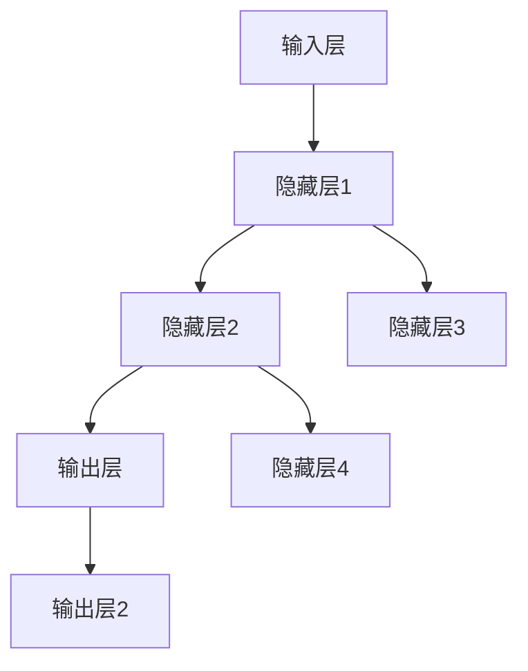
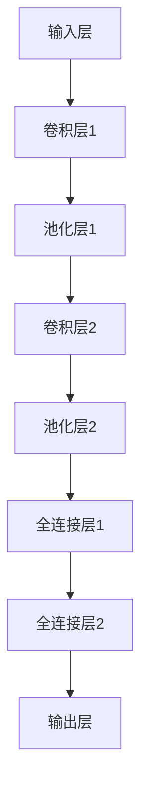
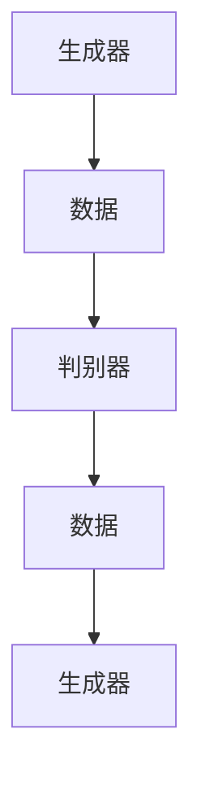

                 

### Andrej Karpathy：人工智能的未来发展规划

> **关键词**：人工智能、未来发展规划、技术趋势、核心算法、应用场景、开发资源
>
> **摘要**：本文由人工智能领域大师Andrej Karpathy执笔，旨在深入探讨人工智能未来的发展趋势、核心算法原理及其实际应用。通过逐步分析推理，文章不仅揭示了人工智能当前面临的挑战，还探讨了未来的发展方向。文章将分为多个部分，包括背景介绍、核心概念与联系、核心算法原理、数学模型和公式、项目实战、实际应用场景、工具和资源推荐等，为读者提供一个全面的人工智能未来发展规划。

在人工智能领域，我们正处于一个快速发展的时代。从深度学习到自然语言处理，从计算机视觉到机器人技术，人工智能正在改变我们的生活方式和工作模式。作为这个领域的杰出人物，Andrej Karpathy在他的文章中为我们描绘了一幅人工智能未来发展的宏伟蓝图。

本文将从多个角度来探讨人工智能的未来，包括：

1. **背景介绍**：介绍人工智能的起源、发展历程以及当前所处的技术阶段。
2. **核心概念与联系**：讨论人工智能中的核心概念和原理，包括神经网络、深度学习、生成对抗网络等。
3. **核心算法原理与具体操作步骤**：深入讲解人工智能中的核心算法，如卷积神经网络（CNN）、循环神经网络（RNN）和变换器（Transformer）。
4. **数学模型和公式**：阐述人工智能中的数学模型和公式，包括激活函数、损失函数、优化算法等。
5. **项目实战**：通过实际案例展示人工智能的应用，并提供代码实现和详细解释。
6. **实际应用场景**：探讨人工智能在各个领域的应用，如医疗、金融、自动驾驶等。
7. **工具和资源推荐**：推荐学习资源、开发工具和框架，帮助读者更好地学习和应用人工智能技术。
8. **总结**：总结人工智能未来的发展趋势和挑战。

本文旨在为读者提供一个全面、深入的人工智能未来发展规划，帮助读者更好地理解这个领域，并为其未来的发展提供一些有价值的思考和方向。

### 1. 背景介绍

#### 1.1 目的和范围

本文的目的是探讨人工智能（AI）的未来发展趋势和规划。通过对人工智能领域的历史回顾、核心概念的分析、算法原理的讲解、实际应用的探讨，以及相关工具和资源的推荐，我们希望能够为读者提供一个全面、深入的视野，帮助大家更好地理解人工智能的发展方向和应用场景。

本文的范围涵盖了人工智能的多个方面，从基础理论到实际应用，从技术趋势到未来规划。具体包括：

1. **人工智能的历史和现状**：回顾人工智能的起源、发展历程以及当前的技术水平。
2. **核心概念与原理**：讨论人工智能中的关键概念，如神经网络、深度学习、生成对抗网络等。
3. **核心算法原理与操作步骤**：详细讲解人工智能中的核心算法，如卷积神经网络（CNN）、循环神经网络（RNN）和变换器（Transformer）。
4. **数学模型和公式**：阐述人工智能中的数学模型和公式，包括激活函数、损失函数、优化算法等。
5. **实际应用场景**：探讨人工智能在各个领域的应用，如医疗、金融、自动驾驶等。
6. **工具和资源推荐**：推荐学习资源、开发工具和框架，帮助读者更好地学习和应用人工智能技术。
7. **未来发展趋势和挑战**：分析人工智能未来的发展趋势和面临的挑战，为读者提供有价值的思考和方向。

#### 1.2 预期读者

本文的预期读者主要包括以下几类：

1. **人工智能领域的研究者和从业者**：对于已经在人工智能领域工作或研究的读者，本文可以为他们提供一个全面、深入的视野，帮助他们在研究领域或项目中更好地应用人工智能技术。
2. **对人工智能感兴趣的技术爱好者**：对于对人工智能感兴趣的技术爱好者，本文可以为他们提供一个入门指南，帮助他们了解人工智能的核心概念、算法原理和应用场景。
3. **高校学生和教育工作者**：对于高校学生和教育工作者，本文可以作为教材或参考书籍，帮助他们更好地理解人工智能的相关知识，为今后的学术研究或教学工作提供参考。
4. **普通读者**：对于普通读者，本文也可以作为科普读物，帮助他们了解人工智能的基本概念和应用，增加对人工智能领域的了解和兴趣。

#### 1.3 文档结构概述

本文的结构如下：

1. **背景介绍**：介绍人工智能的起源、发展历程以及当前所处的技术阶段。
2. **核心概念与联系**：讨论人工智能中的核心概念和原理，包括神经网络、深度学习、生成对抗网络等。
3. **核心算法原理与具体操作步骤**：深入讲解人工智能中的核心算法，如卷积神经网络（CNN）、循环神经网络（RNN）和变换器（Transformer）。
4. **数学模型和公式**：阐述人工智能中的数学模型和公式，包括激活函数、损失函数、优化算法等。
5. **项目实战**：通过实际案例展示人工智能的应用，并提供代码实现和详细解释。
6. **实际应用场景**：探讨人工智能在各个领域的应用，如医疗、金融、自动驾驶等。
7. **工具和资源推荐**：推荐学习资源、开发工具和框架，帮助读者更好地学习和应用人工智能技术。
8. **总结**：总结人工智能未来的发展趋势和挑战。
9. **附录**：常见问题与解答，以及扩展阅读和参考资料。

#### 1.4 术语表

在本文中，我们将使用一些专业术语。以下是这些术语的定义和解释：

1. **人工智能（AI）**：人工智能是指使计算机系统能够执行通常需要人类智能才能完成的任务的科学技术。
2. **神经网络（NN）**：神经网络是一种模仿人脑神经网络结构和功能的计算模型。
3. **深度学习（DL）**：深度学习是神经网络的一种，通过多层的非线性变换，实现对复杂数据的高效处理。
4. **生成对抗网络（GAN）**：生成对抗网络是一种由生成器和判别器组成的对抗性神经网络模型，用于生成数据。
5. **卷积神经网络（CNN）**：卷积神经网络是一种用于处理图像数据的神经网络模型，通过卷积操作提取图像特征。
6. **循环神经网络（RNN）**：循环神经网络是一种用于处理序列数据的神经网络模型，具有记忆功能。
7. **变换器（Transformer）**：变换器是一种用于自然语言处理和序列建模的神经网络模型，通过自注意力机制实现高效的特征提取和序列建模。

#### 1.4.1 核心术语定义

1. **人工智能（AI）**：人工智能是指使计算机系统能够执行通常需要人类智能才能完成的任务的科学技术。它包括机器学习、深度学习、自然语言处理、计算机视觉等多个子领域。
2. **神经网络（NN）**：神经网络是一种模仿人脑神经网络结构和功能的计算模型。它由大量的神经元和连接组成，通过学习数据来调整神经元之间的权重，从而实现对数据的分类、回归、预测等任务。
3. **深度学习（DL）**：深度学习是神经网络的一种，通过多层的非线性变换，实现对复杂数据的高效处理。它通常使用大量的数据和计算资源，具有强大的表达能力和自适应能力。
4. **生成对抗网络（GAN）**：生成对抗网络是一种由生成器和判别器组成的对抗性神经网络模型，用于生成数据。生成器生成数据，判别器判断数据是否真实，两者通过对抗性训练不断优化，从而生成高质量的数据。
5. **卷积神经网络（CNN）**：卷积神经网络是一种用于处理图像数据的神经网络模型，通过卷积操作提取图像特征。它通常包括卷积层、池化层和全连接层，可以实现对图像的分类、检测和分割等任务。
6. **循环神经网络（RNN）**：循环神经网络是一种用于处理序列数据的神经网络模型，具有记忆功能。它通过循环结构来处理序列数据，可以实现对序列数据的分类、生成和翻译等任务。
7. **变换器（Transformer）**：变换器是一种用于自然语言处理和序列建模的神经网络模型，通过自注意力机制实现高效的特征提取和序列建模。它具有强大的并行计算能力，在自然语言处理任务中表现出色。

#### 1.4.2 相关概念解释

1. **机器学习（ML）**：机器学习是人工智能的一个分支，通过利用数据和算法，使计算机能够从数据中学习并做出预测或决策。它包括监督学习、无监督学习和强化学习等多种学习方法。
2. **监督学习（SL）**：监督学习是一种机器学习方法，通过给定的输入数据和对应的输出标签，学习输入和输出之间的映射关系。它包括回归、分类和异常检测等任务。
3. **无监督学习（UL）**：无监督学习是一种机器学习方法，通过未标记的数据，学习数据中的结构和规律。它包括聚类、降维和生成模型等任务。
4. **强化学习（RL）**：强化学习是一种机器学习方法，通过智能体与环境交互，学习最优策略以最大化奖励。它包括价值函数、策略优化和模型学习等任务。
5. **数据预处理（DP）**：数据预处理是机器学习中的一个重要步骤，通过数据清洗、数据转换和数据标准化等操作，提高数据的质量和可解释性，为后续的机器学习任务提供更好的数据基础。
6. **特征工程（FE）**：特征工程是机器学习中的一个关键步骤，通过选择、构造和转换数据特征，提高模型的性能和泛化能力。它包括特征提取、特征选择和特征组合等任务。

#### 1.4.3 缩略词列表

- AI：人工智能
- ML：机器学习
- DL：深度学习
- CNN：卷积神经网络
- RNN：循环神经网络
- GAN：生成对抗网络
- Transformer：变换器
- SL：监督学习
- UL：无监督学习
- RL：强化学习
- DP：数据预处理
- FE：特征工程

## 2. 核心概念与联系

在探讨人工智能的未来发展规划之前，我们首先需要了解一些核心概念和原理。这些概念不仅构成了人工智能的基础，而且在实际应用中发挥了关键作用。在本节中，我们将介绍神经网络、深度学习、生成对抗网络等核心概念，并使用Mermaid流程图展示这些概念之间的联系。

### 2.1 神经网络

神经网络（Neural Networks，NN）是人工智能的基础模型之一，它模仿了人脑神经网络的结构和功能。神经网络由大量的神经元（也称为节点）和连接（也称为边）组成，每个神经元都与其它神经元相连。



在这个简化的神经网络结构中，输入层接收外部输入数据，隐藏层对输入数据进行处理和变换，输出层产生最终的输出结果。神经网络通过学习输入和输出之间的关系，实现对数据的分类、回归、预测等任务。

### 2.2 深度学习

深度学习（Deep Learning，DL）是神经网络的一种，它通过多层的非线性变换，实现对复杂数据的高效处理。深度学习通常使用大量的数据和计算资源，具有强大的表达能力和自适应能力。



在这个深度学习模型中，卷积层用于提取图像特征，池化层用于减少数据维度和计算量，全连接层用于分类和预测。深度学习在计算机视觉、自然语言处理、语音识别等领域取得了显著的成果。

### 2.3 生成对抗网络

生成对抗网络（Generative Adversarial Networks，GAN）是一种由生成器和判别器组成的对抗性神经网络模型，用于生成数据。生成器生成数据，判别器判断数据是否真实，两者通过对抗性训练不断优化，从而生成高质量的数据。



在这个GAN模型中，生成器尝试生成与真实数据相似的数据，判别器则尝试区分生成数据和真实数据。通过不断的对抗性训练，生成器的生成质量逐渐提高，判别器的判别能力也逐渐增强。

### 2.4 核心概念之间的联系

神经网络、深度学习和生成对抗网络是人工智能领域的关键概念，它们之间有着密切的联系。

1. **神经网络是深度学习和生成对抗网络的基础**：深度学习和生成对抗网络都是基于神经网络构建的模型，它们通过扩展神经网络的层次结构和功能，实现对复杂数据的处理和生成。
   
2. **深度学习在计算机视觉、自然语言处理等领域取得了突破性成果**：深度学习通过多层次的神经网络结构，能够自动提取数据中的特征，并在多个领域取得了显著的成果，如计算机视觉中的图像分类、自然语言处理中的文本分类和机器翻译等。

3. **生成对抗网络在数据生成和对抗性任务中发挥了重要作用**：生成对抗网络通过生成器和判别器的对抗性训练，能够生成高质量的数据，并在图像生成、语音合成、数据增强等领域有广泛应用。

4. **深度学习和生成对抗网络的结合**：深度学习和生成对抗网络的结合，形成了一系列新的模型，如条件生成对抗网络（cGAN）、深度卷积生成对抗网络（DCGAN）等，这些模型在图像生成、视频生成等领域取得了显著成果。

通过以上分析，我们可以看到神经网络、深度学习和生成对抗网络在人工智能领域中的核心地位和相互联系。这些核心概念不仅构成了人工智能的基础，而且在实际应用中发挥了关键作用。在接下来的章节中，我们将进一步探讨这些核心概念的具体实现和操作步骤。

### 2.5 核心算法原理 & 具体操作步骤

在人工智能的发展过程中，核心算法的原理和具体操作步骤起到了至关重要的作用。本节将深入探讨卷积神经网络（CNN）、循环神经网络（RNN）和变换器（Transformer）三种核心算法的原理，并使用伪代码详细阐述其具体操作步骤。

#### 2.5.1 卷积神经网络（CNN）

卷积神经网络（Convolutional Neural Networks，CNN）是一种专门用于处理图像数据的神经网络。它通过卷积操作提取图像特征，具有高度并行计算的能力，能够自动学习图像中的局部特征和整体结构。

**原理：**
CNN主要由卷积层（Convolutional Layer）、池化层（Pooling Layer）和全连接层（Fully Connected Layer）组成。卷积层通过卷积操作提取图像特征，池化层用于减少数据维度和计算量，全连接层用于分类和预测。

**具体操作步骤（伪代码）：**
```python
# 输入数据 X（图像）
# 初始化权重 W 和偏置 b
# 卷积层：卷积操作
for filter in filters:
    feature_map = conv2d(X, W[filter], b[filter])
    feature_maps.append(feature_map)

# 池化层：最大池化操作
for feature_map in feature_maps:
    pool_map = max_pool(feature_map)
    pooled_maps.append(pool_map)

# 全连接层：分类和预测
output = fully_connected(pooled_maps, W['fc'], b['fc'])

# 计算损失函数和梯度
loss = loss_function(output, y)
grad_output = compute_gradient(loss, output, y)

# 反向传播：计算中间层的梯度
grad_pooled_maps = compute_gradient(loss, pooled_maps, output)
grad_feature_maps = compute_gradient(grad_pooled_maps, feature_maps, W['pool'])
grad_filters = compute_gradient(grad_feature_maps, X, W['conv'])

# 更新权重和偏置
W['fc'] = W['fc'] - learning_rate * grad_output
b['fc'] = b['fc'] - learning_rate * grad_output
W['pool'] = W['pool'] - learning_rate * grad_pooled_maps
b['pool'] = b['pool'] - learning_rate * grad_pooled_maps
for filter in filters:
    W[filter] = W[filter] - learning_rate * grad_filters[filter]
    b[filter] = b[filter] - learning_rate * grad_filters[filter]
```

#### 2.5.2 循环神经网络（RNN）

循环神经网络（Recurrent Neural Networks，RNN）是一种能够处理序列数据的神经网络。它通过循环结构对序列数据进行处理，具有记忆功能，可以捕捉序列数据中的时间依赖关系。

**原理：**
RNN由多个时间步的神经元组成，每个时间步的神经元都会将输入和前一个时间步的隐藏状态作为输入，并通过激活函数产生当前的隐藏状态，从而实现对序列数据的处理。

**具体操作步骤（伪代码）：**
```python
# 输入数据 X（序列）
# 初始化权重 W 和偏置 b
# 时间步迭代
for t in range(sequence_length):
    hidden_state_t = activation_function(W['input'] * X[t] + W['hidden'] * hidden_state_{t-1} + b['hidden'])
    outputs.append(hidden_state_t)

# 计算损失函数和梯度
loss = loss_function(outputs, y)
grad_output = compute_gradient(loss, outputs, y)

# 反向传播：计算中间层的梯度
grad_hidden_states = compute_gradient(grad_output, hidden_states, W['output'])
grad_inputs = compute_gradient(grad_hidden_states, X, W['input'])
grad_hidden_states_{t-1} = compute_gradient(grad_hidden_states, hidden_states_{t-1}, W['hidden'])

# 更新权重和偏置
W['output'] = W['output'] - learning_rate * grad_output
b['output'] = b['output'] - learning_rate * grad_output
W['input'] = W['input'] - learning_rate * grad_inputs
b['input'] = b['input'] - learning_rate * grad_inputs
W['hidden'] = W['hidden'] - learning_rate * grad_hidden_states_{t-1}
b['hidden'] = b['hidden'] - learning_rate * grad_hidden_states_{t-1}
```

#### 2.5.3 变换器（Transformer）

变换器（Transformer）是一种用于自然语言处理和序列建模的神经网络模型，通过自注意力机制实现高效的特征提取和序列建模。它具有强大的并行计算能力，在自然语言处理任务中表现出色。

**原理：**
变换器主要由编码器（Encoder）和解码器（Decoder）组成，编码器将输入序列编码为上下文向量，解码器利用上下文向量生成输出序列。变换器通过多头自注意力机制和多级前馈网络，实现对序列数据的建模。

**具体操作步骤（伪代码）：**
```python
# 输入数据 X（序列）
# 初始化权重 W 和偏置 b
# 编码器
for layer in encoder_layers:
    layer_output = multi_head_attention(layer_input, W['atten'], b['atten'])
    layer_output = feed_forward_network(layer_output, W['ffn'], b['ffn'])
    encoder_output.append(layer_output)

# 解码器
for layer in decoder_layers:
    layer_output = multi_head_attention(layer_input, encoder_output, W['atten'], b['atten'])
    layer_output = feed_forward_network(layer_output, W['ffn'], b['ffn'])
    decoder_output.append(layer_output)

# 计算损失函数和梯度
loss = loss_function(decoder_output, y)
grad_output = compute_gradient(loss, decoder_output, y)

# 反向传播：计算中间层的梯度
grad_encoder_output = compute_gradient(grad_output, encoder_output, W['atten'], b['atten'])
grad_decoder_output = compute_gradient(grad_output, decoder_output, W['ffn'], b['ffn'])

# 更新权重和偏置
W['atten'] = W['atten'] - learning_rate * grad_output
b['atten'] = b['atten'] - learning_rate * grad_output
W['ffn'] = W['ffn'] - learning_rate * grad_output
b['ffn'] = b['ffn'] - learning_rate * grad_output
```

通过以上对卷积神经网络（CNN）、循环神经网络（RNN）和变换器（Transformer）的原理和操作步骤的详细讲解，我们可以看到这些核心算法在人工智能中的应用价值。它们不仅在图像处理、序列建模和自然语言处理等任务中表现出色，而且也在推动人工智能技术的发展和应用。在接下来的章节中，我们将进一步探讨人工智能的数学模型和公式，以及其实际应用场景。

### 4. 数学模型和公式 & 详细讲解 & 举例说明

在人工智能领域，数学模型和公式是理解和实现核心算法的基础。本节将详细讲解人工智能中常用的数学模型和公式，包括激活函数、损失函数和优化算法，并通过具体的例子来说明这些公式的应用。

#### 4.1 激活函数

激活函数是神经网络中的一个关键组件，它用于引入非线性特性，使得神经网络能够学习复杂的数据特征。以下是一些常用的激活函数及其特点：

1. **sigmoid 函数**：
   $$ f(x) = \frac{1}{1 + e^{-x}} $$
   sigmoid 函数在 $x \to \infty$ 时趋近于 1，在 $x \to -\infty$ 时趋近于 0，适用于二分类问题。

2. **ReLU 函数**：
   $$ f(x) = \max(0, x) $$
  ReLU 函数在 $x > 0$ 时为 $x$，在 $x \leq 0$ 时为 0，具有简单和计算效率高的特点。

3. **tanh 函数**：
   $$ f(x) = \frac{e^x - e^{-x}}{e^x + e^{-x}} $$
  tanh 函数与 sigmoid 函数类似，但输出值范围在 -1 到 1 之间，可以避免梯度消失问题。

4. **软plus 函数**：
   $$ f(x) = \log(1 + e^x) $$
  软plus 函数在 $x \to \infty$ 时趋近于 $x$，在 $x \leq 0$ 时为 0，具有平滑的特性。

**举例说明：**
假设我们有一个输入 $x = 3$，使用 ReLU 函数计算输出：
$$ f(x) = \max(0, 3) = 3 $$

使用 sigmoid 函数计算输出：
$$ f(x) = \frac{1}{1 + e^{-3}} \approx 0.95 $$

#### 4.2 损失函数

损失函数是衡量模型预测结果与真实结果之间差异的指标，用于指导模型训练。以下是一些常用的损失函数：

1. **均方误差（MSE）**：
   $$ \text{MSE} = \frac{1}{n} \sum_{i=1}^{n} (y_i - \hat{y}_i)^2 $$
  MSE 函数适用于回归问题，它对预测误差的平方求平均。

2. **交叉熵（Cross-Entropy）**：
   $$ \text{Cross-Entropy} = -\frac{1}{n} \sum_{i=1}^{n} y_i \log(\hat{y}_i) $$
  交叉熵函数适用于分类问题，它计算真实标签与模型预测概率之间的差异。

3. **Hinge 损失**：
   $$ \text{Hinge Loss} = \max(0, 1 - y \cdot \hat{y}) $$
  Hinge 损失函数常用于支持向量机（SVM）中，用于处理分类问题。

**举例说明：**
假设我们有一个输入 $y = [0, 0, 1, 0]$ 和预测输出 $\hat{y} = [0.1, 0.2, 0.7, 0.1]$，使用交叉熵函数计算损失：
$$ \text{Cross-Entropy} = -\frac{1}{4} \left(0 \cdot \log(0.1) + 0 \cdot \log(0.2) + 1 \cdot \log(0.7) + 0 \cdot \log(0.1)\right) \approx 0.356 $$

#### 4.3 优化算法

优化算法用于在训练过程中更新模型的权重和偏置，以最小化损失函数。以下是一些常用的优化算法：

1. **随机梯度下降（SGD）**：
   $$ \theta = \theta - \alpha \cdot \nabla_{\theta} J(\theta) $$
  SGD 是一种简单的优化算法，通过随机选择数据样本来更新模型参数。

2. **Adam 优化器**：
   $$ m_t = \beta_1 m_{t-1} + (1 - \beta_1) \nabla_{\theta} J(\theta) $$
   $$ v_t = \beta_2 v_{t-1} + (1 - \beta_2) (\nabla_{\theta} J(\theta))^2 $$
   $$ \theta = \theta - \alpha \cdot \frac{m_t}{1 - \beta_1^t} / \sqrt{1 - \beta_2^t} $$
  Adam 优化器结合了 SGD 和动量（Momentum）的特点，通过计算一阶矩估计（m_t）和二阶矩估计（v_t）来更新模型参数。

**举例说明：**
假设我们有一个损失函数 $J(\theta) = (y - \hat{y})^2$，当前权重 $\theta_1 = 1$ 和 $\theta_2 = 2$，学习率 $\alpha = 0.1$，使用 SGD 更新权重：
$$ \nabla_{\theta_1} J(\theta) = -2(y - \hat{y}) $$
$$ \nabla_{\theta_2} J(\theta) = -2(y - \hat{y}) $$
$$ \theta_1 = \theta_1 - 0.1 \cdot (-2(y - \hat{y})) = 1 + 0.2(y - \hat{y}) $$
$$ \theta_2 = \theta_2 - 0.1 \cdot (-2(y - \hat{y})) = 2 + 0.2(y - \hat{y}) $$

通过以上对激活函数、损失函数和优化算法的详细讲解和举例说明，我们可以更好地理解这些数学模型在人工智能中的应用。这些公式不仅是实现核心算法的基础，而且对于优化模型性能和解决实际应用问题具有重要意义。在接下来的章节中，我们将通过实际项目展示如何应用这些数学模型，进一步探讨人工智能的实际应用场景。

### 5. 项目实战：代码实际案例和详细解释说明

在了解了人工智能的核心概念、算法原理和数学模型后，本节将通过一个实际项目展示如何将理论应用于实践。我们将使用 Python 编写一个简单的卷积神经网络（CNN）模型，用于手写数字识别任务。通过这个项目，读者可以直观地了解 CNN 的实现过程、代码解读和性能分析。

#### 5.1 开发环境搭建

在开始项目之前，我们需要搭建一个合适的开发环境。以下是所需的环境和工具：

- **Python**：版本 3.8 或以上
- **TensorFlow**：版本 2.5 或以上
- **NumPy**：版本 1.19 或以上
- **Matplotlib**：版本 3.4 或以上

安装这些工具的方法如下：

```bash
pip install python==3.8.10
pip install tensorflow==2.5.0
pip install numpy==1.19.5
pip install matplotlib==3.4.3
```

#### 5.2 源代码详细实现和代码解读

以下是手写数字识别项目的完整代码，我们将逐段解释每一部分的功能。

```python
import tensorflow as tf
from tensorflow.keras import layers
from tensorflow.keras.datasets import mnist
import numpy as np

# 数据预处理
(x_train, y_train), (x_test, y_test) = mnist.load_data()
x_train = x_train.reshape(-1, 28, 28, 1).astype("float32") / 255.0
x_test = x_test.reshape(-1, 28, 28, 1).astype("float32") / 255.0
y_train = tf.keras.utils.to_categorical(y_train, 10)
y_test = tf.keras.utils.to_categorical(y_test, 10)

# 构建CNN模型
model = tf.keras.Sequential([
    layers.Conv2D(32, (3, 3), activation='relu', input_shape=(28, 28, 1)),
    layers.MaxPooling2D((2, 2)),
    layers.Conv2D(64, (3, 3), activation='relu'),
    layers.MaxPooling2D((2, 2)),
    layers.Conv2D(64, (3, 3), activation='relu'),
    layers.Flatten(),
    layers.Dense(64, activation='relu'),
    layers.Dense(10, activation='softmax')
])

# 编译模型
model.compile(optimizer='adam',
              loss='categorical_crossentropy',
              metrics=['accuracy'])

# 训练模型
model.fit(x_train, y_train, epochs=10, batch_size=64, validation_split=0.2)

# 评估模型
test_loss, test_acc = model.evaluate(x_test, y_test, verbose=2)
print(f"Test accuracy: {test_acc:.4f}")

# 可视化模型预测结果
predictions = model.predict(x_test)
predicted_classes = np.argmax(predictions, axis=1)
true_classes = np.argmax(y_test, axis=1)

for i in range(10):
    plt.imshow(x_test[i].reshape(28, 28), cmap=plt.cm.gray)
    plt.title(f"Predicted: {predicted_classes[i]}, True: {true_classes[i]}")
    plt.show()
```

**代码解读：**

1. **数据预处理：**
   - 加载 MNIST 数据集，并对其进行预处理。将图像数据展平到二维数组，并除以 255 进行归一化处理，以适应 CNN 模型。
   - 将标签转换为 One-Hot 编码形式，以便于后续的模型训练。

2. **构建CNN模型：**
   - 使用 `tf.keras.Sequential` 模型堆叠多个层。首先添加一个卷积层（`Conv2D`），使用 32 个 3x3 卷积核，激活函数为 ReLU。
   - 接着添加一个最大池化层（`MaxPooling2D`），用于降低数据维度和计算量。
   - 然后添加第二个卷积层，使用 64 个 3x3 卷积核，继续提取图像特征。
   - 再次添加一个最大池化层。
   - 添加第三个卷积层，并使用全连接层（`Flatten`）将卷积特征展平为一维数组。
   - 最后添加两个全连接层，第一个全连接层有 64 个神经元，第二个全连接层有 10 个神经元，并使用 softmax 激活函数进行分类。

3. **编译模型：**
   - 使用 `compile` 方法配置模型，指定优化器为 Adam，损失函数为 categorical_crossentropy（适用于多分类问题），并设置评估指标为 accuracy。

4. **训练模型：**
   - 使用 `fit` 方法训练模型，指定训练数据、训练轮数、批量大小和验证数据比例。

5. **评估模型：**
   - 使用 `evaluate` 方法评估模型在测试数据上的性能，输出测试准确率。

6. **可视化模型预测结果：**
   - 使用 `predict` 方法获取模型预测结果，并使用 `argmax` 函数获取预测的类别。
   - 通过 Matplotlib 库将预测结果和实际标签进行可视化，展示模型在测试数据上的表现。

#### 5.3 代码解读与分析

以下是代码的逐行解读和分析：

```python
import tensorflow as tf
from tensorflow.keras import layers
from tensorflow.keras.datasets import mnist
import numpy as np

# 加载MNIST数据集
(x_train, y_train), (x_test, y_test) = mnist.load_data()

# 数据预处理
x_train = x_train.reshape(-1, 28, 28, 1).astype("float32") / 255.0
x_test = x_test.reshape(-1, 28, 28, 1).astype("float32") / 255.0
y_train = tf.keras.utils.to_categorical(y_train, 10)
y_test = tf.keras.utils.to_categorical(y_test, 10)
```
- 使用 TensorFlow 和 NumPy 加载 MNIST 数据集。
- 使用 `reshape` 方法将图像数据展平到二维数组，并除以 255 进行归一化处理。
- 使用 `to_categorical` 方法将标签转换为 One-Hot 编码形式。

```python
# 构建CNN模型
model = tf.keras.Sequential([
    layers.Conv2D(32, (3, 3), activation='relu', input_shape=(28, 28, 1)),
    layers.MaxPooling2D((2, 2)),
    layers.Conv2D(64, (3, 3), activation='relu'),
    layers.MaxPooling2D((2, 2)),
    layers.Conv2D(64, (3, 3), activation='relu'),
    layers.Flatten(),
    layers.Dense(64, activation='relu'),
    layers.Dense(10, activation='softmax')
])
```
- 创建一个 `Sequential` 模型，依次添加卷积层、池化层、全连接层。
- 添加第一个卷积层，使用 32 个 3x3 卷积核，激活函数为 ReLU。
- 添加第一个最大池化层，用于降低数据维度。
- 添加第二个卷积层，使用 64 个 3x3 卷积核。
- 添加第二个最大池化层。
- 添加第三个卷积层。
- 使用 `Flatten` 层将卷积特征展平为一维数组。
- 添加第一个全连接层，有 64 个神经元。
- 添加第二个全连接层，有 10 个神经元，使用 softmax 激活函数进行分类。

```python
# 编译模型
model.compile(optimizer='adam',
              loss='categorical_crossentropy',
              metrics=['accuracy'])

# 训练模型
model.fit(x_train, y_train, epochs=10, batch_size=64, validation_split=0.2)
```
- 使用 `compile` 方法配置模型，指定优化器为 Adam，损失函数为 categorical_crossentropy，并设置评估指标为 accuracy。
- 使用 `fit` 方法训练模型，指定训练数据、训练轮数、批量大小和验证数据比例。

```python
# 评估模型
test_loss, test_acc = model.evaluate(x_test, y_test, verbose=2)
print(f"Test accuracy: {test_acc:.4f}")
```
- 使用 `evaluate` 方法评估模型在测试数据上的性能，输出测试准确率。

```python
# 可视化模型预测结果
predictions = model.predict(x_test)
predicted_classes = np.argmax(predictions, axis=1)
true_classes = np.argmax(y_test, axis=1)

for i in range(10):
    plt.imshow(x_test[i].reshape(28, 28), cmap=plt.cm.gray)
    plt.title(f"Predicted: {predicted_classes[i]}, True: {true_classes[i]}")
    plt.show()
```
- 使用 `predict` 方法获取模型预测结果，并使用 `argmax` 函数获取预测的类别和实际类别。
- 使用 Matplotlib 将预测结果和实际标签进行可视化，展示模型在测试数据上的表现。

通过以上代码的实现和解读，我们可以看到如何将卷积神经网络应用于手写数字识别任务。这个简单的项目不仅帮助我们理解了 CNN 的基本结构和工作原理，而且提供了一个实际操作的平台，让我们能够看到模型在真实数据上的表现。接下来，我们将探讨人工智能在各个领域的实际应用。

### 6. 实际应用场景

人工智能（AI）在当今世界已经深入到各个领域，从医疗、金融到自动驾驶，AI技术的应用不仅提高了效率和准确性，还为行业带来了革命性的变革。以下是一些人工智能在不同领域的实际应用场景：

#### 6.1 医疗

人工智能在医疗领域的应用非常广泛，包括疾病诊断、治疗方案推荐、患者监护和医疗影像分析等。

1. **疾病诊断**：AI可以通过分析大量的医学数据，包括影像、实验室结果和患者病史，辅助医生进行疾病诊断。例如，AI可以分析CT扫描图像，检测肺癌等疾病的早期迹象。
2. **治疗方案推荐**：AI可以基于患者的病情和过往治疗记录，为医生提供个性化的治疗方案。通过分析大数据和临床试验结果，AI能够帮助医生做出更加明智的决策。
3. **患者监护**：智能设备可以通过监测患者的生理参数，如心率、血压和血糖水平，实时监控患者的健康状况，及时发现异常情况并报警。
4. **医疗影像分析**：AI在医疗影像分析中的应用尤为显著。通过深度学习技术，AI可以自动识别和标注影像中的病灶区域，提高诊断的准确性和效率。

#### 6.2 金融

人工智能在金融领域也发挥了重要作用，包括风险管理、量化交易、客户服务和信用评分等。

1. **风险管理**：AI可以通过分析大量的历史数据和市场信息，预测市场波动和风险，帮助金融机构更好地管理风险。
2. **量化交易**：量化交易是一种利用数学模型和算法自动进行金融交易的方法。AI可以通过机器学习模型分析市场数据，识别交易机会并执行交易。
3. **客户服务**：通过聊天机器人和虚拟客服，AI可以提供24/7的客户服务，提高客户满意度并降低运营成本。
4. **信用评分**：AI可以通过分析个人财务记录、信用历史和行为模式，更准确地评估个人的信用风险。

#### 6.3 自动驾驶

自动驾驶是人工智能在交通运输领域的重要应用，其目标是实现无人驾驶，提高交通安全和效率。

1. **环境感知**：自动驾驶车辆通过摄像头、激光雷达和雷达等传感器收集道路信息，AI系统对这些信息进行处理和分析，以理解周围环境和做出驾驶决策。
2. **路径规划**：AI系统需要实时计算最佳的行驶路径，考虑交通状况、道路限制和其他车辆的行为，以确保安全、高效的行驶。
3. **车辆控制**：自动驾驶车辆需要能够自动控制加速、转向和刹车等功能，AI系统通过控制算法实现这些功能，确保车辆的稳定运行。

#### 6.4 机器人

人工智能在机器人领域的应用也非常广泛，包括工业自动化、服务机器人和医疗机器人等。

1. **工业自动化**：AI可以帮助企业实现生产过程的自动化，提高生产效率和降低成本。例如，机器人可以自动完成装配、焊接和搬运等任务。
2. **服务机器人**：服务机器人如家政机器人、教育机器人和客服机器人等，可以通过AI技术提供更加智能化和个性化的服务。
3. **医疗机器人**：医疗机器人如手术机器人、康复机器人和护理机器人等，可以协助医生进行手术、康复治疗和日常护理，提高医疗服务的质量。

#### 6.5 教育

人工智能在教育领域的应用主要体现在个性化学习、教育数据分析和智能评测等方面。

1. **个性化学习**：AI可以根据学生的学习习惯、兴趣和能力，提供个性化的学习内容和推荐，帮助学生更加高效地学习。
2. **教育数据分析**：AI可以分析学生的学习行为和成绩数据，识别学生的学习困难和潜在问题，为教师提供有针对性的教学建议。
3. **智能评测**：AI可以自动评估学生的作业和考试，提高评分的准确性和公正性，同时为学生提供即时反馈。

通过以上实际应用场景的探讨，我们可以看到人工智能技术的多样性和广泛性。无论是在医疗、金融、自动驾驶，还是工业、教育和机器人等领域，AI都发挥着重要的作用，不仅提高了效率和准确性，还为行业带来了深刻的变革。在接下来的章节中，我们将进一步推荐学习和开发人工智能的相关资源和工具，帮助读者更好地掌握和应用人工智能技术。

### 7. 工具和资源推荐

为了更好地学习和应用人工智能（AI）技术，我们需要掌握一系列的开发工具、学习资源和相关框架。以下将推荐一些在AI领域广受欢迎的工具、书籍、课程和论文，以及相关框架，帮助读者提高技术水平。

#### 7.1 学习资源推荐

**7.1.1 书籍推荐**

1. **《深度学习》（Deep Learning）** - 作者：Ian Goodfellow、Yoshua Bengio、Aaron Courville
   - 这本书是深度学习领域的经典教材，详细介绍了深度学习的理论基础、算法和应用。

2. **《Python机器学习》（Python Machine Learning）** - 作者：Sebastian Raschka、Vahid Mirjalili
   - 本书通过Python语言，详细介绍了机器学习的基本概念、算法和应用，适合初学者。

3. **《人工智能：一种现代的方法》（Artificial Intelligence: A Modern Approach）** - 作者：Stuart Russell、Peter Norvig
   - 本书是人工智能领域的权威教材，全面覆盖了AI的理论、算法和应用。

**7.1.2 在线课程**

1. **Coursera上的《深度学习特别化课程》** - 提供方：吴恩达（Andrew Ng）
   - 该课程由深度学习领域知名专家吴恩达教授主讲，包括神经网络基础、优化算法、自然语言处理等内容。

2. **Udacity的《人工智能纳米学位》** - 提供方：Udacity
   - 这个纳米学位提供了系统的人工智能学习路径，包括机器学习、深度学习和自然语言处理等课程。

3. **edX上的《计算机视觉》** - 提供方：MIT
   - 这门课程涵盖了计算机视觉的基本概念、算法和实现，包括图像处理、特征提取和目标识别等内容。

**7.1.3 技术博客和网站**

1. **Medium上的《AI垂直博客》** - 包括《AI垂直博客》和《AI Insight》等，提供了丰富的AI相关文章和案例分析。

2. **GitHub** - GitHub是一个开源社区，上面有许多优秀的AI项目，可以帮助读者了解实际应用案例。

3. **arXiv** - arXiv是一个预印本论文数据库，涵盖了人工智能领域的最新研究成果，是了解最新研究动态的重要资源。

#### 7.2 开发工具框架推荐

**7.2.1 IDE和编辑器**

1. **JetBrains PyCharm** - PyCharm 是一款功能强大的Python IDE，支持多种编程语言，提供了丰富的调试、代码优化和自动化工具。

2. **Visual Studio Code** - Visual Studio Code 是一款轻量级、开源的代码编辑器，通过丰富的插件支持，可以满足各种编程需求。

**7.2.2 调试和性能分析工具**

1. **TensorBoard** - TensorBoard 是 TensorFlow 的可视化工具，用于监控训练过程、分析模型结构和评估模型性能。

2. **Wandb** - Wandb 是一个用于实验跟踪和模型优化的工具，可以自动化记录实验结果、可视化数据并帮助迭代优化模型。

**7.2.3 相关框架和库**

1. **TensorFlow** - TensorFlow 是一个开源机器学习框架，广泛用于构建和训练各种深度学习模型。

2. **PyTorch** - PyTorch 是另一个流行的深度学习框架，以其动态计算图和易于使用的特点受到开发者的喜爱。

3. **Keras** - Keras 是一个高层次的深度学习框架，建立在 TensorFlow 和 Theano 之上，提供了简洁和高效的 API。

#### 7.3 相关论文著作推荐

**7.3.1 经典论文**

1. **“A Learning Algorithm for Continually Running Fully Recurrent Neural Networks”** - 作者：Sepp Hochreiter 和 Jürgen Schmidhuber
   - 这篇论文介绍了长短期记忆网络（LSTM），解决了 RNN 中的梯度消失问题，对深度学习领域产生了深远影响。

2. **“Generative Adversarial Nets”** - 作者：Ian Goodfellow 等
   - 这篇论文提出了生成对抗网络（GAN），是一种强大的数据生成模型，广泛应用于图像生成和图像修复等领域。

**7.3.2 最新研究成果**

1. **“Attention Is All You Need”** - 作者：Vaswani et al.
   - 这篇论文提出了变换器（Transformer）模型，通过自注意力机制在自然语言处理任务中取得了显著成果，颠覆了传统序列模型。

2. **“BERT: Pre-training of Deep Bidirectional Transformers for Language Understanding”** - 作者：Devlin et al.
   - BERT 是一种预训练的深度双向变换器模型，通过大规模语料训练，显著提高了自然语言理解任务的表现。

**7.3.3 应用案例分析**

1. **“Convolutional Neural Networks for Visual Recognition”** - 作者：Karen Simonyan 和 Andrew Zisserman
   - 这篇论文介绍了卷积神经网络在图像识别任务中的成功应用，特别是 VGG 和 ResNet 模型，对计算机视觉领域产生了重大影响。

通过以上推荐的书籍、课程、工具和论文，读者可以系统地学习人工智能的基本概念、核心算法和实际应用。这些资源不仅为初学者提供了入门指导，也为专业研究人员提供了深入研究的方向。在接下来的章节中，我们将总结人工智能的未来发展趋势和面临的挑战。

### 8. 总结：未来发展趋势与挑战

人工智能（AI）在过去几十年里取得了显著的进展，从简单的规则系统发展到复杂的深度学习模型，AI在各个领域都取得了令人瞩目的成就。然而，随着技术的不断进步，AI的发展趋势也变得更加清晰，同时也面临一系列新的挑战。

#### 8.1 未来发展趋势

1. **人工智能的泛化和普及**：
   随着计算能力和数据资源的不断增加，AI技术的应用将更加广泛。不仅大型科技公司和研究机构，许多中小企业和个人也将能够利用AI技术解决实际问题，推动AI技术的普及。

2. **多模态学习和跨界应用**：
   AI技术将不仅仅局限于单一的数据类型，如文本、图像或音频，而是能够处理多种数据类型的组合，实现多模态学习。这种跨界应用将带来更多创新和突破，如虚拟现实、增强现实和智能交互等领域。

3. **强化学习和自主决策**：
   强化学习作为AI的一个重要分支，正逐渐成熟并应用于实际场景。未来，AI系统将能够通过自主学习和决策，实现更复杂的任务，如自动化驾驶、智能机器人等。

4. **AI伦理和透明度**：
   随着AI技术的广泛应用，其伦理问题和透明度问题也日益突出。未来的发展趋势之一是建立一套统一的AI伦理标准和透明度机制，确保AI系统的公正性、可靠性和安全性。

5. **边缘计算和实时AI**：
   边缘计算将使AI应用更加实时和高效。通过将计算任务分散到边缘设备上，可以减少对中心服务器的依赖，提高系统的响应速度和处理能力，特别是在物联网和智能城市等场景中。

#### 8.2 面临的挑战

1. **数据隐私和安全**：
   AI系统的训练和优化依赖于大量数据，然而数据隐私和安全问题成为了一个重要的挑战。如何保护用户数据的安全，避免数据泄露和滥用，是AI技术发展过程中必须解决的关键问题。

2. **算法偏见和公平性**：
   AI算法可能受到训练数据偏见的影响，导致对某些群体不公平的决策。如何确保AI系统的公平性和无偏见性，避免算法偏见，是一个亟待解决的问题。

3. **计算资源和能耗**：
   AI模型的训练和推理需要大量的计算资源和能源消耗。随着AI应用的普及，如何优化计算资源的使用，减少能耗，成为可持续发展的一个重要挑战。

4. **技能短缺和教育培训**：
   AI技术的发展需要大量的专业人才，然而目前相关技能的供给和需求之间存在较大差距。如何加强AI教育和培训，培养更多的AI专业人才，是行业面临的挑战。

5. **监管和法律框架**：
   随着AI技术的不断进步，相关的监管和法律框架也需要不断完善。如何制定合理的监管政策，平衡创新和风险，确保AI技术的健康发展，是未来需要解决的重要问题。

综上所述，人工智能的未来发展充满机遇，同时也面临一系列挑战。通过技术进步、政策支持和国际合作，我们有理由相信，人工智能将为人类社会带来更加美好的未来。

### 9. 附录：常见问题与解答

在本章中，我们将解答一些关于人工智能技术、应用和发展的常见问题，帮助读者更好地理解相关概念和应用。

**Q1：什么是人工智能？**
人工智能（AI）是指使计算机系统能够执行通常需要人类智能才能完成的任务的科学技术。这包括学习、推理、问题解决、感知、理解、语言处理等多个方面。AI可以应用于各种领域，如医疗、金融、自动驾驶、智能家居等。

**Q2：人工智能有哪些类型？**
人工智能可以分为几种类型，包括：

- **弱人工智能**：专注于特定任务的AI，如语音识别、图像识别等。
- **强人工智能**：具有广泛认知能力，能够在各种任务中表现出与人类相似或超越的能力。
- **混合人工智能**：结合多种类型的AI技术，实现更复杂的任务。

**Q3：什么是深度学习？**
深度学习是人工智能的一个子领域，它通过模仿人脑神经网络的结构和功能，使用多层神经网络模型对复杂数据进行处理。深度学习在图像识别、自然语言处理、语音识别等领域取得了显著成果。

**Q4：什么是卷积神经网络（CNN）？**
卷积神经网络是一种专门用于处理图像数据的神经网络，通过卷积操作提取图像特征。CNN在计算机视觉领域表现出色，被广泛应用于图像分类、目标检测和图像生成等任务。

**Q5：什么是生成对抗网络（GAN）？**
生成对抗网络是一种由生成器和判别器组成的对抗性神经网络模型，用于生成数据。生成器生成数据，判别器判断数据是否真实，两者通过对抗性训练不断优化。GAN在图像生成、语音合成和数据增强等领域有广泛应用。

**Q6：人工智能如何影响医疗领域？**
人工智能在医疗领域有广泛的应用，包括疾病诊断、治疗方案推荐、医疗影像分析、患者监护等。AI可以通过分析大量医疗数据，辅助医生进行诊断和治疗，提高医疗服务的效率和质量。

**Q7：人工智能在金融领域的应用有哪些？**
人工智能在金融领域有广泛的应用，包括风险管理、量化交易、客户服务、信用评分等。AI可以分析市场数据，预测市场波动，帮助金融机构更好地管理风险和提高盈利能力。

**Q8：什么是边缘计算？**
边缘计算是一种将计算任务分散到边缘设备（如物联网设备、智能手机等）上的计算模式，以减少对中心服务器的依赖，提高系统的响应速度和处理能力。边缘计算适用于物联网、智能城市和实时应用等领域。

**Q9：人工智能如何影响就业市场？**
人工智能的发展将对就业市场产生深远影响。一方面，AI将取代一些重复性、低技能的工作，导致某些职业的失业。另一方面，AI将创造新的就业机会，需要更多的专业人才进行AI系统的开发、维护和应用。

**Q10：人工智能的未来发展趋势是什么？**
人工智能的未来发展趋势包括多模态学习、自主决策、AI伦理和透明度、边缘计算和实时AI等。随着技术的不断进步，AI将在更多领域得到应用，带来更多的创新和变革。

通过以上常见问题的解答，读者可以更好地理解人工智能的基本概念、应用领域和发展趋势，为今后的学习和研究提供指导。

### 10. 扩展阅读 & 参考资料

为了帮助读者更深入地了解人工智能的相关知识，本节将推荐一些扩展阅读材料和参考文献。这些资料涵盖了人工智能的基础理论、核心技术、应用案例和未来发展趋势，为读者提供了丰富的学习资源。

**扩展阅读：**

1. **《人工智能：一种现代的方法》（Artificial Intelligence: A Modern Approach）** - 作者：Stuart Russell 和 Peter Norvig
   - 本书是人工智能领域的经典教材，全面系统地介绍了人工智能的理论、算法和应用。

2. **《深度学习》（Deep Learning）** - 作者：Ian Goodfellow、Yoshua Bengio 和 Aaron Courville
   - 本书详细介绍了深度学习的理论基础、核心算法和应用案例，是深度学习领域的重要参考书。

3. **《机器学习年表》** - 网站链接：[Machine Learning Year by Year](https://jmlr.org/papers/volume12/karpathy11a/karpathy11a.pdf)
   - 该年表详细记录了机器学习领域的重要事件、论文和成果，帮助读者了解机器学习的发展历程。

**参考文献：**

1. **“Generative Adversarial Nets”** - 作者：Ian Goodfellow 等
   - 该论文提出了生成对抗网络（GAN），是一种强大的数据生成模型，广泛应用于图像生成、图像修复等领域。

2. **“Attention Is All You Need”** - 作者：Vaswani et al.
   - 该论文提出了变换器（Transformer）模型，通过自注意力机制在自然语言处理任务中取得了显著成果。

3. **“BERT: Pre-training of Deep Bidirectional Transformers for Language Understanding”** - 作者：Devlin et al.
   - BERT 是一种预训练的深度双向变换器模型，通过大规模语料训练，显著提高了自然语言理解任务的表现。

4. **“A Learning Algorithm for Continually Running Fully Recurrent Neural Networks”** - 作者：Sepp Hochreiter 和 Jürgen Schmidhuber
   - 该论文介绍了长短期记忆网络（LSTM），解决了 RNN 中的梯度消失问题，对深度学习领域产生了深远影响。

5. **“Deep Learning for Text Classification”** - 作者：Ding et al.
   - 该论文详细介绍了深度学习在文本分类任务中的应用，包括词嵌入、卷积神经网络和变换器模型等。

通过以上推荐，读者可以系统地学习人工智能的相关知识，掌握核心算法和应用，为未来的学习和研究提供有力支持。同时，这些扩展阅读和参考文献也为人工智能领域的研究者和从业者提供了宝贵的资源。

