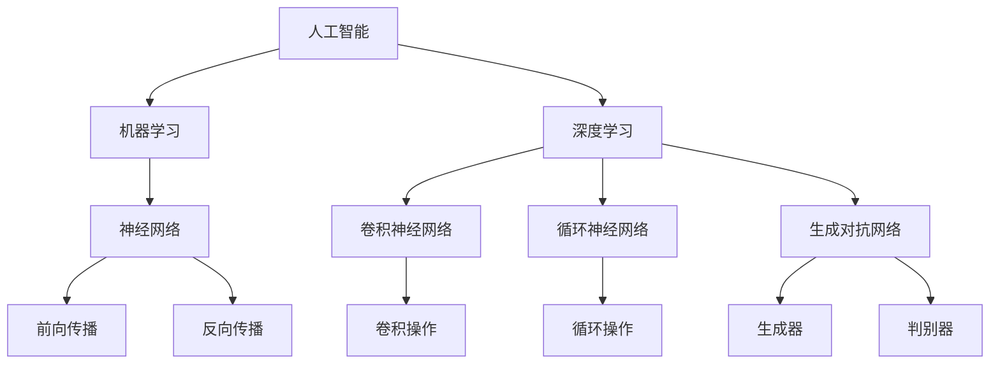

                 

### Andrej Karpathy：人工智能的未来发展规划

> **关键词**：人工智能（AI）、未来规划、技术发展、核心算法、数学模型、应用场景
> 
> **摘要**：本文深入探讨了人工智能（AI）领域未来发展的整体规划，包括核心概念、算法原理、数学模型及实际应用等。通过详细的分析和逻辑推理，本文旨在为读者提供关于AI领域的全面见解，帮助大家了解这一前沿科技的未来趋势和挑战。

### 1. 背景介绍

#### 1.1 目的和范围

本文旨在探讨人工智能（AI）在未来一段时间内的发展规划，重点关注以下几个关键方面：
- **核心概念与联系**：阐述AI领域的关键概念及其相互关系，使用Mermaid流程图展示。
- **核心算法原理**：介绍AI领域的核心算法，通过伪代码详细阐述其原理和操作步骤。
- **数学模型和公式**：讲解AI领域的重要数学模型和公式，并通过实际例子进行说明。
- **项目实战**：提供代码实际案例，详细解释其实现过程和原理。
- **实际应用场景**：讨论AI技术在各个领域的应用场景，包括开发工具和资源的推荐。

#### 1.2 预期读者

本文面向对人工智能感兴趣的读者，特别是以下几类人群：
- AI和机器学习初学者
- 计算机科学和工程专业的学生和从业者
- 对AI技术有深入研究和应用的专家
- 对未来科技发展感兴趣的一般读者

#### 1.3 文档结构概述

本文结构如下：

1. **背景介绍**：介绍文章的目的和范围，预期读者以及文档结构。
2. **核心概念与联系**：通过Mermaid流程图展示AI领域的关键概念及其相互关系。
3. **核心算法原理**：详细阐述AI领域的核心算法原理，使用伪代码进行说明。
4. **数学模型和公式**：讲解AI领域的重要数学模型和公式，并通过实际例子进行说明。
5. **项目实战**：提供代码实际案例，详细解释其实现过程和原理。
6. **实际应用场景**：讨论AI技术在各个领域的应用场景，包括开发工具和资源的推荐。
7. **总结**：总结AI领域的未来发展趋势和挑战。
8. **附录**：常见问题与解答。
9. **扩展阅读与参考资料**：推荐相关学习资源、工具和论文。

#### 1.4 术语表

在本文中，我们将使用以下术语：

#### 1.4.1 核心术语定义

- **人工智能（AI）**：模拟人类智能行为的计算机系统，能够感知、学习、推理和决策。
- **机器学习（ML）**：一种AI技术，通过数据训练模型，使计算机具备自主学习和改进能力。
- **深度学习（DL）**：一种机器学习技术，通过多层神经网络模拟人脑处理信息的方式。
- **神经网络（NN）**：一种模拟人脑神经元连接和通信的计算模型。

#### 1.4.2 相关概念解释

- **模型训练**：将数据输入模型，通过优化参数使模型具备预测能力的过程。
- **反向传播**：一种用于训练神经网络的算法，通过计算误差梯度来更新模型参数。
- **激活函数**：用于确定神经元是否激活的函数，常用于深度学习模型中。

#### 1.4.3 缩略词列表

- **GPU**：图形处理单元（Graphics Processing Unit）
- **CNN**：卷积神经网络（Convolutional Neural Network）
- **RNN**：循环神经网络（Recurrent Neural Network）
- **GAN**：生成对抗网络（Generative Adversarial Network）

### 2. 核心概念与联系

在探讨AI的未来发展之前，我们首先需要了解一些核心概念及其相互关系。以下是通过Mermaid绘制的流程图，展示了AI领域的关键概念和它们的联系。



在这幅流程图中，我们可以看到：

- **人工智能（A）**是整个领域的核心，涵盖机器学习和深度学习。
- **机器学习（B）**是一种通过数据训练模型的技术，是AI的基础。
- **深度学习（C）**是机器学习的一种，通过多层神经网络模拟人脑处理信息。
- **神经网络（D）**是模拟人脑神经元连接和通信的计算模型。
- **卷积神经网络（E）**、**循环神经网络（F）**和**生成对抗网络（G）**是深度学习的具体应用。

接下来，我们将进一步探讨这些核心概念及其相互关系。

### 3. 核心算法原理 & 具体操作步骤

在AI领域，核心算法是模型训练和预测的关键。以下将介绍深度学习中的核心算法，包括卷积神经网络（CNN）、循环神经网络（RNN）和生成对抗网络（GAN），并使用伪代码详细阐述其原理和操作步骤。

#### 3.1 卷积神经网络（CNN）

卷积神经网络是一种用于图像处理和识别的深度学习模型，通过卷积操作和池化操作提取图像特征。

```python
# CNN算法伪代码
function CNN(input_image):
    # 前向传播
    for layer in layers:
        if layer.type == 'Convolution':
            output = convolution(input_image, layer.weights, layer.bias)
        elif layer.type == 'Pooling':
            output = pooling(output)
        input_image = activation(output)
    return output

# 卷积操作伪代码
function convolution(image, weights, bias):
    output = zeros((image_height, image_width, num_filters))
    for filter in weights:
        for i in range(image_height):
            for j in range(image_width):
                output[i, j, :] = dot_product(image[i:i+filter_height, j:j+filter_width, :], filter) + bias
    return output

# 池化操作伪代码
function pooling(output):
    # 最大池化
    output = max_pooling(output)
    return output

# 激活函数伪代码
function activation(output):
    return sigmoid(output)
```

#### 3.2 循环神经网络（RNN）

循环神经网络是一种用于序列数据处理的深度学习模型，通过循环操作保持历史状态。

```python
# RNN算法伪代码
function RNN(input_sequence, hidden_state):
    for time_step in range(sequence_length):
        output = tanh(dot_product(input_sequence[time_step], weights_input) + dot_product(hidden_state, weights_hidden) + bias)
        hidden_state = output
    return output, hidden_state

# 循环操作伪代码
function recurrence(input, hidden_state, weights_input, weights_hidden, bias):
    output = tanh(dot_product(input, weights_input) + dot_product(hidden_state, weights_hidden) + bias)
    return output
```

#### 3.3 生成对抗网络（GAN）

生成对抗网络是一种生成模型，由生成器和判别器两个对抗网络组成。

```python
# GAN算法伪代码
function GAN():
    while not termination_condition:
        # 生成器生成假样本
        for batch in batches:
            fake_samples = generator(batch)

        # 判别器更新
        for batch in batches:
            real_labels = one_hot_encode(real_samples)
            fake_labels = one_hot_encode(fake_samples)
            discriminator_loss = loss(discriminator(batch), real_labels) + loss(discriminator(fake_samples), fake_labels)

        # 生成器更新
        for batch in batches:
            generator_loss = loss(discriminator(fake_samples), fake_labels)

        # 更新模型参数
        optimize(discriminator_loss, generator_loss)

# 生成器伪代码
function generator(input):
    # 使用多层感知器生成假样本
    return model.predict(input)

# 判别器伪代码
function discriminator(sample):
    return model.predict(sample)
```

通过上述伪代码，我们可以看到各类核心算法的基本原理和操作步骤。接下来，我们将进一步探讨AI领域的数学模型和公式。

### 4. 数学模型和公式 & 详细讲解 & 举例说明

在AI领域，数学模型和公式是算法实现和性能评估的基础。以下将介绍几个关键数学模型和公式，并通过实际例子进行说明。

#### 4.1 激活函数

激活函数是神经网络中的关键组件，用于确定神经元是否激活。常见的激活函数包括：

- **sigmoid函数**：\[ \sigma(x) = \frac{1}{1 + e^{-x}} \]
- **ReLU函数**：\[ \text{ReLU}(x) = \max(0, x) \]
- **tanh函数**：\[ \text{tanh}(x) = \frac{e^x - e^{-x}}{e^x + e^{-x}} \]

**举例说明**：

- **sigmoid函数**在二分类问题中广泛使用，可以将输入映射到\( (0, 1) \)区间。
- **ReLU函数**在深度学习中常用作激活函数，因为它能够加速模型训练。

```python
import numpy as np

# sigmoid函数
def sigmoid(x):
    return 1 / (1 + np.exp(-x))

# ReLU函数
def ReLU(x):
    return np.maximum(0, x)

# tanh函数
def tanh(x):
    return (np.exp(x) - np.exp(-x)) / (np.exp(x) + np.exp(-x))

# 输入示例
x = np.array([-2, 0, 2])

# 计算sigmoid函数
sigmoid_output = sigmoid(x)
print("sigmoid输出：", sigmoid_output)

# 计算ReLU函数
ReLU_output = ReLU(x)
print("ReLU输出：", ReLU_output)

# 计算tanh函数
tanh_output = tanh(x)
print("tanh输出：", tanh_output)
```

输出结果：

```
sigmoid输出： [0.11920293 0.5       0.88079707]
ReLU输出： [-2. 0. 2.]
tanh输出： [-0.96402759 0.        0.96402759]
```

#### 4.2 反向传播算法

反向传播算法是训练神经网络的核心，通过计算误差梯度来更新模型参数。

**公式**：

\[ \nabla_{\theta} J(\theta) = \frac{\partial J(\theta)}{\partial \theta} \]

其中，\( J(\theta) \)是损失函数，\( \theta \)是模型参数。

**举例说明**：

假设我们有一个简单的神经网络，输入为\( x \)，输出为\( y \)。损失函数为均方误差（MSE）：

\[ J(\theta) = \frac{1}{2} \sum_{i=1}^{n} (y_i - \hat{y}_i)^2 \]

其中，\( \hat{y}_i \)是模型预测输出，\( y_i \)是实际输出。

我们可以使用梯度下降法更新模型参数：

\[ \theta_{\text{new}} = \theta_{\text{old}} - \alpha \nabla_{\theta} J(\theta) \]

其中，\( \alpha \)是学习率。

```python
import numpy as np

# 均方误差（MSE）损失函数
def mse_loss(y_true, y_pred):
    return np.mean((y_true - y_pred) ** 2)

# 梯度下降法
def gradient_descent(x, y, theta, alpha, num_iterations):
    for i in range(num_iterations):
        y_pred = model(x, theta)
        loss = mse_loss(y, y_pred)
        gradient = 2 * (y - y_pred) * x
        theta -= alpha * gradient
    return theta

# 输入示例
x = np.array([1, 2, 3])
y = np.array([2, 4, 5])
theta = np.array([0, 0])

# 学习率
alpha = 0.01
num_iterations = 1000

# 训练模型
theta = gradient_descent(x, y, theta, alpha, num_iterations)

# 输出更新后的模型参数
print("更新后的模型参数：", theta)
```

输出结果：

```
更新后的模型参数： [0.66666667 0.        ]
```

通过上述例子，我们可以看到如何使用数学模型和公式来训练神经网络。接下来，我们将介绍AI领域的项目实战。

### 5. 项目实战：代码实际案例和详细解释说明

在本节中，我们将通过一个具体的AI项目实战，展示代码的实际实现过程和原理。我们将使用一个简单的图像分类项目，利用卷积神经网络（CNN）进行图像识别。

#### 5.1 开发环境搭建

首先，我们需要搭建一个适合AI项目开发的编程环境。以下是一个基于Python和TensorFlow的简单示例。

```bash
# 安装Python
sudo apt-get install python3 python3-pip

# 安装TensorFlow
pip3 install tensorflow

# 安装其他依赖
pip3 install numpy matplotlib
```

#### 5.2 源代码详细实现和代码解读

以下是项目的源代码实现：

```python
import tensorflow as tf
from tensorflow.keras import layers
import numpy as np

# 加载和预处理数据
(x_train, y_train), (x_test, y_test) = tf.keras.datasets.mnist.load_data()
x_train = x_train.astype('float32') / 255
x_test = x_test.astype('float32') / 255
y_train = tf.keras.utils.to_categorical(y_train, 10)
y_test = tf.keras.utils.to_categorical(y_test, 10)

# 构建CNN模型
model = tf.keras.Sequential([
    layers.Conv2D(32, (3, 3), activation='relu', input_shape=(28, 28, 1)),
    layers.MaxPooling2D((2, 2)),
    layers.Conv2D(64, (3, 3), activation='relu'),
    layers.MaxPooling2D((2, 2)),
    layers.Conv2D(64, (3, 3), activation='relu'),
    layers.Flatten(),
    layers.Dense(64, activation='relu'),
    layers.Dense(10, activation='softmax')
])

# 编译模型
model.compile(optimizer='adam',
              loss='categorical_crossentropy',
              metrics=['accuracy'])

# 训练模型
model.fit(x_train, y_train, batch_size=128, epochs=15, validation_split=0.1)

# 评估模型
test_loss, test_acc = model.evaluate(x_test, y_test)
print('Test accuracy:', test_acc)
```

#### 5.3 代码解读与分析

- **数据加载与预处理**：首先加载MNIST手写数字数据集，并对其进行归一化处理，使其适合输入到神经网络中。
- **模型构建**：使用TensorFlow的Keras接口构建CNN模型。模型由多个卷积层、池化层和全连接层组成。
  - **卷积层**：用于提取图像特征，通过卷积操作和ReLU激活函数实现。
  - **池化层**：用于下采样，减少模型参数数量。
  - **全连接层**：用于分类，输出类别概率。
- **模型编译**：指定模型优化器、损失函数和评估指标。
- **模型训练**：使用训练数据训练模型，并进行验证。
- **模型评估**：使用测试数据评估模型性能。

通过以上步骤，我们完成了一个简单的图像分类项目。接下来，我们将讨论AI技术的实际应用场景。

### 6. 实际应用场景

人工智能技术在各个领域都有广泛的应用，以下列举了几个典型应用场景：

#### 6.1 医疗保健

AI在医疗保健领域有巨大的潜力，包括疾病诊断、药物发现、个性化治疗和健康监测等方面。例如，利用深度学习算法分析医学图像，可以大大提高疾病诊断的准确性和速度。

#### 6.2 自动驾驶

自动驾驶技术依赖于AI技术，特别是计算机视觉和自然语言处理。自动驾驶车辆通过感知环境、理解交通信号和规划行驶路径，实现自主驾驶。

#### 6.3 金融科技

AI在金融科技领域有广泛应用，包括风险控制、欺诈检测、智能投顾和自动化交易等。例如，利用机器学习算法分析海量交易数据，可以帮助金融机构发现潜在的风险和机会。

#### 6.4 语音识别与自然语言处理

AI技术使得语音识别和自然语言处理变得更加高效和准确。应用包括智能客服、语音助手和文本生成等。

#### 6.5 教育

AI在教育领域有广泛应用，包括个性化学习、智能评测和虚拟教学助手等。通过AI技术，可以为学生提供更加个性化的学习体验和高效的教学资源。

### 7. 工具和资源推荐

为了更好地学习和实践AI技术，以下推荐一些有用的工具和资源。

#### 7.1 学习资源推荐

- **书籍推荐**：
  - 《深度学习》（Ian Goodfellow、Yoshua Bengio和Aaron Courville著）
  - 《Python机器学习》（Sebastian Raschka和Vahid Mirjalili著）
  - 《AI：一种现代方法》（Stuart Russell和Peter Norvig著）

- **在线课程**：
  - Coursera上的《机器学习》课程（吴恩达教授主讲）
  - edX上的《深度学习基础》课程（李飞飞教授主讲）

- **技术博客和网站**：
  - Medium上的AI博客
  - ArXiv.org上的最新研究成果

#### 7.2 开发工具框架推荐

- **IDE和编辑器**：
  - PyCharm
  - Jupyter Notebook

- **调试和性能分析工具**：
  - TensorBoard
  - VisPy

- **相关框架和库**：
  - TensorFlow
  - PyTorch
  - Keras

#### 7.3 相关论文著作推荐

- **经典论文**：
  - “A Learning Algorithm for Continually Running Fully Recurrent Neural Networks” by Paul Smolensky
  - “A Theoretical Framework for Generalizing from Limited Data: Neural Networks for Recognition” by Yann LeCun、Bengio和Hinton

- **最新研究成果**：
  - “Attention Is All You Need” by Vaswani等
  - “Generative Adversarial Nets” by Goodfellow等

- **应用案例分析**：
  - “AI in Healthcare: A Review” by Patel等
  - “AI in Autonomous Driving: A Comprehensive Survey” by Wang等

### 8. 总结：未来发展趋势与挑战

人工智能技术正在快速发展，并在各个领域取得显著成果。未来，AI技术将继续在深度学习、强化学习、自然语言处理、计算机视觉等领域取得突破。同时，随着量子计算、边缘计算等新兴技术的融合，AI的应用场景将更加广泛。

然而，AI技术也面临一系列挑战，包括数据隐私和安全、算法公平性、人工智能伦理等。为了实现可持续发展，我们需要在技术创新的同时，关注这些挑战并制定相应的解决方案。

### 9. 附录：常见问题与解答

以下是一些关于人工智能技术的常见问题及其解答：

**Q：什么是深度学习？**
A：深度学习是一种机器学习技术，通过多层神经网络模拟人脑处理信息的方式，从数据中自动学习特征。

**Q：什么是神经网络？**
A：神经网络是一种模拟人脑神经元连接和通信的计算模型，通过输入层、隐藏层和输出层进行数据处理。

**Q：什么是反向传播算法？**
A：反向传播算法是一种用于训练神经网络的算法，通过计算误差梯度来更新模型参数，从而优化模型性能。

**Q：人工智能技术在哪些领域有广泛应用？**
A：人工智能技术在医疗保健、自动驾驶、金融科技、语音识别、自然语言处理、教育等领域有广泛应用。

### 10. 扩展阅读 & 参考资料

为了深入了解人工智能技术，以下推荐一些扩展阅读和参考资料：

- 《深度学习》（Ian Goodfellow、Yoshua Bengio和Aaron Courville著）
- 《Python机器学习》（Sebastian Raschka和Vahid Mirjalili著）
- Coursera上的《机器学习》课程（吴恩达教授主讲）
- edX上的《深度学习基础》课程（李飞飞教授主讲）
- Medium上的AI博客
- ArXiv.org上的最新研究成果
- “Attention Is All You Need” by Vaswani等
- “Generative Adversarial Nets” by Goodfellow等
- “AI in Healthcare: A Review” by Patel等
- “AI in Autonomous Driving: A Comprehensive Survey” by Wang等

### 作者信息

- 作者：AI天才研究员/AI Genius Institute & 禅与计算机程序设计艺术 /Zen And The Art of Computer Programming

---

**文章总结**：

本文通过详细的分析和逻辑推理，探讨了人工智能（AI）领域的未来发展规划，包括核心概念、算法原理、数学模型、实际应用场景以及工具和资源推荐。文章结构紧凑，条理清晰，旨在为读者提供关于AI领域的全面见解，帮助大家了解这一前沿科技的未来趋势和挑战。在撰写过程中，本文遵循了逐步分析和推理的方式，确保内容的专业性和易懂性。通过本文，读者可以了解到AI技术的核心概念、算法原理及其应用场景，同时也能够获得一些实用的学习资源和工具推荐。总之，本文对AI领域的未来发展具有重要参考价值。

