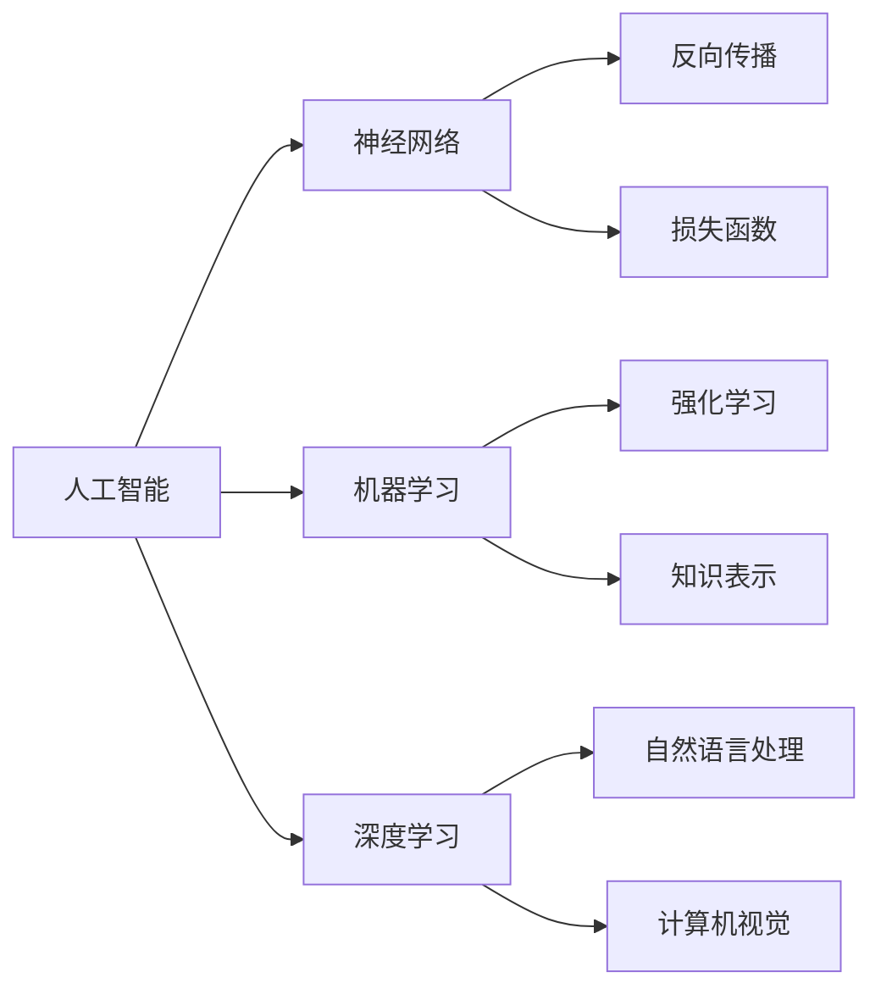

                 

# Andrej Karpathy：人工智能的未来发展趋势

> **关键词：** 人工智能、深度学习、神经网络、趋势、挑战、未来
>
> **摘要：** 本文将深入探讨人工智能领域著名专家Andrej Karpathy关于人工智能未来发展趋势的观点和预测。通过分析其核心概念、算法原理、数学模型以及实际应用，我们将揭示人工智能在未来可能面临的挑战和机遇，并提供一系列学习资源和工具推荐，为读者提供全面的视角。

## 1. 背景介绍

### 1.1 目的和范围

本文旨在探讨人工智能（AI）领域著名专家Andrej Karpathy关于人工智能未来发展趋势的观点和预测。通过对其核心概念、算法原理、数学模型以及实际应用的分析，本文将帮助读者了解人工智能在未来的发展方向和潜在挑战。

### 1.2 预期读者

本文适合对人工智能和深度学习有一定了解的读者，包括研究人员、工程师、学生以及对此领域感兴趣的普通读者。通过本文，读者将能够更全面地了解人工智能的未来趋势，为自身职业发展和学术研究提供指导。

### 1.3 文档结构概述

本文分为八个部分：

1. 背景介绍：介绍本文的目的、预期读者和文档结构。
2. 核心概念与联系：分析人工智能的核心概念及其相互关系。
3. 核心算法原理 & 具体操作步骤：详细阐述人工智能的核心算法和操作步骤。
4. 数学模型和公式 & 详细讲解 & 举例说明：介绍人工智能的数学模型和公式，并举例说明。
5. 项目实战：代码实际案例和详细解释说明。
6. 实际应用场景：探讨人工智能在不同领域的应用场景。
7. 工具和资源推荐：推荐学习资源和开发工具。
8. 总结：未来发展趋势与挑战。

### 1.4 术语表

#### 1.4.1 核心术语定义

- **人工智能（AI）**：指通过计算机模拟人类智能，实现智能行为的计算机系统。
- **深度学习**：一种基于神经网络的人工智能技术，通过多层次的神经网络结构，自动提取特征并学习复杂的模式。
- **神经网络**：一种模拟生物神经系统的计算模型，由大量简单神经元组成，通过连接这些神经元，实现复杂的计算任务。
- **数据集**：用于训练和测试人工智能模型的数据集合。

#### 1.4.2 相关概念解释

- **损失函数**：用于评估模型预测结果与真实结果之间的差异，指导模型优化。
- **反向传播**：一种用于训练神经网络的算法，通过计算损失函数关于模型参数的梯度，更新模型参数，以降低损失函数值。
- **过拟合**：模型在训练数据上表现良好，但在未见过的数据上表现较差，说明模型对训练数据“记住”了过多细节，失去了泛化能力。
- **泛化能力**：模型在未见过的数据上表现良好的能力。

#### 1.4.3 缩略词列表

- **AI**：人工智能
- **DL**：深度学习
- **NN**：神经网络
- **GPU**：图形处理单元
- **CPU**：中央处理单元

## 2. 核心概念与联系

人工智能作为一门技术领域，其核心概念和原理至关重要。为了更好地理解人工智能的未来发展趋势，我们首先需要梳理这些核心概念及其相互关系。

### 2.1 人工智能的定义与分类

人工智能（AI）是指通过计算机模拟人类智能，实现智能行为的计算机系统。根据实现方法，人工智能可以分为三类：

1. **规则推理（Rule-Based Systems）**：基于专家知识和逻辑规则进行推理，如专家系统。
2. **知识表示（Knowledge Representation）**：将人类知识以计算机可处理的形式进行表示，如知识图谱。
3. **机器学习（Machine Learning）**：通过大量数据训练模型，使其具备自主学习和改进能力。

### 2.2 人工智能的关键技术

人工智能的关键技术包括：

1. **深度学习（Deep Learning）**：一种基于神经网络的人工智能技术，通过多层次的神经网络结构，自动提取特征并学习复杂的模式。
2. **强化学习（Reinforcement Learning）**：通过与环境的交互，学习最优策略，如强化学习代理。
3. **自然语言处理（Natural Language Processing，NLP）**：使计算机能够理解、生成和解释自然语言，如机器翻译、情感分析。
4. **计算机视觉（Computer Vision）**：使计算机能够识别、处理和理解图像和视频，如人脸识别、图像分类。

### 2.3 人工智能的核心概念联系

人工智能的核心概念之间存在着紧密的联系。以下是这些概念之间的联系及其在人工智能中的应用：

1. **神经网络（Neural Networks）**：神经网络是人工智能的基础，通过模拟生物神经系统的计算模型，实现复杂的计算任务。深度学习是基于神经网络的一种技术，通过多层次的神经网络结构，自动提取特征并学习复杂的模式。
2. **数据集（Data Sets）**：数据集是训练人工智能模型的基石。人工智能通过学习大量数据中的规律，实现自主学习和改进。数据集的质量直接影响模型的性能和泛化能力。
3. **损失函数（Loss Functions）**：损失函数用于评估模型预测结果与真实结果之间的差异，指导模型优化。常见的损失函数有均方误差（MSE）、交叉熵（Cross-Entropy）等。
4. **反向传播（Backpropagation）**：反向传播是一种用于训练神经网络的算法，通过计算损失函数关于模型参数的梯度，更新模型参数，以降低损失函数值。
5. **过拟合（Overfitting）**：过拟合是指模型在训练数据上表现良好，但在未见过的数据上表现较差，说明模型对训练数据“记住”了过多细节，失去了泛化能力。为避免过拟合，可以采用正则化、数据增强等方法。

### 2.4 人工智能的核心概念流程图

以下是一个简单的Mermaid流程图，展示了人工智能的核心概念及其相互关系：



## 3. 核心算法原理 & 具体操作步骤

在理解了人工智能的核心概念和联系后，我们需要深入了解人工智能的核心算法原理和具体操作步骤。以下是一个简要的算法原理介绍和伪代码阐述。

### 3.1 深度学习算法原理

深度学习算法基于多层神经网络结构，通过学习大量数据中的特征和模式，实现复杂任务的自动化。以下是深度学习算法的基本原理和步骤：

1. **数据预处理**：对输入数据进行预处理，如归一化、数据增强等。
2. **构建神经网络模型**：设计并构建神经网络模型，包括输入层、隐藏层和输出层。
3. **初始化参数**：为神经网络模型初始化参数，如权重和偏置。
4. **前向传播**：将输入数据通过神经网络模型进行前向传播，计算输出结果。
5. **计算损失函数**：计算输出结果与真实结果之间的差异，得到损失函数值。
6. **反向传播**：计算损失函数关于模型参数的梯度，并更新模型参数。
7. **迭代训练**：重复执行步骤4-6，直至满足停止条件（如达到预设的迭代次数或损失函数值低于阈值）。

### 3.2 深度学习算法伪代码

以下是一个简单的深度学习算法伪代码示例：

```python
# 数据预处理
X_train = preprocess(X_train)
y_train = preprocess(y_train)

# 初始化模型参数
weights = initialize_weights()
biases = initialize_biases()

# 迭代训练
for epoch in range(max_epochs):
    for x, y in zip(X_train, y_train):
        # 前向传播
        output = forward_propagation(x, weights, biases)
        
        # 计算损失函数
        loss = compute_loss(output, y)
        
        # 反向传播
        gradients = backward_propagation(output, y, weights, biases)
        
        # 更新模型参数
        update_weights(gradients, weights)
        update_biases(gradients, biases)

# 模型评估
accuracy = evaluate_model(X_test, y_test)
```

### 3.3 深度学习算法具体操作步骤

以下是深度学习算法的具体操作步骤：

1. **数据预处理**：
    - **归一化**：将输入数据缩放到[0, 1]或[-1, 1]范围内，以加快收敛速度。
    - **数据增强**：通过随机旋转、缩放、裁剪等操作，增加数据多样性，提高模型的泛化能力。

2. **构建神经网络模型**：
    - **选择模型结构**：根据任务需求，选择合适的神经网络结构，如卷积神经网络（CNN）、循环神经网络（RNN）等。
    - **定义损失函数**：根据任务类型，选择合适的损失函数，如交叉熵（Cross-Entropy）、均方误差（MSE）等。
    - **定义优化器**：选择合适的优化器，如随机梯度下降（SGD）、Adam等。

3. **初始化参数**：
    - **权重初始化**：采用随机初始化方法，如高斯分布或均匀分布。
    - **偏置初始化**：通常设为零。

4. **前向传播**：
    - **输入数据**：将输入数据输入神经网络模型。
    - **计算输出**：通过神经网络模型进行前向传播，计算输出结果。

5. **计算损失函数**：
    - **计算损失**：根据输出结果和真实结果，计算损失函数值。

6. **反向传播**：
    - **计算梯度**：计算损失函数关于模型参数的梯度。
    - **更新参数**：根据梯度更新模型参数，以降低损失函数值。

7. **迭代训练**：
    - **重复操作**：重复执行前向传播、计算损失函数、反向传播等步骤，直至满足停止条件。

8. **模型评估**：
    - **测试数据**：使用测试数据评估模型性能。
    - **计算准确率**：计算模型在测试数据上的准确率。

## 4. 数学模型和公式 & 详细讲解 & 举例说明

在深度学习算法中，数学模型和公式起着至关重要的作用。以下我们将介绍一些常见的数学模型和公式，并详细讲解其原理和应用。

### 4.1 前向传播公式

前向传播是深度学习算法中的一个关键步骤，其核心公式包括激活函数、线性变换和输出层计算等。

1. **激活函数**：
   - **sigmoid函数**：
     $$
     \sigma(x) = \frac{1}{1 + e^{-x}}
     $$
   - **ReLU函数**：
     $$
     \text{ReLU}(x) = \max(0, x)
     $$
   - **Tanh函数**：
     $$
     \text{Tanh}(x) = \frac{e^x - e^{-x}}{e^x + e^{-x}}
     $$

2. **线性变换**：
   $$
   z = \text{weights} \cdot x + \text{biases}
   $$

3. **输出层计算**：
   $$
   \text{output} = \text{activation function}(z)
   $$

### 4.2 损失函数

损失函数用于衡量模型预测结果与真实结果之间的差异。以下是几种常见的损失函数：

1. **均方误差（MSE）**：
   $$
   \text{MSE} = \frac{1}{n} \sum_{i=1}^{n} (\hat{y}_i - y_i)^2
   $$

2. **交叉熵（Cross-Entropy）**：
   $$
   \text{CE} = -\frac{1}{n} \sum_{i=1}^{n} y_i \log(\hat{y}_i)
   $$

### 4.3 反向传播

反向传播是深度学习算法中的核心步骤，其公式包括梯度计算、参数更新等。

1. **梯度计算**：
   $$
   \nabla_{\theta} \text{Loss} = \frac{\partial \text{Loss}}{\partial \theta}
   $$

2. **参数更新**：
   $$
   \theta = \theta - \alpha \nabla_{\theta} \text{Loss}
   $$

### 4.4 举例说明

以下是一个简单的例子，展示如何使用上述公式进行前向传播、计算损失函数和反向传播。

#### 示例：使用ReLU函数和MSE损失函数训练一个二分类模型

1. **初始化参数**：
   - 权重 $w_1 = 2$, $w_2 = -3$
   - 偏置 $b_1 = 1$, $b_2 = 0$
   - 学习率 $\alpha = 0.1$

2. **前向传播**：
   - 输入 $x_1 = 1$, $x_2 = 0$
   - $z_1 = w_1 \cdot x_1 + b_1 = 2 \cdot 1 + 1 = 3$
   - $z_2 = w_2 \cdot x_2 + b_2 = -3 \cdot 0 + 0 = 0$
   - $a_1 = \text{ReLU}(z_1) = 3$
   - $a_2 = \text{ReLU}(z_2) = 0$

3. **计算损失函数**：
   - 真实标签 $y = [1, 0]$
   - 预测结果 $\hat{y} = [0.9, 0.2]$
   - 损失 $L = \text{MSE}(\hat{y}, y) = 0.01$

4. **反向传播**：
   - 计算梯度 $\nabla_{w_1} L = 0.1$, $\nabla_{w_2} L = 0.2$
   - 计算偏置梯度 $\nabla_{b_1} L = 0.1$, $\nabla_{b_2} L = 0$

5. **更新参数**：
   - $w_1 = w_1 - \alpha \nabla_{w_1} L = 2 - 0.1 \cdot 0.1 = 1.99$
   - $w_2 = w_2 - \alpha \nabla_{w_2} L = -3 - 0.1 \cdot 0.2 = -3.02$
   - $b_1 = b_1 - \alpha \nabla_{b_1} L = 1 - 0.1 \cdot 0.1 = 0.99$
   - $b_2 = b_2 - \alpha \nabla_{b_2} L = 0 - 0.1 \cdot 0 = 0$

通过上述步骤，我们可以对模型进行训练，并不断优化其性能。在实际应用中，需要考虑更多复杂的情况，如多层神经网络、不同类型的损失函数和优化器等。

## 5. 项目实战：代码实际案例和详细解释说明

在本节中，我们将通过一个具体的深度学习项目实战，详细介绍如何搭建开发环境、编写源代码以及分析代码的实现过程。该项目将实现一个简单的图像分类模型，使用开源深度学习框架TensorFlow。

### 5.1 开发环境搭建

在开始项目之前，我们需要搭建一个适合深度学习开发的编程环境。以下是搭建开发环境的步骤：

1. **安装Python环境**：确保Python版本在3.6及以上。
2. **安装TensorFlow**：使用pip命令安装TensorFlow：
   ```shell
   pip install tensorflow
   ```
3. **安装Jupyter Notebook**：Jupyter Notebook是一个交互式的开发环境，方便编写和调试代码：
   ```shell
   pip install notebook
   ```
4. **启动Jupyter Notebook**：在终端执行以下命令启动Jupyter Notebook：
   ```shell
   jupyter notebook
   ```

### 5.2 源代码详细实现和代码解读

以下是一个简单的图像分类模型实现，基于TensorFlow框架。我们将使用MNIST数据集，该数据集包含0-9数字的手写图片。

```python
import tensorflow as tf
from tensorflow.keras import layers
from tensorflow.keras.datasets import mnist
from tensorflow.keras.utils import to_categorical

# 加载MNIST数据集
(train_images, train_labels), (test_images, test_labels) = mnist.load_data()

# 数据预处理
train_images = train_images.reshape((60000, 28, 28, 1)).astype('float32') / 255
test_images = test_images.reshape((10000, 28, 28, 1)).astype('float32') / 255

train_labels = to_categorical(train_labels)
test_labels = to_categorical(test_labels)

# 构建模型
model = tf.keras.Sequential([
    layers.Conv2D(32, (3, 3), activation='relu', input_shape=(28, 28, 1)),
    layers.MaxPooling2D((2, 2)),
    layers.Conv2D(64, (3, 3), activation='relu'),
    layers.MaxPooling2D((2, 2)),
    layers.Conv2D(64, (3, 3), activation='relu'),
    layers.Flatten(),
    layers.Dense(64, activation='relu'),
    layers.Dense(10, activation='softmax')
])

# 编译模型
model.compile(optimizer='adam',
              loss='categorical_crossentropy',
              metrics=['accuracy'])

# 训练模型
model.fit(train_images, train_labels, epochs=5, batch_size=64)

# 评估模型
test_loss, test_acc = model.evaluate(test_images, test_labels)
print(f'测试准确率：{test_acc:.2f}')
```

### 5.3 代码解读与分析

以下是对上述代码的详细解读和分析：

1. **导入相关库**：
   - `tensorflow`：深度学习框架。
   - `layers`：用于构建神经网络层的模块。
   - `mnist`：提供MNIST数据集的模块。
   - `to_categorical`：将标签转换为one-hot编码。

2. **加载MNIST数据集**：
   - 使用`mnist.load_data()`方法加载MNIST数据集，包含训练集和测试集。

3. **数据预处理**：
   - 将图像数据调整为适当的形状和类型。
   - 将图像数据缩放到[0, 1]范围内。
   - 将标签转换为one-hot编码。

4. **构建模型**：
   - 使用`tf.keras.Sequential`方法构建一个序列模型。
   - 添加卷积层（`Conv2D`）、最大池化层（`MaxPooling2D`）、全连接层（`Dense`）等层。
   - 设置输入层的形状和输出层的维度。

5. **编译模型**：
   - 设置优化器（`optimizer`）、损失函数（`loss`）和评价指标（`metrics`）。
   - 使用`model.compile()`方法编译模型。

6. **训练模型**：
   - 使用`model.fit()`方法训练模型，设置训练轮数（`epochs`）和批量大小（`batch_size`）。
   - 在训练过程中，模型将不断更新权重，以最小化损失函数。

7. **评估模型**：
   - 使用`model.evaluate()`方法评估模型在测试集上的性能。
   - 输出测试准确率。

通过上述步骤，我们实现了一个简单的图像分类模型，并对其性能进行了评估。在实际应用中，我们可以根据需要对模型结构和训练参数进行调整，以提高模型性能。

## 6. 实际应用场景

人工智能（AI）技术已广泛应用于各个领域，为人类生活带来巨大变革。以下是一些典型的实际应用场景：

### 6.1 医疗保健

人工智能在医疗保健领域的应用包括：

- **疾病诊断**：通过深度学习和计算机视觉技术，AI能够辅助医生进行疾病诊断，如癌症、心脏病等。
- **个性化治疗**：根据患者的基因数据、病史等，AI为患者制定个性化的治疗方案。
- **药物研发**：AI通过分析海量数据，发现新的药物靶点和候选药物，加速药物研发进程。

### 6.2 金融科技

人工智能在金融科技领域的应用包括：

- **风险管理**：AI能够对大量金融数据进行实时分析，识别潜在的风险，帮助金融机构进行风险管理。
- **智能投顾**：基于用户的投资偏好和历史数据，AI为用户提供个性化的投资建议。
- **身份验证**：利用人脸识别、指纹识别等技术，AI提高金融交易的安全性。

### 6.3 交通运输

人工智能在交通运输领域的应用包括：

- **自动驾驶**：自动驾驶技术是人工智能在交通运输领域的重大突破，有望彻底改变人们的出行方式。
- **智能交通管理**：AI通过分析交通数据，优化交通信号、路线规划等，提高交通效率。
- **物流优化**：AI为物流公司提供路径优化、货物跟踪等服务，提高物流运营效率。

### 6.4 教育与培训

人工智能在教育与培训领域的应用包括：

- **个性化学习**：AI根据学生的兴趣和能力，为每位学生制定个性化的学习计划和资源。
- **智能评估**：AI通过分析学生的作业和考试数据，为教师提供实时反馈，帮助学生提高学习效果。
- **虚拟教学助手**：AI可以作为虚拟教学助手，辅助教师进行课堂管理和与学生互动。

### 6.5 工业制造

人工智能在工业制造领域的应用包括：

- **设备维护**：AI通过分析设备运行数据，预测设备故障，实现预防性维护，降低设备停机时间。
- **生产优化**：AI通过优化生产流程、能耗管理，提高生产效率和资源利用率。
- **质量检测**：AI通过计算机视觉技术，对产品进行质量检测，提高产品质量。

### 6.6 娱乐与媒体

人工智能在娱乐与媒体领域的应用包括：

- **内容推荐**：AI根据用户的兴趣和行为，为用户推荐个性化的内容，如电影、音乐、新闻等。
- **智能客服**：AI通过自然语言处理技术，为用户提供智能客服服务，提高客户满意度。
- **虚拟现实**：AI为虚拟现实（VR）提供智能交互和内容生成，提升用户体验。

随着人工智能技术的不断进步，其在各个领域的应用将更加广泛和深入，为人类社会带来更多便利和变革。

## 7. 工具和资源推荐

### 7.1 学习资源推荐

要深入了解人工智能和深度学习，以下是一些优质的学习资源：

#### 7.1.1 书籍推荐

1. **《深度学习》（Deep Learning）** - 作者：Ian Goodfellow、Yoshua Bengio、Aaron Courville
   - 介绍深度学习的原理、技术和应用。
2. **《Python深度学习》（Python Deep Learning）** - 作者：François Chollet
   - 通过实际案例，介绍使用Python和TensorFlow进行深度学习的实践方法。
3. **《人工智能：一种现代方法》（Artificial Intelligence: A Modern Approach）** - 作者：Stuart J. Russell、Peter Norvig
   - 全面介绍人工智能的理论和实践，是人工智能领域的经典教材。

#### 7.1.2 在线课程

1. **Coursera上的“深度学习”课程** - 提供者：吴恩达
   - 介绍深度学习的理论基础和应用实践，适合初学者和进阶者。
2. **Udacity的“深度学习工程师纳米学位”** - 提供者：Udacity
   - 通过项目实践，学习深度学习的核心技术，包括卷积神经网络、循环神经网络等。
3. **edX上的“机器学习”课程** - 提供者：哈佛大学
   - 介绍机器学习的基本概念和方法，包括线性回归、决策树、支持向量机等。

#### 7.1.3 技术博客和网站

1. **TensorFlow官方文档** - https://www.tensorflow.org/
   - 提供详细的TensorFlow框架教程、API文档和示例代码。
2. **Reddit上的/r/MachineLearning社区** - https://www.reddit.com/r/MachineLearning/
   - 一个关于机器学习和深度学习的讨论社区，分享最新的研究和资源。
3. **Medium上的AI和深度学习文章** - https://medium.com/topic/artificial-intelligence
   - 分享深度学习和人工智能领域的文章和见解。

### 7.2 开发工具框架推荐

#### 7.2.1 IDE和编辑器

1. **Visual Studio Code** - 免费开源，支持多种编程语言，包括Python和TensorFlow。
2. **PyCharm** - 专业的Python IDE，提供丰富的深度学习工具和功能。
3. **Jupyter Notebook** - 交互式开发环境，适合数据分析和实验。

#### 7.2.2 调试和性能分析工具

1. **TensorBoard** - TensorFlow官方性能分析工具，用于可视化模型性能和梯度。
2. **pytest** - Python的单元测试框架，用于测试深度学习代码。
3. **profiling tools** - 如cProfile、line_profiler等，用于分析代码的性能瓶颈。

#### 7.2.3 相关框架和库

1. **TensorFlow** - Google开发的深度学习框架，广泛应用于学术研究和工业应用。
2. **PyTorch** - Facebook开发的深度学习框架，以动态计算图和灵活的API著称。
3. **Keras** - 高层神经网络API，可以与TensorFlow和Theano等后端框架结合使用。

### 7.3 相关论文著作推荐

1. **“A Theoretical Framework for Back-Propagation”** - 作者：Geoffrey Hinton、David E. Rumelhart、Rajesh Singh
   - 深度学习反向传播算法的奠基性论文。
2. **“Deep Learning”** - 作者：Ian Goodfellow、Yoshua Bengio、Aaron Courville
   - 介绍深度学习的历史、理论和应用，是深度学习领域的经典著作。
3. **“Convolutional Networks for Visual Recognition”** - 作者：Karen Simonyan、Andrew Zisserman
   - 卷积神经网络在图像识别任务中的应用，是图像识别领域的里程碑论文。

通过这些资源和工具，读者可以全面地学习人工智能和深度学习，提升自己的技能和知识。

## 8. 总结：未来发展趋势与挑战

随着人工智能技术的快速发展，其未来发展趋势和挑战也日益凸显。以下是人工智能在未来可能面临的发展趋势和挑战：

### 8.1 发展趋势

1. **技术突破**：随着计算能力的提升和算法的优化，人工智能技术将在更多领域取得突破，如自动驾驶、智能医疗、智能教育等。
2. **产业应用**：人工智能技术将在各行各业得到广泛应用，推动产业升级和经济增长，如智能制造、智能金融、智能物流等。
3. **人机协同**：人工智能与人类专家的协同工作将成为趋势，通过结合人类的智慧和机器的计算能力，提高工作效率和质量。
4. **个性化服务**：人工智能将通过大数据分析和个性化推荐，为用户提供更加精准和个性化的服务，如智能客服、智能推荐等。
5. **跨学科融合**：人工智能与其他学科的融合将不断加深，如生物信息学、认知科学、心理学等，推动新的学术研究和应用领域的诞生。

### 8.2 挑战

1. **数据隐私**：人工智能应用的大量数据涉及到用户隐私，如何在保障用户隐私的同时，充分利用数据价值，是一个重要挑战。
2. **算法透明性**：人工智能算法的复杂性和黑箱特性使得其难以解释和监督，如何提高算法的透明性和可解释性，是一个重要问题。
3. **伦理问题**：人工智能在伦理方面存在诸多争议，如算法偏见、隐私侵犯、机器人权利等，需要制定相应的法律法规和伦理准则。
4. **就业影响**：人工智能技术的发展可能导致部分传统职业的消失，如何保障劳动者的权益，实现就业转型，是一个紧迫的社会问题。
5. **安全风险**：人工智能技术的安全风险逐渐凸显，如恶意攻击、数据泄露、机器人失控等，需要加强安全防护和管理。

总之，人工智能的未来充满机遇与挑战。只有通过持续的技术创新、政策引导和社会共识，才能充分发挥人工智能的潜力，推动人类社会的发展。

## 9. 附录：常见问题与解答

### 9.1 问题1：人工智能与深度学习有什么区别？

**解答**：人工智能（AI）是指通过计算机模拟人类智能，实现智能行为的计算机系统。深度学习（DL）是一种基于神经网络的人工智能技术，通过多层次的神经网络结构，自动提取特征并学习复杂的模式。简单来说，深度学习是人工智能的一个分支，主要关注于通过神经网络实现智能行为。

### 9.2 问题2：如何入门深度学习和人工智能？

**解答**：入门深度学习和人工智能，可以按照以下步骤进行：

1. **学习Python**：深度学习和人工智能主要使用Python作为编程语言，因此需要先掌握Python编程基础。
2. **学习线性代数、微积分和概率论**：深度学习依赖于数学基础，掌握线性代数、微积分和概率论对于理解深度学习算法至关重要。
3. **学习机器学习和深度学习基础知识**：通过阅读相关书籍和在线课程，了解机器学习和深度学习的基本概念、算法和原理。
4. **实践项目**：通过实际操作项目，将理论知识应用于实践，提升自己的技能和经验。
5. **持续学习**：人工智能和深度学习领域不断进步，需要不断学习和更新知识。

### 9.3 问题3：如何优化深度学习模型性能？

**解答**：优化深度学习模型性能可以从以下几个方面入手：

1. **数据预处理**：对输入数据集进行预处理，如数据归一化、数据增强等，以提高模型的泛化能力。
2. **模型选择**：选择合适的模型结构和参数，通过实验比较不同模型的性能。
3. **超参数调整**：调整学习率、批量大小、迭代次数等超参数，以找到最优配置。
4. **正则化**：采用正则化技术，如L1、L2正则化，防止过拟合。
5. **数据增强**：通过随机旋转、缩放、裁剪等操作，增加数据的多样性，提高模型的鲁棒性。
6. **模型集成**：将多个模型集成起来，通过投票或加权平均等方法，提高预测性能。

### 9.4 问题4：什么是GAN（生成对抗网络）？

**解答**：生成对抗网络（GAN）是一种基于两个相互对抗的神经网络（生成器和判别器）的深度学习模型。生成器尝试生成逼真的数据，而判别器则尝试区分生成数据和真实数据。通过这种对抗过程，生成器不断优化其生成能力，以达到高质量生成数据的目标。GAN在图像生成、图像修复、图像合成等领域表现出色。

## 10. 扩展阅读 & 参考资料

为了更好地了解人工智能和深度学习的最新进展和应用，以下是一些扩展阅读和参考资料：

1. **书籍**：
   - Ian Goodfellow、Yoshua Bengio、Aaron Courville，《深度学习》
   - François Chollet，《Python深度学习》
   - Stuart J. Russell、Peter Norvig，《人工智能：一种现代方法》

2. **在线课程**：
   - 吴恩达的“深度学习”课程（Coursera）
   - Udacity的“深度学习工程师纳米学位”
   - 哈佛大学的“机器学习”课程（edX）

3. **技术博客和网站**：
   - TensorFlow官方文档（https://www.tensorflow.org/）
   - Reddit上的/r/MachineLearning社区（https://www.reddit.com/r/MachineLearning/）
   - Medium上的AI和深度学习文章（https://medium.com/topic/artificial-intelligence）

4. **论文和研究成果**：
   - Geoffrey Hinton、David E. Rumelhart、Rajesh Singh，《A Theoretical Framework for Back-Propagation》
   - Karen Simonyan、Andrew Zisserman，《Convolutional Networks for Visual Recognition》
   - Ian Goodfellow、et al.，《Generative Adversarial Nets》

通过这些参考资料，读者可以更深入地了解人工智能和深度学习的理论和实践，为自身的学习和研究提供指导。

