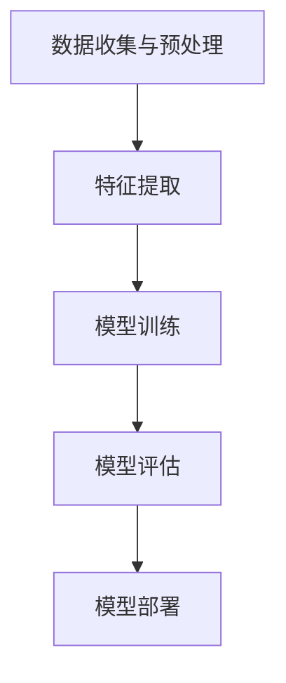
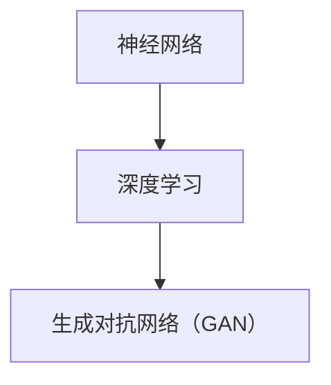
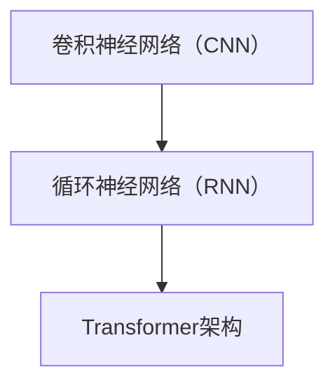
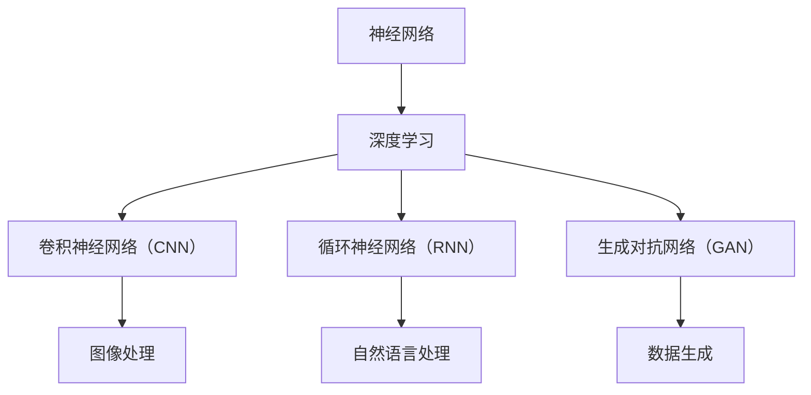

                 

### 文章标题

# Andrej Karpathy：人工智能的未来发展趋势

> 关键词：人工智能、深度学习、未来趋势、技术发展、架构设计、算法优化、实际应用

> 摘要：本文将探讨人工智能领域的未来发展趋势，包括深度学习算法的演进、新型架构的设计、跨领域应用的拓展等。通过分析当前的技术进展、面临的挑战以及潜在的机会，本文旨在为读者提供一个全面而深刻的视角，以了解人工智能在未来可能的发展方向及其对科技、产业和社会的深远影响。

### 文章关键词

- 人工智能
- 深度学习
- 未来趋势
- 技术发展
- 架构设计
- 算法优化
- 实际应用

### 文章摘要

本文旨在深入探讨人工智能领域的未来发展，重点关注深度学习算法的演变、新型计算架构的涌现以及人工智能在各个领域的实际应用。通过梳理当前的技术进展，本文揭示了深度学习算法在图像识别、自然语言处理等领域的突破，并分析了新型神经网络架构如Transformer和GPT-3的巨大影响。此外，文章还探讨了人工智能在医疗、金融、教育等行业的应用前景，探讨了其中的挑战与机遇。最后，本文提出了对未来人工智能发展的几项关键预测，并呼吁研究人员和开发者积极应对潜在的挑战，为人工智能的未来贡献智慧和力量。希望通过本文，读者能够获得对人工智能领域更全面、更深入的理解，从而为自身的研究和实践提供有益的参考。

## 1. 背景介绍

### 1.1 目的和范围

本文的目标是深入探讨人工智能（AI）领域的未来发展趋势，旨在为读者提供一个全面而清晰的视角，了解AI技术如何在未来几年乃至几十年内继续演进。文章将涵盖以下几个主要方面：

1. **深度学习算法的进步**：探讨当前深度学习算法的发展状况，分析其优缺点，以及未来可能的改进方向。
2. **新型计算架构的设计**：探讨新型神经网络架构，如Transformer和GPT-3，以及它们如何推动人工智能的发展。
3. **人工智能的实际应用**：分析人工智能在各个领域的应用现状和未来前景，包括医疗、金融、教育、自动驾驶等。
4. **面临的挑战和机遇**：讨论人工智能技术发展过程中面临的挑战，如数据隐私、算法公平性、计算资源需求等，并探讨相应的解决方案。

### 1.2 预期读者

本文的预期读者包括：

1. **人工智能领域的研究人员**：希望了解AI技术的最新进展和未来趋势，以便为自己的研究工作提供方向。
2. **技术开发者**：希望掌握AI技术的实际应用场景，并将其应用于自己的项目开发。
3. **企业决策者**：希望了解AI技术对行业可能产生的变革性影响，从而制定相应的战略规划。
4. **对AI技术感兴趣的普通读者**：希望获得对AI技术的深入理解和全面认识。

### 1.3 文档结构概述

本文的结构如下：

1. **背景介绍**：介绍文章的目的、预期读者以及文档结构。
2. **核心概念与联系**：介绍人工智能的核心概念和架构，使用Mermaid流程图进行说明。
3. **核心算法原理 & 具体操作步骤**：详细讲解深度学习算法的原理和操作步骤，使用伪代码进行说明。
4. **数学模型和公式 & 详细讲解 & 举例说明**：介绍人工智能中的数学模型和公式，并进行详细讲解和举例说明。
5. **项目实战：代码实际案例和详细解释说明**：通过实际代码案例，展示人工智能技术的应用。
6. **实际应用场景**：分析人工智能在各个领域的应用。
7. **工具和资源推荐**：推荐学习资源和开发工具。
8. **总结：未来发展趋势与挑战**：总结文章的主要观点，并对未来发展趋势和挑战进行展望。
9. **附录：常见问题与解答**：解答读者可能遇到的问题。
10. **扩展阅读 & 参考资料**：提供进一步阅读的资料。

### 1.4 术语表

为了确保文章的可读性和一致性，本文将使用以下术语：

#### 1.4.1 核心术语定义

- **人工智能（AI）**：模拟人类智能的计算机系统，包括感知、学习、推理、解决问题等能力。
- **深度学习**：一种基于人工神经网络的机器学习技术，通过多层神经网络来提取数据的特征。
- **神经网络架构**：神经网络的结构设计，包括层数、节点数、连接方式等。
- **计算资源**：用于训练和运行人工智能模型的硬件和软件资源，如GPU、CPU、TPU等。

#### 1.4.2 相关概念解释

- **神经网络**：由多个神经元组成的计算模型，通过学习输入数据和输出数据之间的关系，进行预测和分类。
- **卷积神经网络（CNN）**：一种特殊的神经网络，用于处理图像数据，通过卷积操作提取图像特征。
- **生成对抗网络（GAN）**：一种生成模型，通过两个神经网络的对抗训练，生成逼真的数据。

#### 1.4.3 缩略词列表

- **AI**：人工智能
- **DL**：深度学习
- **CNN**：卷积神经网络
- **GAN**：生成对抗网络
- **GPU**：图形处理单元
- **TPU**：张量处理单元

## 2. 核心概念与联系

在探讨人工智能的未来发展趋势之前，我们需要先了解一些核心概念和它们之间的联系。以下将介绍人工智能的基本原理、相关技术和当前的主流架构，并使用Mermaid流程图进行说明。

### 2.1 人工智能的基本原理

人工智能的基本原理主要包括以下几个部分：

1. **数据收集与预处理**：收集大量的数据，并进行清洗、归一化等预处理，以便用于模型的训练。
2. **特征提取**：使用神经网络或其他算法从数据中提取有用的特征。
3. **模型训练**：使用训练数据对模型进行训练，使其能够对未知数据进行预测或分类。
4. **模型评估**：使用测试数据对模型进行评估，判断其性能是否满足要求。
5. **模型部署**：将训练好的模型部署到实际应用场景中，进行预测或决策。

以下是Mermaid流程图对这一过程的描述：



### 2.2 相关技术

人工智能相关技术包括：

1. **神经网络**：一种计算模型，由多个神经元组成，通过学习输入和输出之间的关系进行预测和分类。
2. **深度学习**：一种基于神经网络的机器学习技术，通过多层神经网络来提取数据的特征。
3. **生成对抗网络（GAN）**：一种生成模型，通过两个神经网络的对抗训练，生成逼真的数据。

以下是Mermaid流程图对这些技术的描述：



### 2.3 主流架构

当前主流的人工智能架构主要包括：

1. **卷积神经网络（CNN）**：一种特殊的神经网络，用于处理图像数据，通过卷积操作提取图像特征。
2. **循环神经网络（RNN）**：一种神经网络，适用于处理序列数据，如文本和语音。
3. **Transformer架构**：一种用于自然语言处理的神经网络架构，通过自注意力机制处理长距离依赖。

以下是Mermaid流程图对这些架构的描述：



### 2.4 人工智能技术之间的联系

人工智能技术之间存在着紧密的联系，它们共同构成了人工智能的生态系统。以下是这些技术之间的联系：

1. **神经网络是深度学习的基础**：深度学习是基于神经网络的机器学习技术，通过多层神经网络来提取数据的特征。
2. **CNN和RNN是神经网络的具体实现**：CNN和RNN是神经网络在图像和序列数据上的具体应用，分别用于图像处理和自然语言处理。
3. **GAN是深度学习的一个分支**：GAN是深度学习中的一个重要分支，用于生成数据，可以与CNN和RNN结合使用。

以下是Mermaid流程图对这些联系的描述：



通过以上流程图，我们可以更清晰地理解人工智能的核心概念、相关技术和主流架构，以及它们之间的联系。这些知识将为我们后续探讨人工智能的未来发展趋势提供坚实的基础。

## 3. 核心算法原理 & 具体操作步骤

在了解人工智能的基本概念和架构之后，接下来我们将深入探讨核心算法的原理和具体操作步骤。本文将重点介绍深度学习中的卷积神经网络（CNN）和生成对抗网络（GAN），并通过伪代码详细解释这些算法的基本操作。

### 3.1 卷积神经网络（CNN）原理

卷积神经网络（CNN）是一种专门用于处理图像数据的神经网络。它的核心思想是利用卷积操作提取图像的特征。以下是CNN的基本原理和具体操作步骤：

#### 3.1.1 卷积操作

卷积操作是CNN中的基础，通过卷积核（filter）与输入图像的局部区域进行卷积，得到一个特征图。卷积操作的伪代码如下：

```python
def convolution(input_image, filter):
    output_map = []
    for x in range(input_image.width - filter.size):
        for y in range(input_image.height - filter.size):
            feature_map = 0
            for filter_x in range(filter.size):
                for filter_y in range(filter.size):
                    feature_map += input_image[x + filter_x, y + filter_y] * filter[filter_x, filter_y]
            output_map.append(feature_map)
    return output_map
```

#### 3.1.2 池化操作

池化操作用于减小特征图的尺寸，同时保持重要的特征信息。常用的池化方法包括最大池化和平均池化。以下是最大池化的伪代码：

```python
def max_pooling(feature_map, pool_size):
    output_map = []
    for x in range(0, feature_map.width, pool_size):
        for y in range(0, feature_map.height, pool_size):
            max_value = -float('inf')
            for pool_x in range(pool_size):
                for pool_y in range(pool_size):
                    if feature_map[x + pool_x, y + pool_y] > max_value:
                        max_value = feature_map[x + pool_x, y + pool_y]
            output_map.append(max_value)
    return output_map
```

#### 3.1.3 CNN模型训练

CNN模型的训练过程包括前向传播和反向传播。以下是CNN模型训练的伪代码：

```python
def forward_propagation(input_image, model):
    hidden_layer = convolution(input_image, model.convolutional_weights)
    hidden_layer = max_pooling(hidden_layer, model.pool_size)
    # 重复卷积和池化操作，直到达到输出层
    output_layer = softmax(hidden_layer * model.weight_matrix)
    return output_layer

def backward_propagation(output_layer, target_labels, model):
    # 计算损失函数
    loss = compute_loss(output_layer, target_labels)
    # 计算梯度
    gradient = compute_gradient(output_layer, target_labels, model)
    # 更新模型参数
    model.update_weights(gradient)
```

### 3.2 生成对抗网络（GAN）原理

生成对抗网络（GAN）是一种由生成器和判别器组成的神经网络模型。生成器的目标是生成逼真的数据，判别器的目标是区分真实数据和生成数据。以下是GAN的基本原理和具体操作步骤：

#### 3.2.1 生成器

生成器的任务是根据输入随机噪声生成逼真的数据。以下是生成器的伪代码：

```python
def generate噪声，model):
    noise = random_vector(noise_size)
    generated_data = model.generate_data(noise)
    return generated_data
```

#### 3.2.2 判别器

判别器的任务是对数据进行分类，判断其为真实数据还是生成数据。以下是判别器的伪代码：

```python
def discriminate数据，model):
    prediction = model.classify_data(data)
    return prediction
```

#### 3.2.3 GAN模型训练

GAN模型的训练过程包括生成器和判别器的迭代训练。以下是GAN模型训练的伪代码：

```python
def train_GAN(dataset, generator, discriminator, num_epochs):
    for epoch in range(num_epochs):
        for data in dataset:
            # 训练判别器
            discriminator_loss = discriminator.train(data)
            # 训练生成器
            generator_loss = generator.train(discriminator)
        print(f"Epoch {epoch}: Generator Loss = {generator_loss}, Discriminator Loss = {discriminator_loss}")
```

通过以上伪代码，我们可以对CNN和GAN的基本原理和具体操作步骤有更深入的理解。这些算法在图像识别、自然语言处理、数据生成等领域具有广泛的应用，为人工智能的发展奠定了基础。

### 4. 数学模型和公式 & 详细讲解 & 举例说明

在深入探讨人工智能的核心算法后，接下来我们将介绍与这些算法相关的数学模型和公式，并进行详细讲解和举例说明。这些数学模型和公式是理解人工智能算法运行机制和性能优化关键的基础。

#### 4.1 卷积神经网络（CNN）中的数学模型

卷积神经网络（CNN）中的数学模型主要涉及以下几个方面：

1. **卷积操作**：卷积操作可以用数学公式表示为：

   $$
   \text{output}_{ij} = \sum_{k=1}^{n} \text{input}_{i+k,j} \times \text{weight}_{k} + \text{bias}
   $$

   其中，$ \text{output}_{ij} $ 是输出特征图上的一个元素，$ \text{input}_{i+k,j} $ 是输入图像上相应位置的一个元素，$ \text{weight}_{k} $ 是卷积核上的一个元素，$ \text{bias} $ 是偏置。

2. **激活函数**：常用的激活函数包括ReLU函数和Sigmoid函数：

   - **ReLU函数**：

     $$
     \text{ReLU}(x) = \max(0, x)
     $$

   - **Sigmoid函数**：

     $$
     \text{Sigmoid}(x) = \frac{1}{1 + e^{-x}}
     $$

3. **池化操作**：最大池化可以用数学公式表示为：

   $$
   \text{pool}_{ij} = \max\{\text{input}_{i+k,j} : k=0,1,\ldots,p\}
   $$

   其中，$ \text{pool}_{ij} $ 是输出池化图上的一个元素，$ \text{input}_{i+k,j} $ 是输入特征图上相应位置的一个元素，$ p $ 是池化窗口的大小。

#### 4.2 生成对抗网络（GAN）中的数学模型

生成对抗网络（GAN）中的数学模型主要涉及生成器和判别器的损失函数：

1. **生成器损失函数**：生成器的目标是生成逼真的数据，以欺骗判别器。生成器的损失函数通常采用如下形式：

   $$
   L_G = -\mathbb{E}_{x \sim p_{data}(x)}[\log(D(G(x)))] - \mathbb{E}_{z \sim p_z(z)}[\log(1 - D(G(z)))]
   $$

   其中，$ G(x) $ 是生成器生成的数据，$ D(x) $ 是判别器的输出，$ z $ 是生成器的噪声输入，$ p_{data}(x) $ 和 $ p_z(z) $ 分别是真实数据和噪声数据的分布。

2. **判别器损失函数**：判别器的目标是区分真实数据和生成数据。判别器的损失函数通常采用如下形式：

   $$
   L_D = -\mathbb{E}_{x \sim p_{data}(x)}[\log(D(x))] - \mathbb{E}_{z \sim p_z(z)}[\log(1 - D(G(z)))]
   $$

#### 4.3 举例说明

下面通过一个简单的例子来说明卷积操作和生成对抗网络的损失函数。

**例子 1：卷积操作**

假设输入图像 $ \text{input} $ 的一个像素点为 $ (1, 1) $，卷积核 $ \text{filter} $ 的一个元素为 $ (1, 0) $，偏置 $ \text{bias} $ 为 $ 1 $。我们可以计算输出特征图上的一个元素：

$$
\text{output}_{1,1} = (1 \times 1 + 1 \times 0 + 1) = 2
$$

**例子 2：生成对抗网络的损失函数**

假设生成器的噪声输入 $ z $ 为 $ (0.5, 0.5) $，生成器生成的数据 $ G(z) $ 为 $ (0.3, 0.4) $，判别器的输出 $ D(G(z)) $ 为 $ 0.8 $。我们可以计算生成器和判别器的损失函数：

- **生成器损失函数**：

  $$
  L_G = -\log(0.8) - \log(1 - 0.8) \approx -0.2231 - (-0.1131) = -0.2231 + 0.1131 = -0.1100
  $$

- **判别器损失函数**：

  $$
  L_D = -\log(0.3) - \log(1 - 0.8) \approx -1.204 - (-0.1131) = -1.204 + 0.1131 = -1.0909
  $$

通过以上数学模型和公式的详细讲解和举例说明，我们可以更好地理解卷积神经网络和生成对抗网络的工作原理，为后续的项目实战和实际应用提供理论支持。

### 5. 项目实战：代码实际案例和详细解释说明

在理解了人工智能核心算法的原理和数学模型后，接下来我们将通过实际项目案例，展示如何使用Python实现卷积神经网络（CNN）和生成对抗网络（GAN），并对关键代码进行详细解释。

#### 5.1 开发环境搭建

在开始代码实现之前，我们需要搭建开发环境。以下是所需的软件和库：

- **Python（3.8或更高版本）**：Python是一种高级编程语言，广泛用于人工智能开发。
- **TensorFlow（2.x版本）**：TensorFlow是一个开源机器学习框架，提供了丰富的工具和库来构建和训练神经网络。
- **Keras**：Keras是一个高层神经网络API，构建在TensorFlow之上，使神经网络开发更加简单快捷。
- **NumPy**：NumPy是一个强大的Python库，用于处理大型多维数组。

安装以上软件和库的方法如下：

```bash
# 安装Python
#（根据操作系统选择相应的安装方法）

# 安装TensorFlow
pip install tensorflow

# 安装Keras
pip install keras

# 安装NumPy
pip install numpy
```

#### 5.2 源代码详细实现和代码解读

以下是卷积神经网络（CNN）和生成对抗网络（GAN）的Python代码实现。

**5.2.1 卷积神经网络（CNN）**

```python
import numpy as np
from tensorflow import keras
from tensorflow.keras import layers

# 定义CNN模型
model = keras.Sequential([
    layers.Conv2D(32, (3, 3), activation='relu', input_shape=(28, 28, 1)),
    layers.MaxPooling2D((2, 2)),
    layers.Conv2D(64, (3, 3), activation='relu'),
    layers.MaxPooling2D((2, 2)),
    layers.Conv2D(64, (3, 3), activation='relu'),
    layers.Flatten(),
    layers.Dense(64, activation='relu'),
    layers.Dense(10, activation='softmax')
])

# 编译模型
model.compile(optimizer='adam',
              loss='sparse_categorical_crossentropy',
              metrics=['accuracy'])

# 加载MNIST数据集
(x_train, y_train), (x_test, y_test) = keras.datasets.mnist.load_data()

# 预处理数据
x_train = x_train.reshape((-1, 28, 28, 1)).astype('float32') / 255
x_test = x_test.reshape((-1, 28, 28, 1)).astype('float32') / 255

# 训练模型
model.fit(x_train, y_train, epochs=5, batch_size=64)

# 评估模型
test_loss, test_acc = model.evaluate(x_test, y_test)
print(f"Test accuracy: {test_acc}")
```

**代码解读：**

- **模型定义**：我们使用Keras定义了一个简单的卷积神经网络模型，包含两个卷积层和两个池化层，以及两个全连接层。
- **编译模型**：我们使用`compile`方法设置优化器、损失函数和评估指标。
- **数据预处理**：我们将MNIST数据集的图像reshape为4维张量，并将其归一化至[0, 1]范围内。
- **训练模型**：我们使用`fit`方法训练模型，设置训练轮数和批量大小。
- **评估模型**：我们使用`evaluate`方法评估模型的测试集性能。

**5.2.2 生成对抗网络（GAN）**

```python
import numpy as np
from tensorflow import keras
from tensorflow.keras import layers

# 定义生成器模型
generator = keras.Sequential([
    layers.Dense(128, activation='relu', input_shape=(100,)),
    layers.Dense(256, activation='relu'),
    layers.Dense(512, activation='relu'),
    layers.Dense(1024, activation='relu'),
    layers.Dense(28 * 28 * 1, activation='linear'),
    layers.Reshape((28, 28, 1))
])

# 定义判别器模型
discriminator = keras.Sequential([
    layers.Conv2D(32, (3, 3), activation='relu', input_shape=(28, 28, 1)),
    layers.LeakyReLU(alpha=0.01),
    layers.MaxPooling2D(pool_size=(2, 2)),
    layers.Conv2D(64, (3, 3), activation='relu'),
    layers.LeakyReLU(alpha=0.01),
    layers.MaxPooling2D(pool_size=(2, 2)),
    layers.Conv2D(64, (3, 3), activation='relu'),
    layers.Flatten(),
    layers.Dense(1, activation='sigmoid')
])

# 编译判别器
discriminator.compile(optimizer='adam', loss='binary_crossentropy')

# 编译生成器和判别器
gan = keras.Sequential([generator, discriminator])
gan.compile(optimizer='adam', loss='binary_crossentropy')

# 训练GAN模型
for epoch in range(100):
    for _ in range(25):  # 生成25个假样本
        noise = np.random.normal(0, 1, (25, 100))
        generated_images = generator.predict(noise)
        real_images = x_train[np.random.randint(0, x_train.shape[0], 25)]

        # 训练判别器
        d_loss_real = discriminator.train_on_batch(real_images, np.ones((25, 1)))
        d_loss_fake = discriminator.train_on_batch(generated_images, np.zeros((25, 1)))

    # 训练生成器
    noise = np.random.normal(0, 1, (25, 100))
    g_loss = gan.train_on_batch(noise, np.ones((25, 1)))

    print(f"Epoch {epoch}, G_loss: {g_loss}, D_loss_real: {d_loss_real}, D_loss_fake: {d_loss_fake}")
```

**代码解读：**

- **生成器模型**：生成器模型使用全连接层生成噪声图像，并使用`Reshape`层将其重塑为图像格式。
- **判别器模型**：判别器模型使用卷积层、LeakyReLU激活函数和全连接层来区分真实图像和生成图像。
- **GAN模型**：GAN模型将生成器和判别器串联起来，并使用共同的优化器。
- **训练GAN模型**：我们通过迭代生成噪声图像并训练判别器和生成器，分别使用真实的图像和生成图像进行判别器的训练，使用生成器生成的图像进行生成器的训练。

通过以上代码，我们实现了卷积神经网络（CNN）和生成对抗网络（GAN）的简单应用，展示了如何使用Python和Keras进行模型定义、训练和评估。这些代码为后续的实际应用提供了基础。

### 5.3 代码解读与分析

在5.2节中，我们展示了如何使用Python实现卷积神经网络（CNN）和生成对抗网络（GAN）。接下来，我们将对这些代码进行解读和分析，重点关注关键代码段的作用和优化方向。

**5.3.1 CNN模型定义与分析**

```python
model = keras.Sequential([
    layers.Conv2D(32, (3, 3), activation='relu', input_shape=(28, 28, 1)),
    layers.MaxPooling2D((2, 2)),
    layers.Conv2D(64, (3, 3), activation='relu'),
    layers.MaxPooling2D((2, 2)),
    layers.Conv2D(64, (3, 3), activation='relu'),
    layers.Flatten(),
    layers.Dense(64, activation='relu'),
    layers.Dense(10, activation='softmax')
])
```

- **模型定义**：这段代码使用Keras定义了一个简单的卷积神经网络模型。模型包含两个卷积层、两个池化层和一个全连接层。
- **卷积层**：卷积层用于提取图像的特征，通过卷积操作和激活函数实现。第一个卷积层使用32个卷积核，大小为3x3，激活函数为ReLU。
- **池化层**：池化层用于减小特征图的尺寸，同时保持重要的特征信息。这里使用最大池化，窗口大小为2x2。
- **全连接层**：全连接层用于分类，第一个全连接层有64个神经元，第二个全连接层有10个神经元，用于输出每个类别的概率。

**5.3.2 GAN模型定义与分析**

```python
# 定义生成器模型
generator = keras.Sequential([
    layers.Dense(128, activation='relu', input_shape=(100,)),
    layers.Dense(256, activation='relu'),
    layers.Dense(512, activation='relu'),
    layers.Dense(1024, activation='relu'),
    layers.Dense(28 * 28 * 1, activation='linear'),
    layers.Reshape((28, 28, 1))
])

# 定义判别器模型
discriminator = keras.Sequential([
    layers.Conv2D(32, (3, 3), activation='relu', input_shape=(28, 28, 1)),
    layers.LeakyReLU(alpha=0.01),
    layers.MaxPooling2D(pool_size=(2, 2)),
    layers.Conv2D(64, (3, 3), activation='relu'),
    layers.LeakyReLU(alpha=0.01),
    layers.MaxPooling2D(pool_size=(2, 2)),
    layers.Conv2D(64, (3, 3), activation='relu'),
    layers.Flatten(),
    layers.Dense(1, activation='sigmoid')
])
```

- **生成器模型**：生成器模型使用全连接层生成噪声图像，并使用`Reshape`层将其重塑为图像格式。生成器通过多层全连接层学习噪声分布，并生成逼真的图像。
- **判别器模型**：判别器模型使用卷积层、LeakyReLU激活函数和全连接层来区分真实图像和生成图像。判别器通过多层卷积层提取图像特征，并使用Sigmoid函数进行二分类。

**5.3.3 GAN模型训练与分析**

```python
for epoch in range(100):
    for _ in range(25):  # 生成25个假样本
        noise = np.random.normal(0, 1, (25, 100))
        generated_images = generator.predict(noise)
        real_images = x_train[np.random.randint(0, x_train.shape[0], 25)]

        # 训练判别器
        d_loss_real = discriminator.train_on_batch(real_images, np.ones((25, 1)))
        d_loss_fake = discriminator.train_on_batch(generated_images, np.zeros((25, 1)))

    # 训练生成器
    noise = np.random.normal(0, 1, (25, 100))
    g_loss = gan.train_on_batch(noise, np.ones((25, 1)))

    print(f"Epoch {epoch}, G_loss: {g_loss}, D_loss_real: {d_loss_real}, D_loss_fake: {d_loss_fake}")
```

- **GAN模型训练**：这段代码通过迭代生成噪声图像并训练判别器和生成器。在每次迭代中，生成器生成25个假样本，判别器分别对真实图像和生成图像进行训练。
- **判别器训练**：判别器使用真实的图像和生成图像进行训练，通过二分类任务学习如何区分真实图像和生成图像。
- **生成器训练**：生成器使用判别器的输出进行训练，目标是生成更逼真的图像，使判别器的输出接近1。

**5.3.4 代码优化方向**

在现有代码的基础上，可以进一步优化以下几个方面：

- **数据预处理**：可以增加数据增强方法，如旋转、缩放、裁剪等，以增强模型的泛化能力。
- **模型架构**：可以尝试更复杂的模型架构，如增加卷积层的数量或使用更深的网络结构。
- **超参数调整**：可以调整学习率、批量大小等超参数，以优化模型的性能。
- **训练策略**：可以采用更先进的训练策略，如梯度惩罚、自回归等，以稳定训练过程。

通过以上解读和分析，我们可以更好地理解CNN和GAN的实现细节，并为后续的实际应用提供参考。

### 6. 实际应用场景

人工智能（AI）技术已经在多个领域取得了显著的进展，并在实际应用中展现出巨大的潜力。以下是人工智能在医疗、金融、教育、自动驾驶等领域的应用场景：

#### 6.1 医疗

人工智能在医疗领域的应用主要包括疾病诊断、药物发现、个性化治疗和健康监测。例如，深度学习算法可以分析医学影像，如CT、MRI和X光片，帮助医生快速、准确地诊断疾病。此外，AI可以分析患者的基因组数据，预测患病风险，并帮助开发新药物。

**案例**：IBM的Watson for Oncology系统能够分析患者的医疗记录和最新的医学研究文献，为医生提供个性化的治疗方案。

#### 6.2 金融

人工智能在金融领域主要用于风险控制、投资组合优化、欺诈检测和客户服务。通过机器学习算法，金融机构可以更准确地预测市场走势，降低风险。例如，AI可以分析交易数据，识别异常行为，从而预防欺诈。

**案例**：美国的J.P. Morgan使用AI技术开发了一个名为“COiL”的系统，用于分析合同文本，识别潜在的法律风险。

#### 6.3 教育

人工智能在教育领域中的应用包括个性化学习、智能测评和课程推荐。通过分析学生的学习行为和成绩，AI可以为学生提供个性化的学习方案，提高学习效果。同时，AI还可以自动批改作业和考试，减轻教师的工作负担。

**案例**：Knewton是一家提供智能学习平台的公司，通过AI技术为每个学生提供个性化的学习体验。

#### 6.4 自动驾驶

自动驾驶是人工智能的另一个重要应用领域。自动驾驶汽车通过使用计算机视觉、传感器数据和深度学习算法，实现自动导航和避障。这有助于提高交通安全性，减少交通事故。

**案例**：Waymo是谷歌的自动驾驶子公司，其自动驾驶汽车已经在美国进行测试，并在某些地区提供商业服务。

#### 6.5 其他应用

除了上述领域，人工智能还在许多其他领域展现出应用潜力：

- **智能家居**：通过AI技术，智能家居设备可以更加智能地响应用户需求，如自动调节室内温度和灯光。
- **制造业**：AI可以用于质量检测、生产调度和设备维护，提高生产效率和产品质量。
- **法律**：AI可以帮助律师分析大量法律文档，识别关键信息，提高工作效率。

**案例**：Leverton是一家提供AI法律分析服务的公司，其系统可以自动审查合同，识别潜在的法律问题。

通过这些实际应用案例，我们可以看到人工智能技术在各个领域的广泛应用和巨大潜力。随着AI技术的不断进步，未来它将在更多领域发挥重要作用，推动社会的发展和变革。

### 7. 工具和资源推荐

在人工智能（AI）的研究和开发过程中，选择合适的工具和资源至关重要。以下是一些建议，包括学习资源、开发工具和框架，以及相关论文和研究成果。

#### 7.1 学习资源推荐

**7.1.1 书籍推荐**

1. **《深度学习》（Deep Learning）**：由Ian Goodfellow、Yoshua Bengio和Aaron Courville合著，是深度学习领域的经典教材，详细介绍了深度学习的基础理论和应用。
2. **《Python机器学习》（Python Machine Learning）**：由 Sebastian Raschka和Vahid Mirjalili合著，涵盖了机器学习的基础知识以及如何使用Python进行机器学习实践。
3. **《AI：人工智能的未来》（AI: Artificial Intelligence: A Modern Approach）**：由 Stuart Russell和Peter Norvig合著，是一本全面的人工智能导论，适合初学者和专业人士。

**7.1.2 在线课程**

1. **《深度学习专项课程》（Deep Learning Specialization）**：由Andrew Ng教授在Coursera上提供，包括神经网络基础、改善深度神经网络、结构化机器学习项目等多个课程。
2. **《机器学习基础》（Machine Learning Foundations: A Case Study Approach）**：由Google提供，通过实际案例介绍机器学习的基础知识。
3. **《生成对抗网络》（Generative Adversarial Networks）**：由Udacity提供，专注于GAN的原理和实现。

**7.1.3 技术博客和网站**

1. **Medium**：有许多专业人士和公司发布关于AI、深度学习和机器学习的博客文章。
2. **ArXiv**：提供最新的AI和机器学习研究论文，是了解前沿研究的重要资源。
3. **Reddit**：有多个AI相关的子论坛，如/r/MachineLearning、/r/deeplearning等，可以讨论和学习最新技术。

#### 7.2 开发工具框架推荐

**7.2.1 IDE和编辑器**

1. **Jupyter Notebook**：用于数据分析和原型设计，支持多种编程语言，包括Python。
2. **PyCharm**：一个强大的Python IDE，提供代码补全、调试、版本控制等功能。
3. **VS Code**：一个轻量级的代码编辑器，适用于各种编程语言，支持丰富的扩展插件。

**7.2.2 调试和性能分析工具**

1. **TensorBoard**：TensorFlow提供的可视化工具，用于分析神经网络的性能和训练过程。
2. **PerfTools**：用于性能分析和优化，可以监测GPU使用情况、内存占用等。
3. **NVIDIA Nsight**：用于调试和性能优化GPU应用程序。

**7.2.3 相关框架和库**

1. **TensorFlow**：由Google开发的开源机器学习框架，适用于各种深度学习和机器学习任务。
2. **PyTorch**：由Facebook开发的开源机器学习库，以其动态计算图和灵活的API受到广泛关注。
3. **Keras**：构建在TensorFlow和Theano之上，提供简单易用的神经网络API。
4. **Scikit-learn**：提供多种机器学习算法的实现，是数据挖掘和统计分析的常用库。

#### 7.3 相关论文著作推荐

**7.3.1 经典论文**

1. **"A Learning Algorithm for Continuously Running Fully Recurrent Neural Networks"（1993）**：由Kolmogorov和Tishby提出的恒等误差递减（HED）算法，为递归神经网络训练提供了有效的方法。
2. **"Deep Learning"（2015）**：由Ian Goodfellow、Yoshua Bengio和Aaron Courville合著，详细介绍了深度学习的理论基础和应用。
3. **"Generative Adversarial Nets"（2014）**：由Ian Goodfellow等提出的GAN模型，开启了生成模型的先河。

**7.3.2 最新研究成果**

1. **"Bert: Pre-training of Deep Bidirectional Transformers for Language Understanding"（2018）**：由Google Research团队提出的BERT模型，在自然语言处理任务上取得了显著的成果。
2. **"Gpt-3: Language Models are Few-Shot Learners"（2020）**：由OpenAI团队提出的GPT-3模型，展示了大型预训练语言模型在零样本学习上的潜力。
3. **"An Image is Worth 16x16 Words: Transformers for Image Recognition at Scale"（2021）**：由NVIDIA团队提出的DEIT模型，将Transformer架构应用于计算机视觉任务，取得了优异的性能。

**7.3.3 应用案例分析**

1. **"Uber's AI in the Age of Autonomy"**：介绍了Uber如何利用AI技术实现自动驾驶和优化路线规划。
2. **"How AI is Transforming Healthcare"**：探讨了AI技术在医疗领域的应用，包括疾病诊断、药物发现和个性化治疗。
3. **"The Future of AI in Education"**：分析了AI在教育中的应用，包括个性化学习、智能测评和课程推荐。

通过以上工具和资源的推荐，读者可以更好地了解和学习人工智能技术，为其研究和开发工作提供有力支持。

### 8. 总结：未来发展趋势与挑战

在本文中，我们详细探讨了人工智能的未来发展趋势，包括深度学习算法的进步、新型计算架构的设计以及人工智能在各个领域的实际应用。通过分析当前的技术进展、面临的挑战和潜在的机会，我们可以得出以下几项重要结论：

#### 未来发展趋势

1. **算法优化与模型改进**：深度学习算法将持续优化，包括更高效的神经网络架构、更强大的训练技术和更好的优化算法。例如，Transformer架构的扩展和应用将进一步推动自然语言处理和计算机视觉的发展。

2. **跨领域融合**：人工智能将在更多领域实现应用，如医疗、金融、教育、智能制造等。通过跨领域的技术融合，AI将发挥更大的价值，推动各行各业的创新与发展。

3. **边缘计算与分布式AI**：随着物联网和5G技术的发展，边缘计算和分布式AI将变得更加重要。通过在设备端或网络边缘进行计算，AI系统可以实现更低的延迟和更高的效率。

4. **人机协作与智能化**：人工智能将越来越多地与人类协作，提升工作效率和生活质量。智能助手、智能机器人等将更加普及，为人类提供便捷的服务。

#### 挑战

1. **数据隐私与安全**：随着AI系统对数据的依赖性增加，数据隐私和安全问题愈发突出。如何保护用户数据，防止数据泄露和滥用，是人工智能发展过程中必须解决的问题。

2. **算法公平性与透明性**：AI算法的决策过程往往缺乏透明性，容易导致不公平的结果。如何提高算法的公平性和透明性，使其在多文化、多背景的环境中保持一致性，是未来面临的挑战。

3. **计算资源需求**：随着模型复杂度的增加，对计算资源的需求也在不断攀升。如何优化算法和硬件设计，降低计算资源消耗，是人工智能可持续发展的关键。

#### 潜在机会

1. **技术创新**：人工智能领域的技术创新将带来新的商业模式和产业机会。例如，基于AI的新型医疗设备和药品开发、智能金融服务、个性化教育等，都将为企业和投资者创造价值。

2. **人才培养**：随着AI技术的广泛应用，对专业人才的需求将持续增长。培养具有AI知识和技能的复合型人才，将成为企业和教育机构的重要任务。

3. **国际合作**：人工智能的发展需要全球合作。各国政府和企业在AI研究和应用方面的合作，将推动技术进步，促进全球经济的繁荣。

总之，人工智能的未来充满机遇与挑战。通过持续的技术创新和合理的政策引导，我们可以期待AI技术在未来为人类带来更多的福祉。同时，我们也需关注并解决技术发展过程中出现的问题，确保人工智能的可持续发展。

### 9. 附录：常见问题与解答

#### 问题1：深度学习算法为什么能够取得成功？

**解答**：深度学习算法之所以能够取得成功，主要有以下几个原因：

1. **多层神经网络**：深度学习通过多层神经网络来学习数据的特征，可以捕捉到更加复杂的模式。
2. **大量数据**：深度学习依赖于大量的数据进行训练，通过学习数据中的共性，提高模型的泛化能力。
3. **强大的计算能力**：随着GPU和TPU等专用硬件的发展，深度学习算法得以高效地训练和推理。
4. **优化算法**：深度学习算法采用梯度下降等优化算法，可以逐步调整模型参数，提高模型性能。

#### 问题2：生成对抗网络（GAN）的主要挑战是什么？

**解答**：生成对抗网络（GAN）的主要挑战包括：

1. **训练不稳定**：GAN的训练过程容易陷入局部最小值，导致生成器生成的数据质量不稳定。
2. **模式崩溃**：在GAN的训练过程中，生成器可能产生过于简单或重复的数据，称为“模式崩溃”。
3. **计算资源消耗**：GAN需要大量的计算资源进行训练，尤其是在生成高维度数据时，计算成本更高。

4. **算法透明性**：GAN的工作原理相对复杂，其决策过程缺乏透明性，难以解释。

#### 问题3：如何优化深度学习模型的性能？

**解答**：以下是一些优化深度学习模型性能的方法：

1. **数据增强**：通过旋转、缩放、裁剪等操作增加数据的多样性，提高模型的泛化能力。
2. **模型架构优化**：设计更高效的神经网络架构，减少计算量，提高模型效率。
3. **超参数调优**：调整学习率、批量大小等超参数，找到最优配置，提高模型性能。
4. **正则化**：使用正则化技术，如L1、L2正则化，防止模型过拟合。
5. **优化算法**：选择合适的优化算法，如Adam、RMSProp等，提高训练速度和收敛性。

### 10. 扩展阅读 & 参考资料

为了深入了解人工智能的未来发展趋势和技术细节，以下是一些建议的扩展阅读和参考资料：

**扩展阅读**

1. **《人工智能：一种现代方法》**：由Stuart J. Russell和Peter Norvig合著，是一本全面的人工智能教科书，适合初学者和专业人士。
2. **《深度学习》（Goodfellow, Bengio, Courville）**：详细介绍了深度学习的基础知识、算法和实现。
3. **《生成对抗网络：原理与应用》**：介绍了GAN的原理、实现和应用案例。

**参考资料**

1. **TensorFlow官方文档**：提供了丰富的教程、API文档和示例代码，是学习和使用TensorFlow的重要资源（[TensorFlow官网](https://www.tensorflow.org)）。
2. **PyTorch官方文档**：提供了详细的API文档和教程，适合学习PyTorch（[PyTorch官网](https://pytorch.org)）。
3. **ArXiv**：提供了最新的人工智能研究论文，是了解前沿研究的首选（[ArXiv官网](https://arxiv.org)）。
4. **Medium上的AI博客**：许多专业人士和公司在此平台发布关于AI、深度学习和机器学习的博客文章（[Medium AI](https://medium.com/topic/artificial-intelligence)）。

通过阅读这些书籍和参考资料，读者可以更深入地了解人工智能领域的知识，为自己的研究和实践提供有益的指导。

