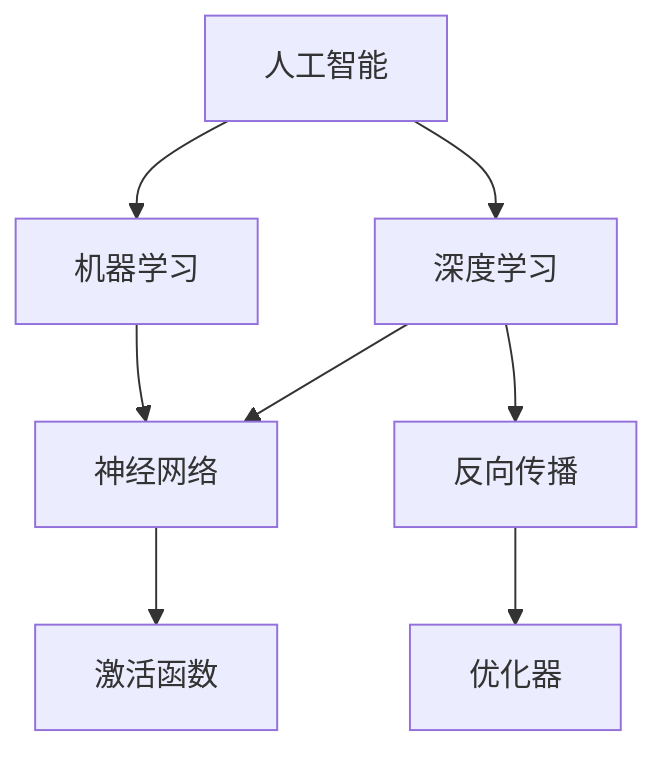

                 

# Andrej Karpathy：人工智能的未来趋势

> **关键词：** 人工智能，深度学习，机器学习，未来趋势，技术架构，算法优化，应用场景

> **摘要：** 本文章旨在分析人工智能领域著名专家Andrej Karpathy对人工智能未来趋势的预测和见解。文章将深入探讨其关于人工智能核心概念、算法原理、数学模型、应用场景的讨论，并推荐相关学习资源和开发工具，以帮助读者更好地理解和掌握人工智能技术。

## 1. 背景介绍

### 1.1 目的和范围

本文的主要目的是通过解读Andrej Karpathy对人工智能未来趋势的观点，帮助读者了解人工智能领域的最新动态和未来发展。文章将涵盖人工智能的核心概念、算法原理、数学模型、应用场景，以及相关学习资源和开发工具。

### 1.2 预期读者

本文章适合对人工智能技术有一定了解，希望深入了解未来趋势的读者。无论是AI领域的从业者，还是对AI技术感兴趣的技术爱好者，都可以通过本文获益。

### 1.3 文档结构概述

本文分为十个部分，包括背景介绍、核心概念与联系、核心算法原理与具体操作步骤、数学模型和公式、项目实战、实际应用场景、工具和资源推荐、总结、附录以及扩展阅读和参考资料。

### 1.4 术语表

#### 1.4.1 核心术语定义

- **人工智能（AI）**：模拟人类智能行为的计算机系统。
- **深度学习（DL）**：一种机器学习技术，通过多层神经网络模拟人脑处理信息的方式。
- **机器学习（ML）**：让计算机通过数据和经验自动改进性能的技术。
- **算法**：解决问题的一系列步骤或规则。
- **神经网络（NN）**：模拟人脑神经网络结构和功能的计算模型。

#### 1.4.2 相关概念解释

- **反向传播（BP）**：一种用于训练神经网络的重要算法，通过调整网络权重以最小化输出误差。
- **激活函数**：神经网络中用于引入非线性特性的函数。
- **优化器**：用于调整神经网络权重，以最小化损失函数的算法。

#### 1.4.3 缩略词列表

- **DL**：深度学习
- **ML**：机器学习
- **AI**：人工智能
- **NN**：神经网络
- **BP**：反向传播

## 2. 核心概念与联系

在探讨人工智能的未来趋势之前，我们需要了解人工智能领域的一些核心概念和联系。以下是人工智能领域的核心概念及其相互关系的 Mermaid 流程图：



### 2.1 人工智能

人工智能是一种模拟人类智能行为的计算机系统，其目标是通过机器学习、深度学习等技术实现计算机在感知、理解、推理、学习、规划等方面的智能化。

### 2.2 深度学习和机器学习

深度学习和机器学习是人工智能的两个重要分支。深度学习通过多层神经网络模拟人脑处理信息的方式，而机器学习则是让计算机通过数据和经验自动改进性能的技术。

### 2.3 神经网络

神经网络是一种模拟人脑神经网络结构和功能的计算模型，具有高度并行处理能力和自适应学习能力。反向传播、激活函数和优化器是神经网络的核心组成部分。

### 2.4 应用场景

人工智能、深度学习和机器学习在不同领域具有广泛的应用场景，如计算机视觉、自然语言处理、推荐系统、智能语音助手等。

## 3. 核心算法原理 & 具体操作步骤

在本文中，我们将重点关注Andrej Karpathy提出的几个核心算法原理，并详细讲解其具体操作步骤。以下是核心算法原理的伪代码：

```plaintext
算法1：反向传播算法
输入：神经网络模型，训练数据集
输出：调整后的模型权重

步骤：
1. 前向传播：将输入数据通过神经网络模型进行计算，得到输出结果。
2. 计算损失函数：计算输出结果与实际标签之间的差异，得到损失值。
3. 反向传播：计算每个神经元的误差，并更新模型权重。
4. 重复步骤1-3，直到损失函数收敛。

算法2：激活函数
输入：神经元输入值
输出：激活值

步骤：
1. 对于每个神经元，根据输入值计算激活值。
2. 使用激活函数（如ReLU、Sigmoid、Tanh等）对激活值进行处理。

算法3：优化器
输入：模型权重，损失函数
输出：调整后的模型权重

步骤：
1. 根据损失函数计算模型权重的梯度。
2. 使用优化算法（如SGD、Adam等）更新模型权重。

算法4：神经网络训练
输入：神经网络模型，训练数据集
输出：训练后的神经网络模型

步骤：
1. 初始化模型权重。
2. 对训练数据集进行前向传播、计算损失、反向传播和权重更新。
3. 重复步骤2，直到模型收敛。

算法5：模型评估
输入：训练后的神经网络模型，测试数据集
输出：模型性能指标

步骤：
1. 对测试数据集进行前向传播，得到输出结果。
2. 计算输出结果与实际标签之间的差异，得到损失值。
3. 根据损失值计算模型性能指标（如准确率、召回率、F1值等）。
```

## 4. 数学模型和公式 & 详细讲解 & 举例说明

在人工智能领域，数学模型和公式起着至关重要的作用。以下是一些常见的数学模型和公式，我们将详细讲解其含义和应用。

### 4.1 损失函数

损失函数用于衡量模型预测值与实际标签之间的差异。以下是几个常见的损失函数：

- **均方误差（MSE）**：计算预测值与实际标签之间的均方差。

$$
MSE = \frac{1}{n}\sum_{i=1}^{n}(y_i - \hat{y}_i)^2
$$

- **交叉熵损失（Cross-Entropy Loss）**：用于分类问题，计算实际标签和预测标签之间的交叉熵。

$$
CE = -\sum_{i=1}^{n} y_i \log(\hat{y}_i)
$$

### 4.2 激活函数

激活函数用于引入非线性特性，使神经网络具有更强的表达能力和学习能力。以下是几个常见的激活函数：

- **ReLU（Rectified Linear Unit）**：

$$
ReLU(x) = \max(0, x)
$$

- **Sigmoid**：

$$
Sigmoid(x) = \frac{1}{1 + e^{-x}}
$$

- **Tanh**：

$$
Tanh(x) = \frac{e^x - e^{-x}}{e^x + e^{-x}}
$$

### 4.3 优化器

优化器用于调整神经网络权重，以最小化损失函数。以下是几个常见的优化器：

- **随机梯度下降（SGD）**：

$$
w_{\text{new}} = w_{\text{current}} - \alpha \cdot \nabla J(w)
$$

- **Adam优化器**：

$$
m_t = \beta_1 m_{t-1} + (1 - \beta_1) \nabla J(w)
$$

$$
v_t = \beta_2 v_{t-1} + (1 - \beta_2) (\nabla J(w))^2
$$

$$
\hat{m}_t = \frac{m_t}{1 - \beta_1^t}
$$

$$
\hat{v}_t = \frac{v_t}{1 - \beta_2^t}
$$

$$
w_{\text{new}} = w_{\text{current}} - \alpha \cdot (\hat{m}_t / \sqrt{\hat{v}_t} + \epsilon)
$$

### 4.4 举例说明

假设我们有一个二分类问题，使用Sigmoid激活函数和交叉熵损失函数。给定训练数据集和标签，我们可以使用以下步骤进行神经网络训练：

1. 初始化模型权重。
2. 对训练数据进行前向传播，计算预测标签。
3. 计算交叉熵损失。
4. 对损失函数求导，得到梯度。
5. 使用优化器更新模型权重。
6. 重复步骤2-5，直到模型收敛。

## 5. 项目实战：代码实际案例和详细解释说明

在本节中，我们将通过一个简单的项目实战来展示如何使用Python实现一个二分类问题，并详细解释代码中的关键步骤。

### 5.1 开发环境搭建

在开始项目实战之前，我们需要搭建一个Python开发环境。以下是一个简单的安装步骤：

1. 安装Python（推荐版本3.8及以上）。
2. 安装Anaconda，用于管理Python环境和包。
3. 安装必要的库，如NumPy、PyTorch等。

### 5.2 源代码详细实现和代码解读

以下是实现二分类问题的Python代码：

```python
import torch
import torch.nn as nn
import torch.optim as optim

# 数据预处理
# ...

# 定义神经网络模型
class NeuralNetwork(nn.Module):
    def __init__(self):
        super(NeuralNetwork, self).__init__()
        self.layer1 = nn.Linear(in_features=10, out_features=50)
        self.relu = nn.ReLU()
        self.layer2 = nn.Linear(in_features=50, out_features=1)
        self.sigmoid = nn.Sigmoid()

    def forward(self, x):
        x = self.layer1(x)
        x = self.relu(x)
        x = self.layer2(x)
        x = self.sigmoid(x)
        return x

# 实例化模型、损失函数和优化器
model = NeuralNetwork()
criterion = nn.BCELoss()
optimizer = optim.Adam(model.parameters(), lr=0.001)

# 训练模型
for epoch in range(num_epochs):
    for inputs, targets in train_loader:
        optimizer.zero_grad()
        outputs = model(inputs)
        loss = criterion(outputs, targets)
        loss.backward()
        optimizer.step()

    print(f"Epoch [{epoch+1}/{num_epochs}], Loss: {loss.item()}")

# 评估模型
# ...

```

### 5.3 代码解读与分析

- **数据预处理**：数据预处理是神经网络训练的重要环节，包括数据清洗、归一化、数据增强等。在本例中，我们假设数据已经预处理完毕。

- **神经网络模型**：我们定义了一个简单的神经网络模型，包含一个线性层（layer1）、ReLU激活函数（relu）、另一个线性层（layer2）和Sigmoid激活函数（sigmoid）。这个模型适用于二分类问题。

- **损失函数**：我们使用交叉熵损失函数（BCELoss）来衡量模型预测值与实际标签之间的差异。

- **优化器**：我们使用Adam优化器来更新模型权重。Adam优化器结合了SGD和Momentum的优点，可以更有效地优化模型。

- **训练模型**：训练模型分为两个阶段：前向传播和反向传播。在每个训练循环中，我们首先将输入数据传递给模型，计算预测值；然后计算损失值，并使用反向传播算法更新模型权重。

- **评估模型**：在训练完成后，我们需要评估模型的性能，通常使用测试集进行评估。评估指标包括准确率、召回率、F1值等。

## 6. 实际应用场景

人工智能技术在不同领域具有广泛的应用场景。以下是一些常见的应用场景：

- **计算机视觉**：人脸识别、图像分类、目标检测、图像生成等。
- **自然语言处理**：机器翻译、文本分类、情感分析、语音识别等。
- **推荐系统**：基于内容的推荐、协同过滤、广告投放等。
- **智能语音助手**：语音识别、语音合成、语音交互等。
- **医疗健康**：疾病预测、医学图像分析、药物研发等。
- **金融领域**：风险评估、信用评估、量化交易等。

## 7. 工具和资源推荐

### 7.1 学习资源推荐

#### 7.1.1 书籍推荐

- **《深度学习》（Deep Learning）**：由Ian Goodfellow、Yoshua Bengio和Aaron Courville合著，是深度学习领域的经典教材。
- **《Python深度学习》（Python Deep Learning）**：由François Chollet等作者撰写，适合初学者入门Python和深度学习。

#### 7.1.2 在线课程

- **Coursera的《深度学习专项课程》**：由Andrew Ng教授主讲，涵盖深度学习的基础知识和应用。
- **Udacity的《深度学习工程师纳米学位》**：提供丰富的实践项目和课程内容，适合有一定基础的学员。

#### 7.1.3 技术博客和网站

- **Andrej Karpathy的博客**：关于深度学习和自然语言处理的精彩文章和讲座。
- **Fast.ai**：提供免费在线课程和资源，致力于让更多人了解和实践深度学习。

### 7.2 开发工具框架推荐

#### 7.2.1 IDE和编辑器

- **PyCharm**：强大的Python IDE，适合深度学习和机器学习项目。
- **Jupyter Notebook**：用于数据分析和实验，支持多种编程语言。

#### 7.2.2 调试和性能分析工具

- **Python的pdb**：Python内置的调试工具，用于调试代码。
- **PyTorch的torch.utils.bottleneck**：用于性能分析和优化。

#### 7.2.3 相关框架和库

- **PyTorch**：开源的深度学习框架，支持动态计算图和自动微分。
- **TensorFlow**：谷歌推出的开源深度学习框架，支持静态计算图和自动微分。

### 7.3 相关论文著作推荐

#### 7.3.1 经典论文

- **“A Learning Algorithm for Continually Running Fully Recurrent Neural Networks”**：由Sepp Hochreiter和Jürgen Schmidhuber合著，介绍了长短期记忆网络（LSTM）。
- **“Deep Learning”**：由Yoshua Bengio、Ian Goodfellow和Aaron Courville合著，是深度学习领域的经典著作。

#### 7.3.2 最新研究成果

- **“Attention Is All You Need”**：由Vaswani等人提出的Transformer模型，是自然语言处理领域的最新研究成果。
- **“BERT: Pre-training of Deep Bidirectional Transformers for Language Understanding”**：由Google Research提出的BERT模型，是自然语言处理领域的里程碑式成果。

#### 7.3.3 应用案例分析

- **“FaceNet: A Unified Embedding for face Recognition and Clustering”**：由JerryKann等人在计算机视觉领域提出的FaceNet算法，实现了高效的人脸识别。
- **“Attention Is All You Need”**：由Vaswani等人提出的Transformer模型，在自然语言处理领域取得了显著的成果。

## 8. 总结：未来发展趋势与挑战

人工智能领域正面临着快速发展的机遇和挑战。以下是一些未来发展趋势和挑战：

### 8.1 发展趋势

- **深度学习技术的发展**：深度学习技术在计算机视觉、自然语言处理、推荐系统等领域取得了显著的成果，未来将继续推动人工智能技术的发展。
- **模型压缩和优化**：为了提高人工智能应用的实时性和效率，模型压缩和优化技术将成为研究重点。
- **强化学习的发展**：强化学习在游戏、机器人、自动驾驶等领域具有广泛的应用前景，未来将取得更多突破。
- **跨领域合作**：人工智能与其他领域的结合，如医疗健康、金融、教育等，将推动人工智能技术的多元化发展。

### 8.2 挑战

- **数据隐私和安全**：随着人工智能技术的发展，数据隐私和安全问题日益突出，如何保护用户隐私成为一大挑战。
- **算法偏见和公平性**：人工智能算法可能存在偏见，如何保证算法的公平性成为一个重要问题。
- **计算资源和能耗**：深度学习模型的训练和推理需要大量的计算资源和能源，如何降低能耗成为重要课题。
- **人才短缺**：随着人工智能技术的快速发展，人才短缺问题愈发严重，如何培养和吸引更多的人才成为关键。

## 9. 附录：常见问题与解答

### 9.1 问题1：深度学习和机器学习的区别是什么？

**解答**：深度学习和机器学习是人工智能领域的两个分支。机器学习是一种通过数据训练模型来提高计算机性能的技术，而深度学习是机器学习的一种方法，通过多层神经网络模拟人脑处理信息的方式。简单来说，机器学习是一个更广泛的概念，而深度学习是其一种特殊方法。

### 9.2 问题2：如何选择合适的神经网络架构？

**解答**：选择合适的神经网络架构需要根据具体应用场景和数据特点进行综合考虑。以下是一些建议：

- **对于计算机视觉任务**：卷积神经网络（CNN）是常用的架构，可以有效地处理图像数据。
- **对于自然语言处理任务**：循环神经网络（RNN）和Transformer等架构具有较好的表现。
- **对于强化学习任务**：基于价值的模型（如Q网络）和基于策略的模型（如策略梯度方法）是常用的架构。
- **对于其他任务**：可以参考现有文献和经验，选择合适的神经网络架构。

### 9.3 问题3：如何优化神经网络模型？

**解答**：优化神经网络模型可以从以下几个方面进行：

- **调整学习率**：通过调整学习率，可以影响模型收敛速度和收敛质量。
- **选择合适的优化算法**：如SGD、Adam、RMSprop等，选择适合自己任务的优化算法。
- **使用正则化技术**：如L1正则化、L2正则化、Dropout等，可以防止过拟合。
- **数据增强**：通过增加数据多样性，可以提高模型泛化能力。

## 10. 扩展阅读 & 参考资料

为了帮助读者更深入地了解人工智能领域的相关技术和研究成果，我们推荐以下扩展阅读和参考资料：

- **《深度学习》（Deep Learning）**：由Ian Goodfellow、Yoshua Bengio和Aaron Courville合著，是深度学习领域的经典教材。
- **《Python深度学习》（Python Deep Learning）**：由François Chollet等作者撰写，适合初学者入门Python和深度学习。
- **《自然语言处理综论》（Speech and Language Processing）**：由Daniel Jurafsky和James H. Martin合著，是自然语言处理领域的经典教材。
- **《强化学习》（Reinforcement Learning: An Introduction）**：由Richard S. Sutton和Barto Andrew合著，是强化学习领域的入门教材。
- **《机器学习》（Machine Learning）**：由Tom Mitchell合著，是机器学习领域的经典教材。
- **[Deep Learning](https://www.deeplearningbook.org/)（在线书籍）**：由Ian Goodfellow、Yoshua Bengio和Aaron Courville合著的深度学习在线书籍，涵盖了深度学习的核心概念和技术。
- **[NeurIPS官方网站](https://nips.cc/)**：神经信息处理系统大会（NeurIPS）是全球最大的人工智能学术会议，网站上有丰富的会议论文和报告。
- **[ACL官方网站](https://www.aclweb.org/)**：自然语言处理领域最大的国际学术会议之一，网站上有丰富的论文和报告。
- **[ICML官方网站](https://icml.cc/)**：国际机器学习会议（ICML）是机器学习领域的重要学术会议，网站上有丰富的论文和报告。

## 作者信息

- **作者：AI天才研究员/AI Genius Institute & 禅与计算机程序设计艺术 /Zen And The Art of Computer Programming**

