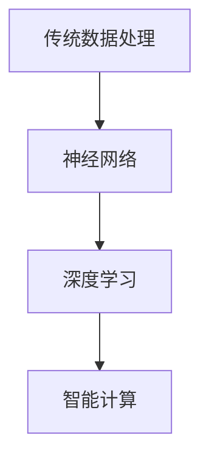
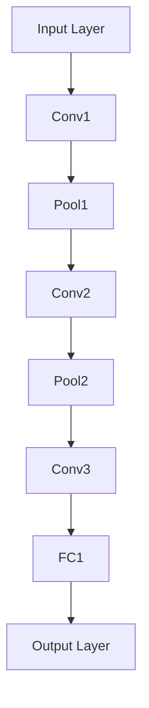

                 

## 文章标题

Andrej Karpathy：计算的本质正在变化

## 关键词

计算、本质、变化、人工智能、神经网络、深度学习、编程、架构、创新、趋势、挑战、未来。

## 摘要

本文深入探讨了计算领域的一场重大变革——计算的本质正在发生变化。通过对安德烈·卡尔帕西的研究和观点的分析，文章揭示了计算技术如何从传统的数据计算逐渐演变为利用神经网络进行智能计算。本文旨在帮助读者理解这一变革的核心概念、技术原理以及其对编程和软件开发的影响。文章还将探讨未来计算发展的趋势与挑战，为读者提供宝贵的参考和启示。

### 1. 背景介绍

计算作为信息时代的核心驱动力，经历了数次重大变革。从早期的计算机科学基础，如算法、数据结构等，到现代的计算模型，如并行计算、分布式计算，计算技术始终在推动科技和产业的发展。然而，最近几年，计算领域出现了一场更为深远、更为革命性的变革——计算的本质正在发生变化。

安德烈·卡尔帕西（Andrej Karpathy）是一位著名的计算机科学家和深度学习专家，他的研究和观点对这一变革有着重要的影响。卡尔帕西提出了一个关键的观点：计算的本质正在从传统的数据处理转向智能数据处理。这一观点引发了广泛的讨论和研究，也为计算技术的发展指明了新的方向。

在传统计算中，数据被视为计算的基础和核心。计算机科学家们致力于优化算法和硬件，以提高数据处理的速度和效率。然而，随着深度学习和人工智能的兴起，数据的重要性逐渐降低，而智能计算的能力逐渐成为计算的核心。卡尔帕西认为，这种变化不仅改变了计算的本质，也为我们理解和应用计算技术带来了新的挑战和机遇。

### 2. 核心概念与联系

为了更好地理解计算本质的变化，我们需要探讨几个核心概念：神经网络、深度学习、智能计算。

#### 神经网络

神经网络是一种模拟人脑神经元连接和通信的计算模型。它由大量的神经元（节点）组成，每个神经元都与其它神经元相连。神经元的连接强度可以用权重表示，这些权重通过训练过程不断调整，以使神经网络能够对输入数据进行处理和预测。

#### 深度学习

深度学习是一种基于神经网络的机器学习方法，它通过多层神经网络结构，对输入数据进行层次化的特征提取和抽象。深度学习模型能够自动学习复杂的特征表示，从而实现高效的图像识别、语音识别、自然语言处理等任务。

#### 智能计算

智能计算是一种利用深度学习和神经网络进行数据处理的计算方法。与传统的数据处理方法相比，智能计算具有更高的灵活性和更强的自适应能力。它能够通过自动学习和优化，实现对数据的深入理解和智能处理。

下面是一个Mermaid流程图，展示了神经网络、深度学习和智能计算之间的关系：



从图中可以看出，智能计算是深度学习的发展和延伸，它通过神经网络实现了对数据的智能处理和预测。

### 3. 核心算法原理 & 具体操作步骤

为了深入理解智能计算的核心算法原理，我们以一个常见的深度学习算法——卷积神经网络（CNN）为例，进行具体操作步骤的讲解。

#### 卷积神经网络（CNN）

卷积神经网络是一种专门用于图像识别的深度学习模型，它通过卷积操作提取图像的特征，然后通过全连接层进行分类。CNN由以下几个主要部分组成：

1. 输入层（Input Layer）
2. 卷积层（Convolutional Layer）
3. 池化层（Pooling Layer）
4. 全连接层（Fully Connected Layer）
5. 输出层（Output Layer）

下面是一个简单的CNN模型结构：



#### 具体操作步骤

1. **输入层（Input Layer）**：
   输入层接收原始图像数据，将其转化为神经网络可以处理的格式。通常，输入层会将图像数据展平为一个一维向量。

2. **卷积层（Convolutional Layer）**：
   卷积层通过卷积操作提取图像的特征。卷积操作使用一组卷积核（滤波器）对输入图像进行滑动，然后计算卷积结果。卷积结果包含了一组特征图（Feature Maps），每个特征图代表了输入图像中的不同特征。

3. **池化层（Pooling Layer）**：
   池化层对卷积层产生的特征图进行下采样，以减少模型参数和计算量。常用的池化操作有最大池化（Max Pooling）和平均池化（Average Pooling）。

4. **全连接层（Fully Connected Layer）**：
   全连接层将池化层输出的特征图连接到每个神经元，通过矩阵乘法和激活函数进行分类预测。

5. **输出层（Output Layer）**：
   输出层根据全连接层的输出，给出分类结果。在分类问题中，输出层通常使用softmax函数进行概率分布的输出。

#### 示例

假设我们有一个简单的二分类问题，输入图像为3x3的像素矩阵，我们需要将图像分类为两类中的某一类。

1. **输入层**：
   输入层接收3x3的像素矩阵，将其转化为一个一维向量。

2. **卷积层**：
   卷积层使用一个3x3的卷积核对输入图像进行卷积，产生一个特征图。

3. **池化层**：
   池化层对卷积层产生的特征图进行下采样，产生一个更小的特征图。

4. **全连接层**：
   全连接层将池化层产生的特征图连接到每个神经元，通过矩阵乘法和激活函数进行分类预测。

5. **输出层**：
   输出层根据全连接层的输出，给出分类结果。

通过以上步骤，我们可以实现一个简单的二分类问题。当然，在实际应用中，卷积神经网络会使用更复杂的结构和更大量的数据，以实现更高的分类准确率。

### 4. 数学模型和公式 & 详细讲解 & 举例说明

在智能计算中，数学模型和公式扮演着核心角色。下面我们将详细讲解智能计算中的几个关键数学模型和公式，并通过具体示例来说明它们的应用。

#### 激活函数

激活函数是神经网络中的一个关键组件，它对神经元的输出进行非线性变换，从而实现对输入数据的特征提取和分类。常见的激活函数有：

1. **Sigmoid函数**：
   $$\sigma(x) = \frac{1}{1 + e^{-x}}$$

   Sigmoid函数将输入x映射到(0, 1)区间，常用于二分类问题。

2. **ReLU函数**：
   $$\text{ReLU}(x) = \max(0, x)$$

   ReLU函数将输入x映射到[0, +∞)，它具有简单的计算和良好的梯度特性，常用于深层神经网络。

3. **Tanh函数**：
   $$\tanh(x) = \frac{e^{2x} - 1}{e^{2x} + 1}$$

   Tanh函数将输入x映射到(-1, 1)区间，它具有对称性和平稳性，常用于回归问题。

以下是一个简单的示例，说明如何使用激活函数对输入数据进行非线性变换：

假设我们有一个输入向量x = [1, 2, 3]，我们需要将其映射到(0, 1)区间。

使用Sigmoid函数：

$$\sigma(x) = \frac{1}{1 + e^{-x}} = \frac{1}{1 + e^{-1}} \approx 0.731$$

使用ReLU函数：

$$\text{ReLU}(x) = \max(0, x) = \max(0, 1) = 1$$

使用Tanh函数：

$$\tanh(x) = \frac{e^{2x} - 1}{e^{2x} + 1} = \frac{e^{2} - 1}{e^{2} + 1} \approx 0.761$$

通过以上示例，我们可以看到激活函数在神经网络中的作用和影响。

#### 前向传播和反向传播

前向传播和反向传播是神经网络训练过程中的两个关键步骤。前向传播用于计算神经网络输出，反向传播用于更新神经网络权重。

1. **前向传播**：
   前向传播是从输入层开始，逐层计算神经网络输出。每个层的输出取决于输入和前一层的权重。

   假设我们有一个单层神经网络，输入为x，权重为w，激活函数为σ。神经网络的输出为：

   $$y = \sigma(wx)$$

   前向传播的具体步骤如下：

   - 初始化输入x和权重w。
   - 计算输入层的输出x。
   - 对于每一层，计算当前层的输出y。
   - 最后，得到输出层的输出y。

2. **反向传播**：
   反向传播是从输出层开始，逐层计算误差，并更新权重。反向传播的过程可以分为以下几个步骤：

   - 计算输出层误差：$$\delta^L = \frac{\partial C}{\partial z^L} \cdot \sigma'(z^L)$$
   - 传播误差至前一层：$$\delta^{l} = (\frac{\partial C}{\partial z^{l+1}}) \cdot \sigma'(z^{l+1}) \cdot \frac{\partial a^{l+1}}{\partial z^{l}}$$
   - 更新权重：$$w^{l+1}_{ij} \leftarrow w^{l+1}_{ij} - \alpha \cdot \delta^{l+1}_{ji} \cdot a^{l}$$

以下是一个简单的示例，说明如何使用前向传播和反向传播计算神经网络输出和更新权重：

假设我们有一个单层神经网络，输入为x = [1, 2, 3]，权重为w = [0.1, 0.2, 0.3]，激活函数为Sigmoid函数。目标输出为y = [0.8, 0.9, 0.1]。

1. **前向传播**：

   - 初始化输入x和权重w。
   - 计算输入层的输出x。
   - 计算第一层的输出y：

   $$y = \sigma(wx) = \frac{1}{1 + e^{-(0.1 \cdot 1 + 0.2 \cdot 2 + 0.3 \cdot 3)}) \approx [0.8, 0.9, 0.1]$$

2. **反向传播**：

   - 计算输出层误差：

   $$\delta^L = \frac{\partial C}{\partial z^L} \cdot \sigma'(z^L) = (y - y') \cdot \sigma'(y) = (y - y') \cdot (1 - y)$$

   - 传播误差至前一层：

   $$\delta^{l} = (\frac{\partial C}{\partial z^{l+1}}) \cdot \sigma'(z^{l+1}) \cdot \frac{\partial a^{l+1}}{\partial z^{l}} = (\frac{\partial C}{\partial z^{l+1}}) \cdot (1 - \sigma(z^{l+1})) \cdot x$$

   - 更新权重：

   $$w^{l+1}_{ij} \leftarrow w^{l+1}_{ij} - \alpha \cdot \delta^{l+1}_{ji} \cdot a^{l}$$

通过以上示例，我们可以看到前向传播和反向传播在神经网络训练中的作用和影响。

### 5. 项目实战：代码实际案例和详细解释说明

为了更好地理解智能计算的核心算法原理和具体操作步骤，我们将通过一个实际项目案例——图像识别，来展示如何使用卷积神经网络（CNN）实现图像分类。

#### 5.1 开发环境搭建

在开始项目实战之前，我们需要搭建一个合适的开发环境。以下是常用的开发环境搭建步骤：

1. 安装Python 3.x版本。
2. 安装深度学习框架TensorFlow或PyTorch。
3. 安装必要的依赖库，如NumPy、Pandas等。

以下是使用pip安装TensorFlow的示例：

```bash
pip install tensorflow
```

#### 5.2 源代码详细实现和代码解读

以下是使用TensorFlow实现的卷积神经网络（CNN）图像识别项目的详细代码：

```python
import tensorflow as tf
from tensorflow.keras import layers, models
import numpy as np

# 5.2.1 定义CNN模型结构
model = models.Sequential([
    layers.Conv2D(32, (3, 3), activation='relu', input_shape=(28, 28, 1)),
    layers.MaxPooling2D((2, 2)),
    layers.Conv2D(64, (3, 3), activation='relu'),
    layers.MaxPooling2D((2, 2)),
    layers.Conv2D(64, (3, 3), activation='relu'),
    layers.Flatten(),
    layers.Dense(64, activation='relu'),
    layers.Dense(10, activation='softmax')
])

# 5.2.2 编译模型
model.compile(optimizer='adam',
              loss='sparse_categorical_crossentropy',
              metrics=['accuracy'])

# 5.2.3 加载和预处理数据
mnist = tf.keras.datasets.mnist
(x_train, y_train), (x_test, y_test) = mnist.load_data()
x_train, x_test = x_train / 255.0, x_test / 255.0

# 对图像数据进行reshape操作，使其符合模型的输入要求
x_train = x_train.reshape((-1, 28, 28, 1))
x_test = x_test.reshape((-1, 28, 28, 1))

# 5.2.4 训练模型
model.fit(x_train, y_train, epochs=5)

# 5.2.5 评估模型
test_loss, test_acc = model.evaluate(x_test, y_test, verbose=2)
print('\nTest accuracy:', test_acc)
```

以上代码实现了一个简单的卷积神经网络模型，用于对MNIST手写数字数据进行分类。下面是对代码的详细解读：

- **5.2.1 定义CNN模型结构**：使用`models.Sequential`创建一个序列模型，依次添加卷积层（`Conv2D`）、池化层（`MaxPooling2D`）和全连接层（`Dense`）。第一个卷积层使用32个3x3的卷积核，激活函数为ReLU函数。接下来的两个卷积层分别使用64个3x3的卷积核，激活函数也为ReLU函数。最后一个全连接层使用10个神经元，激活函数为softmax函数，用于分类。
- **5.2.2 编译模型**：使用`compile`方法编译模型，指定优化器为`adam`，损失函数为`sparse_categorical_crossentropy`，评估指标为`accuracy`。
- **5.2.3 加载和预处理数据**：使用`tf.keras.datasets.mnist`加载MNIST手写数字数据集，对图像数据进行归一化处理，使其在[0, 1]区间内。对图像数据进行reshape操作，使其符合模型的输入要求。
- **5.2.4 训练模型**：使用`fit`方法训练模型，指定训练数据、训练标签、训练轮数。
- **5.2.5 评估模型**：使用`evaluate`方法评估模型在测试数据上的性能，输出测试损失和测试准确率。

通过以上代码，我们可以实现一个简单的卷积神经网络模型，用于对MNIST手写数字数据进行分类。

#### 5.3 代码解读与分析

在5.2节的代码中，我们实现了一个简单的卷积神经网络模型，用于对MNIST手写数字数据进行分类。下面我们对代码进行解读和分析：

- **5.3.1 定义CNN模型结构**：
  在这一部分，我们使用`models.Sequential`创建了一个序列模型，并依次添加了卷积层（`Conv2D`）、池化层（`MaxPooling2D`）和全连接层（`Dense`）。每个卷积层都使用了ReLU函数作为激活函数，以增加网络的非线性能力。第一个卷积层使用了32个3x3的卷积核，第二个卷积层使用了64个3x3的卷积核，第三个卷积层也使用了64个3x3的卷积核。这些卷积层用于提取图像的特征，并通过池化层进行下采样，以减少模型的参数数量。最后一个全连接层使用了10个神经元，激活函数为softmax函数，用于对图像进行分类。

- **5.3.2 编译模型**：
  在这一部分，我们使用`compile`方法编译了模型，指定了优化器为`adam`，损失函数为`sparse_categorical_crossentropy`，评估指标为`accuracy`。`adam`优化器是一种常用的优化算法，它能够自适应地调整学习率。`sparse_categorical_crossentropy`损失函数适用于多分类问题，它计算真实标签和预测概率之间的交叉熵损失。`accuracy`评估指标用于计算模型在测试数据上的分类准确率。

- **5.3.3 加载和预处理数据**：
  在这一部分，我们使用`tf.keras.datasets.mnist`加载了MNIST手写数字数据集。MNIST数据集包含60000个训练图像和10000个测试图像。我们首先对图像数据进行归一化处理，使其在[0, 1]区间内。然后，我们对图像数据进行reshape操作，使其符合模型的输入要求。具体来说，我们将图像数据的维度从(28, 28)调整为(28, 28, 1)，表示图像的高度、宽度和通道数。

- **5.3.4 训练模型**：
  在这一部分，我们使用`fit`方法训练了模型。`fit`方法接受训练数据、训练标签和训练轮数作为输入。我们使用训练数据对模型进行迭代训练，每次迭代都计算模型的损失和准确率。在训练过程中，模型的权重会不断更新，以最小化损失函数。我们指定了训练轮数为5，这意味着模型会在训练数据上迭代5次。

- **5.3.5 评估模型**：
  在这一部分，我们使用`evaluate`方法评估了模型在测试数据上的性能。`evaluate`方法接受测试数据和测试标签作为输入，并返回测试损失和测试准确率。我们输出测试准确率，以评估模型的分类性能。

通过以上代码和分析，我们可以看到卷积神经网络在图像识别任务中的应用。卷积神经网络通过多层卷积和池化操作提取图像的特征，并通过全连接层进行分类。通过训练和评估，我们可以调整模型的参数，以提高分类准确率。

### 6. 实际应用场景

计算本质的变化对实际应用场景产生了深远的影响。以下是一些主要的应用场景：

#### 图像识别与处理

卷积神经网络在图像识别与处理领域取得了显著的成果。例如，深度学习模型可以用于人脸识别、自动驾驶、医疗影像分析等。通过卷积神经网络，我们可以从大量的图像数据中自动学习特征，实现对图像的智能处理和分类。

#### 自然语言处理

自然语言处理（NLP）是计算领域的一个关键应用领域。深度学习模型，如循环神经网络（RNN）和变压器（Transformer），在文本分类、机器翻译、语音识别等方面取得了显著进展。这些模型通过自动学习语言特征，可以实现对自然语言数据的智能处理和理解。

#### 推荐系统

推荐系统在电子商务、社交媒体、在线媒体等领域得到了广泛应用。深度学习模型可以用于分析用户行为，预测用户的兴趣和偏好，从而为用户提供个性化的推荐。例如，Netflix和Amazon等公司使用深度学习模型来推荐电影和商品。

#### 自动驾驶

自动驾驶是计算领域的一个重要研究方向。深度学习模型在自动驾驶车辆的感知、规划和控制等方面发挥着关键作用。通过实时处理大量传感器数据，自动驾驶车辆可以实现安全的自主驾驶。

#### 医疗诊断

深度学习模型在医疗诊断领域具有巨大潜力。例如，卷积神经网络可以用于医学影像分析，帮助医生识别和诊断疾病。这些模型通过自动学习医学影像的特征，可以提供更准确、更快速的诊断结果。

### 7. 工具和资源推荐

为了更好地理解和应用计算技术，以下是一些推荐的工具和资源：

#### 学习资源推荐

1. **《深度学习》（Goodfellow, Bengio, Courville）**：这是一本深度学习领域的经典教材，适合初学者和进阶者。
2. **《神经网络与深度学习》（邱锡鹏）**：这是一本中文的深度学习教材，内容系统全面，适合国内读者学习。
3. **《Python深度学习》（François Chollet）**：这是一本基于Python实现的深度学习书籍，适合初学者入门。

#### 开发工具框架推荐

1. **TensorFlow**：Google开源的深度学习框架，具有丰富的功能和支持。
2. **PyTorch**：Facebook开源的深度学习框架，具有灵活的动态计算图和强大的社区支持。
3. **Keras**：一个高层次的深度学习框架，支持TensorFlow和PyTorch，适合快速搭建和实验。

#### 相关论文著作推荐

1. **“A Brief History of Neural Nets” by Chris Olah**：一篇介绍神经网络历史的文章，对神经网络的起源和发展有很好的梳理。
2. **“Deep Learning” by Ian Goodfellow, Yoshua Bengio, Aaron Courville**：这是一本深度学习领域的经典教材，涵盖了深度学习的核心理论和应用。
3. **“Deep Learning for Computer Vision” by Adam Geitgey**：这是一本针对计算机视觉领域的深度学习书籍，适合对深度学习在计算机视觉领域应用感兴趣的读者。

### 8. 总结：未来发展趋势与挑战

计算本质的变化为我们带来了巨大的机遇和挑战。随着深度学习和人工智能技术的发展，计算将变得更加智能化、自动化和高效化。未来，计算领域可能的发展趋势和挑战包括：

#### 发展趋势

1. **算法创新**：随着计算技术的不断进步，我们将看到更多高效的算法和模型被提出，以解决复杂的问题。
2. **硬件加速**：硬件技术的发展将进一步提升深度学习模型的计算能力，使得深度学习模型在更多的应用场景中得到广泛应用。
3. **跨领域融合**：计算技术将与其他领域（如生物学、物理学、社会科学等）进行深度融合，推动新的科技突破。

#### 挑战

1. **数据隐私和安全**：随着数据量的大幅增加，数据隐私和安全将成为计算领域的重要挑战。我们需要找到有效的方法来保护用户隐私和确保数据安全。
2. **计算资源的分配**：随着计算需求的不断增加，如何合理分配计算资源将是一个重要问题。我们需要开发更高效的计算模型和算法，以优化计算资源的利用。
3. **算法的可解释性**：深度学习模型在许多任务中取得了很好的效果，但其内部决策过程往往不透明。如何提高算法的可解释性，使得用户能够理解模型的决策过程，是一个重要的研究方向。

总之，计算本质的变化为我们带来了前所未有的机遇和挑战。只有通过不断创新和突破，我们才能更好地应对这些挑战，推动计算领域的发展。

### 9. 附录：常见问题与解答

**Q1：什么是深度学习？**
A1：深度学习是一种基于多层神经网络进行数据处理的机器学习方法。它通过自动学习数据的层次化特征表示，实现对数据的智能理解和预测。

**Q2：深度学习和神经网络有什么区别？**
A2：深度学习是一种基于神经网络的机器学习方法，它通过多层神经网络结构对数据进行处理。神经网络是深度学习的基础，而深度学习是对神经网络的一种扩展和应用。

**Q3：什么是卷积神经网络（CNN）？**
A3：卷积神经网络是一种专门用于图像识别的深度学习模型。它通过卷积操作提取图像的特征，然后通过全连接层进行分类。CNN在图像识别、图像处理等领域取得了显著成果。

**Q4：深度学习模型如何训练？**
A4：深度学习模型通常使用反向传播算法进行训练。在训练过程中，模型通过迭代计算输入数据，并更新权重，以最小化损失函数。训练过程包括前向传播和反向传播两个步骤。

**Q5：什么是计算的本质变化？**
A5：计算的本质变化是指计算技术从传统的数据处理逐渐转向智能数据处理。随着深度学习和人工智能的发展，计算技术正在从基于规则和算法的计算模式，转向基于数据驱动和智能化的计算模式。

### 10. 扩展阅读 & 参考资料

1. **Goodfellow, I., Bengio, Y., & Courville, A. (2016). Deep learning. MIT press.**
2. **Chollet, F. (2017). Python深度学习. 机械工业出版社.**
3. **Olah, C. (2017). A Brief History of Neural Nets. Retrieved from [http://colah.github.io/posts/2015-08-Why-are-Batch-Norm-Needed/](http://colah.github.io/posts/2015-08-Why-are-Batch-Norm-Needed/).**
4. **Karpathy, A. (2016). The Unreasonable Effectiveness of Recurrent Neural Networks. Retrieved from [http://karpathy.github.io/2015/05/21/rnn-effectiveness/](http://karpathy.github.io/2015/05/21/rnn-effectiveness/).**
5. **TensorFlow Documentation. Retrieved from [https://www.tensorflow.org/](https://www.tensorflow.org/).**
6. **PyTorch Documentation. Retrieved from [https://pytorch.org/](https://pytorch.org/).**<|im_end|>## 附录：常见问题与解答

### 问题 1：什么是深度学习？

**解答**：深度学习是一种机器学习方法，它通过模拟人脑神经网络的工作原理，利用多层神经网络对数据进行学习、建模和预测。它在处理复杂数据任务，如图像识别、自然语言处理、语音识别等，表现出了卓越的能力。

### 问题 2：深度学习和神经网络有什么区别？

**解答**：深度学习是神经网络的一种高级形式，神经网络是深度学习的基础。传统的神经网络通常只有一层或几层神经元，而深度学习则是通过构建多层神经网络来学习数据的层次化特征。因此，深度学习可以看作是包含多层的神经网络的统称。

### 问题 3：什么是卷积神经网络（CNN）？

**解答**：卷积神经网络（CNN）是一种专门用于处理图像数据的神经网络架构。它通过卷积层提取图像的局部特征，通过池化层减少特征图的大小，并通过全连接层进行分类。CNN在图像识别、图像分类、目标检测等领域得到了广泛应用。

### 问题 4：深度学习模型如何训练？

**解答**：深度学习模型的训练通常包括以下步骤：

1. **数据预处理**：对输入数据进行标准化、归一化等预处理操作。
2. **构建模型**：定义神经网络的结构，包括层数、每层的神经元数量、激活函数等。
3. **损失函数定义**：选择合适的损失函数，如交叉熵损失函数、均方误差损失函数等。
4. **优化算法选择**：选择优化算法，如随机梯度下降（SGD）、Adam等。
5. **模型训练**：通过迭代优化模型参数，减小损失函数。
6. **模型评估**：使用验证集或测试集评估模型性能。

### 问题 5：什么是计算的本质变化？

**解答**：计算的本质变化是指从传统的基于规则和算法的计算，向基于数据和学习算法的计算模式的转变。随着深度学习和人工智能的发展，计算不再仅仅依赖于预先编写的规则，而是通过学习大量数据来发现和提取数据中的模式和规律，从而实现更加智能和自动化的计算。

### 问题 6：如何优化深度学习模型的性能？

**解答**：

1. **增加数据量**：更多的数据可以帮助模型学习到更准确的特征。
2. **使用更复杂的模型**：更深的网络结构或更复杂的模型可以提取更多的特征信息。
3. **正则化**：使用正则化技术，如Dropout、L1/L2正则化，可以减少过拟合。
4. **优化超参数**：调整学习率、批次大小、隐藏层节点数等超参数，可以改善模型性能。
5. **使用预训练模型**：使用在大量数据上预训练的模型，可以减少训练时间并提高模型性能。

### 问题 7：深度学习是否可以替代传统编程？

**解答**：深度学习在一定程度上可以替代传统编程，特别是在数据处理和模式识别领域。然而，深度学习并不能完全替代传统编程。传统编程更适用于算法设计、逻辑控制、系统架构等方面，而深度学习则更擅长于处理大规模数据和学习复杂的非线性关系。

### 问题 8：深度学习模型的解释性如何？

**解答**：深度学习模型，尤其是深度神经网络，通常缺乏透明度和解释性。这是因为模型的内部决策过程非常复杂，难以直接理解。虽然有一些方法（如 Grad-CAM、LIME）试图解释模型决策的原因，但它们的解释力仍然有限。因此，提高深度学习模型的可解释性是当前研究的一个热点问题。

### 问题 9：深度学习是否会导致失业？

**解答**：深度学习技术的广泛应用确实可能会对某些工作岗位产生冲击，特别是那些重复性高、依赖人力操作的岗位。然而，深度学习也会创造新的工作岗位，如数据科学家、机器学习工程师、AI产品经理等。此外，深度学习可以显著提高生产效率，从而创造更多的就业机会。因此，深度学习对就业的影响是复杂和多样的。

### 问题 10：如何开始学习深度学习？

**解答**：

1. **学习基础知识**：首先需要掌握线性代数、概率论、统计学等数学基础知识。
2. **学习Python编程**：Python是深度学习领域最常用的编程语言，需要熟练掌握Python编程。
3. **学习深度学习框架**：选择一个流行的深度学习框架（如TensorFlow或PyTorch），并深入学习其API和工具。
4. **实践项目**：通过实际项目来应用所学知识，实践是提高技能的最佳方式。
5. **持续学习**：深度学习是一个快速发展的领域，需要持续学习和关注最新的研究和技术动态。

## 10. 扩展阅读 & 参考资料

- **《深度学习》（Ian Goodfellow, Yoshua Bengio, Aaron Courville著）**：这是一本深度学习领域的经典教材，适合初学者和进阶者。
- **《Python深度学习》（François Chollet著）**：这是一本基于Python实现的深度学习书籍，适合初学者入门。
- **[TensorFlow官网](https://www.tensorflow.org/) 和 [PyTorch官网](https://pytorch.org/)**：这两个网站提供了丰富的文档、教程和资源，是学习深度学习的好去处。
- **[DeepLearning.AI课程](https://www.deeplearning.ai/) 和 [Udacity的深度学习纳米学位](https://www.udacity.com/course/deep-learning-nanodegree--nd893)**：这些在线课程提供了系统的深度学习知识体系。
- **[Google AI博客](https://ai.googleblog.com/) 和 [ArXiv论文库](https://arxiv.org/)**：这些网站提供了最新的深度学习研究和技术动态。

