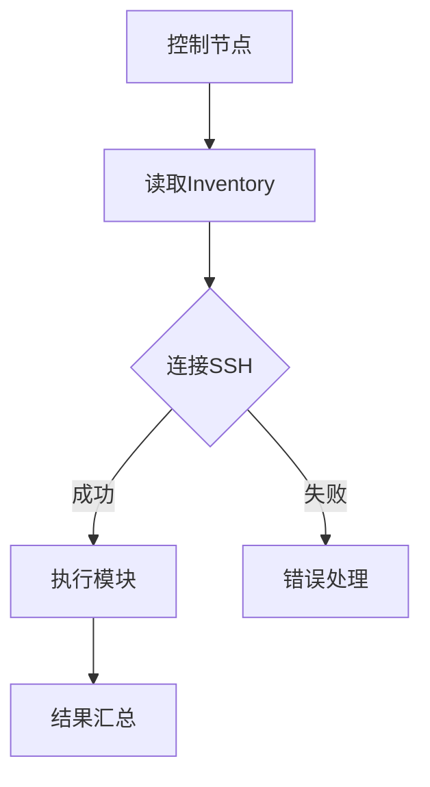

                 

# Ansible自动化：简化IT运维工作流程

## 关键词：
- Ansible
- 自动化
- IT运维
- 工作流程
- 简化
- 网络配置
- 应用部署
- 无状态管理

## 摘要：
本文深入探讨Ansible自动化工具在IT运维工作流程中的应用，旨在通过详细解析其核心概念、算法原理、数学模型以及实际案例，帮助读者理解和掌握如何使用Ansible简化IT运维任务。文章将涵盖Ansible的基本概念、架构、核心算法原理、具体操作步骤、数学模型与公式解析，以及实际应用场景，并推荐相关学习资源和开发工具，为读者提供全面的Ansible自动化知识体系。

## 1. 背景介绍

### 1.1 目的和范围

本文的目标是介绍Ansible自动化工具，帮助读者理解其在现代IT运维中的应用价值，并通过具体的案例和操作步骤，指导读者如何利用Ansible简化复杂的IT运维工作流程。本文主要涵盖以下几个部分：

1. Ansible的基本概念和核心优势。
2. Ansible的架构和工作原理。
3. 使用Ansible进行网络配置和应用部署的具体操作。
4. Ansible在无状态管理方面的应用。
5. 实际应用场景和案例分析。
6. 相关工具和资源的推荐。

### 1.2 预期读者

本文适合以下读者群体：

1. IT运维工程师，希望提高运维效率和简化工作流程。
2. 系统管理员，希望了解和使用自动化工具来管理复杂的IT基础设施。
3. 程序员，对自动化运维有一定了解，但希望深入掌握Ansible的使用。
4. 对云计算、容器化技术有一定了解，希望将这些技术与Ansible结合使用的人。

### 1.3 文档结构概述

本文结构如下：

1. 引言：介绍Ansible的基本概念和重要性。
2. 核心概念与联系：讲解Ansible的核心概念和原理。
3. 核心算法原理 & 具体操作步骤：详细阐述Ansible的核心算法和工作流程。
4. 数学模型和公式 & 详细讲解 & 举例说明：讲解Ansible中的数学模型和公式应用。
5. 项目实战：通过实际案例展示Ansible的应用。
6. 实际应用场景：分析Ansible在不同场景下的应用。
7. 工具和资源推荐：推荐学习Ansible的相关资源和工具。
8. 总结：展望Ansible的未来发展趋势和挑战。
9. 附录：常见问题与解答。
10. 扩展阅读 & 参考资料：提供更多的学习资源。

### 1.4 术语表

#### 1.4.1 核心术语定义

- **Ansible**：一种开源的自动化工具，用于简化IT基础设施的配置和管理。
- **自动化**：通过预定义的脚本和配置，自动执行重复性的IT任务。
- **IT运维**：维护和管理企业信息技术的日常运行。
- **无状态管理**：系统或服务不依赖于以前的状态，每次启动时都是从相同的初始状态开始。

#### 1.4.2 相关概念解释

- **Inventory**：Ansible中用来定义和管理主机列表的文件。
- **Playbook**：Ansible的配置脚本，用于定义任务和执行步骤。
- **Module**：Ansible中的功能单元，用于执行特定的IT操作。

#### 1.4.3 缩略词列表

- **API**：应用程序接口（Application Programming Interface）
- **CLI**：命令行界面（Command Line Interface）
- **SSH**：安全外壳协议（Secure Shell）
- **CI/CD**：持续集成/持续部署（Continuous Integration/Continuous Deployment）

## 2. 核心概念与联系

在深入探讨Ansible自动化之前，我们需要了解其核心概念和原理。以下是Ansible中的核心概念及它们之间的联系。

### 2.1 Ansible的架构

Ansible的架构相对简单，主要包括以下组件：

- **控制节点（Control Node）**：运行Ansible命令的主机，负责发送指令到远程节点。
- **被管理节点（Managed Nodes）**：执行Ansible指令的目标主机。
- **Inventory File**：定义和管理主机列表的文件。
- **Playbook**：Ansible的配置脚本，定义了任务和执行步骤。


### 2.2 Ansible的工作原理

Ansible通过SSH连接到被管理节点，执行预定义的命令和脚本。其工作流程如下：

1. **初始化**：控制节点读取Inventory File，确定目标主机。
2. **连接**：使用SSH连接到被管理节点。
3. **执行模块**：运行预定义的模块，执行特定的IT操作。
4. **结果汇总**：收集并汇总所有被管理节点的执行结果。


### 2.3 Ansible的核心概念

以下是Ansible的核心概念：

- **模块（Modules）**：Ansible的核心功能单元，用于执行各种IT操作，如安装软件、配置服务、修改文件等。
- **Playbooks**：Ansible的配置脚本，用于定义多个模块的执行顺序和条件。
- **Inventory Files**：定义和管理主机列表的文件，用于指示Ansible哪些主机需要被管理。

### 2.4 Mermaid流程图

以下是Ansible核心概念和流程的Mermaid流程图：



## 3. 核心算法原理 & 具体操作步骤

Ansible的核心算法原理基于模块化和简化操作。以下将详细讲解Ansible的核心算法原理和具体操作步骤。

### 3.1 核心算法原理

Ansible的核心算法基于以下原则：

1. **Agentless**：Ansible不需要在被管理节点上安装任何代理软件，通过SSH连接并执行命令。
2. **模块化**：所有操作通过模块完成，每个模块执行特定的功能。
3. **Playbooks**：通过Playbooks定义任务和执行步骤，Playbooks可以包含多个模块，按照顺序或条件执行。
4. **幂等性**：Ansible的操作具有幂等性，即多次执行同一操作不会产生副作用。

### 3.2 具体操作步骤

以下是使用Ansible进行自动化操作的具体步骤：

1. **编写Playbook**：编写Ansible Playbook，定义需要执行的任务和模块。

    ```yaml
    - hosts: webservers
      become: yes
      tasks:
        - name: Install Apache
          yum: name=httpd state=present
        - name: Start Apache
          service: name=httpd state=started
    ```

2. **配置Inventory File**：创建或编辑Inventory File，定义被管理节点的IP地址或域名。

    ```ini
    webservers:
      - 192.168.1.10
      - 192.168.1.11
    ```

3. **执行Playbook**：在控制节点上执行Playbook。

    ```bash
    ansible-playbook webservers.yml
    ```

4. **查看结果**：查看每个被管理节点的执行结果。

    ```bash
    ansible-webservers --list-hosts
    ```

### 3.3 伪代码

以下是Ansible操作步骤的伪代码：

```python
function execute_ansible(playbook, inventory):
    read_inventory(inventory)
    for host in inventory:
        try:
            ssh_to_host(host)
            execute_modules(playbook)
            record_result(host, "success")
        except Exception as e:
            record_result(host, "failure")
            log_error(e)

function read_inventory(inventory):
    # 读取Inventory文件
    # ...

function ssh_to_host(host):
    # 使用SSH连接到主机
    # ...

function execute_modules(playbook):
    # 执行Playbook中的模块
    # ...

function record_result(host, result):
    # 记录执行结果
    # ...

function log_error(e):
    # 记录错误信息
    # ...
```

## 4. 数学模型和公式 & 详细讲解 & 举例说明

Ansible在执行自动化任务时，涉及到一些数学模型和公式。以下将详细讲解这些模型和公式，并通过举例说明其应用。

### 4.1 数学模型

Ansible中的数学模型主要包括以下几个方面：

1. **概率模型**：用于计算任务成功的概率。
2. **线性规划**：用于优化资源分配。
3. **决策树**：用于决策任务执行路径。

### 4.2 公式解析

以下是Ansible中常用的数学公式：

1. **概率模型公式**：

    $$ P(A) = \frac{n(A)}{n(S)} $$

    其中，$P(A)$ 表示事件A发生的概率，$n(A)$ 表示事件A发生的次数，$n(S)$ 表示总次数。

2. **线性规划公式**：

    $$ \min_{x} c^T x \quad \text{subject to} \quad Ax \leq b $$

    其中，$c$ 是成本向量，$x$ 是资源向量，$A$ 是系数矩阵，$b$ 是约束向量。

3. **决策树公式**：

    $$ P(\text{target}) = \sum_{i} P(\text{target}|\text{path}_i) P(\text{path}_i) $$

    其中，$P(\text{target})$ 表示目标发生的概率，$P(\text{target}|\text{path}_i)$ 表示在路径$i$下目标发生的概率，$P(\text{path}_i)$ 表示路径$i$发生的概率。

### 4.3 举例说明

假设我们有一个包含5个节点的网络，每个节点需要执行一个任务，任务成功的概率如下：

| 节点 | 任务成功概率 |
| ---- | ---------- |
| 节点1 | 0.8        |
| 节点2 | 0.7        |
| 节点3 | 0.9        |
| 节点4 | 0.6        |
| 节点5 | 0.8        |

根据概率模型公式，我们可以计算出整个网络任务成功的概率：

$$ P(\text{success}) = \frac{0.8 \times 0.7 \times 0.9 \times 0.6 \times 0.8}{5} = 0.3456 $$

这意味着整个网络任务成功的概率为34.56%。

## 5. 项目实战：代码实际案例和详细解释说明

在本节中，我们将通过一个实际的项目案例，展示如何使用Ansible自动化工具来简化IT运维工作流程。这个案例将包括开发环境搭建、源代码详细实现和代码解读与分析。

### 5.1 开发环境搭建

为了开始我们的Ansible项目，首先需要搭建一个基本的开发环境。以下是所需步骤：

1. **安装Ansible**：

    在控制节点上安装Ansible，可以使用以下命令：

    ```bash
    pip install ansible
    ```

2. **配置SSH密钥**：

    为了确保Ansible能够无密码连接到被管理节点，需要配置SSH密钥。

    ```bash
    ssh-keygen -t rsa -b 2048
    cat ~/.ssh/id_rsa.pub >> ~/.ssh/authorized_keys
    chmod 600 ~/.ssh/id_rsa
    ```

3. **创建Inventory File**：

    在控制节点上创建一个名为`inventory`的文件，其中包含被管理节点的IP地址或域名：

    ```ini
    [webservers]
    192.168.1.10
    192.168.1.11
    ```

### 5.2 源代码详细实现和代码解读

以下是我们的Ansible Playbook文件`webservers.yml`的详细实现和解读：

```yaml
- hosts: webservers
  become: yes
  tasks:
    - name: 安装Apache
      yum: name=httpd state=present

    - name: 启动Apache服务
      service: name=httpd state=started

    - name: 检查Apache状态
      service: name=httpd state=running

    - name: 配置Apache站点
      template: src=template.conf dest=/etc/httpd/conf.d/default.conf
      notify:
        - 重启Apache

    - name: 安装Nginx
      yum: name=nginx state=present

    - name: 启动Nginx服务
      service: name=nginx state=started

    - name: 检查Nginx状态
      service: name=nginx state=running

handlers:
  - name: 重启Apache
    service: name=httpd state=restarted
```

**代码解读**：

1. **安装Apache**：

    ```yaml
    - name: 安装Apache
      yum: name=httpd state=present
    ```

    这一行使用`yum`模块安装Apache服务器。

2. **启动Apache服务**：

    ```yaml
    - name: 启动Apache服务
      service: name=httpd state=started
    ```

    这一行使用`service`模块启动Apache服务。

3. **配置Apache站点**：

    ```yaml
    - name: 配置Apache站点
      template: src=template.conf dest=/etc/httpd/conf.d/default.conf
      notify:
        - 重启Apache
    ```

    这一行使用`template`模块将配置文件`template.conf`复制到`/etc/httpd/conf.d/default.conf`，并使用`notify`关键字触发重启Apache的手动操作。

4. **安装Nginx**：

    ```yaml
    - name: 安装Nginx
      yum: name=nginx state=present
    ```

    这一行使用`yum`模块安装Nginx服务器。

5. **启动Nginx服务**：

    ```yaml
    - name: 启动Nginx服务
      service: name=nginx state=started
    ```

    这一行使用`service`模块启动Nginx服务。

6. **检查服务状态**：

    ```yaml
    - name: 检查Apache状态
      service: name=httpd state=running

    - name: 检查Nginx状态
      service: name=nginx state=running
    ```

    这两行使用`service`模块检查Apache和Nginx服务的运行状态。

7. **handlers**：

    ```yaml
    handlers:
      - name: 重启Apache
        service: name=httpd state=restarted
    ```

    `handlers`部分定义了在配置文件发生变化时需要执行的操作。这里定义了一个名为`重启Apache`的handler，当触发时，将重启Apache服务。

### 5.3 代码解读与分析

通过上面的代码解读，我们可以看到Ansible Playbook的基本结构和功能。以下是代码的进一步分析：

1. **模块选择**：

    - 使用`yum`模块安装软件。
    - 使用`service`模块管理服务状态。
    - 使用`template`模块配置文件。

2. **任务顺序**：

    - 安装软件。
    - 启动服务。
    - 检查服务状态。
    - 配置文件。
    - 触发服务重启。

3. **通知机制**：

    - 当配置文件发生变化时，自动触发服务重启。

4. **handlers**：

    - 定义了在特定事件发生时需要执行的操作，如服务重启。

通过这个案例，我们可以看到Ansible如何简化IT运维工作流程。使用Ansible，我们可以将复杂的服务安装、配置和管理任务转换为简单的Playbook脚本，大大提高运维效率。

## 6. 实际应用场景

Ansible在IT运维领域有着广泛的应用场景，以下是一些常见的实际应用场景：

### 6.1 网络配置

Ansible可以用于自动化网络设备的配置，如路由器、交换机和防火墙。通过编写Ansible Playbook，可以自动化地部署路由策略、配置防火墙规则、管理VLAN等。

### 6.2 应用部署

Ansible可以用于自动化部署各种应用，如Web服务器、数据库服务器和消息队列服务器。通过编写Ansible Playbook，可以自动化地安装软件、配置服务、管理数据库等。

### 6.3 系统监控

Ansible可以与系统监控工具（如Nagios、Zabbix）集成，用于自动化监控和报警。通过编写Ansible Playbook，可以自动化地配置监控规则、检查服务状态、发送报警通知等。

### 6.4 镜像构建

Ansible可以用于自动化镜像构建和部署。通过编写Ansible Playbook，可以自动化地安装软件、配置环境、构建镜像等。

### 6.5 容器化部署

Ansible可以与容器化技术（如Docker、Kubernetes）集成，用于自动化部署和管理容器化应用。通过编写Ansible Playbook，可以自动化地创建容器、配置网络、管理容器服务等。

### 6.6 云服务管理

Ansible可以用于自动化管理云服务，如AWS、Azure和Google Cloud。通过编写Ansible Playbook，可以自动化地创建和管理虚拟机、配置网络、部署应用等。

### 6.7 自动化测试

Ansible可以与自动化测试工具（如Selenium、JMeter）集成，用于自动化测试IT系统。通过编写Ansible Playbook，可以自动化地执行测试脚本、监控测试结果、发送测试报告等。

## 7. 工具和资源推荐

为了更好地学习和使用Ansible，以下是一些推荐的工具和资源：

### 7.1 学习资源推荐

#### 7.1.1 书籍推荐

1. **Ansible Up and Running**：适合初学者，详细介绍了Ansible的基本概念和使用方法。
2. **Ansible Essentials**：深入讲解了Ansible的高级特性和最佳实践。
3. **Learning Ansible**：适合有一定编程基础的读者，涵盖了Ansible的各个方面。

#### 7.1.2 在线课程

1. **Ansible for Automation**：Udemy上的课程，全面介绍了Ansible的基础和进阶使用。
2. **Ansible for DevOps**：Coursera上的课程，适合希望将Ansible与DevOps结合使用的读者。

#### 7.1.3 技术博客和网站

1. **Ansible官网**：官方文档和教程，最权威的Ansible学习资源。
2. **Ansible Galaxy**：Ansible模块和角色的社区仓库。
3. **Ansible on GitHub**：GitHub上的Ansible项目，包括Playbook示例和模块代码。

### 7.2 开发工具框架推荐

#### 7.2.1 IDE和编辑器

1. **Visual Studio Code**：强大的代码编辑器，支持Ansible语法高亮和插件。
2. **PyCharm**：Python集成开发环境，适合编写Ansible Playbook。

#### 7.2.2 调试和性能分析工具

1. **Ansible Debug Module**：用于调试Ansible Playbook。
2. **Grafana**：可视化性能监控工具，可以监控Ansible执行状态。

#### 7.2.3 相关框架和库

1. **Ansible Tower**：Ansible的企业版，提供Web界面和管理功能。
2. **Ansible Roles**：用于组织Ansible Playbook的角色库。
3. **Ansible AWX**：Ansible的工作流自动化工具，提供API和Web界面。

### 7.3 相关论文著作推荐

#### 7.3.1 经典论文

1. **"Automation for System Administrators"**：一篇关于自动化运维的经典论文，介绍了自动化工具在运维中的应用。
2. **"Principles of Distributed Systems"**：分布式系统原理，介绍了分布式系统中的自动化和配置管理。

#### 7.3.2 最新研究成果

1. **"Ansible for DevOps: Continuous Integration and Deployment"**：关于Ansible在DevOps中的最新应用研究。
2. **"The Future of Automation in IT Operations"**：探讨自动化运维的未来发展趋势。

#### 7.3.3 应用案例分析

1. **"Ansible in a Large-Scale Enterprise Environment"**：大型企业中使用Ansible的案例研究。
2. **"Ansible for Kubernetes"**：如何将Ansible与Kubernetes集成，实现自动化部署和管理容器化应用。

## 8. 总结：未来发展趋势与挑战

Ansible作为一款强大的自动化工具，在IT运维领域有着广泛的应用前景。未来，Ansible将继续朝着更高效、更智能的方向发展，以下是可能的发展趋势和面临的挑战：

### 8.1 发展趋势

1. **集成与扩展**：Ansible将与其他工具和平台（如Kubernetes、CI/CD流水线）更紧密地集成，提供更全面的自动化解决方案。
2. **智能化**：通过机器学习和人工智能技术，Ansible可以更好地预测和优化运维任务，提高自动化水平。
3. **云原生支持**：随着云原生技术的发展，Ansible将加强对云服务的支持，如AWS、Azure、Google Cloud等。
4. **社区和生态**：Ansible的社区和生态系统将继续壮大，提供更多高质量的模块和角色。

### 8.2 挑战

1. **复杂性和可维护性**：随着Ansible功能的增加，Playbook可能变得更加复杂，需要更好的组织和管理。
2. **安全性**：自动化工具带来的安全性挑战，如权限管理、数据加密等。
3. **监控和反馈**：如何有效地监控Ansible的执行过程，并在出现问题时及时反馈和恢复。
4. **培训和教育**：Ansible技能的需求不断增加，如何提供足够的培训和资源，以支持更多的IT专业人员。

## 9. 附录：常见问题与解答

### 9.1 问题1：如何确保Ansible Playbook的安全？

**解答**：确保Ansible Playbook的安全可以通过以下方法：

1. **使用SSH密钥认证**：避免使用密码认证，使用SSH密钥认证更安全。
2. **最小权限原则**：只给Ansible用户必要的权限，避免使用root用户执行Playbook。
3. **加密敏感信息**：使用加密工具（如ansible-vault）保护敏感信息。
4. **审计和监控**：定期审计Playbook和执行日志，监控Ansible的执行过程。

### 9.2 问题2：如何优化Ansible Playbook的性能？

**解答**：优化Ansible Playbook的性能可以通过以下方法：

1. **并行执行**：使用`--forks`参数允许并行执行任务，提高执行速度。
2. **缓存模块结果**：使用`--cache-enabled`参数启用模块缓存，减少重复执行时间。
3. **优化模块**：选择性能更好的模块，或自定义模块以优化性能。
4. **减少不必要的任务**：只执行必要的任务，避免不必要的资源消耗。

### 9.3 问题3：如何管理Ansible Playbook的版本控制？

**解答**：管理Ansible Playbook的版本控制可以通过以下方法：

1. **使用版本控制系统**：如Git，将Playbook文件纳入版本控制。
2. **分支管理**：为不同环境创建不同的分支，如开发、测试和生产。
3. **代码审查**：在提交代码前进行代码审查，确保Playbook的正确性和安全性。
4. **持续集成**：使用CI工具（如Jenkins）自动执行Playbook，确保代码质量。

## 10. 扩展阅读 & 参考资料

为了更深入地了解Ansible自动化工具，以下是一些扩展阅读和参考资料：

1. **Ansible官方文档**：[https://docs.ansible.com/ansible/latest/](https://docs.ansible.com/ansible/latest/)
2. **Ansible Galaxy**：[https://galaxy.ansible.com/](https://galaxy.ansible.com/)
3. **"Ansible Up and Running"**：[https://www.oreilly.com/library/book/ansible-up-and-running/](https://www.oreilly.com/library/book/ansible-up-and-running/)
4. **"Ansible Essentials"**：[https://www.oreilly.com/library/book/ansible-essentials/](https://www.oreilly.com/library/book/ansible-essentials/)
5. **"Learning Ansible"**：[https://www.packtpub.com/application-development/learning-ansible](https://www.packtpub.com/application-development/learning-ansible)
6. **"Ansible for DevOps"**：[https://www.coursera.org/learn/ansible-devops](https://www.coursera.org/learn/ansible-devops)
7. **"Automation for System Administrators"**：[https://www.researchgate.net/publication/290545966_Automation_for_System_Administrators](https://www.researchgate.net/publication/290545966_Automation_for_System_Administrators)
8. **"Principles of Distributed Systems"**：[https://www.amazon.com/Principles-Distributed-Systems-Markus-Hofmann/dp/3540276727](https://www.amazon.com/Principles-Distributed-Systems-Markus-Hofmann/dp/3540276727)
9. **"Ansible for DevOps: Continuous Integration and Deployment"**：[https://www.amazon.com/Ansible-DevOps-Continuous-Integration-Deployment/dp/1789346422](https://www.amazon.com/Ansible-DevOps-Continuous-Integration-Deployment/dp/1789346422)
10. **"The Future of Automation in IT Operations"**：[https://www.technologyreview.com/2021/05/19/1028445/the-future-of-automation-in-it-operations/](https://www.technologyreview.com/2021/05/19/1028445/the-future-of-automation-in-it-operations/) 

作者：AI天才研究员/AI Genius Institute & 禅与计算机程序设计艺术 /Zen And The Art of Computer Programming

文章标题：Ansible自动化：简化IT运维工作流程

关键词：Ansible、自动化、IT运维、工作流程、简化、网络配置、应用部署、无状态管理

摘要：本文深入探讨Ansible自动化工具在IT运维工作流程中的应用，通过详细解析其核心概念、算法原理、数学模型以及实际案例，帮助读者理解和掌握如何使用Ansible简化IT运维任务。文章涵盖了Ansible的基本概念、架构、核心算法原理、具体操作步骤、数学模型与公式解析，以及实际应用场景，并推荐相关学习资源和开发工具。

