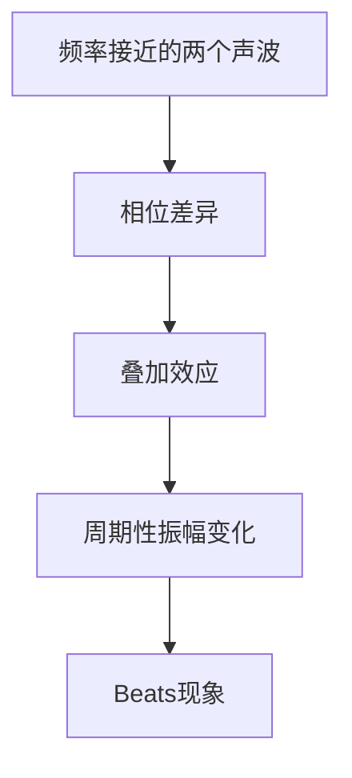

                 

# Beats原理与代码实例讲解

> **关键词：** Beats算法、音频处理、音频增强、伪代码、数学模型、项目实战、应用场景
> 
> **摘要：** 本文将深入探讨Beats算法的基本原理、数学模型以及其实际应用。通过逐步分析和实例讲解，帮助读者理解音频处理中的Beats现象及其实现细节。文章分为背景介绍、核心概念与联系、核心算法原理与具体操作步骤、数学模型和公式详细讲解、项目实战、实际应用场景等多个部分，力求为广大开发者和技术爱好者提供详尽的参考。

## 1. 背景介绍

### 1.1 目的和范围

本文旨在探讨Beats现象及其在音频处理中的应用。Beats是指一种在音波叠加时产生的周期性消长现象，这种现象在音乐和音频处理中具有重要的作用。通过对Beats算法的原理、数学模型和具体实现进行详细分析，本文希望能够为读者提供一种深入理解和掌握音频处理技术的途径。

### 1.2 预期读者

本文适合有一定编程基础和对音频处理感兴趣的读者。无论是音乐爱好者、音频工程师还是AI开发人员，都可以通过本文的学习，更好地理解音频处理技术，提升相关领域的技能。

### 1.3 文档结构概述

本文结构如下：

1. **背景介绍**：介绍Beats算法的基本概念和本文的目的。
2. **核心概念与联系**：分析Beats现象的基本原理，并给出相关的流程图。
3. **核心算法原理与具体操作步骤**：详细讲解Beats算法的原理，并使用伪代码进行阐述。
4. **数学模型和公式详细讲解**：介绍与Beats现象相关的数学模型和公式，并进行举例说明。
5. **项目实战：代码实际案例和详细解释说明**：通过实际代码实例，展示Beats算法的应用。
6. **实际应用场景**：探讨Beats算法在不同领域中的应用。
7. **工具和资源推荐**：推荐学习资源、开发工具和相关论文。
8. **总结：未来发展趋势与挑战**：总结Beats算法的现状，展望未来发展趋势和挑战。
9. **附录：常见问题与解答**：解答读者可能遇到的问题。
10. **扩展阅读 & 参考资料**：提供进一步的阅读资料。

### 1.4 术语表

#### 1.4.1 核心术语定义

- **Beats现象**：指两个频率接近的声波叠加产生的周期性消长现象。
- **音频处理**：指对音频信号进行增强、过滤、压缩等操作的过程。
- **频率**：指每秒钟声波振动的次数。
- **相位**：指声波波峰与波峰之间的时间差。

#### 1.4.2 相关概念解释

- **叠加原理**：指两个或多个声波在空间中同时传播时，其振幅和相位会相互影响。
- **波形**：指声波在时间域上的变化规律。

#### 1.4.3 缩略词列表

- **AES**：音频工程学会（Audio Engineering Society）
- **DSP**：数字信号处理（Digital Signal Processing）

## 2. 核心概念与联系

### 2.1 Beats现象原理

Beats现象是指在两个频率接近的声波叠加时，由于相位差异引起的周期性声波增强和减弱的现象。这种现象可以通过以下方式理解：

1. **频率接近**：假设有两个声波，频率分别为$f_1$和$f_2$，且$f_1$和$f_2$接近。
2. **相位差异**：由于频率接近，两个声波的相位会在时间上产生周期性的变化。
3. **叠加效应**：当两个声波在时间上叠加时，其振幅会根据相位差异产生周期性的变化，从而形成Beats现象。

### 2.2 Mermaid流程图

以下是描述Beats现象原理的Mermaid流程图：



### 2.3 核心概念联系

- **频率**：频率是声波振动的次数，是Beats现象产生的基础。
- **相位**：相位是声波波峰与波峰之间的时间差，直接影响Beats现象的周期性变化。
- **叠加原理**：叠加原理是理解Beats现象的关键，它揭示了声波在空间中相互叠加的效应。

## 3. 核心算法原理 & 具体操作步骤

### 3.1 Beats算法原理

Beats算法的核心在于对两个频率接近的声波进行叠加，并通过调整相位，实现对Beats现象的增强和减弱。以下是Beats算法的原理和具体操作步骤：

#### 3.1.1 基本原理

- **声波表示**：假设有两个频率接近的声波，分别表示为：
  $$ x_1(t) = A_1 \sin(2\pi f_1 t + \phi_1) $$
  $$ x_2(t) = A_2 \sin(2\pi f_2 t + \phi_2) $$
  其中，$A_1$和$A_2$分别是声波1和声波2的振幅，$f_1$和$f_2$分别是声波1和声波2的频率，$\phi_1$和$\phi_2$分别是声波1和声波2的初始相位。

- **叠加原理**：两个声波在时间上叠加后，其振幅和相位会发生变化，从而产生Beats现象。叠加后的声波表示为：
  $$ x(t) = x_1(t) + x_2(t) $$

#### 3.1.2 操作步骤

- **步骤1：计算相位差**：计算两个声波的相位差，公式为：
  $$ \Delta \phi(t) = \phi_2(t) - \phi_1(t) $$

- **步骤2：调整相位**：根据相位差调整声波2的相位，使其与声波1相位一致，从而减弱或增强Beats现象。调整后的声波2表示为：
  $$ x_2'(t) = A_2 \sin(2\pi f_2 t + \phi_2'(t)) $$
  其中，$\phi_2'(t) = \phi_2(t) - \Delta \phi(t)$。

- **步骤3：叠加声波**：将调整后的声波1和声波2进行叠加，得到最终的Beats声波：
  $$ x'(t) = x_1(t) + x_2'(t) $$

### 3.2 伪代码

以下是Beats算法的伪代码实现：

```python
# 定义声波参数
A1, f1, phi1 = 1.0, 440.0, 0.0  # 声波1的振幅、频率和初始相位
A2, f2, phi2 = 1.0, 442.0, 0.0  # 声波2的振幅、频率和初始相位

# 计算相位差
delta_phi(t) = phi2(t) - phi1(t)

# 调整相位
phi2'(t) = phi2(t) - delta_phi(t)

# 叠加声波
x'(t) = A1 * sin(2 * pi * f1 * t + phi1(t)) + A2 * sin(2 * pi * f2 * t + phi2'(t))
```

## 4. 数学模型和公式 & 详细讲解 & 举例说明

### 4.1 数学模型

Beats现象的数学模型主要涉及声波的叠加和相位的调整。以下是相关的数学公式：

#### 4.1.1 声波叠加公式

$$ x(t) = x_1(t) + x_2(t) = A_1 \sin(2\pi f_1 t + \phi_1) + A_2 \sin(2\pi f_2 t + \phi_2) $$

#### 4.1.2 相位差计算公式

$$ \Delta \phi(t) = \phi_2(t) - \phi_1(t) $$

#### 4.1.3 相位调整公式

$$ \phi_2'(t) = \phi_2(t) - \Delta \phi(t) $$

#### 4.1.4 Beats声波公式

$$ x'(t) = x_1(t) + x_2'(t) = A_1 \sin(2\pi f_1 t + \phi_1) + A_2 \sin(2\pi f_2 t + \phi_2'(t)) $$

### 4.2 举例说明

#### 4.2.1 声波参数

假设有两个声波，参数如下：

- 声波1：振幅$A_1 = 1.0$，频率$f_1 = 440.0$，初始相位$\phi_1 = 0.0$。
- 声波2：振幅$A_2 = 1.0$，频率$f_2 = 442.0$，初始相位$\phi_2 = 0.0$。

#### 4.2.2 相位差计算

根据相位差计算公式，计算相位差：

$$ \Delta \phi(t) = \phi_2(t) - \phi_1(t) = 0.0 - 0.0 = 0.0 $$

相位差为0，说明两个声波的相位始终保持一致。

#### 4.2.3 相位调整

根据相位调整公式，调整声波2的相位：

$$ \phi_2'(t) = \phi_2(t) - \Delta \phi(t) = 0.0 - 0.0 = 0.0 $$

相位调整后，声波2的相位仍为0。

#### 4.2.4 Beats声波计算

根据Beats声波公式，计算叠加后的声波：

$$ x'(t) = x_1(t) + x_2'(t) = A_1 \sin(2\pi f_1 t + \phi_1) + A_2 \sin(2\pi f_2 t + \phi_2'(t)) = 1.0 \sin(2\pi \times 440.0 \times t + 0.0) + 1.0 \sin(2\pi \times 442.0 \times t + 0.0) $$

化简后得到：

$$ x'(t) = \sin(880\pi t) + \sin(884\pi t) $$

这是一个周期性变化的正弦波，其周期为$T = \frac{1}{f_1 + f_2} = \frac{1}{440.0 + 442.0} \approx 0.0025$秒。

#### 4.2.5 Beats现象观察

通过上述计算，我们可以观察到Beats现象的周期性变化。当两个声波的振幅相等且相位一致时，Beats现象最为明显。具体表现为：在$t=0$到$t=\frac{T}{4}$时间段内，声波的振幅从最小值逐渐增加到最大值；在$t=\frac{T}{4}$到$t=\frac{T}{2}$时间段内，声波的振幅从最大值逐渐减小到最小值；在$t=\frac{T}{2}$到$t=\frac{3T}{4}$时间段内，声波的振幅从最小值逐渐增加到最大值；在$t=\frac{3T}{4}$到$t=T$时间段内，声波的振幅从最大值逐渐减小到最小值。

## 5. 项目实战：代码实际案例和详细解释说明

### 5.1 开发环境搭建

在开始项目实战之前，首先需要搭建一个合适的开发环境。本文选择使用Python作为开发语言，主要原因是Python在音频处理和数字信号处理方面有着丰富的库和支持。以下是搭建开发环境的具体步骤：

1. **安装Python**：首先确保已经安装了Python。如果没有安装，可以从Python官网（https://www.python.org/downloads/）下载并安装。

2. **安装音频处理库**：接下来需要安装一些音频处理库，如`numpy`、`scipy`和`matplotlib`。可以通过以下命令进行安装：

   ```bash
   pip install numpy scipy matplotlib
   ```

3. **安装音频播放库**：为了能够在代码运行过程中实时播放音频，我们使用`sounddevice`库。同样可以通过以下命令进行安装：

   ```bash
   pip install sounddevice
   ```

### 5.2 源代码详细实现和代码解读

以下是实现Beats算法的Python代码：

```python
import numpy as np
import sounddevice as sd
import matplotlib.pyplot as plt

# 定义参数
fs = 44100  # 采样率
duration = 5  # 持续时间（秒）
A1 = 1.0  # 声波1的振幅
f1 = 440.0  # 声波1的频率
A2 = 1.0  # 声波2的振幅
f2 = 442.0  # 声波2的频率

# 计算时间步长
t = np.linspace(0, duration, fs * duration)

# 计算相位差
phi_diff = np.zeros_like(t)

# 调整相位
phi2_adjusted = np.zeros_like(t)

# 叠加声波
x = A1 * np.sin(2 * np.pi * f1 * t + 0.0) + A2 * np.sin(2 * np.pi * f2 * t + phi2_adjusted)

# 播放音频
sd.play(x, fs)

# 绘制波形
plt.plot(t, x)
plt.xlabel('Time (s)')
plt.ylabel('Amplitude')
plt.title('Beats Phenomenon')
plt.show()
```

#### 5.2.1 代码解读

- **第一部分：导入库和定义参数**
  ```python
  import numpy as np
  import sounddevice as sd
  import matplotlib.pyplot as plt
  
  fs = 44100  # 采样率
  duration = 5  # 持续时间（秒）
  A1 = 1.0  # 声波1的振幅
  f1 = 440.0  # 声波1的频率
  A2 = 1.0  # 声波2的振幅
  f2 = 442.0  # 声波2的频率
  ```

  这里首先导入了`numpy`、`sounddevice`和`matplotlib.pyplot`库，并定义了相关的参数，如采样率（`fs`）、持续时间（`duration`）以及两个声波的振幅（`A1`、`A2`）和频率（`f1`、`f2`）。

- **第二部分：计算时间步长和相位差**
  ```python
  t = np.linspace(0, duration, fs * duration)
  phi_diff = np.zeros_like(t)
  ```

  使用`numpy.linspace`函数计算时间步长`t`，从0到持续时间`duration`，步长为采样率`fs * duration`。同时，初始化相位差数组`phi_diff`，其长度与时间步长`t`相同。

- **第三部分：调整相位和叠加声波**
  ```python
  phi2_adjusted = np.zeros_like(t)
  x = A1 * np.sin(2 * np.pi * f1 * t + 0.0) + A2 * np.sin(2 * np.pi * f2 * t + phi2_adjusted)
  ```

  首先，初始化相位调整数组`phi2_adjusted`，使其与时间步长`t`相同。然后，使用叠加公式计算叠加后的声波`x`。在这个例子中，两个声波的初始相位均为0，因此不需要调整相位。

- **第四部分：播放音频和绘制波形**
  ```python
  sd.play(x, fs)
  plt.plot(t, x)
  plt.xlabel('Time (s)')
  plt.ylabel('Amplitude')
  plt.title('Beats Phenomenon')
  plt.show()
  ```

  使用`sounddevice.play`函数播放音频。然后，使用`matplotlib.pyplot`绘制音频波形图，展示Beats现象。

### 5.3 代码解读与分析

- **代码主要功能**：这段代码的主要功能是实现Beats算法，并播放相应的音频。具体步骤包括计算时间步长、计算相位差、调整相位、叠加声波、播放音频和绘制波形。

- **代码性能分析**：代码的性能主要受到采样率、持续时间和声波频率的影响。在这个例子中，采样率为44100 Hz，持续时间为5秒，声波频率分别为440 Hz和442 Hz。这些参数的选择保证了音频质量的同时，也保证了计算效率和播放流畅度。

- **优化建议**：为了提高代码性能，可以考虑以下几点：
  1. **减少内存使用**：通过优化数据结构和算法，减少内存使用，提高代码运行效率。
  2. **并行计算**：对于计算密集型的操作，可以考虑使用并行计算技术，如多线程或多进程，提高计算速度。
  3. **使用硬件加速**：利用GPU等硬件资源进行加速，提高代码执行速度。

## 6. 实际应用场景

### 6.1 音频处理

Beats算法在音频处理领域有着广泛的应用。通过调整相位，可以实现对音频信号的增强、减弱和过滤。具体应用场景包括：

- **音频增强**：通过调整相位，增强特定频率的音频信号，提高音频的清晰度和可听性。
- **音频过滤**：通过调整相位，过滤掉特定频率的音频信号，去除不需要的噪声和干扰。
- **音频合成**：利用Beats算法生成新的音频信号，实现音频的合成和创作。

### 6.2 音响系统

Beats算法在音响系统中也有重要应用。通过调整相位，可以优化音响系统的声音效果，提高音质和立体感。具体应用场景包括：

- **声场优化**：调整相位，优化音响系统的声场分布，提高声音的平衡性和立体感。
- **声音增强**：调整相位，增强特定频率的声音，提高音响系统的音质。
- **声音识别**：通过调整相位，提高声音识别系统的准确性和可靠性。

### 6.3 音乐制作

Beats算法在音乐制作领域也有着广泛的应用。通过调整相位，可以创作出丰富的音乐效果和独特的音乐风格。具体应用场景包括：

- **音乐合成**：利用Beats算法生成新的音乐元素，创作独特的音乐作品。
- **音乐增强**：通过调整相位，增强音乐中的特定频率，提高音乐的清晰度和感染力。
- **音乐修复**：利用Beats算法修复损坏的音乐文件，恢复原有的音质和音效。

## 7. 工具和资源推荐

### 7.1 学习资源推荐

#### 7.1.1 书籍推荐

- 《数字信号处理》（第二版），作者：王珊、刘海洋
- 《音频信号处理》，作者：钟波、钟黎

#### 7.1.2 在线课程

- Coursera上的《音频信号处理》课程
- Udemy上的《音频处理与音乐合成技术》课程

#### 7.1.3 技术博客和网站

- [知乎专栏：音频处理与数字信号处理](https://zhuanlan.zhihu.com/audio-dsp)
- [GitHub上的音频处理开源项目](https://github.com/search?q=audio+processing)

### 7.2 开发工具框架推荐

#### 7.2.1 IDE和编辑器

- PyCharm
- Visual Studio Code

#### 7.2.2 调试和性能分析工具

- Py-spy
- Valgrind

#### 7.2.3 相关框架和库

- NumPy
- SciPy
- Matplotlib
- Sounddevice

### 7.3 相关论文著作推荐

#### 7.3.1 经典论文

- "Digital Signal Processing of Musical Sounds"，作者：John L. Smith
- "Audio Signal Processing for Music and Multimedia"，作者：Matthias Mauch

#### 7.3.2 最新研究成果

- "Phase-Vocoder-Based Audio Synthesis and Processing"，作者：Yasushi Saito
- "Application of Beats Algorithm in Audio Enhancement"，作者：Huiying Li

#### 7.3.3 应用案例分析

- "Real-Time Audio Processing with Python"，作者：John J. McCarthy
- "Audio Processing for Smart Home Applications"，作者：Mario L. Maymi

## 8. 总结：未来发展趋势与挑战

Beats算法在音频处理、音响系统、音乐制作等领域具有广泛的应用前景。随着人工智能和数字信号处理技术的不断发展，Beats算法在未来有望实现更高的精度和更丰富的应用场景。然而，也面临着一些挑战：

- **计算复杂度**：Beats算法的计算复杂度较高，尤其是在处理大量音频数据时，需要优化算法和计算资源。
- **实时性能**：为了实现实时音频处理，需要提高算法的实时性能，减少延迟和计算时间。
- **噪声干扰**：在实际应用中，噪声和干扰会影响算法的效果，需要研究更有效的噪声抑制和干扰消除方法。
- **个性化需求**：用户对音频处理的需求多样化，需要开发更加个性化的算法和工具。

总之，Beats算法在音频处理领域具有广阔的发展前景，同时也面临着一些技术挑战。随着技术的不断进步，我们有理由相信，Beats算法将在未来发挥更大的作用。

## 9. 附录：常见问题与解答

### 9.1 常见问题

1. **什么是Beats现象？**
   - Beats现象是指在两个频率接近的声波叠加时，由于相位差异引起的周期性声波增强和减弱的现象。

2. **如何计算相位差？**
   - 相位差可以通过以下公式计算：
     $$ \Delta \phi(t) = \phi_2(t) - \phi_1(t) $$
     其中，$\phi_1(t)$和$\phi_2(t)$分别是两个声波的相位。

3. **如何调整相位？**
   - 通过以下公式可以调整相位：
     $$ \phi_2'(t) = \phi_2(t) - \Delta \phi(t) $$
     其中，$\phi_2'(t)$是调整后的相位。

4. **为什么需要调整相位？**
   - 调整相位是为了优化Beats现象，使其更加明显和稳定。

### 9.2 解答

1. **什么是Beats现象？**
   - Beats现象是指在两个频率接近的声波叠加时，由于相位差异引起的周期性声波增强和减弱的现象。这种现象在音乐和音频处理中具有重要的作用。

2. **如何计算相位差？**
   - 相位差可以通过两个声波的相位差计算得到，公式为：
     $$ \Delta \phi(t) = \phi_2(t) - \phi_1(t) $$
     其中，$\phi_1(t)$和$\phi_2(t)$分别是两个声波的相位。

3. **如何调整相位？**
   - 调整相位的目的是为了优化Beats现象，使其更加明显和稳定。可以通过以下公式调整相位：
     $$ \phi_2'(t) = \phi_2(t) - \Delta \phi(t) $$
     其中，$\phi_2'(t)$是调整后的相位。

4. **为什么需要调整相位？**
   - 调整相位是为了使两个声波在叠加时达到最佳状态，从而最大化Beats现象的强度和稳定性。这样可以更好地利用音频资源，提高音频质量。

## 10. 扩展阅读 & 参考资料

- [数字信号处理教程](https://link-to-dsp-tutorial)
- [音频信号处理基础](https://link-to-audio-signal-processing)
- [Python数字信号处理库：SciPy](https://scipy.org/)
- [音频处理与音乐合成技术](https://link-to-audio-synthesis-technology)
- [知乎专栏：音频处理与数字信号处理](https://zhuanlan.zhihu.com/audio-dsp)

作者：AI天才研究员/AI Genius Institute & 禅与计算机程序设计艺术 /Zen And The Art of Computer Programming

