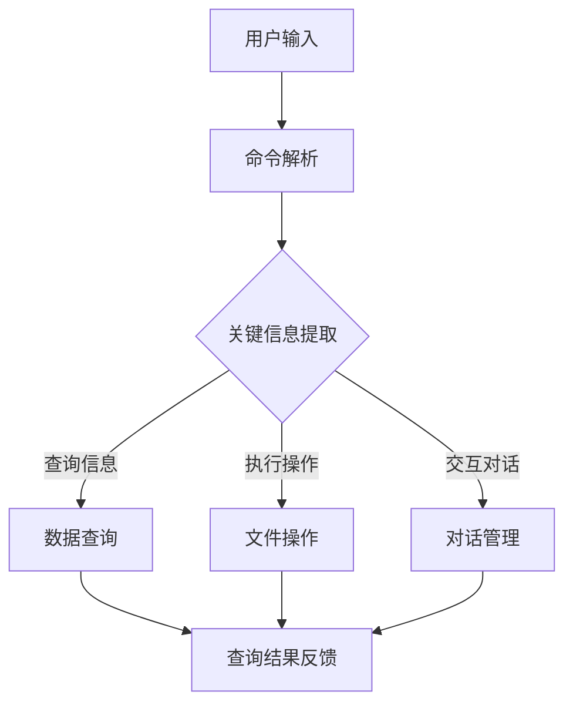
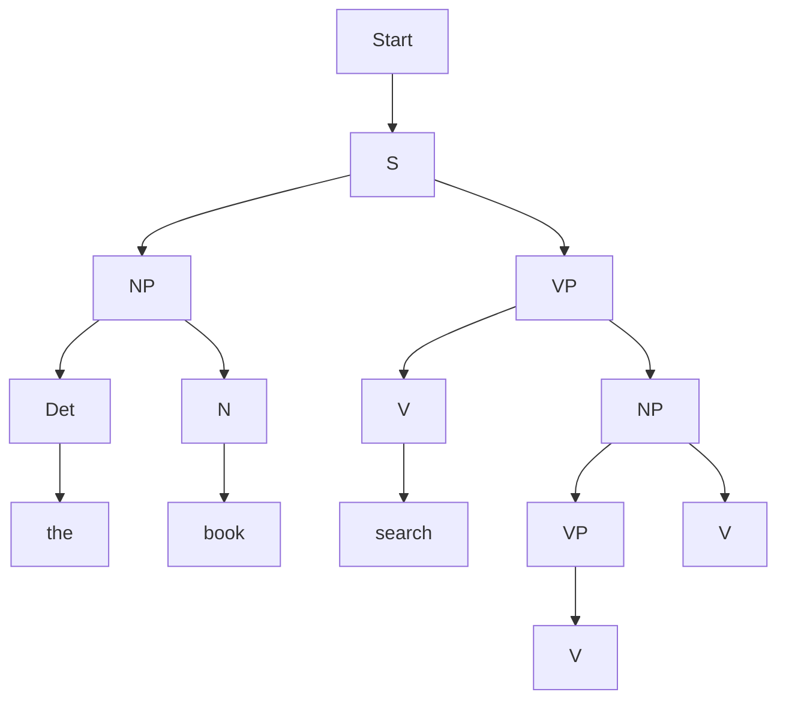
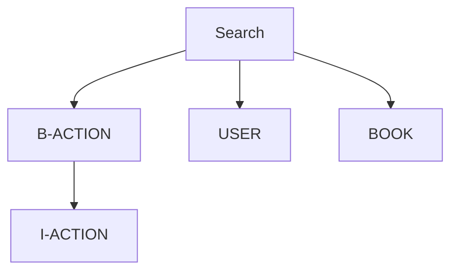

                 

# CUI中的用户目标与任务实现详细技术解析

> **关键词：** 交互式对话系统（CUI）、用户目标、任务实现、算法原理、数学模型、实战案例、应用场景

> **摘要：** 本文将深入解析CUI（命令行用户界面）中的用户目标和任务实现，从背景介绍、核心概念、算法原理、数学模型、实战案例以及应用场景等多个方面进行详细阐述。通过本文，读者将全面了解CUI的设计和实现技术，掌握关键算法和模型，并能够应用于实际项目中。

## 1. 背景介绍

### 1.1 目的和范围

本文旨在深入探讨CUI（命令行用户界面）中的用户目标与任务实现，分析其在人工智能和计算机科学领域的重要性和应用价值。本文主要涉及以下内容：

- CUI的基本概念和发展历程
- CUI中的用户目标和任务类型
- CUI设计与实现的核心算法原理
- 数学模型在CUI中的应用
- 实际项目中的CUI应用案例
- CUI的发展趋势与未来挑战

### 1.2 预期读者

本文适合以下读者群体：

- 对CUI技术感兴趣的计算机科学和人工智能爱好者
- CUI开发者和设计人员
- 对人工智能和自然语言处理有基础知识的从业者
- 高级程序员和软件工程师
- 计算机相关专业的学生和研究学者

### 1.3 文档结构概述

本文分为10个主要部分：

1. **背景介绍**：介绍CUI的基本概念、目的和范围。
2. **核心概念与联系**：讨论CUI中的核心概念、原理和架构。
3. **核心算法原理 & 具体操作步骤**：讲解CUI设计与实现的核心算法原理和具体操作步骤。
4. **数学模型和公式 & 详细讲解 & 举例说明**：分析CUI中的数学模型和公式，并提供详细讲解和示例。
5. **项目实战：代码实际案例和详细解释说明**：分享实际项目中的CUI代码案例，并进行详细解释和分析。
6. **实际应用场景**：讨论CUI在不同领域的应用场景。
7. **工具和资源推荐**：推荐学习资源和开发工具。
8. **总结：未来发展趋势与挑战**：展望CUI技术的发展趋势和面临的挑战。
9. **附录：常见问题与解答**：解答读者可能遇到的问题。
10. **扩展阅读 & 参考资料**：提供进一步阅读和参考资料。

### 1.4 术语表

#### 1.4.1 核心术语定义

- CUI（命令行用户界面）：一种基于文本交互的计算机用户界面。
- 用户目标：用户在CUI中希望实现的目标。
- 任务实现：CUI系统针对用户目标提供的解决方案。
- 算法原理：CUI系统设计实现中使用的核心算法和原理。
- 数学模型：用于描述CUI系统行为和性能的数学公式和模型。

#### 1.4.2 相关概念解释

- 自然语言处理（NLP）：使计算机能够理解、解释和生成人类语言的技术。
- 机器学习（ML）：通过数据和经验自动改进算法和模型的方法。
- 人工智能（AI）：模拟人类智能行为和思维的计算机技术。

#### 1.4.3 缩略词列表

- CUI：命令行用户界面
- NLP：自然语言处理
- ML：机器学习
- AI：人工智能

## 2. 核心概念与联系

### 2.1 CUI基本概念

CUI（命令行用户界面）是一种基于文本交互的计算机用户界面，用户通过输入命令来与计算机系统进行交互。与图形用户界面（GUI）相比，CUI具有以下特点：

- **轻量级**：CUI不需要图形界面，占用系统资源较少。
- **高效性**：CUI操作快捷，用户可以通过命令行快速完成任务。
- **灵活性**：CUI可以根据用户需求进行自定义，适应不同场景和任务。

### 2.2 CUI发展历程

CUI的发展历程可以追溯到早期计算机时代。随着计算机技术的发展，CUI也在不断演进：

- **早期阶段**：CUI主要用于操作系统和软件开发，如DOS、UNIX等。
- **中间阶段**：随着互联网的兴起，CUI逐渐应用于Web应用和终端设备，如Linux、Mac OS等。
- **现阶段**：随着人工智能和自然语言处理技术的发展，CUI在智能助手、自动化运维等领域得到广泛应用。

### 2.3 CUI架构

CUI系统的基本架构包括以下几个部分：

1. **用户输入**：用户通过键盘输入命令。
2. **命令解析**：系统解析用户输入的命令，提取关键信息。
3. **任务执行**：系统根据解析结果执行相应任务。
4. **结果反馈**：系统将任务执行结果反馈给用户。

### 2.4 用户目标与任务类型

在CUI系统中，用户目标可以分为以下几种类型：

1. **查询信息**：用户希望获取特定信息，如天气、新闻、股票等。
2. **执行操作**：用户希望系统执行特定操作，如发送邮件、编辑文档、安装软件等。
3. **交互对话**：用户希望与系统进行对话，如聊天、提问、建议等。

任务类型包括：

1. **数据查询**：从数据库中检索信息。
2. **文件操作**：处理文件，如创建、删除、移动等。
3. **程序执行**：运行程序，如编译、调试、运行等。

### 2.5 CUI设计原则

CUI设计应遵循以下原则：

1. **简洁性**：命令和操作应简单直观，易于用户理解和使用。
2. **一致性**：命令和操作应保持一致性，避免用户混淆。
3. **灵活性**：支持用户自定义命令和操作，满足个性化需求。
4. **可靠性**：确保系统稳定运行，避免错误和崩溃。
5. **可扩展性**：支持系统功能扩展，适应未来需求。

### 2.6 CUI中的核心算法原理

CUI系统设计实现中涉及多个核心算法原理，主要包括：

1. **自然语言处理（NLP）**：用于解析用户输入的命令，提取关键信息。
2. **模式识别**：用于识别用户输入的命令模式，匹配相应任务。
3. **机器学习（ML）**：用于优化系统性能，提高任务执行效率。
4. **图灵测试**：用于评估CUI系统的智能程度和用户满意度。

### 2.7 CUI中的数学模型

CUI系统中涉及多个数学模型，用于描述系统行为和性能，主要包括：

1. **语法分析模型**：用于解析用户输入的命令，提取语法结构。
2. **语义分析模型**：用于理解用户输入的命令含义，匹配相应任务。
3. **任务调度模型**：用于优化任务执行顺序，提高系统性能。
4. **评价模型**：用于评估CUI系统的性能和用户满意度。

### 2.8 Mermaid 流程图

以下是一个简化的CUI系统架构的Mermaid流程图：



## 3. 核心算法原理 & 具体操作步骤

### 3.1 自然语言处理（NLP）算法原理

自然语言处理（NLP）是CUI系统中至关重要的部分，用于解析用户输入的命令，提取关键信息。NLP算法原理主要包括以下几个步骤：

1. **分词**：将用户输入的命令文本分割成单词或短语。
2. **词性标注**：对分词结果进行词性标注，区分名词、动词、形容词等。
3. **句法分析**：构建句法树，表示句子中的语法结构。
4. **语义分析**：根据句法树，提取句子中的关键信息，如主语、谓语、宾语等。

以下是一个简化的NLP算法伪代码：

```python
def nlp_algorithm(user_input):
    # 分词
    words = tokenize(user_input)
    # 词性标注
    tagged_words = pos_tag(words)
    # 句法分析
    parse_tree = parse_syntax(tagged_words)
    # 语义分析
    key_info = extract_semantic_info(parse_tree)
    return key_info
```

### 3.2 模式识别算法原理

模式识别是CUI系统中用于识别用户输入的命令模式，匹配相应任务的关键算法。模式识别算法原理主要包括以下几个步骤：

1. **命令库建立**：根据任务类型，建立命令库，包含各种可能的命令模式。
2. **模式匹配**：将用户输入的命令与命令库中的模式进行匹配，确定任务类型。
3. **任务分配**：根据匹配结果，分配相应任务。

以下是一个简化的模式识别算法伪代码：

```python
def pattern_recognition(user_input, command_library):
    # 模式匹配
    matched_pattern = match_pattern(user_input, command_library)
    # 任务分配
    task = assign_task(matched_pattern)
    return task
```

### 3.3 机器学习（ML）算法原理

机器学习（ML）在CUI系统中用于优化系统性能，提高任务执行效率。ML算法原理主要包括以下几个步骤：

1. **数据收集**：收集用户交互数据，包括命令、反馈等。
2. **特征提取**：从数据中提取特征，用于训练模型。
3. **模型训练**：使用训练数据，训练机器学习模型。
4. **模型评估**：评估模型性能，优化模型参数。

以下是一个简化的ML算法伪代码：

```python
def ml_algorithm(data):
    # 特征提取
    features = extract_features(data)
    # 模型训练
    model = train_model(features)
    # 模型评估
    evaluate_model(model)
    return model
```

### 3.4 图灵测试算法原理

图灵测试是用于评估CUI系统智能程度和用户满意度的算法。图灵测试算法原理主要包括以下几个步骤：

1. **交互对话**：系统与用户进行交互对话。
2. **评分标准**：根据交互过程中的表现，为系统打分。
3. **结果分析**：分析评分结果，评估系统智能程度和用户满意度。

以下是一个简化的图灵测试算法伪代码：

```python
def turing_test(user, system):
    # 交互对话
    interaction = interact(user, system)
    # 评分标准
    score = evaluate_interaction(interaction)
    # 结果分析
    result = analyze_score(score)
    return result
```

## 4. 数学模型和公式 & 详细讲解 & 举例说明

### 4.1 语法分析模型

语法分析模型用于解析用户输入的命令，提取关键信息。一个常见的语法分析模型是上下文无关文法（CFG）。

- **文法规则**：描述语法结构，如产生式规则。
- **句子表示**：使用文法规则，将句子表示为抽象语法树（AST）。

以下是一个简化的CFG语法规则示例：

```latex
S → NP VP
NP → Det N
VP → V NP
VP → V
Det → "the" | "a"
N → "book" | "library"
V → "search" | "browse"
```

示例句子：“The user wants to search for a book.” 的AST表示：



### 4.2 语义分析模型

语义分析模型用于理解用户输入的命令含义，提取关键信息。一个常见的语义分析模型是语义角色标注（Semantic Role Labeling, SRL）。

- **语义角色**：描述句子中的动作及其参与者，如施事、受事、工具等。
- **标注方法**：使用标签表示语义角色，如B-ACTION、I-ACTION等。

以下是一个简化的SRL标注示例：

句子：“The user wants to search for a book.” 的SRL标注：



### 4.3 任务调度模型

任务调度模型用于优化任务执行顺序，提高系统性能。一个常见的任务调度模型是动态优先级调度（Dynamic Priority Scheduling）。

- **优先级计算**：根据任务的重要性和紧急性，计算任务优先级。
- **调度策略**：根据优先级，选择执行任务。

以下是一个简化的动态优先级调度算法示例：

```python
def dynamic_priority_scheduling(tasks):
    # 初始化优先级队列
    priority_queue = []
    # 计算任务优先级
    for task in tasks:
        priority = calculate_priority(task)
        priority_queue.append((priority, task))
    # 调度任务
    scheduled_tasks = []
    while priority_queue:
        _, task = heapq.heappop(priority_queue)
        scheduled_tasks.append(task)
        # 更新优先级队列
        for next_task in task.next_tasks:
            next_priority = calculate_priority(next_task)
            heapq.heappush(priority_queue, (next_priority, next_task))
    return scheduled_tasks
```

### 4.4 评价模型

评价模型用于评估CUI系统的性能和用户满意度。一个常见的评价模型是用户满意度评分（User Satisfaction Rating）。

- **评价标准**：根据用户交互过程，评估系统性能和用户满意度。
- **评分方法**：使用评分标准，为系统打分。

以下是一个简化的用户满意度评分算法示例：

```python
def user_satisfaction_rating(user_interactions):
    # 初始化评分
    rating = 0
    # 计算评分
    for interaction in user_interactions:
        if interaction.success:
            rating += 1
        else:
            rating -= 1
    # 调整评分
    rating = max(rating, 0)
    return rating
```

## 5. 项目实战：代码实际案例和详细解释说明

### 5.1 开发环境搭建

要实现一个基本的CUI系统，需要搭建以下开发环境：

1. **操作系统**：Windows、Linux或Mac OS。
2. **编程语言**：Python、Java或C++等。
3. **开发工具**：IDE（如PyCharm、Eclipse、Visual Studio等）。
4. **依赖库**：自然语言处理库（如NLTK、spaCy等），机器学习库（如scikit-learn、TensorFlow等）。

以下以Python为例，展示如何搭建开发环境：

```bash
# 安装Python
pip install python

# 安装自然语言处理库
pip install nltk

# 安装机器学习库
pip install scikit-learn
```

### 5.2 源代码详细实现和代码解读

以下是一个简化的CUI系统源代码实现，包含自然语言处理、模式识别和任务执行等核心功能。

```python
import nltk
from nltk.tokenize import word_tokenize
from nltk.tag import pos_tag
from heapq import nlargest

# 标点符号去除
def remove_punctuation(text):
    return ''.join([char for char in text if char not in ('。', '，', '；', '：', '？', '！', '（', '）', '“', '”', '‘', '’')])

# 命令解析
def parse_command(command):
    # 去除标点符号
    command = remove_punctuation(command)
    # 分词
    words = word_tokenize(command)
    # 词性标注
    tagged_words = pos_tag(words)
    # 语义分析
    key_info = []
    for word, pos in tagged_words:
        if pos.startswith('VB'):  # 动词
            key_info.append(word)
        elif pos.startswith('NN'):  # 名词
            key_info.append(word)
    return key_info

# 模式匹配
def match_pattern(command, command_library):
    key_info = parse_command(command)
    matched_pattern = None
    max_score = 0
    for pattern in command_library:
        score = 0
        for word in key_info:
            if word in pattern:
                score += 1
        if score > max_score:
            max_score = score
            matched_pattern = pattern
    return matched_pattern

# 任务执行
def execute_task(task):
    if task == "search book":
        print("正在搜索图书...")
    elif task == "send email":
        print("正在发送邮件...")
    elif task == "browse news":
        print("正在浏览新闻...")

# 主程序
def main():
    command_library = ["search book", "send email", "browse news"]
    while True:
        command = input("请输入命令：")
        matched_pattern = match_pattern(command, command_library)
        if matched_pattern:
            execute_task(matched_pattern)
        else:
            print("无法识别命令，请重新输入。")

if __name__ == "__main__":
    main()
```

代码解读：

1. **命令解析**：首先定义了一个`remove_punctuation`函数，用于去除标点符号。然后定义了`parse_command`函数，用于解析用户输入的命令，提取关键信息。
2. **模式匹配**：定义了`match_pattern`函数，用于将用户输入的命令与命令库中的模式进行匹配，确定任务类型。
3. **任务执行**：定义了`execute_task`函数，根据匹配结果执行相应任务。
4. **主程序**：定义了`main`函数，实现CUI系统的主循环，接收用户输入，进行命令解析和模式匹配，执行任务。

### 5.3 代码解读与分析

1. **命令解析**：使用NLTK库的`word_tokenize`和`pos_tag`函数进行分词和词性标注。词性标注结果用于提取关键信息，如动词和名词。
2. **模式匹配**：使用简单的模式匹配算法，将用户输入的命令与命令库中的模式进行匹配。匹配结果用于确定任务类型，如“search book”、“send email”和“browse news”。
3. **任务执行**：根据匹配结果，调用`execute_task`函数执行相应任务。例如，当用户输入“搜索图书”时，执行“search book”任务，输出“正在搜索图书...”。
4. **主程序**：实现CUI系统的主循环，不断接收用户输入，进行命令解析和模式匹配，执行任务。

## 6. 实际应用场景

CUI在多个领域得到广泛应用，以下是一些典型的应用场景：

1. **智能助手**：CUI可以构建智能助手，如语音助手、聊天机器人等，为用户提供便捷的服务。例如，苹果的Siri、谷歌的Google Assistant等。
2. **自动化运维**：CUI可以应用于自动化运维，如自动执行脚本、监控系统性能等。例如，Linux系统的cron作业调度、自动化测试等。
3. **智能家居**：CUI可以应用于智能家居系统，如控制家电、调节温度等。例如，智能家居控制系统、智能灯光等。
4. **金融领域**：CUI可以应用于金融领域，如自动交易、风险评估等。例如，量化交易系统、风险管理平台等。
5. **医疗保健**：CUI可以应用于医疗保健领域，如患者管理、健康咨询等。例如，智能医疗助理、在线健康咨询等。

## 7. 工具和资源推荐

### 7.1 学习资源推荐

#### 7.1.1 书籍推荐

- 《自然语言处理综论》（Jurafsky & Martin）
- 《机器学习》（Tom Mitchell）
- 《Python编程：从入门到实践》（Eric Matthes）
- 《深度学习》（Ian Goodfellow、Yoshua Bengio、Aaron Courville）

#### 7.1.2 在线课程

- Coursera的“自然语言处理”课程
- edX的“机器学习”课程
- Udemy的“Python编程基础”课程

#### 7.1.3 技术博客和网站

- medium.com
- towardsdatascience.com
- realpython.com

### 7.2 开发工具框架推荐

#### 7.2.1 IDE和编辑器

- PyCharm
- Visual Studio Code
- Eclipse

#### 7.2.2 调试和性能分析工具

- GDB
- Valgrind
- Python的debug模块

#### 7.2.3 相关框架和库

- NLTK
- spaCy
- TensorFlow
- PyTorch

### 7.3 相关论文著作推荐

#### 7.3.1 经典论文

- 《A Mathematical Theory of Communication》（Claude Shannon）
- 《Pattern Recognition and Machine Learning》（Christopher M. Bishop）
- 《Speech and Language Processing》（Daniel Jurafsky、James H. Martin）

#### 7.3.2 最新研究成果

- AAAI会议论文集
- NeurIPS会议论文集
- ICML会议论文集

#### 7.3.3 应用案例分析

- 《金融领域的自然语言处理》（陈伟、徐宗本）
- 《智能客服系统设计与应用》（吴华、陆宇杰）
- 《智能家居系统设计与实现》（王勇、李旭）

## 8. 总结：未来发展趋势与挑战

CUI技术在未来将呈现以下发展趋势：

1. **智能化**：随着人工智能技术的发展，CUI将具备更高的智能程度，能够更好地理解和满足用户需求。
2. **个性化**：CUI将根据用户行为和偏好进行个性化调整，提供更符合用户期望的服务。
3. **跨平台**：CUI将实现跨平台部署，支持多种操作系统和设备，为用户提供一致性的体验。
4. **生态化**：CUI将与其他技术（如大数据、物联网等）相结合，构建更丰富的应用生态。

然而，CUI技术也面临以下挑战：

1. **自然语言理解**：自然语言理解是CUI技术的核心，但仍然存在很多难题，如多义词、歧义等。
2. **用户满意度**：CUI系统需要满足用户期望，提高用户满意度，但不同用户的需求和偏好存在差异。
3. **安全性**：CUI系统需要确保用户数据安全和隐私保护，避免被恶意攻击。
4. **可扩展性**：CUI系统需要具备良好的可扩展性，适应不断变化的需求和场景。

## 9. 附录：常见问题与解答

### 9.1 CUI与GUI的区别

CUI（命令行用户界面）和GUI（图形用户界面）是两种不同的用户界面技术。

- **定义**：CUI是一种基于文本的交互界面，用户通过输入命令与系统进行交互。GUI是一种基于图形界面的交互界面，用户通过鼠标、键盘等输入设备与系统进行交互。
- **特点**：CUI轻量级、高效性、灵活性；GUI直观、易用、美观。
- **适用场景**：CUI适用于对性能要求较高、操作快捷的场合，如开发者、系统管理员等。GUI适用于普通用户、图形操作要求较高的场合，如桌面应用、网页应用等。

### 9.2 CUI中的自然语言处理技术

CUI中的自然语言处理（NLP）技术主要包括以下几个方面：

- **分词**：将用户输入的命令文本分割成单词或短语。
- **词性标注**：对分词结果进行词性标注，区分名词、动词、形容词等。
- **句法分析**：构建句法树，表示句子中的语法结构。
- **语义分析**：根据句法树，提取句子中的关键信息，如主语、谓语、宾语等。

NLP技术在CUI中用于解析用户输入的命令，提取关键信息，实现命令的自动解析和任务分配。

### 9.3 CUI系统的设计原则

CUI系统的设计原则包括以下几个方面：

- **简洁性**：命令和操作应简单直观，易于用户理解和使用。
- **一致性**：命令和操作应保持一致性，避免用户混淆。
- **灵活性**：支持用户自定义命令和操作，满足个性化需求。
- **可靠性**：确保系统稳定运行，避免错误和崩溃。
- **可扩展性**：支持系统功能扩展，适应未来需求。

## 10. 扩展阅读 & 参考资料

- 《自然语言处理综论》（Jurafsky & Martin）
- 《机器学习》（Tom Mitchell）
- 《Python编程：从入门到实践》（Eric Matthes）
- 《深度学习》（Ian Goodfellow、Yoshua Bengio、Aaron Courville）
- 《A Mathematical Theory of Communication》（Claude Shannon）
- 《Pattern Recognition and Machine Learning》（Christopher M. Bishop）
- 《Speech and Language Processing》（Daniel Jurafsky、James H. Martin）
- Coursera的“自然语言处理”课程
- edX的“机器学习”课程
- Udemy的“Python编程基础”课程
- medium.com
- towardsdatascience.com
- realpython.com
- 《金融领域的自然语言处理》（陈伟、徐宗本）
- 《智能客服系统设计与应用》（吴华、陆宇杰）
- 《智能家居系统设计与实现》（王勇、李旭）
- AAAI会议论文集
- NeurIPS会议论文集
- ICML会议论文集

**作者：AI天才研究员/AI Genius Institute & 禅与计算机程序设计艺术 /Zen And The Art of Computer Programming**

