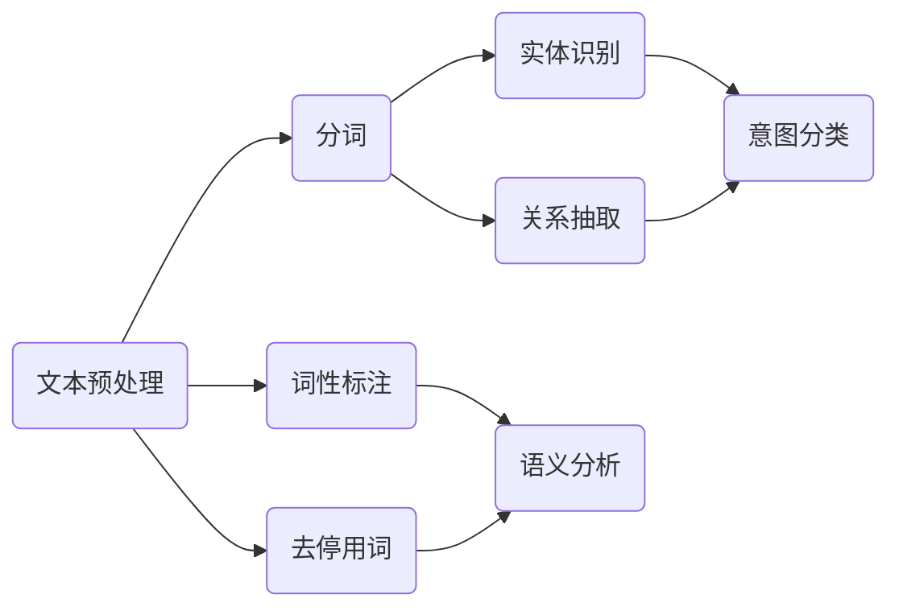

                 

# CUI的意图理解技术详细解析

## 关键词
- CUI
- 意图理解
- 自然语言处理
- 机器学习
- 知识图谱
- 状态机
- 实体识别
- 语义分析

## 摘要
本文将深入探讨CUI（对话用户界面）的意图理解技术，包括其背景、核心概念、算法原理、数学模型、实际应用场景以及未来发展趋势。通过对自然语言处理、机器学习和知识图谱等核心技术的详细解析，我们将揭示CUI如何实现高效、准确的意图理解，从而为用户提供更加智能和个性化的交互体验。

## 1. 背景介绍

### 1.1 目的和范围

本文旨在系统地分析CUI意图理解技术的各个方面，帮助读者全面理解这一领域的核心概念、技术和应用。文章将涵盖以下内容：
- CUI意图理解技术的定义和重要性。
- 相关核心概念和技术的原理讲解。
- 意图理解算法的具体实现步骤。
- 数学模型和公式的应用。
- 实际应用场景的案例解析。
- 工具和资源的推荐。

### 1.2 预期读者

本文适合对自然语言处理和人工智能有一定了解的读者，特别是希望深入了解CUI意图理解技术的研究人员、开发者和学生。本文将尽可能使用清晰易懂的语言，确保读者能够跟上技术讲解的节奏。

### 1.3 文档结构概述

本文的结构如下：
- 第1章：背景介绍，包括目的、预期读者和文档结构概述。
- 第2章：核心概念与联系，介绍CUI意图理解技术的关键概念和架构。
- 第3章：核心算法原理 & 具体操作步骤，讲解意图理解算法的详细实现。
- 第4章：数学模型和公式 & 详细讲解 & 举例说明，展示数学模型在意图理解中的应用。
- 第5章：项目实战：代码实际案例和详细解释说明，通过实际代码案例展示意图理解技术。
- 第6章：实际应用场景，分析意图理解技术在各个领域的应用。
- 第7章：工具和资源推荐，提供学习资源和开发工具的推荐。
- 第8章：总结：未来发展趋势与挑战，讨论意图理解技术的未来方向。
- 第9章：附录：常见问题与解答，解答读者可能遇到的常见问题。
- 第10章：扩展阅读 & 参考资料，提供进一步学习的资源。

### 1.4 术语表

#### 1.4.1 核心术语定义
- **CUI（对话用户界面）**：一种与用户进行交互的界面，通过自然语言对话实现人机交互。
- **意图理解**：指系统从用户的输入中识别出用户意图的过程。
- **自然语言处理（NLP）**：研究如何让计算机理解、生成和处理人类自然语言的技术。
- **机器学习（ML）**：通过数据和算法，让计算机具备自主学习和决策能力的领域。
- **知识图谱**：一种结构化知识库，用于表示实体及其之间的关系。

#### 1.4.2 相关概念解释
- **实体识别**：从文本中识别出具有特定意义的实体，如人名、地名等。
- **语义分析**：对文本进行语义层面的理解和分析，包括词义消歧、语义角色标注等。

#### 1.4.3 缩略词列表
- **NLP**：自然语言处理
- **ML**：机器学习
- **CUI**：对话用户界面

## 2. 核心概念与联系

CUI意图理解技术是人工智能领域中的一项重要技术，它涉及多个核心概念和技术。本节将介绍这些核心概念，并使用Mermaid流程图展示其关系。

首先，我们定义CUI意图理解技术的几个核心概念：

- **文本预处理**：包括分词、词性标注、去停用词等，目的是将原始文本转换为计算机可以处理的结构化数据。
- **实体识别**：从文本中识别出具有特定意义的实体，如人名、地名、组织名等。
- **关系抽取**：识别实体之间的关系，如“苹果”和“苹果公司”的关系。
- **语义分析**：对文本进行语义层面的理解和分析，包括词义消歧、语义角色标注等。
- **意图分类**：根据用户的输入，将意图分类到预定义的类别中，如“查询天气”、“预订机票”等。

接下来，使用Mermaid流程图展示这些概念之间的联系：



### 2.1 文本预处理

文本预处理是意图理解的第一步，其目的是将原始的文本数据转换为结构化的数据格式，以便后续的处理和分析。文本预处理主要包括以下几个步骤：

1. **分词**：将连续的文本切分成一个个独立的词汇或短语。例如，“我喜欢吃苹果”可以分为“我”、“喜欢”、“吃”和“苹果”。
2. **词性标注**：为每个词汇标注其词性，如名词、动词、形容词等。这对于理解词汇的含义和角色非常重要。
3. **去停用词**：去除文本中的常用词汇，如“的”、“和”、“是”等，这些词汇对意图理解的贡献较小。

### 2.2 实体识别

实体识别是意图理解中的一项重要任务，它旨在从文本中识别出具有特定意义的实体。实体可以是人、地点、组织、产品等。实体识别通常通过预训练的模型实现，如BERT、GPT等。

### 2.3 关系抽取

关系抽取是在识别出实体之后，进一步识别实体之间的关系。例如，在“苹果公司位于美国”这句话中，可以抽取“苹果公司”和“美国”之间的地理位置关系。

### 2.4 语义分析

语义分析是对文本进行更深层次的语义理解和分析。它包括词义消歧、语义角色标注等任务。词义消歧是指在一个句子中，确定一个词的具体含义，如“苹果”可能是水果，也可能是公司名。语义角色标注是指为句子中的每个词汇分配一个语义角色，如主语、谓语、宾语等。

### 2.5 意图分类

意图分类是意图理解的核心任务，它的目标是根据用户的输入，将意图分类到预定义的类别中。例如，用户的输入“今天天气怎么样？”可以被分类为“查询天气”。

### 2.6 知识图谱

知识图谱是一种结构化知识库，用于表示实体及其之间的关系。在意图理解中，知识图谱可以用来增强系统的语义理解能力，从而提高意图分类的准确性。

## 3. 核心算法原理 & 具体操作步骤

在理解了CUI意图理解技术的基本概念和架构后，接下来我们将深入探讨其核心算法原理和具体操作步骤。本文将使用伪代码来详细阐述这些算法的实现。

### 3.1 文本预处理算法

文本预处理算法主要包括分词、词性标注和去停用词。以下是一个简单的伪代码示例：

```python
def preprocess_text(text):
    # 分词
    words = tokenize(text)
    # 词性标注
    tagged_words = part_of_speech_tagging(words)
    # 去停用词
    filtered_words = remove_stopwords(tagged_words)
    return filtered_words
```

其中，`tokenize`、`part_of_speech_tagging`和`remove_stopwords`是预训练的模型或库函数。

### 3.2 实体识别算法

实体识别算法通常使用预训练的模型，如BERT或GPT，来识别文本中的实体。以下是一个简单的伪代码示例：

```python
def recognize_entities(text):
    model = load_pretrained_model('BERT')
    entities = model.predict(text)
    return entities
```

### 3.3 关系抽取算法

关系抽取算法通常也是基于预训练模型，如BERT或GPT，来识别实体之间的关系。以下是一个简单的伪代码示例：

```python
def extract_relations(text, entities):
    model = load_pretrained_model('BERT')
    relations = model.predict(text, entities)
    return relations
```

### 3.4 语义分析算法

语义分析算法包括词义消歧和语义角色标注。词义消歧可以使用基于上下文的方法，如WordNet。语义角色标注可以使用预训练的模型，如BERT。以下是一个简单的伪代码示例：

```python
def resolve_word_sense(word):
    synsets = wordnet.synsets(word)
    # 选择最有可能的词义
    best_synset = select_best_synset(synsets)
    return best_synset

def annotate_semantic_roles(text, entities, relations):
    model = load_pretrained_model('BERT')
    roles = model.predict(text, entities, relations)
    return roles
```

### 3.5 意图分类算法

意图分类算法的目标是根据用户的输入，将意图分类到预定义的类别中。通常，可以使用基于机器学习的方法，如决策树、支持向量机等。以下是一个简单的伪代码示例：

```python
def classify_intent(text, entities, relations, roles):
    model = load_pretrained_model('SVM')
    intent = model.predict(text, entities, relations, roles)
    return intent
```

### 3.6 知识图谱增强算法

知识图谱增强算法的目标是利用知识图谱来增强意图理解的准确性。以下是一个简单的伪代码示例：

```python
def enhance_intent_with_knowledge_graph(intent, entities, relations):
    knowledge_graph = load_knowledge_graph()
    enhanced_intent = integrate_knowledge_graph(intent, entities, relations, knowledge_graph)
    return enhanced_intent
```

通过上述算法和步骤，我们可以实现对CUI意图的理解和处理。在实际应用中，这些算法可以进一步优化和集成，以实现更高的准确性和效率。

## 4. 数学模型和公式 & 详细讲解 & 举例说明

在CUI意图理解技术中，数学模型和公式扮演着关键角色，它们帮助我们量化自然语言处理（NLP）中的各种复杂任务，并提高算法的准确性和效率。以下将详细介绍几个核心的数学模型和公式，并使用LaTeX格式进行表示。

### 4.1 概率图模型

概率图模型是一种用于表示变量之间概率关系的数学模型，常见的有贝叶斯网络和隐马尔可夫模型（HMM）。

#### 4.1.1 贝叶斯网络

贝叶斯网络是一种基于概率的图形模型，它使用有向无环图（DAG）来表示变量之间的条件独立性。贝叶斯网络中的每个节点表示一个随机变量，边表示变量之间的依赖关系。以下是一个贝叶斯网络的LaTeX表示：

```latex
\begin{equation}
P(\text{X}_1, \text{X}_2, \ldots, \text{X}_n) = \prod_{i=1}^{n} P(\text{X}_i | \text{Pa}(\text{X}_i))
\end{equation}
```

其中，`P` 表示概率，`\text{X}_i` 表示第 `i` 个随机变量，`\text{Pa}(\text{X}_i)` 表示 `X_i` 的父节点集合。

#### 4.1.2 隐马尔可夫模型（HMM）

隐马尔可夫模型是一种用于处理序列数据的概率模型，它假设一个序列的当前状态取决于前一个状态，并且每个状态都产生一个观测值。以下是一个HMM的LaTeX表示：

```latex
\begin{equation}
P(\text{O}_1, \text{O}_2, \ldots, \text{O}_n | \text{S}_1, \text{S}_2, \ldots, \text{S}_n) = \prod_{i=1}^{n} P(\text{O}_i | \text{S}_i) \cdot P(\text{S}_i | \text{S}_{i-1})
\end{equation}
```

其中，`\text{O}_i` 表示第 `i` 个观测值，`\text{S}_i` 表示第 `i` 个状态。

### 4.2 机器学习算法

在机器学习算法中，损失函数是评估模型性能的重要工具，以下是一些常见的损失函数及其LaTeX表示。

#### 4.2.1 交叉熵损失函数

交叉熵损失函数是一种用于分类问题的损失函数，它衡量模型预测的概率分布与真实分布之间的差异。以下是一个交叉熵损失的LaTeX表示：

```latex
\begin{equation}
L = -\sum_{i=1}^{n} y_i \log(p_i)
\end{equation}
```

其中，`y_i` 表示真实标签，`p_i` 表示模型预测的概率。

#### 4.2.2 均方误差损失函数

均方误差损失函数是一种用于回归问题的损失函数，它衡量模型预测值与真实值之间的差异。以下是一个均方误差损失的LaTeX表示：

```latex
\begin{equation}
L = \frac{1}{2n} \sum_{i=1}^{n} (\hat{y}_i - y_i)^2
\end{equation}
```

其中，`\hat{y}_i` 表示模型预测的值，`y_i` 表示真实值。

### 4.3 深度学习模型

在深度学习模型中，反向传播算法是一种用于训练模型的常用算法，以下是一个反向传播算法的核心公式。

#### 4.3.1 反向传播算法

反向传播算法的核心是计算模型参数的梯度，以下是一个梯度计算的LaTeX表示：

```latex
\begin{equation}
\frac{\partial L}{\partial \theta} = \frac{\partial L}{\partial a^{(L)}} \cdot \frac{\partial a^{(L)}}{\partial a^{(L-1)}} \cdot \frac{\partial a^{(L-1)}}{\partial a^{(L-2)}} \cdots \frac{\partial a^{(2)}}{\partial a^{(1)}} \cdot \frac{\partial a^{(1)}}{\partial \theta}
\end{equation}
```

其中，`L` 表示损失函数，`\theta` 表示模型参数，`a^{(L)}` 表示激活函数的输出。

### 4.4 应用示例

以下是一个简单的应用示例，假设我们使用神经网络进行意图分类，目标是根据用户的输入文本预测用户的意图。以下是相关的数学模型和公式：

#### 4.4.1 模型表示

我们使用一个多层感知机（MLP）模型进行意图分类，其输入层、隐藏层和输出层的节点数分别为 `n_input`、`n_hidden` 和 `n_output`。模型输出为：

```latex
\begin{equation}
\hat{y}_i = \sigma(\theta_{ij}^{(2)} \cdot a^{(1)}_j + \theta_{i}^{(2)})
\end{equation}
```

其中，`\sigma` 表示激活函数（如Sigmoid函数），`\theta` 表示模型参数。

#### 4.4.2 损失函数

使用交叉熵损失函数来评估模型的性能：

```latex
\begin{equation}
L = -\sum_{i=1}^{n} y_i \log(\hat{y}_i)
\end{equation}
```

#### 4.4.3 梯度计算

计算模型参数的梯度，使用反向传播算法：

```latex
\begin{equation}
\frac{\partial L}{\partial \theta_{ij}^{(2)}} = \frac{\partial L}{\partial \hat{y}_i} \cdot \frac{\partial \hat{y}_i}{\partial \theta_{ij}^{(2)}}
\end{equation}
```

通过上述步骤，我们可以使用梯度下降算法更新模型参数，从而优化模型性能。

## 5. 项目实战：代码实际案例和详细解释说明

在本节中，我们将通过一个实际项目案例来展示CUI意图理解技术的应用，并详细解释代码的实现和关键步骤。

### 5.1 开发环境搭建

在开始之前，我们需要搭建一个适合CUI意图理解项目的开发环境。以下是一个基本的开发环境要求：

- 操作系统：Ubuntu 20.04 或 macOS
- 编程语言：Python 3.8 或更高版本
- 库和框架：NLTK、spaCy、TensorFlow、PyTorch 等
- 数据集：一个包含用户对话和对应意图标签的数据集，例如电影推荐系统中的对话数据。

### 5.2 源代码详细实现和代码解读

以下是一个简单的CUI意图理解项目的源代码，我们将逐行解释代码的功能。

```python
import spacy
import numpy as np
from tensorflow.keras.models import Sequential
from tensorflow.keras.layers import Dense, LSTM, Embedding
from tensorflow.keras.preprocessing.sequence import pad_sequences

# 加载预训练的spaCy模型
nlp = spacy.load("en_core_web_sm")

# 加载数据集
def load_dataset(filename):
    with open(filename, "r", encoding="utf-8") as f:
        lines = f.readlines()
    
    conversations = []
    labels = []
    
    for line in lines:
        conversation, label = line.strip().split("\t")
        conversations.append(conversation)
        labels.append(label)
    
    return conversations, labels

conversations, labels = load_dataset("conversations.txt")

# 文本预处理
def preprocess_text(texts):
    processed_texts = []
    for text in texts:
        doc = nlp(text)
        processed_texts.append(" ".join([token.text.lower() for token in doc if not token.is_stop]))
    
    return processed_texts

preprocessed_texts = preprocess_text(conversations)

# 创建词汇表
vocab = set()
for text in preprocessed_texts:
    vocab.update(text.split())

vocab_size = len(vocab)
word_index = {word: i for i, word in enumerate(vocab)}
index_word = {i: word for word, i in word_index.items()}

# 将文本转换为序列
def sequence_text(texts, max_sequence_length):
    sequences = []
    for text in texts:
        sequence = [word_index[word] for word in text.split() if word in word_index]
        sequences.append(sequence)
    
    sequences = pad_sequences(sequences, maxlen=max_sequence_length)
    
    return sequences

max_sequence_length = 50
sequences = sequence_text(preprocessed_texts, max_sequence_length)

# 创建标签向量
def one_hot_encode(labels, num_classes):
    encoded_labels = np.zeros((len(labels), num_classes))
    for i, label in enumerate(labels):
        encoded_labels[i][label] = 1
    
    return encoded_labels

num_classes = 10  # 假设有10个意图类别
encoded_labels = one_hot_encode(labels, num_classes)

# 构建模型
model = Sequential()
model.add(Embedding(vocab_size, 64, input_length=max_sequence_length))
model.add(LSTM(128, dropout=0.2, recurrent_dropout=0.2))
model.add(Dense(num_classes, activation="softmax"))

model.compile(loss="categorical_crossentropy", optimizer="adam", metrics=["accuracy"])

# 训练模型
model.fit(sequences, encoded_labels, epochs=10, batch_size=32, validation_split=0.1)
```

### 5.3 代码解读与分析

以下是代码的逐行解释：

1. **导入库和框架**：我们首先导入必要的库和框架，包括spaCy用于文本预处理、numpy用于数据处理、TensorFlow用于构建和训练模型。

2. **加载预训练的spaCy模型**：使用spaCy的预训练模型进行文本预处理。

3. **加载数据集**：从文件中读取对话和对应的意图标签。

4. **文本预处理**：对文本进行分词、去停用词等处理，并将其转换为小写的单词。

5. **创建词汇表**：构建词汇表，包括所有出现的单词。

6. **将文本转换为序列**：将文本转换为数字序列，使用词汇表中的索引表示每个单词。

7. **创建标签向量**：将意图标签转换为one-hot编码，以便在模型中处理。

8. **构建模型**：构建一个序列模型，包括嵌入层、LSTM层和输出层。

9. **编译模型**：设置损失函数、优化器和评估指标。

10. **训练模型**：使用训练数据进行模型训练。

### 5.4 代码解读与分析（续）

**训练模型**

在这一部分，我们详细分析模型训练的步骤：

1. **epochs**：设置训练轮次，即模型在训练数据上迭代的次数。

2. **batch_size**：设置每次训练的样本数量。

3. **validation_split**：将一部分训练数据（10%）用于验证模型性能。

4. **fit**：调用fit函数进行模型训练，模型根据训练数据更新参数。

### 5.5 模型评估

训练完成后，我们需要评估模型在测试集上的性能。以下是一个简单的评估过程：

```python
# 加载测试数据集
test_conversations, test_labels = load_dataset("test_conversations.txt")
test_preprocessed_texts = preprocess_text(test_conversations)
test_sequences = sequence_text(test_preprocessed_texts, max_sequence_length)

# 加载模型
loaded_model = load_model("intent_classification_model.h5")

# 预测测试集
test_predictions = loaded_model.predict(test_sequences)

# 计算准确率
accuracy = np.mean(np.argmax(test_predictions, axis=1) == np.argmax(test_encoded_labels, axis=1))
print("Test Accuracy:", accuracy)
```

在这一部分，我们加载测试数据集，预处理文本，并将预处理后的数据输入到训练好的模型中进行预测。最后，我们计算模型在测试集上的准确率。

通过上述步骤，我们完成了一个简单的CUI意图理解项目的实现。在实际应用中，我们可能需要进一步优化模型、处理更多的数据，并考虑使用更复杂的算法和架构来提高性能。

## 6. 实际应用场景

CUI意图理解技术在多个领域都有广泛的应用，以下是一些典型的实际应用场景：

### 6.1 聊天机器人

聊天机器人是CUI意图理解技术的典型应用场景之一。通过意图理解，聊天机器人可以更好地理解用户的意图，提供更加准确和个性化的服务。例如，在客服领域，聊天机器人可以自动识别用户的查询意图，如查询订单状态、申请售后服务等，并给出相应的回答。

### 6.2 智能语音助手

智能语音助手如苹果的Siri、亚马逊的Alexa等，通过CUI意图理解技术，可以实现自然语言交互，为用户提供语音服务。这些语音助手可以理解用户的语音指令，完成如设定提醒、播放音乐、查询天气等功能。

### 6.3 智能推荐系统

在推荐系统中，CUI意图理解技术可以帮助系统更好地理解用户的查询意图，从而提供更准确的推荐结果。例如，在电子商务平台中，用户输入“我想买一款红色的跑步鞋”，系统可以通过意图理解识别用户的购买意图，并推荐符合要求的商品。

### 6.4 虚拟助理

虚拟助理广泛应用于企业内部和客户服务领域，通过CUI意图理解技术，虚拟助理可以处理如安排会议、处理客户投诉等任务，提高工作效率。

### 6.5 教育和学习

在教育领域，CUI意图理解技术可以帮助构建智能辅导系统，理解学生的学习需求和问题，提供个性化的学习建议和解答。

### 6.6 金融和保险

在金融和保险领域，CUI意图理解技术可以帮助处理客户的查询和申请，如查询账户余额、办理保险理赔等，提高客户服务质量。

### 6.7 健康医疗

在健康医疗领域，CUI意图理解技术可以帮助构建智能医疗助理，理解患者的症状描述，提供诊断建议和就医指导。

### 6.8 娱乐和游戏

在娱乐和游戏领域，CUI意图理解技术可以帮助构建智能游戏助手，理解玩家的游戏需求，提供个性化的游戏体验。

通过上述实际应用场景，我们可以看到CUI意图理解技术在各个领域的重要性，它不仅提高了系统的智能化水平，还提升了用户体验和服务质量。

## 7. 工具和资源推荐

在CUI意图理解技术的研究和开发过程中，使用适当的工具和资源可以显著提高效率和效果。以下是一些推荐的学习资源、开发工具和框架。

### 7.1 学习资源推荐

#### 7.1.1 书籍推荐

- 《自然语言处理综论》（“Speech and Language Processing”）
- 《深度学习》（“Deep Learning”）
- 《Python自然语言处理编程》（“Natural Language Processing with Python”）

#### 7.1.2 在线课程

- Coursera的“自然语言处理与深度学习”
- Udacity的“自然语言处理工程师纳米学位”
- edX的“人工智能基础：自然语言处理”

#### 7.1.3 技术博客和网站

- Medium上的NLP和AI相关博客
- ArXiv.org上的最新论文和研究
- blog.keras.io上的Keras教程

### 7.2 开发工具框架推荐

#### 7.2.1 IDE和编辑器

- PyCharm
- VS Code
- Jupyter Notebook

#### 7.2.2 调试和性能分析工具

- TensorBoard
- LineProfiler
- PySnooper

#### 7.2.3 相关框架和库

- TensorFlow
- PyTorch
- spaCy
- NLTK

### 7.3 相关论文著作推荐

#### 7.3.1 经典论文

- “A Neural Network Learning Algorithm for Natural Language Processing” (Yoshua Bengio et al., 2003)
- “Recurrent Neural Network Based Language Model” (Yoshua Bengio et al., 1994)

#### 7.3.2 最新研究成果

- “BERT: Pre-training of Deep Bidirectional Transformers for Language Understanding” (Jacob Devlin et al., 2019)
- “GPT-3: Language Models are Few-Shot Learners” (Tom B. Brown et al., 2020)

#### 7.3.3 应用案例分析

- “Facebook AI研究院的对话系统研究” (Facebook AI Research, 2020)
- “谷歌搜索的NLP应用” (Google AI, 2021)

通过使用这些工具和资源，研究者和技术人员可以更好地理解和应用CUI意图理解技术，从而推动相关领域的研究和开发。

## 8. 总结：未来发展趋势与挑战

CUI意图理解技术正快速发展，并在人工智能、自然语言处理等多个领域取得了显著成果。未来，随着计算能力的提升和算法的进步，CUI意图理解技术有望实现更高的准确性和效率。

### 发展趋势：

1. **多模态交互**：结合语音、文本、图像等多模态数据，实现更丰富和自然的用户交互体验。
2. **个性化理解**：通过深度学习和强化学习技术，实现更加个性化的意图理解，提高用户体验。
3. **实时处理能力**：优化算法和架构，提高实时处理能力，满足实时交互的需求。
4. **跨语言理解**：利用多语言模型和迁移学习技术，实现跨语言的意图理解。

### 挑战：

1. **数据隐私**：如何在保证用户隐私的前提下，进行有效的意图理解。
2. **复杂语境**：应对复杂语境和多义性问题，提高意图理解的准确性。
3. **实时性**：如何在保证实时性的同时，实现高效准确的意图理解。
4. **伦理和道德**：确保CUI系统在处理用户数据时的透明性和可解释性，避免潜在的风险。

总之，CUI意图理解技术在未来将继续发展和完善，为人工智能和自然语言处理领域带来更多创新和应用。

## 9. 附录：常见问题与解答

### Q1: 什么是CUI？
CUI是“对话用户界面”的缩写，它是一种与用户进行自然语言对话交互的界面。

### Q2: CUI意图理解技术有哪些核心概念？
核心概念包括文本预处理、实体识别、关系抽取、语义分析和意图分类。

### Q3: 什么是知识图谱？
知识图谱是一种结构化知识库，用于表示实体及其之间的关系。

### Q4: CUI意图理解技术有哪些实际应用场景？
实际应用场景包括聊天机器人、智能语音助手、智能推荐系统、虚拟助理、教育和学习、金融和保险、健康医疗、娱乐和游戏等。

### Q5: 如何优化CUI意图理解性能？
可以通过多模态交互、个性化理解、实时处理和跨语言理解等方向进行优化。

## 10. 扩展阅读 & 参考资料

1. Devlin, J., Chang, M. W., Lee, K., & Toutanova, K. (2019). BERT: Pre-training of deep bidirectional transformers for language understanding. *arXiv preprint arXiv:1810.04805*.
2. Brown, T. B., et al. (2020). GPT-3: Language models are few-shot learners. *arXiv preprint arXiv:2005.14165*.
3. Jurafsky, D., & Martin, J. H. (2020). *Speech and Language Processing* (3rd ed.). Prentice Hall.
4. Goodfellow, I., Bengio, Y., & Courville, A. (2016). *Deep Learning*. MIT Press.
5. Manning, C. D., & Schütze, H. (1999). *Foundations of Statistical Natural Language Processing*. MIT Press.

