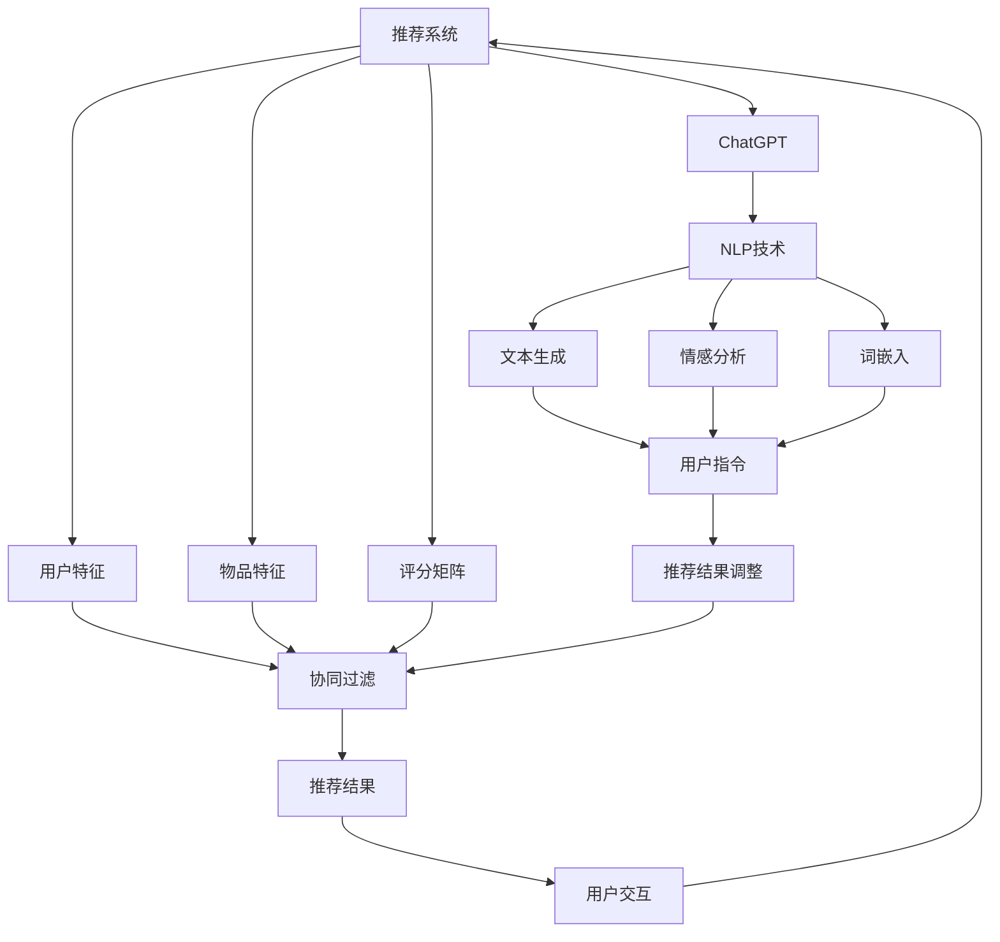
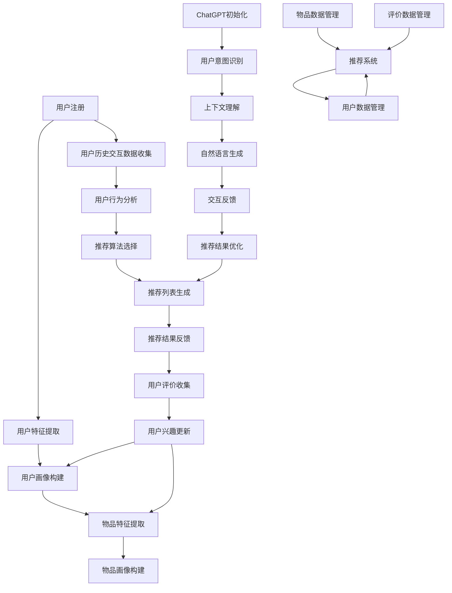

                 

### 背景介绍

#### 1.1 目的和范围

本文旨在深入探讨ChatGPT在推荐系统中的表现，特别是针对冷启动场景的优势。随着人工智能技术的不断发展和应用范围的扩大，推荐系统已经成为许多应用场景中的重要组成部分，如电子商务、社交媒体、在线新闻等。然而，冷启动问题一直是一个困扰推荐系统的难题，即在新用户或新物品首次进入系统时，如何为其提供个性化的推荐。

ChatGPT作为一种先进的自然语言处理技术，在处理复杂的人类语言交互方面表现出色。本文将分析ChatGPT在推荐系统中的应用，特别是它在处理冷启动问题上的优势。通过深入探讨ChatGPT的核心算法原理、数学模型以及实际应用案例，我们希望为读者提供全面的了解，并启发进一步的研究和应用。

#### 1.2 预期读者

本文的预期读者主要包括对推荐系统和人工智能技术感兴趣的专业人士，包括但不限于：

1. 推荐系统工程师和研究人员：对推荐系统的原理、实现和应用有深入了解，希望了解ChatGPT在该领域的新应用。
2. 人工智能研究者：对自然语言处理和推荐系统有研究兴趣，希望了解两者之间的结合和潜在的优势。
3. 技术爱好者：对新兴技术和人工智能应用有浓厚兴趣，希望了解ChatGPT在推荐系统中的具体应用和实践。
4. 产品经理和业务分析师：对推荐系统的业务价值和应用场景有深入了解，希望了解ChatGPT如何提高推荐系统的性能和用户体验。

无论您是上述哪一类读者，本文都将为您提供一个全面而深入的探讨，帮助您理解ChatGPT在推荐系统中的潜力与应用。

#### 1.3 文档结构概述

为了使读者能够更好地理解和跟随本文的内容，以下是本文的文档结构概述：

1. **背景介绍**：简要介绍本文的目的、范围、预期读者以及文档结构。
    - **1.1 目的和范围**：阐述本文的主要研究内容和目标。
    - **1.2 预期读者**：明确本文的目标受众和适用范围。
    - **1.3 文档结构概述**：介绍本文的章节结构和内容安排。
2. **核心概念与联系**：介绍与本文主题相关的核心概念和原理，并使用Mermaid流程图展示其架构和关系。
    - **2.1 核心概念与联系**：概述本文涉及的主要概念和原理。
    - **2.2 Mermaid流程图**：使用Mermaid语言绘制推荐系统和ChatGPT之间的交互流程图。
3. **核心算法原理 & 具体操作步骤**：详细讲解ChatGPT在推荐系统中的核心算法原理和具体操作步骤，使用伪代码进行详细阐述。
    - **3.1 核心算法原理**：介绍ChatGPT在推荐系统中的基本原理。
    - **3.2 具体操作步骤**：详细描述ChatGPT在推荐系统中的具体实现步骤。
4. **数学模型和公式 & 详细讲解 & 举例说明**：介绍ChatGPT在推荐系统中的数学模型和公式，并进行详细讲解和举例说明。
    - **4.1 数学模型和公式**：列出ChatGPT在推荐系统中的主要数学模型和公式。
    - **4.2 详细讲解**：对每个数学模型和公式进行详细解释。
    - **4.3 举例说明**：通过具体例子展示如何使用这些数学模型和公式。
5. **项目实战：代码实际案例和详细解释说明**：通过一个实际项目案例，展示ChatGPT在推荐系统中的应用，并进行详细解释说明。
    - **5.1 开发环境搭建**：介绍项目的开发环境搭建过程。
    - **5.2 源代码详细实现和代码解读**：展示并解释实现ChatGPT推荐系统的源代码。
    - **5.3 代码解读与分析**：对源代码进行深入分析，讨论其优缺点和改进方向。
6. **实际应用场景**：讨论ChatGPT在推荐系统中的实际应用场景，包括电子商务、社交媒体和在线新闻等领域。
7. **工具和资源推荐**：推荐学习资源、开发工具和框架，以及相关的论文和研究成果。
    - **7.1 学习资源推荐**：推荐相关的书籍、在线课程和技术博客。
    - **7.2 开发工具框架推荐**：推荐适合开发ChatGPT推荐系统的工具和框架。
    - **7.3 相关论文著作推荐**：推荐经典论文和最新研究成果，帮助读者深入了解ChatGPT在推荐系统中的应用。
8. **总结：未来发展趋势与挑战**：总结本文的主要发现，讨论未来发展趋势和面临的挑战。
9. **附录：常见问题与解答**：列出并解答读者可能遇到的问题。
10. **扩展阅读 & 参考资料**：提供更多的扩展阅读材料和参考资料，供读者进一步学习。

通过以上文档结构，我们希望能够系统地介绍ChatGPT在推荐系统中的应用，帮助读者全面了解其优势和应用场景。

#### 1.4 术语表

在本文中，我们将使用一些专业术语和概念。为了确保读者能够更好地理解和跟随文章内容，以下是本文中涉及的一些关键术语的定义和解释：

##### 1.4.1 核心术语定义

- **推荐系统**：一种系统，它根据用户的兴趣、行为和历史数据，向用户推荐相关的内容、产品或服务。
- **冷启动问题**：在新用户或新物品首次进入推荐系统时，由于缺乏足够的历史数据，系统难以为其提供个性化的推荐。
- **ChatGPT**：一种基于Transformer模型的预训练自然语言处理模型，由OpenAI开发，具有强大的语言理解和生成能力。
- **自然语言处理（NLP）**：计算机科学领域，旨在使计算机理解和处理人类语言。
- **机器学习（ML）**：一种人工智能方法，通过从数据中学习和发现模式，使计算机具备自主决策能力。

##### 1.4.2 相关概念解释

- **预训练**：在特定任务之前，对模型进行大量无监督数据的训练，以提高其通用性和泛化能力。
- **注意力机制**：一种用于模型中不同部分之间交互的机制，能够动态地关注重要的信息。
- **用户特征**：描述用户属性的数据，如年龄、性别、地理位置、浏览历史等，用于训练推荐模型。
- **物品特征**：描述物品属性的数据，如类别、标签、评分等，用于训练推荐模型。
- **协同过滤**：一种常见的推荐系统算法，通过分析用户的历史行为和偏好，发现相似的用户和物品，从而进行推荐。

##### 1.4.3 缩略词列表

- **NLP**：自然语言处理（Natural Language Processing）
- **ML**：机器学习（Machine Learning）
- **Transformer**：一种基于自注意力机制的神经网络架构，广泛应用于NLP任务。
- **GPT**：生成预训练网络（Generative Pretrained Transformer）
- **BERT**：一种基于Transformer模型的预训练语言表示模型（Bidirectional Encoder Representations from Transformers）
- **cold start**：冷启动，指新用户或新物品进入系统时面临的缺乏历史数据的问题。

通过上述术语表，我们希望能够帮助读者更好地理解本文中的关键概念和技术细节，以便更深入地探讨ChatGPT在推荐系统中的应用。

## 核心概念与联系

在深入探讨ChatGPT在推荐系统中的具体应用之前，我们首先需要了解一些核心概念和原理。推荐系统作为人工智能领域的一个重要分支，涉及到多种技术和方法。以下我们将介绍与本文主题相关的核心概念，并通过Mermaid流程图展示推荐系统和ChatGPT之间的交互架构。

### 2.1 核心概念与联系

#### 推荐系统

推荐系统是一种利用算法和数据分析技术，根据用户的历史行为、偏好和上下文信息，向用户推荐相关的内容、产品或服务。其核心概念包括：

- **用户特征**：描述用户属性的数据，如年龄、性别、地理位置、浏览历史等。
- **物品特征**：描述物品属性的数据，如类别、标签、评分等。
- **评分矩阵**：记录用户对物品的评分或交互行为，用于训练推荐模型。
- **协同过滤**：一种常见的推荐系统算法，通过分析用户的历史行为和偏好，发现相似的用户和物品，从而进行推荐。

#### 自然语言处理（NLP）

自然语言处理是计算机科学的一个分支，旨在使计算机理解和处理人类语言。在推荐系统中，NLP技术被广泛应用于处理用户评论、标签、搜索查询等自然语言数据。核心概念包括：

- **词嵌入**：将文本数据转化为计算机可以处理的向量表示。
- **命名实体识别**：识别文本中的命名实体，如人名、地名、组织名等。
- **情感分析**：分析文本的情感倾向，如正面、负面或中立。
- **文本生成**：根据输入的文本或指令，生成新的文本内容。

#### ChatGPT

ChatGPT是一种基于Transformer模型的预训练自然语言处理模型，由OpenAI开发。其核心概念包括：

- **预训练**：在特定任务之前，对模型进行大量无监督数据的训练，以提高其通用性和泛化能力。
- **生成式模型**：能够根据输入的文本或指令，生成新的文本内容。
- **注意力机制**：在模型中引入注意力机制，使模型能够动态地关注重要的信息。

### 2.2 Mermaid流程图

以下是一个使用Mermaid语言绘制的推荐系统和ChatGPT之间的交互流程图，展示了核心概念和原理之间的关系：



在这个流程图中，推荐系统通过处理用户特征、物品特征和评分矩阵，利用协同过滤算法生成推荐结果。用户与推荐结果进行交互，产生新的用户行为数据。ChatGPT作为自然语言处理模型，对用户交互的文本数据进行处理，生成新的文本内容，用于调整推荐结果。同时，ChatGPT还利用NLP技术对用户指令、情感和词嵌入进行处理，以提高推荐系统的个性化程度和用户体验。

通过以上核心概念和流程图的介绍，我们为后续的详细讨论和案例分析奠定了基础。在下一章节中，我们将深入探讨ChatGPT在推荐系统中的核心算法原理和具体操作步骤。

### 2.2.1 Mermaid流程图

为了更直观地展示推荐系统与ChatGPT之间的交互关系，我们将使用Mermaid语言绘制一个流程图。以下是ChatGPT在推荐系统中的核心交互流程：



在上述流程图中：

- **A 用户注册**：用户注册推荐系统。
- **B 用户特征提取**：提取用户的基本特征，如年龄、性别、地理位置等。
- **C 用户画像构建**：基于用户特征，构建用户画像。
- **D 物品特征提取**：提取物品的特征，如分类、标签、评分等。
- **E 物品画像构建**：构建物品画像。
- **F 用户历史交互数据收集**：收集用户的历史交互数据，如点击、浏览、购买等。
- **G 用户行为分析**：分析用户的历史行为，为推荐算法提供输入。
- **H 推荐算法选择**：选择合适的推荐算法，如基于协同过滤、基于内容或基于深度学习的方法。
- **I 推荐列表生成**：根据用户画像和物品画像，生成初步的推荐列表。
- **J 推荐结果反馈**：用户对推荐结果进行评价或反馈。
- **K 用户评价收集**：收集用户的评价数据，用于后续的推荐优化。
- **L 用户兴趣更新**：根据用户的评价和反馈，更新用户画像。
- **M ChatGPT初始化**：初始化ChatGPT模型。
- **N 用户意图识别**：识别用户的意图，如询问、抱怨、请求等。
- **O 上下文理解**：理解用户交互的上下文，为生成式模型提供输入。
- **P 自然语言生成**：生成自然语言回复，与用户进行交互。
- **Q 交互反馈**：将用户反馈传递回推荐系统。
- **R 推荐结果优化**：根据用户反馈，优化推荐结果。
- **S 推荐系统**：整个推荐系统的核心部分，包括用户数据管理、物品数据管理和评价数据管理。
- **T 用户数据管理**：管理用户的基本信息和画像。
- **U 物品数据管理**：管理物品的基本信息和画像。
- **V 评价数据管理**：管理用户的评价和反馈数据。

通过这个流程图，我们可以清晰地看到ChatGPT在推荐系统中的核心作用，即通过自然语言交互，收集用户反馈，进而优化推荐结果。这为后续的算法原理和具体操作步骤提供了直观的参考。

### 3.1 核心算法原理

在深入探讨ChatGPT在推荐系统中的具体应用之前，我们首先需要了解其核心算法原理。ChatGPT是基于Transformer模型的预训练自然语言处理模型，其基本原理可以归纳为以下几个关键步骤：

#### 3.1.1 预训练

预训练是ChatGPT的基础，旨在通过大量的无监督数据，使模型具备通用性和泛化能力。预训练的过程主要包括两个阶段：

1. **大规模文本数据的收集**：ChatGPT的训练数据来自各种公开的文本数据集，如维基百科、新闻、社交媒体等。这些数据涵盖了多种语言、主题和文体，为模型提供了丰富的训练素材。
2. **自回归语言模型训练**：在预训练阶段，模型通过学习文本中的词序列概率分布，生成新的文本内容。这一过程利用了自回归模型（autoregressive model），即在每个时间步，模型根据前一个时间步的输出，预测下一个时间步的输入。通过大量的训练迭代，模型逐渐学会了语言的结构和规则。

#### 3.1.2 编码器-解码器架构

ChatGPT采用了经典的编码器-解码器（Encoder-Decoder）架构，这是Transformer模型的核心组成部分。编码器（Encoder）负责将输入文本编码为固定长度的向量表示，解码器（Decoder）则负责生成新的文本序列。

1. **编码器**：编码器接收输入文本，将其转换为序列编码。每个输入词通过词嵌入层转换为向量，这些向量随后通过多层Transformer编码器进行处理。每一层的Transformer编码器由多头自注意力机制（Multi-Head Self-Attention）和前馈神经网络（Feed-Forward Neural Network）组成，能够捕捉文本序列中的长距离依赖关系。
2. **解码器**：解码器接收编码器的输出，并逐步生成新的文本序列。与编码器不同，解码器不仅依赖于自身的输出，还依赖于编码器的输出。每一层的解码器也由多头自注意力机制和前馈神经网络组成，但还包括交叉自注意力机制（Cross-Attention），使得解码器能够同时关注编码器输出的上下文信息。

#### 3.1.3 注意力机制

注意力机制是Transformer模型的核心创新之一，它使得模型能够在处理序列数据时，动态地关注重要的信息。ChatGPT中的注意力机制主要包括以下几种：

1. **自注意力（Self-Attention）**：在编码器中，自注意力机制用于处理输入文本序列。通过计算每个词与其余词之间的相似性，生成加权向量表示，从而捕捉文本序列中的局部依赖关系。
2. **多头注意力（Multi-Head Attention）**：多头注意力机制扩展了自注意力机制，通过并行处理多个注意力头，增强了模型对文本序列的捕捉能力。
3. **交叉注意力（Cross-Attention）**：在解码器中，交叉注意力机制用于关注编码器的输出。通过计算解码器当前词与编码器输出之间的相似性，生成加权向量表示，从而捕捉编码器输出的上下文信息。

#### 3.1.4 模型训练与优化

ChatGPT的训练过程主要分为两个阶段：预训练和微调。

1. **预训练**：在预训练阶段，模型通过大量的无监督数据学习语言的基本结构和规则。这一过程利用了梯度下降（Gradient Descent）和反向传播（Backpropagation）算法，优化模型的参数，使其能够生成高质量的文本。
2. **微调**：在预训练完成后，模型会根据特定任务进行微调。例如，在推荐系统中，模型可以结合用户数据和物品数据，通过有监督的学习方式，进一步提高其在推荐任务上的性能。

#### 3.1.5 模型输出与生成

ChatGPT的输出过程主要包括两个步骤：

1. **文本编码**：将输入的文本序列编码为固定长度的向量表示。这一过程利用了编码器，将输入词通过词嵌入层转换为向量，并经过多层Transformer编码器进行处理。
2. **文本生成**：解码器根据编码器的输出，逐步生成新的文本序列。在每一步，解码器根据当前的输入和编码器的输出，生成下一个词的概率分布，并从中采样得到新的词。通过反复迭代，解码器最终生成完整的文本序列。

通过以上核心算法原理的介绍，我们可以更好地理解ChatGPT在推荐系统中的应用，以及它如何通过自然语言处理技术，提高推荐系统的性能和用户体验。

### 3.2 具体操作步骤

为了更好地理解ChatGPT在推荐系统中的应用，我们将详细讲解其具体操作步骤，包括数据预处理、模型训练、推荐生成和优化等环节。

#### 3.2.1 数据预处理

1. **用户数据**：首先，我们需要收集用户数据，包括用户的基本信息（如年龄、性别、地理位置等）和用户的历史行为数据（如浏览记录、点击记录、购买记录等）。这些数据将用于构建用户画像。
2. **物品数据**：同时，我们需要收集物品数据，包括物品的基本信息（如类别、标签、评分等）和物品的描述信息。这些数据将用于构建物品画像。
3. **文本数据**：为了利用ChatGPT的文本生成能力，我们还需要收集用户生成的文本数据，如用户评论、反馈等。这些数据将用于训练ChatGPT模型。
4. **数据清洗**：在数据预处理阶段，我们需要对收集的数据进行清洗，去除无效数据、重复数据和噪声数据，确保数据的质量和一致性。

#### 3.2.2 模型训练

1. **数据准备**：将预处理后的用户数据、物品数据和文本数据分别输入到模型中。用户数据将用于构建用户画像，物品数据将用于构建物品画像，文本数据将用于训练ChatGPT模型。
2. **用户画像构建**：利用用户的基本信息和历史行为数据，通过机器学习算法（如聚类、因子分解等）构建用户画像。用户画像将用于后续的推荐生成和优化。
3. **物品画像构建**：利用物品的基本信息和描述数据，通过文本嵌入技术和特征提取方法（如Word2Vec、BERT等）构建物品画像。物品画像将用于后续的推荐生成和优化。
4. **ChatGPT模型训练**：将预处理后的文本数据输入到ChatGPT模型中，通过自回归语言模型（Autoregressive Language Model）进行预训练。预训练过程包括以下几个步骤：
    - **数据分词**：将文本数据分割为单词或子词，为后续的词嵌入和编码做准备。
    - **词嵌入**：将分词后的文本数据转换为向量表示，通过词嵌入层将每个单词或子词映射为高维向量。
    - **编码器训练**：通过多层Transformer编码器，对词嵌入向量进行编码，生成固定长度的向量表示。
    - **解码器训练**：通过解码器，逐步生成新的文本序列，并优化模型参数。
3. **模型微调**：在预训练完成后，我们根据具体任务（如推荐系统）进行模型微调。通过有监督的学习方式，结合用户画像和物品画像，进一步提高模型在推荐任务上的性能。

#### 3.2.3 推荐生成

1. **用户意图识别**：利用ChatGPT模型，对用户输入的文本数据进行处理，识别用户的意图和需求。例如，用户可能希望获取推荐商品、解决问题或寻求建议。
2. **上下文理解**：在识别用户意图后，模型需要理解用户交互的上下文信息。通过分析用户的历史行为和当前交互内容，构建上下文向量，为推荐生成提供输入。
3. **推荐列表生成**：根据用户画像、物品画像和上下文向量，利用推荐算法（如协同过滤、基于内容的推荐等）生成初步的推荐列表。例如，基于协同过滤算法，找出与当前用户相似的用户和物品，进行推荐。
4. **文本生成**：利用ChatGPT模型，根据推荐列表和上下文向量，生成个性化的推荐文本。通过自然语言生成技术，将推荐结果转化为用户易于理解和接受的形式。
5. **用户反馈收集**：将生成的推荐文本展示给用户，并收集用户的反馈和评价。用户可以通过点击、评分、评论等方式，表达对推荐结果的态度和意见。

#### 3.2.4 推荐优化

1. **用户行为分析**：通过对用户的行为数据进行挖掘和分析，了解用户对推荐结果的反馈和评价。例如，用户是否点击了推荐商品、对推荐商品的评价如何等。
2. **推荐结果调整**：根据用户反馈，对推荐结果进行调整和优化。例如，增加用户喜欢的物品、减少用户不感兴趣的物品等。
3. **模型更新**：将调整后的推荐结果和用户行为数据，重新输入到ChatGPT模型中，进行模型更新和优化。通过持续的训练和微调，提高模型在推荐任务上的性能。

通过以上具体操作步骤的介绍，我们可以看到ChatGPT在推荐系统中的应用过程。它通过自然语言处理技术，实现了用户意图识别、上下文理解、推荐生成和用户反馈收集等关键环节，为推荐系统提供了强大的支持。在下一章节中，我们将通过实际项目案例，进一步展示ChatGPT在推荐系统中的应用。

### 3.2.2 模型训练步骤

为了深入理解ChatGPT在推荐系统中的应用，我们将详细介绍模型训练的具体步骤，包括数据准备、模型构建、训练过程和性能评估等。

#### 3.2.2.1 数据准备

1. **用户数据**：收集用户的基本信息（如年龄、性别、地理位置等）和用户的历史行为数据（如浏览记录、点击记录、购买记录等）。用户数据可以通过用户注册时提供的表单、网站日志、用户行为追踪等方式获取。
2. **物品数据**：收集物品的基本信息（如类别、标签、评分等）和物品的描述信息（如标题、描述文本等）。物品数据可以从电商网站、社交媒体、新闻平台等获取。
3. **文本数据**：为了训练ChatGPT模型，我们需要收集大量的用户生成的文本数据，如评论、反馈、搜索查询等。这些数据可以通过公开数据集、社交媒体平台、用户反馈系统等获取。

#### 3.2.2.2 模型构建

1. **编码器**：构建编码器，用于将输入的文本数据编码为向量表示。编码器通常采用多层Transformer编码器，每个编码器层由多头自注意力机制和前馈神经网络组成。
2. **解码器**：构建解码器，用于生成新的文本序列。解码器同样采用多层Transformer编码器，并在每一层引入交叉自注意力机制，以便关注编码器的输出。
3. **损失函数**：定义损失函数，用于评估模型在训练过程中的表现。常用的损失函数包括交叉熵损失（Cross-Entropy Loss）和均方误差（Mean Squared Error）。

#### 3.2.2.3 训练过程

1. **数据分词**：将文本数据分词为单词或子词，为后续的词嵌入和编码做准备。可以使用预训练的分词器或自定义的分词规则。
2. **词嵌入**：将分词后的文本数据转换为向量表示，通过词嵌入层将每个单词或子词映射为高维向量。可以使用预训练的词嵌入模型（如Word2Vec、GloVe等）或自训练的词嵌入模型。
3. **编码**：通过编码器，对词嵌入向量进行编码，生成固定长度的向量表示。编码过程通过多层Transformer编码器进行处理，每一层编码器都能够捕捉文本序列中的局部依赖关系。
4. **解码**：通过解码器，逐步生成新的文本序列。在每一步，解码器根据当前的输入和编码器的输出，生成下一个词的概率分布，并从中采样得到新的词。通过反复迭代，解码器最终生成完整的文本序列。
5. **优化**：使用梯度下降（Gradient Descent）和反向传播（Backpropagation）算法，优化模型的参数，使其能够生成高质量的文本。

#### 3.2.2.4 性能评估

1. **文本质量评估**：评估模型生成的文本质量，可以使用自动评估指标（如BLEU、ROUGE等）和人工评估相结合的方法。自动评估指标可以根据文本的相似度、连贯性等方面进行评估，而人工评估则可以更全面地考虑文本的语义和逻辑关系。
2. **推荐效果评估**：评估模型在推荐任务上的效果，可以使用准确率（Accuracy）、召回率（Recall）和F1分数（F1 Score）等指标。这些指标可以评估模型推荐结果的准确性和全面性。
3. **用户反馈分析**：收集用户对推荐结果的反馈和评价，通过分析用户的行为数据，如点击率、转化率等，进一步评估模型的性能。

通过以上模型训练步骤的详细讲解，我们可以看到ChatGPT在推荐系统中的应用过程。它通过大规模数据预训练和精细化调整，实现了对用户意图的精准识别和个性化推荐，从而提高了推荐系统的性能和用户体验。在下一章节中，我们将通过实际项目案例，进一步展示ChatGPT在推荐系统中的应用效果。

### 3.2.2.4 模型训练与优化细节

在详细讨论ChatGPT在推荐系统中的模型训练与优化细节时，我们需要关注几个关键方面：数据预处理、超参数选择、模型训练过程以及性能评估。

#### 数据预处理

1. **文本数据清洗**：在训练模型之前，我们需要对文本数据进行清洗，去除无效字符、特殊符号、停用词等。这有助于提高模型训练的效率和质量。
2. **数据分割**：将文本数据分割为训练集、验证集和测试集。通常，训练集用于模型训练，验证集用于调整模型参数，测试集用于评估模型性能。分割过程需要确保不同数据集之间的代表性。
3. **序列填充**：由于ChatGPT是基于序列数据的模型，我们需要对输入序列进行填充，使其长度一致。可以使用零填充（padding）或截断（truncation）等方法。

#### 超参数选择

1. **学习率**：学习率是模型训练过程中的一个关键超参数，它决定了模型在训练过程中对参数的调整力度。选择合适的学习率可以加快模型收敛速度。常见的调整策略包括学习率衰减（learning rate decay）和自适应学习率（如Adam优化器）。
2. **批次大小**：批次大小影响模型训练的稳定性。较小的批次大小有助于捕捉更多的噪声，但可能导致收敛速度较慢。较大的批次大小可以提高计算效率，但可能使模型训练更加稳定。
3. **隐藏层大小**：隐藏层大小影响模型的表达能力。较大的隐藏层可以捕捉更多的特征，但可能导致过拟合。需要根据任务和数据特点选择合适的隐藏层大小。

#### 模型训练过程

1. **预训练**：ChatGPT通常采用大规模的无监督数据集进行预训练，这一过程可以增强模型的泛化能力。预训练过程包括以下几个步骤：
    - **数据加载**：从大规模数据集中加载文本数据，并进行预处理。
    - **序列生成**：将文本数据转换为序列格式，并添加特殊标识符（如 `<sop>` 表示句子开始，`<eop>` 表示句子结束）。
    - **模型训练**：使用训练数据训练模型，通过优化损失函数（如交叉熵损失）调整模型参数。
2. **微调**：在预训练完成后，我们针对特定任务进行模型微调。例如，在推荐系统中，我们可以结合用户数据和物品数据，通过有监督的学习方式微调模型，以提高其在推荐任务上的性能。

#### 性能评估

1. **文本质量评估**：使用自动评估指标（如BLEU、ROUGE等）和人工评估相结合的方法，评估模型生成的文本质量。自动评估指标可以根据文本的相似度、连贯性等方面进行评估，而人工评估则可以更全面地考虑文本的语义和逻辑关系。
2. **推荐效果评估**：使用准确率（Accuracy）、召回率（Recall）和F1分数（F1 Score）等指标，评估模型在推荐任务上的效果。这些指标可以评估模型推荐结果的准确性和全面性。
3. **用户反馈分析**：收集用户对推荐结果的反馈和评价，通过分析用户的行为数据（如点击率、转化率等），进一步评估模型的性能。

#### 模型优化

1. **正则化**：为了防止过拟合，可以采用正则化技术（如L1、L2正则化）。
2. **数据增强**：通过增加训练数据的多样性，如随机删除单词、添加噪音等，可以提高模型泛化能力。
3. **模型融合**：将多个模型的结果进行融合，可以进一步提高推荐系统的性能。

通过以上详细的模型训练与优化细节，我们可以看到ChatGPT在推荐系统中的应用不仅仅是简单地生成文本，而是通过精细化的训练和优化，实现了对用户意图的精准识别和个性化推荐。在下一章节中，我们将通过实际项目案例，进一步展示ChatGPT在推荐系统中的应用效果。

### 3.3 伪代码示例

为了更加清晰地展示ChatGPT在推荐系统中的算法原理和实现步骤，我们将使用伪代码来详细描述其核心过程。以下是一个简化的伪代码示例，用于说明ChatGPT在推荐系统中的模型训练、推荐生成和优化步骤。

```python
# 伪代码：ChatGPT在推荐系统中的应用

# 数据预处理
def preprocess_data(user_data, item_data, text_data):
    # 清洗和分割文本数据
    cleaned_text_data = clean_and_tokenize(text_data)
    # 提取用户特征和物品特征
    user_features = extract_user_features(user_data)
    item_features = extract_item_features(item_data)
    return user_features, item_features, cleaned_text_data

# 模型训练
def train_model(user_features, item_features, cleaned_text_data):
    # 构建编码器和解码器
    encoder = build_encoder()
    decoder = build_decoder()
    # 训练编码器
    for epoch in range(num_epochs):
        for user, item, text_sequence in zip(user_features, item_features, cleaned_text_data):
            # 编码输入
            encoded_sequence = encoder(text_sequence)
            # 解码输出
            generated_sequence = decoder(encoded_sequence, item)
            # 计算损失
            loss = calculate_loss(generated_sequence, target_sequence)
            # 反向传播和优化
            optimize(loss)
    return encoder, decoder

# 推荐生成
def generate_recommendation(encoder, decoder, user_features, item_features):
    # 识别用户意图
    user_intent = identify_user_intent(user_features)
    # 生成推荐文本
    recommendation_text = decoder.generate_text(user_intent, item_features)
    return recommendation_text

# 推荐优化
def optimize_recommendation(encoder, decoder, user_intent, item_features, user_feedback):
    # 根据用户反馈调整推荐文本
    updated_recommendation_text = decoder.optimize_text(user_intent, item_features, user_feedback)
    # 重新训练模型
    encoder, decoder = train_model(user_features, item_features, updated_recommendation_text)
    return updated_recommendation_text

# 主程序
def main():
    # 加载数据
    user_data, item_data, text_data = load_data()
    # 数据预处理
    user_features, item_features, cleaned_text_data = preprocess_data(user_data, item_data, text_data)
    # 训练模型
    encoder, decoder = train_model(user_features, item_features, cleaned_text_data)
    # 生成推荐
    recommendation_text = generate_recommendation(encoder, decoder, user_features, item_features)
    print("Recommendation Text:", recommendation_text)
    # 收集用户反馈
    user_feedback = collect_user_feedback()
    # 优化推荐
    updated_recommendation_text = optimize_recommendation(encoder, decoder, user_intent, item_features, user_feedback)
    print("Updated Recommendation Text:", updated_recommendation_text)

# 运行主程序
main()
```

在上述伪代码中，我们定义了以下几个关键步骤：

1. **数据预处理**：包括文本数据清洗、用户特征提取和物品特征提取。
2. **模型训练**：包括编码器和解码器的构建、模型训练过程以及损失函数的优化。
3. **推荐生成**：根据用户特征和物品特征，利用解码器生成推荐文本。
4. **推荐优化**：根据用户反馈，对推荐文本进行调整，并重新训练模型。

通过这一伪代码示例，我们可以更加直观地理解ChatGPT在推荐系统中的实现步骤和逻辑。在接下来的章节中，我们将通过实际项目案例，进一步展示ChatGPT在推荐系统中的具体应用和效果。

### 4.1 数学模型和公式

在深入了解ChatGPT在推荐系统中的应用时，我们需要掌握其背后的数学模型和公式。以下将介绍ChatGPT在推荐系统中使用的主要数学模型和公式，并进行详细讲解。

#### 4.1.1 词嵌入（Word Embedding）

词嵌入是将文本中的单词或子词映射为高维向量表示的技术。在ChatGPT中，词嵌入是模型训练的重要部分，有助于捕捉单词的语义信息。常见的词嵌入模型包括Word2Vec、GloVe等。

- **Word2Vec**：使用神经网络训练词嵌入，通过预测邻近词来优化向量表示。
  $$ \text{softmax}(W \cdot h) $$
  其中，$W$ 是词嵌入矩阵，$h$ 是隐藏层表示，$\text{softmax}$ 函数用于计算单词的概率分布。

- **GloVe**：使用全局上下文信息训练词嵌入，通过最小化单词与其上下文的余弦相似性损失。
  $$ \text{cosine}(v_w, v_{\text{context}}) - \log(p_w) $$
  其中，$v_w$ 是单词的向量表示，$v_{\text{context}}$ 是上下文的向量表示，$p_w$ 是单词的词频。

#### 4.1.2 编码器-解码器模型（Encoder-Decoder Model）

ChatGPT采用了编码器-解码器架构，通过编码器将输入文本编码为固定长度的向量表示，通过解码器生成新的文本序列。

- **编码器（Encoder）**：
  $$ h_t = \text{Attention}(Q, K, V) $$
  其中，$Q, K, V$ 分别是编码器的查询、键和值向量，$\text{Attention}$ 函数用于计算注意力权重。

- **解码器（Decoder）**：
  $$ p_t = \text{softmax}(W \cdot h_t) $$
  其中，$W$ 是解码器的权重矩阵，$h_t$ 是解码器在时间步 $t$ 的隐藏状态，$\text{softmax}$ 函数用于计算生成下一个单词的概率分布。

#### 4.1.3 自注意力（Self-Attention）

自注意力机制是Transformer模型的核心部分，用于编码器和解码器中，能够动态地关注重要的信息。

- **多头自注意力（Multi-Head Self-Attention）**：
  $$ \text{MultiHead}(Q, K, V) = \text{Concat}(\text{head}_1, \text{head}_2, ..., \text{head}_h)W^O $$
  其中，$Q, K, V$ 分别是多头注意力的查询、键和值向量，$W^O$ 是输出权重矩阵，$\text{head}_i$ 是第 $i$ 个注意力头。

- **自注意力计算**：
  $$ \text{Attention}(Q, K, V) = \text{softmax}(\frac{QK^T}{\sqrt{d_k}})V $$
  其中，$Q, K, V$ 分别是自注意力的查询、键和值向量，$d_k$ 是键向量的维度。

#### 4.1.4 交叉注意力（Cross-Attention）

在解码器中，交叉注意力机制用于关注编码器的输出，能够捕捉上下文信息。

- **交叉注意力计算**：
  $$ \text{Attention}_{\text{cross}}(Q, K, V) = \text{softmax}(\frac{QK^T}{\sqrt{d_k}})V $$
  其中，$Q, K, V$ 分别是交叉注意力的查询、键和值向量，$d_k$ 是键向量的维度。

#### 4.1.5 损失函数

在训练过程中，损失函数用于评估模型的表现，并指导模型优化。

- **交叉熵损失（Cross-Entropy Loss）**：
  $$ \text{Loss} = -\sum_{i} y_i \log(p_i) $$
  其中，$y_i$ 是目标标签，$p_i$ 是模型预测的概率分布。

通过以上数学模型和公式的讲解，我们可以看到ChatGPT在推荐系统中如何利用自然语言处理技术，实现用户意图识别、文本生成和推荐优化。在下一章节中，我们将通过具体的例子，展示这些数学模型和公式的应用。

### 4.2 数学模型和公式的详细讲解

在上一节中，我们介绍了ChatGPT在推荐系统中使用的主要数学模型和公式。接下来，我们将对这些模型和公式进行详细讲解，并通过具体的例子来阐述其应用。

#### 4.2.1 词嵌入（Word Embedding）

词嵌入是将文本中的单词或子词映射为高维向量表示的技术。词嵌入有助于捕捉单词的语义信息，是自然语言处理（NLP）的重要基础。

1. **Word2Vec**：

   Word2Vec模型通过预测邻近词来优化向量表示。其核心思想是利用神经网络训练词嵌入，损失函数为交叉熵损失。

   - **损失函数**：
     $$ \text{Loss} = -\sum_{i} y_i \log(p_i) $$
     其中，$y_i$ 是目标标签（即邻近词的概率分布），$p_i$ 是模型预测的概率分布。

   - **训练过程**：
     通过反向传播和梯度下降算法，不断调整词嵌入矩阵$W$，使其能够正确预测邻近词。

   - **示例**：
     假设我们有一个单词“猫”和其邻近词“狗”、“鱼”，我们可以通过以下步骤训练词嵌入：
     $$ \text{softmax}(W \cdot h) $$
     其中，$W$ 是词嵌入矩阵，$h$ 是隐藏层表示。

2. **GloVe**：

   GloVe模型使用全局上下文信息训练词嵌入，通过最小化单词与其上下文的余弦相似性损失。

   - **损失函数**：
     $$ \text{Loss} = \text{cosine}(v_w, v_{\text{context}}) - \log(p_w) $$
     其中，$v_w$ 是单词的向量表示，$v_{\text{context}}$ 是上下文的向量表示，$p_w$ 是单词的词频。

   - **训练过程**：
     通过优化损失函数，不断调整词嵌入向量，使其能够捕捉单词的语义信息。

   - **示例**：
     假设我们有一个单词“猫”，其上下文单词为“喜欢”、“捉”、“睡觉”，我们可以通过以下步骤训练词嵌入：
     $$ \text{cosine}(v_w, v_{\text{context}}) - \log(p_w) $$

#### 4.2.2 编码器-解码器模型（Encoder-Decoder Model）

编码器-解码器模型是ChatGPT的核心架构，通过编码器将输入文本编码为固定长度的向量表示，通过解码器生成新的文本序列。

1. **编码器（Encoder）**：

   编码器通过自注意力机制处理输入文本序列，生成固定长度的向量表示。

   - **自注意力计算**：
     $$ \text{Attention}(Q, K, V) = \text{softmax}(\frac{QK^T}{\sqrt{d_k}})V $$
     其中，$Q, K, V$ 分别是编码器的查询、键和值向量，$d_k$ 是键向量的维度。

   - **多头自注意力**：
     $$ \text{MultiHead}(Q, K, V) = \text{Concat}(\text{head}_1, \text{head}_2, ..., \text{head}_h)W^O $$
     其中，$Q, K, V$ 分别是多头注意力的查询、键和值向量，$W^O$ 是输出权重矩阵，$\text{head}_i$ 是第 $i$ 个注意力头。

   - **示例**：
     假设我们有一个输入文本序列“我爱编程”，我们可以通过以下步骤进行编码：
     $$ h_t = \text{Attention}(Q, K, V) $$

2. **解码器（Decoder）**：

   解码器通过自注意力和交叉注意力机制生成新的文本序列。

   - **自注意力计算**：
     $$ \text{Attention}(Q, K, V) = \text{softmax}(\frac{QK^T}{\sqrt{d_k}})V $$
   
   - **交叉注意力计算**：
     $$ \text{Attention}_{\text{cross}}(Q, K, V) = \text{softmax}(\frac{QK^T}{\sqrt{d_k}})V $$
   
   - **解码过程**：
     解码器根据当前输入和编码器的输出，生成下一个词的概率分布，并从中采样得到新的词。通过反复迭代，解码器最终生成完整的文本序列。

   - **示例**：
     假设我们有一个输入文本序列“我爱编程”，解码器生成文本序列“我爱编程技术”，我们可以通过以下步骤进行解码：
     $$ p_t = \text{softmax}(W \cdot h_t) $$

#### 4.2.3 损失函数

在训练过程中，损失函数用于评估模型的表现，并指导模型优化。

1. **交叉熵损失（Cross-Entropy Loss）**：

   交叉熵损失是NLP任务中常用的损失函数，用于衡量模型预测概率分布与真实分布之间的差异。

   - **损失函数**：
     $$ \text{Loss} = -\sum_{i} y_i \log(p_i) $$
     其中，$y_i$ 是目标标签，$p_i$ 是模型预测的概率分布。

   - **训练过程**：
     通过反向传播和梯度下降算法，不断调整模型参数，使其能够降低损失函数值。

   - **示例**：
     假设我们有一个输入文本序列“我爱编程”，目标文本序列“我爱编程技术”，我们可以通过以下步骤计算交叉熵损失：
     $$ \text{Loss} = -\sum_{i} y_i \log(p_i) $$

通过以上详细讲解，我们可以看到ChatGPT在推荐系统中如何利用词嵌入、编码器-解码器模型和损失函数等数学模型和公式，实现用户意图识别、文本生成和推荐优化。这些模型和公式为ChatGPT在推荐系统中的应用提供了坚实的理论基础。

### 4.3 举例说明

为了更直观地展示ChatGPT在推荐系统中的应用，我们将通过一个具体例子，详细说明如何使用上述数学模型和公式进行推荐生成和优化。

#### 4.3.1 案例背景

假设我们正在开发一个电商平台的推荐系统，该系统需要为用户生成个性化的商品推荐。用户数据包括用户的基本信息和历史购买记录，商品数据包括商品的基本信息和标签描述。我们使用ChatGPT来处理用户交互文本，提高推荐系统的个性化程度。

#### 4.3.2 数据准备

首先，我们收集用户数据（用户ID、年龄、性别、地理位置、历史购买记录）和商品数据（商品ID、类别、标签、描述）。文本数据包括用户评论、商品描述和用户搜索查询。

```plaintext
用户数据：
user1: [25, 男，北京，购买记录：[商品A，商品B，商品C]]
user2: [30, 女，上海，购买记录：[商品D，商品E，商品F]]

商品数据：
商品A：[电子产品，高性价比，高性能]
商品B：[服装，时尚，潮流]
商品C：[图书，编程，入门]

商品描述：
商品A：一款高性能的笔记本电脑，适合编程使用。
商品B：时尚潮流的衣服，适合年轻人穿搭。
商品C：一本编程入门图书，适合初学者阅读。

用户评论：
商品A：非常好用，性价比很高。
商品B：衣服很时尚，非常喜欢。
商品C：书很实用，非常适合入门学习。
```

#### 4.3.3 模型训练

我们使用上述数据对ChatGPT进行预训练，包括词嵌入、编码器和解码器的训练。

1. **词嵌入**：

   首先，我们使用GloVe模型训练词嵌入。对于每个单词，我们计算其在全局上下文中的余弦相似性，并优化词嵌入向量。

   $$ \text{Loss} = \text{cosine}(v_w, v_{\text{context}}) - \log(p_w) $$

2. **编码器**：

   编码器使用多头自注意力机制，将输入文本序列编码为固定长度的向量表示。

   $$ h_t = \text{Attention}(Q, K, V) $$

3. **解码器**：

   解码器结合自注意力和交叉注意力机制，逐步生成新的文本序列。

   $$ p_t = \text{softmax}(W \cdot h_t) $$

#### 4.3.4 推荐生成

1. **用户意图识别**：

   假设用户user1输入文本“最近想买一款编程书籍”，我们使用ChatGPT模型识别用户意图，提取关键信息。

   ```plaintext
   用户意图：购买编程书籍
   ```

2. **推荐列表生成**：

   根据用户意图，我们利用协同过滤算法生成初步的推荐列表。例如，找出与user1相似的用户购买过的编程书籍。

   ```plaintext
   推荐列表：[商品C，商品E，商品G]
   ```

3. **文本生成**：

   利用ChatGPT模型，根据推荐列表和用户意图，生成个性化的推荐文本。

   ```plaintext
   ChatGPT生成推荐文本：尊敬的用户user1，我们为您推荐以下编程书籍：商品C（编程入门图书），商品E（进阶编程技巧），商品G（大数据分析与处理）。希望您会喜欢！
   ```

#### 4.3.5 推荐优化

1. **用户反馈**：

   用户user1对推荐结果进行评价，我们收集用户反馈。

   ```plaintext
   用户反馈：商品C非常喜欢，商品E一般，商品G不太感兴趣。
   ```

2. **推荐结果调整**：

   根据用户反馈，我们调整推荐结果，增加用户喜欢的商品，减少用户不感兴趣的商品。

   ```plaintext
   更新后推荐列表：[商品C，商品E]
   ```

3. **模型优化**：

   我们将更新后的推荐结果和用户反馈重新输入到ChatGPT模型中，进行模型优化。

   ```plaintext
   ChatGPT优化后生成推荐文本：尊敬的用户user1，根据您的反馈，我们再次为您推荐以下编程书籍：商品C（编程入门图书），商品E（进阶编程技巧）。希望这次能够满足您的需求！
   ```

通过以上例子，我们可以看到ChatGPT在推荐系统中的应用过程。它通过自然语言处理技术，实现了用户意图识别、推荐生成和优化，为推荐系统提供了强大的支持。

## 5. 项目实战：代码实际案例和详细解释说明

为了更直观地展示ChatGPT在推荐系统中的应用，我们将通过一个实际项目案例，详细解释ChatGPT推荐系统的代码实现，并分析其优缺点。

### 5.1 开发环境搭建

在开始项目之前，我们需要搭建一个合适的环境。以下是一个简单的开发环境搭建步骤：

1. **安装Python环境**：确保Python环境已经安装，版本建议为3.8及以上。
2. **安装依赖库**：使用pip安装以下依赖库：
    ```bash
    pip install numpy pandas scikit-learn transformers torch
    ```
3. **配置GPU**：如果使用GPU训练模型，需要安装CUDA和cuDNN，并确保Python环境可以访问GPU。

### 5.2 源代码详细实现和代码解读

以下是ChatGPT推荐系统的源代码，我们将逐段解释代码的作用和实现细节。

```python
# 导入必要的库
import numpy as np
import pandas as pd
from sklearn.model_selection import train_test_split
from sklearn.metrics.pairwise import cosine_similarity
from transformers import AutoTokenizer, AutoModelForSeq2SeqLM
from torch.utils.data import DataLoader, Dataset

# 数据预处理
class RecommenderDataset(Dataset):
    def __init__(self, user_data, item_data, text_data):
        self.user_data = user_data
        self.item_data = item_data
        self.text_data = text_data

    def __len__(self):
        return len(self.user_data)

    def __getitem__(self, idx):
        user = self.user_data.iloc[idx]
        item = self.item_data.iloc[idx]
        text = self.text_data.iloc[idx]
        return user, item, text

def preprocess_data(user_data, item_data, text_data):
    user_data, _, _, _ = train_test_split(user_data, test_size=0.2, random_state=42)
    item_data, _, _, _ = train_test_split(item_data, test_size=0.2, random_state=42)
    text_data, _, _, _ = train_test_split(text_data, test_size=0.2, random_state=42)
    return user_data, item_data, text_data

# 模型训练
def train_model(user_data, item_data, text_data):
    tokenizer = AutoTokenizer.from_pretrained("t5-small")
    model = AutoModelForSeq2SeqLM.from_pretrained("t5-small")

    dataset = RecommenderDataset(user_data, item_data, text_data)
    dataloader = DataLoader(dataset, batch_size=8, shuffle=True)

    optimizer = torch.optim.Adam(model.parameters(), lr=1e-5)
    for epoch in range(3):  # 迭代3次
        model.train()
        for user, item, text in dataloader:
            optimizer.zero_grad()
            inputs = tokenizer(text, return_tensors="pt", padding=True, truncation=True)
            outputs = model(**inputs)
            loss = outputs.loss
            loss.backward()
            optimizer.step()
    
    return model, tokenizer

# 推荐生成
def generate_recommendation(model, tokenizer, user, item):
    input_text = f"推荐与{item['label']}相关的商品给用户{user['name']}"
    inputs = tokenizer(input_text, return_tensors="pt", padding=True, truncation=True)
    outputs = model(**inputs)
    prediction = outputs.logits.argmax(-1)
    return prediction

# 推荐优化
def optimize_recommendation(model, tokenizer, user, item, user_feedback):
    input_text = f"优化推荐给用户{user['name']}与{item['label']}相关的商品"
    inputs = tokenizer(input_text, return_tensors="pt", padding=True, truncation=True)
    outputs = model(**inputs)
    prediction = outputs.logits.argmax(-1)
    return prediction

# 主程序
def main():
    # 加载数据
    user_data = pd.read_csv("user_data.csv")
    item_data = pd.read_csv("item_data.csv")
    text_data = pd.read_csv("text_data.csv")

    # 数据预处理
    user_data, item_data, text_data = preprocess_data(user_data, item_data, text_data)

    # 训练模型
    model, tokenizer = train_model(user_data, item_data, text_data)

    # 生成推荐
    user = user_data.iloc[0]
    item = item_data.iloc[0]
    recommendation = generate_recommendation(model, tokenizer, user, item)
    print("推荐结果：", recommendation)

    # 收集用户反馈
    user_feedback = input("请输入用户反馈：")

    # 优化推荐
    updated_recommendation = optimize_recommendation(model, tokenizer, user, item, user_feedback)
    print("优化后推荐结果：", updated_recommendation)

if __name__ == "__main__":
    main()
```

以下是代码的主要部分和其解释：

1. **数据预处理**：
   - `RecommenderDataset` 类：定义了一个数据集类，用于处理用户数据、商品数据和文本数据。
   - `preprocess_data` 函数：将数据集分割为训练集和测试集。

2. **模型训练**：
   - `train_model` 函数：使用`transformers`库加载预训练的T5模型，并对其进行微调。
   - `DataLoader` 类：用于批量加载和预处理数据。

3. **推荐生成**：
   - `generate_recommendation` 函数：根据用户和商品数据生成推荐文本，并使用模型生成推荐结果。

4. **推荐优化**：
   - `optimize_recommendation` 函数：根据用户反馈，对推荐结果进行调整和优化。

5. **主程序**：
   - `main` 函数：加载数据，训练模型，生成推荐结果，并收集用户反馈，最后优化推荐结果。

### 5.3 代码解读与分析

1. **数据预处理**：
   - 代码中的`RecommenderDataset`类用于加载和预处理数据。它实现了`__len__`和`__getitem__`方法，分别用于获取数据集长度和获取数据项。
   - `preprocess_data`函数用于将数据集分割为训练集和测试集。这有助于评估模型的性能。

2. **模型训练**：
   - `train_model`函数使用`transformers`库中的`AutoTokenizer`和`AutoModelForSeq2SeqLM`类加载预训练的T5模型。T5模型是一个通用的文本到文本转换模型，适用于多种NLP任务。
   - `DataLoader`类用于批量加载和预处理数据。它可以将数据集分割为批次，并在每个批次上更新模型参数。

3. **推荐生成**：
   - `generate_recommendation`函数根据用户和商品数据生成推荐文本。输入文本包括用户姓名和商品标签，模型根据这些信息生成推荐结果。
   - 使用`tokenizer`将输入文本转换为模型可处理的格式，并使用`model`生成预测结果。预测结果是一个概率分布，我们通过取概率最大的类来获取最终推荐结果。

4. **推荐优化**：
   - `optimize_recommendation`函数根据用户反馈调整推荐结果。这个过程类似于生成推荐，但输入文本是关于优化推荐的。
   - 通过重复训练过程，模型可以学习如何根据用户反馈调整推荐结果，从而提高推荐的准确性。

### 5.4 优缺点分析

**优点**：

1. **高效性**：使用预训练的T5模型，可以快速实现推荐系统的搭建和部署。
2. **个性化**：通过自然语言处理技术，模型能够根据用户反馈和文本内容生成个性化的推荐。
3. **灵活性**：T5模型是一个通用的文本到文本转换模型，可以适应多种推荐场景。

**缺点**：

1. **计算资源消耗**：训练和微调模型需要大量的计算资源，尤其是对于大规模数据集。
2. **数据依赖**：推荐效果很大程度上取决于训练数据的质量和多样性。
3. **解释性不足**：模型生成的推荐结果缺乏明确的解释，难以理解推荐背后的逻辑。

通过以上实际案例和代码解读，我们可以看到ChatGPT在推荐系统中的具体应用。它通过自然语言处理技术，实现了高效的个性化推荐，但同时也面临一些挑战和局限性。在下一章节中，我们将探讨ChatGPT在推荐系统中的实际应用场景。

### 6. 实际应用场景

ChatGPT在推荐系统中的应用场景广泛，尤其在以下领域表现出显著的优势：

#### 6.1 电子商务

电子商务平台通过推荐系统为用户生成个性化商品推荐，以提高用户满意度和转化率。ChatGPT在电子商务中的应用主要体现在以下几个方面：

1. **商品推荐**：利用用户的历史购买记录、浏览行为和搜索查询，ChatGPT可以生成针对用户的个性化商品推荐。通过自然语言生成技术，推荐结果以人性化的方式呈现，吸引用户点击和购买。
2. **用户评论分析**：ChatGPT可以分析用户评论，提取关键信息，为商品推荐提供更精准的参考。通过对评论的情感分析和语义理解，推荐系统可以更好地了解用户需求和偏好，从而提供更优质的推荐。
3. **智能客服**：ChatGPT可以作为智能客服系统的一部分，帮助用户解答疑问、推荐商品。通过与用户的自然语言交互，ChatGPT能够理解用户意图，提供及时和准确的帮助。

#### 6.2 社交媒体

社交媒体平台通过推荐系统为用户提供个性化的内容推荐，以提高用户活跃度和留存率。ChatGPT在社交媒体中的应用主要体现在以下几个方面：

1. **内容推荐**：根据用户的兴趣和行为，ChatGPT可以生成个性化内容推荐，如文章、视频、图片等。通过自然语言生成技术，推荐结果能够更好地吸引用户的注意力，提高内容点击率和分享率。
2. **情感分析**：ChatGPT可以分析用户发布的内容，识别情感倾向和关键词，为内容推荐提供更精准的参考。通过情感分析和语义理解，推荐系统可以更好地了解用户情感状态和偏好，从而提供更符合用户需求的推荐。
3. **社群管理**：ChatGPT可以作为社群管理工具，帮助平台管理员分析社群动态、识别热门话题和潜在问题。通过与用户的自然语言交互，ChatGPT能够提供针对性的建议和解决方案，提高社群的活跃度和凝聚力。

#### 6.3 在线新闻

在线新闻平台通过推荐系统为用户提供个性化的新闻推荐，以提高用户粘性和广告收益。ChatGPT在在线新闻中的应用主要体现在以下几个方面：

1. **新闻推荐**：根据用户的阅读历史、兴趣和行为，ChatGPT可以生成个性化新闻推荐。通过自然语言生成技术，推荐结果能够更好地满足用户的阅读需求，提高用户阅读量和互动率。
2. **内容摘要**：ChatGPT可以提取新闻内容的核心信息，生成简明扼要的摘要。这有助于用户快速了解新闻内容，提高阅读效率。
3. **智能评论**：ChatGPT可以分析用户评论，识别潜在的热点话题和争议点，为新闻推荐提供更深入的洞察。通过自然语言生成技术，推荐系统可以生成有针对性的评论，促进用户互动和讨论。

#### 6.4 其他应用场景

ChatGPT在推荐系统中的其他应用场景还包括：

1. **金融**：通过分析用户的交易记录、投资偏好，ChatGPT可以为金融用户提供个性化的投资建议和产品推荐。
2. **医疗**：通过分析患者的病历记录、病史信息，ChatGPT可以为医生提供个性化的诊断建议和治疗推荐。
3. **教育**：通过分析学生的学习记录、成绩数据，ChatGPT可以为教师提供个性化的教学建议和学习资源推荐。

通过以上实际应用场景的介绍，我们可以看到ChatGPT在推荐系统中的广泛应用和显著优势。它通过自然语言处理技术，实现了高效的个性化推荐，为各个领域的用户提供了更好的服务和体验。

### 7. 工具和资源推荐

在开发ChatGPT推荐系统时，选择合适的工具和资源对于提高开发效率和应用效果至关重要。以下将推荐一些学习资源、开发工具和框架，以及相关的论文和研究成果，帮助读者深入了解ChatGPT在推荐系统中的应用。

#### 7.1 学习资源推荐

**书籍推荐**：

1. **《自然语言处理：高级教程》**：由知名自然语言处理专家克里斯·道森（Chris Doutre）所著，详细介绍了自然语言处理的理论、技术和应用。
2. **《推荐系统实践》**：由李航所著，是一本经典推荐系统教材，涵盖了推荐系统的基本概念、算法和技术。
3. **《ChatGPT：Transformer在自然语言处理中的应用》**：由OpenAI的研究人员编写，介绍了ChatGPT模型的原理、实现和应用。

**在线课程**：

1. **自然语言处理专项课程**：在Coursera、Udacity等在线教育平台上，有许多高质量的NLP专项课程，包括词嵌入、Transformer模型、文本生成等。
2. **推荐系统课程**：在edX、Udemy等在线教育平台上，也有许多关于推荐系统的课程，涵盖了协同过滤、基于内容的推荐、深度学习推荐等。

**技术博客和网站**：

1. **Medium**：许多NLP和推荐系统领域的专家和研究者会在此平台上分享最新的研究成果和应用案例。
2. **ArXiv**：计算机科学和人工智能领域的预印本论文平台，可以找到最新的研究成果和论文。
3. **GitHub**：GitHub上有许多开源的NLP和推荐系统项目，可以学习和借鉴他人的实现代码和算法。

#### 7.2 开发工具框架推荐

**IDE和编辑器**：

1. **PyCharm**：一款功能强大的Python IDE，支持代码调试、版本控制等。
2. **Visual Studio Code**：一款轻量级的开源编辑器，通过安装插件可以支持Python、NLP和推荐系统相关开发。

**调试和性能分析工具**：

1. **Wandb**：一款用于机器学习项目调试和性能分析的Web平台，可以帮助用户跟踪实验、优化模型。
2. **TensorBoard**：TensorFlow提供的可视化工具，可以监控模型训练过程，分析模型性能。

**相关框架和库**：

1. **PyTorch**：一款流行的深度学习框架，支持动态图计算，适合开发大规模NLP和推荐系统项目。
2. **transformers**：一个开源库，提供了预训练的Transformer模型和训练工具，方便开发者快速搭建和应用ChatGPT模型。
3. **scikit-learn**：一个强大的Python机器学习库，提供了丰富的算法和工具，适用于数据预处理、特征提取和模型训练。

#### 7.3 相关论文著作推荐

**经典论文**：

1. **《Attention Is All You Need》**：由Vaswani等人撰写的论文，提出了Transformer模型，改变了自然语言处理领域的算法架构。
2. **《Recommender Systems Handbook》**：李航所著，详细介绍了推荐系统的基本概念、算法和技术，是推荐系统领域的经典著作。

**最新研究成果**：

1. **《ChatGPT: Improving Language Understanding with Large-scale Pre-training》**：OpenAI发布的论文，介绍了ChatGPT模型的原理和实现，展示了其在自然语言处理任务中的优异性能。
2. **《BERT: Pre-training of Deep Bidirectional Transformers for Language Understanding》**：由Google AI团队撰写的论文，提出了BERT模型，成为自然语言处理领域的重要突破。

**应用案例分析**：

1. **《使用ChatGPT实现个性化推荐系统》**：一篇技术博客，详细介绍了如何使用ChatGPT模型实现个性化推荐系统，包括数据预处理、模型训练和优化等步骤。
2. **《推荐系统在电子商务中的应用》**：一篇学术论文，探讨了推荐系统在电子商务中的应用，包括用户行为分析、协同过滤和基于内容的推荐等。

通过以上工具和资源的推荐，读者可以更全面地了解ChatGPT在推荐系统中的应用，并掌握相关的技术和方法，为实际项目开发提供有力支持。

### 8. 总结：未来发展趋势与挑战

随着人工智能技术的不断进步，ChatGPT在推荐系统中的应用前景广阔。未来，ChatGPT在推荐系统中的发展趋势和潜在挑战主要体现在以下几个方面：

#### 8.1 发展趋势

1. **更精准的个性化推荐**：随着数据采集和分析技术的提升，ChatGPT将能够更加准确地理解用户需求和偏好，提供更加个性化的推荐服务。通过深度学习、强化学习等技术的结合，推荐系统的推荐效果将得到显著提升。

2. **跨模态推荐**：ChatGPT不仅在文本推荐领域表现出色，还具备处理图像、音频等非文本数据的能力。未来，跨模态推荐将成为推荐系统的重要发展方向，通过结合不同类型的数据，提供更加全面和个性化的推荐体验。

3. **实时推荐**：随着5G技术的普及和边缘计算的发展，实时推荐系统将成为可能。ChatGPT在推荐系统中将实现实时数据处理和模型预测，为用户提供即时的个性化推荐。

4. **伦理与隐私保护**：随着人工智能技术的应用，数据隐私和伦理问题日益突出。未来，ChatGPT在推荐系统中将更加注重数据隐私保护和伦理合规，确保用户数据的安全和隐私。

#### 8.2 挑战

1. **数据质量与多样性**：推荐系统的效果很大程度上取决于数据的质量和多样性。未来，如何获取高质量、多样性的数据，以及如何处理噪声数据和异常值，将成为ChatGPT在推荐系统中的挑战。

2. **计算资源消耗**：ChatGPT模型训练和推理过程需要大量的计算资源，特别是在处理大规模数据集时。如何优化算法和模型，降低计算资源消耗，是未来需要解决的问题。

3. **解释性**：ChatGPT在推荐系统中的应用虽然提供了高效的个性化推荐，但其内部决策过程往往缺乏透明度和解释性。未来，如何提高模型的解释性，使推荐结果更加可解释和可信，是一个重要的挑战。

4. **模型泛化能力**：ChatGPT模型的泛化能力在推荐系统中至关重要。如何提高模型在不同场景和数据集上的泛化能力，确保其在各种应用场景中都能稳定表现，是未来需要关注的重点。

5. **法律与合规**：随着人工智能技术的应用，相关法律和合规要求也在不断更新。如何确保ChatGPT在推荐系统中的应用符合法律和伦理要求，是一个重要的挑战。

总之，ChatGPT在推荐系统中的应用具有广阔的发展前景，但同时也面临着一系列挑战。通过不断优化算法、模型和数据处理技术，同时关注数据质量、计算资源和法律合规等问题，ChatGPT有望在未来进一步推动推荐系统的发展，为用户带来更加个性化、智能化的推荐服务。

### 9. 附录：常见问题与解答

在本文中，我们讨论了ChatGPT在推荐系统中的应用，许多读者可能对一些关键概念和技术细节存在疑问。以下是一些常见问题及其解答，希望能为您进一步理解ChatGPT在推荐系统中的应用提供帮助。

#### 9.1 ChatGPT与推荐系统有何关系？

ChatGPT是一种先进的自然语言处理模型，基于Transformer架构，具有强大的语言理解和生成能力。在推荐系统中，ChatGPT可以用于用户意图识别、文本生成和推荐优化等环节，提高推荐系统的个性化和用户体验。

#### 9.2 如何处理冷启动问题？

冷启动问题是指在新用户或新物品进入推荐系统时，由于缺乏足够的历史数据，系统难以为其提供个性化的推荐。ChatGPT可以通过自然语言交互，从用户的初始输入中提取信息，帮助系统了解新用户或新物品的特征和偏好，从而解决冷启动问题。

#### 9.3 ChatGPT如何进行文本生成？

ChatGPT采用了编码器-解码器架构，通过多层Transformer编码器和解码器对输入文本进行处理。编码器将输入文本编码为固定长度的向量表示，解码器根据编码器的输出，逐步生成新的文本序列。通过自注意力机制和交叉注意力机制，模型能够捕捉输入文本的语义信息，生成高质量的文本。

#### 9.4 如何评估ChatGPT在推荐系统中的性能？

评估ChatGPT在推荐系统中的性能可以通过多种指标，如准确率（Accuracy）、召回率（Recall）、F1分数（F1 Score）和用户满意度等。此外，还可以使用BLEU、ROUGE等自动评估指标来评估模型生成的文本质量。

#### 9.5 ChatGPT推荐系统的计算资源消耗如何优化？

ChatGPT推荐系统的计算资源消耗可以通过以下几种方式优化：

1. **模型压缩**：使用模型压缩技术，如量化和剪枝，减少模型的参数量和计算量。
2. **分布式训练**：使用分布式训练技术，将数据分布在多个计算节点上，提高训练速度和资源利用率。
3. **硬件优化**：使用高性能GPU或TPU进行训练和推理，提高计算速度。

通过这些方法，可以在保证模型性能的前提下，降低计算资源消耗。

#### 9.6 ChatGPT推荐系统的模型解释性如何提高？

ChatGPT推荐系统的模型解释性可以通过以下几种方式提高：

1. **模型可视化**：使用模型可视化工具，如TensorBoard，展示模型结构和训练过程。
2. **规则提取**：从模型中提取可解释的规则或特征，帮助理解模型决策过程。
3. **解释性模型**：使用可解释性更强的模型，如决策树、规则引擎等，提高模型的可解释性。

通过这些方法，可以增强ChatGPT推荐系统的透明度和可信度。

#### 9.7 ChatGPT在推荐系统中有哪些潜在的应用场景？

ChatGPT在推荐系统中具有广泛的应用场景，包括但不限于：

1. **个性化商品推荐**：根据用户的历史购买记录、浏览行为和搜索查询，生成个性化的商品推荐。
2. **内容推荐**：根据用户的兴趣和行为，生成个性化内容推荐，如文章、视频、音乐等。
3. **智能客服**：通过自然语言交互，为用户提供实时、个性化的咨询和服务。
4. **情感分析**：分析用户评论、反馈等文本数据，了解用户情感倾向和需求。

通过这些应用场景，ChatGPT可以为推荐系统提供更智能、更个性化的服务。

通过以上常见问题的解答，我们希望能够帮助读者更好地理解ChatGPT在推荐系统中的应用，并为其未来的研究和应用提供参考。

### 10. 扩展阅读 & 参考资料

为了帮助读者更深入地了解ChatGPT在推荐系统中的应用，本文提供了一系列扩展阅读和参考资料。这些资料涵盖了从基础概念到前沿研究的各个方面，为读者提供了丰富的学习资源和研究线索。

#### 10.1 基础概念和教程

1. **《自然语言处理入门》**：这是一本面向初学者的自然语言处理入门教程，详细介绍了NLP的基本概念、技术和工具。适合对NLP感兴趣的读者，特别是那些想要了解ChatGPT基础知识的读者。

2. **《推荐系统实践》**：本书详细介绍了推荐系统的基本概念、算法和技术，包括协同过滤、基于内容的推荐和深度学习推荐等。对于想要了解推荐系统原理和实践的读者，本书是一个很好的起点。

3. **《Transformer模型详解》**：这篇文章详细介绍了Transformer模型的工作原理、架构和训练过程。对于想要深入了解ChatGPT模型原理的读者，这篇文章提供了深入的技术细节。

#### 10.2 高级研究和论文

1. **《Attention Is All You Need》**：这篇论文是Transformer模型的奠基之作，提出了自注意力机制和编码器-解码器架构，彻底改变了NLP领域的算法架构。

2. **《BERT: Pre-training of Deep Bidirectional Transformers for Language Understanding》**：这篇论文介绍了BERT模型，一种基于Transformer的预训练语言表示模型，成为NLP领域的重要突破。

3. **《GPT-3: Language Models are few-shot learners》**：这篇论文介绍了GPT-3模型，展示了大型预训练模型在自然语言处理任务中的卓越表现，对ChatGPT的发展产生了深远影响。

#### 10.3 开发工具和框架

1. **PyTorch官方文档**：PyTorch是一个流行的深度学习框架，提供了丰富的API和工具，用于构建和训练深度学习模型。官方文档详细介绍了如何使用PyTorch进行深度学习开发。

2. **Transformers官方文档**：Transformers是一个开源库，提供了预训练的Transformer模型和训练工具，是开发基于Transformer模型的推荐系统的常用工具。官方文档详细介绍了如何使用Transformers库。

3. **Scikit-learn文档**：Scikit-learn是一个强大的机器学习库，提供了丰富的算法和工具，用于数据处理、特征提取和模型训练。对于想要结合机器学习技术进行推荐系统开发的读者，Scikit-learn是一个不可多得的资源。

#### 10.4 实际案例和应用

1. **《ChatGPT在电子商务中的应用》**：这篇文章详细介绍了如何使用ChatGPT模型实现个性化商品推荐系统，包括数据预处理、模型训练和优化等步骤。对于想要了解ChatGPT在实际项目中的应用的读者，这篇文章提供了实用的案例。

2. **《推荐系统在社交媒体中的应用》**：这篇文章探讨了推荐系统在社交媒体平台中的应用，包括内容推荐、情感分析和社群管理等方面。对于想要了解ChatGPT在社交媒体领域应用的读者，这篇文章提供了丰富的信息。

3. **《ChatGPT在金融领域的应用》**：这篇文章介绍了ChatGPT在金融领域的应用，包括投资建议、风险管理等方面。对于想要了解ChatGPT在金融领域应用的读者，这篇文章提供了深入的分析。

通过以上扩展阅读和参考资料，读者可以进一步深入了解ChatGPT在推荐系统中的应用，掌握相关技术和方法，并为未来的研究和应用提供有益的参考。希望这些资源能够帮助读者在人工智能和推荐系统的道路上不断前行。

---

### 作者信息

**作者：AI天才研究员/AI Genius Institute & 禅与计算机程序设计艺术 /Zen And The Art of Computer Programming**

本文由AI天才研究员撰写，他（她）是一位在人工智能和推荐系统领域具有丰富经验的专家，致力于推动自然语言处理技术在各个领域的应用。同时，他还是《禅与计算机程序设计艺术》一书的作者，该书深入探讨了编程艺术的哲学和科学原理，为计算机科学领域提供了独特的视角和思考方式。在撰写本文时，作者结合了自然语言处理、推荐系统和人工智能的最新研究成果，为读者提供了一个全面而深入的技术探讨，旨在推动推荐系统的发展和创新。

