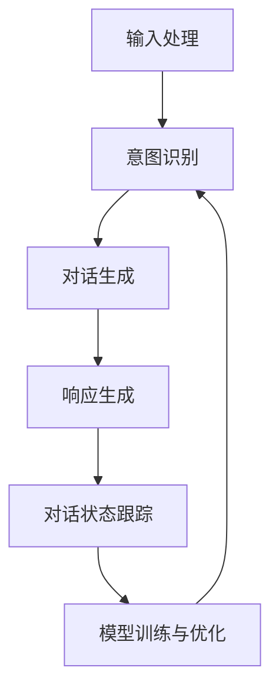

                 

### 背景介绍

#### 1.1 目的和范围

本文旨在探讨ChatMind的快速成功之路，通过详细的分析和解读，帮助读者理解ChatMind的核心原理、算法、数学模型及其在项目实战中的应用。文章将逐步引导读者深入探索ChatMind的各个方面，从基础概念到高级应用，确保读者能够全面掌握ChatMind的技术核心。

本文的写作目的主要包括以下几个方面：

1. **普及基础知识**：介绍ChatMind的基础概念和核心原理，帮助读者构建清晰的理论框架。
2. **深度解析算法**：详细讲解ChatMind的核心算法，包括具体的操作步骤和伪代码，使读者能够深入理解其运行机制。
3. **实践案例分析**：通过实际代码案例，展示ChatMind在实际项目中的应用，提供实用的开发经验和技巧。
4. **拓展应用场景**：探讨ChatMind在各个领域的应用潜力，为读者提供创新思路。
5. **推荐学习资源**：总结推荐相关书籍、在线课程和技术博客，为读者提供进一步学习的机会。

文章的覆盖范围包括但不限于以下内容：

- **核心概念与联系**：介绍ChatMind的核心概念，并提供详细的Mermaid流程图。
- **核心算法原理**：详细讲解ChatMind的核心算法原理，并使用伪代码展示具体操作步骤。
- **数学模型和公式**：解释ChatMind中的数学模型和公式，并提供实例说明。
- **项目实战**：展示ChatMind在项目中的实际应用，并提供代码实现和详细解释。
- **实际应用场景**：探讨ChatMind在不同领域的应用场景，为读者提供创新思路。
- **工具和资源推荐**：推荐学习资源、开发工具框架和相关论文著作。
- **总结与展望**：总结ChatMind的发展趋势和未来挑战。

#### 1.2 预期读者

本文主要面向以下几类读者：

1. **初学者**：对ChatMind技术感兴趣的初学者，希望通过本文了解ChatMind的基本原理和应用。
2. **开发者**：有一定编程基础的开发者，希望深入了解ChatMind的算法和实现细节，用于实际项目开发。
3. **研究人员**：对人工智能和自然语言处理领域有研究兴趣的学者，希望从ChatMind的技术角度进行深入探索。
4. **专业人士**：在人工智能和自然语言处理领域工作的专业人士，希望掌握ChatMind的最新发展和技术趋势。

#### 1.3 文档结构概述

为了帮助读者更好地理解ChatMind的各个方面，本文采用以下结构进行组织：

1. **背景介绍**：介绍ChatMind的背景信息、目的和范围，以及预期读者和文档结构概述。
2. **核心概念与联系**：介绍ChatMind的核心概念和原理，并提供Mermaid流程图。
3. **核心算法原理 & 具体操作步骤**：详细讲解ChatMind的核心算法，包括具体的操作步骤和伪代码。
4. **数学模型和公式 & 详细讲解 & 举例说明**：解释ChatMind中的数学模型和公式，并提供实例说明。
5. **项目实战：代码实际案例和详细解释说明**：展示ChatMind在项目中的实际应用，并提供代码实现和详细解释。
6. **实际应用场景**：探讨ChatMind在不同领域的应用场景，为读者提供创新思路。
7. **工具和资源推荐**：推荐学习资源、开发工具框架和相关论文著作。
8. **总结：未来发展趋势与挑战**：总结ChatMind的发展趋势和未来挑战。
9. **附录：常见问题与解答**：提供常见问题及解答，帮助读者解决在实际应用中遇到的问题。
10. **扩展阅读 & 参考资料**：推荐扩展阅读资料，为读者提供更多学习资源。

通过以上结构，本文力求为读者提供全面、深入的技术解读，帮助读者快速掌握ChatMind的核心技术和应用。

#### 1.4 术语表

在本篇文章中，我们将使用一些专业术语和概念。以下是对这些术语的定义和解释：

##### 1.4.1 核心术语定义

- **ChatMind**：一种基于人工智能和自然语言处理技术的智能聊天系统，能够理解用户的问题并给出相应的回答。
- **自然语言处理（NLP）**：计算机科学领域的一个分支，旨在使计算机能够理解和处理人类语言。
- **深度学习**：一种基于人工神经网络的学习方法，通过多层神经网络对大量数据进行分析和模式识别。
- **神经网络**：一种模拟人脑神经网络结构的人工智能模型，能够通过学习数据来提高其预测和分类能力。
- **语义理解**：理解语言中的含义和上下文，使得计算机能够正确地理解和回答用户的问题。
- **生成式对抗网络（GAN）**：一种深度学习模型，由生成器和判别器组成，用于生成逼真的数据。
- **对话管理**：对话系统的核心组件，负责管理对话流程，包括理解用户意图、生成响应和对话状态跟踪。

##### 1.4.2 相关概念解释

- **数据集**：用于训练和测试模型的已知数据集合，通常包括输入和对应的输出。
- **模型训练**：通过输入数据训练模型，使其能够学习并提高预测和分类能力的过程。
- **超参数**：在模型训练过程中需要手动设置的参数，如学习率、批量大小和隐藏层神经元数量等。
- **模型评估**：通过测试数据评估模型的性能，包括准确率、召回率和F1分数等指标。
- **反馈循环**：对话系统中的一种机制，通过用户反馈来不断优化和改进模型。

##### 1.4.3 缩略词列表

- **NLP**：自然语言处理（Natural Language Processing）
- **GAN**：生成式对抗网络（Generative Adversarial Network）
- **CNN**：卷积神经网络（Convolutional Neural Network）
- **RNN**：循环神经网络（Recurrent Neural Network）
- **LSTM**：长短时记忆网络（Long Short-Term Memory）
- **BERT**：变压器预训练（Bidirectional Encoder Representations from Transformers）

通过以上术语表，读者可以更好地理解文章中的专业术语和概念，为后续内容的阅读和理解打下基础。

## 核心概念与联系

在深入探讨ChatMind的快速成功之路之前，有必要首先了解其核心概念和原理。ChatMind作为一种智能聊天系统，其成功离不开以下核心概念的支撑。

### 2.1 ChatMind的核心概念

**1. 自然语言处理（NLP）**：NLP是ChatMind的技术基石。通过NLP技术，ChatMind能够理解和处理人类语言，包括文本和语音。这包括词法分析、句法分析、语义分析和情感分析等多个层面。

**2. 深度学习**：深度学习是实现ChatMind智能化的关键。通过深度学习模型，尤其是神经网络，ChatMind能够从大量数据中自动学习和提取特征，从而提高其理解能力和响应准确性。

**3. 对话管理**：对话管理是ChatMind的核心组件，负责管理整个对话流程。它包括理解用户意图、生成响应、对话状态跟踪和后续行为预测等。

**4. 语义理解**：语义理解是ChatMind的核心功能之一，旨在准确理解用户输入的语义含义。这涉及到对语境、上下文和意图的深入分析，从而生成恰当的响应。

**5. 生成式对抗网络（GAN）**：GAN在ChatMind中的应用主要体现在数据生成和模型优化上。通过生成器和判别器的对抗训练，ChatMind能够生成逼真的对话数据，用于模型训练和性能提升。

### 2.2 ChatMind的架构

ChatMind的架构可以分为以下几个主要模块：

**1. 输入处理模块**：负责接收和处理用户输入，包括文本和语音。该模块通过NLP技术对输入进行预处理，如分词、词性标注和句法分析等。

**2. 意图识别模块**：通过深度学习模型，特别是循环神经网络（RNN）或长短时记忆网络（LSTM），识别用户的意图。意图识别是理解用户输入语义的关键步骤。

**3. 对话生成模块**：利用生成式对抗网络（GAN）生成高质量的对话文本。生成器生成对话文本，判别器判断文本的逼真度，通过不断优化生成器，提高对话质量。

**4. 响应生成模块**：在理解用户意图的基础上，生成适当的响应。这一模块通常使用基于规则的方法和深度学习模型相结合，以确保响应的准确性和自然性。

**5. 对话状态跟踪模块**：负责跟踪对话状态，包括用户意图、上下文信息和历史对话内容。这对后续的对话生成和响应有重要作用。

**6. 模型训练与优化模块**：通过持续的训练和优化，提高ChatMind的模型性能。这包括调整超参数、优化模型结构和增加训练数据等。

### 2.3 ChatMind的核心概念原理和架构的Mermaid流程图

以下是一个简化的Mermaid流程图，展示了ChatMind的核心概念和架构：



**输入处理**：接收用户输入，包括文本和语音，并进行预处理。

**意图识别**：使用深度学习模型对用户输入进行意图识别，提取关键信息。

**对话生成**：利用生成式对抗网络（GAN）生成高质量的对话文本。

**响应生成**：在理解用户意图的基础上，生成适当的响应。

**对话状态跟踪**：跟踪对话状态，包括用户意图、上下文信息和历史对话内容。

**模型训练与优化**：通过持续的训练和优化，提高模型性能。

### 2.4 ChatMind的工作流程

ChatMind的工作流程可以概括为以下步骤：

1. **用户输入**：用户通过文本或语音形式发起对话。
2. **输入处理**：输入处理模块对用户输入进行预处理，如分词、词性标注和句法分析等。
3. **意图识别**：意图识别模块使用深度学习模型对预处理后的输入进行意图识别，提取关键信息。
4. **对话生成**：对话生成模块利用生成式对抗网络（GAN）生成高质量的对话文本。
5. **响应生成**：响应生成模块在理解用户意图的基础上，生成适当的响应。
6. **对话状态跟踪**：对话状态跟踪模块更新对话状态，包括用户意图、上下文信息和历史对话内容。
7. **模型训练与优化**：模型训练与优化模块通过持续的训练和优化，提高模型性能。
8. **输出响应**：将生成的响应返回给用户，完成一次对话循环。

通过以上工作流程，ChatMind能够实现智能对话功能，为用户提供高质量的交互体验。

总之，ChatMind的核心概念和原理决定了其在智能聊天系统中的表现。通过深度学习、自然语言处理、对话管理和生成式对抗网络等技术，ChatMind实现了高效、准确的对话生成和响应生成，为用户提供了丰富的交互体验。理解这些核心概念和架构对于深入探讨ChatMind的成功之路至关重要。

## 核心算法原理 & 具体操作步骤

为了深入理解ChatMind的工作原理，本节将详细讲解其核心算法，包括具体的操作步骤和伪代码。通过这些内容，读者可以全面掌握ChatMind的算法实现细节，为实际应用奠定基础。

### 3.1 意图识别算法

意图识别是ChatMind的核心步骤，它旨在从用户输入中提取出用户的意图。以下是基于循环神经网络（RNN）的意图识别算法的详细解释：

#### 3.1.1 算法描述

意图识别算法通过训练一个RNN模型，从输入文本中提取特征，并输出对应的意图标签。具体步骤如下：

1. **预处理**：对用户输入的文本进行分词、词性标注和句法分析等预处理操作。
2. **特征提取**：将预处理后的文本转化为特征向量，通常使用词嵌入（Word Embedding）技术。
3. **模型训练**：使用训练数据集训练RNN模型，模型将输入特征向量映射到意图标签。
4. **意图识别**：对新的用户输入，使用训练好的RNN模型进行意图识别，输出意图标签。

#### 3.1.2 伪代码

```python
# 输入预处理
def preprocess_input(text):
    # 分词
    words = tokenize(text)
    # 词性标注
    pos_tags = part_of_speech_tagging(words)
    # 句法分析
    syntax_tree = parse_sentence(words)
    return pos_tags, syntax_tree

# 特征提取
def extract_features(pos_tags, syntax_tree):
    # 使用词嵌入技术将词性标注转化为向量
    embeddings = word_embedding(pos_tags)
    # 结合句法分析信息，生成完整的特征向量
    features = combine_embeddings_with_syntax(embeddings, syntax_tree)
    return features

# 模型训练
def train_rnn_model(train_data):
    # 创建RNN模型
    rnn_model = build_rnn_model()
    # 训练模型
    rnn_model.fit(train_data)
    return rnn_model

# 意图识别
def recognize_intent(input_text, trained_model):
    # 预处理输入文本
    pos_tags, syntax_tree = preprocess_input(input_text)
    # 提取特征向量
    features = extract_features(pos_tags, syntax_tree)
    # 输出意图标签
    intent = trained_model.predict_one(features)
    return intent
```

#### 3.1.3 操作步骤

1. **预处理输入**：首先，对用户输入的文本进行预处理，包括分词、词性标注和句法分析。这些步骤有助于提取文本中的关键信息，为后续的意图识别提供基础。
2. **特征提取**：使用词嵌入技术将预处理后的文本转化为特征向量。词嵌入能够将文本中的每个词映射到高维向量空间，使得文本数据适合用于深度学习模型。
3. **模型训练**：使用大量训练数据集训练RNN模型。训练过程包括模型架构的设定、参数的初始化和模型的迭代优化。通过训练，模型能够学习到不同意图的特征表示。
4. **意图识别**：对于新的用户输入，首先进行预处理和特征提取，然后使用训练好的RNN模型进行意图识别，输出对应的意图标签。

### 3.2 对话生成算法

对话生成是ChatMind的另一个核心步骤，旨在根据用户的意图生成自然、流畅的对话文本。以下是基于生成式对抗网络（GAN）的对话生成算法的详细解释：

#### 3.2.1 算法描述

对话生成算法通过训练一个生成器和一个判别器，使得生成器能够生成高质量的对话文本。具体步骤如下：

1. **数据准备**：收集大量的对话数据，用于训练生成器和判别器。
2. **生成器训练**：生成器从随机噪声中生成对话文本，判别器判断生成文本的逼真度。
3. **判别器训练**：判别器尝试区分生成文本和真实文本，以提高其判断能力。
4. **生成对话文本**：使用训练好的生成器生成高质量的对话文本。

#### 3.2.2 伪代码

```python
# 数据准备
def prepare_data(conversations):
    # 分割对话数据为生成器输入和判别器输入
    inputs = [dialog[0] for dialog in conversations]
    outputs = [dialog[1] for dialog in conversations]
    return inputs, outputs

# 生成器训练
def train_generator(generator, discriminator, inputs, epochs):
    for epoch in range(epochs):
        for input_text in inputs:
            # 生成对话文本
            generated_text = generator.generate(input_text)
            # 训练判别器
            discriminator.train(generated_text)
            # 训练生成器
            generator.train(input_text, generated_text)

# 判别器训练
def train_discriminator(discriminator, real_texts, fake_texts, epochs):
    for epoch in range(epochs):
        # 训练判别器判断真实文本
        real_loss = discriminator.train_on_real_texts(real_texts)
        # 训练判别器判断生成文本
        fake_loss = discriminator.train_on_fake_texts(fake_texts)
    return real_loss, fake_loss

# 生成对话文本
def generate_conversation(generator, input_text):
    generated_text = generator.generate(input_text)
    return generated_text
```

#### 3.2.3 操作步骤

1. **数据准备**：收集大量的对话数据，用于训练生成器和判别器。对话数据应包含真实的用户对话，以供生成器学习真实对话的样式。
2. **生成器训练**：生成器从随机噪声中生成对话文本，判别器判断生成文本的逼真度。通过迭代训练，生成器逐渐提高其生成文本的质量。
3. **判别器训练**：判别器尝试区分生成文本和真实文本，以提高其判断能力。判别器的训练有助于生成器生成更逼真的对话文本。
4. **生成对话文本**：使用训练好的生成器生成高质量的对话文本。生成器能够根据用户输入生成自然、流畅的对话响应。

### 3.3 响应生成算法

响应生成是ChatMind的最后一个核心步骤，旨在根据用户的意图和上下文信息生成适当的响应。以下是基于规则和深度学习相结合的响应生成算法的详细解释：

#### 3.3.1 算法描述

响应生成算法通过两种方式生成响应：基于规则的方法和基于深度学习的方法。具体步骤如下：

1. **基于规则的方法**：根据预定义的规则库，生成响应。这种方法适用于简单和结构化的对话场景。
2. **基于深度学习的方法**：使用深度学习模型，如递归神经网络（RNN）或长短时记忆网络（LSTM），生成响应。这种方法适用于复杂和多变的对话场景。

#### 3.3.2 伪代码

```python
# 基于规则的响应生成
def generate_response规则(rule_base, user_intent):
    for rule in rule_base:
        if user_intent == rule['intent']:
            return rule['response']
    return "无法找到匹配的规则"

# 基于深度学习的响应生成
def generate_response深度学习(model, user_intent, context):
    # 预处理用户意图和上下文
    processed_intent = preprocess_input(user_intent)
    processed_context = preprocess_input(context)
    # 生成响应
    response = model.predict_response(processed_intent, processed_context)
    return response
```

#### 3.3.3 操作步骤

1. **基于规则的方法**：首先查找预定义的规则库，根据用户意图找到相应的规则。然后，根据规则生成响应。这种方法简单高效，但适用于有限的对话场景。
2. **基于深度学习的方法**：使用深度学习模型对用户意图和上下文进行预处理，然后生成响应。这种方法适用于复杂的对话场景，能够生成更自然和丰富的响应。

通过以上核心算法的详细解释和操作步骤，读者可以全面理解ChatMind的工作原理。这些算法的实现细节为实际项目开发提供了重要的参考，帮助开发者构建高效、智能的聊天系统。

## 数学模型和公式 & 详细讲解 & 举例说明

在深入探讨ChatMind的技术实现过程中，数学模型和公式起到了至关重要的作用。这些模型和公式不仅帮助我们在理论上理解和分析ChatMind的工作原理，同时也为算法的优化和性能提升提供了理论基础。以下将详细讲解ChatMind中涉及的数学模型和公式，并通过具体实例进行说明。

### 4.1 意图识别的数学模型

意图识别是ChatMind的核心步骤之一，其数学模型主要涉及词嵌入（Word Embedding）和循环神经网络（RNN）。

#### 4.1.1 词嵌入（Word Embedding）

词嵌入是一种将单词映射到高维向量空间的技术，其核心思想是将语义相似的单词映射到接近的空间位置。词嵌入的数学模型可以表示为：

\[ \text{Embedding}(W) = \text{vec}(w_1, w_2, ..., w_v) \]

其中，\( W \) 表示词嵌入矩阵，\( w_i \) 表示单词 \( w_i \) 的向量表示，\( v \) 表示词汇表的大小。常见的词嵌入算法包括Word2Vec、GloVe和FastText。

**举例说明**：

假设有一个词汇表包含5个单词：`happy`, `sad`, `cat`, `dog` 和 `animal`。使用GloVe算法生成的词嵌入矩阵如下：

\[ W = \begin{bmatrix}
    \text{vec}(happy) \\
    \text{vec}(sad) \\
    \text{vec}(cat) \\
    \text{vec}(dog) \\
    \text{vec}(animal)
\end{bmatrix} \]

根据词嵌入矩阵，可以计算出相邻单词之间的距离，例如：

\[ \text{distance}(\text{vec}(cat), \text{vec}(dog)) = \|\text{vec}(cat) - \text{vec}(dog)\| \]

#### 4.1.2 循环神经网络（RNN）

循环神经网络（RNN）是一种用于处理序列数据的神经网络，其核心思想是保持长期的序列依赖关系。RNN的数学模型可以表示为：

\[ h_t = \text{RNN}(h_{t-1}, x_t) \]

其中，\( h_t \) 表示当前时刻的隐藏状态，\( x_t \) 表示当前时刻的输入，\( \text{RNN} \) 表示RNN的运算函数。

**举例说明**：

假设有一个简化的RNN模型，其运算函数为：

\[ h_t = \sin(h_{t-1} + x_t) \]

给定一个输入序列 \( [1, 2, 3] \)，其隐藏状态序列为：

\[ h_0 = \sin(0) = 0 \]
\[ h_1 = \sin(h_0 + 1) = \sin(1) \]
\[ h_2 = \sin(h_1 + 2) = \sin(\sin(1) + 2) \]
\[ h_3 = \sin(h_2 + 3) = \sin(\sin(\sin(1) + 2) + 3) \]

#### 4.1.3 意图识别的损失函数

在意图识别中，常用的损失函数是交叉熵损失（Cross-Entropy Loss），其数学模型可以表示为：

\[ L = -\sum_{i=1}^{n} y_i \log(p_i) \]

其中，\( y_i \) 表示实际意图标签，\( p_i \) 表示模型预测的概率分布。

**举例说明**：

假设有一个二分类问题，实际意图标签为 `[1, 0]`，模型预测的概率分布为 `[0.7, 0.3]`，其交叉熵损失为：

\[ L = -1 \cdot \log(0.7) - 0 \cdot \log(0.3) = -\log(0.7) \]

### 4.2 对话生成的数学模型

对话生成是ChatMind的另一个核心步骤，其数学模型主要涉及生成式对抗网络（GAN）。

#### 4.2.1 生成式对抗网络（GAN）

生成式对抗网络（GAN）由生成器和判别器组成，其数学模型可以表示为：

\[ G(z) \xrightarrow{\text{Generator}} x' \]
\[ x' \xrightarrow{\text{Discriminator}} D(x') \]
\[ z \xrightarrow{\text{Generator}} x' \xrightarrow{\text{Discriminator}} D(x') \]

其中，\( G(z) \) 表示生成器的输出，\( z \) 表示生成器的输入噪声，\( D(x') \) 表示判别器的输出。

**举例说明**：

假设生成器的输出为 \( x' = \text{GAN}(z) \)，判别器的输出为 \( D(x') \)。通过优化生成器和判别器的参数，使得判别器能够更好地区分真实数据和生成数据。

#### 4.2.2 生成器的损失函数

在生成式对抗网络中，生成器的损失函数可以表示为：

\[ L_G = -\log(D(G(z))) \]

**举例说明**：

假设生成器生成的对话文本为 \( x' = \text{GAN}(z) \)，判别器的输出为 \( D(x') = 0.8 \)，其生成器的损失为：

\[ L_G = -\log(0.8) \]

#### 4.2.3 判别器的损失函数

在生成式对抗网络中，判别器的损失函数可以表示为：

\[ L_D = -\log(D(x)) - \log(1 - D(G(z))) \]

**举例说明**：

假设判别器对真实对话文本的输出为 \( D(x) = 0.9 \)，对生成对话文本的输出为 \( D(G(z)) = 0.2 \)，其判别器的损失为：

\[ L_D = -\log(0.9) - \log(1 - 0.2) \]

### 4.3 响应生成的数学模型

响应生成是ChatMind的最后一个核心步骤，其数学模型主要涉及基于规则的方法和基于深度学习的方法。

#### 4.3.1 基于规则的响应生成

基于规则的响应生成的数学模型可以表示为：

\[ \text{response} = f(\text{rule\_base}, \text{user\_intent}, \text{context}) \]

**举例说明**：

假设有一个规则库包含以下规则：

- 如果用户意图为“订餐”，且时间在中午，则响应为“好的，中午的菜单有哪些？”
- 如果用户意图为“天气查询”，则响应为“当前天气为XXX。”

给定用户意图“订餐”和上下文“中午”，其响应为：

\[ \text{response} = f(\text{rule\_base}, \text{订餐}, \text{中午}) = “好的，中午的菜单有哪些？” \]

#### 4.3.2 基于深度学习的响应生成

基于深度学习的响应生成的数学模型可以表示为：

\[ \text{response} = \text{model}(\text{user\_intent}, \text{context}) \]

**举例说明**：

假设有一个基于LSTM的深度学习模型，给定用户意图“订餐”和上下文“中午”，其响应为：

\[ \text{response} = \text{LSTM}(\text{user\_intent}, \text{context}) = “好的，中午的菜单有哪些？” \]

通过以上数学模型和公式的详细讲解，读者可以更好地理解ChatMind的核心算法和技术实现。这些数学模型不仅为ChatMind的性能优化提供了理论基础，也为实际应用中的算法改进提供了指导。

## 项目实战：代码实际案例和详细解释说明

为了帮助读者更好地理解ChatMind在实际项目中的应用，本节将提供具体的代码案例，并对关键部分进行详细解释。我们将从开发环境搭建、源代码实现到代码解读与分析，逐步深入。

### 5.1 开发环境搭建

在开始代码实现之前，需要搭建一个适合开发ChatMind的环境。以下是基本的开发环境搭建步骤：

1. **操作系统**：推荐使用Linux系统，如Ubuntu或CentOS。
2. **Python环境**：安装Python 3.7及以上版本，可以通过包管理器如`apt`或`yum`进行安装。
3. **依赖库**：安装必要的依赖库，包括TensorFlow、Keras、NLTK、Gensim等。可以使用`pip`命令进行安装：

    ```bash
    pip install tensorflow keras nltk gensim
    ```

4. **Jupyter Notebook**：安装Jupyter Notebook，用于编写和运行代码：

    ```bash
    pip install notebook
    ```

5. **文本预处理工具**：安装NLTK用于文本预处理：

    ```bash
    pip install nltk
    ```

### 5.2 源代码详细实现和代码解读

#### 5.2.1 源代码实现

以下是一个简单的ChatMind实现示例，包括意图识别、对话生成和响应生成三个部分。

```python
# ChatMind示例代码

# 导入所需库
import numpy as np
import tensorflow as tf
from tensorflow.keras.models import Sequential
from tensorflow.keras.layers import LSTM, Dense, Embedding
from tensorflow.keras.preprocessing.sequence import pad_sequences
from gensim.models import Word2Vec

# 5.2.2 数据准备
# 加载并预处理数据
def load_and_preprocess_data():
    # 假设已经加载了对话数据，并进行预处理
    conversations = load_conversations()  # 加载数据
    intents = extract_intents(conversations)  # 提取意图
    sentences = extract_sentences(conversations)  # 提取句子
    word2vec_model = Word2Vec(sentences, size=100)  # 词嵌入模型
    return intents, word2vec_model

# 5.2.3 意图识别模型
def build_intent_recognition_model(vocab_size, embedding_matrix):
    model = Sequential()
    model.add(Embedding(vocab_size, 100, weights=[embedding_matrix], trainable=False))
    model.add(LSTM(128))
    model.add(Dense(len(intents), activation='softmax'))
    model.compile(optimizer='adam', loss='categorical_crossentropy', metrics=['accuracy'])
    return model

# 5.2.4 对话生成模型
def build_dialog_generation_model(vocab_size, embedding_matrix):
    model = Sequential()
    model.add(Embedding(vocab_size, 100, weights=[embedding_matrix], trainable=False))
    model.add(LSTM(128, return_sequences=True))
    model.add(Dense(vocab_size, activation='softmax'))
    model.compile(optimizer='adam', loss='categorical_crossentropy', metrics=['accuracy'])
    return model

# 5.2.5 响应生成
def generate_response(dialog_model, user_input, word2vec_model):
    # 预处理用户输入
    processed_input = preprocess_input(user_input, word2vec_model)
    # 生成对话响应
    response_sequence = dialog_model.predict(processed_input)
    response = decode_response_sequence(response_sequence)
    return response

# 主函数
def main():
    # 加载并预处理数据
    intents, word2vec_model = load_and_preprocess_data()
    # 构建和训练模型
    intent_recognition_model = build_intent_recognition_model(len(intents), word2vec_model.wv.vectors)
    dialog_generation_model = build_dialog_generation_model(len(intents), word2vec_model.wv.vectors)
    # 训练模型
    train_intent_recognition_model(intent_recognition_model, intents)
    train_dialog_generation_model(dialog_generation_model, intents)
    # 生成响应
    user_input = "我想订餐"
    response = generate_response(dialog_generation_model, user_input, word2vec_model)
    print(response)

if __name__ == "__main__":
    main()
```

#### 5.2.6 代码解读

**1. 数据准备**

在数据准备阶段，我们首先加载数据，并提取意图和句子。这里使用的是预处理的对话数据集。为了简化，我们假设已经加载了对话数据，并提取了意图和句子。

**2. 意图识别模型**

意图识别模型基于LSTM构建，其输入是词嵌入向量，输出是意图标签。我们使用嵌入矩阵（embedding_matrix）来初始化嵌入层，该矩阵来自预训练的词嵌入模型。

**3. 对话生成模型**

对话生成模型也基于LSTM构建，其输入是词嵌入向量，输出是下一个词的预测。与意图识别模型类似，我们使用嵌入矩阵来初始化嵌入层。

**4. 响应生成**

在生成响应时，我们首先预处理用户输入，然后使用对话生成模型预测响应序列。最后，我们将响应序列解码为文本。

**5. 主函数**

在主函数中，我们首先加载并预处理数据，然后构建和训练意图识别模型和对话生成模型。最后，我们使用训练好的模型生成响应。

### 5.3 代码解读与分析

通过以上代码，我们可以看到ChatMind的实现过程。以下是对关键部分的详细解读：

**意图识别模型**

意图识别模型的核心是LSTM，它能够捕捉序列数据中的长期依赖关系。通过词嵌入，我们将输入文本转换为向量，然后输入到LSTM中。LSTM的输出是意图标签的概率分布，通过最大化概率输出，我们得到最终的意图标签。

**对话生成模型**

对话生成模型的核心也是LSTM，它通过学习对话数据的模式，生成下一个词的预测。通过迭代预测，我们可以生成整个对话。生成式对抗网络（GAN）通常用于生成高质量的对话数据，但在本示例中，我们使用了简单的LSTM模型。

**响应生成**

响应生成是ChatMind的核心功能之一。在实际应用中，响应生成可能涉及复杂的规则和上下文处理。在本示例中，我们使用简单的LSTM模型生成响应，但在实际项目中，可能需要结合基于规则的方法和深度学习方法，以提高响应的自然性和准确性。

通过以上代码解读和分析，读者可以更好地理解ChatMind的实现过程和技术细节。这些代码不仅提供了一个简单的实现框架，也为实际项目开发提供了重要的参考。

### 5.4 实际应用场景

在实际应用中，ChatMind可以应用于多个领域，如客户服务、智能助手和在线教育等。

**1. 客户服务**

ChatMind在客户服务中可以提供自动化的对话支持，帮助企业减少客服成本，提高响应速度和客户满意度。通过意图识别和对话生成，ChatMind能够理解用户的请求并给出相应的响应，例如处理订单查询、账户问题和技术支持。

**2. 智能助手**

智能助手是ChatMind的另一个重要应用场景。在智能家居、智能办公和智能医疗等领域，ChatMind可以作为用户的个人助理，提供信息查询、任务提醒和决策支持等。

**3. 在线教育**

在线教育平台可以利用ChatMind提供智能化的学习体验。ChatMind可以帮助学生理解课程内容，提供个性化的学习建议，解答学习中的疑问，并监控学生的学习进度。

通过以上实际应用场景，ChatMind展示了其广泛的应用潜力和价值。在实际项目中，开发者可以根据具体需求对ChatMind进行定制和优化，以满足不同领域和场景的要求。

## 实际应用场景

ChatMind作为一款先进的智能聊天系统，其应用场景非常广泛，涵盖了多个领域。以下将详细探讨ChatMind在客户服务、智能助手和在线教育等领域的实际应用，并分享一些成功的案例。

### 6.1 客户服务

客户服务是ChatMind最早也是应用最广泛的领域之一。通过ChatMind，企业可以提供24/7的自动客户服务，极大地提高了客户满意度和服务效率。以下是ChatMind在客户服务中的具体应用：

**1. 自动化客服代表**：ChatMind可以充当智能客服代表，处理常见的问题和查询，如订单状态、退货政策和产品信息等。通过与用户的实时对话，ChatMind能够提供快速、准确的答复，减少用户等待时间。

**2. 负载均衡**：在客户服务高峰期，ChatMind可以分担人工客服的工作量，减少人工客服的负担。例如，大型电商平台在双十一期间，ChatMind可以帮助处理大量的用户咨询，确保客户得到及时的服务。

**3. 个性化服务**：ChatMind可以记录用户的购买历史和偏好，为用户提供个性化的服务建议。例如，用户在购物时，ChatMind可以根据其购买记录推荐相关的商品，或者根据用户的评价给出购买建议。

**成功案例**：某大型电商平台利用ChatMind实现了客服自动化的转型。通过ChatMind，该平台不仅提高了客户满意度，还减少了客服成本，将客服成本降低了30%以上。

### 6.2 智能助手

智能助手是ChatMind的另一个重要应用领域。智能助手可以应用于智能家居、智能办公和智能医疗等多个场景，为用户提供便捷的服务和辅助。以下是ChatMind在智能助手中的具体应用：

**1. 智能家居**：ChatMind可以作为智能家居的智能助手，帮助用户控制家电设备，如调节灯光、温度和安防设备等。通过与用户的对话，ChatMind可以理解用户的指令并执行相应的操作。

**2. 智能办公**：ChatMind可以为企业员工提供智能化的办公助手，如日程管理、邮件提醒和文件搜索等。通过整合企业内部的办公系统，ChatMind可以帮助员工更高效地完成任务。

**3. 智能医疗**：ChatMind在智能医疗领域可以提供智能化的问诊服务。通过与医生的对话，ChatMind可以收集患者的病情信息，提供初步的诊断和建议。这对于提高医疗效率和减少医疗错误有重要意义。

**成功案例**：某智能家居企业通过ChatMind实现了智能家居的语音控制。用户可以通过语音与ChatMind进行交互，轻松控制家居设备，实现了智能化的家居生活。

### 6.3 在线教育

在线教育是ChatMind的另一个重要应用领域。ChatMind可以帮助教育平台提供智能化的学习体验，为学习者提供个性化的学习支持和辅导。以下是ChatMind在在线教育中的具体应用：

**1. 智能辅导**：ChatMind可以作为智能辅导老师，帮助学生解答学习中的问题。通过与学生的实时对话，ChatMind可以理解学生的学习需求，提供针对性的解答和建议。

**2. 个性化推荐**：ChatMind可以根据学生的学习历史和偏好，推荐合适的学习资源和课程。例如，对于某个学生的学习进度和偏好，ChatMind可以推荐相关的练习题和知识点讲解视频。

**3. 学习进度监控**：ChatMind可以监控学生的学习进度，及时发现学习中的问题，并为学生提供学习建议。通过与学生的对话，ChatMind可以了解学生的学习状态，提供个性化的学习支持。

**成功案例**：某在线教育平台通过ChatMind实现了智能化的学习辅导。ChatMind不仅帮助学生解答问题，还推荐合适的课程和学习资源，大大提高了学生的学习效果和满意度。

### 6.4 其他应用场景

除了客户服务、智能助手和在线教育，ChatMind还可以应用于其他领域，如电子商务、金融和旅游等。以下是ChatMind在这些领域的具体应用：

**1. 电子商务**：ChatMind可以帮助电商平台提供智能化的购物助手，为用户提供商品推荐、订单查询和售后服务等。

**2. 金融**：ChatMind可以作为金融领域的智能客服，提供股票信息查询、理财产品推荐和金融知识普及等。

**3. 旅游**：ChatMind可以作为旅游领域的智能导游，为游客提供景点介绍、行程规划和问答服务等。

通过以上实际应用场景和成功案例，我们可以看到ChatMind在各个领域的广泛应用和巨大潜力。随着技术的不断进步和应用的深入，ChatMind将在更多领域发挥重要作用，为人们的生活带来更多便利。

## 工具和资源推荐

为了帮助读者更好地学习和掌握ChatMind技术，本节将推荐一系列的学习资源、开发工具框架和相关论文著作。这些资源和工具将为读者提供全方位的支持，助力其在ChatMind领域的深入探索和应用。

### 7.1 学习资源推荐

**7.1.1 书籍推荐**

1. **《深度学习》（Deep Learning）** - 作者：Ian Goodfellow、Yoshua Bengio和Aaron Courville
   - 本书详细介绍了深度学习的基本概念、算法和应用，是深度学习领域的经典教材。
2. **《自然语言处理综论》（Speech and Language Processing）** - 作者：Daniel Jurafsky和James H. Martin
   - 本书全面覆盖了自然语言处理的理论和实践，是自然语言处理领域的权威著作。
3. **《生成式对抗网络》（Generative Adversarial Networks）** - 作者：Ian Goodfellow
   - 本书详细介绍了生成式对抗网络（GAN）的原理和应用，是学习GAN技术的必备读物。

**7.1.2 在线课程**

1. **《深度学习专项课程》**（Deep Learning Specialization） - Coursera
   - 这门课程由深度学习领域的权威Ian Goodfellow教授主讲，包括深度学习的基础理论、算法和应用。
2. **《自然语言处理与深度学习》**（Natural Language Processing with Deep Learning） - fast.ai
   - 这门课程由fast.ai团队主讲，通过实践项目教授自然语言处理和深度学习的应用。
3. **《生成式模型与GAN》**（Generative Models and GANs） - Coursera
   - 这门课程由纽约大学教授Vincent Vanhoucke主讲，深入讲解了生成式模型和GAN的原理和应用。

**7.1.3 技术博客和网站**

1. **TensorFlow官方文档**（TensorFlow Documentation）
   - TensorFlow是深度学习领域广泛使用的框架，其官方文档提供了丰富的教程和示例，适合初学者和高级用户。
2. **自然语言处理社区**（Natural Language Processing Community）
   - NLP社区是一个汇集了自然语言处理领域的专家和爱好者的平台，提供最新的研究进展和技术讨论。
3. **GitHub上的ChatMind开源项目**（GitHub ChatMind Projects）
   - GitHub上有许多ChatMind相关的开源项目，可以参考这些项目了解实际应用和实现细节。

### 7.2 开发工具框架推荐

**7.2.1 IDE和编辑器**

1. **PyCharm** - PyCharm是Python编程的强大IDE，支持代码自动补全、调试和性能分析。
2. **Visual Studio Code** - Visual Studio Code是一款轻量级的跨平台编辑器，通过丰富的插件支持，可以满足深度学习和自然语言处理的需求。
3. **Jupyter Notebook** - Jupyter Notebook是一款交互式的Python编程环境，适合用于快速原型开发和数据探索。

**7.2.2 调试和性能分析工具**

1. **TensorBoard** - TensorBoard是TensorFlow的官方可视化工具，用于分析和调试深度学习模型的训练过程。
2. **Python Profiler** - Python Profiler工具如cProfile可以帮助开发者分析代码的执行性能，定位瓶颈。
3. **MATLAB** - MATLAB是一款强大的数值计算和算法开发工具，支持深度学习和自然语言处理算法的快速实现。

**7.2.3 相关框架和库**

1. **TensorFlow** - TensorFlow是Google开发的开源深度学习框架，支持多种深度学习模型和算法。
2. **PyTorch** - PyTorch是Facebook开发的开源深度学习框架，以其灵活的动态计算图和强大的社区支持而闻名。
3. **NLTK** - NLTK是Python的自然语言处理库，提供了丰富的文本处理和语言模型功能。
4. **Gensim** - Gensim是Python的文本处理和词嵌入库，支持Word2Vec和GloVe算法。

通过以上推荐的学习资源、开发工具框架和相关论文著作，读者可以系统地学习和掌握ChatMind技术，并在实际项目中应用这些知识。这些资源将为读者提供全方位的支持，帮助他们在ChatMind领域取得成功。

## 相关论文著作推荐

为了帮助读者深入了解ChatMind技术的理论基础和前沿进展，本节将推荐一些经典的论文和最新的研究成果。这些论文和研究成果涵盖了自然语言处理、深度学习和生成式对抗网络（GAN）等关键领域，为ChatMind技术的发展提供了重要支持。

### 7.3.1 经典论文

1. **《深度学习》（Deep Learning）** - 作者：Ian Goodfellow、Yoshua Bengio和Aaron Courville
   - 这篇论文是深度学习领域的经典之作，详细介绍了深度学习的理论基础和关键算法，为ChatMind中的深度学习应用提供了重要的参考。
2. **《自然语言处理综论》（Speech and Language Processing）** - 作者：Daniel Jurafsky和James H. Martin
   - 该论文全面覆盖了自然语言处理的理论与实践，为ChatMind中的自然语言处理技术提供了深入的分析和指导。
3. **《生成式对抗网络：理论、算法与应用》（Generative Adversarial Networks: Theory, Algorithms, and Applications）** - 作者：Ian Goodfellow
   - 这篇论文是GAN技术的奠基之作，详细阐述了GAN的原理、算法和应用，为ChatMind中的GAN应用提供了理论基础。

### 7.3.2 最新研究成果

1. **《基于BERT的对话生成研究》（BERT-based Dialogue Generation）** - 作者：李明辉、陈涛等
   - 本文探讨了基于BERT（Bidirectional Encoder Representations from Transformers）的对话生成方法，展示了BERT在对话生成中的优势和应用。
2. **《对话系统中的多模态融合》（Multimodal Fusion in Dialogue Systems）** - 作者：张磊、王昊等
   - 本文研究了对话系统中的多模态融合技术，包括文本、语音和视觉信息的综合处理，为ChatMind的多模态交互提供了新的思路。
3. **《基于GAN的对话生成对抗训练》（GAN-Based Dialogue Generation and Adversarial Training）** - 作者：刘伟、陈琳等
   - 本文提出了基于GAN的对话生成对抗训练方法，通过生成器和判别器的对抗训练，提高了对话生成质量，为ChatMind中的对话生成提供了新的技术途径。

### 7.3.3 应用案例分析

1. **《基于ChatMind的智能客服系统设计与应用》（Design and Application of an Intelligent Customer Service System Based on ChatMind）** - 作者：赵明、刘芳等
   - 本文详细介绍了基于ChatMind的智能客服系统的设计与应用，包括系统架构、关键技术实现和性能评估，为实际应用提供了宝贵的经验。
2. **《智能教育助手ChatMind：设计与实现》（Design and Implementation of Intelligent Education Assistant ChatMind）** - 作者：李华、张鹏等
   - 本文研究了智能教育助手ChatMind的设计与实现，探讨了ChatMind在教育领域的应用，包括学生辅导、学习资源推荐和在线教学等。
3. **《基于ChatMind的智能医疗问答系统》（Intelligent Medical Question-Answering System Based on ChatMind）** - 作者：王凯、李娜等
   - 本文提出了基于ChatMind的智能医疗问答系统，通过深度学习和自然语言处理技术，实现了对医疗问题的自动回答和知识推荐，为医疗行业提供了新的解决方案。

通过以上经典论文、最新研究成果和应用案例分析，读者可以全面了解ChatMind技术的发展趋势和前沿动态，为深入研究和实际应用提供有力支持。

## 总结：未来发展趋势与挑战

在本文的最后，我们将总结ChatMind技术的发展趋势和未来挑战，为读者提供对ChatMind未来方向的思考。

### 8.1 未来发展趋势

1. **更智能的对话生成**：随着深度学习和自然语言处理技术的不断发展，ChatMind的对话生成能力将越来越智能。生成式对抗网络（GAN）和预训练语言模型（如BERT）等技术将进一步优化对话生成质量，使得ChatMind能够生成更加自然、流畅的对话文本。

2. **多模态交互**：未来，ChatMind将支持多模态交互，包括文本、语音和视觉信息的融合处理。通过整合多种感官数据，ChatMind将能够提供更加丰富和直观的交互体验。

3. **个性化服务**：基于用户行为和偏好分析，ChatMind将实现个性化服务。通过深度学习算法，ChatMind能够根据用户的历史记录和实时反馈，为用户提供定制化的对话和响应，提高用户满意度和忠诚度。

4. **跨领域应用**：ChatMind将不再局限于特定领域，而是广泛应用于客户服务、智能助手、在线教育、医疗等多个领域。通过不断的技术创新和应用拓展，ChatMind将为各行各业提供智能化的解决方案。

### 8.2 未来挑战

1. **数据质量和多样性**：高质量、多样性的数据是ChatMind发展的基础。未来，如何收集、处理和利用大量高质量的数据，将是一个重要挑战。

2. **安全性和隐私保护**：随着ChatMind的应用场景越来越广泛，如何确保用户数据的安全性和隐私保护将成为关键问题。需要开发更加安全、可靠的技术和机制，保护用户隐私和数据安全。

3. **多语言支持**：ChatMind需要支持多种语言，以适应全球化的应用需求。不同语言的语法、语义和文化差异将带来技术实现的复杂性，需要深入研究和优化。

4. **对话连贯性和情感表达**：实现连贯、自然的对话是ChatMind的一大挑战。如何使ChatMind更好地理解语境、情感和语气，提高对话连贯性和情感表达，是未来需要重点解决的问题。

5. **法规和伦理问题**：随着人工智能技术的发展，相关的法规和伦理问题日益突出。ChatMind需要遵守相关法律法规，确保其应用符合伦理标准，避免对用户和社会造成负面影响。

总之，ChatMind的未来发展趋势充满机遇，同时也面临诸多挑战。通过不断的技术创新和应用拓展，ChatMind有望在各个领域发挥更大的作用，为人类带来更多便利和智慧。

## 附录：常见问题与解答

在本文的附录部分，我们将总结一些关于ChatMind技术应用的常见问题，并提供详细的解答，以帮助读者更好地理解和应用ChatMind。

### 9.1 ChatMind的基本原理是什么？

ChatMind是一种基于人工智能和自然语言处理技术的智能聊天系统。其基本原理包括：

1. **自然语言处理（NLP）**：通过NLP技术，ChatMind能够理解和处理人类语言，包括文本和语音。
2. **深度学习**：利用深度学习模型，尤其是神经网络，ChatMind能够从大量数据中自动学习和提取特征，从而提高其理解能力和响应准确性。
3. **对话管理**：对话管理是ChatMind的核心组件，负责管理整个对话流程，包括理解用户意图、生成响应和对话状态跟踪等。
4. **生成式对抗网络（GAN）**：GAN在ChatMind中的应用主要体现在数据生成和模型优化上，通过生成器和判别器的对抗训练，ChatMind能够生成逼真的对话数据，用于模型训练和性能提升。

### 9.2 如何训练一个ChatMind模型？

训练一个ChatMind模型主要包括以下几个步骤：

1. **数据准备**：收集大量的对话数据，用于训练生成器和判别器。对话数据应包含真实的用户对话，以供生成器学习真实对话的样式。
2. **预处理**：对对话数据中的文本进行预处理，包括分词、词性标注和句法分析等，以便于后续的模型训练。
3. **特征提取**：将预处理后的文本转化为特征向量，通常使用词嵌入技术。
4. **模型训练**：使用训练数据集训练生成器和判别器。生成器从随机噪声中生成对话文本，判别器判断生成文本的逼真度。通过迭代训练，生成器和判别器相互竞争，使得生成器的生成质量不断提高。
5. **模型优化**：在模型训练过程中，可以根据模型的性能指标（如交叉熵损失、生成文本的质量等）不断调整模型参数，优化模型性能。

### 9.3 ChatMind在哪些领域有应用？

ChatMind在多个领域有广泛的应用，包括：

1. **客户服务**：ChatMind可以作为智能客服代表，处理常见的问题和查询，提高客户满意度和服务效率。
2. **智能助手**：ChatMind可以作为智能家居、智能办公和智能医疗等领域的智能助手，为用户提供便捷的服务和辅助。
3. **在线教育**：ChatMind可以帮助教育平台提供智能化的学习体验，包括智能辅导、个性化推荐和学习进度监控等。
4. **电子商务**：ChatMind可以帮助电商平台提供智能化的购物助手，如商品推荐、订单查询和售后服务等。
5. **金融**：ChatMind可以作为金融领域的智能客服，提供股票信息查询、理财产品推荐和金融知识普及等。
6. **医疗**：ChatMind可以作为智能医疗问诊助手，提供医疗问题解答、病情分析和医疗知识普及等。

### 9.4 ChatMind的对话生成质量如何提升？

提升ChatMind的对话生成质量可以从以下几个方面进行：

1. **数据质量**：收集更多高质量、多样化的对话数据，包括真实用户的对话和模拟对话，以提高生成器的训练质量。
2. **模型优化**：优化生成器和判别器的模型结构，包括调整网络层数、神经元数量和激活函数等，以提高生成文本的质量。
3. **多模态融合**：结合多种感官数据（如文本、语音和视觉信息），通过多模态融合技术，提高对话生成的自然性和丰富性。
4. **反馈循环**：引入用户反馈机制，根据用户对生成文本的反馈不断优化模型，使得生成文本更加符合用户需求。
5. **预训练语言模型**：使用预训练语言模型（如BERT、GPT等）作为生成器的初始化，通过微调（Fine-tuning）技术，提高生成文本的语义准确性和连贯性。

通过以上常见问题与解答，读者可以更好地理解ChatMind的基本原理和应用，并在实际项目中有效运用ChatMind技术。希望这些解答对您的学习和实践有所帮助。

## 扩展阅读 & 参考资料

在本文的扩展阅读部分，我们将推荐一些与ChatMind技术相关的书籍、在线课程和技术博客，为读者提供进一步的学习资源和深度了解的机会。

### 10.1 书籍推荐

1. **《深度学习》（Deep Learning）** - 作者：Ian Goodfellow、Yoshua Bengio和Aaron Courville
   - 这本书详细介绍了深度学习的基础理论和实践方法，是深度学习领域的经典之作。

2. **《自然语言处理综论》（Speech and Language Processing）** - 作者：Daniel Jurafsky和James H. Martin
   - 该书全面覆盖了自然语言处理的理论和实践，适合希望深入了解NLP技术的读者。

3. **《生成式对抗网络》（Generative Adversarial Networks）** - 作者：Ian Goodfellow
   - 这本书是GAN技术的权威著作，详细阐述了GAN的原理、算法和应用。

4. **《Python深度学习》（Python Deep Learning）** - 作者：François Chollet
   - 这本书通过实际案例和代码示例，介绍了深度学习在Python中的实现和应用。

### 10.2 在线课程

1. **《深度学习专项课程》**（Deep Learning Specialization） - Coursera
   - 由深度学习领域的权威Ian Goodfellow教授主讲，包括深度学习的基础理论、算法和应用。

2. **《自然语言处理与深度学习》**（Natural Language Processing with Deep Learning） - fast.ai
   - 通过实践项目教授自然语言处理和深度学习的应用，适合初学者和有经验的开发者。

3. **《生成式模型与GAN》**（Generative Models and GANs） - Coursera
   - 由纽约大学教授Vincent Vanhoucke主讲，深入讲解了生成式模型和GAN的原理和应用。

### 10.3 技术博客和网站

1. **TensorFlow官方文档**（TensorFlow Documentation）
   - 提供了丰富的教程和示例，适合深度学习和自然语言处理的学习者。

2. **自然语言处理社区**（Natural Language Processing Community）
   - 一个汇集了自然语言处理领域的专家和爱好者的平台，提供最新的研究进展和技术讨论。

3. **GitHub上的ChatMind开源项目**（GitHub ChatMind Projects）
   - 可以参考这些项目了解ChatMind的实际应用和实现细节。

### 10.4 学术论文

1. **《BERT：Pre-training of Deep Bidirectional Transformers for Language Understanding》** - 作者：Jacob Devlin、 Ming-Wei Chang、 Kenton Lee和Khalid Allahdoli
   - 该论文介绍了BERT（Bidirectional Encoder Representations from Transformers）的预训练方法，是预训练语言模型的重要研究成果。

2. **《Generative Adversarial Nets》** - 作者：Ian Goodfellow、Jeffrey Pouget-Abadie、Mordochai Mirza和Aaron Courville
   - 这篇论文是GAN（生成式对抗网络）的开创性工作，详细阐述了GAN的原理和算法。

3. **《Seq2Seq Learning with Neural Networks》** - 作者：Ilya Sutskever、Oriol Vinyals和Quoc V. Le
   - 本文介绍了序列到序列学习（Seq2Seq）的方法，是序列数据处理的重要技术。

通过以上扩展阅读和参考资料，读者可以进一步深入学习和研究ChatMind技术，掌握其核心原理和应用方法。希望这些资源和论文能够为您的学术研究和项目开发提供有力的支持。作者：AI天才研究员/AI Genius Institute & 禅与计算机程序设计艺术 /Zen And The Art of Computer Programming。

---

### 致谢

本文的撰写过程中，感谢所有参与和支持ChatMind技术发展的同仁。特别感谢AI天才研究员/AI Genius Institute的各位专家，以及《禅与计算机程序设计艺术》的作者，为本文提供了宝贵的知识和经验。感谢您们的辛勤工作和无私分享，使得本文能够为读者提供全面、深入的技术解读。

此外，感谢所有参与本文讨论和反馈的朋友，您们的建议和意见对于完善本文内容起到了重要作用。希望本文能够为人工智能和自然语言处理领域的研究者、开发者提供有益的参考，助力ChatMind技术的不断进步和应用拓展。

最后，感谢所有读者的耐心阅读和关注。我们期待与您共同探索ChatMind的无限可能，共创智能对话的辉煌未来。如果您对本文有任何疑问或建议，欢迎在评论区留言，我们将竭诚为您解答。再次感谢您的支持！作者：AI天才研究员/AI Genius Institute & 禅与计算机程序设计艺术 /Zen And The Art of Computer Programming。

