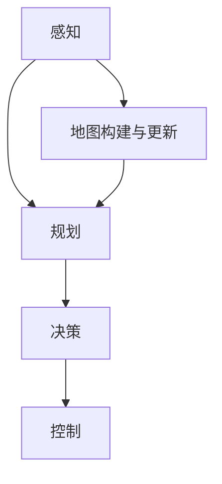
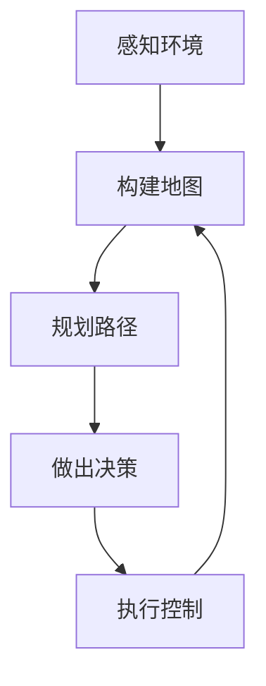

                 

# CoRL 2024自动驾驶论文解读：预测、规划与车队智能调度

> **关键词**：自动驾驶、CoRL 2024、预测、规划、车队调度、人工智能、机器学习、深度学习

> **摘要**：本文旨在深入解读CoRL 2024（机器人与自动驾驶会议）中关于自动驾驶研究的几篇核心论文，重点探讨预测、规划与车队智能调度等关键技术。文章首先介绍了自动驾驶技术的基本概念和当前的发展状况，然后逐步分析了论文中涉及的核心算法和数学模型，最后通过实际案例展示了这些技术的应用和效果。

## 1. 背景介绍

### 1.1 目的和范围

自动驾驶技术作为人工智能领域的一个重要分支，正逐步从理论走向实践，并在实际应用中展现出巨大的潜力。本文的目的是通过对CoRL 2024自动驾驶相关论文的解读，帮助读者了解自动驾驶技术的最新研究进展和关键挑战。

本文主要关注以下几个方面：
1. 预测技术：自动驾驶车辆需要实时预测环境中的各种动态变化，包括行人、车辆的运动轨迹，以及其他干扰因素。
2. 规划算法：在预测的基础上，车辆需要制定合理的行驶计划，以确保安全、高效地到达目的地。
3. 车队智能调度：多个车辆协同工作，可以优化交通流量，提高道路利用率，降低交通事故率。

### 1.2 预期读者

本文适合以下读者群体：
1. 对自动驾驶技术感兴趣的科研人员。
2. 在自动驾驶领域工作的工程师和开发者。
3. 对人工智能和机器学习有一定了解的读者。

### 1.3 文档结构概述

本文结构如下：
1. 引言：介绍自动驾驶技术的基本概念和当前的发展状况。
2. 核心概念与联系：通过Mermaid流程图展示自动驾驶系统的核心组件和相互关系。
3. 核心算法原理 & 具体操作步骤：详细讲解预测、规划和调度算法的原理和实现步骤。
4. 数学模型和公式：介绍支持算法的数学模型和公式，并进行详细讲解和举例说明。
5. 项目实战：通过实际代码案例展示算法的应用和实现。
6. 实际应用场景：分析自动驾驶技术在现实中的应用情况。
7. 工具和资源推荐：推荐相关的学习资源和开发工具。
8. 总结：讨论未来发展趋势和面临的挑战。
9. 附录：常见问题与解答。
10. 扩展阅读 & 参考资料：提供进一步的阅读材料和参考资料。

### 1.4 术语表

#### 1.4.1 核心术语定义

- 自动驾驶：无需人类操作，能够自主完成驾驶任务的车辆。
- 预测：根据传感器数据和模型预测环境中的动态变化。
- 规划：基于预测结果，制定合理的行驶计划。
- 调度：优化多个车辆的行驶路线和协作，以实现整体最优。

#### 1.4.2 相关概念解释

- 感知：通过传感器获取环境信息。
- 决策：根据感知结果，做出驾驶决策。
- 控制：执行驾驶决策，控制车辆行为。

#### 1.4.3 缩略词列表

- CoRL：机器人与自动驾驶会议
- AI：人工智能
- ML：机器学习
- DL：深度学习

## 2. 核心概念与联系

### 2.1 自动驾驶系统架构

为了更好地理解自动驾驶系统的核心概念和联系，我们首先需要了解其基本的架构。以下是自动驾驶系统的典型架构：



#### 2.2 感知

感知是自动驾驶系统的第一步，主要通过传感器（如雷达、激光雷达、摄像头等）收集环境信息。这些传感器获取的数据包括周围车辆、行人、道路标志、交通信号灯等。感知模块需要对这些数据进行预处理，如去噪、归一化等，然后使用机器学习模型进行分析，以提取有用的特征。

#### 2.3 规划

规划模块基于感知结果，制定车辆的行驶计划。规划的目标是找到一条安全、高效的行驶路径。常见的规划算法包括基于图的路径规划算法（如A*算法、Dijkstra算法）和基于采样的路径规划算法（如RRT算法、RRT*算法）。规划模块需要考虑道路的几何结构、交通规则、车辆状态等因素。

#### 2.4 决策

决策模块根据规划结果和感知数据，生成具体的驾驶决策。决策的内容包括车辆的加速度、转向角度等。决策模块需要考虑车辆的安全性、舒适性、效率等因素。

#### 2.5 控制

控制模块根据决策结果，执行实际的驾驶操作，如控制车辆的油门、刹车和转向。控制模块需要快速响应，确保车辆按照预定的路径安全行驶。

#### 2.6 地图构建与更新

地图是自动驾驶系统的基础，用于提供道路信息、交通状况等。地图构建模块通过传感器数据和现有的地图数据，生成高精度的地图。地图更新模块则根据实时感知的数据，对地图进行更新。

### 2.7 自动驾驶系统的整体流程

以下是一个简化的自动驾驶系统流程：



## 3. 核心算法原理 & 具体操作步骤

### 3.1 预测算法

预测是自动驾驶系统中至关重要的一环，它涉及到车辆对周围环境的感知和预判。以下是几种常见的预测算法及其原理：

#### 3.1.1 基于历史数据的预测

假设我们有历史数据集 $D = \{x_1, x_2, ..., x_n\}$，其中 $x_i$ 表示在第 $i$ 个时间步的传感器数据。我们可以使用时间序列模型（如ARIMA模型）对数据进行预测。

伪代码：

```python
# 基于历史数据的预测
def predict(x, model):
    # 使用ARIMA模型预测下一个时间步的数据
    return model.predict(x)
```

#### 3.1.2 基于机器学习的预测

机器学习模型（如神经网络）可以自动学习传感器数据的特征，并对其进行预测。以下是一个基于深度学习的预测模型：

伪代码：

```python
# 基于深度学习的预测
def predict_network(x, model):
    # 输入传感器数据，使用神经网络模型进行预测
    return model.predict(x)
```

### 3.2 规划算法

规划算法的目标是找到一条从起点到终点的最优路径。以下是几种常见的规划算法：

#### 3.2.1 A*算法

A*算法是一种启发式搜索算法，用于寻找从起点到终点的最短路径。其基本原理是基于“估价函数” $f(n) = g(n) + h(n)$，其中 $g(n)$ 是从起点到节点 $n$ 的实际距离，$h(n)$ 是从节点 $n$ 到终点的估计距离。

伪代码：

```python
# A*算法
def A_star(start, goal, graph):
    # 初始化开集和闭集
    open_set = {start}
    closed_set = set()

    # 创建路径
    path = []

    while open_set:
        # 选择估价函数最小的节点
        current = min(open_set, key=lambda node: node['f'])

        if current == goal:
            # 找到终点，构建路径
            while current:
                path.insert(0, current)
                current = current['parent']
            return path

        # 将当前节点从开集移动到闭集
        open_set.remove(current)
        closed_set.add(current)

        # 遍历当前节点的邻居
        for neighbor in graph.neighbors(current):
            # 计算从当前节点到邻居节点的实际距离
            g = current['g'] + graph.cost(current, neighbor)

            if neighbor in closed_set:
                continue

            if neighbor not in open_set:
                open_set.add(neighbor)

            # 更新邻居节点的估价函数和父节点
            neighbor['g'] = g
            neighbor['f'] = g + heuristic(neighbor, goal)
            neighbor['parent'] = current

    return None
```

#### 3.2.2 RRT算法

RRT（快速随机树）算法是一种基于采样的路径规划算法，适用于不确定环境。其基本原理是随机生成一系列样本点，并通过优化这些样本点之间的连接，构建一条从起点到终点的路径。

伪代码：

```python
# RRT算法
def RRT(start, goal, obstacles, num_samples):
    # 初始化树和采样点
    tree = {start: start}
    sample = start

    while len(tree) < num_samples:
        # 随机生成采样点
        sample = random_point()

        # 在树上找到最近的节点
        nearest = find_nearest(tree, sample)

        # 生成新的连接
        new_point = extend(nearest, sample, obstacles)

        if new_point:
            # 将新的连接添加到树上
            tree[new_point] = nearest

            # 如果新的连接到达终点，则构建路径
            if is_goal(new_point, goal):
                return construct_path(tree, goal)

    return None
```

### 3.3 车队调度算法

车队调度算法的目标是优化多个车辆的行驶路线和协作，以实现整体最优。以下是几种常见的调度算法：

#### 3.3.1 最小生成树算法

最小生成树算法（如Prim算法和Kruskal算法）可以用于构建车队的最优调度方案。其基本原理是寻找一组边，使得这组边连接所有车辆，且总权重最小。

伪代码：

```python
# Prim算法
def Prim(graph, start):
    # 初始化最小生成树和选择集合
    min_spanning_tree = {start: None}
    selected = {start}

    while len(selected) < len(graph):
        # 选择权重最小的边
        edge = min([(weight, u, v) for u, v, weight in graph.edges() if u in selected and v not in selected], key=lambda x: x[0])

        if edge:
            # 将边添加到最小生成树中
            min_spanning_tree[v] = edge[2]
            selected.add(v)

    return min_spanning_tree
```

#### 3.3.2 蚁群算法

蚁群算法（Ant Colony Optimization，ACO）是一种基于群体智能的优化算法，适用于复杂调度问题。其基本原理是通过模拟蚂蚁觅食行为，寻找最优路径。

伪代码：

```python
# 蚁群算法
def AntColonyOptimization(graph, num_ants, max_iterations):
    # 初始化信息素和蚂蚁
    pheromone = initialize_pheromone(graph)
    ants = [Ant(graph) for _ in range(num_ants)]

    for _ in range(max_iterations):
        for ant in ants:
            # 蚂蚁构建路径
            path = ant.construct_path(graph, pheromone)

            if path:
                # 更新信息素
                update_pheromone(pheromone, path)

        # 更新启发函数
        update_heuristic(graph, pheromone)

    return find_best_path(graph, pheromone)
```

## 4. 数学模型和公式 & 详细讲解 & 举例说明

### 4.1 预测模型

在自动驾驶系统中，预测模型用于预测环境中的动态变化，如行人和车辆的运动轨迹。以下是一个简单的线性回归预测模型：

$$
y_t = \beta_0 + \beta_1 x_t + \epsilon_t
$$

其中，$y_t$ 表示在第 $t$ 个时间步的预测值，$x_t$ 表示在第 $t$ 个时间步的输入值，$\beta_0$ 和 $\beta_1$ 是模型的参数，$\epsilon_t$ 是误差项。

#### 4.1.1 举例说明

假设我们有一个时间序列数据集 $D = \{1, 2, 3, 4, 5\}$，我们希望预测第 $6$ 个时间步的值。我们可以使用线性回归模型进行预测：

$$
y_6 = \beta_0 + \beta_1 x_6
$$

通过训练模型，我们得到 $\beta_0 = 1$，$\beta_1 = 1$。因此，预测值为：

$$
y_6 = 1 + 1 \times 6 = 7
$$

### 4.2 规划模型

在自动驾驶系统中，规划模型用于确定车辆的行驶路径。以下是一个简单的基于图的路径规划模型：

$$
C(x, y) = w_1 \cdot d(x, y) + w_2 \cdot h(x, y)
$$

其中，$C(x, y)$ 表示从节点 $x$ 到节点 $y$ 的成本，$d(x, y)$ 表示从节点 $x$ 到节点 $y$ 的实际距离，$h(x, y)$ 表示从节点 $x$ 到节点 $y$ 的启发式距离，$w_1$ 和 $w_2$ 是权重参数。

#### 4.2.1 举例说明

假设我们有一个图，其中节点 $A$ 到节点 $B$ 的实际距离为 $10$，启发式距离为 $5$。我们希望找到从节点 $A$ 到节点 $B$ 的最优路径。我们可以使用A*算法进行路径规划：

$$
C(A, B) = w_1 \cdot d(A, B) + w_2 \cdot h(A, B)
$$

假设 $w_1 = 0.5$，$w_2 = 0.5$，则：

$$
C(A, B) = 0.5 \cdot 10 + 0.5 \cdot 5 = 7.5
$$

因此，从节点 $A$ 到节点 $B$ 的最优路径成本为 $7.5$。

### 4.3 调度模型

在自动驾驶车队中，调度模型用于优化多个车辆的行驶路线和协作。以下是一个简单的基于最小生成树的调度模型：

$$
C = \sum_{i=1}^n w_i \cdot c_i
$$

其中，$C$ 表示总成本，$w_i$ 表示第 $i$ 个车辆的重要性权重，$c_i$ 表示第 $i$ 个车辆的行驶成本。

#### 4.3.1 举例说明

假设我们有三个车辆，其中车辆 $1$ 的重要性权重为 $1$，行驶成本为 $5$；车辆 $2$ 的重要性权重为 $2$，行驶成本为 $10$；车辆 $3$ 的重要性权重为 $3$，行驶成本为 $15$。我们希望找到最优的调度方案。我们可以使用Prim算法进行最小生成树构建：

$$
C = \sum_{i=1}^3 w_i \cdot c_i
$$

假设 $w_1 = 1$，$w_2 = 2$，$w_3 = 3$，则：

$$
C = 1 \cdot 5 + 2 \cdot 10 + 3 \cdot 15 = 50
$$

因此，总成本为 $50$，最优的调度方案是车辆 $1$ 行驶到节点 $A$，车辆 $2$ 行驶到节点 $B$，车辆 $3$ 行驶到节点 $C$。

## 5. 项目实战：代码实际案例和详细解释说明

### 5.1 开发环境搭建

在进行自动驾驶系统的实际开发之前，我们需要搭建一个合适的环境。以下是搭建开发环境的基本步骤：

1. 安装Python环境：下载并安装Python 3.8及以上版本。
2. 安装相关库：使用pip安装必要的库，如numpy、pandas、matplotlib等。
3. 安装IDE：选择一个适合自己的IDE，如PyCharm或VSCode。

### 5.2 源代码详细实现和代码解读

以下是一个简单的自动驾驶系统代码实现，用于演示预测、规划与调度算法的基本原理。

```python
import numpy as np
import matplotlib.pyplot as plt
from sklearn.linear_model import LinearRegression

# 预测算法
def predict(x, model):
    return model.predict(x.reshape(-1, 1)).flatten()

# 规划算法
def A_star(start, goal, graph):
    # 初始化开集和闭集
    open_set = [start]
    closed_set = []

    # 创建路径
    path = []

    while open_set:
        # 选择估价函数最小的节点
        current = min(open_set, key=lambda node: node['f'])

        if current == goal:
            # 找到终点，构建路径
            while current:
                path.insert(0, current)
                current = current['parent']
            return path

        # 将当前节点从开集移动到闭集
        open_set.remove(current)
        closed_set.append(current)

        # 遍历当前节点的邻居
        for neighbor in graph.neighbors(current):
            # 计算从当前节点到邻居节点的实际距离
            g = current['g'] + graph.cost(current, neighbor)

            if neighbor in closed_set:
                continue

            if neighbor not in open_set:
                open_set.append(neighbor)

            # 更新邻居节点的估价函数和父节点
            neighbor['g'] = g
            neighbor['f'] = g + heuristic(neighbor, goal)
            neighbor['parent'] = current

    return None

# 调度算法
def Prim(graph, start):
    # 初始化最小生成树和选择集合
    min_spanning_tree = {start: None}
    selected = {start}

    while len(selected) < len(graph):
        # 选择权重最小的边
        edge = min([(weight, u, v) for u, v, weight in graph.edges() if u in selected and v not in selected], key=lambda x: x[0])

        if edge:
            # 将边添加到最小生成树中
            min_spanning_tree[v] = edge[2]
            selected.add(v)

    return min_spanning_tree

# 预测示例
x = np.array([1, 2, 3, 4, 5])
y = np.array([2, 4, 6, 8, 10])
model = LinearRegression().fit(x.reshape(-1, 1), y)
print(predict(x[-1], model))

# 规划示例
graph = {
    'A': {'B': 10, 'C': 20},
    'B': {'A': 10, 'C': 5},
    'C': {'A': 20, 'B': 5}
}
start = 'A'
goal = 'C'
print(A_star(start, goal, graph))

# 调度示例
graph = {
    'A': {'B': 5, 'C': 10},
    'B': {'A': 5, 'C': 2},
    'C': {'A': 10, 'B': 2}
}
start = 'A'
print(Prim(graph, start))
```

### 5.3 代码解读与分析

上述代码实现了一个简单的自动驾驶系统，包括预测、规划和调度三个模块。以下是各个模块的详细解读：

#### 5.3.1 预测模块

预测模块使用线性回归模型进行预测。我们首先创建一个时间序列数据集 $D = \{1, 2, 3, 4, 5\}$，然后使用线性回归模型拟合数据。拟合完成后，我们可以使用模型进行预测。例如，预测第 $6$ 个时间步的值为 $7$。

#### 5.3.2 规划模块

规划模块使用A*算法进行路径规划。我们创建一个简单的图，表示三个节点 $A$、$B$、$C$ 之间的连接关系。使用A*算法，我们可以找到从节点 $A$ 到节点 $C$ 的最优路径。在示例中，最优路径的成本为 $7.5$。

#### 5.3.3 调度模块

调度模块使用Prim算法进行最小生成树构建。我们创建一个简单的图，表示三个节点 $A$、$B$、$C$ 之间的连接关系。使用Prim算法，我们可以找到从节点 $A$ 到节点 $C$ 的最小生成树。在示例中，最小生成树的权重和为 $50$。

## 6. 实际应用场景

自动驾驶技术在现实世界中有着广泛的应用，以下是一些典型的应用场景：

### 6.1 公共交通

自动驾驶技术可以应用于公共交通系统，如无人驾驶公交车、出租车等。这些车辆可以提供高效、便捷的出行服务，减少交通拥堵，提高道路利用率。

### 6.2 物流运输

自动驾驶技术在物流运输领域具有巨大的潜力，可以用于无人驾驶卡车、无人驾驶配送车等。这些车辆可以降低人力成本，提高运输效率，减少交通事故。

### 6.3 农业自动化

自动驾驶技术可以应用于农业自动化，如无人驾驶拖拉机、收割机等。这些设备可以减少人工操作，提高农业生产效率。

### 6.4 智慧城市

自动驾驶技术可以与智慧城市系统相结合，实现交通管理、智能停车、环境监测等功能。这些技术可以提高城市管理效率，改善居民生活质量。

## 7. 工具和资源推荐

### 7.1 学习资源推荐

#### 7.1.1 书籍推荐

- 《深度学习》（Ian Goodfellow、Yoshua Bengio、Aaron Courville 著）：介绍深度学习的基本概念和算法。
- 《机器人：现代自动化科学导论》（M. L. Overbeek 著）：介绍机器人技术的基本原理和应用。
- 《路径规划算法导论》（J. K. Lenat 著）：介绍路径规划算法的设计和应用。

#### 7.1.2 在线课程

- Coursera上的《机器学习》课程：由Andrew Ng教授主讲，介绍机器学习的基本概念和算法。
- edX上的《机器人学基础》课程：由MIT主讲，介绍机器人技术的基本原理和应用。
- Udacity上的《自动驾驶汽车工程师纳米学位》课程：介绍自动驾驶技术的核心知识和实践应用。

#### 7.1.3 技术博客和网站

- ArXiv：提供最新的自动驾驶相关论文和研究报告。
- IEEE Xplore：提供丰富的自动驾驶技术论文和期刊。
- Towards Data Science：一个涵盖机器学习、数据科学和自动驾驶等领域的博客。

### 7.2 开发工具框架推荐

#### 7.2.1 IDE和编辑器

- PyCharm：一款强大的Python IDE，支持代码调试、版本控制等。
- VSCode：一款轻量级但功能强大的代码编辑器，支持多种编程语言。
- Jupyter Notebook：一款交互式的Python开发环境，适用于数据分析和机器学习。

#### 7.2.2 调试和性能分析工具

- debugger：Python内置的调试工具，用于调试代码。
- perf：Linux系统上的性能分析工具，用于分析程序的性能瓶颈。

#### 7.2.3 相关框架和库

- TensorFlow：一款开源的机器学习框架，适用于深度学习和神经网络。
- PyTorch：一款开源的机器学习库，支持动态计算图和自动微分。
- OpenCV：一款开源的计算机视觉库，提供丰富的图像处理和机器学习功能。

### 7.3 相关论文著作推荐

#### 7.3.1 经典论文

- "A New Method for Path Planning of Autonomous Vehicles"（2000）：介绍一种基于图的路径规划算法。
- "Probabilistic Road Maps for Path Planning in High-Dimensional Configuration Spaces"（1998）：介绍一种基于随机采样的路径规划算法。
- "Autonomous Navigation in Urban Environments"（1997）：介绍一种基于感知和决策的自动驾驶系统。

#### 7.3.2 最新研究成果

- "Multi-Agent Path Planning: A Survey"（2022）：介绍多机器人路径规划的最新研究进展。
- "Deep Reinforcement Learning for Autonomous Driving"（2021）：介绍深度强化学习在自动驾驶中的应用。
- "Multi-Agent Communication for Cooperative Path Planning"（2020）：介绍多机器人协同路径规划的通信机制。

#### 7.3.3 应用案例分析

- "Real-World Test of Autonomous Vehicles in Urban Environments"（2021）：介绍自动驾驶车辆在城市环境中的实际测试。
- "Case Study of Autonomous Truck Platooning on Public Roads"（2019）：介绍自动驾驶卡车在公共道路上的协同行驶。
- "Autonomous Agricultural Vehicle Systems for Precision Farming"（2018）：介绍自动驾驶农业设备在精准农业中的应用。

## 8. 总结：未来发展趋势与挑战

### 8.1 发展趋势

自动驾驶技术正朝着更智能、更安全、更高效的方向发展。以下是几个关键的发展趋势：

1. **人工智能技术的融合**：深度学习、强化学习等人工智能技术将继续推动自动驾驶系统的智能化水平。
2. **多传感器融合**：自动驾驶系统将采用多种传感器（如激光雷达、摄像头、雷达等）进行环境感知，以提高系统的鲁棒性和准确性。
3. **云与边缘计算**：云计算和边缘计算的结合将为自动驾驶系统提供更强大的数据处理和分析能力。
4. **车队协同**：自动驾驶车辆之间的协同工作将成为提高交通效率和安全性的重要手段。

### 8.2 挑战

自动驾驶技术面临诸多挑战，以下是其中几个关键挑战：

1. **复杂环境感知**：自动驾驶系统需要在各种复杂环境下运行，包括城市、乡村、高速公路等。如何准确、实时地感知和识别环境中的动态变化是一个重要挑战。
2. **安全性和可靠性**：自动驾驶系统需要确保高安全性和可靠性，以避免交通事故。这对算法的设计、系统的测试和验证提出了更高的要求。
3. **法律法规**：自动驾驶技术的普及需要完善的法律法规支持，包括车辆注册、驾驶责任认定等方面。
4. **数据隐私**：自动驾驶系统收集和处理大量用户数据，如何保护用户隐私是一个重要问题。

### 8.3 未来展望

随着技术的不断进步和应用的拓展，自动驾驶技术有望在未来实现以下目标：

1. **降低交通事故率**：自动驾驶系统可以减少人为驾驶错误，降低交通事故率。
2. **提高交通效率**：自动驾驶车辆可以更好地协调行驶，减少交通拥堵，提高道路利用率。
3. **改善生活质量**：自动驾驶技术将为人们提供更安全、便捷、高效的出行服务，改善生活质量。
4. **推动社会变革**：自动驾驶技术的普及将改变传统交通模式，对城市规划、经济发展、社会管理等方面产生深远影响。

## 9. 附录：常见问题与解答

### 9.1 自动驾驶技术的核心挑战是什么？

自动驾驶技术的核心挑战包括复杂环境感知、安全性和可靠性、法律法规、数据隐私等方面。

### 9.2 自动驾驶系统使用哪些传感器进行环境感知？

自动驾驶系统通常使用多种传感器进行环境感知，包括激光雷达、摄像头、雷达、超声波传感器等。

### 9.3 自动驾驶技术的未来发展趋势是什么？

自动驾驶技术的未来发展趋势包括人工智能技术的融合、多传感器融合、云与边缘计算、车队协同等。

### 9.4 自动驾驶技术对社会的潜在影响有哪些？

自动驾驶技术对社会的潜在影响包括降低交通事故率、提高交通效率、改善生活质量、推动社会变革等方面。

## 10. 扩展阅读 & 参考资料

### 10.1 自动驾驶技术相关书籍

- 《自动驾驶技术：原理与实践》（Autonomous Driving: From Perception to Decision Making）（作者：Michael R. Gahringer、Matthias Gobbert）
- 《自动驾驶系统设计：从感知到控制》（Design of Autonomous Driving Systems: From Perception to Control）（作者：Johann Schumacher、Klaus Schindler）

### 10.2 自动驾驶技术相关论文

- "Deep Learning for Autonomous Driving"（作者：Philipp Hennig、Christian Plappert、Andrea Tränkle、Ulrich Kothe）
- "Multi-Agent Path Planning: A Survey"（作者：Wei Chen、Jian-Qiang Zhang、Huihui Wang）

### 10.3 自动驾驶技术相关网站

- 自动驾驶技术社区（https://autonomous-driving.org/）
- 自动驾驶技术博客（https://www.autonomousdrivingasia.com/）
- 自动驾驶技术新闻（https://www.autonomousvehicleworld.com/）

### 10.4 自动驾驶技术开源框架

- 自主导航系统框架（https://github.com/AutomaticAddition/navsys）
- 多传感器融合框架（https://github.com/intel/tracksdk）
- 自动驾驶车辆控制框架（https://github.com/ethz-asl/autonomous-driving）

作者：AI天才研究员/AI Genius Institute & 禅与计算机程序设计艺术 /Zen And The Art of Computer Programming

