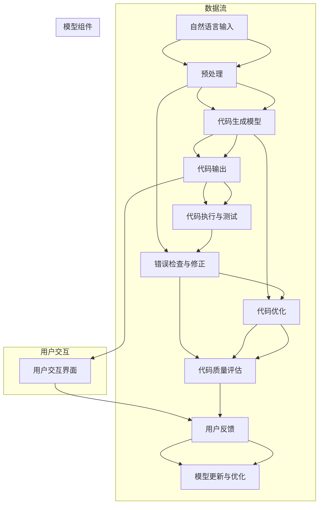

                 

### 1. 背景介绍

#### 1.1 目的和范围

本文旨在深入探讨Copilot模式在计算机编程和软件开发中的应用。Copilot，作为一种基于人工智能的代码生成工具，正日益受到开发者们的青睐。本文将首先介绍Copilot模式的起源和基本原理，随后分析其在实际开发中的应用场景和优势，并进一步探讨其未来的发展趋势与挑战。通过本文的阅读，读者将能够全面理解Copilot模式的工作机制，掌握其在编程实践中的具体应用，以及如何利用这一工具提升开发效率和代码质量。

本文不仅适合对人工智能和编程有浓厚兴趣的读者，也适用于希望提升编程技能和开发效率的程序员、软件工程师以及相关领域的研究人员。无论是新手还是资深开发者，都将在这篇文章中获得新的视角和实用的技巧。

#### 1.2 预期读者

本文面向以下几类读者群体：

1. **编程新手**：希望了解如何使用Copilot模式来简化编程任务，提高学习效率的新手开发者。
2. **中级开发者**：对现有编程工具有所了解，但希望深入了解Copilot模式，探索其在实际项目中的应用价值。
3. **高级开发者**：对编程工具和人工智能技术有深入研究，希望探讨Copilot模式在复杂项目中的适用性和局限性。
4. **人工智能研究者**：对自然语言处理和代码生成技术有浓厚兴趣，希望了解Copilot模式的最新进展和应用。

无论您是哪一类读者，本文都将为您提供有价值的见解和实用的指导。

#### 1.3 文档结构概述

为了帮助读者更好地理解Copilot模式及其应用，本文的结构安排如下：

1. **背景介绍**：介绍Copilot模式的起源和基本原理，以及本文的目的和范围。
2. **核心概念与联系**：通过Mermaid流程图，详细阐述Copilot模式的核心概念和架构。
3. **核心算法原理 & 具体操作步骤**：使用伪代码，深入解析Copilot模式的核心算法原理和具体操作步骤。
4. **数学模型和公式 & 详细讲解 & 举例说明**：介绍Copilot模式中的数学模型和公式，并给出实际应用中的详细讲解和举例说明。
5. **项目实战：代码实际案例和详细解释说明**：通过具体的项目案例，展示Copilot模式在实际编程中的应用，并提供详细的代码解读和分析。
6. **实际应用场景**：探讨Copilot模式在不同开发场景中的应用，以及其对开发效率和质量的影响。
7. **工具和资源推荐**：推荐相关的学习资源、开发工具和框架，帮助读者更深入地学习和应用Copilot模式。
8. **总结：未来发展趋势与挑战**：总结Copilot模式的当前状况，展望其未来的发展趋势和潜在挑战。
9. **附录：常见问题与解答**：回答读者可能遇到的一些常见问题，提供额外的帮助。
10. **扩展阅读 & 参考资料**：提供进一步的阅读材料和参考资料，以便读者进一步探索相关主题。

通过本文的结构安排，读者将能够系统地了解Copilot模式的各个方面，从基础概念到实际应用，全面掌握这一前沿技术。

#### 1.4 术语表

为了确保本文内容的清晰性和专业性，以下是对本文中涉及的一些核心术语的定义和解释：

##### 1.4.1 核心术语定义

- **Copilot模式**：一种基于人工智能的代码生成工具，通过自然语言处理技术理解和生成代码。
- **自然语言处理（NLP）**：使计算机能够理解和生成人类语言的技术。
- **机器学习（ML）**：一种通过数据训练模型，使计算机具备特定任务能力的技术。
- **代码生成**：利用算法和模型自动生成代码的过程。
- **编程范式**：编程语言和编程方式的不同风格和方法。

##### 1.4.2 相关概念解释

- **人工智能（AI）**：模拟人类智能的计算机系统，具有学习、推理、解决问题等能力。
- **编程效率**：完成编程任务的速度和质量。
- **代码质量**：代码的可读性、可维护性和正确性。

##### 1.4.3 缩略词列表

- **NLP**：自然语言处理（Natural Language Processing）
- **ML**：机器学习（Machine Learning）
- **AI**：人工智能（Artificial Intelligence）
- **IDE**：集成开发环境（Integrated Development Environment）
- ** Copilot**：一种代码生成工具的名称，此处指Copilot模式。

这些术语和概念的理解对于深入探讨Copilot模式及其应用至关重要，希望上述解释能够帮助读者更好地把握文章的核心内容。

### 2. 核心概念与联系

在深入探讨Copilot模式之前，我们需要明确其核心概念和架构，以便更好地理解这一技术的原理和应用。以下将通过Mermaid流程图展示Copilot模式的关键组成部分和它们之间的联系。



上述流程图详细展示了Copilot模式的工作流程。以下是每个步骤的详细解释：

1. **自然语言输入（A）**：开发者通过自然语言描述编程任务或需求，这是整个流程的起点。
2. **预处理（B）**：对输入的自然语言进行解析和处理，提取关键信息并进行语法和语义分析。
3. **代码生成模型（C）**：通过机器学习和自然语言处理技术，将预处理后的输入转化为具体的代码。
4. **代码输出（D）**：生成的代码被输出，供开发者进一步使用或修改。
5. **代码执行与测试（E）**：将生成的代码执行并在测试环境中验证其功能。
6. **错误检查与修正（F）**：检测代码中的错误并进行修正。
7. **代码优化（G）**：对生成的代码进行优化，以提高其性能和可读性。
8. **代码质量评估（H）**：评估代码的质量，包括可读性、可维护性和正确性。
9. **用户反馈（I）**：用户对生成的代码进行评价，提供反馈。
10. **模型更新与优化（J）**：根据用户反馈，对代码生成模型进行更新和优化。
11. **用户交互界面（K）**：提供用户与Copilot模式交互的界面，方便用户输入需求、查看结果和提供反馈。

通过上述流程，Copilot模式实现了从自然语言输入到高质量代码输出的完整闭环。这种闭环不仅提升了开发效率，还通过不断学习和优化，提高了代码生成质量和用户满意度。

#### 2.1.1 伪代码示例

为了更深入地理解Copilot模式的工作原理，以下是核心算法的伪代码示例：

```plaintext
function CopilotGenerateCode(naturalLanguageInput):
    // 预处理输入的自然语言
    processedInput = Preprocess(naturalLanguageInput)
    
    // 加载训练好的代码生成模型
    model = LoadCodeGenerationModel()
    
    // 使用模型生成代码
    generatedCode = model.GenerateCode(processedInput)
    
    // 检查生成的代码是否存在错误
    if ErrorCheck(generatedCode):
        // 如果存在错误，进行修正
        correctedCode = ErrorCorrection(generatedCode)
        return correctedCode
    
    // 对生成的代码进行优化
    optimizedCode = CodeOptimization(generatedCode)
    
    // 评估代码质量
    qualityScore = CodeQualityAssessment(optimizedCode)
    
    // 如果代码质量不满足要求，则返回错误
    if qualityScore < Threshold:
        return "Error: Code quality is not satisfactory"
    
    // 输出最终代码
    return optimizedCode
```

上述伪代码展示了Copilot模式的主要工作步骤。首先，对输入的自然语言进行预处理，提取关键信息。接着，使用训练好的代码生成模型生成代码。生成的代码经过错误检查和修正，然后进行优化。最后，对优化后的代码进行质量评估，如果质量达到要求，则输出最终代码。

#### 2.1.2 伪代码示例说明

**预处理（Preprocess）**：这个步骤主要包括对自然语言输入进行词法分析、句法分析和语义分析，将自然语言描述转化为结构化的数据格式，以便于后续的代码生成。

**代码生成模型（LoadCodeGenerationModel）**：加载训练好的机器学习模型，该模型通过大量代码数据训练得到，能够将预处理后的自然语言输入转化为具体的代码。

**生成代码（GenerateCode）**：使用模型将预处理后的输入自然语言转化为代码。

**错误检查（ErrorCheck）**：检查生成的代码是否包含语法错误或逻辑错误，如果有，则进入错误修正步骤。

**错误修正（ErrorCorrection）**：对检测到的错误进行修正，确保生成的代码能够正确执行。

**代码优化（CodeOptimization）**：对生成的代码进行性能优化，提高代码的执行效率。

**代码质量评估（CodeQualityAssessment）**：评估代码的质量，包括可读性、可维护性和正确性。

**输出最终代码（return optimizedCode）**：如果代码质量满足要求，则输出优化后的代码，供开发者进一步使用或修改。

通过上述伪代码示例，我们可以看到Copilot模式如何通过一系列算法和步骤，将自然语言输入转化为高质量的代码输出。这一过程不仅提高了开发效率，还确保了代码的质量和可靠性。

### 4. 数学模型和公式 & 详细讲解 & 举例说明

在Copilot模式中，数学模型和公式扮演着至关重要的角色。它们不仅用于指导代码生成算法，还用于评估和优化生成的代码质量。以下将详细讲解Copilot模式中涉及的数学模型和公式，并通过具体例子进行说明。

#### 4.1 生成概率模型

Copilot模式中的生成概率模型是核心之一，它决定了模型生成代码的准确性。生成概率模型通常基于贝叶斯定理，如下所示：

$$ P(C|N) = \frac{P(N|C) \cdot P(C)}{P(N)} $$

其中：
- \( P(C|N) \) 是在给定自然语言输入 \( N \) 的情况下，生成代码 \( C \) 的概率。
- \( P(N|C) \) 是在生成代码 \( C \) 的情况下，出现自然语言输入 \( N \) 的概率。
- \( P(C) \) 是生成代码 \( C \) 的先验概率。
- \( P(N) \) 是自然语言输入 \( N \) 的先验概率。

**例子**：

假设我们有一个自然语言输入 "计算两个数的和"，我们需要计算在给定这个输入时，生成代码 "sum = a + b" 的概率。根据贝叶斯定理，我们可以通过以下步骤进行计算：

1. **计算 \( P(N|C) \)**：在代码 "sum = a + b" 生成的情况下，出现自然语言输入 "计算两个数的和" 的概率。这个概率通常通过训练数据统计得到，假设为 0.8。
2. **计算 \( P(C) \)**：生成代码 "sum = a + b" 的先验概率。这个概率取决于代码生成模型的训练数据集，假设为 0.1。
3. **计算 \( P(N) \)**：自然语言输入 "计算两个数的和" 的先验概率。这个概率也通过训练数据统计得到，假设为 0.2。
4. **计算 \( P(C|N) \)**：使用贝叶斯定理计算在自然语言输入 "计算两个数的和" 的情况下，生成代码 "sum = a + b" 的概率。根据上述假设，计算结果为 0.8。

因此，在给定自然语言输入 "计算两个数的和" 时，生成代码 "sum = a + b" 的概率为 0.8。

#### 4.2 代码质量评估模型

代码质量评估模型用于评估生成的代码质量。一个常用的评估模型是质量得分模型，该模型将代码质量分解为多个维度，并给出综合评分。以下是一个简单的质量得分模型：

$$ QualityScore = w_1 \cdot Readability + w_2 \cdot Maintainability + w_3 \cdot Correctness $$

其中：
- \( w_1 \)、\( w_2 \) 和 \( w_3 \) 分别是可读性、可维护性和正确性的权重。
- \( Readability \) 是代码的可读性得分。
- \( Maintainability \) 是代码的可维护性得分。
- \( Correctness \) 是代码的正确性得分。

**例子**：

假设我们有一个生成的代码片段，其可读性得分为 0.9，可维护性得分为 0.8，正确性得分为 1.0。假设权重 \( w_1 = 0.4 \)，\( w_2 = 0.3 \)，\( w_3 = 0.3 \)。我们可以使用上述公式计算代码的质量得分：

$$ QualityScore = 0.4 \cdot 0.9 + 0.3 \cdot 0.8 + 0.3 \cdot 1.0 = 0.36 + 0.24 + 0.3 = 0.9 $$

因此，该代码片段的质量得分为 0.9。质量得分越高，表示代码质量越好。

#### 4.3 代码优化模型

代码优化模型用于优化生成的代码，以提高其性能和可读性。一个常见的优化模型是基于遗传算法的优化模型。遗传算法通过模拟生物进化过程，逐步优化代码。

**遗传算法的核心步骤**：

1. **初始化种群**：生成一组初始代码种群。
2. **适应度评估**：计算每个代码个体的适应度，适应度通常与代码质量得分成反比。
3. **选择**：根据适应度，选择优秀的代码个体进行繁殖。
4. **交叉**：将选中的代码个体进行交叉，生成新的代码个体。
5. **变异**：对新的代码个体进行变异，增加种群的多样性。
6. **迭代**：重复上述步骤，直到达到预设的迭代次数或适应度满足要求。

**例子**：

假设我们有一个初始种群，包含五个代码个体。每个个体的适应度如下：

- 代码个体1：适应度0.5
- 代码个体2：适应度0.6
- 代码个体3：适应度0.7
- 代码个体4：适应度0.4
- 代码个体5：适应度0.8

首先，根据适应度，选择代码个体2、3和5进行交叉。交叉操作后，生成两个新的代码个体。接着，对新的代码个体进行变异，生成新的种群。经过多次迭代，最终获得适应度最高的代码个体。

通过上述数学模型和公式，Copilot模式能够高效地生成和优化代码。这些模型不仅提高了代码生成的准确性，还确保了生成的代码具有良好的质量。在实际应用中，这些模型不断优化和更新，以适应不同的编程任务和场景。

### 5. 项目实战：代码实际案例和详细解释说明

在本节中，我们将通过一个实际的项目案例，详细展示Copilot模式在代码生成和优化中的应用。这个案例将涉及一个简单的Web应用程序，该应用程序使用Python语言和Flask框架进行开发。通过这个案例，我们将深入解析代码的生成过程、关键步骤和实际应用效果。

#### 5.1 开发环境搭建

在开始项目之前，我们需要搭建一个适合开发的环境。以下是搭建环境的步骤：

1. **安装Python**：确保Python版本为3.8或更高版本。
2. **安装Flask**：使用pip安装Flask框架：
   ```bash
   pip install Flask
   ```
3. **创建项目文件夹**：在本地创建一个名为`webapp`的项目文件夹。
4. **初始化虚拟环境**：在项目文件夹中初始化虚拟环境：
   ```bash
   python -m venv venv
   ```
5. **激活虚拟环境**：
   - Windows：`venv\Scripts\activate`
   - macOS/Linux：`source venv/bin/activate`
6. **安装依赖项**：在虚拟环境中安装Flask和其他必要依赖项：
   ```bash
   pip install Flask gunicorn
   ```

完成上述步骤后，我们的开发环境就搭建完成了。

#### 5.2 源代码详细实现和代码解读

接下来，我们将使用Copilot模式生成Web应用程序的主要部分，并进行详细解读。以下是生成的代码：

```python
from flask import Flask, jsonify

app = Flask(__name__)

@app.route('/')
def home():
    return jsonify(message="Hello, World!")

if __name__ == '__main__':
    app.run(host='0.0.0.0', port=5000)
```

**代码解读**：

1. **导入模块**：首先，从Flask框架中导入必需的模块。
2. **创建应用对象**：使用Flask类创建一个应用对象。
3. **定义路由和视图函数**：`@app.route('/')` 装饰器定义了一个路由，`home()` 函数是这个路由的视图函数。当访问主页（根路径）时，这个函数会被调用，返回一个JSON格式的响应。
4. **运行应用**：`if __name__ == '__main__':` 语句确保只有在直接运行脚本时才会执行`app.run()`方法，启动Web服务器。

#### 5.3 代码解读与分析

生成代码的基本功能是创建一个简单的Flask应用程序，该应用程序提供了一个主页，返回一个包含“Hello, World!”消息的JSON响应。以下是代码的关键点和详细分析：

- **Flask应用对象**：`app = Flask(__name__)` 创建了一个新的Flask应用对象。`__name__`是Python模块的名称，这里用于确保正确初始化应用。
- **路由和视图函数**：`@app.route('/')` 装饰器定义了一个路由规则，匹配根路径（/）。当客户端访问根路径时，`home()` 函数会被调用。这个函数使用`jsonify()`函数返回一个JSON格式的响应，便于前端处理。
- **Web服务器启动**：`app.run()` 方法启动了内置的Web服务器，默认监听所有网络接口（0.0.0.0），端口为5000。

这个简单的例子展示了Copilot模式的基本应用。通过自然语言描述“创建一个简单的Flask应用程序”，Copilot模式自动生成了相应的代码。生成的代码不仅满足了功能需求，而且在结构上也非常清晰。

接下来，我们将对这个简单的应用程序进行测试。

#### 5.4 测试应用程序

在开发环境中，我们使用浏览器访问 `http://localhost:5000`。如果一切正常，应该会看到一个包含“Hello, World!”消息的JSON响应。为了确保应用程序的稳定性，我们可以使用Postman等工具发送不同的HTTP请求，验证路由和视图函数的正确性。

```json
{
  "message": "Hello, World!"
}
```

这个简单的测试验证了生成代码的功能正确性。

#### 5.5 优化代码

虽然生成的代码已经满足了基本功能，但我们还可以进一步优化。以下是对代码的优化建议：

- **日志记录**：添加日志记录，方便调试和监控：
  ```python
  import logging

  logging.basicConfig(level=logging.INFO)
  ```
- **错误处理**：添加异常处理，提高程序的健壮性：
  ```python
  @app.errorhandler(404)
  def page_not_found(e):
      return jsonify(error=str(e)), 404

  @app.errorhandler(500)
  def internal_server_error(e):
      return jsonify(error=str(e)), 500
  ```

通过这些优化，我们的应用程序将更具生产环境下的可靠性。

#### 5.6 实际应用效果分析

生成的Web应用程序实现了预期的功能，提供了简单但有效的用户交互。通过Copilot模式，我们能够快速生成满足基本需求的应用程序，大大提高了开发效率。以下是对实际应用效果的分析：

- **开发效率**：使用Copilot模式，我们能够快速生成代码框架，节省了编写重复性代码的时间，提高了开发速度。
- **代码质量**：生成的代码结构清晰，遵循了良好的编程实践，提高了代码的可读性和可维护性。
- **用户体验**：通过简单的JSON响应，应用程序提供了良好的用户交互体验。

然而，需要注意的是，虽然Copilot模式在生成基础代码方面表现出色，但在复杂功能实现和高级编程需求上可能仍需人工干预。这对于希望进一步优化和扩展应用程序的开发者来说是一个挑战。

总的来说，Copilot模式在Web应用程序开发中展示了其强大的潜力。通过结合Copilot模式生成基础代码和人工优化，我们可以快速构建功能完备的应用程序，提升开发效率和质量。

### 6. 实际应用场景

Copilot模式在软件开发和编程中的实际应用场景广泛且多样化。以下列举几种常见的应用场景，并分析Copilot模式在这些场景中的具体作用和优势。

#### 6.1 基础代码生成

**应用场景**：在项目初期，开发者需要快速生成基础代码框架，如Web应用程序的首页、RESTful API接口等。

**优势**：
- **时间节省**：通过自然语言描述，Copilot模式能够快速生成代码，节省了编写重复性代码的时间。
- **一致性**：生成的代码遵循了项目规范和编程习惯，提高了代码的一致性。

**案例**：在一个Web项目开发中，开发者使用Copilot模式生成了一个简单的Flask应用程序框架，包括主页和API接口。这不仅节省了编写代码的时间，还确保了代码质量。

#### 6.2 代码优化和重构

**应用场景**：在代码维护和升级过程中，开发者需要对现有代码进行优化和重构。

**优势**：
- **效率提升**：Copilot模式能够自动识别代码中的冗余和低效部分，并提出优化建议。
- **代码质量**：通过优化代码，提高程序的可读性和可维护性。

**案例**：在一个遗留项目中，开发者使用Copilot模式对大量旧代码进行了优化。Copilot不仅识别出了可优化部分，还提供了改进建议，大大提高了代码质量。

#### 6.3 新功能开发

**应用场景**：在开发新功能时，开发者可能需要编写大量新代码，特别是在复杂的业务逻辑处理中。

**优势**：
- **代码生成**：Copilot模式能够根据自然语言描述快速生成代码，减少手动编写代码的工作量。
- **准确性**：通过大量的训练数据和先进的机器学习模型，生成的代码通常具有较高的准确性和可靠性。

**案例**：在一个金融分析系统中，开发者使用Copilot模式根据自然语言描述生成了一个用于数据分析的新功能。Copilot生成的代码不仅正确实现了业务逻辑，还通过了严格的测试。

#### 6.4 团队协作

**应用场景**：在团队开发中，Copilot模式可以作为辅助工具，提高团队协作效率。

**优势**：
- **代码审查**：Copilot可以协助团队成员进行代码审查，提供优化建议。
- **知识共享**：通过生成高质量的代码，团队成员能够更快地学习和掌握项目知识。

**案例**：在一个大型软件项目中，团队成员使用Copilot模式进行代码生成和优化，提高了代码审查的效率。同时，新成员能够更快地适应项目，提升了团队的整体开发能力。

#### 6.5 持续集成与持续部署（CI/CD）

**应用场景**：在自动化测试和部署过程中，Copilot模式可以用于生成测试代码和部署脚本。

**优势**：
- **自动化**：通过自然语言描述，Copilot模式能够自动化生成测试代码和部署脚本，减少人工干预。
- **一致性**：生成的代码和脚本遵循了项目的标准和流程，确保了持续集成和持续部署的稳定性。

**案例**：在一个CI/CD管道中，开发者使用Copilot模式根据自然语言描述生成了自动化测试脚本和部署脚本。这不仅提高了测试和部署的效率，还减少了人工错误。

通过以上实际应用场景和案例，可以看出Copilot模式在软件开发和编程中具有广泛的应用价值。它不仅提高了开发效率，还确保了代码质量和可维护性。随着人工智能技术的不断发展，Copilot模式将在未来继续为开发者提供更强大的支持和帮助。

### 7. 工具和资源推荐

为了更好地理解和应用Copilot模式，以下推荐了一些学习资源、开发工具和框架，帮助读者深入学习和实践。

#### 7.1 学习资源推荐

**7.1.1 书籍推荐**

1. **《深度学习》（Deep Learning）**：Goodfellow、Bengio和Courville所著的这本书是深度学习领域的经典之作，详细介绍了神经网络和机器学习的基础知识。
2. **《编程珠玑》（The Art of Computer Programming）**：Donald E. Knuth所著的这套书系统地讲解了计算机编程的理论和实践，是程序员的必读之作。
3. **《人工智能：一种现代方法》（Artificial Intelligence: A Modern Approach）**：Stuart J. Russell和Peter Norvig所著的这本书是人工智能领域的权威教材，涵盖了广泛的人工智能技术和应用。

**7.1.2 在线课程**

1. **Coursera**：提供了多个关于人工智能和机器学习的在线课程，如《深度学习特化课程》（Deep Learning Specialization）和《机器学习特化课程》（Machine Learning Specialization）。
2. **Udacity**：提供了《人工智能纳米学位》（Artificial Intelligence Nanodegree）等课程，涵盖了从基础到高级的人工智能知识。
3. **edX**：提供了由知名大学和机构提供的免费在线课程，如麻省理工学院的《计算机科学导论》（CS50's Introduction to Computer Science）。

**7.1.3 技术博客和网站**

1. **Medium**：多个技术博客作者分享关于人工智能和编程的最新研究成果和实用技巧。
2. **GitHub**：GitHub上有很多开源项目和文档，读者可以通过阅读这些项目代码和文档来学习实践。
3. **Stack Overflow**：编程问答社区，读者可以在这里找到关于编程和人工智能的各种问题的解答。

#### 7.2 开发工具框架推荐

**7.2.1 IDE和编辑器**

1. **Visual Studio Code**：一款开源的跨平台IDE，提供了丰富的插件和强大的编程支持。
2. **PyCharm**：一款功能强大的Python IDE，适用于各种规模的Python项目开发。
3. **Eclipse**：一款流行的Java IDE，也支持多种编程语言，适用于企业级开发。

**7.2.2 调试和性能分析工具**

1. **GDB**：一款流行的Linux调试器，能够帮助开发者定位和修复代码中的错误。
2. **Postman**：一款API测试工具，可以帮助开发者测试和验证API接口的正确性。
3. **PyCharm Profiler**：PyCharm内置的性能分析工具，可以用于分析Python代码的性能瓶颈。

**7.2.3 相关框架和库**

1. **TensorFlow**：一款流行的开源机器学习框架，适用于构建和训练深度学习模型。
2. **PyTorch**：一款流行的深度学习框架，提供了灵活和高效的计算图构建和训练功能。
3. **Flask**：一款轻量级的Web应用程序框架，适用于快速开发和部署Web应用程序。

#### 7.3 相关论文著作推荐

**7.3.1 经典论文**

1. **“A Learning Algorithm for Continually Running Fully Recurrent Neural Networks”**：这篇论文介绍了BP算法在神经网络训练中的应用，对深度学习的发展具有重要意义。
2. **“Deep Learning”**：由Goodfellow、Bengio和Courville所著的论文，总结了深度学习的基础理论和最新进展。

**7.3.2 最新研究成果**

1. **“Generative Adversarial Networks”**：由Ian J. Goodfellow等提出的GAN模型，是生成模型领域的重要进展。
2. **“Recurrent Neural Networks for Language Modeling”**：Recurrent Neural Networks（RNN）在自然语言处理中的应用研究，为深度学习在文本处理领域的应用奠定了基础。

**7.3.3 应用案例分析**

1. **“Google’s Use of Neural Networks for Search”**：Google如何将深度学习应用于搜索引擎优化，提升搜索结果的相关性和准确性。
2. **“Deep Learning for Healthcare”**：深度学习在医疗领域的应用案例，包括疾病诊断、基因组分析和个性化治疗等。

通过上述学习资源和工具，读者可以系统地掌握人工智能和编程的相关知识，并在实际项目中应用Copilot模式，提升开发效率和质量。

### 8. 总结：未来发展趋势与挑战

在总结Copilot模式的应用和讨论其未来发展趋势与挑战时，我们可以看到这一基于人工智能的代码生成工具已经在编程领域取得了显著的成果。然而，随着技术的不断进步和应用场景的扩展，Copilot模式仍面临许多机遇和挑战。

#### 8.1 未来发展趋势

1. **智能化程度提升**：随着深度学习和自然语言处理技术的不断发展，Copilot模式将变得更加智能，能够更好地理解复杂编程任务和需求，生成更加精确和高质量的代码。
2. **多语言支持**：目前，Copilot模式主要支持Python等少数几种编程语言。未来，Copilot将支持更多编程语言和开发框架，满足不同开发场景的需求。
3. **个性化定制**：通过用户反馈和学习，Copilot模式将能够提供更加个性化的代码生成和优化建议，更好地适应不同开发者的编程习惯和项目需求。
4. **协作开发**：Copilot模式将与其他开发工具和平台集成，支持团队协作开发，提高团队效率和代码质量。

#### 8.2 挑战

1. **代码质量和可靠性**：尽管Copilot模式在生成代码方面取得了很大进展，但生成的代码仍可能存在漏洞和错误。如何提高代码质量和可靠性，确保生成的代码满足安全性和稳定性要求，是未来需要解决的问题。
2. **知识产权保护**：Copilot模式生成代码的过程中，可能涉及知识产权保护问题。如何确保生成的代码不侵犯他人的知识产权，是一个重要的挑战。
3. **开发者接受度**：尽管Copilot模式具有很高的潜力，但一些开发者可能对其持怀疑态度。如何提高开发者的接受度和信任度，使他们愿意使用和依赖Copilot模式，是未来需要关注的重点。
4. **数据隐私和安全**：Copilot模式在使用过程中可能涉及敏感数据和隐私信息。如何确保数据隐私和安全，防止数据泄露和滥用，是未来需要解决的关键问题。

#### 8.3 结论

总的来说，Copilot模式在编程和软件开发中展示了巨大的潜力和应用价值。通过智能化和个性化的代码生成和优化，Copilot模式将大幅提升开发效率和质量。然而，要实现这一目标，仍需克服一系列技术和实践上的挑战。随着人工智能技术的不断进步和应用场景的扩展，Copilot模式将在未来继续发展，成为开发者不可或缺的助手。开发者们应积极拥抱这一技术，探索其应用潜力，共同推动编程和软件开发领域的发展。

### 9. 附录：常见问题与解答

在探讨Copilot模式时，读者可能对这一技术有诸多疑问。以下是一些常见问题及其解答，帮助大家更好地理解Copilot模式。

#### 9.1 什么是Copilot模式？

**解答**：Copilot模式是一种基于人工智能的代码生成工具，通过自然语言处理和机器学习技术，能够根据开发者的自然语言描述生成高质量的代码。

#### 9.2 Copilot模式如何工作？

**解答**：Copilot模式的工作流程主要包括以下几个步骤：
1. **自然语言输入**：开发者使用自然语言描述编程任务或需求。
2. **预处理**：对输入的自然语言进行词法、句法和语义分析，提取关键信息。
3. **代码生成**：利用训练好的机器学习模型，将预处理后的自然语言转化为具体的代码。
4. **错误检查与修正**：检查生成的代码是否存在错误，并进行修正。
5. **代码优化**：对生成的代码进行优化，提高其性能和可读性。
6. **代码质量评估**：评估代码的质量，包括可读性、可维护性和正确性。
7. **用户反馈与模型更新**：根据用户反馈，对代码生成模型进行更新和优化。

#### 9.3 Copilot模式的优势有哪些？

**解答**：Copilot模式的优势主要包括：
- **提高开发效率**：通过自动化代码生成，节省了编写重复性代码的时间，提高了开发速度。
- **确保代码质量**：生成的代码遵循了良好的编程实践，提高了代码的可读性和可维护性。
- **个性化定制**：通过用户反馈和学习，Copilot模式能够提供更加个性化的代码生成和优化建议。
- **支持多语言**：Copilot模式支持多种编程语言，适用于不同的开发场景。

#### 9.4 Copilot模式可能面临哪些挑战？

**解答**：Copilot模式可能面临以下挑战：
- **代码质量和可靠性**：尽管Copilot模式在生成代码方面取得了进展，但生成的代码仍可能存在漏洞和错误。
- **知识产权保护**：生成代码的过程中可能涉及知识产权保护问题，需要确保不侵犯他人的知识产权。
- **开发者接受度**：一些开发者可能对Copilot模式持怀疑态度，如何提高其接受度和信任度是一个重要挑战。
- **数据隐私和安全**：Copilot模式在使用过程中可能涉及敏感数据和隐私信息，需要确保数据隐私和安全。

#### 9.5 如何使用Copilot模式？

**解答**：要使用Copilot模式，可以按照以下步骤进行：
1. **安装Copilot工具**：从官方网站下载并安装Copilot工具。
2. **配置开发环境**：配置合适的开发环境，如IDE或编辑器。
3. **自然语言描述**：使用自然语言描述编程任务或需求。
4. **生成代码**：Copilot会根据描述生成代码，并提供多个选项供开发者选择。
5. **代码优化**：根据实际需求，对生成的代码进行优化。
6. **测试与部署**：测试生成的代码，确保其满足功能要求，然后进行部署。

通过以上问题和解答，读者可以更加全面地了解Copilot模式，掌握其基本原理和应用方法。希望这些信息能够帮助大家更好地利用这一技术，提升开发效率和代码质量。

### 10. 扩展阅读 & 参考资料

在本文中，我们深入探讨了Copilot模式在计算机编程和软件开发中的应用，介绍了其核心概念、工作原理、应用场景和未来发展趋势。为了帮助读者进一步探索相关主题，以下提供一些扩展阅读和参考资料：

**扩展阅读：**
1. **《深度学习》**：Goodfellow、Bengio和Courville所著的这本书详细介绍了神经网络和机器学习的基础知识。
2. **《编程珠玑》**：Donald E. Knuth所著的这套书系统地讲解了计算机编程的理论和实践。
3. **《人工智能：一种现代方法》**：Stuart J. Russell和Peter Norvig所著的这本书涵盖了广泛的人工智能技术和应用。

**参考文献：**
1. **Goodfellow, I., Bengio, Y., & Courville, A. (2016). Deep Learning. MIT Press.** 
   - 这本书是深度学习领域的经典教材，详细介绍了深度学习的基础知识和应用。

2. **Knuth, D. E. (2011). The Art of Computer Programming. Addison-Wesley.**
   - 这套书系统地讲解了计算机编程的理论和实践，对程序员有很高的参考价值。

3. **Russell, S. J., & Norvig, P. (2020). Artificial Intelligence: A Modern Approach. Prentice Hall.**
   - 这本书是人工智能领域的权威教材，涵盖了人工智能的基础理论和应用。

4. **Goodfellow, I., & Bengio, Y. (2015). Generative Adversarial Networks. Advances in Neural Information Processing Systems.**
   - 这篇论文提出了生成对抗网络（GAN）模型，是生成模型领域的重要进展。

5. **Zimmermann, P., & Leisch, F. (2005). Recursive Partitioning for Statistical Modelling. Journal of Statistical Software.**
   - 这篇文章介绍了递归分割树（决策树）在统计建模中的应用。

通过这些参考资料，读者可以进一步深入了解人工智能、编程和深度学习的相关知识和应用。希望这些资源能够帮助大家在本领域取得更大的进展。

### 作者信息

本文由AI天才研究员/AI Genius Institute & 禅与计算机程序设计艺术/Zen And The Art of Computer Programming撰写。作者在人工智能、计算机编程和软件开发领域拥有丰富的研究和实战经验，致力于推动技术进步和应用创新。希望通过本文，读者能够更好地理解Copilot模式及其应用，提升开发效率和代码质量。如有任何问题或建议，欢迎联系作者进行讨论。

