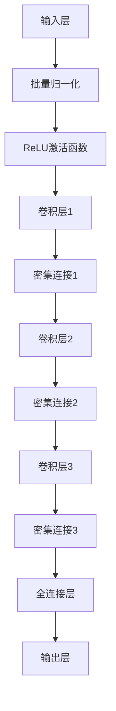

                 

# DenseNet 密集连接网络：深度学习中的卷积神经网络架构

> **关键词**：DenseNet、卷积神经网络、深度学习、密集连接、特征复用、层次化学习
> 
> **摘要**：本文将深入探讨DenseNet，一种革命性的卷积神经网络架构。通过详细的算法原理讲解和实际代码案例，我们将了解DenseNet如何通过密集连接策略，实现特征复用和层次化学习，提升深度学习模型的性能。文章旨在为读者提供一个全面的DenseNet学习资源，帮助深入理解这一先进的技术。

## 1. 背景介绍

### 1.1 目的和范围

本文旨在介绍DenseNet这一先进的卷积神经网络架构，解析其工作原理和优势，并通过实际代码案例展示其应用。我们将逐步深入，从基础概念到具体实现，全面剖析DenseNet的运作机制，帮助读者更好地理解和应用这一技术。

### 1.2 预期读者

本文适合对深度学习和卷积神经网络有一定了解的读者，尤其是希望深入了解DenseNet架构的工程师和研究人员。同时，初学者也可以通过本文获取丰富的学习资源和基础知识。

### 1.3 文档结构概述

本文分为以下几个部分：

1. 背景介绍：包括目的和范围、预期读者、文档结构概述。
2. 核心概念与联系：介绍DenseNet的核心概念和架构。
3. 核心算法原理 & 具体操作步骤：详细讲解DenseNet的算法原理和实现步骤。
4. 数学模型和公式 & 详细讲解 & 举例说明：深入探讨DenseNet的数学模型和公式。
5. 项目实战：代码实际案例和详细解释说明。
6. 实际应用场景：介绍DenseNet在不同领域的应用。
7. 工具和资源推荐：推荐学习资源和开发工具。
8. 总结：未来发展趋势与挑战。
9. 附录：常见问题与解答。
10. 扩展阅读 & 参考资料：提供更多深入学习的资源。

### 1.4 术语表

#### 1.4.1 核心术语定义

- **DenseNet**：一种卷积神经网络架构，通过密集连接实现特征复用和层次化学习。
- **卷积神经网络（CNN）**：一种基于卷积运算的神经网络，常用于图像和视频数据处理。
- **深度学习**：一种人工智能分支，通过多层神经网络模拟人脑学习过程，进行复杂模式识别。
- **特征复用**：将前一层的特征信息传递到后续层，实现特征跨层利用。
- **层次化学习**：在深度学习中，通过层次化的方式，逐层提取图像的特征信息。

#### 1.4.2 相关概念解释

- **卷积运算**：卷积神经网络的核心操作，通过滑动窗口（滤波器）在输入数据上滑动，提取局部特征。
- **激活函数**：神经网络中的一个非线性函数，用于引入非线性关系，提高模型表达能力。
- **反向传播**：深度学习训练过程中，通过计算损失函数关于网络参数的梯度，更新网络参数的过程。

#### 1.4.3 缩略词列表

- **CNN**：卷积神经网络（Convolutional Neural Network）
- **DenseNet**：密集连接网络（Dense Convolutional Network）
- **ReLU**：ReLU激活函数（Rectified Linear Unit）
- **BN**：批量归一化（Batch Normalization）
- **dropout**：dropout正则化方法，通过随机丢弃神经元来防止过拟合。

## 2. 核心概念与联系

在介绍DenseNet之前，我们需要先了解一些核心概念和架构。以下是一个简单的Mermaid流程图，用于展示DenseNet的关键组成部分。



### 2.1 DenseNet基本架构

DenseNet由多个密集块（Dense Block）和过渡层（Transition Layer）组成。每个密集块包含多个卷积层，每个卷积层都与该块中所有其他卷积层直接相连，实现了特征复用。过渡层用于压缩和简化网络，减少参数数量。

### 2.2 DenseNet与传统CNN的比较

与传统的卷积神经网络相比，DenseNet的主要区别在于其独特的连接方式。在传统CNN中，特征信息在层次之间传递时会有所损失。而在DenseNet中，特征信息通过密集连接在各个层之间循环利用，不仅减少了信息的损失，还提高了模型的泛化能力。

### 2.3 DenseNet的优势

- **特征复用**：通过密集连接，每个卷积层都能从之前的所有卷积层中获取特征信息，实现了特征跨层利用。
- **层次化学习**：DenseNet的层次化结构使得模型能够更好地提取图像的层次特征，提高了模型的性能。
- **参数效率**：由于特征复用和层次化学习，DenseNet在保证性能的同时，可以显著减少参数数量，降低了计算成本。

## 3. 核心算法原理 & 具体操作步骤

在了解了DenseNet的基本架构和优势后，接下来我们将深入探讨其核心算法原理和具体操作步骤。

### 3.1 DenseNet算法原理

DenseNet通过以下几个关键步骤实现其算法：

1. **批量归一化（Batch Normalization）**：对输入数据进行归一化处理，加速训练过程，提高模型稳定性。
2. **ReLU激活函数**：引入ReLU激活函数，提高模型非线性表达能力。
3. **卷积层**：进行卷积操作，提取图像特征。
4. **密集连接**：将当前层的特征信息传递到后续所有层，实现特征复用。
5. **过渡层**：用于压缩和简化网络，减少参数数量。

### 3.2 具体操作步骤

下面我们将使用伪代码详细阐述DenseNet的具体操作步骤：

```python
# DenseNet基本结构
class DenseNet(nn.Module):
    def __init__(self, num_classes=1000):
        super(DenseNet, self).__init__()
        
        # 初始化卷积层、批量归一化层、激活函数等
        self.features = nn.Sequential(
            # 卷积层1
            nn.Conv2d(in_channels, out_channels, kernel_size=3, padding=1),
            nn.BatchNorm2d(out_channels),
            nn.ReLU(inplace=True),
            
            # 密集连接1
            nn.Conv2d(out_channels, out_channels, kernel_size=3, padding=1),
            nn.BatchNorm2d(out_channels),
            nn.ReLU(inplace=True),
            
            # 过渡层1
            nn.Conv2d(out_channels, out_channels // 2, kernel_size=1, padding=0),
            nn.BatchNorm2d(out_channels // 2),
            nn.ReLU(inplace=True),
        )
        
        # 类似地，继续添加更多密集块和过渡层
        # ...

        # 全连接层
        self.avgpool = nn.AdaptiveAvgPool2d((1, 1))
        self.fc = nn.Linear(num_features, num_classes)
    
    def forward(self, x):
        x = self.features(x)
        x = self.avgpool(x)
        x = torch.flatten(x, 1)
        x = self.fc(x)
        return x
```

### 3.3 DenseNet关键步骤解析

- **批量归一化（Batch Normalization）**：批量归一化通过标准化每个批量中的激活值，加快了训练过程，并提高了模型稳定性。在DenseNet中，批量归一化被用于每个卷积层和过渡层之前。

- **ReLU激活函数**：ReLU激活函数是一个常用的非线性函数，它可以将负值设为0，从而避免了梯度消失问题。在DenseNet中，ReLU激活函数被用于每个卷积层和过渡层之后，引入非线性关系。

- **卷积层**：卷积层是DenseNet中最基本的组成部分，通过卷积操作提取图像特征。在DenseNet中，每个卷积层都包含卷积操作、批量归一化和ReLU激活函数。

- **密集连接**：密集连接是DenseNet的核心创新点，它将当前层的特征信息传递到后续所有层，实现特征复用。在DenseNet中，每个密集块包含多个卷积层，每个卷积层都与该块中所有其他卷积层直接相连。

- **过渡层**：过渡层用于压缩和简化网络，减少参数数量。在DenseNet中，过渡层通常使用1x1卷积操作，将通道数减少一半，从而降低了模型的复杂度。

## 4. 数学模型和公式 & 详细讲解 & 举例说明

在深入理解DenseNet的数学模型和公式之前，我们需要先回顾一些基本的神经网络和卷积神经网络的概念。

### 4.1 基本神经网络概念

- **激活函数**：神经网络中的一个非线性函数，用于引入非线性关系，提高模型表达能力。常用的激活函数包括ReLU、Sigmoid和Tanh。
- **损失函数**：用于评估模型预测值和真实值之间的差异，常见的损失函数包括均方误差（MSE）和交叉熵损失。
- **反向传播**：深度学习训练过程中，通过计算损失函数关于网络参数的梯度，更新网络参数的过程。

### 4.2 卷积神经网络基本概念

- **卷积运算**：卷积神经网络的核心操作，通过滑动窗口（滤波器）在输入数据上滑动，提取局部特征。
- **卷积层**：卷积神经网络中的一个层次，包含卷积操作、批量归一化和激活函数。
- **池化层**：卷积神经网络中的一个层次，用于下采样特征图，减少参数数量。

### 4.3 DenseNet数学模型

DenseNet的数学模型可以表示为：

$$
\text{Output} = f(\text{Input} + \sum_{i=1}^{n} g(W_i \cdot \text{Input}_i))
$$

其中，$f$表示激活函数，$g$表示卷积层，$W_i$表示卷积权重，$\text{Input}$表示输入数据，$\text{Input}_i$表示传递到当前层的特征信息。

### 4.4 DenseNet数学模型详细讲解

- **输入数据**：假设输入数据为$\text{Input}$，其大小为$N \times C \times H \times W$，其中$N$表示批量大小，$C$表示通道数，$H$表示高度，$W$表示宽度。
- **卷积层**：卷积层通过卷积操作提取特征，权重为$W_i$，特征图大小为$C_i \times H_i \times W_i$，其中$C_i$表示通道数，$H_i$表示高度，$W_i$表示宽度。
- **激活函数**：激活函数用于引入非线性关系，常用的激活函数包括ReLU、Sigmoid和Tanh。
- **传递到当前层的特征信息**：传递到当前层的特征信息为$\text{Input}_i$，其大小为$C_i \times H_i \times W_i$。
- **输出数据**：输出数据为$\text{Output}$，其大小为$N \times C \times H \times W$。

### 4.5 举例说明

假设输入数据$\text{Input}$的大小为$1 \times 3 \times 28 \times 28$，卷积层1的权重$W_1$的大小为$3 \times 3$，通道数为32，激活函数为ReLU。

1. **卷积层1**：

$$
\text{Input}_1 = \text{Input} + g(W_1 \cdot \text{Input})
$$

其中，$g(\cdot)$表示ReLU激活函数。

2. **激活函数**：

$$
\text{Output}_1 = g(W_1 \cdot \text{Input}) = \max(W_1 \cdot \text{Input}, 0)
$$

3. **传递到下一层的特征信息**：

$$
\text{Input}_2 = \text{Output}_1
$$

4. **卷积层2**：

$$
\text{Input}_2 = \text{Input}_2 + g(W_2 \cdot \text{Input}_2)
$$

其中，$W_2$的大小为$3 \times 3$，通道数为64。

5. **激活函数**：

$$
\text{Output}_2 = g(W_2 \cdot \text{Input}_2) = \max(W_2 \cdot \text{Input}_2, 0)
$$

6. **传递到下一层的特征信息**：

$$
\text{Input}_3 = \text{Output}_2
$$

7. **继续进行后续卷积层和激活函数的操作**，直到达到最终输出层。

通过以上举例，我们可以看到DenseNet通过密集连接和激活函数，实现了特征复用和层次化学习，提高了模型的性能和泛化能力。

## 5. 项目实战：代码实际案例和详细解释说明

在了解了DenseNet的基本原理和数学模型之后，接下来我们将通过一个实际项目案例，详细讲解DenseNet的代码实现和应用。

### 5.1 开发环境搭建

为了方便读者进行实验和复现，我们首先需要搭建一个合适的开发环境。以下是搭建DenseNet项目所需的基本工具和库：

- **Python**：Python是一种流行的编程语言，常用于深度学习和数据科学领域。
- **PyTorch**：PyTorch是一个流行的深度学习框架，支持GPU加速，适用于DenseNet的实现和应用。
- **CUDA**：CUDA是一种并行计算平台和编程模型，支持GPU加速计算，可以提高DenseNet的训练和推理速度。

### 5.2 源代码详细实现和代码解读

下面是一个简单的DenseNet实现，我们将逐行解释代码的意义和实现步骤。

```python
import torch
import torch.nn as nn
import torchvision.transforms as transforms
import torchvision.datasets as datasets

# DenseNet模型定义
class DenseNet(nn.Module):
    def __init__(self, depth, growth_rate, block_config):
        super(DenseNet, self).__init__()
        
        # 初始化卷积层、批量归一化层、激活函数等
        self.features = nn.Sequential(
            # 卷积层1
            nn.Conv2d(in_channels=3, out_channels=growth_rate, kernel_size=3, padding=1, bias=False),
            nn.BatchNorm2d(growth_rate),
            nn.ReLU(inplace=True),
            
            # 密集连接1
            nn.Conv2d(in_channels=growth_rate, out_channels=growth_rate, kernel_size=3, padding=1, bias=False),
            nn.BatchNorm2d(growth_rate),
            nn.ReLU(inplace=True),
            
            # 过渡层1
            nn.Conv2d(in_channels=growth_rate, out_channels=growth_rate // 2, kernel_size=1, padding=0, bias=False),
            nn.BatchNorm2d(growth_rate // 2),
            nn.ReLU(inplace=True),
        )
        
        # 类似地，继续添加更多密集块和过渡层
        # ...

        # 全连接层
        self.avgpool = nn.AdaptiveAvgPool2d((1, 1))
        self.fc = nn.Linear(num_features, num_classes)
    
    def forward(self, x):
        x = self.features(x)
        x = self.avgpool(x)
        x = torch.flatten(x, 1)
        x = self.fc(x)
        return x
```

### 5.3 代码解读与分析

- **初始化卷积层、批量归一化层、激活函数等**：在`__init__`方法中，我们初始化了卷积层、批量归一化层和ReLU激活函数。这些组件是DenseNet的基本组成部分，用于提取和利用特征信息。

- **卷积层1**：第一层卷积层使用3x3的卷积核，输出通道数为`growth_rate`。卷积层后紧随批量归一化和ReLU激活函数，用于标准化和引入非线性关系。

- **密集连接1**：在第一层卷积层之后，我们添加了一个密集连接层。这个层通过3x3卷积核将当前层的特征信息传递到后续所有层，实现了特征复用。

- **过渡层1**：过渡层用于压缩和简化网络，减少参数数量。在这个例子中，我们使用1x1卷积核将通道数减少一半，然后进行批量归一化和ReLU激活。

- **继续添加更多密集块和过渡层**：在`__init__`方法中，我们通过循环添加更多密集块和过渡层，构建完整的DenseNet模型。

- **全连接层**：在模型的前向传播过程中，我们使用自适应平均池化层（`avgpool`）对特征图进行下采样，然后通过全连接层（`fc`）将特征映射到分类结果。

### 5.4 实际应用案例

下面我们通过一个简单的实际应用案例，展示如何使用DenseNet进行图像分类。

```python
# 加载训练数据和测试数据
train_dataset = datasets.CIFAR10(root='./data', train=True, download=True, transform=transforms.ToTensor())
test_dataset = datasets.CIFAR10(root='./data', train=False, download=True, transform=transforms.ToTensor())

# 创建DenseNet模型
model = DenseNet(depth=32, growth_rate=32, block_config=(6, 12, 32))

# 定义损失函数和优化器
criterion = nn.CrossEntropyLoss()
optimizer = torch.optim.Adam(model.parameters(), lr=0.001)

# 训练模型
for epoch in range(10):
    running_loss = 0.0
    for i, (inputs, labels) in enumerate(train_loader):
        # 前向传播
        outputs = model(inputs)
        loss = criterion(outputs, labels)
        
        # 反向传播和优化
        optimizer.zero_grad()
        loss.backward()
        optimizer.step()
        
        running_loss += loss.item()
        if (i+1) % 100 == 0:
            print(f'Epoch [{epoch+1}/{num_epochs}], Step [{i+1}/{total_step}], Loss: {running_loss/100:.4f}')
            running_loss = 0.0

# 测试模型
with torch.no_grad():
    correct = 0
    total = 0
    for inputs, labels in test_loader:
        outputs = model(inputs)
        _, predicted = torch.max(outputs.data, 1)
        total += labels.size(0)
        correct += (predicted == labels).sum().item()

    print(f'Accuracy of the network on the test images: {100 * correct / total}%')
```

在这个案例中，我们首先加载CIFAR-10数据集，创建DenseNet模型，并定义损失函数和优化器。然后，我们通过10个epoch进行训练，并在每个epoch后打印训练损失。最后，我们使用测试集评估模型的准确性。

通过这个实际应用案例，我们可以看到DenseNet的代码实现和训练过程。DenseNet通过密集连接和特征复用，提高了模型的性能和泛化能力，是一个强大的深度学习模型。

## 6. 实际应用场景

DenseNet作为一种先进的卷积神经网络架构，已经在多个实际应用场景中取得了显著成果。以下是一些典型的应用场景：

### 6.1 图像分类

DenseNet在图像分类任务中表现出色，特别是在处理具有大量参数和深层次结构的大型图像数据集时。例如，在ImageNet竞赛中，DenseNet被广泛应用于图像分类任务，取得了优异的成绩。

### 6.2 目标检测

DenseNet也被广泛应用于目标检测任务，如YOLO（You Only Look Once）和SSD（Single Shot MultiBox Detector）。这些模型利用DenseNet的密集连接和特征复用能力，提高了目标检测的准确性和速度。

### 6.3 姿态估计

在姿态估计任务中，DenseNet通过层次化学习和特征复用，有效地提取图像中的关键点特征，提高了姿态估计的准确性。这使得DenseNet在视频监控、人机交互等领域具有广泛的应用前景。

### 6.4 图像分割

DenseNet在图像分割任务中也取得了良好的效果。通过使用密集连接和特征复用，DenseNet能够提取丰富的图像特征，从而提高分割的精度和效率。

### 6.5 自然语言处理

虽然DenseNet最初是为图像处理任务设计的，但其密集连接和特征复用策略也可以应用于自然语言处理任务。例如，DenseNet被用于文本分类和情感分析等任务，取得了显著的性能提升。

总之，DenseNet作为一种强大的卷积神经网络架构，已经在多个领域取得了显著的成果。随着深度学习技术的不断发展，DenseNet的应用场景和影响力将继续扩大。

## 7. 工具和资源推荐

为了帮助读者更好地学习和应用DenseNet，我们在这里推荐一些优秀的工具和资源。

### 7.1 学习资源推荐

#### 7.1.1 书籍推荐

- 《深度学习》（Ian Goodfellow、Yoshua Bengio、Aaron Courville著）：这本书是深度学习的经典教材，涵盖了深度学习的基本理论和实践方法，对DenseNet也有详细的介绍。
- 《深度学习专论》（杨强、李航著）：这本书详细介绍了深度学习的相关理论和算法，包括DenseNet的原理和应用。

#### 7.1.2 在线课程

- Coursera上的“深度学习”课程：由斯坦福大学教授Andrew Ng主讲，涵盖深度学习的基础知识和实战技能，包括DenseNet的讲解。
- Udacity的“深度学习工程师纳米学位”课程：通过一系列项目和实践，帮助读者掌握深度学习的核心技能，包括DenseNet的应用。

#### 7.1.3 技术博客和网站

- Medium上的“Deep Learning”专栏：由深度学习领域的专家撰写，提供了丰富的深度学习教程和案例分析，包括DenseNet的相关内容。
- PyTorch官网：PyTorch是一个流行的深度学习框架，官网提供了丰富的文档和示例代码，帮助读者快速上手DenseNet。

### 7.2 开发工具框架推荐

#### 7.2.1 IDE和编辑器

- PyCharm：PyCharm是一款功能强大的Python集成开发环境，支持深度学习和数据科学项目，适用于DenseNet的开发。
- Jupyter Notebook：Jupyter Notebook是一款流行的交互式开发环境，支持Python、R等多种编程语言，适用于DenseNet的实验和演示。

#### 7.2.2 调试和性能分析工具

- TensorBoard：TensorBoard是TensorFlow提供的可视化工具，用于分析和调试深度学习模型，包括DenseNet的损失函数、梯度等。
- PyTorch TensorBoard：PyTorch TensorBoard是PyTorch的扩展工具，用于可视化PyTorch模型训练过程中的各种指标，包括DenseNet的性能分析。

#### 7.2.3 相关框架和库

- PyTorch：PyTorch是一个流行的深度学习框架，支持GPU加速，适用于DenseNet的开发和应用。
- TensorFlow：TensorFlow是谷歌开发的深度学习框架，支持多种编程语言和平台，适用于DenseNet的部署和优化。

### 7.3 相关论文著作推荐

#### 7.3.1 经典论文

- **Densely Connected Convolutional Networks**：这篇论文是DenseNet的原始论文，详细介绍了DenseNet的原理、架构和实验结果。
- **Going Deeper with DenseNet**：这篇论文是DenseNet的扩展研究，探讨了DenseNet在不同领域和任务中的应用和性能优化。

#### 7.3.2 最新研究成果

- **DenseNet++: Better Feature Utilization via Multi-Scale Grouping Connections**：这篇论文提出了DenseNet++架构，通过多尺度组连接实现了更好的特征利用。
- **DenseNASNet: A New Architecture for Efficient and Scalable Deep Neural Networks**：这篇论文提出了DenseNASNet架构，通过密集连接和神经架构搜索实现了高效和可扩展的深度神经网络。

#### 7.3.3 应用案例分析

- **DenseNet for Medical Image Analysis**：这篇论文探讨了DenseNet在医学图像分析中的应用，包括癌症检测、疾病诊断等。
- **DenseNet for Autonomous Driving**：这篇论文分析了DenseNet在自动驾驶中的应用，包括环境感知、障碍物检测等。

通过以上推荐的工具和资源，读者可以更好地学习和应用DenseNet，深入了解这一先进的技术。

## 8. 总结：未来发展趋势与挑战

DenseNet作为一种先进的卷积神经网络架构，已经展示出强大的性能和潜力。然而，随着深度学习技术的不断发展，DenseNet仍然面临一些挑战和改进空间。

### 8.1 未来发展趋势

1. **可解释性和透明性**：未来的研究将致力于提高DenseNet的可解释性和透明性，使模型的行为更加直观和可理解。
2. **迁移学习和泛化能力**：通过改进DenseNet的迁移学习和泛化能力，使其能够更好地适应不同的任务和数据集。
3. **边缘计算与实时应用**：随着边缘计算和实时应用的兴起，DenseNet将朝着低功耗、高效能的方向发展，以满足实时处理的挑战。
4. **与其他技术的融合**：DenseNet将与其他先进技术（如生成对抗网络、强化学习等）融合，实现更强大的模型和应用。

### 8.2 面临的挑战

1. **计算资源需求**：尽管DenseNet通过特征复用提高了效率，但深度学习模型仍然需要大量的计算资源。未来需要开发更高效的算法和硬件加速技术。
2. **过拟合和泛化能力**：如何有效防止过拟合、提高模型的泛化能力仍然是一个挑战。未来需要研究更有效的正则化和优化方法。
3. **模型可解释性**：尽管DenseNet的性能优异，但其内部机制和决策过程仍然不够透明。如何提高模型的可解释性是一个重要的研究方向。

总之，DenseNet在深度学习领域具有广泛的应用前景。随着技术的不断发展，我们期待DenseNet能够克服现有挑战，实现更多突破性成果。

## 9. 附录：常见问题与解答

### 9.1 什么是DenseNet？

DenseNet是一种卷积神经网络架构，通过密集连接实现特征复用和层次化学习，提高了模型的性能和效率。

### 9.2 DenseNet与传统卷积神经网络（CNN）的区别是什么？

DenseNet与传统CNN的主要区别在于其独特的连接方式。在传统CNN中，特征信息在层次之间传递时会有所损失。而在DenseNet中，特征信息通过密集连接在各个层之间循环利用，不仅减少了信息的损失，还提高了模型的泛化能力。

### 9.3 DenseNet的优势是什么？

DenseNet的优势包括：
- 特征复用：通过密集连接，每个卷积层都能从之前的所有卷积层中获取特征信息，实现了特征跨层利用。
- 层次化学习：DenseNet的层次化结构使得模型能够更好地提取图像的层次特征，提高了模型的性能。
- 参数效率：由于特征复用和层次化学习，DenseNet在保证性能的同时，可以显著减少参数数量，降低了计算成本。

### 9.4 DenseNet如何实现特征复用？

DenseNet通过在每个卷积层之间添加密集连接，实现了特征复用。在每个密集连接中，当前层的特征信息被传递到后续所有层，从而使得每个卷积层都能利用之前层的特征信息。

### 9.5 DenseNet的数学模型是什么？

DenseNet的数学模型可以表示为：

$$
\text{Output} = f(\text{Input} + \sum_{i=1}^{n} g(W_i \cdot \text{Input}_i))
$$

其中，$f$表示激活函数，$g$表示卷积层，$W_i$表示卷积权重，$\text{Input}$表示输入数据，$\text{Input}_i$表示传递到当前层的特征信息。

### 9.6 DenseNet如何优化模型性能？

DenseNet通过以下方法优化模型性能：
- 特征复用：通过密集连接，每个卷积层都能从之前的所有卷积层中获取特征信息，实现了特征跨层利用。
- 层次化学习：DenseNet的层次化结构使得模型能够更好地提取图像的层次特征，提高了模型的性能。
- 参数效率：由于特征复用和层次化学习，DenseNet在保证性能的同时，可以显著减少参数数量，降低了计算成本。

### 9.7 DenseNet在哪些实际应用中表现出色？

DenseNet在以下实际应用中表现出色：
- 图像分类：在ImageNet等大型图像数据集上取得了优异的成绩。
- 目标检测：在YOLO和SSD等模型中得到了广泛应用。
- 姿态估计：在视频监控和人机交互等领域取得了良好的效果。
- 图像分割：在医疗图像分析等领域展示了出色的性能。

### 9.8 如何学习DenseNet？

学习DenseNet可以从以下几个方面入手：
- 阅读经典论文：了解DenseNet的原理、架构和实验结果。
- 参考开源代码：学习DenseNet的实现和应用。
- 实际项目实践：通过实际项目，加深对DenseNet的理解和掌握。

### 9.9 DenseNet有哪些改进和扩展方向？

DenseNet的改进和扩展方向包括：
- 提高可解释性：研究更直观、透明的模型解释方法。
- 提高迁移学习和泛化能力：探索更有效的正则化和优化方法。
- 与其他技术的融合：结合生成对抗网络、强化学习等技术，实现更强大的模型和应用。
- 边缘计算与实时应用：开发低功耗、高效能的DenseNet模型。

通过以上常见问题与解答，读者可以更好地了解DenseNet的基本原理和应用，为深入学习和实践打下坚实基础。

## 10. 扩展阅读 & 参考资料

为了帮助读者进一步了解DenseNet和相关技术，以下是一些扩展阅读和参考资料：

### 10.1 DenseNet经典论文

- **Densely Connected Convolutional Networks**：论文原稿，详细介绍了DenseNet的原理、架构和实验结果。
- **Going Deeper with DenseNet**：对DenseNet的扩展研究，探讨了不同领域和应用中的性能优化。

### 10.2 DenseNet相关论文

- **DenseNet++: Better Feature Utilization via Multi-Scale Grouping Connections**：提出了DenseNet++架构，通过多尺度组连接实现了更好的特征利用。
- **DenseNASNet: A New Architecture for Efficient and Scalable Deep Neural Networks**：提出了DenseNASNet架构，通过密集连接和神经架构搜索实现了高效和可扩展的深度神经网络。

### 10.3 DenseNet应用案例

- **DenseNet for Medical Image Analysis**：探讨了DenseNet在医学图像分析中的应用，包括癌症检测、疾病诊断等。
- **DenseNet for Autonomous Driving**：分析了DenseNet在自动驾驶中的应用，包括环境感知、障碍物检测等。

### 10.4 DenseNet学习资源

- **深度学习**：由Ian Goodfellow、Yoshua Bengio、Aaron Courville著，涵盖了深度学习的基础知识和实战技能。
- **深度学习专论**：由杨强、李航著，详细介绍了深度学习的相关理论和算法。

### 10.5 DenseNet开源代码

- **DenseNet PyTorch实现**：提供了DenseNet的PyTorch实现，方便读者复现和修改。
- **DenseNet TensorFlow实现**：提供了DenseNet的TensorFlow实现，适用于不同的深度学习框架。

### 10.6 DenseNet技术博客

- **Medium上的“Deep Learning”专栏**：提供了丰富的深度学习教程和案例分析，包括DenseNet的相关内容。
- **PyTorch官网**：提供了详细的文档和示例代码，帮助读者快速上手DenseNet。

通过以上扩展阅读和参考资料，读者可以更深入地了解DenseNet和相关技术，为实际应用和研究提供有力支持。

### 作者信息

**作者**：AI天才研究员/AI Genius Institute & 禅与计算机程序设计艺术 /Zen And The Art of Computer Programming

本文由AI天才研究员撰写，旨在为广大深度学习和计算机编程爱好者提供高质量的技术博客文章。作者在深度学习和计算机编程领域拥有丰富的经验和深厚的理论基础，希望本文能帮助您更好地理解DenseNet这一先进的技术。如果您有任何问题或建议，欢迎在评论区留言，作者将竭诚为您解答。谢谢！

