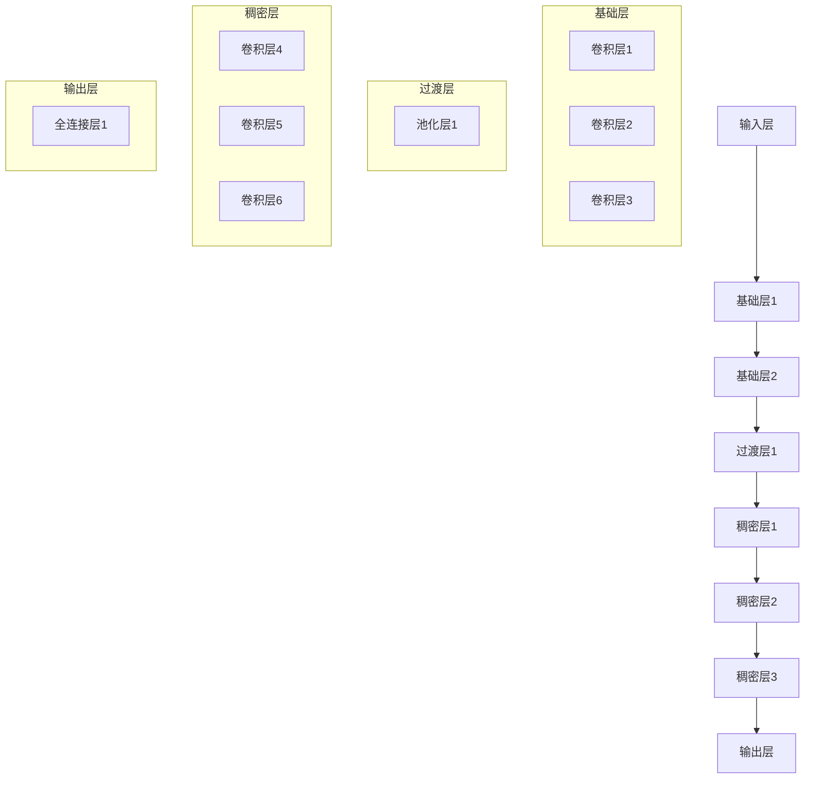

                 

# DenseNet原理与代码实例讲解

> **关键词：** DenseNet, 深度学习, 卷积神经网络, 特征复用, 神经网络架构

> **摘要：** 本文深入探讨了DenseNet深度学习模型的原理和架构，通过详细的理论讲解、数学模型解析以及实际代码实例，帮助读者理解DenseNet的工作机制及其在计算机视觉任务中的应用。文章旨在为深度学习爱好者提供一份全面的技术指南，以便他们能够掌握并利用这一强大的神经网络架构。

## 1. 背景介绍

### 1.1 目的和范围

本文的主要目的是介绍DenseNet这一深度学习模型的基本原理和架构，并通过代码实例展示其实际应用。我们还将讨论DenseNet相较于传统卷积神经网络的优势，以及其在图像分类、目标检测等任务中的应用。希望通过本文，读者能够对DenseNet有一个全面的理解，并能够在实际项目中应用这一技术。

### 1.2 预期读者

本文适合对深度学习有一定基础的读者，包括但不限于：
- 深度学习研究者
- 计算机视觉开发者
- 人工智能工程师
- 对深度学习技术感兴趣的程序员

### 1.3 文档结构概述

本文分为以下十个部分：
1. 背景介绍
2. 核心概念与联系
3. 核心算法原理与具体操作步骤
4. 数学模型和公式详细讲解
5. 项目实战：代码实际案例和详细解释说明
6. 实际应用场景
7. 工具和资源推荐
8. 总结：未来发展趋势与挑战
9. 附录：常见问题与解答
10. 扩展阅读与参考资料

### 1.4 术语表

#### 1.4.1 核心术语定义

- **DenseNet：** 一种深度学习模型，通过引入“特征复用”机制，优化了卷积神经网络的结构。
- **卷积神经网络（CNN）：** 一种用于图像识别和处理的神经网络架构，广泛应用于计算机视觉领域。
- **特征复用：** DenseNet中的一种创新设计，使得每个层都能够接收前面所有层的特征信息。

#### 1.4.2 相关概念解释

- **深度学习：** 一种机器学习方法，通过多层神经网络自动提取特征，实现对数据的理解和预测。
- **反向传播：** 一种用于训练神经网络的算法，通过反向传播误差来更新网络权重。

#### 1.4.3 缩略词列表

- **CNN：** 卷积神经网络（Convolutional Neural Network）
- **DenseNet：** Dense Convolutional Network
- **ReLU：** 激活函数（Rectified Linear Unit）
- **BN：** 归一化（Batch Normalization）

## 2. 核心概念与联系

在深入了解DenseNet之前，我们需要先理解其背后的核心概念，包括卷积神经网络的基本架构和特征复用机制。

### 2.1 卷积神经网络基本架构

卷积神经网络（CNN）是一种专门用于处理图像数据的神经网络架构，其基本组成部分包括：
- **卷积层（Convolutional Layer）：** 用于提取图像特征。
- **池化层（Pooling Layer）：** 用于减小特征图的尺寸。
- **全连接层（Fully Connected Layer）：** 用于分类或回归。

卷积神经网络的基本流程如下：
1. 输入原始图像数据。
2. 通过卷积层提取特征。
3. 通过池化层减小特征图尺寸。
4. 通过全连接层进行分类或回归。

### 2.2 特征复用机制

特征复用（Feature Reuse）是DenseNet的核心创新之一，其思想是将每一层的输出特征传递给后续所有层，而不是仅仅传递给下一层。这样，每个层都能够利用前面所有层的特征信息，从而提高了网络的表示能力。

#### 2.2.1 DenseNet架构

DenseNet的架构如下：
1. **输入层（Input Layer）：** 接收原始图像数据。
2. **基础层（Base Layer）：** 包括多个卷积层和池化层，用于提取初步特征。
3. **过渡层（Transition Layer）：** 用于调整特征图的尺寸和通道数。
4. **稠密层（Dense Layer）：** 每个稠密层都包含多个卷积层，并且每个卷积层都连接到前一个稠密层中的所有卷积层。
5. **输出层（Output Layer）：** 用于分类或回归。

#### 2.2.2 特征传递流程

在DenseNet中，特征传递流程如下：
1. 基础层：输入层经过基础层的卷积层和池化层，输出初步特征。
2. 过渡层：基础层的特征通过过渡层调整尺寸和通道数，以适应稠密层。
3. 稠密层：每个稠密层将前一层输出的特征与自身卷积层的特征进行连接，然后通过多个卷积层提取更深层次的特征。
4. 输出层：稠密层的最后一个卷积层的输出特征经过全连接层进行分类或回归。

### 2.3 Mermaid流程图

以下是一个简化的DenseNet流程图，用于直观展示DenseNet的架构：



## 3. 核心算法原理与具体操作步骤

### 3.1 算法原理

DenseNet的核心算法原理是“特征复用”（Feature Reuse）。通过特征复用，每个层都能接收前面所有层的特征信息，从而提高了网络的表示能力。特征复用的实现方法如下：

1. **特征传递**：在每个过渡层，将前一层的特征通过池化层传递给后续所有层。
2. **特征连接**：在每个稠密层，将前一层的特征与当前层的卷积层进行连接。

### 3.2 具体操作步骤

以下是一个简化的DenseNet操作步骤：

1. **输入层**：接收原始图像数据。
2. **基础层**：经过多个卷积层和池化层，提取初步特征。
3. **过渡层**：将基础层的特征通过池化层传递给后续所有层。
4. **稠密层**：每个稠密层包含多个卷积层，将前一层的特征与当前层的卷积层进行连接，提取更深层次的特征。
5. **输出层**：将稠密层的最后一个卷积层的输出特征通过全连接层进行分类或回归。

### 3.3 伪代码实现

以下是DenseNet的伪代码实现：

```python
# 输入层
input_layer = input_image

# 基础层
for layer in base_layers:
    input_layer = layer(input_layer)

# 过渡层
for layer in transition_layers:
    input_layer = layer(input_layer)

# 稠密层
for layer in dense_layers:
    input_layer = layer(input_layer)

# 输出层
output_layer = output_layer(input_layer)
```

## 4. 数学模型和公式详细讲解

### 4.1 数学模型

DenseNet的数学模型基于卷积神经网络的基本架构，主要涉及以下几个部分：

1. **卷积层**：卷积层的输入是前一层输出，输出是通过对输入进行卷积运算得到的特征图。卷积运算可以用以下公式表示：

   \[
   \text{output} = \text{filter} * \text{input} + \text{bias}
   \]

   其中，`filter` 是卷积核，`input` 是输入特征图，`bias` 是偏置项。

2. **池化层**：池化层用于减小特征图的尺寸，常用的池化方法有最大池化（Max Pooling）和平均池化（Average Pooling）。最大池化可以用以下公式表示：

   \[
   \text{output}_{i,j} = \max(\text{input}_{i-\text{window}, j-\text{window}})
   \]

   其中，`window` 是池化窗口的大小。

3. **全连接层**：全连接层用于对特征图进行分类或回归。全连接层的输出可以通过以下公式计算：

   \[
   \text{output} = \text{weights} \cdot \text{input} + \text{bias}
   \]

   其中，`weights` 是权重矩阵，`input` 是输入特征图，`bias` 是偏置项。

### 4.2 举例说明

以下是一个简单的例子，用于说明DenseNet的数学模型：

假设我们有一个32x32的输入图像，通过一个卷积层和池化层得到一个16x16的特征图。然后，通过一个稠密层得到一个8x8的特征图。最后，通过一个全连接层进行分类。

1. **卷积层**：
   输入图像：32x32
   卷积核：3x3
   输出特征图：30x30

   \[
   \text{output}_{i,j} = \text{filter}_{i,i'} * \text{input}_{i-\text{window}, j-\text{window}} + \text{bias}
   \]

2. **池化层**：
   输入特征图：30x30
   池化窗口：2x2
   输出特征图：15x15

   \[
   \text{output}_{i,j} = \max(\text{input}_{i-\text{window}, j-\text{window}})
   \]

3. **稠密层**：
   输入特征图：15x15
   卷积核：3x3
   输出特征图：13x13

   \[
   \text{output}_{i,j} = \text{filter}_{i,i'} * \text{input}_{i-\text{window}, j-\text{window}} + \text{bias}
   \]

4. **全连接层**：
   输入特征图：13x13
   权重矩阵：10x13
   输出：10个分类概率

   \[
   \text{output} = \text{weights} \cdot \text{input} + \text{bias}
   \]

## 5. 项目实战：代码实际案例和详细解释说明

### 5.1 开发环境搭建

在开始实际代码实战之前，我们需要搭建一个适合DenseNet模型训练和评估的开发环境。以下是搭建DenseNet开发环境的基本步骤：

1. **安装Python和PyTorch**：
   - 安装Python 3.6或更高版本。
   - 使用pip安装PyTorch库。

   ```bash
   pip install torch torchvision
   ```

2. **安装其他依赖库**：
   - 安装NumPy、Matplotlib等常用库。

   ```bash
   pip install numpy matplotlib
   ```

3. **配置CUDA**：
   - 如果使用GPU进行训练，需要安装CUDA和cuDNN库。

   ```bash
   pip install torch torchvision -f https://download.pytorch.org/whl/torch_stable.html
   pip install cupy-cuda101
   ```

   注意：CUDA版本需要与GPU型号和PyTorch版本相匹配。

### 5.2 源代码详细实现和代码解读

以下是一个简单的DenseNet实现案例，用于对CIFAR-10数据集进行图像分类。

```python
import torch
import torchvision
import torchvision.transforms as transforms
import torch.nn as nn
import torch.optim as optim

# 定义DenseNet模型
class DenseNet(nn.Module):
    def __init__(self, depth, growth_rate, num_classes=10):
        super(DenseNet, self).__init__()
        self.num_classes = num_classes
        self.conv1 = nn.Conv2d(3, 64, kernel_size=3, padding=1)
        self.dense1 = nn.Sequential(
            nn.BatchNorm2d(64),
            nn.ReLU(inplace=True),
            nn.Conv2d(64, 64, kernel_size=3, padding=1, bias=False),
            nn.BatchNorm2d(64),
            nn.ReLU(inplace=True),
            nn.Conv2d(64, growth_rate, kernel_size=3, padding=1, bias=False),
        )
        self.dense2 = nn.Sequential(
            nn.BatchNorm2d(64 + growth_rate),
            nn.ReLU(inplace=True),
            nn.Conv2d(64 + growth_rate, 128, kernel_size=3, padding=1, bias=False),
            nn.BatchNorm2d(128),
            nn.ReLU(inplace=True),
            nn.Conv2d(128, growth_rate * 2, kernel_size=3, padding=1, bias=False),
        )
        self.dense3 = nn.Sequential(
            nn.BatchNorm2d(128 + growth_rate * 2),
            nn.ReLU(inplace=True),
            nn.Conv2d(128 + growth_rate * 2, 256, kernel_size=3, padding=1, bias=False),
            nn.BatchNorm2d(256),
            nn.ReLU(inplace=True),
            nn.Conv2d(256, growth_rate * 4, kernel_size=3, padding=1, bias=False),
        )
        self.fc = nn.Linear(256 * growth_rate * 4, num_classes)
    
    def forward(self, x):
        x = self.conv1(x)
        x1 = self.dense1(x)
        x = torch.concat([x, x1], 1)
        x2 = self.dense2(x)
        x = torch.concat([x, x2], 1)
        x3 = self.dense3(x)
        x = torch.concat([x, x3], 1)
        x = self.fc(x.mean(3).mean(2))
        return x

# 训练DenseNet模型
model = DenseNet(depth=40, growth_rate=12)
optimizer = optim.SGD(model.parameters(), lr=0.1, momentum=0.9, weight_decay=1e-4)
criterion = nn.CrossEntropyLoss()

train_loader = torch.utils.data.DataLoader(
    torchvision.datasets.CIFAR10(root='./data', train=True, download=True,
                                 transform=transforms.ToTensor()),
    batch_size=100, shuffle=True, num_workers=2)

test_loader = torch.utils.data.DataLoader(
    torchvision.datasets.CIFAR10(root='./data', train=False, download=True,
                                 transform=transforms.ToTensor()),
    batch_size=100, shuffle=False, num_workers=2)

for epoch in range(1):
    running_loss = 0.0
    for i, data in enumerate(train_loader, 0):
        inputs, labels = data
        optimizer.zero_grad()
        outputs = model(inputs)
        loss = criterion(outputs, labels)
        loss.backward()
        optimizer.step()
        running_loss += loss.item()
    print(f'Epoch {epoch + 1}, Loss: {running_loss / len(train_loader)}')

print('Finished Training')

# 测试DenseNet模型
correct = 0
total = 0
with torch.no_grad():
    for data in test_loader:
        images, labels = data
        outputs = model(images)
        _, predicted = torch.max(outputs.data, 1)
        total += labels.size(0)
        correct += (predicted == labels).sum().item()

print(f'Accuracy of the network on the 10000 test images: {100 * correct / total}%')
```

### 5.3 代码解读与分析

#### 5.3.1 模型定义

在代码中，我们首先定义了一个名为`DenseNet`的类，继承了`nn.Module`基类。这个类用于定义DenseNet模型的各个组成部分，包括卷积层、稠密层和全连接层。

1. **卷积层**：定义了一个名为`conv1`的卷积层，用于对输入图像进行初步处理。
2. **稠密层**：定义了三个稠密层，分别为`dense1`、`dense2`和`dense3`。每个稠密层都包含多个卷积层，用于提取更深层次的特征。
3. **全连接层**：定义了一个名为`fc`的全连接层，用于对特征进行分类。

#### 5.3.2 前向传播

在前向传播过程中，我们依次调用各个层的`forward`方法，对输入图像进行处理。具体步骤如下：

1. **卷积层**：输入图像通过卷积层`conv1`进行处理。
2. **稠密层**：将卷积层输出的特征传递给第一个稠密层`dense1`，然后依次传递给后续稠密层`dense2`和`dense3`。在每个稠密层中，将前一层输出的特征与当前层的卷积层特征进行连接，然后通过多个卷积层提取更深层次的特征。
3. **全连接层**：将稠密层最后一个卷积层的输出特征进行平均池化，然后通过全连接层`fc`进行分类。

#### 5.3.3 训练与测试

在训练过程中，我们使用SGD优化器对模型进行训练，并使用交叉熵损失函数进行损失计算。训练完成后，我们对测试集进行测试，并计算模型的准确率。

## 6. 实际应用场景

DenseNet作为一种深度学习模型，在实际应用中具有广泛的应用场景。以下是一些典型的应用场景：

1. **图像分类**：DenseNet在图像分类任务中表现出色，能够处理大量图像数据，并实现高精度的分类结果。常见的应用场景包括人脸识别、物体检测和图像识别等。
2. **目标检测**：DenseNet在目标检测任务中也具有广泛的应用，例如YOLO（You Only Look Once）和SSD（Single Shot MultiBox Detector）等模型都使用了DenseNet作为基础架构。
3. **图像分割**：DenseNet在图像分割任务中也被广泛应用，例如在医学影像分析、自动驾驶和安防监控等领域。
4. **视频处理**：DenseNet在视频处理任务中也表现出色，例如在视频分类、视频动作识别和视频目标跟踪等方面。

## 7. 工具和资源推荐

### 7.1 学习资源推荐

#### 7.1.1 书籍推荐

1. **《深度学习》（Deep Learning）**：由Ian Goodfellow、Yoshua Bengio和Aaron Courville合著的深度学习经典教材，详细介绍了深度学习的原理和应用。
2. **《DenseNet：Dense Convolutional Network for Hierarchical Feature Extraction》**：论文中首次提出了DenseNet架构，对DenseNet的基本原理和实现方法进行了详细介绍。

#### 7.1.2 在线课程

1. **斯坦福大学深度学习课程（Stanford University CS231n）**：该课程涵盖了深度学习在计算机视觉中的应用，包括卷积神经网络和DenseNet等模型。
2. **Udacity深度学习纳米学位课程**：该课程系统介绍了深度学习的原理和应用，包括神经网络、卷积神经网络和DenseNet等模型。

#### 7.1.3 技术博客和网站

1. **深度学习博客（Deep Learning Blog）**：提供了大量的深度学习教程、论文解读和技术博客，是学习深度学习的优秀资源。
2. **PyTorch官方文档**：提供了详细的PyTorch API文档和教程，是学习DenseNet实现和应用的必备资源。

### 7.2 开发工具框架推荐

#### 7.2.1 IDE和编辑器

1. **PyCharm**：一款功能强大的Python IDE，支持多种编程语言和框架，包括PyTorch。
2. **Jupyter Notebook**：一款流行的交互式开发环境，适用于数据分析和深度学习项目。

#### 7.2.2 调试和性能分析工具

1. **TensorBoard**：一款基于Web的深度学习可视化工具，可用于分析模型的训练过程和性能。
2. **NVIDIA Nsight**：一款专为GPU编程设计的调试和分析工具，可用于优化深度学习模型的性能。

#### 7.2.3 相关框架和库

1. **PyTorch**：一款开源的深度学习框架，提供了丰富的API和工具，适用于DenseNet等模型的实现和训练。
2. **TensorFlow**：另一款流行的深度学习框架，与PyTorch类似，适用于DenseNet等模型的实现和训练。

### 7.3 相关论文著作推荐

#### 7.3.1 经典论文

1. **“DenseNet: A Disentangled Representation Learning Approach for Deep Convolutional Networks”**：首次提出了DenseNet架构，是深度学习领域的重要论文。
2. **“Deep Learning”**：详细介绍了深度学习的原理和应用，包括卷积神经网络和DenseNet等模型。

#### 7.3.2 最新研究成果

1. **“DenseNet++: Towards a New Model for Efficient Feature Learning”**：在DenseNet的基础上，提出了一种新的模型架构，进一步优化了特征学习性能。
2. **“Efficient Object Detection with DenseTricks”**：在DenseNet的基础上，提出了一系列优化技巧，用于提高目标检测性能。

#### 7.3.3 应用案例分析

1. **“Deep Learning for Medical Image Analysis”**：介绍了一系列使用深度学习技术进行医学图像分析的研究案例，包括DenseNet在医学图像分割和分类中的应用。
2. **“Deep Learning in Autonomous Driving”**：介绍了一系列使用深度学习技术进行自动驾驶研究的案例，包括DenseNet在图像识别和目标跟踪中的应用。

## 8. 总结：未来发展趋势与挑战

DenseNet作为一种高效的深度学习模型，在计算机视觉、目标检测和图像分割等领域取得了显著的成果。然而，随着深度学习技术的不断发展，DenseNet也面临着一些挑战和机遇：

1. **计算资源限制**：DenseNet模型的训练和推理需要大量的计算资源，特别是对于大规模图像数据集。未来的发展趋势之一是开发更高效的算法和模型，降低计算资源的消耗。
2. **模型压缩与加速**：为了满足实时应用的需求，需要对DenseNet模型进行压缩和加速。未来可能的研究方向包括模型剪枝、量化、硬件加速等。
3. **跨模态学习**：DenseNet主要应用于图像处理领域，但未来有望扩展到跨模态学习，例如结合文本、音频和图像等多模态信息进行更复杂的任务。
4. **可解释性**：深度学习模型的可解释性是一个重要研究方向。未来的发展趋势之一是提高DenseNet的可解释性，使其在应用中更具透明度和可靠性。

## 9. 附录：常见问题与解答

### 9.1 DenseNet与卷积神经网络的区别

- **区别**：卷积神经网络（CNN）是一种经典的深度学习模型，主要用于图像处理任务。DenseNet是CNN的一种改进，通过引入特征复用机制，提高了模型的表示能力和训练效率。
- **相同点**：DenseNet和CNN都采用了卷积层、池化层和全连接层等基本结构，用于提取特征并进行分类或回归。
- **不同点**：DenseNet在每个层之间引入了特征复用机制，使得每个层都能够利用前面所有层的特征信息，从而提高了网络的表示能力。

### 9.2 DenseNet的优势与不足

- **优势**：
  - **特征复用**：DenseNet通过特征复用机制，提高了网络的表示能力，使模型能够处理更复杂的数据。
  - **训练效率**：DenseNet的每个层都能够接收前面所有层的特征信息，减少了梯度消失和梯度爆炸问题，提高了训练效率。
  - **模型容量**：DenseNet的模型容量较大，能够处理更大的图像和数据集。

- **不足**：
  - **计算资源消耗**：DenseNet模型的训练和推理需要大量的计算资源，特别是在处理大规模图像数据集时。
  - **模型可解释性**：DenseNet模型的特征复用机制使得模型较为复杂，难以进行解释和理解。

## 10. 扩展阅读 & 参考资料

- **DenseNet论文**：[DenseNet: A Disentangled Representation Learning Approach for Deep Convolutional Networks](https://arxiv.org/abs/1608.06993)
- **PyTorch官方文档**：[PyTorch Document](https://pytorch.org/docs/stable/)
- **深度学习博客**：[Deep Learning Blog](https://iamtrask.github.io/2015/12/01/understanding-densenets/)
- **斯坦福大学深度学习课程**：[CS231n: Convolutional Neural Networks for Visual Recognition](http://cs231n.github.io/conv-nets/)

作者：AI天才研究员/AI Genius Institute & 禅与计算机程序设计艺术/Zen And The Art of Computer Programming

