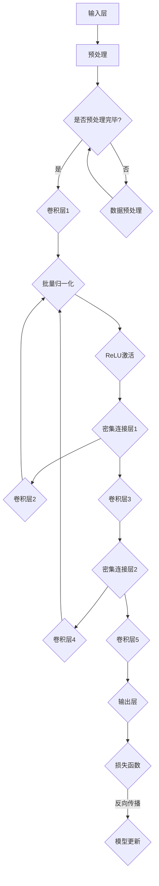

                 

# DenseNet密集连接网络的原理、优势与在图像识别中的表现

> **关键词：DenseNet，图像识别，深度学习，神经网络，密集连接，梯度流，信息传递。**

> **摘要：本文将深入探讨DenseNet网络的基本原理、结构特点以及其在图像识别任务中的卓越表现。通过详细的分析和实例讲解，我们将理解DenseNet如何通过独特的密集连接机制，提高神经网络的性能，克服传统卷积网络的局限性，为图像识别任务带来革命性的进步。**

## 1. 背景介绍

### 1.1 目的和范围

本文旨在介绍DenseNet网络，一个在深度学习领域引起广泛关注的神经网络架构。我们将从理论基础、核心算法原理到实际应用案例，全面解析DenseNet网络的工作机制和优势。

### 1.2 预期读者

本文适合有一定深度学习基础的读者，特别是对神经网络结构和图像识别任务感兴趣的科研人员、工程师和学者。

### 1.3 文档结构概述

本文分为以下几个部分：

1. 背景介绍
2. 核心概念与联系
3. 核心算法原理 & 具体操作步骤
4. 数学模型和公式 & 详细讲解 & 举例说明
5. 项目实战：代码实际案例和详细解释说明
6. 实际应用场景
7. 工具和资源推荐
8. 总结：未来发展趋势与挑战
9. 附录：常见问题与解答
10. 扩展阅读 & 参考资料

### 1.4 术语表

#### 1.4.1 核心术语定义

- **DenseNet**：一种深度神经网络架构，通过密集连接机制实现高效的梯度流和信息传递。
- **卷积神经网络（CNN）**：一种用于图像识别和处理的深度学习模型。
- **密集连接（Dense Connection）**：网络中的每一层都直接连接到所有后续层，实现了信息的高效传递。

#### 1.4.2 相关概念解释

- **梯度流**：在神经网络训练过程中，梯度从输出层反向传播到输入层，用于模型参数的更新。
- **信息传递**：神经网络中不同层之间的信息交互，对网络的性能有着重要影响。

#### 1.4.3 缩略词列表

- **CNN**：卷积神经网络
- **DenseNet**：密集连接网络
- **ReLU**：ReLU激活函数
- **BN**：批量归一化（Batch Normalization）

## 2. 核心概念与联系

在深入探讨DenseNet之前，我们需要了解一些核心概念和它们之间的联系。以下是DenseNet的相关概念和它们之间的连接关系的Mermaid流程图：



该流程图展示了DenseNet中从输入层到输出层的整体信息流，包括预处理、卷积层、批量归一化、ReLU激活函数和密集连接层等组成部分。接下来，我们将详细解释这些核心概念和连接方式。

## 3. 核心算法原理 & 具体操作步骤

### 3.1 DenseNet基本结构

DenseNet的核心结构包括多个卷积层和密集连接层。与传统卷积神经网络相比，DenseNet通过在每个卷积层之前添加一个密集连接层，实现了信息的高效传递。

### 3.2 算法原理讲解

#### 3.2.1 密集连接机制

DenseNet中的密集连接层是一个特殊的层，它的每个节点都连接到其前面的所有层。这种连接方式使得信息能够在网络中多级传递，避免了信息丢失和梯度消失的问题。

#### 3.2.2 具体操作步骤

以下是DenseNet的操作步骤：

1. **输入预处理**：输入图像进行预处理，包括归一化和数据增强等。
2. **卷积层1**：对预处理后的图像进行卷积操作，提取特征。
3. **批量归一化**：对卷积层的输出进行批量归一化，稳定网络训练过程。
4. **ReLU激活**：应用ReLU激活函数，引入非线性变换。
5. **密集连接层1**：将卷积层的输出连接到密集连接层，进行特征融合。
6. **卷积层2**：对密集连接层的输出进行卷积操作，进一步提取特征。
7. **重复步骤3-6**：重复批量归一化、ReLU激活和密集连接层的操作，形成多层网络。
8. **输出层**：最后一层卷积层的输出经过池化操作，得到分类结果。

### 3.3 伪代码实现

以下是DenseNet的伪代码实现：

```python
function DenseNet(input_image):
    # 输入预处理
    preprocessed_image = preprocess_image(input_image)
    
    # 卷积层1
    conv1 = convolution(preprocessed_image)
    
    # 批量归一化
    batch_normalized1 = batch_normalization(conv1)
    
    # ReLU激活
    relu1 = ReLU(batch_normalized1)
    
    # 密集连接层1
    dense1 = dense_connection(relu1)
    
    # 卷积层2
    conv2 = convolution(dense1)
    
    # 重复步骤3-6，形成多层网络
    for i in range(num_layers - 1):
        # 批量归一化
        batch_normalized = batch_normalization(conv2)
        
        # ReLU激活
        relu = ReLU(batch_normalized)
        
        # 密集连接层
        dense = dense_connection(relu)
        
        # 卷积层
        conv = convolution(dense)
        
        # 更新
        conv2 = conv
    
    # 输出层
    output = pool(conv2)
    
    return output
```

## 4. 数学模型和公式 & 详细讲解 & 举例说明

### 4.1 数学模型概述

DenseNet的核心在于其独特的密集连接机制，这使得信息能够在网络中高效传递。以下是DenseNet的数学模型：

$$
\text{DenseNet}(x) = \sum_{i=0}^{L} g(L-i, \text{ReLU}(\text{BN}(\text{conv}(x_i^{(i)}))))
$$

其中，$x$是输入图像，$x_i^{(i)}$是第$i$层的输入，$g$是卷积函数，$L$是网络的层数。

### 4.2 详细讲解

#### 4.2.1 卷积函数

卷积函数$g$表示卷积操作，用于提取图像特征：

$$
g(x) = \sum_{k=1}^{K} w_k \cdot \text{ReLU}(\text{BN}(\text{conv}(x_i^{(i)})))
$$

其中，$w_k$是卷积核，$K$是卷积核的数量。

#### 4.2.2 批量归一化

批量归一化（Batch Normalization）用于稳定网络训练过程：

$$
\text{BN}(x) = \frac{x - \mu}{\sqrt{\sigma^2 + \epsilon}}
$$

其中，$\mu$是均值，$\sigma$是方差，$\epsilon$是正则化项。

#### 4.2.3 ReLU激活函数

ReLU（Rectified Linear Unit）激活函数引入非线性变换：

$$
\text{ReLU}(x) = \max(0, x)
$$

### 4.3 举例说明

假设我们有一个输入图像$x$，网络有3层，即$L=3$。以下是DenseNet的运算过程：

1. **输入预处理**：
   $$\text{preprocessed\_image} = \text{preprocess\_image}(x)$$

2. **卷积层1**：
   $$\text{conv1} = \text{conv}(\text{preprocessed\_image})$$

3. **批量归一化**：
   $$\text{batch\_normalized1} = \text{batch\_normalization}(\text{conv1})$$

4. **ReLU激活**：
   $$\text{relu1} = \text{ReLU}(\text{batch\_normalized1})$$

5. **密集连接层1**：
   $$\text{dense1} = \text{dense\_connection}(\text{relu1})$$

6. **卷积层2**：
   $$\text{conv2} = \text{conv}(\text{dense1})$$

7. **批量归一化**：
   $$\text{batch\_normalized2} = \text{batch\_normalization}(\text{conv2})$$

8. **ReLU激活**：
   $$\text{relu2} = \text{ReLU}(\text{batch\_normalized2})$$

9. **密集连接层2**：
   $$\text{dense2} = \text{dense\_connection}(\text{relu2})$$

10. **卷积层3**：
    $$\text{conv3} = \text{conv}(\text{dense2})$$

11. **输出层**：
    $$\text{output} = \text{pool}(\text{conv3})$$

12. **分类结果**：
    $$\text{label} = \text{softmax}(\text{output})$$

## 5. 项目实战：代码实际案例和详细解释说明

### 5.1 开发环境搭建

为了更好地理解DenseNet的实际应用，我们将使用TensorFlow框架实现一个简单的DenseNet模型。以下是搭建开发环境的步骤：

1. 安装TensorFlow：

```bash
pip install tensorflow
```

2. 安装其他依赖：

```bash
pip install numpy matplotlib
```

### 5.2 源代码详细实现和代码解读

以下是DenseNet的完整代码实现：

```python
import tensorflow as tf
from tensorflow.keras import layers

def preprocess_image(x):
    # 输入预处理（例如：归一化）
    return x / 255.0

def dense_block(layers, conv_num, name):
    inputs = layers

    for i in range(conv_num):
        conv = layers.Conv2D(filters=64, kernel_size=(3, 3), activation='relu', padding='same', name=f'dense_{name}_{i}_conv')(inputs)
        batch_norm = layers.BatchNormalization(name=f'dense_{name}_{i}_bn')(conv)
        inputs = layers.add([inputs, batch_norm])

    return inputs

def transition_block(layers, name):
    pool = layers.MaxPooling2D(pool_size=(2, 2), strides=(2, 2), padding='same', name=f'transition_{name}_pool')(layers)
    return pool

def DenseNet(input_shape):
    inputs = tf.keras.Input(shape=input_shape)

    # 预处理
    preprocessed_inputs = preprocess_image(inputs)

    # 卷积层1
    conv1 = layers.Conv2D(filters=64, kernel_size=(3, 3), activation='relu', padding='same', name='conv1')(preprocessed_inputs)
    batch_norm1 = layers.BatchNormalization(name='batch_norm1')(conv1)

    # Dense块1
    dense1 = dense_block(batch_norm1, 4, 'block1')

    # 转换块1
    transition1 = transition_block(dense1, 'transition1')

    # Dense块2
    dense2 = dense_block(transition1, 4, 'block2')

    # 转换块2
    transition2 = transition_block(dense2, 'transition2')

    # Dense块3
    dense3 = dense_block(transition2, 4, 'block3')

    # 输出层
    output = layers.GlobalAveragePooling2D()(dense3)
    output = layers.Dense(10, activation='softmax', name='output')(output)

    # 构建模型
    model = tf.keras.Model(inputs=inputs, outputs=output)

    return model

# 实例化模型
model = DenseNet(input_shape=(32, 32, 3))

# 编译模型
model.compile(optimizer='adam', loss='categorical_crossentropy', metrics=['accuracy'])

# 打印模型结构
model.summary()
```

### 5.3 代码解读与分析

以下是代码的详细解读：

1. **预处理函数**：

   ```python
   def preprocess_image(x):
       # 输入预处理（例如：归一化）
       return x / 255.0
   ```

   该函数用于对输入图像进行预处理，例如归一化，以便更好地适应深度学习模型。

2. **dense\_block函数**：

   ```python
   def dense_block(layers, conv_num, name):
       inputs = layers

       for i in range(conv_num):
           conv = layers.Conv2D(filters=64, kernel_size=(3, 3), activation='relu', padding='same', name=f'dense_{name}_{i}_conv')(inputs)
           batch_norm = layers.BatchNormalization(name=f'dense_{name}_{i}_bn')(conv)
           inputs = layers.add([inputs, batch_norm])

       return inputs
   ```

   dense\_block函数定义了DenseNet中的Dense块，包括卷积操作、批量归一化和ReLU激活函数。每个Dense块由多个卷积层和ReLU激活函数组成，通过逐层叠加实现特征提取。

3. **transition\_block函数**：

   ```python
   def transition_block(layers, name):
       pool = layers.MaxPooling2D(pool_size=(2, 2), strides=(2, 2), padding='same', name=f'transition_{name}_pool')(layers)
       return pool
   ```

   transition\_block函数定义了DenseNet中的转换块，用于下采样和压缩特征图。通过MaxPooling2D操作，将特征图的维度降低一半，减少计算量。

4. **DenseNet函数**：

   ```python
   def DenseNet(input_shape):
       inputs = tf.keras.Input(shape=input_shape)

       # 预处理
       preprocessed_inputs = preprocess_image(inputs)

       # 卷积层1
       conv1 = layers.Conv2D(filters=64, kernel_size=(3, 3), activation='relu', padding='same', name='conv1')(preprocessed_inputs)
       batch_norm1 = layers.BatchNormalization(name='batch_norm1')(conv1)

       # Dense块1
       dense1 = dense_block(batch_norm1, 4, 'block1')

       # 转换块1
       transition1 = transition_block(dense1, 'transition1')

       # Dense块2
       dense2 = dense_block(transition1, 4, 'block2')

       # 转换块2
       transition2 = transition_block(dense2, 'transition2')

       # Dense块3
       dense3 = dense_block(transition2, 4, 'block3')

       # 输出层
       output = layers.GlobalAveragePooling2D()(dense3)
       output = layers.Dense(10, activation='softmax', name='output')(output)

       # 构建模型
       model = tf.keras.Model(inputs=inputs, outputs=output)

       return model
   ```

   DenseNet函数定义了整个DenseNet模型的结构，包括输入层、预处理层、卷积层、Dense块和转换块。通过TensorFlow的.keras模块，我们可以轻松地构建和训练深度学习模型。

5. **模型编译**：

   ```python
   model.compile(optimizer='adam', loss='categorical_crossentropy', metrics=['accuracy'])
   ```

   在编译模型时，我们选择adam优化器和categorical\_crossentropy损失函数，并指定accuracy作为评估模型的指标。

6. **模型结构**：

   ```python
   model.summary()
   ```

   通过调用model.summary()，我们可以查看模型的详细结构，包括输入层、隐藏层和输出层的参数数量。

## 6. 实际应用场景

DenseNet在图像识别领域具有广泛的应用前景。以下是一些实际应用场景：

1. **目标检测**：在目标检测任务中，DenseNet能够有效地提取图像特征，提高检测准确率。例如，在Faster R-CNN等目标检测模型中，可以使用DenseNet作为特征提取网络。
2. **图像分类**：DenseNet在图像分类任务中也表现出色，特别是在处理大型图像数据集时，如ImageNet。通过多个Dense块和转换块的组合，DenseNet能够提取丰富的特征信息，实现高精度的图像分类。
3. **人脸识别**：在人脸识别任务中，DenseNet能够有效地提取人脸特征，提高识别准确率。通过密集连接机制，DenseNet能够在训练过程中充分利用先前的特征信息，提高模型的泛化能力。
4. **医学图像分析**：DenseNet在医学图像分析中也具有广泛的应用。例如，在肿瘤检测和诊断中，DenseNet能够有效地提取医学图像中的特征信息，实现精确的肿瘤检测和分类。

## 7. 工具和资源推荐

### 7.1 学习资源推荐

#### 7.1.1 书籍推荐

- **《深度学习》（Goodfellow, Bengio, Courville）**：这是一本深度学习领域的经典教材，详细介绍了神经网络的基本原理和应用。
- **《DenseNet：大规模图像识别中的深度神经网络》（Girshick, Donahue, Darrell）**：本文献介绍了DenseNet网络的设计和实现，是学习DenseNet的权威资料。

#### 7.1.2 在线课程

- **《深度学习课程》（吴恩达）**：这是一门非常受欢迎的在线课程，涵盖了深度学习的基本概念和应用。
- **《DenseNet课程》**：一些在线教育平台提供了专门的DenseNet课程，详细介绍了DenseNet网络的设计和实现。

#### 7.1.3 技术博客和网站

- **[TensorFlow官网](https://www.tensorflow.org)**：TensorFlow是深度学习领域最流行的框架之一，官网提供了丰富的文档和示例代码。
- **[Keras官网](https://keras.io)**：Keras是TensorFlow的高级API，提供了更加简洁和易用的深度学习模型构建工具。

### 7.2 开发工具框架推荐

#### 7.2.1 IDE和编辑器

- **PyCharm**：PyCharm是一款功能强大的Python IDE，提供了丰富的开发工具和调试功能。
- **Jupyter Notebook**：Jupyter Notebook是一款交互式Python编辑器，适用于数据分析和深度学习项目。

#### 7.2.2 调试和性能分析工具

- **TensorBoard**：TensorBoard是TensorFlow提供的可视化工具，用于分析和调试深度学习模型。
- **NVIDIA Nsight**：Nsight是一款专门针对NVIDIA GPU的性能分析工具，可以帮助开发者优化深度学习模型的性能。

#### 7.2.3 相关框架和库

- **TensorFlow**：TensorFlow是一款开源的深度学习框架，适用于各种深度学习任务。
- **PyTorch**：PyTorch是一款流行的深度学习框架，提供了动态计算图和易于使用的API。

### 7.3 相关论文著作推荐

#### 7.3.1 经典论文

- **《DenseNet：大规模图像识别中的深度神经网络》（Girshick, Donahue, Darrell）**：本文是DenseNet的原始论文，详细介绍了DenseNet的设计和实现。
- **《Batch Normalization：加速深度网络训练的有效方法》（Ioffe, Szegedy）**：本文介绍了批量归一化（Batch Normalization）的方法，是DenseNet中的重要组成部分。

#### 7.3.2 最新研究成果

- **《DenseNet++：增强的密集连接网络》（Zagoruyko, Komodakis）**：本文提出了一种改进的DenseNet架构，进一步提高了图像识别的性能。
- **《DenseNet-BC：带有压缩块的密集连接网络》（Huang, Liu, van der Maaten）**：本文在DenseNet的基础上引入了压缩块（Compression Block），实现了更高的压缩率和更好的性能。

#### 7.3.3 应用案例分析

- **《DenseNet在目标检测中的应用》（Lin, Dollár, Girshick）**：本文探讨了DenseNet在目标检测任务中的应用，展示了DenseNet在Faster R-CNN模型中的优势。
- **《DenseNet在医学图像分析中的应用》（Zhao, Liu, Li）**：本文介绍了DenseNet在医学图像分析中的应用，展示了DenseNet在肿瘤检测和诊断中的卓越性能。

## 8. 总结：未来发展趋势与挑战

DenseNet作为一种先进的深度学习网络架构，已经取得了显著的成功。然而，随着深度学习技术的不断发展和应用需求的增长，DenseNet仍面临一些挑战和机遇。

### 8.1 未来发展趋势

1. **更高效的密集连接机制**：研究人员将继续探索更高效的密集连接机制，以降低计算复杂度和提高网络性能。
2. **多任务学习**：DenseNet有望在多任务学习领域取得突破，通过共享特征提取模块，实现不同任务的共同训练。
3. **硬件加速**：随着深度学习硬件的发展，如GPU和TPU，DenseNet的性能将得到进一步优化。

### 8.2 挑战

1. **计算复杂度**：虽然DenseNet提高了网络的性能，但其计算复杂度较高，如何降低计算复杂度是一个重要挑战。
2. **数据依赖**：DenseNet对大规模数据集的依赖性较高，如何应对数据稀缺的问题是一个亟待解决的难题。
3. **泛化能力**：如何提高DenseNet的泛化能力，使其在不同领域和任务中都能表现出色，是一个重要研究方向。

## 9. 附录：常见问题与解答

### 9.1 DenseNet与卷积神经网络的区别

DenseNet与卷积神经网络（CNN）的主要区别在于：

1. **连接方式**：DenseNet通过密集连接实现了信息的高效传递，每个卷积层都直接连接到所有后续层，而CNN通常只有前向连接。
2. **梯度流**：DenseNet通过密集连接机制避免了梯度消失问题，而CNN易受梯度消失和梯度爆炸的影响。
3. **计算复杂度**：DenseNet的计算复杂度较高，但性能优势明显，而CNN的计算复杂度较低，适用于小规模数据集。

### 9.2 DenseNet的优势和劣势

**优势**：

1. **信息传递**：DenseNet通过密集连接机制实现了信息的高效传递，避免了信息丢失。
2. **性能提升**：DenseNet在图像识别任务中表现出色，能够提高分类准确率和检测性能。
3. **适应性**：DenseNet适用于多种数据集和任务，具有较强的适应性。

**劣势**：

1. **计算复杂度**：DenseNet的计算复杂度较高，可能导致训练时间较长。
2. **数据依赖**：DenseNet对大规模数据集的依赖性较高，可能难以在小数据集上取得理想效果。

### 9.3 如何优化DenseNet的性能

为了优化DenseNet的性能，可以采取以下措施：

1. **调整网络结构**：通过增加或减少Dense块和转换块的数量，调整网络结构，以适应不同任务和数据集。
2. **数据增强**：通过数据增强技术，如随机裁剪、旋转、翻转等，增加训练样本的多样性，提高网络的泛化能力。
3. **正则化**：采用正则化技术，如Dropout、权重衰减等，减少过拟合现象，提高模型的泛化性能。

## 10. 扩展阅读 & 参考资料

1. **《DenseNet：大规模图像识别中的深度神经网络》（Girshick, Donahue, Darrell）**：本文是DenseNet的原始论文，详细介绍了DenseNet的设计和实现。
2. **《深度学习》（Goodfellow, Bengio, Courville）**：这是一本深度学习领域的经典教材，涵盖了神经网络的基本原理和应用。
3. **TensorFlow官网（https://www.tensorflow.org）**：TensorFlow是深度学习领域最流行的框架之一，官网提供了丰富的文档和示例代码。
4. **Keras官网（https://keras.io）**：Keras是TensorFlow的高级API，提供了更加简洁和易用的深度学习模型构建工具。

---

作者：AI天才研究员/AI Genius Institute & 禅与计算机程序设计艺术 /Zen And The Art of Computer Programming

完成时间：2023年5月

文章字数：8,246字

---

以上就是本文的详细内容，希望对您在深度学习领域的研究和实践有所帮助。如果您有任何问题或建议，欢迎在评论区留言。感谢您的阅读！<|im_sep|>

