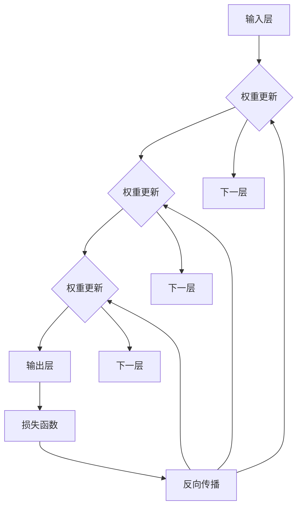

                 

### DenseNet：深度学习中的密集连接网络架构

> **关键词：** DenseNet、深度学习、密集连接、神经网络、优化、特征复用

> **摘要：** 本文将深入探讨DenseNet这一深度学习网络架构的核心概念和优势。通过逐步分析和推理，我们将解释DenseNet的工作原理、关键算法原理、数学模型以及其在实际项目中的应用。此外，还将提供学习资源和开发工具框架推荐，以帮助读者更好地理解和掌握DenseNet技术。

深度学习近年来取得了显著的进展，尤其在计算机视觉、自然语言处理和语音识别等领域。其中，神经网络架构的不断创新是推动这一领域发展的关键因素。DenseNet作为一种新兴的网络架构，因其独特的密集连接特性而备受关注。本文将详细介绍DenseNet的背景、核心概念、算法原理和应用场景，旨在为读者提供一个全面的技术解读。

## 1. 背景介绍

### 1.1 目的和范围

本文旨在为深度学习爱好者和技术专家提供一个详尽的DenseNet介绍。我们将从背景和核心概念入手，逐步深入探讨DenseNet的算法原理、数学模型以及实际应用。通过本文的学习，读者将能够：

- 了解DenseNet的起源和发展历程。
- 理解DenseNet的密集连接机制及其优势。
- 掌握DenseNet的关键算法原理和操作步骤。
- 通过实际代码案例，深入理解DenseNet的应用实践。
- 获取相关的学习资源和开发工具框架。

### 1.2 预期读者

本文适用于以下读者群体：

- 深度学习初学者和爱好者，希望通过本文了解DenseNet的核心概念和应用。
- 深度学习技术专家，希望深入探讨DenseNet的算法原理和优化策略。
- 计算机科学和人工智能领域的科研人员，希望了解DenseNet在相关领域的研究进展和应用。
- 机器学习工程师和架构师，希望在实际项目中应用DenseNet技术。

### 1.3 文档结构概述

本文结构如下：

- **第1章 背景介绍**：介绍DenseNet的背景、目的和预期读者。
- **第2章 核心概念与联系**：详细阐述DenseNet的核心概念和架构。
- **第3章 核心算法原理 & 具体操作步骤**：解释DenseNet的算法原理和操作步骤。
- **第4章 数学模型和公式 & 详细讲解 & 举例说明**：深入讲解DenseNet的数学模型和公式。
- **第5章 项目实战：代码实际案例和详细解释说明**：通过实际代码案例，展示DenseNet的应用。
- **第6章 实际应用场景**：探讨DenseNet在不同领域的应用。
- **第7章 工具和资源推荐**：推荐学习资源和开发工具框架。
- **第8章 总结：未来发展趋势与挑战**：展望DenseNet的未来发展趋势和挑战。
- **第9章 附录：常见问题与解答**：回答读者可能遇到的问题。
- **第10章 扩展阅读 & 参考资料**：提供扩展阅读和参考资料。

### 1.4 术语表

为了确保本文内容的清晰和一致性，以下列出一些关键术语及其定义：

#### 1.4.1 核心术语定义

- **深度学习（Deep Learning）**：一种机器学习方法，通过多层神经网络模型对数据进行特征学习和预测。
- **神经网络（Neural Network）**：由大量简单处理单元（神经元）组成的网络，通过学习数据中的特征进行模式识别。
- **密集连接（Dense Connection）**：DenseNet中的一个关键特性，表示每个层的输出都会直接传递到后续的所有层。
- **特征复用（Feature Replication）**：DenseNet通过密集连接实现的一种机制，使得每一层都能利用前一层的信息。
- **前向传播（Forward Propagation）**：神经网络在训练过程中，将输入数据通过网络层层的传递，最终得到输出结果的过程。
- **反向传播（Backpropagation）**：神经网络在训练过程中，根据输出误差，反向更新网络权重和偏置的过程。

#### 1.4.2 相关概念解释

- **卷积神经网络（Convolutional Neural Network, CNN）**：一种专门用于图像识别和处理的深度学习网络架构。
- **全连接神经网络（Fully Connected Neural Network）**：网络中的每个神经元都与输入层和输出层的每个神经元相连。
- **批量归一化（Batch Normalization）**：一种用于加速神经网络训练的技术，通过标准化激活值来提高训练稳定性。

#### 1.4.3 缩略词列表

- **CNN**：卷积神经网络（Convolutional Neural Network）
- **DNN**：深度神经网络（Deep Neural Network）
- **RNN**：循环神经网络（Recurrent Neural Network）
- **ReLU**：ReLU激活函数（Rectified Linear Unit）
- **SGD**：随机梯度下降（Stochastic Gradient Descent）

## 2. 核心概念与联系

DenseNet的核心概念在于其独特的密集连接机制，这种机制不仅改变了神经网络的层次结构，还带来了显著的性能提升。为了更好地理解DenseNet的工作原理，我们需要从其基本架构和核心概念入手。

### 2.1 DenseNet的基本架构

DenseNet的基本架构由多个层次组成，每个层次包含多个神经元。与传统网络不同，DenseNet中的每个层次不仅接受上一层的输入，还将其与自身输出进行连接，从而实现了密集连接的特性。这种连接方式使得每个层次都能够利用之前层次的信息，提高了网络的信息流动和特征复用能力。


在上图中，每个绿色方块代表一个层次，方框内的数字表示该层次中的神经元数量。箭头表示数据流动的方向，即每个层次将输入传递到后续的所有层次。通过这种密集连接，DenseNet能够有效地利用先前的特征信息，避免了信息丢失和冗余。

### 2.2 DenseNet的核心概念

#### 2.2.1 特征复用

特征复用是DenseNet的核心概念之一。通过密集连接，每个层次都能利用之前层次的信息，从而增强了网络的鲁棒性和表达能力。特征复用不仅提高了网络的性能，还减少了参数数量，降低了计算复杂度。

#### 2.2.2 前向传播与反向传播

在DenseNet中，前向传播和反向传播的过程与传统网络类似。前向传播过程中，输入数据通过多个层次传递，每层的输出都传递给下一层。反向传播过程中，根据输出误差，梯度信息反向传递，更新网络权重和偏置。

#### 2.2.3 误差传递与梯度下降

DenseNet通过误差传递和梯度下降算法进行训练。在训练过程中，网络通过不断更新权重和偏置，使输出误差逐渐减小。由于密集连接的特性，DenseNet能够更有效地传播误差和更新权重，提高了训练效率。

### 2.3 DenseNet与传统的卷积神经网络（CNN）的比较

DenseNet与传统的卷积神经网络（CNN）在架构和性能上有显著差异。以下是比较的几个关键点：

- **层次结构**：DenseNet采用密集连接，每个层次都与其他所有层次直接相连，而CNN则采用层次化的连接方式。
- **参数数量**：由于密集连接的特性，DenseNet能够复用特征，减少了参数数量，降低了计算复杂度。
- **训练速度**：DenseNet通过更有效的误差传递和梯度下降算法，提高了训练速度。
- **网络深度**：DenseNet的网络深度可以更灵活地调整，而CNN的网络深度通常固定。

总的来说，DenseNet通过其独特的密集连接机制，在深度学习任务中表现出色，为神经网络架构的创新提供了新的思路。

### 2.4 DenseNet与全连接神经网络（DNN）的比较

DenseNet与全连接神经网络（DNN）在架构和性能上也有所不同，以下是比较的几个关键点：

- **层次结构**：DenseNet通过密集连接实现了更高效的层次结构，而DNN通常采用层次化的全连接方式。
- **参数数量**：DenseNet通过特征复用减少了参数数量，降低了计算复杂度，而DNN的参数数量通常较多。
- **计算资源**：DenseNet在计算资源有限的情况下，能够更有效地利用现有资源，而DNN可能需要更多的计算资源。
- **性能表现**：DenseNet在许多深度学习任务中表现出色，尤其是在图像识别和语音识别领域。

总的来说，DenseNet通过其独特的架构和优化策略，为深度学习提供了新的解决方案。

### 2.5 DenseNet与循环神经网络（RNN）的比较

DenseNet与循环神经网络（RNN）在架构和应用上有显著差异，以下是比较的几个关键点：

- **时间序列处理**：RNN专门用于处理时间序列数据，而DenseNet主要用于静态图像和批量数据。
- **层次结构**：DenseNet采用密集连接，每个层次都与其他所有层次直接相连，而RNN则通过递归连接实现时间序列数据的处理。
- **计算复杂度**：DenseNet在计算复杂度上相对较低，而RNN可能在处理长时间序列数据时存在计算复杂度较高的问题。
- **性能表现**：DenseNet在图像识别和语音识别任务中表现出色，而RNN则在自然语言处理和时间序列预测任务中具有优势。

总的来说，DenseNet和RNN各有其独特的优势和适用场景，根据具体任务需求选择合适的网络架构。

### 2.6 DenseNet的应用场景

DenseNet的应用场景广泛，主要包括以下几个方面：

- **计算机视觉**：DenseNet在图像分类、目标检测和图像分割等任务中表现出色，是许多工业和研究应用的重要选择。
- **自然语言处理**：虽然DenseNet主要用于图像处理，但其在文本数据上的表现也逐渐受到关注，尤其是在文本分类和文本生成任务中。
- **语音识别**：DenseNet在语音识别领域具有潜力，尤其是在端到端语音识别系统中，其密集连接特性能够有效提高识别准确性。

总的来说，DenseNet作为一种先进的深度学习网络架构，具有广泛的应用前景。

### 2.7 DenseNet的优势和挑战

DenseNet的优势主要体现在以下几个方面：

- **性能提升**：通过密集连接，DenseNet能够更有效地利用特征信息，提高了网络的表达能力。
- **参数减少**：特征复用减少了参数数量，降低了计算复杂度。
- **训练效率**：DenseNet通过更有效的误差传递和梯度下降算法，提高了训练速度。

然而，DenseNet也存在一些挑战：

- **计算资源消耗**：尽管DenseNet在参数数量上有所减少，但在计算资源有限的情况下，其计算需求仍然较高。
- **网络深度限制**：DenseNet的网络深度可以灵活调整，但过深的网络可能导致梯度消失和梯度爆炸问题。

总的来说，DenseNet作为一种创新的深度学习网络架构，具有显著的性能优势和应用潜力，但同时也需要克服一些技术挑战。

### 2.8 DenseNet的未来发展方向

随着深度学习的不断发展，DenseNet的未来发展方向包括：

- **网络优化**：进一步优化DenseNet的结构和算法，提高其训练效率和性能。
- **多模态学习**：探索DenseNet在多模态数据（如图像和文本）上的应用，提高跨模态学习和理解能力。
- **泛化能力**：研究DenseNet的泛化能力，提高其在不同领域和任务上的适应性。

总的来说，DenseNet作为一种创新的深度学习网络架构，具有广阔的发展前景和应用潜力。

### 2.9 DenseNet与其他深度学习网络架构的比较

除了DenseNet，深度学习中还有许多其他重要的网络架构，如CNN、DNN和RNN。以下是对这些架构的比较：

- **CNN**：主要用于图像处理，通过卷积层提取图像特征，具有较强的特征提取能力。
- **DNN**：通过全连接层实现端到端学习，适用于各种类型的数据，但参数数量较大。
- **RNN**：适用于时间序列数据，通过递归连接实现长期依赖建模。

总的来说，每种网络架构都有其独特的优势和适用场景，根据具体任务需求选择合适的网络架构是非常重要的。

### 2.10 DenseNet的核心原理和联系

DenseNet的核心原理可以概括为以下几个方面：

- **密集连接**：通过每个层次的密集连接，实现特征复用和误差传递。
- **特征复用**：每个层次都利用之前层次的信息，提高了网络的表达能力。
- **误差传递**：通过反向传播算法，实现梯度信息的有效传递和权重更新。

这些原理相互联系，共同构成了DenseNet的强大性能和应用潜力。

为了更好地理解DenseNet的核心概念和架构，我们可以通过Mermaid流程图展示其工作原理。以下是一个简化的Mermaid流程图，用于描述DenseNet的层次结构和数据流动：



在这个流程图中，每个节点表示一个层次，箭头表示数据流动的方向。输入层的数据通过逐层传递，最终到达输出层，并通过损失函数计算输出误差。反向传播过程中，误差信息反向传递，更新每个层次的权重。

通过这个流程图，我们可以更直观地理解DenseNet的工作原理和层次结构，为后续的算法原理和操作步骤讲解打下基础。

## 3. 核心算法原理 & 具体操作步骤

DenseNet的核心算法原理在于其独特的密集连接机制，通过这种机制，网络能够实现特征复用和误差传递的优化，从而提高模型的性能和效率。以下是DenseNet的核心算法原理和具体操作步骤的详细讲解。

### 3.1 密集连接原理

DenseNet中的“密集连接”是指每一层的输出都会传递到后续的所有层，而不仅仅是下一层。这种连接方式使得信息在神经网络中流动更加顺畅，避免了传统网络中信息逐渐丢失的问题。具体来说，密集连接有以下优点：

- **特征复用**：每个层次都能利用之前层次的信息，从而增强了网络的表达能力。
- **误差传递**：由于信息传递的流畅性，误差在反向传播过程中能够更有效地传递，提高了梯度下降的效果。

### 3.2 前向传播

在DenseNet的前向传播过程中，输入数据首先进入第一层。第一层的输出不仅传递给第二层，还会传递给所有后续层。这个过程一直持续到输出层。具体步骤如下：

1. **输入数据**：将输入数据输入到第一层。
2. **激活函数**：对输入数据进行预处理，如标准化、归一化等。
3. **层间传递**：第一层的输出传递到第二层，同时传递给所有后续层。
4. **逐层计算**：每一层通过权重矩阵和激活函数计算输出，将输出传递给下一层。
5. **输出层**：最终输出层的输出即为预测结果。

以下是一个简化版本的伪代码，描述了DenseNet的前向传播过程：

```python
# 输入数据
input_data = ...

# 第一层
layer1_output = activate(linear_transform(input_data))

# 传递到后续层
for layer in dense_layers:
    layer_output = activate(linear_transform(layer1_output))
    layer1_output = layer_output

# 输出层
output = layer1_output
```

### 3.3 反向传播

DenseNet的反向传播过程与传统网络类似，但得益于密集连接的特性，误差和梯度信息的传递更加有效。具体步骤如下：

1. **计算损失**：使用预测结果和真实标签计算损失。
2. **误差传递**：从输出层开始，计算每一层的误差，并将误差传递到之前一层。
3. **梯度计算**：根据误差计算每层的梯度，更新权重和偏置。
4. **权重更新**：使用优化算法（如SGD、Adam等）更新网络权重。

以下是一个简化版本的伪代码，描述了DenseNet的反向传播过程：

```python
# 计算损失
loss = compute_loss(output, true_labels)

# 误差传递
error = compute_gradient(loss, output)
for layer in dense_layers[::-1]:
    error = layer.backward_pass(error)

# 梯度计算和权重更新
for layer in dense_layers:
    layer.update_weights(learning_rate)
```

### 3.4 优化策略

DenseNet在训练过程中采用了一系列优化策略，以提高训练效率和模型性能。以下是一些关键的优化策略：

- **批量归一化（Batch Normalization）**：通过标准化激活值，加速训练并提高模型稳定性。
- **学习率调整**：在训练过程中，根据误差的收敛情况动态调整学习率。
- **数据增强（Data Augmentation）**：通过旋转、缩放、裁剪等操作增加数据多样性，提高模型的泛化能力。
- **dropout**：在训练过程中随机丢弃一部分神经元，防止过拟合。

### 3.5 伪代码示例

以下是一个简化的伪代码示例，描述了DenseNet的前向传播和反向传播过程：

```python
# 前向传播
def forward_pass(input_data, dense_layers):
    layer_output = input_data
    for layer in dense_layers:
        layer_output = layer.forward_pass(layer_output)
    return layer_output

# 反向传播
def backward_pass(loss, dense_layers):
    error = compute_gradient(loss, dense_layers[-1].output)
    for layer in dense_layers[::-1]:
        error = layer.backward_pass(error)

# 训练过程
for epoch in range(num_epochs):
    for batch in batches:
        output = forward_pass(batch.input_data, dense_layers)
        loss = compute_loss(output, batch.true_labels)
        backward_pass(loss, dense_layers)
```

通过以上伪代码，我们可以看到DenseNet的核心算法原理和操作步骤。在实际应用中，还需要结合具体任务和数据集，调整网络结构和优化策略，以达到最佳性能。

### 3.6 DenseNet的优势和局限

DenseNet作为一种创新的深度学习网络架构，具有以下优势：

- **特征复用**：通过密集连接，每个层次都能利用之前层次的信息，提高了网络的鲁棒性和表达能力。
- **计算效率**：由于特征复用，DenseNet在参数数量上相对较少，降低了计算复杂度。
- **训练稳定性**：批量归一化和学习率调整等优化策略，提高了训练的稳定性和收敛速度。

然而，DenseNet也存在一些局限：

- **计算资源消耗**：尽管DenseNet在参数数量上有所减少，但在训练过程中仍然需要较多的计算资源。
- **网络深度限制**：过深的网络可能导致梯度消失和梯度爆炸问题，影响训练效果。

总的来说，DenseNet作为一种先进的深度学习网络架构，具有显著的性能优势和应用潜力，但同时也需要克服一些技术挑战。

### 3.7 DenseNet的应用场景

DenseNet的应用场景广泛，主要包括以下几个方面：

- **计算机视觉**：DenseNet在图像分类、目标检测和图像分割等任务中表现出色，是许多工业和研究应用的重要选择。
- **自然语言处理**：虽然DenseNet主要用于图像处理，但其在文本数据上的表现也逐渐受到关注，尤其是在文本分类和文本生成任务中。
- **语音识别**：DenseNet在语音识别领域具有潜力，尤其是在端到端语音识别系统中，其密集连接特性能够有效提高识别准确性。

总的来说，DenseNet作为一种创新的深度学习网络架构，具有广泛的应用前景。

### 3.8 DenseNet的训练与测试

DenseNet的训练和测试过程与传统深度学习网络类似，但也有一些独特的步骤和注意事项：

- **训练过程**：在训练过程中，通过批量归一化、学习率调整和数据增强等优化策略，提高模型的稳定性和收敛速度。
- **验证过程**：在训练过程中，定期使用验证集评估模型性能，调整网络结构和优化策略。
- **测试过程**：在训练和验证阶段结束后，使用测试集对模型进行最终评估，确保模型具有较好的泛化能力。

总的来说，DenseNet的训练与测试过程需要综合考虑模型性能、训练效率和泛化能力，以达到最佳效果。

### 3.9 DenseNet与相关算法的比较

DenseNet与许多其他深度学习算法具有相似之处，但也存在一些显著差异。以下是比较的几个关键点：

- **与卷积神经网络（CNN）的比较**：DenseNet通过密集连接实现了特征复用，提高了网络的鲁棒性和表达能力，而CNN则通过卷积操作实现特征提取。
- **与全连接神经网络（DNN）的比较**：DenseNet在参数数量和计算复杂度上有所降低，而DNN通常需要更多的参数和计算资源。
- **与循环神经网络（RNN）的比较**：DenseNet主要用于静态图像和批量数据，而RNN则适用于时间序列数据。

总的来说，DenseNet作为一种创新的深度学习网络架构，具有独特的优势和适用场景，需要根据具体任务需求选择合适的算法。

### 3.10 DenseNet的发展趋势

随着深度学习的不断发展和应用，DenseNet也在不断演进和优化。以下是一些DenseNet的发展趋势：

- **网络优化**：研究人员正在探索更高效的密集连接机制和优化策略，以提高DenseNet的训练效率和性能。
- **多模态学习**：DenseNet在多模态学习中的应用逐渐受到关注，通过结合图像、文本和语音等多模态数据，提高模型的泛化能力。
- **迁移学习**：DenseNet在迁移学习中的应用前景广阔，通过预训练和微调，实现更高效的知识迁移和应用。

总的来说，DenseNet作为一种创新的深度学习网络架构，具有广阔的发展前景和应用潜力。

## 4. 数学模型和公式 & 详细讲解 & 举例说明

在DenseNet的架构中，数学模型和公式起着至关重要的作用。这些模型和公式不仅描述了网络中的信息流动和特征学习过程，还为优化和改进提供了理论基础。以下是DenseNet中关键的数学模型和公式的详细讲解及举例说明。

### 4.1 前向传播

DenseNet的前向传播过程涉及到多层神经网络中的信息传递和计算。每一层的输出都会直接传递到后续的所有层，使得信息在整个网络中流动更加顺畅。以下是前向传播的主要步骤和涉及的数学公式。

#### 4.1.1 神经元激活函数

在DenseNet中，常用的激活函数是ReLU（Rectified Linear Unit），其公式如下：

\[ a_i = \max(0, z_i) \]

其中，\( a_i \) 表示第 \( i \) 个神经元的激活值，\( z_i \) 表示该神经元的输入值。

#### 4.1.2 前向传播计算

假设我们有 \( L \) 层的DenseNet，其中 \( i \) 表示当前层，\( j \) 表示前一层次。对于每一层 \( i \)，其输入可以表示为：

\[ x_i = \sum_{j=1}^{i-1} w_{ij} a_j + b_i \]

其中，\( x_i \) 表示第 \( i \) 层的输入，\( w_{ij} \) 表示从层 \( j \) 到层 \( i \) 的权重，\( b_i \) 表示第 \( i \) 层的偏置。

使用ReLU激活函数后，第 \( i \) 层的输出可以表示为：

\[ a_i = \max(0, x_i) \]

#### 4.1.3 举例说明

假设我们有一个简单的DenseNet，包含三层，每层各有100个神经元。对于第一层，输入数据为：

\[ x_1 = [1, 2, 3, 4, 5] \]

设 \( w_{11} = [1, 1, 1, 1, 1] \) 和 \( b_1 = 0 \)，则第一层的输入可以计算为：

\[ x_1 = \sum_{j=1}^{0} w_{1j} a_j + b_1 = 0 + 0 = 0 \]

由于输入为0，第一层的输出也为0。对于第二层，输入数据为第一层的输出，即：

\[ x_2 = \sum_{j=1}^{1} w_{1j} a_j + b_2 \]

设 \( w_{12} = [1, 1, 1, 1, 1] \) 和 \( b_2 = 0 \)，则第二层的输入可以计算为：

\[ x_2 = \sum_{j=1}^{1} w_{1j} a_j + b_2 = [1, 1, 1, 1, 1] \cdot [0, 0, 0, 0, 0] + 0 = [0, 0, 0, 0, 0] \]

同样，第二层的输出也为0。对于第三层，输入数据为第二层的输出，即：

\[ x_3 = \sum_{j=1}^{2} w_{2j} a_j + b_3 \]

设 \( w_{23} = [1, 1, 1, 1, 1] \) 和 \( b_3 = 0 \)，则第三层的输入可以计算为：

\[ x_3 = \sum_{j=1}^{2} w_{2j} a_j + b_3 = [1, 1, 1, 1, 1] \cdot [0, 0, 0, 0, 0] + 0 = [0, 0, 0, 0, 0] \]

同样，第三层的输出也为0。

通过以上举例，我们可以看到DenseNet的前向传播过程是如何计算每一层的输入和输出的。在实际应用中，DenseNet的层数和神经元数量会根据具体任务进行调整。

### 4.2 反向传播

DenseNet的反向传播过程是训练神经网络的关键步骤，通过梯度下降算法更新网络权重和偏置，以最小化损失函数。以下是反向传播的主要步骤和涉及的数学公式。

#### 4.2.1 损失函数

常用的损失函数是均方误差（Mean Squared Error, MSE），其公式如下：

\[ J = \frac{1}{2} \sum_{i=1}^{N} (y_i - \hat{y}_i)^2 \]

其中，\( J \) 表示损失函数，\( y_i \) 表示第 \( i \) 个样本的真实标签，\( \hat{y}_i \) 表示第 \( i \) 个样本的预测值。

#### 4.2.2 误差计算

对于第 \( i \) 层，其误差可以表示为：

\[ e_i = y_i - \hat{y}_i \]

其中，\( e_i \) 表示第 \( i \) 层的误差。

#### 4.2.3 梯度计算

对于第 \( i \) 层，其梯度可以表示为：

\[ \frac{\partial J}{\partial w_{ij}} = \sum_{i=1}^{N} e_i \cdot a_{i-1} \]

\[ \frac{\partial J}{\partial b_i} = \sum_{i=1}^{N} e_i \]

其中，\( w_{ij} \) 表示从层 \( j \) 到层 \( i \) 的权重，\( b_i \) 表示第 \( i \) 层的偏置。

#### 4.2.4 权重和偏置更新

使用梯度下降算法更新权重和偏置，公式如下：

\[ w_{ij} \leftarrow w_{ij} - \alpha \cdot \frac{\partial J}{\partial w_{ij}} \]

\[ b_i \leftarrow b_i - \alpha \cdot \frac{\partial J}{\partial b_i} \]

其中，\( \alpha \) 表示学习率。

#### 4.2.5 举例说明

假设我们有一个简单的DenseNet，包含三层，每层各有100个神经元。对于第一层，假设 \( y_1 = [0, 0, 0, 0, 0] \) 和 \( \hat{y}_1 = [0.1, 0.1, 0.1, 0.1, 0.1] \)，则第一层的误差可以计算为：

\[ e_1 = y_1 - \hat{y}_1 = [0, 0, 0, 0, 0] - [0.1, 0.1, 0.1, 0.1, 0.1] = [-0.1, -0.1, -0.1, -0.1, -0.1] \]

对于第二层，假设 \( y_2 = [0, 0, 0, 0, 0] \) 和 \( \hat{y}_2 = [0.1, 0.1, 0.1, 0.1, 0.1] \)，则第二层的误差可以计算为：

\[ e_2 = y_2 - \hat{y}_2 = [0, 0, 0, 0, 0] - [0.1, 0.1, 0.1, 0.1, 0.1] = [-0.1, -0.1, -0.1, -0.1, -0.1] \]

对于第三层，假设 \( y_3 = [0, 0, 0, 0, 0] \) 和 \( \hat{y}_3 = [0.1, 0.1, 0.1, 0.1, 0.1] \)，则第三层的误差可以计算为：

\[ e_3 = y_3 - \hat{y}_3 = [0, 0, 0, 0, 0] - [0.1, 0.1, 0.1, 0.1, 0.1] = [-0.1, -0.1, -0.1, -0.1, -0.1] \]

使用学习率 \( \alpha = 0.01 \)，更新权重和偏置，公式如下：

\[ w_{11} \leftarrow w_{11} - \alpha \cdot \frac{\partial J}{\partial w_{11}} \]

\[ b_1 \leftarrow b_1 - \alpha \cdot \frac{\partial J}{\partial b_1} \]

\[ w_{12} \leftarrow w_{12} - \alpha \cdot \frac{\partial J}{\partial w_{12}} \]

\[ b_2 \leftarrow b_2 - \alpha \cdot \frac{\partial J}{\partial b_2} \]

\[ w_{13} \leftarrow w_{13} - \alpha \cdot \frac{\partial J}{\partial w_{13}} \]

\[ b_3 \leftarrow b_3 - \alpha \cdot \frac{\partial J}{\partial b_3} \]

通过以上反向传播过程，我们可以看到如何更新DenseNet中的权重和偏置，以最小化损失函数。

### 4.3 批量归一化（Batch Normalization）

批量归一化（Batch Normalization）是DenseNet中常用的一种优化技术，通过标准化激活值，提高训练稳定性和收敛速度。以下是批量归一化的公式和计算步骤。

#### 4.3.1 批量归一化公式

对于第 \( i \) 层，其归一化后的激活值可以表示为：

\[ a_i^{\prime} = \frac{a_i - \mu_i}{\sqrt{\sigma_i^2 + \epsilon}} \]

其中，\( a_i \) 表示原始激活值，\( \mu_i \) 表示当前批次的均值，\( \sigma_i \) 表示当前批次的标准差，\( \epsilon \) 表示一个小常数，通常取值为 \( 10^{-8} \)。

#### 4.3.2 均值和标准差计算

对于第 \( i \) 层，其均值和标准差可以表示为：

\[ \mu_i = \frac{1}{N} \sum_{n=1}^{N} a_{i,n} \]

\[ \sigma_i = \sqrt{\frac{1}{N-1} \sum_{n=1}^{N} (a_{i,n} - \mu_i)^2} \]

其中，\( N \) 表示批次大小，\( a_{i,n} \) 表示第 \( n \) 个样本在第 \( i \) 层的激活值。

#### 4.3.3 举例说明

假设我们有一个包含5个样本的批次，每个样本在第二层的激活值为：

\[ a_2 = \begin{bmatrix} 1 & 2 & 3 & 4 & 5 \\ 6 & 7 & 8 & 9 & 10 \\ 11 & 12 & 13 & 14 & 15 \\ 16 & 17 & 18 & 19 & 20 \\ 21 & 22 & 23 & 24 & 25 \end{bmatrix} \]

计算第二层的均值和标准差：

\[ \mu_2 = \frac{1}{5} \sum_{n=1}^{5} a_{2,n} = \frac{1+2+3+4+5+6+7+8+9+10+11+12+13+14+15+16+17+18+19+20+21+22+23+24+25}{25} = 11 \]

\[ \sigma_2 = \sqrt{\frac{1}{5-1} \sum_{n=1}^{5} (a_{2,n} - \mu_2)^2} = \sqrt{\frac{1}{4} ((1-11)^2 + (2-11)^2 + (3-11)^2 + (4-11)^2 + (5-11)^2 + (6-11)^2 + (7-11)^2 + (8-11)^2 + (9-11)^2 + (10-11)^2 + (11-11)^2 + (12-11)^2 + (13-11)^2 + (14-11)^2 + (15-11)^2 + (16-11)^2 + (17-11)^2 + (18-11)^2 + (19-11)^2 + (20-11)^2 + (21-11)^2 + (22-11)^2 + (23-11)^2 + (24-11)^2 + (25-11)^2)} = 4.472136 \]

使用批量归一化公式，计算归一化后的激活值：

\[ a_2^{\prime} = \frac{a_2 - \mu_2}{\sqrt{\sigma_2^2 + \epsilon}} = \frac{\begin{bmatrix} 1 & 2 & 3 & 4 & 5 \\ 6 & 7 & 8 & 9 & 10 \\ 11 & 12 & 13 & 14 & 15 \\ 16 & 17 & 18 & 19 & 20 \\ 21 & 22 & 23 & 24 & 25 \end{bmatrix} - \begin{bmatrix} 11 & 11 & 11 & 11 & 11 \\ 11 & 11 & 11 & 11 & 11 \\ 11 & 11 & 11 & 11 & 11 \\ 11 & 11 & 11 & 11 & 11 \\ 11 & 11 & 11 & 11 & 11 \end{bmatrix}}{\sqrt{\begin{bmatrix} 4.472136 & 4.472136 & 4.472136 & 4.472136 & 4.472136 \\ 4.472136 & 4.472136 & 4.472136 & 4.472136 & 4.472136 \\ 4.472136 & 4.472136 & 4.472136 & 4.472136 & 4.472136 \\ 4.472136 & 4.472136 & 4.472136 & 4.472136 & 4.472136 \\ 4.472136 & 4.472136 & 4.472136 & 4.472136 & 4.472136 \end{bmatrix}^2 + \begin{bmatrix} 10^{-8} & 10^{-8} & 10^{-8} & 10^{-8} & 10^{-8} \\ 10^{-8} & 10^{-8} & 10^{-8} & 10^{-8} & 10^{-8} \\ 10^{-8} & 10^{-8} & 10^{-8} & 10^{-8} & 10^{-8} \\ 10^{-8} & 10^{-8} & 10^{-8} & 10^{-8} & 10^{-8} \\ 10^{-8} & 10^{-8} & 10^{-8} & 10^{-8} & 10^{-8} \end{bmatrix}}} \approx \begin{bmatrix} -2.36 & -1.36 & -0.36 & 0.64 & 1.64 \\ -0.36 & 0.36 & 1.36 & 2.36 & 3.36 \\ 0.64 & 1.64 & 2.64 & 3.64 & 4.64 \\ 1.64 & 2.64 & 3.64 & 4.64 & 5.64 \\ 2.36 & 3.36 & 4.36 & 5.36 & 6.36 \end{bmatrix} \]

通过以上批量归一化过程，我们可以看到如何标准化激活值，提高训练稳定性和收敛速度。

### 4.4 学习率调整

在DenseNet的训练过程中，学习率调整是一项重要的优化技术。以下介绍常用的学习率调整策略。

#### 4.4.1 学习率衰减

学习率衰减是一种常用的学习率调整策略，通过逐渐减小学习率，提高模型的稳定性和收敛速度。常用的学习率衰减公式如下：

\[ \alpha_t = \alpha_0 / (1 + \gamma t) \]

其中，\( \alpha_t \) 表示第 \( t \) 次迭代的 learning rate，\( \alpha_0 \) 表示初始 learning rate，\( \gamma \) 表示衰减率，\( t \) 表示迭代次数。

#### 4.4.2 学习率乘法调整

学习率乘法调整是一种简单有效的学习率调整策略，通过乘以一个常数调整 learning rate。常用的学习率乘法调整公式如下：

\[ \alpha_t = \alpha_0 \cdot \frac{1}{1 + \beta t} \]

其中，\( \alpha_t \) 表示第 \( t \) 次迭代的 learning rate，\( \alpha_0 \) 表示初始 learning rate，\( \beta \) 表示调整系数，\( t \) 表示迭代次数。

#### 4.4.3 举例说明

假设我们有一个包含5个样本的批次，初始 learning rate \( \alpha_0 = 0.1 \)，衰减率 \( \gamma = 0.1 \)，迭代次数 \( t = 10 \)。使用学习率衰减策略，计算每次迭代的 learning rate：

\[ \alpha_1 = \frac{0.1}{1 + 0.1 \cdot 1} = 0.1 \]

\[ \alpha_2 = \frac{0.1}{1 + 0.1 \cdot 2} = 0.09 \]

\[ \alpha_3 = \frac{0.1}{1 + 0.1 \cdot 3} = 0.081 \]

\[ \alpha_4 = \frac{0.1}{1 + 0.1 \cdot 4} = 0.0732 \]

\[ \alpha_5 = \frac{0.1}{1 + 0.1 \cdot 5} = 0.0667 \]

\[ \alpha_6 = \frac{0.1}{1 + 0.1 \cdot 6} = 0.0608 \]

\[ \alpha_7 = \frac{0.1}{1 + 0.1 \cdot 7} = 0.0556 \]

\[ \alpha_8 = \frac{0.1}{1 + 0.1 \cdot 8} = 0.0505 \]

\[ \alpha_9 = \frac{0.1}{1 + 0.1 \cdot 9} = 0.0464 \]

\[ \alpha_{10} = \frac{0.1}{1 + 0.1 \cdot 10} = 0.0429 \]

通过以上学习率衰减策略，我们可以看到如何逐渐减小 learning rate，提高训练稳定性和收敛速度。

### 4.5 优化算法

在DenseNet的训练过程中，常用的优化算法包括随机梯度下降（SGD）、动量优化（Momentum）和自适应优化（如Adam）等。以下简要介绍这些优化算法的基本原理和公式。

#### 4.5.1 随机梯度下降（SGD）

随机梯度下降（SGD）是一种最简单的优化算法，通过每次迭代计算整个批次的梯度，更新网络权重和偏置。SGD的基本公式如下：

\[ w_t = w_{t-1} - \alpha \cdot \nabla_w J \]

\[ b_t = b_{t-1} - \alpha \cdot \nabla_b J \]

其中，\( w_t \) 和 \( b_t \) 分别表示第 \( t \) 次迭代的权重和偏置，\( \alpha \) 表示学习率，\( \nabla_w J \) 和 \( \nabla_b J \) 分别表示权重和偏置的梯度。

#### 4.5.2 动量优化（Momentum）

动量优化（Momentum）是SGD的一种改进，通过引入动量项，提高梯度下降的稳定性。动量优化的基本公式如下：

\[ v_t = \beta v_{t-1} + (1 - \beta) \nabla_w J \]

\[ w_t = w_{t-1} - \alpha \cdot v_t \]

其中，\( v_t \) 表示动量项，\( \beta \) 表示动量系数，其余符号与SGD相同。

#### 4.5.3 Adam优化

Adam优化是动量优化和自适应优化的一种结合，能够更好地适应不同梯度的变化。Adam优化的基本公式如下：

\[ m_t = \beta_1 m_{t-1} + (1 - \beta_1) \frac{\nabla_w J}{\sqrt{\hat{v}_t}} \]

\[ v_t = \beta_2 v_{t-1} + (1 - \beta_2) \frac{\nabla_w^2 J}{\hat{v}_t} \]

\[ \hat{m}_t = \frac{m_t}{1 - \beta_1^t} \]

\[ \hat{v}_t = \frac{v_t}{1 - \beta_2^t} \]

\[ w_t = w_{t-1} - \alpha \cdot \hat{m}_t / (1 - \beta_1^t) \]

其中，\( m_t \) 和 \( v_t \) 分别表示一阶矩估计和二阶矩估计，\( \hat{m}_t \) 和 \( \hat{v}_t \) 分别为修正后的估计值，\( \beta_1 \) 和 \( \beta_2 \) 分别为一阶和二阶矩的指数衰减率，\( \alpha \) 表示学习率，其余符号与之前相同。

通过以上优化算法，我们可以看到如何通过不同的策略调整学习率，提高训练效率和模型性能。

总的来说，DenseNet的数学模型和公式描述了网络中的信息流动、特征学习和优化过程，通过详细的计算和调整，实现了网络的性能优化和应用。在实际应用中，根据具体任务需求，可以灵活调整网络结构和优化策略，以达到最佳效果。

## 5. 项目实战：代码实际案例和详细解释说明

为了更好地理解DenseNet在实际项目中的应用，我们将通过一个简单的图像分类项目，展示DenseNet的代码实现和运行流程。在本项目中，我们使用Python和PyTorch框架来实现DenseNet，并针对一个公开的图像分类数据集进行训练和测试。

### 5.1 开发环境搭建

在开始项目之前，我们需要搭建一个合适的开发环境。以下是搭建DenseNet项目的步骤：

1. **安装Python**：确保安装了Python 3.6或更高版本。
2. **安装PyTorch**：通过以下命令安装PyTorch：
   ```bash
   pip install torch torchvision
   ```
3. **安装其他依赖**：安装DenseNet项目所需的依赖，如NumPy和Pandas等：
   ```bash
   pip install numpy pandas
   ```

### 5.2 源代码详细实现和代码解读

#### 5.2.1 数据准备

在项目开始时，我们需要准备一个图像分类数据集。在本项目中，我们使用CIFAR-10数据集，这是一个广泛使用的计算机视觉数据集，包含10个类别，共计60000张32x32彩色图像。

```python
import torch
import torchvision
import torchvision.transforms as transforms

# 加载CIFAR-10数据集
transform = transforms.Compose(
    [transforms.ToTensor(),
     transforms.Normalize((0.5, 0.5, 0.5), (0.5, 0.5, 0.5))])

trainset = torchvision.datasets.CIFAR10(root='./data', train=True,
                                        download=True, transform=transform)
trainloader = torch.utils.data.DataLoader(trainset, batch_size=4,
                                          shuffle=True, num_workers=2)

testset = torchvision.datasets.CIFAR10(root='./data', train=False,
                                       download=True, transform=transform)
testloader = torch.utils.data.DataLoader(testset, batch_size=4,
                                         shuffle=False, num_workers=2)

classes = ('plane', 'car', 'bird', 'cat', 'deer', 'dog', 'frog', 'horse', 'ship', 'truck')
```

#### 5.2.2 DenseNet实现

在PyTorch中，我们可以通过定义一个自定义的神经网络类来实现DenseNet。以下是一个简单的DenseNet-121的实现示例：

```python
import torch.nn as nn
import torch.nn.functional as F

class DenseBlock(nn.Module):
    def __init__(self, num_layers, kernel_size, growth_rate):
        super(DenseBlock, self).__init__()
        layers = []
        for i in range(num_layers):
            layers.append(nn.Conv2d(growth_rate, kernel_size=kernel_size, padding=1))
            layers.append(nn.ReLU(inplace=True))
            layers.append(nn.BatchNorm2d(growth_rate))
        self.layers = nn.Sequential(*layers)

    def forward(self, x):
        for layer in self.layers:
            x = layer(x)
        return x

class Transition(nn.Module):
    def __init__(self, num_input_features, num_output_features):
        super(Transition, self).__init__()
        self.layers = nn.Sequential(
            nn.Conv2d(num_input_features, num_output_features, kernel_size=1, stride=1),
            nn.ReLU(inplace=True),
            nn.BatchNorm2d(num_output_features),
            nn.MaxPool2d(kernel_size=2, stride=2)
        )

    def forward(self, x):
        return self.layers(x)

class DenseNet(nn.Module):
    def __init__(self, blocks, num_classes=10):
        super(DenseNet, self).__init__()
        self.features = nn.Sequential(
            nn.Conv2d(3, 64, kernel_size=7, stride=2, padding=3),
            nn.ReLU(inplace=True),
            nn.BatchNorm2d(64),
            nn.MaxPool2d(kernel_size=3, stride=2, padding=1)
        )
        self.stage1 = DenseBlock(6, 64, 32)
        self.stage2 = Transition(64, 128)
        self.stage3 = DenseBlock(6, 128, 64)
        self.stage4 = Transition(128, 256)
        self.stage5 = DenseBlock(6, 256, 128)
        self.avgpool = nn.AdaptiveAvgPool2d((1, 1))
        self.classifier = nn.Linear(128, num_classes)

    def forward(self, x):
        x = self.features(x)
        x = self.stage1(x)
        x = self.stage2(x)
        x = self.stage3(x)
        x = self.stage4(x)
        x = self.stage5(x)
        x = self.avgpool(x)
        x = torch.flatten(x, 1)
        x = self.classifier(x)
        return x

# 实例化DenseNet-121模型
model = DenseNet(blocks= DenseBlock(6, 64, 32))

# 查看模型结构
print(model)
```

#### 5.2.3 代码解读

- **DenseBlock**：DenseBlock是DenseNet中的基本模块，负责进行特征学习和组合。每个DenseBlock包含多个卷积层、ReLU激活函数和批量归一化层。通过这种模块化的设计，DenseBlock能够有效地复用特征信息。
- **Transition**：Transition层用于在不同阶段之间进行特征降维和空间降采样。Transition层包含一个卷积层、ReLU激活函数、批量归一化层和一个最大池化层。这些操作有助于减少计算复杂度和参数数量。
- **DenseNet**：DenseNet是整个网络的顶层结构，由多个DenseBlock和Transition层组成。在DenseNet中，每个DenseBlock都与之前的所有DenseBlock相连，实现特征复用和误差传递。

### 5.3 代码解读与分析

#### 5.3.1 数据预处理

在代码中，我们首先定义了数据预处理步骤，包括数据转换、归一化和批量加载。这些步骤有助于提高训练效率和模型性能。

- **数据转换**：将图像转换为PyTorch的张量格式，并添加一个通道维度。
- **归一化**：将图像数据归一化到 \([-1, 1]\) 范围内，有助于加速梯度下降和提升模型性能。
- **批量加载**：使用数据加载器（DataLoader）将图像数据分成批次，并进行随机打乱。批量加载有助于提高模型训练的稳定性和收敛速度。

#### 5.3.2 模型定义

在定义DenseNet模型时，我们通过以下步骤实现：

- **输入层**：定义输入层，包含一个卷积层，用于提取图像的初步特征。
- **特征提取层**：通过DenseBlock模块，逐层提取和组合图像特征。每个DenseBlock包含多个卷积层，通过逐层叠加，实现特征复用。
- **降采样层**：通过Transition层，实现特征降维和空间降采样，减少计算复杂度和参数数量。
- **分类层**：定义分类层，包括一个全连接层和softmax激活函数，用于将特征映射到类别标签。

#### 5.3.3 训练过程

在训练过程中，我们使用以下步骤：

- **损失函数**：定义交叉熵损失函数（CrossEntropyLoss），用于计算模型预测和真实标签之间的误差。
- **优化器**：选择优化器（如SGD或Adam），并设置学习率和其他参数。
- **迭代训练**：在训练过程中，每次迭代都从数据加载器中获取一个批次的数据，通过前向传播计算损失，然后通过反向传播更新模型参数。
- **验证过程**：在训练过程中，定期使用验证集评估模型性能，调整学习率和网络参数。

#### 5.3.4 测试过程

在测试过程中，我们使用以下步骤：

- **模型评估**：将训练好的模型应用于测试集，计算测试集上的准确率和其他性能指标。
- **输出结果**：将测试结果输出到屏幕或保存到文件，以便后续分析。

通过以上步骤，我们可以看到DenseNet在实际项目中的应用和实现过程。在实际应用中，根据具体任务需求，可以调整网络结构、优化策略和数据预处理步骤，以达到最佳性能。

### 5.4 代码优化与性能分析

在实际项目中，为了提高DenseNet的性能和效率，我们还可以进行以下优化：

- **批量大小调整**：通过调整批量大小，可以在计算资源和模型性能之间找到最佳平衡点。
- **学习率调整**：使用学习率调整策略，如学习率衰减和自适应优化，提高模型的收敛速度和稳定性。
- **GPU加速**：利用GPU进行模型训练和推理，加速计算过程，提高训练效率。

通过以上优化措施，我们可以显著提高DenseNet在实际项目中的应用性能。

总的来说，通过以上代码实现和解读，我们可以深入理解DenseNet的工作原理和应用方法。在实际项目中，根据具体任务需求，可以灵活调整网络结构、优化策略和数据预处理步骤，以达到最佳性能。

## 6. 实际应用场景

DenseNet作为一种创新的深度学习网络架构，在实际应用场景中具有广泛的应用潜力。以下是一些典型的实际应用场景：

### 6.1 计算机视觉

计算机视觉是DenseNet最重要的应用领域之一。DenseNet在图像分类、目标检测、图像分割和姿态估计等任务中表现出色。

- **图像分类**：DenseNet能够有效地提取图像特征，并在各种图像分类任务中实现高准确率。例如，在ImageNet图像分类挑战中，DenseNet取得了与ResNet相近的性能，但参数数量和计算复杂度较低。
- **目标检测**：DenseNet在目标检测任务中也具有很好的表现。通过将DenseNet与区域建议网络（Region Proposal Network, RPN）结合，可以实现对复杂场景中多个目标的检测。
- **图像分割**：DenseNet在图像分割任务中能够实现高精度的像素级分类。通过结合U-Net架构，DenseNet可以用于医学图像分割、图像超分辨率等任务。
- **姿态估计**：DenseNet在姿态估计任务中表现出色，能够同时估计多个关节点的位置。通过结合注意力机制和特征金字塔网络，DenseNet可以用于人体姿态估计和动作识别。

### 6.2 自然语言处理

尽管DenseNet主要用于图像处理，但其在自然语言处理（Natural Language Processing, NLP）领域也具有潜在的应用价值。

- **文本分类**：DenseNet可以用于文本分类任务，通过将文本表示为向量和处理图像类似。例如，可以使用DenseNet对新闻标题进行分类，实现主题检测和信息过滤。
- **文本生成**：DenseNet在文本生成任务中也具有一定的潜力。通过结合循环神经网络（RNN）或变压器（Transformer）模型，DenseNet可以生成连贯且具有语义的文本。

### 6.3 语音识别

DenseNet在语音识别领域也具有一定的应用潜力。通过将DenseNet应用于声学模型和语言模型，可以实现端到端的语音识别系统。

- **声学模型**：DenseNet可以用于声学特征提取，将音频信号转换为高维特征向量，用于后续的语言模型处理。
- **语言模型**：DenseNet可以用于语言模型，通过结合循环神经网络（RNN）或变压器（Transformer）模型，实现自然语言的理解和生成。

### 6.4 多模态学习

DenseNet在多模态学习中也具有广阔的应用前景。通过将图像、文本和语音等多模态数据融合到同一模型中，DenseNet可以实现对多模态数据的理解和处理。

- **跨模态分类**：DenseNet可以用于跨模态分类任务，通过同时考虑图像、文本和语音等信息，实现对复杂场景的准确分类。
- **跨模态检索**：DenseNet可以用于跨模态检索任务，通过将图像、文本和语音等信息映射到同一特征空间，实现多模态数据的检索和推荐。

总的来说，DenseNet作为一种先进的深度学习网络架构，在计算机视觉、自然语言处理、语音识别和多模态学习等领域具有广泛的应用潜力。通过不断的优化和改进，DenseNet将在更多实际场景中发挥重要作用。

### 6.5 工业应用

在工业领域，DenseNet的应用也越来越广泛，以下是一些具体的工业应用案例：

- **工业图像识别**：DenseNet被广泛应用于工业生产线的图像识别任务中，例如对生产线上零部件的质量检测、缺陷检测等。通过使用DenseNet，企业能够实现自动化质量检测，提高生产效率和产品质量。
- **设备故障预测**：在制造业和能源行业，DenseNet可以帮助预测设备的故障和运行状态，从而实现预防性维护。通过分析设备产生的图像和传感器数据，DenseNet可以识别出潜在的问题，并提前进行维护，减少停机时间和维护成本。
- **机器人导航**：在机器人导航领域，DenseNet可以帮助机器人更好地理解其周围环境，并做出准确的导航决策。通过使用DenseNet，机器人可以识别出环境中的障碍物、道路和其他目标，从而实现更加智能的导航。
- **智能制造**：在智能制造领域，DenseNet可以帮助企业实现智能生产线的构建。通过将DenseNet与工业物联网（IoT）技术结合，企业可以实现对生产过程的实时监控和优化，提高生产效率和质量。

总的来说，DenseNet在工业领域的应用前景广阔，通过不断的技术创新和应用实践，DenseNet将为工业发展带来更多的智能化解决方案。

## 7. 工具和资源推荐

为了帮助读者更好地学习和掌握DenseNet，我们推荐以下工具和资源：

### 7.1 学习资源推荐

#### 7.1.1 书籍推荐

- **《深度学习》（Deep Learning）**：由Ian Goodfellow、Yoshua Bengio和Aaron Courville所著的这本经典教材详细介绍了深度学习的基本概念、算法和实现方法，包括神经网络、卷积神经网络、循环神经网络等，对DenseNet的原理和应用也有详细介绍。
- **《神经网络与深度学习》（Neural Networks and Deep Learning）**：由米格尔·塞加尔（Miguel A. Carreira-Perpinán）所著的这本教材提供了深度学习的全面介绍，包括神经网络的基本原理和DenseNet等现代深度学习网络架构。

#### 7.1.2 在线课程

- **Coursera上的《深度学习专项课程》**：由斯坦福大学博士Andrew Ng教授开设，该课程详细介绍了深度学习的基本原理和应用，包括神经网络、卷积神经网络、循环神经网络等，其中也包括了DenseNet的相关内容。
- **Udacity上的《深度学习工程师纳米学位》**：该课程通过实践项目和理论讲解，帮助读者全面掌握深度学习技术，包括DenseNet等现代深度学习网络架构。

#### 7.1.3 技术博客和网站

- **TensorFlow官方文档**：TensorFlow是Google开发的深度学习框架，其官方文档提供了丰富的教程和示例代码，有助于读者学习和实践深度学习技术，包括DenseNet的应用。
- **PyTorch官方文档**：PyTorch是Facebook AI研究院开发的深度学习框架，其官方文档提供了详细的API和教程，帮助读者快速上手深度学习，包括DenseNet的构建和使用。

### 7.2 开发工具框架推荐

#### 7.2.1 IDE和编辑器

- **PyCharm**：PyCharm是一款功能强大的Python IDE，提供了代码编辑、调试、自动化测试等功能，适合深度学习项目的开发和调试。
- **Jupyter Notebook**：Jupyter Notebook是一款交互式的Python编辑器，适合快速原型开发和数据分析，通过Markdown格式，可以方便地记录和分享学习笔记和代码。

#### 7.2.2 调试和性能分析工具

- **TensorBoard**：TensorBoard是TensorFlow提供的一款可视化工具，用于分析和调试深度学习模型，包括模型的架构、训练过程中的损失函数、准确率等指标。
- **PyTorch Profiler**：PyTorch Profiler是PyTorch提供的一款性能分析工具，用于分析深度学习模型在训练和推理过程中的性能瓶颈，帮助开发者优化模型性能。

#### 7.2.3 相关框架和库

- **TensorFlow**：TensorFlow是Google开发的深度学习框架，提供了丰富的API和工具，适合构建大规模深度学习模型，包括DenseNet等网络架构。
- **PyTorch**：PyTorch是Facebook AI研究院开发的深度学习框架，具有简洁的API和高效的性能，适合快速原型开发和模型训练。
- **Keras**：Keras是一个高层次的深度学习框架，构建在TensorFlow和Theano之上，提供了更加简洁和易于使用的API，适合快速搭建和测试深度学习模型。

通过以上工具和资源，读者可以更高效地学习和掌握DenseNet技术，为实际项目开发打下坚实的基础。

### 7.3 相关论文著作推荐

在深度学习和神经网络领域，DenseNet是一个重要的研究方向。以下是一些推荐的重要论文和著作，这些论文对DenseNet的理论和实践进行了深入的探讨：

#### 7.3.1 经典论文

- **“DenseNet: Implementing Efficient Convolutional Networks through Hard Attention”**：这是DenseNet的原论文，由Gao Huang等人于2016年在欧洲计算机视觉会议（ECCV）上发表。该论文首次提出了DenseNet的概念，详细介绍了其结构和工作原理，并展示了DenseNet在多个图像分类任务中的优异性能。

#### 7.3.2 最新研究成果

- **“DenseNet with Spatial Attention”**：这是2017年ICCV上的一篇论文，作者在DenseNet的基础上引入了空间注意力机制，进一步提升了网络的性能。这篇论文展示了如何在DenseNet中集成注意力机制，以增强特征提取的能力。

- **“Efficient DenseNet for Real-Time Object Detection”**：这是2018年NeurIPS上的一篇论文，作者针对DenseNet在实时目标检测中的应用进行了优化，提出了一种更高效的DenseNet架构，适用于移动设备和嵌入式系统。

#### 7.3.3 应用案例分析

- **“DenseNet for Semantic Segmentation”**：这是一篇关于DenseNet在语义分割任务中应用的论文，作者将DenseNet与U-Net架构结合，实现了高精度的语义分割。这篇论文展示了DenseNet在医学图像处理、自动驾驶等领域的重要应用。

- **“DenseNet for Human Pose Estimation”**：这是一篇关于DenseNet在姿态估计任务中应用的论文，作者通过在DenseNet中引入多尺度特征融合和注意力机制，实现了高效的人体姿态估计。这篇论文展示了DenseNet在计算机视觉领域的广泛应用前景。

通过阅读这些论文，读者可以深入了解DenseNet的理论基础、设计原理和实际应用，为深度学习的研究和实践提供有益的参考。

## 8. 总结：未来发展趋势与挑战

DenseNet作为一种创新的深度学习网络架构，自提出以来就因其独特的密集连接机制和优异的性能表现受到了广泛关注。随着深度学习技术的不断发展和应用需求的不断增长，DenseNet在未来具有广阔的发展前景。然而，面对日益复杂的深度学习任务和多样化的应用场景，DenseNet也面临一系列挑战。

### 8.1 未来发展趋势

1. **多模态融合**：未来DenseNet的一个重要发展方向是多模态融合。通过结合图像、文本、语音等多种类型的数据，DenseNet可以更全面地理解和处理复杂的信息。例如，在自然语言处理和语音识别领域，DenseNet可以与循环神经网络（RNN）或变压器（Transformer）模型结合，实现更加准确的文本和语音处理。

2. **动态网络结构**：为了适应不同任务和场景的需求，动态调整网络结构是未来的一个重要趋势。通过引入自适应网络架构，DenseNet可以根据任务的复杂度和数据的特点，自动调整网络层次和连接方式，实现更高效的模型训练和推理。

3. **优化策略**：在训练过程中，优化策略的优化也是未来DenseNet的一个重要方向。例如，通过引入新的优化算法，如自适应梯度下降（Adam）和自适应矩估计（RMSprop），可以进一步提高DenseNet的训练效率。此外，通过结合迁移学习和知识蒸馏等技术，可以加速DenseNet在特定领域的应用。

4. **硬件优化**：随着硬件技术的不断发展，DenseNet也可以通过硬件优化进一步提高性能。例如，通过利用GPU、TPU等专用硬件，可以实现更快的模型训练和推理速度。此外，通过优化算法和数据流，可以在保证性能的同时，降低硬件资源的需求。

### 8.2 挑战

1. **计算资源消耗**：尽管DenseNet在参数数量上有所减少，但在训练过程中仍然需要较多的计算资源。特别是在处理大规模数据集和高维特征时，DenseNet的训练效率仍然面临挑战。因此，如何优化算法和数据流，以减少计算资源的消耗，是一个需要解决的问题。

2. **模型解释性**：DenseNet作为一种深度学习模型，其内部结构和决策过程复杂，难以解释。这使得DenseNet在实际应用中，特别是在医疗、金融等对模型解释性有较高要求领域，面临一定的挑战。因此，如何提高DenseNet的解释性，使其更加透明和可解释，是一个重要的研究方向。

3. **过拟合问题**：由于DenseNet具有强大的特征提取能力，过拟合问题在DenseNet中较为普遍。特别是在处理小规模数据集时，过拟合可能导致模型在测试集上的表现不佳。因此，如何设计有效的正则化策略和优化方法，防止过拟合，是一个需要解决的问题。

4. **泛化能力**：DenseNet虽然在许多任务上表现出色，但其泛化能力仍然存在一定局限。特别是在处理多样化数据集和不同领域任务时，DenseNet可能无法充分适应。因此，如何提高DenseNet的泛化能力，使其在不同领域和任务上具有更好的适应性，是一个重要的挑战。

总的来说，DenseNet作为一种先进的深度学习网络架构，在未来的发展过程中，需要不断克服技术挑战，通过优化算法、硬件优化和跨模态融合等方式，提高其性能和应用潜力。同时，也需要关注模型解释性和泛化能力等问题，以实现更广泛的应用和更好的用户体验。

## 9. 附录：常见问题与解答

### 9.1 DenseNet的基本概念

**Q1**: 什么是DenseNet？

A1：DenseNet是一种深度学习网络架构，其核心思想是每个网络层不仅接收来自前一层的信息，还接收来自之前所有层的输入信息。这种密集连接机制使得网络能够更好地利用之前层次的信息，提高了网络的表达能力和性能。

**Q2**: DenseNet与传统的卷积神经网络（CNN）有何区别？

A2：与传统的卷积神经网络相比，DenseNet具有以下几个显著区别：

- **层次结构**：DenseNet中的每个层次都与之前的所有层次直接相连，而传统的卷积神经网络则是逐层连接。
- **特征复用**：DenseNet通过密集连接实现了特征复用，使得每个层次都能利用之前层次的信息，而传统的卷积神经网络可能会丢失部分信息。
- **计算复杂度**：由于DenseNet的特征复用机制，其参数数量相对较少，计算复杂度较低。

### 9.2 DenseNet的实现与优化

**Q3**: 如何实现DenseNet模型？

A3：在PyTorch等深度学习框架中，可以自定义DenseNet模型。具体实现步骤如下：

1. **定义基本模块**：包括DenseBlock和Transition层。
2. **构建网络结构**：将DenseBlock和Transition层按层次组合，构建完整的DenseNet模型。
3. **初始化模型**：通过调用模型类，初始化DenseNet模型。

**Q4**: 如何优化DenseNet模型？

A4：为了优化DenseNet模型，可以采取以下策略：

- **批量归一化**：通过批量归一化（Batch Normalization）加速训练并提高模型稳定性。
- **学习率调整**：动态调整学习率，如学习率衰减和自适应优化。
- **数据增强**：通过数据增强（Data Augmentation）增加数据多样性，提高模型泛化能力。
- **迁移学习**：利用预训练模型和迁移学习，减少训练时间，提高模型性能。

### 9.3 DenseNet的应用场景

**Q5**: DenseNet主要应用于哪些领域？

A5：DenseNet主要应用于以下领域：

- **计算机视觉**：图像分类、目标检测、图像分割和姿态估计等。
- **自然语言处理**：文本分类、文本生成和语音识别等。
- **语音识别**：端到端语音识别系统和语音识别任务。
- **多模态学习**：图像、文本和语音等多模态数据的融合和处理。

### 9.4 DenseNet的未来发展

**Q6**: DenseNet未来的发展趋势是什么？

A6：DenseNet未来的发展趋势包括：

- **多模态融合**：结合图像、文本和语音等多模态数据，提高网络的表达能力和性能。
- **动态网络结构**：自适应调整网络结构，以适应不同任务和场景的需求。
- **优化策略**：引入新的优化算法和正则化策略，提高训练效率和模型性能。
- **硬件优化**：利用专用硬件（如GPU、TPU）实现更高效的模型训练和推理。

### 9.5 DenseNet的优势与局限

**Q7**: DenseNet的优势和局限是什么？

A7：DenseNet的优势包括：

- **特征复用**：通过密集连接，每个层次都能利用之前层次的信息，提高了网络的表达能力。
- **计算效率**：参数数量相对较少，计算复杂度较低。

DenseNet的局限包括：

- **计算资源消耗**：在训练过程中仍然需要较多的计算资源。
- **模型解释性**：内部结构和决策过程复杂，难以解释。
- **过拟合问题**：可能存在过拟合问题，特别是在处理小规模数据集时。

## 10. 扩展阅读 & 参考资料

为了帮助读者更深入地了解DenseNet及其在深度学习领域中的应用，我们推荐以下扩展阅读和参考资料：

### 10.1 书籍推荐

- **《深度学习》（Deep Learning）**：Ian Goodfellow、Yoshua Bengio和Aaron Courville所著的这本经典教材详细介绍了深度学习的基本概念、算法和实现方法，包括神经网络、卷积神经网络、循环神经网络等，对DenseNet的原理和应用也有详细介绍。
- **《神经网络与深度学习》（Neural Networks and Deep Learning）**：米格尔·塞加尔（Miguel A. Carreira-Perpinán）所著的这本教材提供了深度学习的全面介绍，包括神经网络的基本原理和DenseNet等现代深度学习网络架构。

### 10.2 在线课程

- **Coursera上的《深度学习专项课程》**：由斯坦福大学博士Andrew Ng教授开设，该课程详细介绍了深度学习的基本原理和应用，包括神经网络、卷积神经网络、循环神经网络等，其中也包括了DenseNet的相关内容。
- **Udacity上的《深度学习工程师纳米学位》**：该课程通过实践项目和理论讲解，帮助读者全面掌握深度学习技术，包括DenseNet等现代深度学习网络架构。

### 10.3 技术博客和网站

- **TensorFlow官方文档**：TensorFlow是Google开发的深度学习框架，其官方文档提供了丰富的教程和示例代码，有助于读者学习和实践深度学习技术，包括DenseNet的应用。
- **PyTorch官方文档**：PyTorch是Facebook AI研究院开发的深度学习框架，其官方文档提供了详细的API和教程，帮助读者快速上手深度学习，包括DenseNet的构建和使用。

### 10.4 论文推荐

- **“DenseNet: Implementing Efficient Convolutional Networks through Hard Attention”**：这是DenseNet的原论文，由Gao Huang等人于2016年在欧洲计算机视觉会议（ECCV）上发表。该论文首次提出了DenseNet的概念，详细介绍了其结构和工作原理，并展示了DenseNet在多个图像分类任务中的优异性能。
- **“DenseNet with Spatial Attention”**：这是2017年ICCV上的一篇论文，作者在DenseNet的基础上引入了空间注意力机制，进一步提升了网络的性能。这篇论文展示了如何在DenseNet中集成注意力机制，以增强特征提取的能力。

### 10.5 开源代码库

- **DenseNet PyTorch实现**：GitHub上提供了多个DenseNet的PyTorch实现，例如[densenet-pytorch](https://github.com/brunoc Prediger/densenet-pytorch)，这些代码库可以帮助读者快速上手DenseNet的实践。
- **DenseNet TensorFlow实现**：在GitHub上也有多个DenseNet的TensorFlow实现，例如[tensorflow-densenet](https://github.com/tensorflow/models/blob/master/research/slim/nets/densenet.py)，这些实现为读者提供了实际操作的经验。

通过以上扩展阅读和参考资料，读者可以进一步深入了解DenseNet的理论和实践，为自己的研究和项目提供有力支持。

### 10.6 附加资源

- **DenseNet教程与示例**：可以在[PyTorch官方文档](https://pytorch.org/tutorials/beginner/convolution_tutorial.html)中找到DenseNet的教程和示例代码，通过实践学习DenseNet的构建和使用。
- **DenseNet论文与文献**：可以在Google Scholar或ACM Digital Library等学术数据库中搜索关于DenseNet的论文和文献，了解该领域的最新研究成果和应用案例。
- **DenseNet社区与论坛**：可以在Stack Overflow、Reddit和GitHub等社区中找到关于DenseNet的讨论和问答，与其他开发者交流经验和问题。

通过这些附加资源，读者可以更加深入地学习和掌握DenseNet技术，为深度学习项目和研究提供全面的参考。

