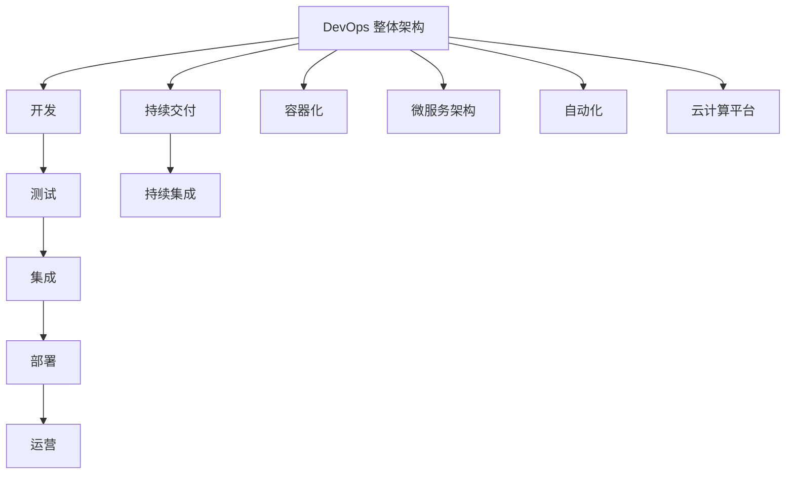

                 

# DevOps 实践指南更新：持续交付和部署的最新技术

> **关键词：** DevOps、持续交付、持续集成、容器化、微服务、自动化、云计算、Kubernetes

> **摘要：** 本文将深入探讨 DevOps 文化下的持续交付和部署实践，梳理最新技术趋势，分析核心算法原理，并通过实际案例讲解如何实现高效的持续交付和部署。本文旨在为技术团队提供一套实用的指南，以应对快速变化的技术环境。

## 1. 背景介绍

### 1.1 目的和范围

本文旨在为 DevOps 实践者提供一份全面的指南，帮助其掌握持续交付和部署的最新技术。文章将涵盖从基础概念到高级技术的各个层面，包括但不限于容器化、微服务架构、自动化工具和云计算平台。

### 1.2 预期读者

本文适合具备一定 DevOps 基础的工程师和团队主管，特别是那些希望提升持续交付和部署效率的技术团队。对于初学者，建议先了解 DevOps 基础知识后再阅读本文。

### 1.3 文档结构概述

本文分为以下几个部分：

- 背景介绍：概述 DevOps 的意义和持续交付、部署的核心概念。
- 核心概念与联系：介绍 DevOps 相关的核心概念和架构，并使用 Mermaid 流程图进行展示。
- 核心算法原理 & 具体操作步骤：讲解持续交付和部署的关键算法和操作步骤，并使用伪代码进行描述。
- 数学模型和公式 & 详细讲解 & 举例说明：介绍相关的数学模型和公式，并通过实例进行说明。
- 项目实战：通过实际案例展示如何实现持续交付和部署。
- 实际应用场景：讨论持续交付和部署在不同场景下的应用。
- 工具和资源推荐：推荐学习资源、开发工具和框架。
- 总结：展望持续交付和部署的未来发展趋势与挑战。
- 附录：常见问题与解答。
- 扩展阅读 & 参考资料：提供进一步学习的技术文献和资源。

### 1.4 术语表

#### 1.4.1 核心术语定义

- **DevOps：** DevOps 是一种软件开发和运营的文化、实践和工具，旨在缩短产品交付周期、提高软件质量并增强团队之间的协作。
- **持续交付（CI/CD）：** 持续交付是一种软件开发和部署方法，通过自动化测试、构建和部署流程，确保软件快速、安全地交付到生产环境。
- **容器化：** 容器化是一种将应用程序及其依赖项打包到可移植的容器中的技术，确保应用程序在不同环境中一致运行。
- **微服务：** 微服务是一种将应用程序分解为小型、独立的服务单元的方法，每个服务负责特定的业务功能。
- **自动化：** 自动化是使用工具和技术自动执行重复性任务和流程，以提高效率和质量。
- **云计算：** 云计算是一种通过网络访问计算资源的服务模式，包括基础设施即服务（IaaS）、平台即服务（PaaS）和软件即服务（SaaS）。

#### 1.4.2 相关概念解释

- **持续集成（CI）：** 持续集成是一种开发实践，通过自动化构建和测试，确保代码库中的每次提交都是可集成和可运行的。
- **持续部署（CD）：** 持续部署是一种自动化将应用程序从开发环境部署到生产环境的过程，确保快速、可靠地交付软件。
- **Kubernetes：** Kubernetes 是一个开源容器编排平台，用于自动化容器化应用程序的部署、扩展和管理。

#### 1.4.3 缩略词列表

- **CI/CD：** 持续集成/持续部署
- **IaaS：** 基础设施即服务
- **PaaS：** 平台即服务
- **SaaS：** 软件即服务
- **Docker：** 开源容器引擎
- **Kubernetes：** 开源容器编排平台

## 2. 核心概念与联系

### 2.1 DevOps 整体架构

DevOps 整体架构包括开发（Development）、测试（Testing）、集成（Integration）、部署（Deployment）和运营（Operations）等环节。其核心在于通过自动化、协作和反馈循环，实现从代码提交到生产环境部署的快速、可靠流程。

### 2.2 持续交付与持续集成

持续交付和持续集成是 DevOps 中的两个关键环节。持续集成（CI）确保每次代码提交都是可集成和可运行的，而持续交付（CD）则自动化构建、测试和部署流程，确保软件快速、安全地交付到生产环境。

### 2.3 容器化与微服务架构

容器化技术（如 Docker）使应用程序及其依赖项打包为可移植的容器，确保在不同环境中的一致性。微服务架构将应用程序分解为小型、独立的服务单元，提高可扩展性和可维护性。

### 2.4 自动化与云计算平台

自动化工具（如 Jenkins、Ansible）用于自动化构建、测试、部署和管理应用程序。云计算平台（如 AWS、Azure、Google Cloud）提供基础设施、平台和软件服务，支持自动化和弹性扩展。

### 2.5 Mermaid 流程图



## 3. 核心算法原理 & 具体操作步骤

### 3.1 持续交付算法原理

持续交付的核心在于确保每次代码提交都是可集成和可运行的，具体算法原理如下：

```plaintext
算法：持续交付
输入：代码库、测试环境、生产环境
输出：稳定的生产环境

步骤：
1. 每次代码提交时，自动执行集成测试，确保代码库中的每次提交都是可集成的。
2. 通过自动化构建工具（如 Jenkins）构建应用程序，生成可执行的二进制文件。
3. 在测试环境中部署构建版本，并执行自动化测试（如单元测试、集成测试），确保应用程序功能正常。
4. 如果测试通过，将构建版本部署到生产环境，并进行手动或自动化验收测试。
5. 如果验收测试通过，则持续交付成功；否则，回滚到上一个稳定版本。
```

### 3.2 持续集成算法原理

持续集成（CI）的核心在于自动化构建和测试，具体算法原理如下：

```plaintext
算法：持续集成
输入：代码库、构建服务器、测试服务器
输出：稳定的代码库

步骤：
1. 代码库中的每次提交都会触发构建任务。
2. 构建服务器自动拉取最新代码，执行编译、打包等构建步骤。
3. 自动化测试服务器执行单元测试、集成测试等测试步骤。
4. 如果构建和测试都通过，则合并到主分支；否则，拒绝合并。
5. 持续集成平台（如 Jenkins）提供可视化界面，显示构建状态和测试结果。
```

### 3.3 容器化操作步骤

容器化技术的核心在于将应用程序及其依赖项打包为可移植的容器，具体操作步骤如下：

```plaintext
步骤：
1. 使用 Dockerfile 定义应用程序的容器镜像，包括基础镜像、依赖项和环境变量等。
2. 使用 Docker build 命令构建容器镜像。
3. 使用 Docker run 命令运行容器，并映射端口、挂载卷等。
4. 使用 Docker push 命令将容器镜像推送到容器镜像仓库（如 Docker Hub）。
5. 在其他环境中使用 Docker pull 命令拉取容器镜像，并使用 Docker run 运行容器。
```

### 3.4 微服务部署操作步骤

微服务架构的核心在于将应用程序分解为小型、独立的服务单元，具体部署操作步骤如下：

```plaintext
步骤：
1. 使用服务拆分工具（如 Service Mesh）定义服务间的通信规则和流量管理策略。
2. 使用容器化技术（如 Docker）将每个微服务打包为容器镜像。
3. 使用容器编排平台（如 Kubernetes）部署和管理容器化微服务。
4. 配置负载均衡器（如 Nginx）、数据库（如 MySQL）和其他基础设施组件。
5. 在生产环境中进行负载测试和性能调优，确保系统稳定、高效运行。
```

## 4. 数学模型和公式 & 详细讲解 & 举例说明

### 4.1 数学模型：持续交付效率

持续交付效率可以用以下数学模型表示：

$$ E = \frac{t_{dev} + t_{test} + t_{deploy}}{t_{total}} $$

其中，$E$ 表示持续交付效率，$t_{dev}$、$t_{test}$ 和 $t_{deploy}$ 分别表示开发、测试和部署所需时间，$t_{total}$ 表示整个持续交付周期所需时间。

### 4.2 公式解释

- **$t_{dev}$：** 开发时间，包括编写、审查和提交代码的时间。
- **$t_{test}$：** 测试时间，包括执行自动化测试、手动测试和回归测试的时间。
- **$t_{deploy}$：** 部署时间，包括构建、部署和验证应用程序的时间。
- **$t_{total}$：** 整个持续交付周期所需时间，包括从代码提交到生产环境部署的时间。

### 4.3 举例说明

假设一个持续交付周期为 10 天，其中开发时间为 3 天，测试时间为 2 天，部署时间为 1 天，则持续交付效率为：

$$ E = \frac{3 + 2 + 1}{10} = 0.6 $$

这意味着该持续交付周期中有 60% 的时间用于实际交付，还有 40% 的时间用于开发、测试和部署等环节。

### 4.4 数学模型：容器化效率

容器化效率可以用以下数学模型表示：

$$ E_{container} = \frac{t_{build} + t_{deploy} + t_{test}}{t_{total}} $$

其中，$E_{container}$ 表示容器化效率，$t_{build}$、$t_{deploy}$ 和 $t_{test}$ 分别表示构建、部署和测试容器镜像所需时间，$t_{total}$ 表示整个容器化周期所需时间。

### 4.5 公式解释

- **$t_{build}$：** 构建时间，包括从代码到容器镜像的构建时间。
- **$t_{deploy}$：** 部署时间，包括容器镜像的部署和配置时间。
- **$t_{test}$：** 测试时间，包括在容器环境中执行自动化测试的时间。
- **$t_{total}$：** 整个容器化周期所需时间，包括从代码提交到容器镜像部署的时间。

### 4.6 举例说明

假设一个容器化周期为 5 天，其中构建时间为 2 天，部署时间为 1 天，测试时间为 2 天，则容器化效率为：

$$ E_{container} = \frac{2 + 1 + 2}{5} = 0.8 $$

这意味着该容器化周期中有 80% 的时间用于实际容器化，还有 20% 的时间用于构建、部署和测试等环节。

## 5. 项目实战：代码实际案例和详细解释说明

### 5.1 开发环境搭建

为了更好地展示持续交付和部署的实践，我们将使用一个简单的 Web 应用程序作为案例。首先，需要搭建开发环境，包括以下步骤：

1. 安装操作系统（如 Ubuntu 18.04）。
2. 安装 Docker 和 Kubernetes。
3. 安装 Java 开发工具包（如 JDK 11）。
4. 安装版本控制工具（如 Git）。

### 5.2 源代码详细实现和代码解读

本案例的 Web 应用程序基于 Spring Boot 框架，实现一个简单的待办事项管理功能。以下是关键代码片段及其解读：

```java
// 待办事项管理控制器
@RestController
@RequestMapping("/tasks")
public class TaskController {

    @Autowired
    private TaskRepository taskRepository;

    @GetMapping
    public List<Task> getAllTasks() {
        return taskRepository.findAll();
    }

    @PostMapping
    public Task createTask(@RequestBody Task task) {
        return taskRepository.save(task);
    }
}
```

解读：
- 使用 Spring Boot 框架创建一个 REST 控制器，处理待办事项的增删改查操作。
- `@RestController` 注解表示该类是一个 REST 控制器。
- `@RequestMapping` 注解定义了处理 HTTP 请求的 URL 路径。
- `@Autowired` 注解自动注入依赖项，如任务仓库（`TaskRepository`）。

### 5.3 代码解读与分析

本节将分析关键组件的实现和部署细节：

1. **任务模型（Task）**
   - 任务模型（`Task`）用于表示待办事项，包括任务名称、描述、状态等信息。

2. **任务仓库（TaskRepository）**
   - 任务仓库（`TaskRepository`）是一个 Spring Data JPA 仓库，用于操作任务数据库。

3. **Dockerfile**
   - Dockerfile 用于定义应用程序的容器镜像，包括基础镜像（如 `openjdk:11-jdk-alpine`）、依赖项安装（如 Maven、Gradle）和应用程序部署（如 Spring Boot 应用的启动命令）。

```Dockerfile
FROM openjdk:11-jdk-alpine
RUN apk add --no-cache maven gradle
COPY ./pom.xml ./src/main/java
RUN gradle build
COPY ./build/libs/*.jar /app/task-manager.jar
ENTRYPOINT ["java","-Djava.security.egd=file:/dev/./urandom","-jar","/app/task-manager.jar"]
```

4. **Kubernetes 配置**
   - Kubernetes 配置（如 `deployment.yaml`、`service.yaml`）用于部署和管理应用程序，包括部署策略（如滚动更新）、容器资源限制、服务暴露等。

```yaml
apiVersion: apps/v1
kind: Deployment
metadata:
  name: task-manager
spec:
  replicas: 3
  selector:
    matchLabels:
      app: task-manager
  template:
    metadata:
      labels:
        app: task-manager
    spec:
      containers:
      - name: task-manager
        image: task-manager:latest
        ports:
        - containerPort: 8080
        resources:
          limits:
            memory: "128Mi"
            cpu: "500m"
```

解读：
- `apiVersion` 和 `kind` 定义了 Kubernetes 配置的版本和类型。
- `metadata` 和 `spec` 定义了部署的名称、副本数量和选择器。
- `template` 定义了部署的模板，包括容器名称、镜像、端口和资源限制。

### 5.4 部署流程

1. **构建和推送到镜像仓库：**
   - 使用 Dockerfile 构建应用程序的容器镜像，并使用 `docker push` 命令将镜像推送到容器镜像仓库。

2. **部署到 Kubernetes 集群：**
   - 使用 `kubectl apply` 命令将 Kubernetes 配置应用到集群，自动部署和管理应用程序。

3. **持续交付：**
   - 每次代码提交后，触发 CI/CD 流程，自动化构建、测试和部署应用程序。

4. **监控与反馈：**
   - 使用 Prometheus、Grafana 等监控工具实时监控应用程序的运行状态，并在出现问题时自动反馈和告警。

### 5.5 分析与优化

通过实际部署和运行应用程序，可以收集以下关键数据：

1. **构建时间：** 从代码提交到容器镜像构建完成所需时间。
2. **部署时间：** 从容器镜像部署到 Kubernetes 集群到服务启动完成所需时间。
3. **测试时间：** 自动化测试的执行时间和结果。
4. **资源使用情况：** 容器和集群的资源使用情况，如 CPU、内存、网络和存储。

根据这些数据，可以分析应用程序的持续交付效率，并进行优化：

1. **代码优化：** 优化代码质量，减少代码提交和构建时间。
2. **容器化优化：** 优化 Dockerfile，减少容器镜像的大小和启动时间。
3. **自动化测试优化：** 增加自动化测试覆盖率，优化测试执行效率。
4. **部署优化：** 优化 Kubernetes 配置，提高部署速度和稳定性。

## 6. 实际应用场景

持续交付和部署技术在不同场景下具有广泛的应用，以下是一些典型应用场景：

1. **初创公司：** 初创公司通常需要快速迭代和交付产品，持续交付和部署技术有助于实现快速、可靠的产品发布。
2. **互联网公司：** 互联网公司拥有大量应用程序和服务，持续交付和部署技术有助于确保服务的高可用性和稳定性。
3. **金融行业：** 金融行业对安全性和合规性有严格要求，持续交付和部署技术有助于确保软件符合相关法规要求。
4. **医疗行业：** 医疗行业需要确保软件系统准确、可靠，持续交付和部署技术有助于提高医疗数据处理和分析的效率。
5. **政府机构：** 政府机构需要高效、可靠的 IT 系统来支持公共服务，持续交付和部署技术有助于提高政府 IT 系统的响应速度和服务质量。

## 7. 工具和资源推荐

### 7.1 学习资源推荐

#### 7.1.1 书籍推荐

- 《DevOps：从实践到成功之路》
- 《持续交付：发布可靠软件的系统方法》
- 《容器化与 Kubernetes 实践指南》

#### 7.1.2 在线课程

- Coursera《DevOps：自动化与敏捷实践》
- Udemy《Kubernetes 从入门到精通》
- Pluralsight《Docker 容器化实战》

#### 7.1.3 技术博客和网站

- [Docker 官方博客](https://www.docker.com/blog/)
- [Kubernetes 官方文档](https://kubernetes.io/docs/home/)
- [DevOps 实践社区](https://devopstutorial.com/)

### 7.2 开发工具框架推荐

#### 7.2.1 IDE和编辑器

- IntelliJ IDEA
- Visual Studio Code
- Sublime Text

#### 7.2.2 调试和性能分析工具

- JProfiler
- VisualVM
- Prometheus

#### 7.2.3 相关框架和库

- Spring Boot
- Spring Cloud
- Netflix OSS

### 7.3 相关论文著作推荐

#### 7.3.1 经典论文

- 《DevOps：整合开发与运维》
- 《持续交付：一种软件开发和部署的新方法》
- 《微服务：简化分布式系统的设计》

#### 7.3.2 最新研究成果

- 《Kubernetes 架构与实战》
- 《容器化技术：Docker 与 Kubernetes》
- 《自动化运维：DevOps 实践指南》

#### 7.3.3 应用案例分析

- 《初创公司如何利用 DevOps 提高产品迭代速度》
- 《互联网公司如何通过持续交付和部署提升服务质量》
- 《金融行业如何利用 DevOps 保证合规性与安全性》

## 8. 总结：未来发展趋势与挑战

随着技术的不断演进，持续交付和部署技术在未来将继续发展，面临以下挑战：

1. **复杂性与规模：** 随着应用程序和服务的规模不断扩大，持续交付和部署的复杂度也将增加，如何高效地管理和运维将成为关键挑战。
2. **安全性与合规性：** 在金融、医疗等高要求行业，安全性和合规性是持续交付和部署的核心问题，如何确保软件的安全和合规性将是重要挑战。
3. **技术与工具更新：** 持续交付和部署技术不断更新，如何跟上技术发展趋势，充分利用新技术和工具将是技术团队面临的挑战。
4. **团队协作与培训：** 持续交付和部署需要跨部门协作，如何提高团队协作效率，进行有效的培训和知识共享也将是重要挑战。

## 9. 附录：常见问题与解答

### 9.1 常见问题

1. **什么是 DevOps？**
   - DevOps 是一种软件开发和运营的文化、实践和工具，旨在缩短产品交付周期、提高软件质量并增强团队之间的协作。

2. **什么是持续交付和持续集成？**
   - 持续交付是一种软件开发和部署方法，通过自动化测试、构建和部署流程，确保软件快速、安全地交付到生产环境。
   - 持续集成是一种开发实践，通过自动化构建和测试，确保代码库中的每次提交都是可集成和可运行的。

3. **什么是容器化和微服务架构？**
   - 容器化是一种将应用程序及其依赖项打包到可移植的容器中的技术，确保应用程序在不同环境中一致运行。
   - 微服务架构是一种将应用程序分解为小型、独立的服务单元的方法，每个服务负责特定的业务功能。

4. **如何提高持续交付和部署效率？**
   - 提高持续交付和部署效率的关键在于优化代码质量、容器化技术、自动化测试和部署流程。

### 9.2 解答

1. **什么是 DevOps？**
   - DevOps 是一种软件开发和运营的文化、实践和工具，旨在缩短产品交付周期、提高软件质量并增强团队之间的协作。DevOps 强调开发（Development）和运营（Operations）之间的紧密合作，通过自动化、协作和反馈循环，实现从代码提交到生产环境部署的快速、可靠流程。

2. **什么是持续交付和持续集成？**
   - 持续交付（Continuous Delivery，简称 CD）是一种软件开发和部署方法，通过自动化测试、构建和部署流程，确保软件快速、安全地交付到生产环境。持续交付的目标是确保软件始终处于可发布状态，只需进行少量修改即可部署到生产环境。
   - 持续集成（Continuous Integration，简称 CI）是一种开发实践，通过自动化构建和测试，确保代码库中的每次提交都是可集成和可运行的。持续集成的目标是通过频繁的代码提交和集成，发现和修复潜在问题，提高代码质量。

3. **什么是容器化和微服务架构？**
   - 容器化是一种将应用程序及其依赖项打包到可移植的容器中的技术，确保应用程序在不同环境中一致运行。容器化通过使用轻量级、可隔离的容器来封装应用程序，使得应用程序可以在不同的操作系统和硬件环境中运行，提高部署和运维的灵活性。
   - 微服务架构是一种将应用程序分解为小型、独立的服务单元的方法，每个服务负责特定的业务功能。微服务架构通过将应用程序划分为多个小型、自治的服务单元，提高系统的可扩展性、可维护性和容错性。每个微服务都可以独立开发、部署和扩展，降低系统的复杂度和风险。

4. **如何提高持续交付和部署效率？**
   - 提高持续交付和部署效率的关键在于优化代码质量、容器化技术、自动化测试和部署流程。以下是一些建议：
     - **优化代码质量**：通过代码审查、静态代码分析和单元测试等手段，确保代码质量，减少缺陷和错误。
     - **使用容器化技术**：使用容器化技术（如 Docker），将应用程序及其依赖项打包为可移植的容器，简化部署和运维过程。
     - **自动化测试**：通过自动化测试（如单元测试、集成测试和性能测试），快速发现和修复问题，提高软件质量。
     - **优化部署流程**：通过自动化部署工具（如 Jenkins、Ansible），自动化构建、部署和监控流程，减少人工干预，提高部署速度和可靠性。
     - **持续优化**：定期评估和改进持续交付和部署流程，根据实际情况进行调整和优化，提高整体效率。

## 10. 扩展阅读 & 参考资料

- [《DevOps Handbook》](https://www.devopshandbook.info/)
- [《持续交付》](https://www booked by google com/books?id=Ab2zjFTpmZ4C&pg=PA1&lpg=PA1&dq=continuous+delivery&source=bl&ots=89_nXWj_ez&sig=ACfU3U29271749379443563949454684&hl=en)
- [Docker 官方文档](https://docs.docker.com/)
- [Kubernetes 官方文档](https://kubernetes.io/docs/home/)
- [Spring Boot 官方文档](https://docs.spring.io/spring-boot/docs/current/reference/html/)
- [Netflix OSS](https://netflix.github.io/oss/)

