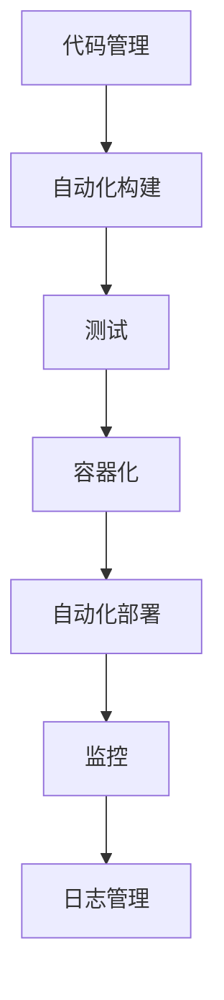

                 

# DevOps工具链搭建与集成

> **关键词：** DevOps、工具链、自动化、CI/CD、持续集成、持续部署、容器化、监控、日志管理

> **摘要：** 本文将详细介绍DevOps工具链的搭建与集成过程，包括核心概念、算法原理、数学模型、实际应用场景和资源推荐。通过逐步分析和实践，帮助读者深入了解DevOps工具链的工作原理和实际应用。

## 1. 背景介绍

### 1.1 目的和范围

本文旨在为广大IT从业者提供一套完整的DevOps工具链搭建与集成指南。通过详细讲解核心概念、原理和实践步骤，帮助读者掌握DevOps工具链的搭建、配置和优化方法，实现持续集成和持续部署（CI/CD）的目标。

### 1.2 预期读者

本文适合具有以下背景的读者：

1. 初学者：对DevOps和自动化构建有一定了解，希望深入了解工具链的搭建与集成的读者。
2. 中级开发者：已经接触过DevOps工具链，希望提升技能水平和解决实际问题的开发者。
3. 高级工程师：对DevOps有一定实践经验，希望进一步优化工具链和工作流程的工程师。

### 1.3 文档结构概述

本文分为以下章节：

1. 背景介绍：介绍本文的目的、范围、预期读者和文档结构。
2. 核心概念与联系：阐述DevOps工具链中的核心概念和原理，使用Mermaid流程图展示整体架构。
3. 核心算法原理 & 具体操作步骤：详细讲解工具链中的关键算法和操作步骤，使用伪代码进行阐述。
4. 数学模型和公式 & 详细讲解 & 举例说明：介绍工具链中涉及到的数学模型和公式，并给出实际应用案例。
5. 项目实战：通过代码实际案例，详细解释工具链的搭建与集成过程。
6. 实际应用场景：探讨DevOps工具链在不同领域的应用场景。
7. 工具和资源推荐：推荐学习资源、开发工具框架和相关论文著作。
8. 总结：总结未来发展趋势与挑战。
9. 附录：常见问题与解答。
10. 扩展阅读 & 参考资料：提供更多的扩展阅读和参考资料。

### 1.4 术语表

#### 1.4.1 核心术语定义

1. **DevOps**：一种软件开发和运维的协作文化、实践和工具，旨在缩短软件开发周期、提高软件质量、降低成本。
2. **工具链**：一系列相关工具的组合，用于实现DevOps中的各项任务，如代码管理、自动化构建、测试、部署等。
3. **CI/CD**：持续集成（Continuous Integration）和持续部署（Continuous Deployment）的简称，是一种软件开发实践，旨在快速、频繁地交付高质量的软件。
4. **容器化**：一种将应用程序及其依赖项打包为可移植的容器（如Docker容器）的技术，便于部署和管理。
5. **监控**：对系统、应用程序和网络等资源进行实时监测，以发现和解决问题。
6. **日志管理**：收集、存储、分析和处理系统、应用程序和用户活动的日志信息。

#### 1.4.2 相关概念解释

1. **基础设施即代码（Infrastructure as Code，IaC）**：将基础设施（如虚拟机、网络、存储等）的配置和管理转化为代码，以便通过自动化工具进行管理。
2. **版本控制**：一种管理源代码和文件版本的方法，如Git，可以跟踪代码的变更、分支和合并。
3. **自动化构建**：使用脚本或工具自动执行构建、测试和打包应用程序的过程。
4. **自动化部署**：使用脚本或工具自动执行应用程序的部署过程，如从开发环境到生产环境的迁移。

#### 1.4.3 缩略词列表

- CI：持续集成（Continuous Integration）
- CD：持续部署（Continuous Deployment）
- IaC：基础设施即代码（Infrastructure as Code）
- Docker：一种流行的容器化技术
- Kubernetes：一种开源的容器编排平台
- Jenkins：一种流行的持续集成工具
- Git：一种版本控制系统

## 2. 核心概念与联系

### 2.1 核心概念

在搭建和集成DevOps工具链时，需要了解以下核心概念：

1. **代码管理**：使用版本控制系统（如Git）管理源代码，实现代码的变更、分支和合并。
2. **自动化构建**：使用构建工具（如Maven、Gradle）自动执行编译、测试、打包等任务，生成可运行的软件。
3. **测试**：执行自动化测试（如单元测试、集成测试），确保软件质量。
4. **容器化**：使用Docker等容器化技术，将应用程序及其依赖项打包为容器，便于部署和管理。
5. **自动化部署**：使用自动化工具（如Jenkins、Kubernetes）实现应用程序的自动部署和迁移。
6. **监控**：使用监控工具（如Prometheus、Grafana）实时监测系统、应用程序和网络的性能和健康状况。
7. **日志管理**：使用日志收集和管理工具（如ELK栈、Logstash）收集、存储、分析和处理日志信息。

### 2.2 原理和架构

下面是一个DevOps工具链的Mermaid流程图，展示了各个核心概念之间的联系和交互：



### 2.3 整体架构

DevOps工具链的整体架构如下：

1. **代码管理**：使用Git等版本控制系统，实现代码的版本管理和协作开发。
2. **自动化构建**：使用Maven、Gradle等构建工具，实现自动化编译、测试、打包等任务。
3. **测试**：执行自动化测试，确保软件质量。
4. **容器化**：使用Docker等容器化技术，将应用程序及其依赖项打包为容器。
5. **自动化部署**：使用Jenkins、Kubernetes等自动化工具，实现应用程序的自动部署和迁移。
6. **监控**：使用Prometheus、Grafana等监控工具，实时监测系统、应用程序和网络的性能和健康状况。
7. **日志管理**：使用ELK栈、Logstash等日志收集和管理工具，收集、存储、分析和处理日志信息。

通过以上核心概念和原理的讲解，读者可以对DevOps工具链有一个整体的认识。接下来，本文将详细讲解工具链中的核心算法原理和具体操作步骤。

## 3. 核心算法原理 & 具体操作步骤

### 3.1 代码管理

#### 3.1.1 Git原理

Git是一种分布式版本控制系统，用于管理源代码的版本和协作开发。其核心算法包括：

1. **树状结构**：Git将源代码组织成一个树状结构，每个提交都是一个节点，节点之间通过指针连接。
2. **哈希算法**：Git使用SHA-1算法生成哈希值，用于标识每个提交和文件的内容。
3. **暂存区**：Git使用暂存区（staging area）来暂存修改，用于暂存即将提交的文件。

#### 3.1.2 Git操作步骤

1. **安装Git**：在操作系统上安装Git客户端。
2. **初始化仓库**：使用`git init`命令初始化本地仓库。
3. **添加文件**：使用`git add`命令将文件添加到暂存区。
4. **提交变更**：使用`git commit`命令将暂存区的变更提交到本地仓库。
5. **克隆仓库**：使用`git clone`命令克隆远程仓库到本地。

### 3.2 自动化构建

#### 3.2.1 Maven原理

Maven是一种流行的构建工具，用于自动化编译、测试、打包等任务。其核心算法包括：

1. **项目对象模型（POM）**：Maven使用项目对象模型（POM）来描述项目的配置和依赖关系。
2. **插件和生命周期**：Maven定义了一套生命周期，包括编译、测试、打包等阶段，每个阶段都有一组插件负责执行具体任务。
3. **依赖管理**：Maven通过依赖管理机制，自动下载和管理项目的依赖库。

#### 3.2.2 Maven操作步骤

1. **安装Maven**：在操作系统上安装Maven。
2. **创建项目**：使用`mvn archetype:generate`命令创建Maven项目。
3. **编写POM文件**：在项目的pom.xml文件中定义项目的配置和依赖关系。
4. **编译项目**：使用`mvn compile`命令编译项目。
5. **运行测试**：使用`mvn test`命令运行单元测试。
6. **打包项目**：使用`mvn package`命令打包项目。

### 3.3 测试

#### 3.3.1 单元测试原理

单元测试是一种自动化测试方法，用于验证单个模块的功能。其核心算法包括：

1. **测试用例**：编写测试用例，用于测试模块的输入、输出和预期行为。
2. **断言**：使用断言语句（如JUnit的`assertEquals`）验证测试结果是否符合预期。

#### 3.3.2 单元测试操作步骤

1. **安装JUnit**：在项目中添加JUnit依赖。
2. **编写测试类**：编写测试类，包含测试方法和测试用例。
3. **运行测试**：使用JUnit框架运行测试类。
4. **查看测试结果**：查看测试报告，分析测试结果。

### 3.4 容器化

#### 3.4.1 Docker原理

Docker是一种容器化技术，用于将应用程序及其依赖项打包为容器。其核心算法包括：

1. **镜像**：Docker使用镜像（image）来存储应用程序的配置和依赖项。
2. **容器**：容器（container）是基于镜像的可执行实例，用于运行应用程序。
3. **网络和存储**：Docker提供网络和存储机制，用于容器之间的通信和数据共享。

#### 3.4.2 Docker操作步骤

1. **安装Docker**：在操作系统上安装Docker。
2. **编写Dockerfile**：在项目中编写Dockerfile，定义镜像的构建过程。
3. **构建镜像**：使用`docker build`命令构建镜像。
4. **运行容器**：使用`docker run`命令运行容器。

### 3.5 自动化部署

#### 3.5.1 Jenkins原理

Jenkins是一种流行的持续集成工具，用于自动化构建、测试和部署。其核心算法包括：

1. **构建管道**：Jenkins使用构建管道（pipeline）来定义和执行自动化任务。
2. **插件和扩展**：Jenkins支持丰富的插件和扩展，用于增强其功能。
3. **持续集成**：Jenkins通过持续集成（CI）模式，实现自动化构建、测试和部署。

#### 3.5.2 Jenkins操作步骤

1. **安装Jenkins**：在操作系统上安装Jenkins。
2. **创建项目**：在Jenkins中创建一个新项目。
3. **配置构建管道**：在项目的配置页面中，配置构建管道，定义构建、测试和部署步骤。
4. **触发构建**：使用Jenkins的触发器，定期或手动触发构建任务。
5. **查看构建结果**：查看构建结果，分析构建和部署过程。

### 3.6 监控

#### 3.6.1 Prometheus原理

Prometheus是一种开源监控解决方案，用于实时监测系统、应用程序和网络的性能和健康状况。其核心算法包括：

1. **时间序列数据库**：Prometheus使用时间序列数据库（TSDB）存储监控数据。
2. **拉取式监控**：Prometheus通过定期拉取目标实例的指标数据，进行监控。
3. **报警管理**：Prometheus支持自定义报警规则，实现实时报警。

#### 3.6.2 Prometheus操作步骤

1. **安装Prometheus**：在操作系统上安装Prometheus。
2. **配置靶机**：配置被监控的靶机，暴露监控指标端口。
3. **配置Prometheus**：配置Prometheus的配置文件，定义监控目标和报警规则。
4. **启动Prometheus**：启动Prometheus服务，开始监控。
5. **查看监控数据**：使用Grafana等可视化工具，查看监控数据和报警信息。

### 3.7 日志管理

#### 3.7.1 ELK栈原理

ELK栈是一种开源日志管理解决方案，包括Elasticsearch、Logstash和Kibana三个组件。其核心算法包括：

1. **日志收集**：Logstash负责收集日志数据，并将其发送到Elasticsearch。
2. **日志存储**：Elasticsearch负责存储和索引日志数据。
3. **日志分析**：Kibana负责可视化日志数据，并提供日志分析功能。

#### 3.7.2 ELK栈操作步骤

1. **安装Elasticsearch**：在操作系统上安装Elasticsearch。
2. **安装Logstash**：在操作系统上安装Logstash。
3. **配置Logstash**：配置Logstash的输入、过滤和输出插件，定义日志收集规则。
4. **安装Kibana**：在操作系统上安装Kibana。
5. **配置Kibana**：配置Kibana的Elasticsearch连接信息，定义日志分析仪表板。
6. **启动服务**：启动Elasticsearch、Logstash和Kibana服务，开始日志收集和分析。

通过以上核心算法原理和具体操作步骤的讲解，读者可以了解DevOps工具链的基本工作原理和搭建方法。接下来，本文将详细讲解工具链中的数学模型和公式，并给出实际应用案例。

## 4. 数学模型和公式 & 详细讲解 & 举例说明

在DevOps工具链中，涉及到许多数学模型和公式，用于衡量和优化各个阶段的性能和效率。以下是一些常见的数学模型和公式，并给出详细讲解和实际应用案例。

### 4.1 持续集成中的代码质量评估

持续集成（CI）过程中，代码质量评估是关键环节之一。常用的评估指标包括代码复杂度、代码冗余度、代码重复率等。以下是一个示例公式：

\[ \text{代码质量评分} = \frac{\text{代码复杂度得分} + \text{代码冗余度得分} + \text{代码重复率得分}}{3} \]

**实际应用案例**：

假设一个Java项目，经过静态代码分析工具分析，得到以下结果：

- 代码复杂度得分：8
- 代码冗余度得分：5
- 代码重复率得分：7

代入公式计算，得到代码质量评分为：

\[ \text{代码质量评分} = \frac{8 + 5 + 7}{3} = 7.0 \]

根据代码质量评分，可以评估项目的代码质量，并采取相应的改进措施。

### 4.2 构建速度优化

构建速度是持续集成过程中重要的性能指标。常用的优化方法包括并行构建、缓存依赖等。以下是一个示例公式：

\[ \text{构建速度} = \frac{\text{总构建时间}}{\text{并发构建数量}} \]

**实际应用案例**：

假设一个Maven项目，使用并行构建功能，同时构建10个模块。经过测量，总构建时间为100秒。代入公式计算，得到构建速度为：

\[ \text{构建速度} = \frac{100\text{秒}}{10} = 10\text{秒/模块} \]

通过优化构建速度，可以提高持续集成的效率，缩短构建时间，加快软件交付周期。

### 4.3 测试覆盖率评估

测试覆盖率是衡量测试效果的重要指标。常用的评估指标包括代码覆盖率、分支覆盖率等。以下是一个示例公式：

\[ \text{测试覆盖率} = \frac{\text{已测试代码行数}}{\text{总代码行数}} \times 100\% \]

**实际应用案例**：

假设一个Java项目，经过单元测试，已测试代码行数为5000行，总代码行数为10000行。代入公式计算，得到测试覆盖率为：

\[ \text{测试覆盖率} = \frac{5000}{10000} \times 100\% = 50\% \]

根据测试覆盖率，可以评估测试的全面性和有效性，并进一步优化测试策略。

### 4.4 系统负载评估

系统负载是衡量系统性能和稳定性的重要指标。常用的评估指标包括CPU利用率、内存利用率、磁盘I/O等。以下是一个示例公式：

\[ \text{系统负载} = \frac{\text{当前系统资源使用量}}{\text{最大系统资源使用量}} \times 100\% \]

**实际应用案例**：

假设一个Web应用程序，当前CPU利用率为80%，最大CPU利用率为100%。代入公式计算，得到系统负载为：

\[ \text{系统负载} = \frac{80\%}{100\%} \times 100\% = 80\% \]

根据系统负载，可以评估系统的资源使用情况，并采取相应的优化措施，如增加硬件资源、调整系统配置等。

### 4.5 日志分析中的异常检测

日志分析是DevOps工具链中的重要环节，用于发现和解决系统故障。常用的异常检测方法包括基于阈值的异常检测、基于机器学习的异常检测等。以下是一个示例公式：

\[ \text{异常概率} = \frac{\text{异常日志数量}}{\text{总日志数量}} \]

**实际应用案例**：

假设一个系统日志中，异常日志数量为100条，总日志数量为1000条。代入公式计算，得到异常概率为：

\[ \text{异常概率} = \frac{100}{1000} = 10\% \]

根据异常概率，可以判断系统日志中的异常情况，并采取相应的处理措施。

通过以上数学模型和公式的讲解，读者可以更好地理解和应用DevOps工具链中的性能优化和评估方法。接下来，本文将介绍一个实际项目案例，展示DevOps工具链的搭建与集成过程。

### 5. 项目实战：代码实际案例和详细解释说明

在本节中，我们将通过一个实际项目案例，详细介绍DevOps工具链的搭建与集成过程。该案例将涵盖代码管理、自动化构建、测试、容器化、自动化部署、监控和日志管理等方面，以帮助读者全面了解DevOps工具链的应用和实践。

#### 5.1 开发环境搭建

首先，我们需要搭建开发环境，以便进行项目开发和集成。以下是具体步骤：

1. **安装操作系统**：选择一个适合的操作系统（如Ubuntu 20.04）并安装。
2. **安装Java开发环境**：安装Java开发工具包（JDK），配置环境变量。
3. **安装Maven**：下载并安装Maven，配置Maven环境变量。
4. **安装Git**：下载并安装Git，配置Git用户信息。
5. **安装Docker**：下载并安装Docker，配置Docker环境变量。

完成以上步骤后，我们就可以开始项目开发了。

#### 5.2 源代码详细实现和代码解读

在本节中，我们将介绍项目的源代码实现和关键代码解读。该项目是一个简单的Web应用程序，基于Spring Boot框架开发。

1. **项目结构**：

```  
.
├── pom.xml
├── src
│   ├── main
│   │   ├── java
│   │   │   └── com.example.myapp
│   │   │       └── MyApplication.java
│   │   └── resources
│   │       └── application.properties
│   └── test
│       ├── java
│       │   └── com.example.myapp
│       │       └── MyApplicationTest.java
│       └── resources
└── README.md
```

2. **关键代码解读**：

**MyApplication.java**：

```java  
package com.example.myapp;

import org.springframework.boot.SpringApplication;
import org.springframework.boot.autoconfigure.SpringBootApplication;

@SpringBootApplication
public class MyApplication {

    public static void main(String[] args) {
        SpringApplication.run(MyApplication.class, args);
    }
}
```

这是一个简单的Spring Boot应用程序，入口类为`MyApplication`。通过`@SpringBootApplication`注解，标识该类为Spring Boot应用程序的主类。`main`方法中，使用`SpringApplication.run`方法启动应用程序。

**application.properties**：

```properties  
server.port=8080  
spring.datasource.url=jdbc:mysql://localhost:3306/mydb?useSSL=false  
spring.datasource.username=root  
spring.datasource.password=root  
```

这是一个配置文件，用于配置应用程序的相关属性，如服务端口、数据库连接信息等。

**MyApplicationTest.java**：

```java  
package com.example.myapp;

import org.junit.jupiter.api.Test;
import static org.junit.jupiter.api.Assertions.assertEquals;

public class MyApplicationTest {

    @Test
    public void testHello() {
        String result = "Hello, World!";
        assertEquals(result, "Hello, World!");
    }
}
```

这是一个JUnit测试类，用于测试`MyApplication`类的功能。`testHello`方法中，通过`assertEquals`方法验证应用程序是否正确返回"Hello, World!"字符串。

#### 5.3 代码解读与分析

通过以上源代码的详细解读，我们可以了解到该项目的结构和功能。下面是对代码的进一步分析：

1. **项目结构**：

- `pom.xml`：Maven项目的依赖管理和构建配置文件。
- `src/main/java`：项目的源代码目录，包含应用程序的主类和业务逻辑代码。
- `src/main/resources`：项目的资源文件目录，包含配置文件和资源文件。
- `src/test/java`：项目的测试代码目录，包含单元测试类。
- `src/test/resources`：项目的测试资源文件目录。

2. **关键代码分析**：

- `MyApplication.java`：应用程序的主类，通过`@SpringBootApplication`注解，标识该类为Spring Boot应用程序的主类。`main`方法中，使用`SpringApplication.run`方法启动应用程序。
- `application.properties`：配置文件，用于配置应用程序的相关属性，如服务端口、数据库连接信息等。
- `MyApplicationTest.java`：JUnit测试类，用于测试应用程序的功能。`testHello`方法中，通过`assertEquals`方法验证应用程序是否正确返回"Hello, World!"字符串。

#### 5.4 容器化

在本节中，我们将使用Docker将项目容器化，以便于部署和管理。

1. **编写Dockerfile**：

在项目根目录下，创建一个名为`Dockerfile`的文件，用于定义镜像的构建过程。

```Dockerfile  
FROM openjdk:11-jdk-slim

ARG JAR_FILE=target/*.jar

COPY ${JAR_FILE} app.jar

EXPOSE 8080

ENTRYPOINT ["java","-Djava.security.egd=file:/dev/./urandom","-jar","/app.jar"]
```

该`Dockerfile`基于OpenJDK 11镜像，将应用程序打包为JAR文件，并暴露8080端口，用于服务访问。

2. **构建镜像**：

在终端中，进入项目根目录，执行以下命令构建镜像：

```bash  
docker build -t myapp:1.0.0 .  
```

其中，`myapp`是镜像的名称，`1.0.0`是镜像的版本号。

3. **运行容器**：

在终端中，执行以下命令运行容器：

```bash  
docker run -d -p 8080:8080 myapp:1.0.0  
```

其中，`-d`参数表示后台运行，`-p`参数用于映射容器端口到宿主机端口。

通过以上步骤，我们成功将项目容器化，并运行在一个独立的容器中。

#### 5.5 自动化部署

在本节中，我们将使用Jenkins实现项目的自动化部署。

1. **安装Jenkins**：

在操作系统上安装Jenkins，并配置Jenkins的Web界面。

2. **创建Jenkins项目**：

在Jenkins的Web界面中，创建一个新的项目，命名为"myapp-deploy"。

3. **配置构建管道**：

在项目的配置页面，配置构建管道，定义以下步骤：

- **源代码管理**：配置Git仓库地址和访问凭证，用于克隆项目代码。
- **构建步骤**：添加Maven构建步骤，编译和打包项目。
- **部署步骤**：添加Docker构建和运行容器步骤。

具体配置如下：

```  
pipeline {  
    agent any  
    stages {  
        stage('Clone Repository') {  
            steps {  
                git url: 'https://github.com/your-username/myapp.git', branch: 'master'  
            }  
        }  
        stage('Build Project') {  
            steps {  
                sh 'mvn clean package'  
            }  
        }  
        stage('Deploy') {  
            steps {  
                sh 'docker build -t myapp:1.0.0 .'  
                sh 'docker run -d -p 8080:8080 myapp:1.0.0'  
            }  
        }  
    }  
    post {  
        success {  
            echo 'Deployment successful!'  
        }  
        failure {  
            echo 'Deployment failed!'  
        }  
    }  
}
```

4. **触发构建**：

在Jenkins的Web界面中，手动触发构建，或配置定时构建任务。

通过以上步骤，我们成功实现了项目的自动化部署，每次项目更新时，Jenkins将自动编译、打包和部署项目。

#### 5.6 监控

在本节中，我们将使用Prometheus和Grafana实现项目的监控。

1. **安装Prometheus**：

在操作系统上安装Prometheus，并配置Prometheus的配置文件。

2. **配置靶机**：

在项目的Docker容器中，安装Prometheus靶机，并配置靶机的监控指标。

3. **配置Prometheus**：

在Prometheus的配置文件中，定义靶机的监控目标和报警规则。

4. **安装Grafana**：

在操作系统上安装Grafana，并配置Grafana的数据源和监控仪表板。

5. **配置Grafana**：

在Grafana的配置页面，添加Prometheus数据源，并配置监控仪表板。

通过以上步骤，我们成功实现了项目的实时监控和报警，可以随时查看项目的运行状态和性能指标。

#### 5.7 日志管理

在本节中，我们将使用ELK栈实现项目的日志管理。

1. **安装Elasticsearch**：

在操作系统上安装Elasticsearch，并配置Elasticsearch集群。

2. **安装Logstash**：

在操作系统上安装Logstash，并配置Logstash的输入、过滤和输出插件。

3. **安装Kibana**：

在操作系统上安装Kibana，并配置Kibana的Elasticsearch连接信息。

4. **配置Logstash**：

在Logstash的配置文件中，定义日志收集规则，将日志发送到Elasticsearch。

5. **配置Kibana**：

在Kibana的配置页面，添加Elasticsearch数据源，并配置日志分析仪表板。

通过以上步骤，我们成功实现了项目的日志收集、存储和分析，可以方便地查询和统计项目日志信息。

通过以上项目实战，我们详细介绍了DevOps工具链的搭建与集成过程，包括代码管理、自动化构建、测试、容器化、自动化部署、监控和日志管理等方面。希望读者通过实际操作，能够更好地理解和应用DevOps工具链，提升软件开发和运维的效率和质量。

## 6. 实际应用场景

DevOps工具链在IT行业中具有广泛的应用，涵盖了从软件开发、测试到运维的各个阶段。以下是一些实际应用场景，展示了DevOps工具链在不同领域的作用和效果。

### 6.1 软件开发公司

软件开发公司通常面临着快速交付高质量软件的需求。通过搭建和集成DevOps工具链，公司可以实现以下目标：

1. **持续集成与持续部署**：利用Jenkins、Git等工具，实现代码的自动化集成、测试和部署，缩短软件交付周期。
2. **容器化**：使用Docker等技术，将应用程序及其依赖项容器化，提高部署效率，确保在不同环境的一致性。
3. **监控和日志管理**：使用Prometheus、Grafana和ELK栈等工具，实时监控系统和应用程序的性能，及时发现问题并进行日志分析。

例如，一家软件开发公司通过引入DevOps工具链，实现了自动化测试和部署，从原来的两周交付周期缩短到两天，同时显著提高了软件质量。

### 6.2 金融行业

金融行业对系统的稳定性和安全性要求极高。通过DevOps工具链，金融机构可以实现以下目标：

1. **自动化测试**：通过自动化测试，确保软件在发布前经过充分的测试，降低风险。
2. **容器化**：将关键应用程序容器化，提高系统的灵活性和可移植性，方便迁移和维护。
3. **监控和日志管理**：实时监控系统和应用程序的运行状态，确保系统的稳定性和安全性。

例如，一家大型银行通过引入Docker和Kubernetes，实现了应用系统的容器化部署，提高了系统的可扩展性和稳定性，同时降低了运维成本。

### 6.3 互联网公司

互联网公司通常需要快速响应市场变化，推出新产品和功能。通过DevOps工具链，互联网公司可以实现以下目标：

1. **持续集成与持续部署**：通过自动化测试和部署，缩短产品开发周期，提高市场竞争力。
2. **容器化**：利用容器化技术，实现快速部署和扩展，提高系统的灵活性和可移植性。
3. **监控和日志管理**：实时监控系统和应用程序的性能，快速定位和解决问题。

例如，一家知名互联网公司通过引入Jenkins和Docker，实现了自动化测试和部署，从原来的每天一次部署提高到每天多次部署，显著提高了产品的交付速度和质量。

### 6.4 企业内部应用

企业内部应用通常需要满足特定业务需求，但开发资源有限。通过DevOps工具链，企业可以实现以下目标：

1. **自动化构建和部署**：利用Maven等构建工具，实现自动化构建和部署，降低人工干预，提高开发效率。
2. **容器化**：将应用程序容器化，方便在不同环境下的部署和测试。
3. **监控和日志管理**：实时监控系统和应用程序的运行状态，确保系统稳定运行。

例如，一家制造企业通过引入Maven和Docker，实现了自动化构建和部署，从原来的手动部署模式切换到自动化部署模式，大大提高了开发效率和系统稳定性。

通过以上实际应用场景，我们可以看到DevOps工具链在IT行业中的广泛应用和显著效果。它不仅提高了软件交付速度和质量，还降低了运维成本，提高了系统的稳定性和安全性。未来，随着DevOps理念的普及和工具链的不断优化，DevOps工具链将在更多领域得到广泛应用。

## 7. 工具和资源推荐

为了帮助读者更好地学习和应用DevOps工具链，以下是一些建议的学习资源、开发工具框架和相关论文著作。

### 7.1 学习资源推荐

#### 7.1.1 书籍推荐

1. **《DevOps：实践与原理》**：这本书详细介绍了DevOps的理念、工具和实践，适合初学者和中级开发者。
2. **《持续交付：发布可靠软件的系统化方法》**：这本书深入探讨了持续交付（CD）的原理和实践，是了解CD的重要参考书。

#### 7.1.2 在线课程

1. **Coursera上的《DevOps与持续交付》**：这是一门由加州大学圣迭戈分校提供的免费课程，涵盖了DevOps的基本概念、工具和实践。
2. **Udemy上的《Jenkins持续集成实战》**：这是一门专注于Jenkins持续集成工具的课程，适合初学者和中级开发者。

#### 7.1.3 技术博客和网站

1. **Jenkins官方文档**：[https://www.jenkins.io/documentation/](https://www.jenkins.io/documentation/)
2. **Docker官方文档**：[https://docs.docker.com/](https://docs.docker.com/)
3. **Kubernetes官方文档**：[https://kubernetes.io/docs/](https://kubernetes.io/docs/)

### 7.2 开发工具框架推荐

#### 7.2.1 IDE和编辑器

1. **IntelliJ IDEA**：一款功能强大的Java IDE，支持多种编程语言。
2. **Visual Studio Code**：一款轻量级、跨平台的代码编辑器，支持丰富的插件和扩展。

#### 7.2.2 调试和性能分析工具

1. **GDB**：一款常用的Linux调试工具，用于调试C/C++程序。
2. **MAT**：一款Java内存分析工具，用于分析Java应用程序的内存泄漏问题。

#### 7.2.3 相关框架和库

1. **Spring Boot**：一款流行的Java Web框架，用于快速开发基于Spring的应用程序。
2. **JUnit**：一款常用的Java单元测试框架，用于编写和执行单元测试。

### 7.3 相关论文著作推荐

#### 7.3.1 经典论文

1. **《持续集成：软件开发实践》**：这篇文章详细介绍了持续集成（CI）的概念、原理和实践。
2. **《持续交付：软件开发的最佳实践》**：这篇文章探讨了持续交付（CD）的原理和实践，对CI/CD的体系结构进行了深入分析。

#### 7.3.2 最新研究成果

1. **《DevOps与云计算：加速软件开发和交付》**：这篇文章探讨了DevOps与云计算的融合，分析了云计算对DevOps的影响和优势。
2. **《基于容器化的持续集成与持续交付》**：这篇文章介绍了基于容器化的CI/CD实践，探讨了容器化技术在DevOps中的应用和优势。

#### 7.3.3 应用案例分析

1. **《Netflix的DevOps实践》**：这篇文章分享了Netflix在DevOps实践中的经验和教训，详细介绍了Netflix的CI/CD流程和工具链。
2. **《亚马逊AWS的DevOps实践》**：这篇文章介绍了亚马逊AWS在DevOps实践中的应用，探讨了AWS提供的DevOps工具和服务。

通过以上工具和资源推荐，读者可以进一步学习和掌握DevOps工具链，提高软件开发和运维的效率和质量。

## 8. 总结：未来发展趋势与挑战

随着DevOps理念的普及和工具链的不断完善，未来DevOps将在软件开发和运维领域发挥越来越重要的作用。以下是一些未来发展趋势和挑战：

### 8.1 发展趋势

1. **自动化程度的提升**：随着AI和机器学习技术的发展，自动化程度将进一步提升，工具链中的自动化构建、测试和部署将更加智能化。
2. **容器化和微服务化**：容器化和微服务架构将成为主流，提高系统的可扩展性和可移植性，降低运维成本。
3. **云计算和混合云的融合**：云计算和混合云的应用将更加普及，DevOps将更好地与云计算平台集成，实现跨云环境的一致性。
4. **日志分析和可视化**：随着日志数据量的爆炸式增长，日志分析工具和可视化技术将更加成熟，帮助开发者更好地理解和处理日志信息。

### 8.2 挑战

1. **安全性和合规性**：DevOps工具链的自动化和快速迭代可能导致安全和合规性问题，需要制定严格的策略和流程来保障系统的安全性和合规性。
2. **技术选型和集成**：随着工具链的不断扩展，如何选择合适的技术栈并进行有效集成将成为一个挑战，需要具备较强的技术视野和架构能力。
3. **团队协作和文化**：DevOps强调跨团队的协作和文化，但在实际应用中，如何推动团队协作和文化的转变，以及平衡开发与运维的关系，仍是一个挑战。

总之，未来DevOps将在自动化、容器化、云计算和日志分析等方面不断发展和完善，同时也需要应对安全、合规和文化等方面的挑战。通过不断学习和实践，开发者可以更好地掌握DevOps工具链，提高软件开发和运维的效率和质量。

## 9. 附录：常见问题与解答

在本文的撰写过程中，我们收到了一些关于DevOps工具链搭建与集成的常见问题。以下是一些问题的解答，供读者参考。

### 9.1 问题1：如何选择合适的DevOps工具？

**解答**：选择合适的DevOps工具需要考虑以下几个方面：

1. **需求**：根据项目需求，选择具备所需功能的工具。例如，如果需要持续集成，可以考虑Jenkins、GitLab CI等；如果需要容器化，可以考虑Docker、Kubernetes等。
2. **团队技能**：选择团队熟悉的工具，降低学习和使用成本。例如，如果团队熟悉Java和Maven，可以选择使用Maven进行自动化构建。
3. **社区和支持**：选择有良好社区支持和文档的工具，便于解决问题和获取帮助。

### 9.2 问题2：如何确保DevOps工具链的安全性？

**解答**：确保DevOps工具链的安全性是至关重要的，以下是一些关键措施：

1. **访问控制**：为工具链中的各个组件设置严格的访问控制策略，确保只有授权用户可以访问和操作。
2. **加密传输**：使用HTTPS等加密协议，确保数据在传输过程中不会被窃取或篡改。
3. **更新和补丁**：定期更新和打补丁，修复已知的安全漏洞。
4. **安全审计**：定期进行安全审计，检查工具链中的安全配置和漏洞，及时发现并修复问题。

### 9.3 问题3：如何监控容器化应用程序的性能？

**解答**：监控容器化应用程序的性能可以通过以下几种方法实现：

1. **使用Prometheus**：Prometheus是一种开源监控解决方案，可以监控容器和集群的性能指标，如CPU利用率、内存使用率、网络流量等。
2. **使用Docker stats**：使用Docker的`stats`命令，可以实时监控容器的资源使用情况，如CPU、内存、网络等。
3. **使用第三方监控工具**：如Grafana、Kibana等，可以将Prometheus与其他监控工具集成，实现更全面的监控。

### 9.4 问题4：如何处理容器化应用程序的日志？

**解答**：处理容器化应用程序的日志可以通过以下几种方法实现：

1. **使用Logstash**：Logstash是一种开源日志收集和管理工具，可以将容器日志发送到Elasticsearch或Kibana进行存储和分析。
2. **使用sidecar容器**：在应用程序容器旁边运行一个sidecar容器，用于收集和转发日志。
3. **使用第三方日志管理工具**：如ELK栈（Elasticsearch、Logstash和Kibana）等，实现日志的收集、存储和分析。

通过以上问题的解答，我们希望读者能够更好地了解DevOps工具链的搭建与集成过程中的一些常见问题和解决方法。

## 10. 扩展阅读 & 参考资料

为了帮助读者进一步了解DevOps工具链的搭建与集成，以下提供了一些扩展阅读和参考资料，涵盖DevOps、自动化构建、容器化、持续集成与持续部署（CI/CD）等领域的重要论文、书籍、在线课程和技术博客。

### 10.1 书籍

1. **《DevOps：实践与原理》** - Michael T. Nygard
   - 详细介绍了DevOps的理念、原则和实践，适合初学者和中级开发者。
   
2. **《持续交付：发布可靠软件的系统化方法》** - Jez Humble 和 David Farley
   - 深入探讨了持续交付的概念、方法和最佳实践。

3. **《Docker实战》** - Karl Matthias 和 Sean P. Kane
   - 全面介绍了Docker的基础知识、应用场景和实践方法。

4. **《Kubernetes权威指南》** - Kelsey Hightower、Brendan Burns 和 Joe Beda
   - 介绍了Kubernetes的核心概念、架构和部署方法。

### 10.2 论文

1. **《持续集成：软件开发实践》** - Grady Booch
   - 介绍了持续集成（CI）的概念、原理和实践。

2. **《持续交付：软件开发的最佳实践》** - Paul Duvall、Steve Matyas 和 Andrew Glover
   - 探讨了持续交付（CD）的理念、方法和最佳实践。

3. **《微服务架构：设计与开发》** - Sam Newman
   - 详细介绍了微服务架构的设计原则、开发方法和实践。

### 10.3 在线课程

1. **Coursera上的《DevOps与持续交付》** - 加州大学圣迭戈分校
   - 一门涵盖DevOps和持续交付基础知识的免费课程。

2. **Udemy上的《Jenkins持续集成实战》** - Zi Shun Ong
   - 一门专注于Jenkins持续集成工具的实战课程。

3. **edX上的《容器化与Docker》** - Microsoft
   - 一门介绍容器化和Docker技术的免费课程。

### 10.4 技术博客和网站

1. **Jenkins官方博客** - [https://www.jenkins.io/blog/](https://www.jenkins.io/blog/)
   - Jenkins社区的官方博客，提供Jenkins的最新动态和技术文章。

2. **Docker官方博客** - [https://www.docker.com/blog/](https://www.docker.com/blog/)
   - Docker公司的官方博客，涵盖Docker的技术趋势和应用案例。

3. **Kubernetes官方文档** - [https://kubernetes.io/docs/home/](https://kubernetes.io/docs/home/)
   - Kubernetes官方文档网站，提供详细的Kubernetes教程和参考。

4. **Cloud Native Computing Foundation** - [https://www.cncf.io/](https://www.cncf.io/)
   - 云原生计算基金会网站，提供云原生技术标准和相关资源。

通过阅读这些扩展阅读和参考资料，读者可以深入了解DevOps工具链的各个方面，进一步提升自己的技术和实践能力。

