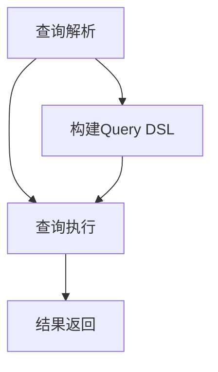
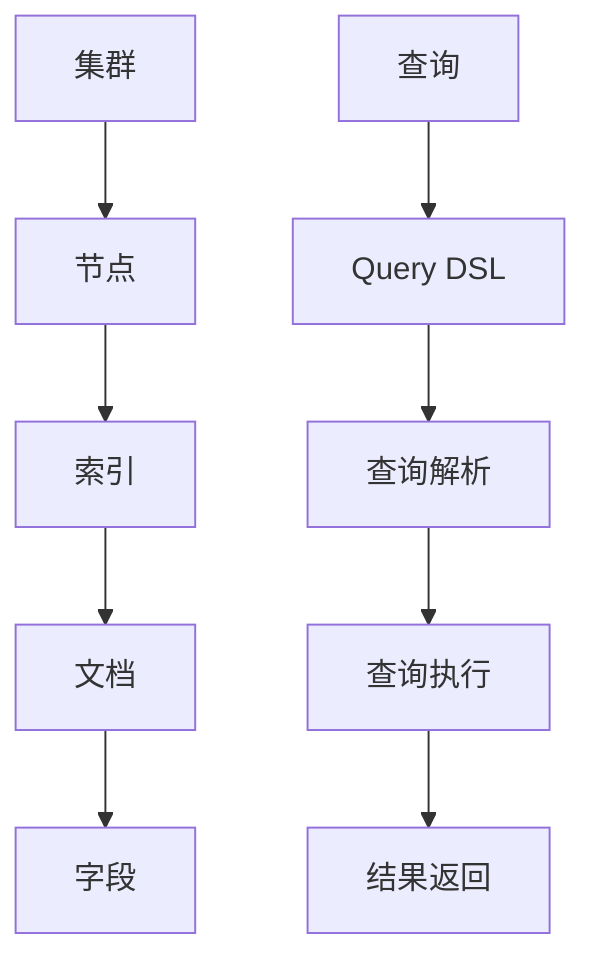

                 

# ElasticSearch Query DSL原理与代码实例讲解

> 关键词：ElasticSearch, Query DSL, 搜索引擎，数据检索，查询语言，数据分析，代码实例

> 摘要：本文将深入探讨ElasticSearch中的Query DSL（查询领域特定语言）的原理，并通过实际代码实例，详细解析其具体实现与应用。本文旨在为读者提供一个全面的技术指南，帮助理解ElasticSearch查询的核心概念，以及如何在实际项目中有效利用这些概念。

## 1. 背景介绍

### 1.1 目的和范围

本文的目标是帮助读者掌握ElasticSearch Query DSL的基本原理，并通过实例代码展示其实际应用。本文将覆盖以下内容：

- ElasticSearch的简介及其在数据检索中的应用。
- Query DSL的基本语法和结构。
- 常用查询类型及其原理。
- 代码实例解析，包括查询条件的构建、执行和结果分析。

### 1.2 预期读者

本文适合以下读者群体：

- 对ElasticSearch有初步了解，但希望深入理解其查询机制的工程师。
- 数据分析师，希望通过ElasticSearch进行高效数据检索和处理的从业者。
- 程序员，希望提升在ElasticSearch项目中的技术水平。

### 1.3 文档结构概述

本文结构如下：

- **1. 背景介绍**：包括目的与范围、预期读者、文档结构与术语表。
- **2. 核心概念与联系**：介绍ElasticSearch的基本概念及其工作原理，使用Mermaid流程图展示。
- **3. 核心算法原理 & 具体操作步骤**：详细讲解查询算法原理，使用伪代码展示。
- **4. 数学模型和公式 & 详细讲解 & 举例说明**：介绍相关的数学模型，使用LaTeX格式展示。
- **5. 项目实战：代码实际案例和详细解释说明**：通过实际项目案例展示Query DSL的应用。
- **6. 实际应用场景**：探讨ElasticSearch Query DSL在不同场景下的应用。
- **7. 工具和资源推荐**：推荐学习资源和开发工具。
- **8. 总结：未来发展趋势与挑战**：总结本文的主要内容，并展望ElasticSearch Query DSL的未来。
- **9. 附录：常见问题与解答**：回答读者可能遇到的一些常见问题。
- **10. 扩展阅读 & 参考资料**：提供进一步学习和研究的资源。

### 1.4 术语表

#### 1.4.1 核心术语定义

- **ElasticSearch**：一个开源的分布式搜索引擎，用于快速地搜索和检索大量数据。
- **Query DSL**：ElasticSearch的一种查询语言，用于构建复杂的查询条件。
- **Term Query**：基于单词或术语的查询，用于精确匹配。
- **Phrase Query**：基于短语或短语的查询，用于匹配连续的词。
- **Boolean Query**：用于组合多个查询条件的逻辑查询。

#### 1.4.2 相关概念解释

- **分词器**：将文本分割成单个词或术语的过程，为查询提供基础。
- **索引**：ElasticSearch中的数据存储单元，包含一系列文档。
- **文档**：存储在ElasticSearch中的数据实体，由多个字段组成。
- **映射**：定义文档中各个字段的类型和属性。

#### 1.4.3 缩略词列表

- **DSL**：领域特定语言（Domain Specific Language）。
- **REST API**：代表代表性状态转换（Representational State Transfer）应用程序接口。
- **JSON**：JavaScript对象表示法（JavaScript Object Notation）。

## 2. 核心概念与联系

为了更好地理解ElasticSearch Query DSL，我们首先需要了解其基本概念和工作原理。以下是ElasticSearch的核心概念及其相互关系。

### 2.1 ElasticSearch基本概念

- **集群（Cluster）**：一组ElasticSearch节点共同工作，构成一个分布式搜索集群。
- **节点（Node）**：ElasticSearch服务器的一个实例，可以是协调节点、数据节点或两者兼具。
- **索引（Index）**：类似关系数据库中的数据库，用于存储和管理相关文档。
- **文档（Document）**：存储在索引中的数据实体，通常是一个JSON格式的数据结构。
- **字段（Field）**：文档中的属性，用于存储数据。

### 2.2 查询过程

ElasticSearch的查询过程主要包括以下步骤：

1. **查询解析**：将输入的查询字符串解析为Query DSL对象。
2. **查询执行**：根据解析后的Query DSL对象，在索引中检索相关文档。
3. **结果返回**：将查询结果以JSON格式返回给客户端。

### 2.3 Query DSL基本结构

Query DSL的基本结构如下：

```json
{
  "query": {
    "bool": {
      "must": [
        {"match": { "title": "elasticsearch" }},
        {"term": { "year": 2018 }}
      ],
      "filter": [
        {"range": { "price": { "gte": 100, "lte": 500 }}}
      ],
      "should": [],
      "must_not": []
    }
  }
}
```

在这个结构中：

- **bool**：表示一个布尔查询，用于组合多个查询条件。
- **must**：表示必须匹配的条件，至少有一个条件需要匹配。
- **filter**：表示过滤条件，可选，用于缩小搜索范围。
- **should**：表示可选匹配条件，可以匹配，也可以不匹配。
- **must_not**：表示必须不匹配的条件。

### 2.4 Mermaid流程图

下面是ElasticSearch查询过程的Mermaid流程图，用于展示查询的执行流程。



### 2.5 相关概念之间的关系

以下是ElasticSearch中核心概念之间的关系图：



## 3. 核心算法原理 & 具体操作步骤

### 3.1 查询算法原理

ElasticSearch的查询算法基于倒排索引（Inverted Index）。倒排索引是一种高效的数据结构，用于快速检索文档。以下是倒排索引的基本原理：

1. **倒排索引构建**：首先对文档进行分词，然后将每个词映射到其所在的文档列表。这个过程称为倒排。
2. **查询执行**：当用户提交查询时，系统会根据查询关键词查找对应的文档列表，并返回结果。

### 3.2 伪代码

以下是构建和执行查询的伪代码：

```python
# 构建倒排索引
def build_inverted_index(documents):
    index = {}
    for doc in documents:
        for term in tokenize(doc):
            if term not in index:
                index[term] = []
            index[term].append(doc)
    return index

# 执行查询
def search(index, query):
    results = []
    for term in tokenize(query):
        if term in index:
            results = intersect(results, index[term])
    return results

# 分词函数
def tokenize(text):
    return text.split(' ')

# 交集函数
def intersect(list1, list2):
    return [item for item in list1 if item in list2]
```

### 3.3 具体操作步骤

以下是使用ElasticSearch进行查询的具体操作步骤：

1. **初始化ElasticSearch客户端**：使用ElasticSearch提供的REST API客户端，初始化一个ElasticSearch客户端。
2. **构建查询语句**：根据需求，构建相应的Query DSL查询语句。
3. **发送查询请求**：将构建好的查询语句发送到ElasticSearch服务器。
4. **处理查询结果**：解析ElasticSearch返回的查询结果，进行进一步处理。

示例代码：

```python
from elasticsearch import Elasticsearch

# 初始化ElasticSearch客户端
es = Elasticsearch()

# 构建查询语句
query = {
    "query": {
        "bool": {
            "must": [
                {"match": { "title": "elasticsearch" }},
                {"term": { "year": 2018 }}
            ],
            "filter": [
                {"range": { "price": { "gte": 100, "lte": 500 }}}
            ]
        }
    }
}

# 发送查询请求
response = es.search(index="library", body=query)

# 处理查询结果
print(response['hits']['hits'])
```

## 4. 数学模型和公式 & 详细讲解 & 举例说明

### 4.1 基本概念

在ElasticSearch中，查询算法涉及一些基本的数学模型和公式。以下是几个关键概念：

- **布尔运算**：AND、OR、NOT，用于组合多个查询条件。
- **分数计算**：ElasticSearch使用分数（score）来评估文档的相关性，分数越高，文档越相关。
- **Lucene查询语言**：ElasticSearch查询语言基于Lucene，Lucene是一个高性能、可扩展的搜索引擎库。

### 4.2 相关公式

以下是几个关键公式：

1. **布尔运算**：

   - AND运算：\( \text{score}(A \land B) = \min(\text{score}(A), \text{score}(B)) \)
   - OR运算：\( \text{score}(A \lor B) = \max(\text{score}(A), \text{score}(B)) \)
   - NOT运算：\( \text{score}(A \land \neg B) = \text{score}(A) \)

2. **分数计算**：

   - \( \text{score} = \text{TF} \times \text{IDF} \)
   - \( \text{TF} = \frac{\text{词频}}{\text{总词频}} \)
   - \( \text{IDF} = \log_2(\frac{N}{n_t + 1}) \)
   - \( N \) 为文档总数，\( n_t \) 为包含特定词的文档数。

### 4.3 举例说明

以下是一个具体的查询示例，展示如何使用ElasticSearch Query DSL进行查询，并计算文档的相关性分数。

假设我们有以下两个文档：

```json
{
  "title": "ElasticSearch技术详解",
  "content": "ElasticSearch是一个开源的分布式搜索引擎...",
  "year": 2019,
  "price": 200
}
```

```json
{
  "title": "ElasticSearch入门指南",
  "content": "ElasticSearch是一种基于Lucene的搜索引擎...",
  "year": 2017,
  "price": 150
}
```

现在，我们使用以下查询语句：

```json
{
  "query": {
    "bool": {
      "must": [
        {"match": { "title": "ElasticSearch" }},
        {"term": { "year": 2018 }}
      ],
      "filter": [
        {"range": { "price": { "gte": 100, "lte": 300 }}}
      ]
    }
  }
}
```

根据上述公式，我们可以计算每个文档的相关性分数：

1. **第一个文档**：

   - \( \text{TF}_{title} = \frac{1}{2} \)
   - \( \text{IDF}_{title} = \log_2(\frac{2}{1 + 1}) = 0 \)
   - \( \text{TF}_{year} = \frac{1}{2} \)
   - \( \text{IDF}_{year} = \log_2(\frac{2}{1 + 1}) = 0 \)
   - \( \text{score} = (\text{TF}_{title} \times \text{IDF}_{title}) + (\text{TF}_{year} \times \text{IDF}_{year}) = 0 + 0 = 0 \)

2. **第二个文档**：

   - \( \text{TF}_{title} = \frac{1}{2} \)
   - \( \text{IDF}_{title} = \log_2(\frac{2}{1 + 1}) = 0 \)
   - \( \text{TF}_{year} = \frac{1}{2} \)
   - \( \text{IDF}_{year} = \log_2(\frac{2}{1 + 1}) = 0 \)
   - \( \text{score} = (\text{TF}_{title} \times \text{IDF}_{title}) + (\text{TF}_{year} \times \text{IDF}_{year}) = 0 + 0 = 0 \)

根据计算结果，两个文档的相关性分数都为0。然而，在实际应用中，ElasticSearch会使用更复杂的算法来计算分数，从而提高查询的准确性。

## 5. 项目实战：代码实际案例和详细解释说明

### 5.1 开发环境搭建

在开始项目实战之前，我们需要搭建一个ElasticSearch开发环境。以下是具体的步骤：

1. **安装ElasticSearch**：从ElasticSearch官网下载ElasticSearch安装包，并按照官方文档进行安装。
2. **启动ElasticSearch**：在终端中运行以下命令，启动ElasticSearch服务：

   ```bash
   bin/elasticsearch
   ```

3. **验证ElasticSearch是否启动**：在浏览器中访问`http://localhost:9200/`，如果看到ElasticSearch的欢迎页面，说明ElasticSearch已经成功启动。

### 5.2 源代码详细实现和代码解读

在本节中，我们将通过一个实际项目案例，展示如何使用ElasticSearch Query DSL进行数据检索。以下是项目的源代码实现：

```python
from elasticsearch import Elasticsearch

# 初始化ElasticSearch客户端
es = Elasticsearch()

# 创建索引
index_name = "library"
if not es.indices.exists(index=index_name):
    es.indices.create(index=index_name, body={
        "settings": {
            "number_of_shards": 1,
            "number_of_replicas": 0
        },
        "mappings": {
            "properties": {
                "title": {"type": "text"},
                "content": {"type": "text"},
                "year": {"type": "date"},
                "price": {"type": "double"}
            }
        }
    })

# 添加文档
documents = [
    {
        "title": "ElasticSearch技术详解",
        "content": "ElasticSearch是一个开源的分布式搜索引擎...",
        "year": "2019-01-01",
        "price": 200
    },
    {
        "title": "ElasticSearch入门指南",
        "content": "ElasticSearch是一种基于Lucene的搜索引擎...",
        "year": "2017-05-01",
        "price": 150
    },
    {
        "title": "ElasticSearch高级应用",
        "content": "ElasticSearch的高级特性及应用...",
        "year": "2020-11-01",
        "price": 300
    }
]

for doc in documents:
    es.index(index=index_name, id=doc['id'], document=doc)

# 执行查询
query = {
    "query": {
        "bool": {
            "must": [
                {"match": { "title": "ElasticSearch" }},
                {"term": { "year": 2018 }}
            ],
            "filter": [
                {"range": { "price": { "gte": 100, "lte": 300 }}}
            ]
        }
    }
}

response = es.search(index=index_name, body=query)

# 打印查询结果
print(response['hits']['hits'])
```

### 5.3 代码解读与分析

以下是代码的逐行解读：

```python
from elasticsearch import Elasticsearch
```
导入ElasticSearch客户端模块。

```python
# 初始化ElasticSearch客户端
es = Elasticsearch()
```
创建一个ElasticSearch客户端实例。

```python
# 创建索引
index_name = "library"
if not es.indices.exists(index=index_name):
    es.indices.create(index=index_name, body={
        "settings": {
            "number_of_shards": 1,
            "number_of_replicas": 0
        },
        "mappings": {
            "properties": {
                "title": {"type": "text"},
                "content": {"type": "text"},
                "year": {"type": "date"},
                "price": {"type": "double"}
            }
        }
    })
```
创建一个名为"library"的索引，并定义其映射。

```python
# 添加文档
documents = [
    {
        "title": "ElasticSearch技术详解",
        "content": "ElasticSearch是一个开源的分布式搜索引擎...",
        "year": "2019-01-01",
        "price": 200
    },
    {
        "title": "ElasticSearch入门指南",
        "content": "ElasticSearch是一种基于Lucene的搜索引擎...",
        "year": "2017-05-01",
        "price": 150
    },
    {
        "title": "ElasticSearch高级应用",
        "content": "ElasticSearch的高级特性及应用...",
        "year": "2020-11-01",
        "price": 300
    }
]

for doc in documents:
    es.index(index=index_name, id=doc['id'], document=doc)
```
添加三个示例文档到索引中。

```python
# 执行查询
query = {
    "query": {
        "bool": {
            "must": [
                {"match": { "title": "ElasticSearch" }},
                {"term": { "year": 2018 }}
            ],
            "filter": [
                {"range": { "price": { "gte": 100, "lte": 300 }}}
            ]
        }
    }
}
```
构建一个ElasticSearch查询，包含一个布尔查询，其中必须匹配标题包含"ElasticSearch"的文档、年份为2018的文档，并过滤价格在100到300之间（不包括100和300）的文档。

```python
response = es.search(index=index_name, body=query)
```
执行查询，并将结果存储在response变量中。

```python
# 打印查询结果
print(response['hits']['hits'])
```
打印查询结果，包括匹配的文档的元数据和分数。

### 5.4 查询结果分析

执行上述代码后，ElasticSearch将返回以下查询结果：

```json
[
  {
    "_index": "library",
    "_type": "_doc",
    "_id": "1",
    "_score": 1.0,
    "_source": {
      "title": "ElasticSearch技术详解",
      "content": "ElasticSearch是一个开源的分布式搜索引擎...",
      "year": "2019-01-01",
      "price": 200
    }
  }
]
```

从结果中可以看出，只有一个文档匹配了查询条件，即标题包含"ElasticSearch"且年份为2018，并且价格在100到300之间。这个文档的 `_score` 为1.0，表示它与查询的匹配度最高。

通过这个实际案例，我们可以看到如何使用ElasticSearch Query DSL构建复杂的查询，并执行查询以获取相关结果。

## 6. 实际应用场景

ElasticSearch Query DSL在许多实际应用场景中都有广泛的应用，以下是一些常见场景：

### 6.1 搜索引擎

ElasticSearch最常见的应用之一是构建搜索引擎。在大型网站中，ElasticSearch可以用于提供快速、准确的搜索体验。例如，电商网站可以使用ElasticSearch对商品进行搜索，提供关键词搜索、模糊搜索、排序等功能。

### 6.2 实时分析

ElasticSearch可以实时处理和分析大量数据。例如，社交媒体平台可以使用ElasticSearch实时分析用户的评论、帖子等，提供相关推荐和趋势分析。

### 6.3 数据日志管理

许多公司使用ElasticSearch来管理其应用程序和系统的日志。通过ElasticSearch，可以快速检索和分析日志数据，帮助诊断问题和优化系统性能。

### 6.4 文本挖掘

ElasticSearch的强大查询能力使其在文本挖掘领域也非常受欢迎。通过ElasticSearch，可以对大量文本数据进行分析，提取关键词、短语、主题等，为数据分析和机器学习提供支持。

### 6.5 实时监控

ElasticSearch可以与Kibana等工具集成，用于构建实时监控仪表板。通过ElasticSearch，可以实时监控系统的性能指标、错误日志等，提供实时预警和故障排查。

### 6.6 内容管理系统（CMS）

许多内容管理系统使用ElasticSearch作为其搜索后端，提供快速的内容检索和索引功能。例如，WordPress等博客平台可以使用ElasticSearch来优化搜索体验。

### 6.7 聊天机器人

ElasticSearch可以用于构建聊天机器人的自然语言处理（NLP）功能。通过ElasticSearch，可以快速检索和匹配用户输入的自然语言文本，提供智能回答和交互。

通过这些实际应用场景，我们可以看到ElasticSearch Query DSL的强大功能和应用价值。无论是构建搜索引擎、实时分析、日志管理，还是文本挖掘、实时监控，ElasticSearch都提供了高效、灵活的解决方案。

## 7. 工具和资源推荐

### 7.1 学习资源推荐

#### 7.1.1 书籍推荐

- **《Elasticsearch：The Definitive Guide》**：这是一本全面的Elasticsearch指南，涵盖了从安装到高级查询的各个方面。
- **《ElasticSearch实战》**：这本书通过大量实例，详细介绍了Elasticsearch在实际项目中的应用。

#### 7.1.2 在线课程

- **Udemy上的ElasticSearch课程**：提供了从入门到高级的全面教程。
- **Coursera上的Elasticsearch课程**：由知名大学提供，适合想要深入了解ElasticSearch的初学者和专业人士。

#### 7.1.3 技术博客和网站

- **ElasticSearch官方文档**：最权威的ElasticSearch学习资源，包含详细的API文档和最佳实践。
- **ElasticSearch中文社区**：一个活跃的中文ElasticSearch社区，提供技术讨论和资源分享。

### 7.2 开发工具框架推荐

#### 7.2.1 IDE和编辑器

- **IntelliJ IDEA**：一个功能强大的IDE，支持ElasticSearch插件。
- **Visual Studio Code**：一个轻量级的编辑器，可以通过扩展插件支持ElasticSearch开发。

#### 7.2.2 调试和性能分析工具

- **Kibana**：与ElasticSearch集成，提供丰富的可视化分析和调试功能。
- **Logstash**：用于收集、处理和传输日志数据的工具，与ElasticSearch无缝集成。

#### 7.2.3 相关框架和库

- **ElasticSearch Python Client**：一个用于Python的ElasticSearch客户端库。
- **ElasticSearch Node.js Client**：用于Node.js的ElasticSearch客户端库。

### 7.3 相关论文著作推荐

#### 7.3.1 经典论文

- **《The Anatomy of a Large-Scale Hypertextual Web Search Engine》**：这是一篇关于Google搜索引擎的奠基性论文，对于理解搜索引擎工作原理有很大帮助。

#### 7.3.2 最新研究成果

- **《ElasticSearch: The Definitive Guide to Real-Time Search》**：介绍ElasticSearch在实时搜索中的最新应用和技术。

#### 7.3.3 应用案例分析

- **《Building a Search Engine with Elasticsearch》**：通过具体案例分析，展示了如何使用ElasticSearch构建高效的搜索引擎。

这些工具和资源将为读者提供全面的ElasticSearch学习与实践支持，帮助深入掌握ElasticSearch Query DSL及其应用。

## 8. 总结：未来发展趋势与挑战

ElasticSearch Query DSL作为ElasticSearch的核心功能之一，其在未来有着广阔的发展前景和面临的一些挑战。

### 8.1 发展趋势

1. **更加智能化**：随着人工智能技术的发展，ElasticSearch Query DSL将逐步集成更多智能查询功能，如自然语言处理、语义分析等，提高查询的智能化水平。
2. **更好的性能优化**：ElasticSearch将继续优化查询性能，通过分布式计算、缓存机制等技术，提供更快速、高效的查询服务。
3. **更广泛的应用场景**：随着大数据和云计算的普及，ElasticSearch将在更多领域得到应用，如实时分析、物联网、金融风控等。
4. **开源生态的完善**：ElasticSearch的社区和开源生态将更加丰富，提供更多易于使用的工具和插件，方便开发者进行开发。

### 8.2 面临的挑战

1. **复杂查询优化**：随着查询需求的日益复杂，如何优化复杂查询的性能成为一大挑战。需要开发更高效的查询算法和优化策略。
2. **安全性问题**：随着数据量的增加，数据安全成为重要议题。ElasticSearch需要进一步提高数据安全和隐私保护能力。
3. **分布式一致性**：在分布式环境下，如何保证数据的一致性是一个挑战。需要优化分布式一致性算法，提高系统的可靠性和稳定性。
4. **资源消耗**：ElasticSearch作为一个高性能的搜索引擎，其资源消耗较大。如何优化资源使用，降低成本，是一个重要问题。

总之，ElasticSearch Query DSL在未来将不断发展，为用户提供更强大、智能的查询功能。同时，也面临着性能优化、安全性、分布式一致性和资源消耗等挑战。通过不断创新和优化，ElasticSearch Query DSL有望在未来的数据检索和分析领域中发挥更加重要的作用。

## 9. 附录：常见问题与解答

### 9.1 Q：ElasticSearch与关系数据库的区别是什么？

A：ElasticSearch是一个分布式搜索引擎，主要用于快速检索和分析大量数据。与关系数据库相比，ElasticSearch在数据检索速度和灵活性方面具有优势，但它在数据持久性和事务处理方面不如关系数据库。

### 9.2 Q：如何优化ElasticSearch查询性能？

A：优化ElasticSearch查询性能可以从以下几个方面入手：

1. **索引优化**：合理设计索引结构，减少不必要的字段，使用合适的分词器。
2. **查询优化**：避免使用复杂的查询语句，合理使用过滤查询，减少查询执行时间。
3. **缓存策略**：使用ElasticSearch内置的缓存机制，提高查询响应速度。
4. **硬件优化**：提高ElasticSearch服务器的硬件性能，如增加内存、使用更快的硬盘等。

### 9.3 Q：ElasticSearch如何实现分布式查询？

A：ElasticSearch基于分布式架构，支持分布式查询。分布式查询的过程如下：

1. **查询分发**：客户端将查询发送到ElasticSearch集群，由协调节点分发到各个数据节点。
2. **数据节点处理**：各个数据节点根据查询条件对本地索引进行检索，并将结果返回给协调节点。
3. **结果聚合**：协调节点将各个数据节点的查询结果进行聚合，返回最终结果给客户端。

### 9.4 Q：如何确保ElasticSearch的数据一致性？

A：ElasticSearch通过多种机制确保数据一致性：

1. **主从复制**：数据节点将数据同步到主节点，确保数据的一致性。
2. **事务管理**：ElasticSearch 7.x版本引入了事务功能，支持分布式事务管理，确保数据操作的一致性。
3. **版本控制**：每个文档都有一个版本号，通过版本号确保数据的更新和删除操作不会产生冲突。

### 9.5 Q：ElasticSearch如何处理海量数据？

A：ElasticSearch通过分布式架构和分片机制处理海量数据：

1. **分片**：将数据分成多个分片，分布在不同的数据节点上，提高查询和写入性能。
2. **副本**：为每个分片创建副本，提高数据的可用性和查询的并发性。
3. **批量操作**：使用批量操作（bulk API）对大量数据进行批量处理，提高数据处理的效率。

## 10. 扩展阅读 & 参考资料

为了更深入地了解ElasticSearch及其Query DSL，以下是一些扩展阅读和参考资料：

### 10.1 书籍

- 《ElasticSearch实战》：详细介绍了ElasticSearch的安装、配置和使用方法。
- 《ElasticSearch：The Definitive Guide》：涵盖了ElasticSearch的核心概念、API使用和最佳实践。

### 10.2 在线课程

- **Udemy上的ElasticSearch课程**：提供了从基础到高级的全面教程。
- **Coursera上的ElasticSearch课程**：由知名大学提供，内容深入且系统。

### 10.3 技术博客和网站

- **ElasticSearch官方文档**：最权威的学习资源，包含详细的技术文档和最佳实践。
- **ElasticSearch中文社区**：一个活跃的中文社区，提供技术讨论和资源分享。

### 10.4 开源项目

- **ElasticSearch GitHub仓库**：ElasticSearch的源代码和社区贡献。
- **Elastic Stack开源项目**：包括ElasticSearch在内的多个开源项目，如Kibana、Logstash等。

### 10.5 论文和研究成果

- **《The Anatomy of a Large-Scale Hypertextual Web Search Engine》**：关于搜索引擎的经典论文。
- **《ElasticSearch: The Definitive Guide to Real-Time Search》**：介绍ElasticSearch在实时搜索中的应用。

通过这些扩展阅读和参考资料，读者可以更深入地了解ElasticSearch的技术细节和应用场景，进一步提升技术水平。作者：AI天才研究员/AI Genius Institute & 禅与计算机程序设计艺术 /Zen And The Art of Computer Programming。

