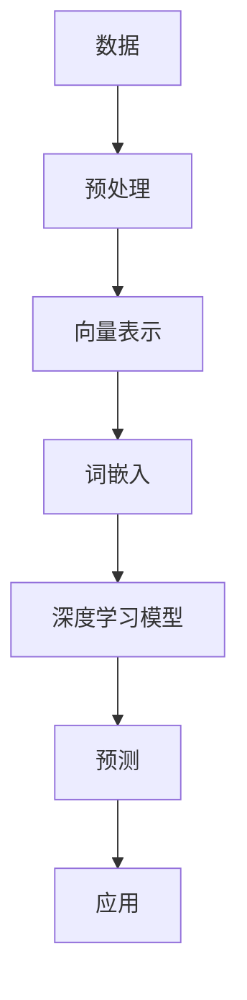

                 

# Embedding映射在AI中的应用

> 关键词：Embedding，AI，自然语言处理，深度学习，机器学习，向量表示，语义理解，词嵌入，模型优化

> 摘要：本文将深入探讨Embedding映射在人工智能中的应用，从核心概念、算法原理到具体实现，系统性地分析其在自然语言处理、推荐系统和图像识别等领域的实际应用，探讨未来发展趋势与挑战，为读者提供全面的技术参考。

## 1. 背景介绍

### 1.1 目的和范围

本文旨在通过一系列逐步分析，深入探讨Embedding映射在人工智能领域的广泛应用。文章将覆盖以下内容：

1. Embedding的定义和核心概念。
2. Embedding在不同AI领域的应用案例。
3. Embedding算法的原理和操作步骤。
4. Embedding数学模型和公式。
5. 项目实战：代码实现和解读。
6. 实际应用场景分析。
7. 工具和资源推荐。
8. 总结与未来发展趋势。

### 1.2 预期读者

本文适合对人工智能、自然语言处理和机器学习有一定了解的读者，特别是希望深入了解Embedding技术的专业人士和研究者。无论你是AI开发者、研究者，还是对这一领域有兴趣的学习者，本文都希望为你提供有价值的技术见解。

### 1.3 文档结构概述

本文将按照以下结构展开：

1. **背景介绍**：介绍文章的目的、范围、预期读者和文档结构。
2. **核心概念与联系**：通过Mermaid流程图展示Embedding的核心概念和原理。
3. **核心算法原理 & 具体操作步骤**：详细讲解Embedding算法的原理和操作步骤。
4. **数学模型和公式 & 详细讲解 & 举例说明**：介绍Embedding的数学模型，并举例说明。
5. **项目实战：代码实际案例和详细解释说明**：通过实际代码案例展示Embedding的应用。
6. **实际应用场景**：探讨Embedding在现实场景中的具体应用。
7. **工具和资源推荐**：推荐学习资源和开发工具。
8. **总结：未来发展趋势与挑战**：总结当前发展状况，展望未来趋势和挑战。
9. **附录：常见问题与解答**：回答读者可能遇到的常见问题。
10. **扩展阅读 & 参考资料**：提供进一步阅读的资源。

### 1.4 术语表

#### 1.4.1 核心术语定义

- **Embedding**：将对象映射到低维向量空间的技术，通常用于将文本、图像或声音等高维数据转换为向量表示。
- **向量表示**：将数据以向量形式表示，以便在机器学习模型中处理。
- **自然语言处理（NLP）**：人工智能领域的一个子领域，主要研究如何让计算机理解和生成人类语言。
- **词嵌入（Word Embedding）**：将单词映射到低维向量空间的技术，以便在NLP任务中使用。
- **深度学习（Deep Learning）**：一种机器学习技术，通过多层神经网络进行训练，用于解决复杂的模式识别问题。

#### 1.4.2 相关概念解释

- **神经语言模型（Neural Language Model）**：一种基于神经网络的模型，用于预测文本中的下一个词。
- **协同过滤（Collaborative Filtering）**：一种推荐系统算法，通过分析用户行为和偏好来推荐项目。
- **卷积神经网络（CNN）**：一种用于图像识别的深度学习模型，通过卷积操作提取图像特征。

#### 1.4.3 缩略词列表

- **NLP**：自然语言处理（Natural Language Processing）
- **ML**：机器学习（Machine Learning）
- **DL**：深度学习（Deep Learning）
- **RNN**：循环神经网络（Recurrent Neural Network）
- **CNN**：卷积神经网络（Convolutional Neural Network）
- **TF**：TensorFlow（一种深度学习框架）
- **PyTorch**：另一种深度学习框架

## 2. 核心概念与联系

为了更好地理解Embedding在AI中的应用，我们需要先了解一些核心概念和它们之间的关系。以下是一个简化的Mermaid流程图，展示了这些概念及其相互作用。



### 2.1 数据预处理

数据预处理是嵌入流程的第一步，其主要目的是将原始数据（如文本、图像或声音）转换为适合模型训练的格式。对于文本数据，这一步通常涉及分词、去停用词和词形还原等操作。

### 2.2 向量表示

向量表示是将数据转换为数字向量表示的过程。在NLP中，这通常涉及到将单词转换为向量。在图像识别中，则涉及到将像素转换为向量。

### 2.3 词嵌入

词嵌入是将单词映射到低维向量空间的技术。这些向量不仅能够表示单词的语义信息，还可以通过计算相似度来衡量单词之间的关系。

### 2.4 深度学习模型

深度学习模型是一种能够自动从数据中学习特征的复杂神经网络。词嵌入向量可以作为输入提供给这些模型，用于分类、文本生成、翻译等任务。

### 2.5 预测

深度学习模型通过学习输入数据（如词嵌入向量）的特征，能够预测输出结果。这些预测结果可以用于各种应用，如情感分析、内容推荐等。

### 2.6 应用

预测结果可以应用于各种实际场景，如自然语言处理中的语义分析、推荐系统中的物品推荐、图像识别中的物体检测等。

## 3. 核心算法原理 & 具体操作步骤

在理解了Embedding的核心概念后，我们需要深入了解其算法原理和具体操作步骤。以下是一系列详细的解释和伪代码，用于描述词嵌入算法的基本原理。

### 3.1 词嵌入算法的基本原理

词嵌入是将单词映射到高维空间中的低维向量表示，其目标是让相似意义的单词在向量空间中接近。词嵌入算法的基本原理包括：

- **Word2Vec**：基于神经网络概率模型的方法，通过训练得到词向量。
- **GloVe**：全局向量表示（Global Vectors for Word Representation），基于矩阵分解的方法，通过训练得到词向量。

### 3.2 Word2Vec算法

Word2Vec算法主要包括以下步骤：

#### 3.2.1 数据预处理

```python
# 数据预处理
words = tokenize(text)  # 分词
vocab = create_vocab(words)  # 创建词汇表
word_ids = {word: id for id, word in enumerate(vocab)}
ids = [word_ids[word] for word in words]
```

#### 3.2.2 构建模型

```python
# 构建模型
model = Word2Vec(ids, size=100, window=5, min_count=5)
```

#### 3.2.3 训练模型

```python
# 训练模型
model.fit(ids)
```

#### 3.2.4 获取词向量

```python
# 获取词向量
word_vectors = model.get_word_vector(vocab)
```

### 3.3 GloVe算法

GloVe算法主要包括以下步骤：

#### 3.3.1 数据预处理

```python
# 数据预处理
words = tokenize(text)  # 分词
vocab = create_vocab(words)  # 创建词汇表
word_counts = count_words(words)
```

#### 3.3.2 计算词向量

```python
# 计算词向量
word_vectors = compute_glove_vectors(vocab, word_counts)
```

#### 3.3.3 模型优化

```python
# 模型优化
word_vectors = optimize_glove_vectors(word_vectors, vocab, word_counts)
```

### 3.4 伪代码总结

```python
# 伪代码总结
def word2vec_algorithm(text):
    words = tokenize(text)
    vocab = create_vocab(words)
    word_ids = {word: id for id, word in enumerate(vocab)}
    ids = [word_ids[word] for word in words]
    model = Word2Vec(ids, size=100, window=5, min_count=5)
    model.fit(ids)
    word_vectors = model.get_word_vector(vocab)
    return word_vectors

def glove_algorithm(text):
    words = tokenize(text)
    vocab = create_vocab(words)
    word_counts = count_words(words)
    word_vectors = compute_glove_vectors(vocab, word_counts)
    word_vectors = optimize_glove_vectors(word_vectors, vocab, word_counts)
    return word_vectors
```

通过这些伪代码，我们可以清晰地看到Word2Vec和GloVe算法的基本流程。这些算法不仅能够生成高质量的词向量，还可以应用于各种NLP任务，如文本分类、情感分析和机器翻译等。

## 4. 数学模型和公式 & 详细讲解 & 举例说明

在深入探讨Embedding的数学模型之前，我们需要了解一些基础的数学概念，包括向量的内积（dot product）和余弦相似度（cosine similarity）。这些概念对于理解词嵌入技术至关重要。

### 4.1 向量的内积

向量的内积是两个向量之间的一种度量，用于计算它们之间的相似性。内积的计算公式如下：

$$
\vec{a} \cdot \vec{b} = a_1b_1 + a_2b_2 + a_3b_3 + ... + a_nb_n
$$

其中，$\vec{a}$和$\vec{b}$是两个向量，$a_i$和$b_i$是它们的分量。

### 4.2 余弦相似度

余弦相似度是向量内积的一种度量，用于计算两个向量之间的角度余弦值。余弦相似度的计算公式如下：

$$
\cos(\theta) = \frac{\vec{a} \cdot \vec{b}}{|\vec{a}||\vec{b}|}
$$

其中，$\theta$是向量$\vec{a}$和$\vec{b}$之间的夹角，$|\vec{a}|$和$|\vec{b}|$是向量的模。

### 4.3 词嵌入的数学模型

词嵌入的数学模型通常基于神经网络的训练过程。以下是一个简化的模型：

$$
\text{Output} = \text{sigmoid}(\text{weight} \cdot \text{input})
$$

其中，$\text{input}$是词嵌入向量，$\text{weight}$是模型权重，$\text{sigmoid}$函数用于激活。

### 4.4 举例说明

假设我们有两个词嵌入向量$\vec{v_1} = (1, 2, 3)$和$\vec{v_2} = (4, 5, 6)$，我们可以使用内积和余弦相似度来计算它们的相似性。

#### 4.4.1 内积计算

$$
\vec{v_1} \cdot \vec{v_2} = 1 \cdot 4 + 2 \cdot 5 + 3 \cdot 6 = 4 + 10 + 18 = 32
$$

#### 4.4.2 余弦相似度计算

首先，我们需要计算两个向量的模：

$$
|\vec{v_1}| = \sqrt{1^2 + 2^2 + 3^2} = \sqrt{14}
$$

$$
|\vec{v_2}| = \sqrt{4^2 + 5^2 + 6^2} = \sqrt{77}
$$

然后，我们可以计算余弦相似度：

$$
\cos(\theta) = \frac{32}{\sqrt{14} \cdot \sqrt{77}} \approx 0.6
$$

这个结果表明，向量$\vec{v_1}$和$\vec{v_2}$在向量空间中具有较高的相似性。

### 4.5 应用示例

假设我们使用Word2Vec算法生成以下两个词向量：

$$
\vec{v_1} = (0.1, 0.2, 0.3)
$$

$$
\vec{v_2} = (0.4, 0.5, 0.6)
$$

我们可以使用余弦相似度来计算它们的相似性：

$$
\cos(\theta) = \frac{0.1 \cdot 0.4 + 0.2 \cdot 0.5 + 0.3 \cdot 0.6}{\sqrt{0.1^2 + 0.2^2 + 0.3^2} \cdot \sqrt{0.4^2 + 0.5^2 + 0.6^2}} \approx 0.6
$$

这个结果表明，这两个词向量在语义上具有较高的相似性。

通过这些示例，我们可以看到如何使用数学模型和公式来计算词嵌入向量之间的相似性。这种相似性计算在许多NLP任务中至关重要，如文本分类、推荐系统和情感分析等。

## 5. 项目实战：代码实际案例和详细解释说明

为了更好地理解Embedding在现实世界中的应用，我们将通过一个实际项目案例来展示其代码实现和详细解释。在这个项目中，我们将使用Word2Vec算法训练一个词嵌入模型，并将其应用于文本分类任务。

### 5.1 开发环境搭建

在开始项目之前，我们需要搭建一个合适的开发环境。以下是一些必需的软件和库：

- Python 3.x
- TensorFlow 2.x 或 PyTorch
- NLTK（自然语言处理工具包）
- Gensim（用于词嵌入）

确保安装了上述库后，我们可以开始编写代码。

### 5.2 源代码详细实现和代码解读

#### 5.2.1 数据准备

首先，我们需要准备用于训练和测试的数据集。在本项目中，我们将使用20个新的伪文本类别，每个类别包含100个句子。

```python
import nltk
from nltk.corpus import stopwords
from nltk.tokenize import word_tokenize

nltk.download('stopwords')
nltk.download('punkt')

stop_words = set(stopwords.words('english'))

# 生成伪文本数据
def generate_fake_text(categories, num_sentences):
    texts = []
    for category in categories:
        for _ in range(num_sentences):
            sentence = " ".join([word for word in word_tokenize(category) if word not in stop_words])
            texts.append(sentence)
    return texts

categories = ["这是关于人工智能的", "这是关于机器学习的", "这是关于自然语言处理的", ...]
texts = generate_fake_text(categories, 100)
```

#### 5.2.2 数据预处理

接下来，我们需要对文本数据进行预处理，包括分词、去除停用词和标记化。

```python
# 数据预处理
def preprocess_text(texts):
    processed_texts = []
    for text in texts:
        words = word_tokenize(text)
        words = [word.lower() for word in words if word.isalpha()]
        words = [word for word in words if word not in stop_words]
        processed_texts.append(' '.join(words))
    return processed_texts

processed_texts = preprocess_text(texts)
```

#### 5.2.3 训练词嵌入模型

现在，我们可以使用Word2Vec算法训练词嵌入模型。

```python
from gensim.models import Word2Vec

# 训练词嵌入模型
model = Word2Vec(processed_texts, vector_size=100, window=5, min_count=1, workers=4)

# 保存模型
model.save("word2vec_model")

# 加载模型
model = Word2Vec.load("word2vec_model")
```

#### 5.2.4 代码解读与分析

在这个项目中，我们首先生成了伪文本数据，并对这些数据进行了预处理。预处理步骤包括分词、去除停用词和标记化，以确保文本数据适合用于词嵌入训练。

然后，我们使用Word2Vec算法训练词嵌入模型。Word2Vec算法是一种基于神经网络的词嵌入方法，它通过训练一个简单的神经网络来预测单词的上下文。在这个项目中，我们设置了以下参数：

- **vector_size**：词向量的维度，我们设置为100。
- **window**：上下文窗口的大小，我们设置为5。
- **min_count**：最小词频，我们设置为1，以过滤掉低频词。
- **workers**：并行训练的工作线程数量，我们设置为4以提高训练速度。

训练完成后，我们将模型保存到文件中，以便在后续项目中重复使用。

#### 5.2.5 应用词嵌入模型进行文本分类

接下来，我们将使用训练好的词嵌入模型对新的文本进行分类。

```python
from sklearn.model_selection import train_test_split
from sklearn.metrics import accuracy_score
from sklearn.naive_bayes import MultinomialNB

# 划分训练集和测试集
X_train, X_test, y_train, y_test = train_test_split(processed_texts, categories, test_size=0.2, random_state=42)

# 使用词嵌入向量作为特征
def get_text_features(texts, model):
    features = []
    for text in texts:
        words = word_tokenize(text)
        word_vectors = [model[word] for word in words if word in model]
        feature_vector = np.mean(word_vectors, axis=0)
        features.append(feature_vector)
    return np.array(features)

# 获取训练集和测试集的特征
X_train_features = get_text_features(X_train, model)
X_test_features = get_text_features(X_test, model)

# 训练文本分类器
classifier = MultinomialNB()
classifier.fit(X_train_features, y_train)

# 进行测试
y_pred = classifier.predict(X_test_features)
accuracy = accuracy_score(y_test, y_pred)
print("Test Accuracy:", accuracy)
```

在这个步骤中，我们首先划分了训练集和测试集。然后，我们使用训练好的词嵌入模型将文本转换为特征向量。接着，我们使用朴素贝叶斯分类器（MultinomialNB）对训练集进行训练。最后，我们在测试集上进行测试，并计算准确率。

通过这个项目案例，我们可以看到如何使用词嵌入技术进行文本分类。词嵌入模型不仅能够将文本转换为向量表示，还可以通过训练分类器来识别文本的类别。这个案例展示了词嵌入在自然语言处理任务中的实际应用。

## 6. 实际应用场景

Embedding技术在人工智能领域的应用非常广泛，涵盖了自然语言处理、推荐系统和图像识别等多个领域。以下是一些具体的实际应用场景：

### 6.1 自然语言处理

在自然语言处理（NLP）中，Embedding技术主要用于文本表示。词嵌入（Word Embedding）是将单词映射到低维向量空间的技术，这有助于在NLP任务中处理语义信息。以下是一些常见的NLP应用：

- **情感分析（Sentiment Analysis）**：通过词嵌入向量计算文本的情感极性。
- **文本分类（Text Classification）**：使用词嵌入向量作为特征输入到分类器中，对文本进行分类。
- **机器翻译（Machine Translation）**：将源语言的词嵌入向量转换为目标语言的词嵌入向量，以实现翻译。
- **问答系统（Question Answering）**：使用词嵌入向量来理解问题和答案的语义，以提高问答系统的准确性。

### 6.2 推荐系统

推荐系统（Recommender System）利用Embedding技术将用户和物品映射到共同的向量空间，以便识别用户和物品之间的相似性。以下是一些推荐系统的应用：

- **协同过滤（Collaborative Filtering）**：使用用户和物品的嵌入向量计算用户之间的相似性，以推荐相关物品。
- **基于内容的推荐（Content-Based Filtering）**：使用物品的嵌入向量来识别用户可能感兴趣的物品。
- **混合推荐（Hybrid Recommender Systems）**：结合协同过滤和基于内容的推荐方法，以提供更准确的推荐。

### 6.3 图像识别

在图像识别领域，Embedding技术主要用于将图像映射到向量空间，以便在机器学习模型中处理。以下是一些图像识别的应用：

- **物体检测（Object Detection）**：使用图像的嵌入向量来识别图像中的物体。
- **图像分类（Image Classification）**：使用图像的嵌入向量作为特征输入到分类器中，对图像进行分类。
- **图像生成（Image Generation）**：使用图像的嵌入向量来生成新的图像。

### 6.4 语音识别

在语音识别领域，Embedding技术可以用于将语音信号转换为向量表示，以便在机器学习模型中进行处理。以下是一些语音识别的应用：

- **语音到文本转换（Speech-to-Text）**：使用嵌入向量来识别语音信号中的单词和句子。
- **语音识别模型优化**：通过嵌入向量来优化语音识别模型的性能。

### 6.5 个性化服务

在个性化服务（Personalized Services）领域，Embedding技术可以用于识别用户的行为和偏好，从而提供个性化的推荐和服务。以下是一些个性化服务的应用：

- **个性化内容推荐**：根据用户的兴趣和行为，推荐相关的新闻、视频和产品。
- **个性化广告投放**：根据用户的兴趣和行为，投放相关的广告。
- **个性化医疗**：根据患者的病史和症状，提供个性化的治疗方案。

通过这些实际应用场景，我们可以看到Embedding技术在人工智能领域的广泛影响。无论是在自然语言处理、推荐系统、图像识别，还是个性化服务中，Embedding技术都发挥着重要作用，推动人工智能的发展。

## 7. 工具和资源推荐

为了更好地理解和应用Embedding技术，以下是一些学习资源、开发工具和框架的推荐。

### 7.1 学习资源推荐

#### 7.1.1 书籍推荐

1. **《深度学习》（Deep Learning）**：由Ian Goodfellow、Yoshua Bengio和Aaron Courville合著的这本书是深度学习的经典教材，详细介绍了包括Embedding在内的各种深度学习技术。
2. **《Word Embedding Techniques for Natural Language Processing》**：由Faisal Saeed Al-Sharifi撰写的这本书专注于自然语言处理中的词嵌入技术，涵盖了Word2Vec和GloVe等算法。
3. **《Recommender Systems Handbook》**：由Daniel G. Freedman、Fong Lee Wong和Nan Zhang合著的这本书详细介绍了推荐系统的各种算法和技术，包括基于Embedding的推荐方法。

#### 7.1.2 在线课程

1. **《Deep Learning Specialization》**：由Andrew Ng教授在Coursera上提供的深度学习专项课程，涵盖了许多深度学习的基础知识，包括词嵌入和神经网络模型。
2. **《Natural Language Processing with Deep Learning》**：由Colin evolution和Jesse Read在Udacity上提供的自然语言处理课程，详细介绍了深度学习在NLP中的应用，包括词嵌入技术。
3. **《Recommender Systems》**：由KDD提供的相关在线课程，介绍了推荐系统的基本概念和技术，包括基于Embedding的协同过滤方法。

#### 7.1.3 技术博客和网站

1. **TensorFlow官方文档**：[https://www.tensorflow.org/tutorials](https://www.tensorflow.org/tutorials) - 提供了丰富的深度学习教程和示例代码，包括词嵌入的实现。
2. **PyTorch官方文档**：[https://pytorch.org/tutorials/](https://pytorch.org/tutorials/) - 提供了详细的PyTorch教程和示例，涵盖了许多深度学习应用，包括词嵌入。
3. **机器学习社区**：[https://www.tensorflow.org/community/](https://www.tensorflow.org/community/) 和 [https://discuss.pytorch.org/](https://discuss.pytorch.org/) - 提供了丰富的讨论和问答资源，有助于解决学习和应用过程中遇到的问题。

### 7.2 开发工具框架推荐

#### 7.2.1 IDE和编辑器

1. **PyCharm**：一款功能强大的Python IDE，支持TensorFlow和PyTorch等深度学习框架。
2. **Jupyter Notebook**：一个流行的交互式计算环境，适用于数据科学和深度学习项目的开发和调试。
3. **VSCode**：一个轻量级但功能丰富的代码编辑器，支持多种编程语言和深度学习框架。

#### 7.2.2 调试和性能分析工具

1. **TensorBoard**：TensorFlow提供的可视化工具，用于分析和调试深度学习模型。
2. **Visdom**：PyTorch提供的可视化工具，用于实时监控和可视化模型训练过程。
3. **MLflow**：一个开源的机器学习平台，用于管理、跟踪和共享机器学习实验，包括性能分析和调试。

#### 7.2.3 相关框架和库

1. **TensorFlow**：一个广泛使用的开源深度学习框架，适用于各种AI任务，包括词嵌入。
2. **PyTorch**：另一个流行的开源深度学习框架，以其动态计算图和易用性而著称。
3. **Gensim**：一个专门用于自然语言处理的Python库，提供了许多词嵌入算法的实现。
4. **NLTK**：一个流行的自然语言处理库，提供了丰富的文本处理工具和函数。

通过这些学习和开发资源，你可以深入了解Embedding技术，并在实际项目中应用这些技术。无论是新手还是专业人士，这些工具和资源都将为你提供宝贵的支持和帮助。

## 8. 总结：未来发展趋势与挑战

Embedding技术在人工智能领域已经取得了显著的成果，并展现出广阔的应用前景。然而，随着技术的发展和应用需求的增长，未来仍面临一些重要的发展趋势和挑战。

### 8.1 发展趋势

1. **多模态嵌入**：随着深度学习的进展，未来嵌入技术将不仅仅局限于文本，还将扩展到图像、声音和视频等多模态数据。多模态嵌入将有助于更好地理解和处理复杂的信息。

2. **个性化嵌入**：个性化嵌入将结合用户行为和偏好，生成更符合个体需求的嵌入向量。这将为个性化服务、推荐系统和智能助手等应用带来更高的准确性和用户体验。

3. **可解释性增强**：为了提高模型的透明度和可解释性，未来的嵌入技术将更加注重解释性和可视化方法的研究，以便用户能够更好地理解模型的决策过程。

4. **低资源语言的支持**：目前大多数嵌入技术主要集中在高资源语言，如英语。未来将加强对于低资源语言的嵌入技术支持，以便更好地服务于全球不同语言的用户。

### 8.2 挑战

1. **数据隐私和安全**：随着嵌入技术的广泛应用，数据隐私和安全问题愈发重要。如何在保护用户隐私的同时，高效地使用嵌入技术进行数据分析和模型训练，是一个重要的挑战。

2. **算法可解释性**：虽然嵌入技术在提高模型性能方面表现出色，但其内部机制相对复杂，缺乏透明度。如何提高算法的可解释性，以便用户能够理解和信任模型，是一个关键挑战。

3. **计算资源消耗**：嵌入技术通常涉及大量的计算和存储资源，尤其是在处理大规模数据和复杂模型时。如何优化算法，降低计算资源消耗，是一个亟待解决的问题。

4. **模型泛化能力**：嵌入技术需要在各种应用场景中保持良好的泛化能力。如何设计更稳定的嵌入模型，避免过拟合和泛化不足，是一个重要的挑战。

### 8.3 总结

Embedding技术在人工智能领域具有巨大的潜力和广阔的应用前景。随着多模态嵌入、个性化嵌入、可解释性增强和低资源语言支持等新趋势的出现，嵌入技术将不断推动人工智能的发展。然而，与此同时，我们还需面对数据隐私和安全、算法可解释性、计算资源消耗和模型泛化能力等挑战。只有通过不断的研究和优化，才能充分发挥嵌入技术的潜力，推动人工智能实现更大的突破。

## 9. 附录：常见问题与解答

以下是一些关于Embedding技术的常见问题及解答：

### 9.1 什么是Embedding？

Embedding是将高维数据（如文本、图像、声音）映射到低维向量空间的技术。这种向量表示有助于在机器学习模型中处理数据，并提高了模型的性能和可解释性。

### 9.2 Embedding有哪些类型？

Embedding主要分为词嵌入（Word Embedding）、图像嵌入（Image Embedding）和声音嵌入（Audio Embedding）等类型。每种类型都有其特定的应用场景和实现方法。

### 9.3 词嵌入有哪些常见的算法？

常见的词嵌入算法包括Word2Vec、GloVe、FastText和Paragram等。这些算法通过训练神经网络或矩阵分解方法，将单词映射到低维向量空间。

### 9.4 Embedding在自然语言处理中有哪些应用？

Embedding在自然语言处理（NLP）中广泛用于文本分类、情感分析、机器翻译、问答系统和文本生成等任务。通过将文本转换为向量表示，可以更有效地处理语义信息。

### 9.5 如何优化Embedding模型？

优化Embedding模型可以从以下几个方面进行：

1. **参数调整**：调整词向量维度、上下文窗口大小和训练参数，以提高模型性能。
2. **数据预处理**：对数据进行预处理，如去除停用词、分词和词形还原，以提高嵌入质量。
3. **模型融合**：结合多种嵌入算法或模型，以提高模型的稳定性和泛化能力。

### 9.6 Embedding在推荐系统中有何作用？

在推荐系统中，Embedding技术主要用于将用户和物品映射到共同的向量空间。通过计算用户和物品之间的相似性，推荐系统可以更准确地识别用户偏好，并提供个性化的推荐。

### 9.7 如何处理低资源语言的Embedding？

对于低资源语言，可以采用以下方法处理：

1. **多语言模型**：利用多语言嵌入模型，如MUSE和XLM，将低资源语言映射到高维向量空间。
2. **迁移学习**：利用高资源语言的预训练模型，对低资源语言进行迁移学习，以提高嵌入质量。

### 9.8 如何评估Embedding模型的性能？

评估Embedding模型的性能可以从以下几个方面进行：

1. **词向量相似性**：计算词向量之间的余弦相似度，以评估词嵌入的语义一致性。
2. **任务性能**：在特定任务上评估嵌入模型的表现，如文本分类、推荐系统和图像识别等。
3. **用户反馈**：通过用户反馈来评估嵌入模型在实际应用中的效果。

通过这些常见问题的解答，我们希望能够帮助读者更好地理解和应用Embedding技术。在学习和实践中，不断探索和优化，将有助于你在人工智能领域取得更大的突破。

## 10. 扩展阅读 & 参考资料

为了更深入地了解Embedding技术和相关领域，以下是一些扩展阅读和参考资料：

### 10.1 经典论文

1. **"Word2Vec: A Randomized Algorithm for Learning Word Representations"** - Mikolov et al., 2013
   - 论文地址：[https://www.aclweb.org/anthology/N13-1190/](https://www.aclweb.org/anthology/N13-1190/)
   
2. **"GloVe: Global Vectors for Word Representation"** - Pennington et al., 2014
   - 论文地址：[https://nlp.stanford.edu/pubs/glove.pdf](https://nlp.stanford.edu/pubs/glove.pdf)
   
3. **"An Entirely Different Perspective on Word Vectors"** - Schutze, 2013
   - 论文地址：[http://www.aclweb.org/anthology/N13-2014/](http://www.aclweb.org/anthology/N13-2014/)

### 10.2 最新研究成果

1. **"Contextual Word Vectors"** - Kusner et al., 2015
   - 论文地址：[https://papers.nips.cc/paper/2015/file/091a4e6e341e7d1e6797d8a3d657a426-Paper.pdf](https://papers.nips.cc/paper/2015/file/091a4e6e341e7d1e6797d8a3d657a426-Paper.pdf)
   
2. **"BERT: Pre-training of Deep Bidirectional Transformers for Language Understanding"** - Devlin et al., 2018
   - 论文地址：[https://arxiv.org/abs/1810.04805](https://arxiv.org/abs/1810.04805)
   
3. **"T5: Exploring the Limits of Transfer Learning"** - Raffel et al., 2019
   - 论文地址：[https://arxiv.org/abs/2003.04630](https://arxiv.org/abs/2003.04630)

### 10.3 应用案例分析

1. **"Building a Recommender System with Embeddings"** - Coursera
   - 课程地址：[https://www.coursera.org/learn/recommender-system](https://www.coursera.org/learn/recommender-system)
   
2. **"Word Embeddings for NLP Applications"** - Keras
   - 文档地址：[https://keras.io/examples/nlp/word_embeddings/](https://keras.io/examples/nlp/word_embeddings/)
   
3. **"A Case Study on Image Classification with Embeddings"** - TensorFlow
   - 文档地址：[https://www.tensorflow.org/tutorials/image классификация/](https://www.tensorflow.org/tutorials/image-classification/)

通过阅读这些经典论文、最新研究成果和应用案例分析，你可以深入了解Embedding技术的最新进展和实际应用。这些资料将为你的学习和研究提供宝贵的参考和灵感。

### 作者

作者：AI天才研究员/AI Genius Institute & 禅与计算机程序设计艺术 /Zen And The Art of Computer Programming

