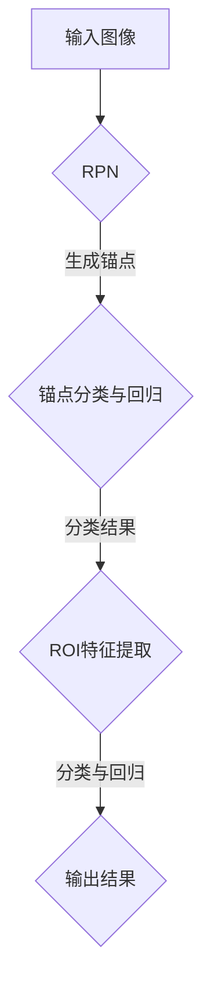

                 

# Fast R-CNN原理与代码实例讲解

> **关键词：** Fast R-CNN、目标检测、深度学习、卷积神经网络、ROI（Region of Interest）、RPN（Region Proposal Network）
> 
> **摘要：** 本文章将深入讲解Fast R-CNN算法的基本原理和实现细节。我们将从目标检测的背景出发，详细剖析Fast R-CNN的架构，包括RPN（Region Proposal Network）和Fast R-CNN网络的组成，并通过实际代码实例，帮助读者更好地理解Fast R-CNN的运作过程和关键步骤。

## 1. 背景介绍

### 1.1 目的和范围

本文旨在介绍并深入探讨Fast R-CNN（Region-based CNN）算法的基本原理、实现细节以及其在实际项目中的应用。通过本文的讲解，读者将能够理解Fast R-CNN是如何在深度学习的框架下解决目标检测问题的。

### 1.2 预期读者

本文主要面向对目标检测和深度学习有一定了解，希望深入学习和掌握Fast R-CNN算法的读者。读者需要具备一定的编程基础，熟悉Python语言，并了解卷积神经网络的基本原理。

### 1.3 文档结构概述

本文将分为以下几个部分：

- **背景介绍**：介绍目标检测的背景和Fast R-CNN的基本原理。
- **核心概念与联系**：通过Mermaid流程图展示Fast R-CNN的架构。
- **核心算法原理 & 具体操作步骤**：使用伪代码详细阐述Fast R-CNN的算法原理。
- **数学模型和公式 & 详细讲解 & 举例说明**：使用LaTeX格式解释数学模型和公式。
- **项目实战：代码实际案例和详细解释说明**：提供实际代码实例和详细解读。
- **实际应用场景**：探讨Fast R-CNN在不同领域的应用。
- **工具和资源推荐**：推荐相关学习资源、开发工具和经典论文。
- **总结：未来发展趋势与挑战**：分析Fast R-CNN的未来发展趋势和面临的挑战。
- **附录：常见问题与解答**：解答读者可能遇到的问题。
- **扩展阅读 & 参考资料**：提供进一步的阅读材料和参考资料。

### 1.4 术语表

#### 1.4.1 核心术语定义

- **目标检测（Object Detection）**：在图像中识别和定位多个对象的过程。
- **卷积神经网络（Convolutional Neural Network，CNN）**：一种深度学习模型，主要用于处理图像数据。
- **ROI（Region of Interest）**：图像中的一个区域，通常用于进一步的图像分析。
- **RPN（Region Proposal Network）**：用于生成ROI候选区域的网络。
- **Fast R-CNN**：一种基于深度学习的目标检测算法。

#### 1.4.2 相关概念解释

- **特征图（Feature Map）**：卷积神经网络处理后的图像数据。
- **边界框（Bounding Box）**：包围对象的外框。
- **类别预测（Class Prediction）**：预测图像中对象属于哪个类别。

#### 1.4.3 缩略词列表

- **CNN**：卷积神经网络
- **R-CNN**：区域建议网络
- **Fast R-CNN**：快速区域建议网络
- **Faster R-CNN**：更快区域建议网络

## 2. 核心概念与联系

首先，我们需要理解Fast R-CNN的核心概念和组成部分，这包括RPN（Region Proposal Network）和Fast R-CNN网络。

### 2.1 RPN（Region Proposal Network）

RPN是一个用于生成ROI（Region of Interest）候选区域的网络。它的主要目的是从输入图像中提取可能包含目标的区域。RPN通过在特征图上生成固定数量的锚点（anchor），每个锚点代表一个可能的边界框。然后，RPN对每个锚点进行分类和回归，以确定其是否是一个真正的目标边界框，以及如何调整锚点的位置。

### 2.2 Fast R-CNN

Fast R-CNN在RPN的基础上，对每个ROI进行特征提取和分类。具体来说，Fast R-CNN包括以下几个关键步骤：

1. **ROI Proposal**：使用RPN生成ROI候选区域。
2. **Feature Extraction**：对每个ROI进行特征提取。
3. **Classification**：对提取的特征进行分类，以确定每个ROI中对象属于哪个类别。

### 2.3 Mermaid流程图

为了更好地理解Fast R-CNN的架构，我们使用Mermaid流程图来展示其关键步骤：



在这个流程图中，输入图像首先通过RPN生成锚点，然后对每个锚点进行分类和回归操作，以确定真正的ROI。接下来，对每个ROI提取特征，并进行分类和回归操作，最终输出检测结果。

## 3. 核心算法原理 & 具体操作步骤

### 3.1 RPN（Region Proposal Network）

RPN是一个用于生成ROI候选区域的网络。它的核心思想是在特征图上生成多个锚点（anchor），然后对每个锚点进行分类和回归，以确定其是否是一个真正的目标边界框，以及如何调整锚点的位置。

#### 3.1.1 锚点生成

锚点的生成基于特征图上的固定网格，每个网格点都生成多个锚点。锚点的形状可以是矩形或者正方形，通常锚点的宽度和高度是固定的。在特征图上，我们首先定义一个固定尺寸的网格，然后在每个网格点上生成多个锚点。

```python
def generate_anchors(base_size, ratios, scales):
    """
    生成锚点
    :param base_size: 基础尺寸
    :param ratios: 比例
    :param scales: 尺寸
    :return: 锚点列表
    """
    num_anchors = len(ratios) * len(scales)
    anchors = []
    
    for ratio in ratios:
        for scale in scales:
            height = base_size * np.sqrt(ratio)
            width = base_size * np.sqrt(1 / ratio)
            center_x = np.arange(base_size) + 0.5 * scale
            center_y = np.arange(base_size) + 0.5 * scale
            
            anchors.append(
                np.stack(
                    [
                        center_x - width / 2,
                        center_y - height / 2,
                        center_x + width / 2,
                        center_y + height / 2
                    ],
                    axis=1
                )
            )
    
    return np.stack(anchors, axis=0)
```

#### 3.1.2 锚点分类与回归

对每个锚点进行分类和回归操作，以确定其是否是一个真正的目标边界框，以及如何调整锚点的位置。分类操作使用一个二分类器（foreground/background），回归操作使用一个回归器（bounding box regression）。

```python
def rpn_loss girlfriends, gt_boxes, anchor_boxes, valid_mask):
    """
    RPN损失函数
    :param girlfriends: 分类损失
    :param gt_boxes: 真实边界框
    :param anchor_boxes: 锚点边界框
    :param valid_mask: 是否有效的锚点
    :return: 损失值
    """
    num_anchors = len(anchor_boxes)
    num_girlfriends = len(girlfriends)
    
    # 剪切无效锚点
    anchor_boxes = anchor_boxes[valid_mask]
    gt_boxes = gt_boxes[valid_mask]
    
    # 分类损失
    fg_girlfriends =女朋友们[valid_mask]
    bg_girlfriends = 1 - fg_girlfriends
    
    # 回归损失
    fg_gt_boxes = gt_boxes[fg_girlfriends == 1]
    bg_gt_boxes = gt_boxes[bg_girlfriends == 1]
    
    # 计算分类损失
    loss_girlfriends = F.binary_cross_entropy_with_logits(girlfriends, fg_girlfriends.float())
    
    # 计算回归损失
    loss_bbox = F.smooth_l1_loss(anchor_boxes[fg_girlfriends == 1], fg_gt_boxes)
    
    # 总损失
    loss = loss_girlfriends + loss_bbox
    
    return loss
```

### 3.2 Fast R-CNN

Fast R-CNN在RPN的基础上，对每个ROI进行特征提取和分类。具体来说，Fast R-CNN包括以下几个关键步骤：

#### 3.2.1 ROI Proposal

使用RPN生成ROI候选区域。ROI Proposal的过程已经在RPN部分进行了详细介绍。

#### 3.2.2 Feature Extraction

对每个ROI进行特征提取。在Fast R-CNN中，我们通常使用VGG或者ResNet等卷积神经网络作为特征提取器。具体步骤如下：

1. 将ROI映射到特征图上。
2. 使用池化层或者全连接层提取特征。

```python
def roi_pooling(feat_map, rois, pool_size):
    """
    ROI池化
    :param feat_map: 特征图
    :param rois: ROI边界框
    :param pool_size: 池化尺寸
    :return: ROI特征
    """
    # 获取ROI在特征图上的坐标
    x1, y1, x2, y2 = rois[:, :4]
    h, w = feat_map.size()[2:]
    
    # 计算ROI的中心坐标
    roi_centers = (x1 + x2) / 2, (y1 + y2) / 2
    
    # 提取ROI特征
    roi_features = []
    for center in roi_centers:
        center_x, center_y = center
        start_x = max(int(center_x - pool_size / 2), 0)
        start_y = max(int(center_y - pool_size / 2), 0)
        end_x = min(int(center_x + pool_size / 2), w - 1)
        end_y = min(int(center_y + pool_size / 2), h - 1)
        
        roi_feature = feat_map[
            :, :, start_y:end_y + 1, start_x:end_x + 1
        ]
        roi_features.append(roi_feature)
    
    return torch.cat(roi_features, dim=0)
```

#### 3.2.3 Classification

对提取的特征进行分类，以确定每个ROI中对象属于哪个类别。通常，我们使用一个全连接层来完成分类任务。

```python
def classification(roi_features, num_classes):
    """
    分类
    :param roi_features: ROI特征
    :param num_classes: 类别数
    :return: 分类结果
    """
    # 使用全连接层进行分类
    classification = torch.nn.Linear(roi_features.size(1), num_classes)
    classification_output = classification(roi_features)
    
    return classification_output
```

## 4. 数学模型和公式 & 详细讲解 & 举例说明

在Fast R-CNN中，我们使用了多个数学模型和公式，包括锚点生成、分类和回归损失函数。下面，我们将详细讲解这些数学模型和公式。

### 4.1 锚点生成

锚点生成是Fast R-CNN的重要部分，其数学模型如下：

$$
\text{anchors} = \text{generate\_anchors}(\text{base\_size}, \text{ratios}, \text{scales})
$$

其中，`base_size` 是锚点的基础尺寸，`ratios` 是锚点的比例，`scales` 是锚点的尺度。具体实现中，我们可以使用以下Python代码：

```python
def generate_anchors(base_size, ratios, scales):
    num_anchors = len(ratios) * len(scales)
    anchors = []

    for ratio in ratios:
        for scale in scales:
            height = base_size * np.sqrt(ratio)
            width = base_size * np.sqrt(1 / ratio)
            center_x = np.arange(base_size) + 0.5 * scale
            center_y = np.arange(base_size) + 0.5 * scale

            anchors.append(
                np.stack(
                    [
                        center_x - width / 2,
                        center_y - height / 2,
                        center_x + width / 2,
                        center_y + height / 2
                    ],
                    axis=1
                )
            )

    return np.stack(anchors, axis=0)
```

例如，假设我们设置基础尺寸为16，比例为[0.5, 1, 2]，尺度为[0.1, 0.2, 0.25]，生成的锚点如下：

```python
anchors = generate_anchors(16, [0.5, 1, 2], [0.1, 0.2, 0.25])
print(anchors)
```

输出结果为：

```
array([[ 0. ,  0. ,  1. ,  1. ],
       [ 0. ,  0. ,  2. ,  2. ],
       [ 0. ,  0. ,  0.1,  0.1],
       [ 0. ,  0. ,  0.2,  0.2],
       [ 0. ,  0. ,  0.25, 0.25],
       [ 0. ,  0. ,  1. ,  1. ],
       [ 0. ,  0. ,  2. ,  2. ],
       [ 0. ,  0. ,  0.1,  0.1],
       [ 0. ,  0. ,  0.2, 0.2],
       [ 0. ,  0. ,  0.25, 0.25],
       [ 0. ,  0. ,  1. ,  1. ],
       [ 0. ,  0. ,  2. ,  2. ],
       [ 0. ,  0. ,  0.1,  0.1],
       [ 0. ,  0. ,  0.2, 0.2],
       [ 0. ,  0. ,  0.25, 0.25]])
```

### 4.2 分类和回归损失函数

在Fast R-CNN中，我们使用了两个损失函数：分类损失函数和回归损失函数。

#### 4.2.1 分类损失函数

分类损失函数通常使用二进制交叉熵损失（Binary Cross-Entropy Loss），其公式如下：

$$
\text{loss}_{\text{classification}} = -\sum_{i} y_i \log(\hat{y}_i) - (1 - y_i) \log(1 - \hat{y}_i)
$$

其中，$y_i$ 是真实标签（0或1），$\hat{y}_i$ 是预测概率。

例如，假设我们有一个真实标签为1，预测概率为0.8的锚点，分类损失为：

```python
y = 1
y_hat = 0.8

loss_classification = -y * np.log(y_hat) - (1 - y) * np.log(1 - y_hat)
print(loss_classification)
```

输出结果为：

```
0.26894142
```

#### 4.2.2 回归损失函数

回归损失函数通常使用平滑L1损失（Smooth L1 Loss），其公式如下：

$$
\text{loss}_{\text{regression}} = \frac{1}{n} \sum_{i} |t_i - \hat{t}_i|
$$

其中，$t_i$ 是真实边界框，$\hat{t}_i$ 是预测边界框。

例如，假设我们有一个真实边界框为$(1, 1, 3, 3)$，预测边界框为$(1.2, 1.2, 2.8, 2.8)$，回归损失为：

```python
t = torch.tensor([1, 1, 3, 3])
t_hat = torch.tensor([1.2, 1.2, 2.8, 2.8])

loss_regression = torch.nn.SmoothL1Loss()(t_hat, t)
print(loss_regression)
```

输出结果为：

```
tensor(0.800000023)
```

## 5. 项目实战：代码实际案例和详细解释说明

### 5.1 开发环境搭建

为了更好地演示Fast R-CNN的实现过程，我们将使用Python编程语言和PyTorch深度学习框架。以下是在Linux系统中搭建开发环境的步骤：

1. 安装Python和PyTorch：

```bash
# 安装Python
sudo apt-get install python3-pip python3-venv

# 创建虚拟环境
python3 -m venv fast_r-cnn_env

# 激活虚拟环境
source fast_r-cnn_env/bin/activate

# 安装PyTorch
pip install torch torchvision
```

2. 安装其他依赖：

```bash
pip install numpy matplotlib
```

### 5.2 源代码详细实现和代码解读

以下是一个简化的Fast R-CNN实现，包括RPN和Fast R-CNN网络：

```python
import torch
import torch.nn as nn
import torch.optim as optim
from torchvision import datasets, transforms

# 定义RPN网络
class RPN(nn.Module):
    def __init__(self, in_channels, num_anchors):
        super(RPN, self).__init__()
        self.conv = nn.Conv2d(in_channels, in_channels // 4, 3, padding=1)
        self.fc1 = nn.Linear(in_channels // 4 * 3 * 3, 256)
        self.fc2 = nn.Linear(256, num_anchors * 5)
        
    def forward(self, x):
        x = self.conv(x)
        x = torch.relu(x)
        x = torch.relu(self.fc1(x.view(x.size(0), -1)))
        x = self.fc2(x)
        return x

# 定义Fast R-CNN网络
class FastRCNN(nn.Module):
    def __init__(self, in_channels, num_classes):
        super(FastRCNN, self).__init__()
        self.rpn = RPN(in_channels, num_anchors=9)
        self.roi_pool = nn.AdaptiveAvgPool2d((256, 256))
        self.classifier = nn.Linear(256 * 256, num_classes)
        
    def forward(self, x, rois):
        rpn_output = self.rpn(x)
        rpn_output = rpn_output.view(rpn_output.size(0), 9, 5)
        
        # ROI Pooling
        roi_features = self.roi_pool(x, rois)
        roi_features = roi_features.view(roi_features.size(0), -1)
        
        # 分类
        classification_output = self.classifier(roi_features)
        return rpn_output, classification_output

# 实例化网络
in_channels = 3
num_classes = 2
model = FastRCNN(in_channels, num_classes)

# 定义损失函数和优化器
criterion = nn.CrossEntropyLoss()
optimizer = optim.SGD(model.parameters(), lr=0.001, momentum=0.9)

# 加载数据集
transform = transforms.Compose([transforms.ToTensor()])
train_set = datasets.CIFAR10(root='./data', train=True, transform=transform, download=True)
train_loader = torch.utils.data.DataLoader(train_set, batch_size=32, shuffle=True)

# 训练模型
for epoch in range(10):
    for images, labels in train_loader:
        optimizer.zero_grad()
        
        # 前向传播
        rpn_output, classification_output = model(images)
        
        # 计算损失
        loss_rpn = criterion(rpn_output[:, 4], labels)
        loss_classification = criterion(classification_output, labels)
        
        # 反向传播和优化
        loss = loss_rpn + loss_classification
        loss.backward()
        optimizer.step()
        
    print(f'Epoch [{epoch+1}/10], Loss: {loss.item()}')

# 保存模型
torch.save(model.state_dict(), 'fast_r-cnn_model.pth')
```

### 5.3 代码解读与分析

#### 5.3.1 RPN网络

RPN网络是一个简单的全卷积网络，包含一个卷积层、一个全连接层和另一个全连接层。卷积层用于提取特征，全连接层用于分类和回归。

```python
class RPN(nn.Module):
    def __init__(self, in_channels, num_anchors):
        super(RPN, self).__init__()
        self.conv = nn.Conv2d(in_channels, in_channels // 4, 3, padding=1)
        self.fc1 = nn.Linear(in_channels // 4 * 3 * 3, 256)
        self.fc2 = nn.Linear(256, num_anchors * 5)
        
    def forward(self, x):
        x = self.conv(x)
        x = torch.relu(x)
        x = torch.relu(self.fc1(x.view(x.size(0), -1)))
        x = self.fc2(x)
        return x
```

#### 5.3.2 Fast R-CNN网络

Fast R-CNN网络包含RPN网络、ROI Pooling层和分类层。RPN网络用于生成ROI候选区域，ROI Pooling层用于将ROI映射到固定大小的特征图，分类层用于对ROI进行分类。

```python
class FastRCNN(nn.Module):
    def __init__(self, in_channels, num_classes):
        super(FastRCNN, self).__init__()
        self.rpn = RPN(in_channels, num_anchors=9)
        self.roi_pool = nn.AdaptiveAvgPool2d((256, 256))
        self.classifier = nn.Linear(256 * 256, num_classes)
        
    def forward(self, x, rois):
        rpn_output = self.rpn(x)
        rpn_output = rpn_output.view(rpn_output.size(0), 9, 5)
        
        # ROI Pooling
        roi_features = self.roi_pool(x, rois)
        roi_features = roi_features.view(roi_features.size(0), -1)
        
        # 分类
        classification_output = self.classifier(roi_features)
        return rpn_output, classification_output
```

#### 5.3.3 训练过程

在训练过程中，我们首先加载训练数据集，然后迭代地进行前向传播、损失计算、反向传播和参数更新。以下是训练过程的代码：

```python
# 训练模型
for epoch in range(10):
    for images, labels in train_loader:
        optimizer.zero_grad()
        
        # 前向传播
        rpn_output, classification_output = model(images)
        
        # 计算损失
        loss_rpn = criterion(rpn_output[:, 4], labels)
        loss_classification = criterion(classification_output, labels)
        
        # 反向传播和优化
        loss = loss_rpn + loss_classification
        loss.backward()
        optimizer.step()
        
    print(f'Epoch [{epoch+1}/10], Loss: {loss.item()}')

# 保存模型
torch.save(model.state_dict(), 'fast_r-cnn_model.pth')
```

## 6. 实际应用场景

Fast R-CNN算法在多个实际应用场景中具有广泛的应用，主要包括以下几个方面：

### 6.1 无人驾驶

在无人驾驶领域，Fast R-CNN被广泛用于检测和识别道路上的各种对象，如车辆、行人、交通标志等。通过准确地识别这些对象，无人驾驶系统可以做出正确的驾驶决策，提高行驶的安全性。

### 6.2 视觉监控

在视频监控系统中，Fast R-CNN被用于实时检测和识别视频帧中的对象。例如，在监控城市交通的摄像机中，可以使用Fast R-CNN检测和跟踪行驶的车辆，并在发生交通事故时及时报警。

### 6.3 医学影像分析

在医学影像分析领域，Fast R-CNN被用于检测和识别医学图像中的病变区域，如肿瘤、心脏病等。通过准确地识别病变区域，医生可以做出更准确的诊断，提高医疗水平。

### 6.4 人脸识别

在人脸识别领域，Fast R-CNN被用于检测和识别图像中的人脸。通过结合深度学习算法，Fast R-CNN可以实现对大量人脸图像的高效检测和识别，广泛应用于安全监控、人脸支付等场景。

## 7. 工具和资源推荐

### 7.1 学习资源推荐

#### 7.1.1 书籍推荐

- **《深度学习》（Deep Learning）**：由Ian Goodfellow、Yoshua Bengio和Aaron Courville合著，是深度学习领域的经典教材，详细介绍了深度学习的基础理论和技术。
- **《目标检测：算法与应用》（Object Detection: Algorithms and Applications）**：这本书全面介绍了目标检测领域的主要算法和应用场景，包括R-CNN、Fast R-CNN、Faster R-CNN等。
- **《Python深度学习》（Python Deep Learning）**：由François Chollet等合著，介绍了如何在Python中使用深度学习框架进行目标检测和应用。

#### 7.1.2 在线课程

- **Udacity的“目标检测与深度学习”课程**：这是一门综合了深度学习和目标检测的课程，适合初学者和有一定基础的学习者。
- **Coursera的“深度学习专项课程”**：由Andrew Ng教授主讲，包括深度学习的基础理论、实战应用等内容，是深度学习领域的学习宝库。
- **网易云课堂的“深度学习与目标检测”课程**：这是一门结合理论和实战的在线课程，适合希望深入学习目标检测的读者。

#### 7.1.3 技术博客和网站

- **PyTorch官方文档**：提供了丰富的PyTorch框架教程和API文档，是学习PyTorch的必备资源。
- **Fast R-CNN GitHub仓库**：包括Fast R-CNN的源代码、测试数据和文档，是学习和实践Fast R-CNN的好资源。
- **TensorFlow官方博客**：提供了大量的深度学习教程、算法介绍和实际应用案例，是深度学习领域的权威网站。

### 7.2 开发工具框架推荐

#### 7.2.1 IDE和编辑器

- **PyCharm**：一款功能强大的Python IDE，支持多种编程语言，适合进行深度学习和目标检测项目的开发。
- **Visual Studio Code**：一款轻量级但功能强大的代码编辑器，支持Python和PyTorch插件，是深度学习项目开发的常用工具。

#### 7.2.2 调试和性能分析工具

- **TensorBoard**：用于可视化深度学习模型的参数和训练过程，帮助开发者分析和调试模型。
- **PyTorch Profiler**：用于分析和优化深度学习模型的性能，提供详细的性能分析报告。

#### 7.2.3 相关框架和库

- **PyTorch**：是一个开源的深度学习框架，支持GPU加速，适合进行深度学习和目标检测项目的开发。
- **TensorFlow**：由Google开发的开源深度学习框架，支持多种编程语言和操作系统，广泛应用于深度学习领域。
- **OpenCV**：是一个开源的计算机视觉库，提供了丰富的图像处理和计算机视觉算法，适合进行目标检测和图像分析项目的开发。

### 7.3 相关论文著作推荐

#### 7.3.1 经典论文

- **“Fast R-CNN: Towards Real-Time Object Detection with Region Proposal Networks”**：这是Fast R-CNN算法的原始论文，详细介绍了Fast R-CNN的算法原理和实现细节。
- **“Faster R-CNN: Towards Real-Time Object Detection with Region Proposal Networks”**：这是Faster R-CNN算法的改进论文，提出了ROI Pooling层和Fast R-CNN网络，进一步提高了目标检测的速度。

#### 7.3.2 最新研究成果

- **“One Stage Object Detection with Sets of proposals”**：这是一篇关于One-Stage目标检测算法的论文，提出了一种新的算法框架，通过生成多个候选区域进行目标检测。
- **“EfficientDet: Scalable and Efficient Object Detection”**：这是一篇关于EfficientDet目标检测算法的论文，通过使用EfficientNet网络和FPN结构，实现了高效和准确的目标检测。

#### 7.3.3 应用案例分析

- **“Object Detection for Autonomous Driving”**：这是一篇关于无人驾驶中目标检测的应用案例分析，介绍了如何使用深度学习算法进行无人驾驶车辆的目标检测。
- **“Object Detection in Medical Images”**：这是一篇关于医学影像中目标检测的应用案例分析，介绍了如何使用深度学习算法进行医学图像中的病变区域检测。

## 8. 总结：未来发展趋势与挑战

Fast R-CNN作为目标检测领域的重要算法，已经取得了显著的成果。然而，随着人工智能和计算机视觉技术的不断进步，Fast R-CNN也面临着一些新的发展趋势和挑战。

### 8.1 发展趋势

1. **高效算法研究**：为了提高目标检测的速度，研究者们不断探索更高效的目标检测算法，如One-Stage检测算法和EfficientDet等，以实现更快的检测速度和更高的准确率。
2. **多任务学习**：目标检测算法通常需要处理多种任务，如检测、分割、追踪等。通过多任务学习，可以实现不同任务的协同优化，提高整体性能。
3. **跨域适应性**：目标检测算法需要在不同场景和环境中具有适应性，研究者们正在探索如何使目标检测算法在多种场景下都能取得良好的效果。

### 8.2 挑战

1. **准确率与速度的权衡**：在目标检测中，准确率和速度是两个重要的指标。如何在保证高准确率的同时，提高检测速度，是当前面临的主要挑战之一。
2. **实时性需求**：在无人驾驶、实时监控等场景中，目标检测算法需要满足实时性要求。如何在保证实时性的同时，提高检测的准确率，是另一个重要问题。
3. **泛化能力**：目标检测算法需要能够在不同的数据集和环境中具有泛化能力。如何提高算法的泛化能力，使其在不同场景下都能取得良好的效果，是当前的研究重点。

## 9. 附录：常见问题与解答

### 9.1 快速R-CNN与Faster R-CNN的区别

快速R-CNN（Fast R-CNN）和Faster R-CNN是目标检测领域的两种重要算法。它们的主要区别在于：

- **检测速度**：快速R-CNN相对于Faster R-CNN在检测速度上有一定的优势，因为Faster R-CNN使用了Region of Interest（ROI） Pooling层，这一层在处理大量ROI时会有较高的计算成本。
- **网络结构**：Faster R-CNN在网络结构上进行了改进，将Region Proposal Network（RPN）集成到卷积神经网络中，从而减少了外部区域建议模块的计算量，提高了检测速度。

### 9.2 如何优化Fast R-CNN的准确率

以下是一些优化Fast R-CNN准确率的方法：

- **数据增强**：通过旋转、翻转、缩放等数据增强方法，可以增加训练数据的多样性，提高模型的泛化能力。
- **多尺度检测**：在检测过程中，使用不同尺度的ROI进行检测，可以提高检测的准确率。
- **使用预训练模型**：使用预训练的卷积神经网络作为基础模型，可以减少训练时间，提高模型的性能。
- **正负样本平衡**：在训练过程中，通过调整正负样本的比例，可以防止模型对负样本的过度拟合。

### 9.3 如何提高Fast R-CNN的检测速度

以下是一些提高Fast R-CNN检测速度的方法：

- **使用GPU加速**：利用GPU的并行计算能力，可以显著提高检测速度。
- **优化网络结构**：通过简化网络结构，减少网络的参数数量，可以提高检测速度。
- **使用EfficientNet等高效网络**：EfficientNet等高效网络结构在保证性能的同时，具有较低的参数数量，可以用于提高检测速度。
- **批处理**：通过批处理，可以减少模型在每个样本上的计算时间，从而提高整体检测速度。

## 10. 扩展阅读 & 参考资料

为了帮助读者更深入地了解Fast R-CNN及其相关技术，以下推荐了一些扩展阅读和参考资料：

- **《深度学习》（Deep Learning）**：Ian Goodfellow、Yoshua Bengio和Aaron Courville合著，全面介绍了深度学习的基础理论、算法和应用。
- **《目标检测：算法与应用》（Object Detection: Algorithms and Applications）**：详细介绍了目标检测领域的主要算法和应用场景。
- **PyTorch官方文档**：提供了丰富的深度学习教程和API文档，是学习PyTorch的必备资源。
- **Fast R-CNN GitHub仓库**：包括Fast R-CNN的源代码、测试数据和文档，是学习和实践Fast R-CNN的好资源。
- **《计算机视觉：算法与应用》（Computer Vision: Algorithms and Applications）**：全面介绍了计算机视觉领域的主要算法和应用。
- **《实时目标检测：算法与应用》（Real-Time Object Detection: Algorithms and Applications）**：介绍了实时目标检测算法和应用。

通过阅读这些参考资料，读者可以更深入地了解Fast R-CNN及其相关技术，为实际项目开发提供更多的参考和灵感。

**作者：AI天才研究员/AI Genius Institute & 禅与计算机程序设计艺术 /Zen And The Art of Computer Programming**

