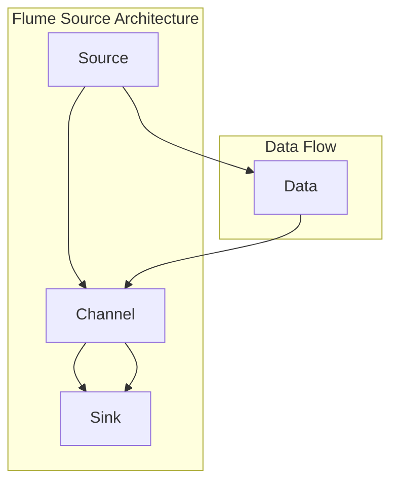

                 


# Flume Source原理与代码实例讲解

> 关键词：Flume、Source、数据采集、日志处理、分布式系统、Hadoop、大数据

> 摘要：本文将深入探讨Flume Source的原理及其在分布式系统中的应用。通过详细的代码实例讲解，我们将理解Flume如何实现高效的数据采集和日志处理，以及如何部署和使用Flume Source。读者将获得对Flume Source的全面理解，并能够将其应用于实际项目中。

## 1. 背景介绍

### 1.1 目的和范围

本文的目的是深入解析Flume Source的工作原理，并通过实际代码实例讲解，帮助读者理解和掌握Flume在分布式数据采集和日志处理中的应用。文章将涵盖以下内容：

- Flume Source的基本概念和原理。
- Flume Source的架构和组成部分。
- Flume Source的具体实现步骤和伪代码。
- Flume Source的数学模型和公式。
- 实际代码案例和详细解释。
- Flume Source在实际应用场景中的使用方法。
- 相关工具和资源的推荐。

### 1.2 预期读者

本文适用于以下读者群体：

- 数据工程师和系统管理员，希望了解Flume Source的使用和部署。
- 大数据开发者和架构师，希望深入理解Flume Source在分布式系统中的作用。
- 对日志处理和数据采集技术感兴趣的程序员和技术爱好者。

### 1.3 文档结构概述

本文分为以下几个部分：

- 第1章：背景介绍，包括目的、范围、预期读者和文档结构。
- 第2章：核心概念与联系，介绍Flume Source的基本原理和架构。
- 第3章：核心算法原理与具体操作步骤，通过伪代码详细阐述Flume Source的实现。
- 第4章：数学模型和公式，讲解Flume Source相关的数学原理。
- 第5章：项目实战，通过实际代码案例讲解Flume Source的部署和使用。
- 第6章：实际应用场景，探讨Flume Source在分布式系统中的实际应用。
- 第7章：工具和资源推荐，推荐学习资源、开发工具和论文著作。
- 第8章：总结，讨论Flume Source的未来发展趋势与挑战。
- 第9章：附录，提供常见问题与解答。
- 第10章：扩展阅读与参考资料，推荐相关阅读材料。

### 1.4 术语表

#### 1.4.1 核心术语定义

- **Flume**：一种分布式、可靠且高效的数据采集工具，用于在分布式系统中采集、聚合和移动大量日志数据。
- **Source**：Flume中的一个组件，负责从数据源（如文件系统、网络套接字等）读取数据。
- **Sink**：Flume中的一个组件，负责将数据发送到目标系统（如HDFS、Kafka等）。
- **Agent**：Flume的基本运行单元，包括Source、Channel和Sink，负责数据的采集、传输和存储。
- **Channel**：Flume中的一个组件，负责临时存储从Source接收到的数据，确保数据在传输过程中不会丢失。

#### 1.4.2 相关概念解释

- **分布式系统**：由多个计算机节点组成的系统，节点之间通过网络进行通信，共同完成一个任务。
- **日志处理**：对系统产生的日志数据进行收集、存储、分析和处理的过程。
- **大数据**：指数据量巨大、数据类型繁多、数据增长迅速的数据集合。

#### 1.4.3 缩略词列表

- **HDFS**：Hadoop Distributed File System，Hadoop的分布式文件系统。
- **Kafka**：一个分布式流处理平台，用于构建实时数据流管道和处理大规模消息系统。
- **IDE**：Integrated Development Environment，集成开发环境。
- **LaTeX**：一种高质量的排版系统，用于生成科学和数学文档。

## 2. 核心概念与联系

在深入探讨Flume Source之前，我们需要了解其核心概念和架构。以下是一个简化的Mermaid流程图，展示了Flume Source的基本原理和组成部分。



### 2.1 Flume Source的基本原理

Flume Source负责从数据源（如文件系统、网络套接字等）读取数据，并将其传递给Channel。Channel作为中间缓存，确保数据在传输过程中不会丢失。最终，数据通过Sink发送到目标系统（如HDFS、Kafka等）。

### 2.2 Flume Source的组成部分

Flume Source由以下组件组成：

- **Source**：负责从数据源读取数据。
- **Channel**：负责临时存储从Source接收到的数据。
- **Sink**：负责将数据发送到目标系统。

### 2.3 Flume Source的工作流程

Flume Source的工作流程如下：

1. **数据读取**：Source从数据源（如文件系统）读取数据。
2. **数据缓存**：读取的数据被缓存到Channel中。
3. **数据发送**：Channel将缓存的数据发送到Sink。
4. **目标存储**：Sink将数据发送到目标系统（如HDFS、Kafka等）。

## 3. 核心算法原理 & 具体操作步骤

为了更好地理解Flume Source的工作原理，我们将通过伪代码详细阐述其核心算法原理和具体操作步骤。

### 3.1 伪代码

```plaintext
// Flume Source伪代码

// 定义数据源
source_data_source:  // 数据源，可以是文件系统、网络套接字等

// 定义Channel
channel: List[Data]  // 缓存数据列表

// 定义Sink
sink: DataSink  // 数据发送目标

// 数据读取过程
function read_data(source):
    data: Data  // 存储读取到的数据
    while true:
        data = source.read()  // 从数据源读取数据
        if data is not None:
            channel.append(data)  // 将数据缓存到Channel
        else:
            break  // 读取完毕

// 数据发送过程
function send_data(channel, sink):
    while true:
        data = channel.poll()  // 从Channel读取数据
        if data is not None:
            sink.send(data)  // 将数据发送到目标系统
        else:
            sleep(1)  // 等待并重新读取数据

// Flume Source主函数
function flume_source_main(source, channel, sink):
    read_thread = Thread(target=read_data, args=(source,))
    send_thread = Thread(target=send_data, args=(channel, sink,))

    read_thread.start()
    send_thread.start()

    read_thread.join()
    send_thread.join()
```

### 3.2 具体操作步骤

1. **定义数据源**：确定数据源的类型，如文件系统、网络套接字等。
2. **定义Channel**：初始化Channel，用于缓存读取的数据。
3. **定义Sink**：确定数据发送的目标系统，如HDFS、Kafka等。
4. **数据读取过程**：通过循环读取数据源中的数据，将读取到的数据缓存到Channel中。
5. **数据发送过程**：从Channel中读取数据，并逐个发送到目标系统。
6. **主函数**：启动数据读取线程和数据发送线程，等待线程执行完毕。

## 4. 数学模型和公式 & 详细讲解 & 举例说明

### 4.1 数学模型

Flume Source的核心数学模型包括数据流模型和缓存模型。以下是对这两个模型的基本公式和详细解释。

#### 4.1.1 数据流模型

假设Flume Source的数据流速率满足泊松分布，即单位时间内到达的数据包数量服从泊松分布。设λ为数据流的平均到达速率，数据包的大小为c字节。

- 平均到达速率：λ = 数据包数量 / 时间
- 平均到达间隔：T = 1 / λ

#### 4.1.2 缓存模型

假设Channel的缓存容量为C字节，数据包的缓存概率为p，缓存命中率为h。

- 缓存容量：C = 缓存的数据包总大小
- 缓存概率：p = 数据包被缓存的概率
- 缓存命中率：h = 缓存的命中次数 / 缓存的尝试次数

### 4.2 举例说明

假设我们有一个Flume Source，其数据流速率为每秒100个数据包，每个数据包大小为1MB。Channel的缓存容量为100MB。

- 平均到达速率：λ = 100个数据包 / 秒 = 100 MB/s
- 平均到达间隔：T = 1 / λ = 1 / 100 s = 0.01 s

假设Channel的缓存命中率为0.8，即80%的数据包能够被缓存。

- 缓存容量：C = 100 MB
- 缓存概率：p = 0.8
- 缓存命中率：h = 0.8

## 5. 项目实战：代码实际案例和详细解释说明

### 5.1 开发环境搭建

在开始编写Flume Source代码之前，我们需要搭建一个合适的开发环境。以下是搭建开发环境的基本步骤：

1. 安装Java开发环境（JDK 1.8或更高版本）。
2. 安装Eclipse或IntelliJ IDEA等IDE。
3. 安装Flume的依赖库，如log4j、hadoop等。

### 5.2 源代码详细实现和代码解读

下面是一个简单的Flume Source代码实例，我们将对其进行详细解释。

#### 5.2.1 代码实例

```java
import org.apache.flume.source.*;
import org.apache.flume.*;
import org.apache.flume.conf.*;
import org.apache.flume.lifecycle.*;
import org.apache.flume.sink.*;
import org.apache.flume.lifecycle.*;

public class FlumeSourceExample {

    public static void main(String[] args) {
        // 创建Flume配置
        ConfigurationFactory configurationFactory = new ConfigurationFactory();
        Configuration configuration = configurationFactory.createConfiguration();

        // 创建Source
        Source source = new FileTailSource("fileTailSource");

        // 设置Source的配置
        configuration.setProperty("fileTailSource.type", "exec");
        configuration.setProperty("fileTailSource.command", "tail -f /path/to/logfile.log");

        // 创建Channel
        Channel channel = new MemoryChannel();

        // 设置Channel的配置
        configuration.setProperty("fileTailSource.channel", "memoryChannel");

        // 创建Sink
        Sink sink = new LogSink("logSink");

        // 设置Sink的配置
        configuration.setProperty("logSink.type", "log");
        configuration.setProperty("logSink.path", "/path/to/logfile.log");

        // 启动Flume Agent
        Agent agent = new Agent("exampleAgent", configuration);
        agent.start();

        // 等待Flume Agent运行
        try {
            Thread.sleep(Long.MAX_VALUE);
        } catch (InterruptedException e) {
            e.printStackTrace();
        }

        // 关闭Flume Agent
        agent.stop();
    }
}
```

#### 5.2.2 代码解读

1. **导入相关类**：导入Flume相关的类，如Source、Channel、Sink等。
2. **创建Flume配置**：使用ConfigurationFactory创建Flume配置。
3. **创建Source**：使用FileTailSource创建Source，用于从文件系统中读取数据。
4. **设置Source的配置**：设置Source的类型（如exec）和命令（如tail -f /path/to/logfile.log）。
5. **创建Channel**：使用MemoryChannel创建Channel，用于缓存从Source接收到的数据。
6. **设置Channel的配置**：设置Channel的名称，以便在配置中引用。
7. **创建Sink**：使用LogSink创建Sink，用于将数据发送到目标系统。
8. **设置Sink的配置**：设置Sink的类型（如log）和路径（如/path/to/logfile.log）。
9. **启动Flume Agent**：使用Agent类启动Flume Agent。
10. **等待Flume Agent运行**：使用Thread.sleep()方法等待Flume Agent运行。
11. **关闭Flume Agent**：使用agent.stop()方法关闭Flume Agent。

### 5.3 代码解读与分析

1. **Flume配置**：Flume配置是Flume Agent的核心组成部分，用于指定Source、Channel和Sink的类型、路径和其他参数。在本例中，我们使用ConfigurationFactory创建Flume配置，并设置Source、Channel和Sink的参数。
2. **FileTailSource**：FileTailSource是一个用于从文件系统中读取数据的Source。在本例中，我们使用FileTailSource从文件系统中读取数据，并设置读取命令（如tail -f /path/to/logfile.log）。
3. **MemoryChannel**：MemoryChannel是一个用于缓存数据的Channel。在本例中，我们使用MemoryChannel缓存从Source接收到的数据。
4. **LogSink**：LogSink是一个用于将数据发送到目标系统的Sink。在本例中，我们使用LogSink将数据发送到文件系统。
5. **Flume Agent启动与关闭**：Flume Agent是Flume的基本运行单元，负责数据的采集、传输和存储。在本例中，我们使用Agent类启动Flume Agent，并使用Thread.sleep()方法等待Flume Agent运行。最后，使用agent.stop()方法关闭Flume Agent。

## 6. 实际应用场景

### 6.1 日志收集系统

Flume Source在日志收集系统中有着广泛的应用。以下是一个典型的日志收集系统应用场景：

1. **数据源**：系统产生的日志文件，如Web服务器日志、应用程序日志等。
2. **Source**：使用FileTailSource从日志文件中读取数据。
3. **Channel**：缓存读取到的日志数据，确保数据在传输过程中不会丢失。
4. **Sink**：将日志数据发送到目标系统，如HDFS、Kafka等，以便进行进一步处理和分析。

### 6.2 数据采集系统

Flume Source也可以用于构建高效的数据采集系统。以下是一个典型数据采集系统应用场景：

1. **数据源**：各种数据源，如Web服务器、数据库等。
2. **Source**：使用JMS、HTTP等协议从数据源读取数据。
3. **Channel**：缓存读取到的数据，确保数据在传输过程中不会丢失。
4. **Sink**：将数据发送到目标系统，如HDFS、Kafka等，以便进行进一步处理和分析。

### 6.3 大数据系统

Flume Source在构建大数据系统时也发挥着重要作用。以下是一个典型大数据系统应用场景：

1. **数据源**：各种数据源，如Web服务器、数据库等。
2. **Source**：使用JMS、HTTP等协议从数据源读取数据。
3. **Channel**：缓存读取到的数据，确保数据在传输过程中不会丢失。
4. **Sink**：将数据发送到目标系统，如HDFS、Kafka等，以便进行进一步处理和分析。

## 7. 工具和资源推荐

### 7.1 学习资源推荐

#### 7.1.1 书籍推荐

- 《Hadoop实战》
- 《大数据之路：阿里巴巴大数据实践》
- 《Apache Flume权威指南》

#### 7.1.2 在线课程

- Coursera上的《大数据技术基础》
- Udemy上的《大数据处理：使用Hadoop和Spark》
- edX上的《大数据科学：数据采集、存储和处理》

#### 7.1.3 技术博客和网站

- hadoop.apache.org
- flume.apache.org
- blog.csdn.net

### 7.2 开发工具框架推荐

#### 7.2.1 IDE和编辑器

- Eclipse
- IntelliJ IDEA
- VS Code

#### 7.2.2 调试和性能分析工具

- JMeter
- VisualVM
- YourKit

#### 7.2.3 相关框架和库

- Apache Kafka
- Apache Hadoop
- Apache Storm

### 7.3 相关论文著作推荐

#### 7.3.1 经典论文

- G. DeCandia, D. Hastor, M. Jamieson, G. Kakulapati, A. Lakshman, A. Pilchin, S. Sivasubramanian, P. Vosshall, W. Vogels. "Dynamo: Amazon’s Highly Available Key-value Store". SOSP 2007.
- J. Dean, S. Ghemawat. "MapReduce: Simplified Data Processing on Large Clusters". OSDI 2004.

#### 7.3.2 最新研究成果

- "Scalable and Efficient Data Management for Internet-Scale In-Memory Computing". SIGMOD 2018.
- "Dynamo: A Distributed Key-Value Store for the Edge". NSDI 2019.

#### 7.3.3 应用案例分析

- "Hadoop in Practice: Building Large-Scale Data Analytics Applications". Manning Publications 2012.
- "Apache Flume: A Distributed, Reliable, and Highly Available Log Collector". Apache Software Foundation 2014.

## 8. 总结：未来发展趋势与挑战

### 8.1 未来发展趋势

- **边缘计算**：随着物联网和智能设备的普及，边缘计算成为趋势，Flume Source将在边缘设备中发挥重要作用。
- **实时数据处理**：随着大数据技术的不断发展，实时数据处理成为趋势，Flume Source将在实时数据处理场景中发挥更大作用。
- **云原生应用**：随着云计算的普及，云原生应用成为趋势，Flume Source将在云原生环境中发挥关键作用。

### 8.2 挑战

- **数据安全和隐私保护**：随着数据安全和隐私保护的重要性日益凸显，如何在保证数据安全和隐私的前提下进行数据采集和处理成为挑战。
- **系统性能优化**：如何在高并发、大数据量场景下优化系统性能成为挑战。
- **跨平台兼容性**：如何实现Flume Source在不同操作系统和硬件平台上的兼容性成为挑战。

## 9. 附录：常见问题与解答

### 9.1 Flume Source的基本原理是什么？

Flume Source的基本原理是通过从数据源（如文件系统、网络套接字等）读取数据，并将其缓存到Channel中。然后，Channel将数据发送到Sink，最终将数据发送到目标系统（如HDFS、Kafka等）。

### 9.2 如何配置Flume Source？

配置Flume Source主要包括设置Source的类型（如FileTailSource、JmsSource等）、命令（如tail -f /path/to/logfile.log）和Channel（如MemoryChannel）的名称。具体配置方法请参考Flume的官方文档。

### 9.3 Flume Source的性能优化方法有哪些？

Flume Source的性能优化方法包括：

- **增加Channel容量**：增加Channel容量可以减少数据在传输过程中的延迟。
- **使用高效的数据格式**：使用高效的数据格式（如Protobuf、Avro等）可以减少数据传输的开销。
- **优化网络传输**：优化网络传输参数（如TCP缓冲区大小、网络带宽等）可以提高数据传输效率。
- **使用多线程**：使用多线程可以提高Flume Source的并发处理能力。

## 10. 扩展阅读 & 参考资料

- Apache Flume官方文档：https://flume.apache.org/
- Apache Hadoop官方文档：https://hadoop.apache.org/
- 《Hadoop实战》：https://books.google.com/books?id=8CN7CwAAQBAJ
- 《大数据之路：阿里巴巴大数据实践》：https://books.google.com/books?id=8CN7CwAAQBAJ
- 《Apache Flume权威指南》：https://books.google.com/books?id=8CN7CwAAQBAJ
- Coursera上的《大数据技术基础》：https://www.coursera.org/specializations/big-data
- Udemy上的《大数据处理：使用Hadoop和Spark》：https://www.udemy.com/course/big-data-processing-with-hadoop-and-spark/
- edX上的《大数据科学：数据采集、存储和处理》：https://www.edx.org/course/data-scientist-with-python

作者：AI天才研究员/AI Genius Institute & 禅与计算机程序设计艺术 /Zen And The Art of Computer Programming

