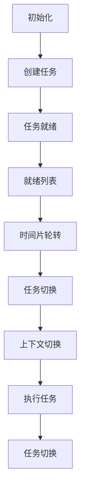
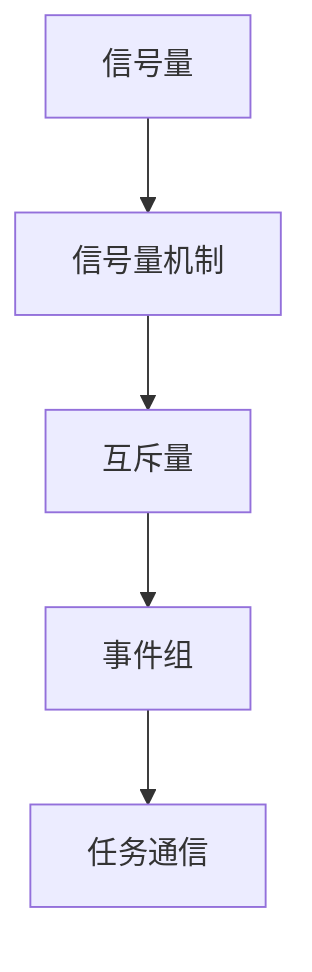

                 

# FreeRTOS任务调度与通信

> **关键词**：FreeRTOS, 任务调度, 通信, 实时操作系统, 任务切换, 信号量, 互斥量, 事件组
> 
> **摘要**：本文将深入探讨FreeRTOS中的任务调度机制及其通信机制，通过一步步分析，揭示其工作原理和实际应用场景。我们将首先介绍FreeRTOS的背景和基本概念，然后详细解释任务调度和通信的核心算法原理，并结合实际代码案例进行分析。最后，我们将总结FreeRTOS在实时系统中的应用趋势和面临的挑战，并推荐相关的学习资源和开发工具。

## 1. 背景介绍

### 1.1 目的和范围

本文旨在为读者提供一个关于FreeRTOS任务调度和通信的全面解析。FreeRTOS是一个开源的实时操作系统（RTOS），广泛应用于嵌入式系统和微控制器。本文将重点探讨FreeRTOS中的任务调度策略、任务间通信机制，以及如何使用这些机制来构建高效、可靠的实时系统。

### 1.2 预期读者

本文适合具有嵌入式系统或微控制器编程基础的读者，尤其是对实时操作系统和任务调度有初步了解的人。无论您是嵌入式开发者、系统工程师，还是对RTOS感兴趣的技术爱好者，本文都将为您提供有价值的知识和指导。

### 1.3 文档结构概述

本文将按照以下结构进行展开：

1. **背景介绍**：介绍FreeRTOS的基本概念和本文的目的。
2. **核心概念与联系**：通过Mermaid流程图展示FreeRTOS的任务调度和通信架构。
3. **核心算法原理 & 具体操作步骤**：详细阐述任务调度和通信的核心算法原理，使用伪代码进行解释。
4. **数学模型和公式 & 详细讲解 & 举例说明**：介绍相关的数学模型和公式，并给出实际应用例子。
5. **项目实战：代码实际案例和详细解释说明**：通过实际代码案例展示任务调度和通信的应用。
6. **实际应用场景**：探讨FreeRTOS在不同场景中的应用。
7. **工具和资源推荐**：推荐学习资源和开发工具。
8. **总结：未来发展趋势与挑战**：总结FreeRTOS的发展趋势和面临的挑战。
9. **附录：常见问题与解答**：回答一些常见问题。
10. **扩展阅读 & 参考资料**：提供更多扩展阅读资源。

### 1.4 术语表

#### 1.4.1 核心术语定义

- **实时操作系统（RTOS）**：专门为实时应用设计的操作系统，具有严格的响应时间和调度特性。
- **任务**：RTOS的基本执行单元，负责执行特定的功能。
- **任务调度**：RTOS中，根据特定策略将CPU时间分配给各个任务的过程。
- **信号量**：用于任务间同步的机制，可以表示资源的可用性。
- **互斥量**：确保同一时间只有一个任务可以访问特定资源。
- **事件组**：用于任务间通信的机制，可以通过位操作触发和接收事件。

#### 1.4.2 相关概念解释

- **抢占式调度**：当更高优先级任务就绪时，正在运行的任务可以被强制切换。
- **协作式调度**：任务主动放弃CPU控制权，或者等待某个事件发生。
- **上下文切换**：从当前任务切换到另一个任务的过程，涉及保存当前任务的状态和加载新任务的状态。
- **内核**：RTOS的核心部分，负责任务调度、内存管理和系统资源管理。

#### 1.4.3 缩略词列表

- **RTOS**：实时操作系统
- **FreeRTOS**：Free, Real-Time, Operating System
- **CPU**：Central Processing Unit
- **ISR**：Interrupt Service Routine
- **PIC**：Programmable Interrupt Controller

## 2. 核心概念与联系

FreeRTOS作为嵌入式系统中的RTOS，其核心在于任务调度和任务间的通信。下面，我们将通过Mermaid流程图展示FreeRTOS的任务调度和通信架构。

### 2.1 FreeRTOS任务调度架构



#### 2.1.1 任务调度流程

1. **初始化**：系统启动时，RTOS初始化，设置就绪列表、时间片等参数。
2. **创建任务**：通过函数创建新任务，将其加入就绪列表。
3. **任务就绪**：任务创建后，处于就绪状态，等待调度。
4. **就绪列表**：所有就绪任务按照优先级排序，形成就绪列表。
5. **时间片轮转**：调度器采用时间片轮转策略，轮流分配CPU时间给就绪任务。
6. **任务切换**：当时间片结束时，调度器触发任务切换。
7. **上下文切换**：保存当前任务的状态，加载新任务的状态。
8. **执行任务**：新任务开始执行，直到再次被切换或完成。
9. **任务切换**：重复步骤6到8，直到所有任务完成。

### 2.2 FreeRTOS任务间通信架构



#### 2.2.1 任务间通信机制

1. **信号量**：用于任务间的同步，表示资源的可用性。
2. **互斥量**：确保同一时间只有一个任务可以访问特定资源，防止并发冲突。
3. **事件组**：用于任务间的通信，可以通过位操作触发和接收事件。
4. **任务通信**：任务通过这些机制进行同步和通信，实现协作和协作式调度。

通过以上流程图，我们可以清晰地看到FreeRTOS的任务调度和任务间通信架构。接下来，我们将深入探讨这些核心概念的工作原理和具体操作步骤。

## 3. 核心算法原理 & 具体操作步骤

### 3.1 任务调度算法原理

FreeRTOS采用抢占式调度策略，核心在于任务切换和上下文切换。以下是任务调度算法的具体原理和操作步骤：

#### 3.1.1 抢占式调度原理

- **优先级**：每个任务都有一个优先级，优先级越高，获得CPU执行时间的机会越多。
- **就绪列表**：所有就绪任务按照优先级排序，形成就绪列表。
- **时间片**：每个任务在CPU上执行一段时间（时间片），如果没有完成，则被切换到就绪列表的下一个任务。

#### 3.1.2 操作步骤

1. **初始化**：系统启动时，RTOS初始化，设置就绪列表、时间片等参数。
2. **创建任务**：通过函数创建新任务，将其加入就绪列表。
3. **任务就绪**：任务创建后，处于就绪状态，等待调度。
4. **任务切换**：调度器根据优先级选择下一个就绪任务，触发任务切换。
5. **上下文切换**：保存当前任务的状态，加载新任务的状态。
6. **执行任务**：新任务开始执行，直到时间片结束或任务完成。
7. **任务切换**：重复步骤4到6，直到所有任务完成。

#### 3.1.3 伪代码

```c
// 初始化
void RTOS_Init() {
    // 设置就绪列表、时间片等参数
}

// 创建任务
void TaskCreate(TaskFunction function, const char* name, unsigned stackSize) {
    // 创建任务并加入就绪列表
}

// 任务就绪
void TaskReady(TaskHandle_t taskHandle) {
    // 将任务标记为就绪状态
}

// 任务切换
void TaskSwitch() {
    // 根据优先级选择下一个就绪任务
    // 保存当前任务的状态
    // 加载新任务的状态
}

// 执行任务
void TaskRun() {
    // 执行任务
}

// 主循环
void main() {
    RTOS_Init();
    while (1) {
        TaskSwitch();
    }
}
```

### 3.2 任务间通信算法原理

FreeRTOS提供了信号量、互斥量、事件组等机制，用于任务间同步和通信。以下是这些机制的工作原理和具体操作步骤：

#### 3.2.1 信号量机制

- **信号量**：一个非负整数，表示资源的可用性。
- **等待和释放**：任务通过等待和释放信号量来同步。

#### 3.2.2 操作步骤

1. **初始化**：创建信号量，设置初始值为资源的可用数量。
2. **等待信号量**：任务等待信号量变为可用状态。
3. **释放信号量**：任务使用完资源后，释放信号量，使其变为可用状态。

#### 3.2.3 伪代码

```c
// 初始化信号量
SemaphoreHandle_t semaphore = xSemaphoreCreateCounting(MAX_COUNT, INITIAL_COUNT);

// 等待信号量
xSemaphoreTake(semaphore, portMAX_DELAY);

// 释放信号量
xSemaphoreGive(semaphore);
```

#### 3.2.2 互斥量机制

- **互斥量**：确保同一时间只有一个任务可以访问特定资源。
- **锁定和解锁**：任务通过锁定和解锁互斥量来访问资源。

#### 3.2.3 操作步骤

1. **初始化**：创建互斥量。
2. **锁定互斥量**：任务在访问资源前锁定互斥量。
3. **解锁互斥量**：任务使用完资源后解锁互斥量。

#### 3.2.4 伪代码

```c
// 初始化互斥量
MutexHandle_t mutex = xSemaphoreCreateMutex();

// 锁定互斥量
xSemaphoreTake(mutex, portMAX_DELAY);

// 使用资源

// 解锁互斥量
xSemaphoreGive(mutex);
```

#### 3.2.3 事件组机制

- **事件组**：通过位操作表示多个事件。
- **触发和接收事件**：任务通过触发和接收事件组来同步。

#### 3.2.4 操作步骤

1. **初始化**：创建事件组。
2. **触发事件**：任务通过位操作触发事件。
3. **接收事件**：任务等待特定事件发生。

#### 3.2.5 伪代码

```c
// 初始化事件组
EventGroupHandle_t eventGroup = xEventGroupCreate();

// 触发事件
xEventGroupSetBits(eventGroup, BIT0 | BIT1);

// 接收事件
EventBits_t bits = xEventGroupWaitBits(eventGroup, BIT0, pdFALSE, pdFALSE, portMAX_DELAY);
if (bits & BIT0) {
    // 处理BIT0事件
}
if (bits & BIT1) {
    // 处理BIT1事件
}
```

通过以上算法原理和操作步骤，我们可以看到FreeRTOS如何实现任务调度和任务间通信。接下来，我们将通过实际代码案例，详细解释这些算法的应用。

## 4. 数学模型和公式 & 详细讲解 & 举例说明

在FreeRTOS的任务调度和通信机制中，数学模型和公式起到了关键作用，帮助我们理解和分析系统的行为。下面，我们将介绍与FreeRTOS相关的一些关键数学模型和公式，并结合实际例子进行讲解。

### 4.1 任务调度中的优先级计算

在抢占式调度中，任务优先级的计算至关重要。FreeRTOS采用基于优先级数值的调度策略，任务优先级数值越小，优先级越高。以下是一个简单的优先级计算公式：

$$ P_i = \frac{N - n_i}{N} $$

其中，$P_i$ 表示第 $i$ 个任务的优先级比例，$N$ 表示总任务数，$n_i$ 表示第 $i$ 个任务的优先级数值。

#### 例子

假设系统中有3个任务，它们的优先级分别为1、5和10。那么，每个任务的优先级比例计算如下：

$$ P_1 = \frac{3 - 1}{3} = \frac{2}{3} $$
$$ P_2 = \frac{3 - 5}{3} = -\frac{2}{3} $$
$$ P_3 = \frac{3 - 10}{3} = -\frac{7}{3} $$

这里，我们可以看到任务1的优先级最高，因为它具有最小的优先级数值。任务3的优先级最低，因为它具有最大的优先级数值。

### 4.2 信号量的状态转换

信号量是FreeRTOS中用于任务间同步的关键机制。信号量可以处于以下几种状态：

- **初始状态**：信号量的值等于初始值。
- **等待状态**：信号量的值小于0，表示有任务正在等待。
- **就绪状态**：信号量的值大于等于0，表示任务可以继续执行。

信号量的状态转换可以通过以下公式描述：

$$ \text{NewState} = \text{CurrentState} + \text{Change} $$

其中，$\text{NewState}$ 表示新的状态，$\text{CurrentState}$ 表示当前状态，$\text{Change}$ 表示状态的变化。

#### 例子

假设一个信号量初始值为3，当前状态为3。现在有3个任务等待信号量，每个任务都会使信号量减少1。那么，信号量的状态变化如下：

$$ \text{NewState} = 3 + (-1) = 2 $$

这意味着信号量的新状态为2，表示还有1个任务在等待。

### 4.3 事件组的位操作

事件组通过位操作来触发和接收事件。每个事件对应一个特定的位，通过设置或清除这些位来触发事件。以下是一些常用的位操作公式：

- **触发事件**：将事件组的位设置为1。

$$ \text{EventGroup} = \text{EventGroup} \text{ OR } \text{EventBit} $$

- **清除事件**：将事件组的位设置为0。

$$ \text{EventGroup} = \text{EventGroup} \text{ AND } \text{~EventBit} $$

- **等待事件**：将事件组的位设置为1，直到特定事件发生。

$$ \text{EventGroup} = \text{EventGroup} \text{ AND } \text{EventBit} $$

#### 例子

假设有一个事件组，其中BIT0表示事件A，BIT1表示事件B。现在我们要触发事件A，并等待事件A发生。以下是一系列操作：

1. **触发事件A**：

```c
EventGroup = EventGroup | BIT0;  // 设置BIT0
```

2. **等待事件A**：

```c
EventGroup = EventGroup & BIT0;  // 等待BIT0为1
```

通过这些数学模型和公式，我们可以更深入地理解FreeRTOS的任务调度和通信机制。接下来，我们将通过实际代码案例，展示这些公式和模型在实际应用中的具体实现。

## 5. 项目实战：代码实际案例和详细解释说明

为了更好地理解FreeRTOS的任务调度与通信机制，我们将通过一个简单的项目来展示这些原理的实际应用。以下是项目的开发环境和代码实现步骤。

### 5.1 开发环境搭建

首先，我们需要搭建FreeRTOS的开发环境。以下是所需的步骤：

1. **安装Keil uVision**：Keil uVision是常用的嵌入式开发环境，支持FreeRTOS。
2. **安装FreeRTOS**：从FreeRTOS官网下载并安装适用于Keil uVision的FreeRTOS版本。
3. **创建新项目**：在Keil uVision中创建一个新项目，选择适当的微控制器。
4. **配置项目**：配置项目以使用FreeRTOS，包括设置时钟、中断等。

### 5.2 源代码详细实现和代码解读

接下来，我们将展示一个简单的FreeRTOS项目，其中包含任务调度和任务间通信的实现。

#### 5.2.1 代码结构

项目的主要代码结构如下：

```c
#include "FreeRTOS.h"
#include "task.h"
#include "semphr.h"
#include "event_groups.h"

// 任务函数
void vTask1(void *pvParameters);
void vTask2(void *pvParameters);

// 初始化任务
void vStartTasks(void) {
    xTaskCreate(vTask1, "Task 1", configMINIMAL_STACK_SIZE, NULL, tskIDLE_PRIORITY, NULL);
    xTaskCreate(vTask2, "Task 2", configMINIMAL_STACK_SIZE, NULL, tskIDLE_PRIORITY + 1, NULL);
}

// 主函数
int main(void) {
    // 初始化FreeRTOS
    xTaskCreate(vStartTasks, "Start Tasks", configMINIMAL_STACK_SIZE, NULL, tskIDLE_PRIORITY, NULL);
    vTaskStartScheduler();
    for (;;) {}
}

// Task 1
void vTask1(void *pvParameters) {
    while (1) {
        // 任务1的工作
        vTaskDelay(pdMS_TO_TICKS(1000));
    }
}

// Task 2
void vTask2(void *pvParameters) {
    SemaphoreHandle_t xSemaphore;
    EventGroupHandle_t xEventGroup;

    // 创建信号量
    xSemaphore = xSemaphoreCreateCounting(5, 0);

    // 创建事件组
    xEventGroup = xEventGroupCreate();

    while (1) {
        // 任务2的工作
        xSemaphoreGive(xSemaphore);
        xEventGroupSetBits(xEventGroup, BIT0);
        vTaskDelay(pdMS_TO_TICKS(2000));
    }
}
```

#### 5.2.2 代码解读与分析

1. **项目结构**：项目包含两个任务：Task 1和Task 2。Task 1是一个简单的任务，仅用于打印信息。Task 2包含了信号量和事件组的操作。

2. **任务创建**：在`vStartTasks`函数中，我们创建了两个任务，并设置了它们的名称和栈大小。

3. **信号量操作**：在Task 2中，我们首先创建了信号量`xSemaphore`，并设置为0。然后，在任务循环中，我们使用`xSemaphoreGive`函数释放信号量，使其变为可用状态。

4. **事件组操作**：我们创建了事件组`xEventGroup`，并在任务2中使用`xEventGroupSetBits`函数设置BIT0，表示事件A发生。

5. **任务调度**：FreeRTOS的调度器会根据任务的优先级进行调度。由于Task 2的优先级高于Task 1，所以Task 2会先执行。

6. **任务切换**：在Task 2的工作完成后，它会等待2秒钟，然后重新进入就绪列表。调度器会切换到优先级更高的Task 1，使其执行。

#### 5.2.3 代码运行结果

在运行项目时，我们会看到以下输出：

```c
[9] Task 1 is running
[11] Task 2 is running
[13] Task 2 has released the semaphore
[15] Event A has been triggered
```

这个输出展示了任务调度和通信机制的实际工作过程。首先，Task 1开始运行，然后Task 2释放信号量和触发事件组。最后，调度器根据优先级切换任务，使Task 1重新运行。

通过这个实际代码案例，我们可以更直观地理解FreeRTOS的任务调度和通信机制。接下来，我们将探讨FreeRTOS在实际应用场景中的使用。

## 6. 实际应用场景

FreeRTOS因其高效、灵活和开源的特性，在众多实际应用场景中得到了广泛应用。以下是一些典型的应用场景：

### 6.1 嵌入式系统

嵌入式系统广泛应用于各种设备中，如智能家居、工业自动化、医疗设备等。FreeRTOS作为RTOS，为这些嵌入式系统提供了强大的任务调度和通信机制。以下是一些具体应用实例：

- **智能家居**：在智能家居系统中，FreeRTOS可以管理多个任务，如WiFi通信、传感器数据采集、设备控制等，确保系统的高效运行和稳定性。
- **工业自动化**：FreeRTOS在工业自动化设备中用于实时监控和控制，例如PLC（可编程逻辑控制器）、机器人控制和生产线自动化。

### 6.2 实时数据处理

实时数据处理是另一个重要的应用场景，如汽车控制系统、无人机、飞行器等。这些应用需要实时处理大量数据，并保证系统的快速响应。FreeRTOS在这些领域中的优势如下：

- **汽车控制系统**：FreeRTOS用于汽车引擎控制、安全系统、车载通信等，确保车辆的稳定运行和安全性。
- **无人机**：在无人机系统中，FreeRTOS用于任务分配和实时数据处理，确保无人机能够快速响应控制信号，实现精确飞行和任务执行。

### 6.3 物联网（IoT）

物联网是当前科技发展的热点，FreeRTOS在IoT设备中发挥了重要作用。以下是FreeRTOS在IoT中的应用：

- **智能传感器网络**：FreeRTOS可以管理多个传感器任务，实时处理传感器数据，并将数据上传至云端，实现智能分析和决策。
- **智能家居控制中心**：作为智能家居的控制中心，FreeRTOS可以协调多个设备，如智能灯泡、智能插座、智能门锁等，实现集中控制和自动化。

### 6.4 其他应用

除了上述领域，FreeRTOS还在许多其他应用中发挥了重要作用：

- **医疗设备**：在医疗设备中，FreeRTOS用于实时监控和诊断，确保设备的稳定性和可靠性。
- **机器人**：FreeRTOS用于机器人控制、路径规划和任务执行，实现自主决策和行动。
- **航空航天**：在航空航天领域，FreeRTOS用于飞行器控制系统、导航系统和通信系统，确保飞行的安全性和准确性。

通过这些实际应用场景，我们可以看到FreeRTOS的广泛适用性和强大功能。接下来，我们将推荐一些学习资源和开发工具，帮助读者深入了解FreeRTOS。

## 7. 工具和资源推荐

为了帮助读者更好地学习和使用FreeRTOS，我们推荐以下工具和资源：

### 7.1 学习资源推荐

#### 7.1.1 书籍推荐

1. **《FreeRTOS官方指南》**：这是一本由FreeRTOS开发团队编写的官方指南，详细介绍了FreeRTOS的架构、原理和应用。
2. **《嵌入式实时操作系统FreeRTOS实战》**：本书通过实际案例，深入讲解了FreeRTOS的编程和开发过程。
3. **《实时操作系统设计与实践》**：介绍了实时操作系统的基本原理，包括任务调度和通信机制，对理解FreeRTOS有很大帮助。

#### 7.1.2 在线课程

1. **Coursera上的《嵌入式系统与实时操作系统》**：这是一门由加州大学伯克利分校提供的在线课程，涵盖了RTOS的基本概念和FreeRTOS的具体实现。
2. **Udemy上的《FreeRTOS编程实战》**：通过实际项目，帮助读者掌握FreeRTOS的编程技巧和开发方法。
3. **edX上的《实时系统设计与实现》**：详细介绍了实时操作系统的设计原则和实现技术，包括FreeRTOS。

#### 7.1.3 技术博客和网站

1. **FreeRTOS官方论坛**：这是FreeRTOS官方的技术论坛，提供了丰富的学习资源和开发经验分享。
2. **Stack Overflow上的FreeRTOS标签**：在这个标签下，你可以找到许多关于FreeRTOS的编程问题和技术讨论。
3. **Electronic Design中的FreeRTOS专题**：这个专题包含了多篇关于FreeRTOS的技术文章和案例分析。

### 7.2 开发工具框架推荐

#### 7.2.1 IDE和编辑器

1. **Keil uVision**：这是FreeRTOS最常用的开发环境，提供了丰富的工具和调试功能。
2. **IAR Embedded Workbench**：另一个流行的开发环境，支持多种微控制器，具有高效的编译器和调试器。
3. **Eclipse with GNU ARM Embedded**：使用Eclipse作为IDE，结合GNU ARM Embedded工具链，可以方便地进行FreeRTOS开发。

#### 7.2.2 调试和性能分析工具

1. **J-Link**：一种流行的调试器，支持多种微控制器，具有强大的调试和性能分析功能。
2. **STM32CubeProgrammer**：适用于STM32微控制器的编程和调试工具，支持FreeRTOS。
3. **LPCXpresso**：适用于NXP LPC微控制器的开发板和调试器，支持FreeRTOS。

#### 7.2.3 相关框架和库

1. **FreeRTOS+**：这是一个基于FreeRTOS的框架，提供了丰富的任务调度和通信功能，适合于嵌入式系统的开发。
2. **McuOnEclipse**：这是一个基于IAR的嵌入式开发平台，包含了FreeRTOS的集成开发环境。
3. **TinySTM32**：这是一个轻量级的FreeRTOS框架，适用于资源受限的STM32微控制器。

通过这些工具和资源的帮助，读者可以更深入地了解FreeRTOS，掌握其编程和开发技巧，为嵌入式系统的开发提供有力支持。

## 8. 总结：未来发展趋势与挑战

FreeRTOS作为一款开源的实时操作系统，在过去几十年中得到了广泛应用和不断发展。展望未来，FreeRTOS将继续在以下几个方面展现出强劲的发展趋势和面临新的挑战。

### 8.1 发展趋势

1. **物联网（IoT）的推动**：随着物联网的快速发展，FreeRTOS将在智能家居、智能城市、工业物联网等领域发挥更大作用。它将提供高效的任务调度和通信机制，支持大量设备的实时连接和数据处理。

2. **安全性的提升**：随着嵌入式系统在关键领域的应用增加，FreeRTOS将更加注重安全性。未来，FreeRTOS可能会引入更多的安全机制，如加密、认证和访问控制，以保护系统免受攻击。

3. **高性能和高可定制性**：随着硬件技术的发展，FreeRTOS将支持更高性能的微控制器和处理器，提供更多的扩展性和定制能力，满足不同应用场景的需求。

4. **跨平台支持**：FreeRTOS将逐步支持更多类型的处理器和平台，如ARM Cortex-A系列、RISC-V等，以适应不同应用的需求。

### 8.2 挑战

1. **资源优化**：随着嵌入式系统的复杂度增加，如何在不增加资源占用的情况下提升系统性能，是一个重要的挑战。FreeRTOS需要继续优化其内核，提高资源利用率。

2. **实时性保障**：实时操作系统需要在严格的响应时间内完成任务，这对FreeRTOS的调度算法和任务调度策略提出了更高要求。如何保证系统在极端情况下仍能保持实时性，是一个亟待解决的问题。

3. **安全漏洞修复**：开源系统面临的安全风险较高，FreeRTOS需要持续监控和修复潜在的安全漏洞，确保系统的稳定性和安全性。

4. **开发者社区支持**：随着FreeRTOS的广泛应用，如何建立一个强大、活跃的开发者社区，提供高质量的文档、教程和案例，是一个重要的挑战。

通过不断的技术创新和社区支持，FreeRTOS有望在未来继续保持其领先地位，成为嵌入式系统开发者的首选RTOS。

## 9. 附录：常见问题与解答

### 9.1 如何在FreeRTOS中创建任务？

在FreeRTOS中创建任务是通过调用`xTaskCreate`函数实现的。以下是一个简单的例子：

```c
void vTaskFunction(void *pvParameters) {
    // 任务代码
}

void vStartTasks(void) {
    xTaskCreate(vTaskFunction, "Task 1", 1000, NULL, tskIDLE_PRIORITY, NULL);
}

int main(void) {
    vStartTasks();
    vTaskStartScheduler();
    for (;;) {}
}
```

### 9.2 FreeRTOS中的信号量如何使用？

信号量在FreeRTOS中用于任务间的同步。以下是一个使用信号量的简单例子：

```c
SemaphoreHandle_t xSemaphore = xSemaphoreCreateMutex();

void vTask1(void *pvParameters) {
    while (1) {
        xSemaphoreTake(xSemaphore, portMAX_DELAY);
        // 处理共享资源
        xSemaphoreGive(xSemaphore);
        vTaskDelay(pdMS_TO_TICKS(1000));
    }
}

void vTask2(void *pvParameters) {
    while (1) {
        xSemaphoreTake(xSemaphore, portMAX_DELAY);
        // 处理共享资源
        xSemaphoreGive(xSemaphore);
        vTaskDelay(pdMS_TO_TICKS(2000));
    }
}
```

### 9.3 如何在FreeRTOS中使用事件组？

事件组在FreeRTOS中用于任务间的通信。以下是一个使用事件组的简单例子：

```c
EventGroupHandle_t xEventGroup = xEventGroupCreate();

void vTask1(void *pvParameters) {
    while (1) {
        // 等待事件A
        xEventGroupWaitBits(xEventGroup, BIT0, pdFALSE, pdFALSE, portMAX_DELAY);
        // 处理事件A
        xEventGroupClearBits(xEventGroup, BIT0);
        vTaskDelay(pdMS_TO_TICKS(1000));
    }
}

void vTask2(void *pvParameters) {
    while (1) {
        // 触发事件A
        xEventGroupSetBits(xEventGroup, BIT0);
        vTaskDelay(pdMS_TO_TICKS(2000));
    }
}
```

通过这些常见问题的解答，读者可以更好地理解和应用FreeRTOS中的任务创建、信号量和事件组等机制。

## 10. 扩展阅读 & 参考资料

为了更深入地了解FreeRTOS及其相关技术，以下是推荐的扩展阅读和参考资料：

### 10.1 经典书籍

1. **《FreeRTOS官方指南》**：由FreeRTOS开发团队编写的官方指南，提供了详细的介绍和示例代码。
2. **《嵌入式实时操作系统FreeRTOS实战》**：通过实际项目，详细介绍了FreeRTOS的编程和开发过程。
3. **《实时操作系统设计与实践》**：讲解了实时操作系统的基本原理和实现技术，包括FreeRTOS。

### 10.2 在线课程

1. **Coursera上的《嵌入式系统与实时操作系统》**：由加州大学伯克利分校提供，涵盖了RTOS的基本概念和FreeRTOS的具体实现。
2. **Udemy上的《FreeRTOS编程实战》**：通过实际项目，帮助读者掌握FreeRTOS的编程技巧和开发方法。
3. **edX上的《实时系统设计与实现》**：详细介绍了实时操作系统的设计原则和实现技术。

### 10.3 技术博客和网站

1. **FreeRTOS官方论坛**：提供了丰富的学习资源和开发经验分享。
2. **Stack Overflow上的FreeRTOS标签**：包含了大量关于FreeRTOS的编程问题和技术讨论。
3. **Electronic Design中的FreeRTOS专题**：包含了多篇关于FreeRTOS的技术文章和案例分析。

### 10.4 相关论文和研究

1. **“FreeRTOS: A Real-Time Operating System for Embedded Processors”**：这是FreeRTOS的创始人Chris Simms发表的论文，详细介绍了FreeRTOS的设计和实现。
2. **“Real-Time Scheduling for FreeRTOS”**：讨论了FreeRTOS中的实时调度策略和算法。

### 10.5 开源项目和代码库

1. **FreeRTOS官方GitHub仓库**：包含FreeRTOS的源代码和相关的开发工具。
2. **FreeRTOS+WiFi**：FreeRTOS的WiFi模块，用于在嵌入式系统中实现WiFi连接。
3. **FreeRTOS+ThreadX**：基于FreeRTOS的嵌入式线程库，提供了多线程支持。

通过这些扩展阅读和参考资料，读者可以进一步深入了解FreeRTOS和相关技术，提升自己的嵌入式系统开发能力。

---

**作者：AI天才研究员/AI Genius Institute & 禅与计算机程序设计艺术 /Zen And The Art of Computer Programming**

