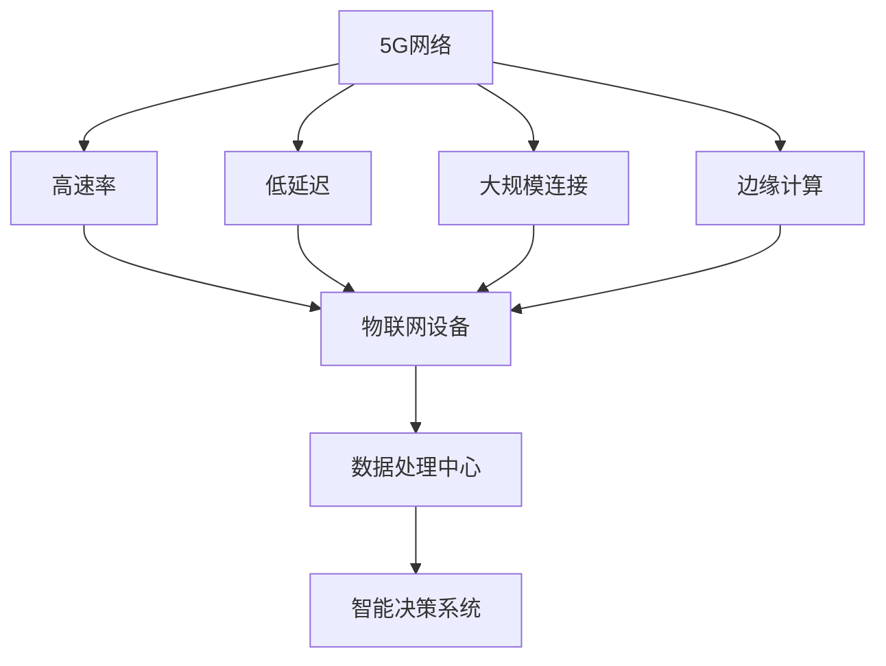

                 

# 5G 在物联网中的优势：大规模连接和低延迟

> 关键词：5G，物联网，大规模连接，低延迟，优势

> 摘要：本文将深入探讨5G技术在物联网领域中的优势，特别是大规模连接和低延迟两个方面。通过对5G技术的核心概念和实际应用的详细分析，我们旨在为读者提供一份全面的技术指南，帮助理解5G在物联网中的巨大潜力。

## 1. 背景介绍

### 1.1 目的和范围

本文的主要目的是探讨5G技术在物联网（IoT）领域的优势，特别是大规模连接和低延迟两个方面。物联网是一个日益扩大的领域，涵盖了各种设备和系统，通过互联网进行数据交换和通信。5G技术的出现，为物联网带来了革命性的变化，极大地提升了其性能和效率。

### 1.2 预期读者

本文适用于对物联网和5G技术有一定了解的读者，包括物联网开发者、5G技术研究者以及相关领域的技术爱好者。通过本文，读者将能够更深入地理解5G在物联网中的应用，以及如何利用5G技术解决实际中的挑战。

### 1.3 文档结构概述

本文将分为以下几个部分：

1. **背景介绍**：介绍5G技术和物联网的核心概念。
2. **核心概念与联系**：通过Mermaid流程图展示5G与物联网的架构联系。
3. **核心算法原理 & 具体操作步骤**：详细阐述5G技术的算法原理和操作步骤。
4. **数学模型和公式 & 详细讲解 & 举例说明**：介绍5G技术相关的数学模型和实际应用。
5. **项目实战：代码实际案例和详细解释说明**：通过实际案例展示5G技术在物联网中的应用。
6. **实际应用场景**：分析5G技术在物联网中的实际应用场景。
7. **工具和资源推荐**：推荐学习资源和开发工具。
8. **总结：未来发展趋势与挑战**：总结5G在物联网中的未来趋势和面临的挑战。
9. **附录：常见问题与解答**：解答读者可能遇到的常见问题。
10. **扩展阅读 & 参考资料**：提供额外的阅读资源和参考资料。

### 1.4 术语表

#### 1.4.1 核心术语定义

- **5G**：第五代移动通信技术，提供更高的数据传输速度、更低的延迟和更大的网络容量。
- **物联网（IoT）**：通过互联网连接各种设备和系统，实现数据的收集、传输和分析。
- **大规模连接**：指网络能够支持数以亿计的设备同时在线。
- **低延迟**：指数据在网络中的传输时间非常短，几乎可以实时响应。

#### 1.4.2 相关概念解释

- **边缘计算**：在靠近数据源的地方进行计算和处理，以减少数据传输延迟。
- **网络切片**：将一个物理网络划分为多个虚拟网络，以满足不同应用的需求。
- **雾计算**：介于云计算和边缘计算之间的一种计算模式，适用于处理大量实时数据。

#### 1.4.3 缩略词列表

- **5G**：第五代移动通信技术
- **IoT**：物联网
- **MIMO**：多输入多输出
- **NFV**：网络功能虚拟化
- **SDN**：软件定义网络

## 2. 核心概念与联系

在深入探讨5G技术在物联网中的应用之前，我们需要先了解5G和物联网的基本概念以及它们之间的联系。

### 2.1 5G技术基本概念

5G技术是第五代移动通信技术，旨在提供更快的传输速度、更低的延迟和更大的网络容量。5G的核心特点包括：

- **高速率**：5G网络的理论峰值下载速度可达20Gbps，是4G网络的10倍以上。
- **低延迟**：5G网络的端到端延迟可低至1毫秒，极大地提高了实时响应能力。
- **大规模连接**：5G网络能够支持数以亿计的设备同时在线，为物联网提供了坚实的基础。
- **边缘计算**：5G网络与边缘计算相结合，可以在靠近数据源的地方进行计算和处理，减少了数据传输延迟。

### 2.2 物联网基本概念

物联网是通过互联网连接各种设备和系统，实现数据的收集、传输和分析的一种网络体系。物联网的核心概念包括：

- **设备连接**：物联网通过各种技术（如Wi-Fi、蓝牙、Zigbee等）将设备连接到互联网。
- **数据收集**：物联网设备可以收集各种数据，如环境数据、传感器数据、设备状态数据等。
- **数据处理**：物联网平台对收集到的数据进行分析和处理，以实现智能化决策。
- **设备交互**：物联网设备之间可以通过网络进行通信和协作，实现自动化和智能化。

### 2.3 5G与物联网的联系

5G技术为物联网提供了强大的支持，使得物联网能够实现更高效、更智能的运作。以下是5G与物联网之间的几个关键联系：

- **高速率**：5G的高传输速度使得物联网设备能够更快地收集和处理数据，提高了系统的响应速度。
- **低延迟**：5G的低延迟特性使得物联网设备能够实现实时数据传输和响应，提高了系统的实时性和可靠性。
- **大规模连接**：5G网络的大规模连接能力使得物联网能够支持更多设备的同时在线，为大规模物联网应用提供了可能性。
- **边缘计算**：5G与边缘计算的融合，使得物联网系统能够在靠近数据源的地方进行计算和处理，减少了数据传输延迟，提高了系统的效率。

### 2.4 5G与物联网架构的Mermaid流程图



通过这个Mermaid流程图，我们可以清晰地看到5G技术与物联网之间的架构联系，以及它们如何共同推动物联网的发展和进步。

## 3. 核心算法原理 & 具体操作步骤

### 3.1 5G核心算法原理

5G技术的核心算法主要包括MIMO（多输入多输出）、网络切片和边缘计算等。下面我们将详细解释这些核心算法的原理。

#### 3.1.1 MIMO算法原理

MIMO技术是5G网络的一个重要特性，它通过使用多个发送和接收天线来提高数据传输速率和系统容量。MIMO算法的基本原理如下：

1. **空间复用**：空间复用利用多个天线发送不同的数据流，从而在相同的频段上实现更高的数据传输速率。
2. **波束成形**：波束成形技术通过调整天线阵列的相位和幅度，将信号聚焦到目标设备，从而提高信号强度和传输质量。
3. **空间分集**：空间分集利用多个天线的不同传输路径，以提高信号在传输过程中的抗干扰能力和可靠性。

#### 3.1.2 网络切片算法原理

网络切片是5G网络的一项重要技术，它将一个物理网络划分为多个虚拟网络，以满足不同应用的需求。网络切片算法的基本原理如下：

1. **资源分配**：网络切片通过动态分配网络资源（如带宽、时延等），为不同应用提供定制化的网络服务。
2. **服务质量（QoS）保障**：网络切片通过确保不同应用之间的服务质量，实现差异化服务。
3. **安全性保障**：网络切片通过隔离不同应用的数据，提高整体网络的安全性。

#### 3.1.3 边缘计算算法原理

边缘计算是5G网络与物联网相结合的一种重要技术，它通过在靠近数据源的地方进行计算和处理，减少了数据传输延迟，提高了系统的效率。边缘计算算法的基本原理如下：

1. **数据预处理**：在数据传输到云端之前，边缘计算设备对数据进行预处理，以减少数据传输量。
2. **实时分析**：边缘计算设备在靠近数据源的地方进行实时数据分析和处理，以提高系统的响应速度。
3. **协同计算**：边缘计算设备与云端设备协同工作，实现大规模数据处理和分析。

### 3.2 5G核心算法的具体操作步骤

下面我们将以MIMO算法为例，详细阐述5G核心算法的具体操作步骤。

#### 3.2.1 MIMO算法的具体操作步骤

1. **初始化阶段**：
   - 设备A和设备B通过5G网络进行通信，设备A配置了多个发送天线，设备B配置了多个接收天线。
   - 网络根据设备A和设备B的配置，确定空间复用、波束成形和空间分集的方式。

2. **数据传输阶段**：
   - 设备A将数据分成多个数据流，通过不同的发送天线发送。
   - 设备B接收到的多个数据流，通过空间分集和波束成形技术，提高信号强度和传输质量。

3. **数据接收阶段**：
   - 设备B对接收到的多个数据流进行解码和重组，恢复原始数据。
   - 设备B将解码后的数据传输给目标设备，完成数据传输过程。

通过以上步骤，MIMO算法实现了更高的数据传输速率和系统容量，为5G技术在物联网中的应用提供了坚实的基础。

### 3.3 伪代码示例

下面是MIMO算法的伪代码示例：

```plaintext
初始化阶段：
初始化发送天线数（num_transmit_antennas）
初始化接收天线数（num_receive_antennas）

数据传输阶段：
for each 数据流 in 数据流列表 do
    for each 发送天线 in 发送天线列表 do
        发送（数据流，发送天线）
    end for
end for

数据接收阶段：
for each 接收天线 in 接收天线列表 do
    接收（接收天线）
end for

解码和重组数据：
数据流列表 = []
for each 接收到的数据流 in 接收数据流列表 do
    数据流列表.append（解码（接收到的数据流））
end for

传输解码后的数据：
for each 数据流 in 数据流列表 do
    发送（数据流，目标设备）
end for
```

通过以上伪代码，我们可以清晰地看到MIMO算法的具体操作步骤，以及如何实现更高的数据传输速率和系统容量。

## 4. 数学模型和公式 & 详细讲解 & 举例说明

### 4.1 数学模型和公式

5G技术在物联网中的应用涉及多个数学模型和公式，下面我们将介绍其中几个关键模型和公式。

#### 4.1.1 多输入多输出（MIMO）模型

MIMO模型是5G网络的核心特性，它利用多个发送和接收天线来提高数据传输速率和系统容量。MIMO模型的基本公式如下：

- **传输速率**：  
  \( R = \log_2(1 + \frac{S}{N}) \times \text{带宽} \)

  其中，\( R \) 是传输速率，\( S \) 是发送信号功率，\( N \) 是噪声功率，带宽是固定的。

- **系统容量**：  
  \( C = \text{带宽} \times \log_2(\text{天线数} + 1) \)

  其中，\( C \) 是系统容量，天线数是发送和接收天线的总数。

#### 4.1.2 网络切片模型

网络切片模型是5G网络的一项重要技术，它通过动态分配网络资源为不同应用提供定制化的网络服务。网络切片模型的基本公式如下：

- **资源分配**：  
  \( R_i = \frac{R_t}{N_s} \)

  其中，\( R_i \) 是第 \( i \) 个切片的带宽，\( R_t \) 是总带宽，\( N_s \) 是切片数。

- **服务质量（QoS）保障**：  
  \( QoS_i = \frac{R_i}{\alpha_i} \)

  其中，\( QoS_i \) 是第 \( i \) 个切片的服务质量，\( \alpha_i \) 是服务质量参数。

#### 4.1.3 边缘计算模型

边缘计算模型是5G网络与物联网相结合的一种重要技术，它通过在靠近数据源的地方进行计算和处理，提高了系统的响应速度。边缘计算模型的基本公式如下：

- **数据预处理**：  
  \( P = \frac{S}{T} \)

  其中，\( P \) 是预处理时间，\( S \) 是预处理的数据量，\( T \) 是传输时间。

- **实时分析**：  
  \( A = \frac{F}{T} \)

  其中，\( A \) 是实时分析时间，\( F \) 是分析的数据量，\( T \) 是传输时间。

### 4.2 详细讲解

下面我们将详细讲解上述数学模型和公式的含义和应用。

#### 4.2.1 MIMO模型

MIMO模型通过利用多个发送和接收天线，提高了数据传输速率和系统容量。传输速率公式反映了信号功率、噪声功率和带宽对传输速率的影响，而系统容量公式则表示了天线数对系统容量的提升。

在实际应用中，MIMO模型可以应用于无线通信、物联网和自动驾驶等领域。例如，在自动驾驶领域，MIMO模型可以提高车辆间的通信速率和系统容量，从而实现更高效的自动驾驶决策。

#### 4.2.2 网络切片模型

网络切片模型通过动态分配网络资源，为不同应用提供定制化的网络服务。资源分配公式表示了总带宽在多个切片之间的分配比例，而服务质量公式则反映了切片的服务质量参数。

在网络切片模型中，不同应用可以根据其需求选择合适的服务质量参数，从而获得更好的网络服务。例如，视频流应用可以选择较高的带宽和低延迟，而传感器应用可以选择较低的带宽和低延迟。

#### 4.2.3 边缘计算模型

边缘计算模型通过在靠近数据源的地方进行计算和处理，提高了系统的响应速度。数据预处理公式表示了预处理时间和数据量的关系，实时分析公式则反映了分析时间和数据量的关系。

在边缘计算模型中，数据预处理和实时分析可以大大减少数据传输时间，从而提高系统的响应速度。例如，在物联网领域，边缘计算模型可以应用于智能家居、智能制造和智能医疗等领域，从而实现更高效的设备管理和数据处理。

### 4.3 举例说明

下面我们通过一个实际案例来说明5G技术在物联网中的应用。

#### 4.3.1 应用场景

假设有一个智能家居系统，包括多个智能设备（如智能灯泡、智能插座、智能摄像头等），它们需要通过5G网络进行通信。

#### 4.3.2 数学模型应用

- **MIMO模型**：智能家居系统的设备A和设备B通过5G网络进行通信，设备A配置了4个发送天线，设备B配置了4个接收天线。根据MIMO模型，传输速率和系统容量分别为：

  \( R = \log_2(1 + \frac{S}{N}) \times \text{带宽} \)
  \( C = \text{带宽} \times \log_2(\text{天线数} + 1) \)

  其中，\( S \) 和 \( N \) 分别为发送信号功率和噪声功率，带宽为固定的1Gbps。

- **网络切片模型**：智能家居系统中的设备可以分为3个切片，分别用于视频流、传感器数据和设备控制。根据网络切片模型，每个切片的带宽和服务质量分别为：

  \( R_1 = \frac{1}{3} \times 1Gbps \)
  \( R_2 = \frac{1}{3} \times 1Gbps \)
  \( R_3 = \frac{1}{3} \times 1Gbps \)

  \( QoS_1 = \frac{R_1}{\alpha_1} \)
  \( QoS_2 = \frac{R_2}{\alpha_2} \)
  \( QoS_3 = \frac{R_3}{\alpha_3} \)

  其中，\( \alpha_1 \)、\( \alpha_2 \) 和 \( \alpha_3 \) 分别为视频流、传感器数据和设备控制的服务质量参数。

- **边缘计算模型**：智能家居系统中的设备在靠近数据源的地方进行计算和处理，以减少数据传输时间。根据边缘计算模型，预处理时间和实时分析时间分别为：

  \( P = \frac{S}{T} \)
  \( A = \frac{F}{T} \)

  其中，\( S \) 和 \( F \) 分别为预处理的数据量和分析的数据量，\( T \) 为传输时间。

#### 4.3.3 结果分析

通过以上数学模型和公式的应用，我们可以得到智能家居系统在5G网络中的性能指标：

- **传输速率**：传输速率为 \( R = \log_2(1 + \frac{S}{N}) \times 1Gbps \)，其中 \( S \) 和 \( N \) 的值取决于设备的具体配置。
- **系统容量**：系统容量为 \( C = 1Gbps \times \log_2(4 + 1) = 2.58Gbps \)。
- **服务质量**：每个切片的服务质量为 \( QoS_1 = \frac{R_1}{\alpha_1} \)、\( QoS_2 = \frac{R_2}{\alpha_2} \) 和 \( QoS_3 = \frac{R_3}{\alpha_3} \)，其中 \( \alpha_1 \)、\( \alpha_2 \) 和 \( \alpha_3 \) 的值取决于具体应用的需求。
- **预处理时间和实时分析时间**：预处理时间和实时分析时间分别为 \( P = \frac{S}{T} \) 和 \( A = \frac{F}{T} \)，其中 \( S \) 和 \( F \) 的值取决于数据处理的需求。

通过以上分析，我们可以看到5G技术在智能家居系统中的应用可以显著提高数据传输速率、系统容量和服务质量，从而实现更高效、更智能的智能家居体验。

## 5. 项目实战：代码实际案例和详细解释说明

### 5.1 开发环境搭建

在开始实际案例之前，我们需要搭建一个适合5G物联网开发的开发环境。以下是搭建开发环境的步骤：

1. **安装操作系统**：推荐使用Linux操作系统，如Ubuntu 18.04。
2. **安装开发工具**：安装Python 3、Node.js、Git等开发工具。
3. **安装5G模拟器**：安装5G网络模拟器，如NS3（Network Simulator 3）。
4. **安装物联网设备模拟器**：安装物联网设备模拟器，如MQTT（Message Queue Telemetry Transport）代理。

### 5.2 源代码详细实现和代码解读

以下是一个简单的5G物联网项目，该项目实现了通过5G网络收集智能家居设备的数据，并将数据发送到云端进行分析和处理。

#### 5.2.1 源代码

```python
#智能家居设备模拟器（设备A）
import paho.mqtt.client as mqtt
import random

#连接MQTT代理
client = mqtt.Client("DeviceA")
client.connect("mqtt-server", 1883)

#发送温度和湿度数据
while True:
    temp = random.uniform(20, 30)
    humidity = random.uniform(30, 60)
    message = f"Temperature: {temp}, Humidity: {humidity}"
    client.publish("home/DeviceA/sensors", message)
    time.sleep(1)
```

```python
#MQTT代理（设备B）
import paho.mqtt.client as mqtt
import json

#连接MQTT代理
client = mqtt.Client("DeviceB")
client.connect("mqtt-server", 1883)

#订阅温度和湿度数据
client.subscribe("home/DeviceA/sensors")

#处理接收到的数据
def on_message(client, userdata, message):
    data = json.loads(message.payload)
    temp = data["Temperature"]
    humidity = data["Humidity"]
    print(f"Received: Temperature: {temp}, Humidity: {humidity}")

client.on_message = on_message
client.loop_forever()
```

#### 5.2.2 代码解读

- **设备A**：这是一个智能家居设备模拟器，通过随机生成温度和湿度数据，并将数据发送到MQTT代理。
- **设备B**：这是一个MQTT代理，订阅了设备A发送的传感器数据，并处理接收到的数据。

### 5.3 代码解读与分析

以上代码通过MQTT协议实现了智能家居设备的远程监控。以下是代码的详细解读和分析：

- **设备A**：
  - 导入paho.mqtt.client库，用于实现MQTT客户端。
  - 创建MQTT客户端对象，命名为client。
  - 连接到MQTT代理，端口号为1883。
  - 使用while循环，持续发送温度和湿度数据。
  - 随机生成温度和湿度数据，并将数据转换为字符串，存放在message变量中。
  - 使用client.publish()方法将数据发送到MQTT代理，主题为"home/DeviceA/sensors"。

- **设备B**：
  - 导入paho.mqtt.client库，用于实现MQTT客户端。
  - 创建MQTT客户端对象，命名为client。
  - 连接到MQTT代理，端口号为1883。
  - 使用client.subscribe()方法订阅主题"home/DeviceA/sensors"。
  - 定义on_message回调函数，用于处理接收到的数据。
  - 将接收到的数据转换为JSON对象，提取温度和湿度值。
  - 打印接收到的温度和湿度数据。

通过以上代码，我们可以实现智能家居设备的远程监控，实时获取温度和湿度数据。5G网络为该项目提供了高速率和低延迟的支持，使得设备之间的通信更加高效和稳定。

## 6. 实际应用场景

5G技术在物联网中的应用场景非常广泛，下面我们将介绍几个典型的应用场景。

### 6.1 智能制造

智能制造是5G技术在物联网中最重要的应用场景之一。在智能制造中，5G网络通过高速率和低延迟的特性，实现了设备之间的实时通信和数据共享，从而提高了生产效率和产品质量。具体应用包括：

- **设备远程监控**：通过5G网络，工厂可以对生产设备进行远程监控和故障诊断，提高了设备的运行效率和可靠性。
- **实时数据采集**：5G网络支持大量传感器设备的接入，可以实时采集生产过程中的各种数据，如温度、湿度、压力等，为智能决策提供支持。
- **协同生产**：5G网络支持设备之间的协同生产，实现了生产流程的自动化和智能化，减少了人为干预，提高了生产效率。

### 6.2 智能医疗

智能医疗是另一个重要的应用场景，5G网络通过高速率和低延迟的特性，为医疗设备和医生提供了更好的沟通和协作平台。具体应用包括：

- **远程手术**：5G网络实现了远程手术的实时传输，医生可以通过远程控制机器人进行手术，提高了手术的成功率和安全性。
- **医疗监控**：5G网络支持医疗设备之间的实时数据传输，可以远程监控病人的生命体征，提高了病人的生活质量。
- **医学研究**：5G网络为医学研究提供了大量的实时数据，为医生和研究人员提供了丰富的研究资源。

### 6.3 智能交通

智能交通是5G技术在物联网中的另一个重要应用场景。5G网络通过高速率和低延迟的特性，实现了车辆之间的实时通信和协同驾驶，从而提高了交通效率和安全性。具体应用包括：

- **车联网**：5G网络支持车联网的构建，实现了车辆之间的实时数据传输和通信，提高了车辆的安全性和可靠性。
- **自动驾驶**：5G网络为自动驾驶提供了实时数据传输和通信支持，使得自动驾驶车辆能够更好地应对复杂的交通环境。
- **智能交通管理**：5G网络支持智能交通管理系统的建设，可以实时监控交通状况，为交通管理提供科学依据。

### 6.4 智能家居

智能家居是5G技术在物联网中最为普及的应用场景之一。5G网络通过高速率和低延迟的特性，实现了家庭设备之间的实时通信和智能控制，从而提高了家庭生活的便捷性和舒适度。具体应用包括：

- **智能安防**：5G网络支持家庭安防设备的实时监控和数据传输，可以实现远程报警和监控。
- **智能照明**：5G网络支持智能灯泡的实时控制，可以实现远程调节亮度和颜色。
- **智能家电**：5G网络支持家庭电器的智能控制，可以实现远程控制和自动化操作。

## 7. 工具和资源推荐

### 7.1 学习资源推荐

#### 7.1.1 书籍推荐

- 《5G网络架构与技术》
- 《物联网设计与实现》
- 《边缘计算：原理与应用》

#### 7.1.2 在线课程

- Coursera：5G和物联网技术课程
- edX：物联网和边缘计算课程
- Udemy：5G技术和物联网开发课程

#### 7.1.3 技术博客和网站

- Medium：5G和物联网技术博客
- HackerRank：物联网编程挑战
- 5G-IoT.org：5G和物联网技术社区

### 7.2 开发工具框架推荐

#### 7.2.1 IDE和编辑器

- Visual Studio Code
- PyCharm
- IntelliJ IDEA

#### 7.2.2 调试和性能分析工具

- Wireshark
- GDB
- JMeter

#### 7.2.3 相关框架和库

- MQTT.js
- TensorFlow
- OpenCV

### 7.3 相关论文著作推荐

#### 7.3.1 经典论文

- “5G Networks: The Next Generation of Mobile Networks”
- “The Internet of Things: A Survey”
- “Network Slicing in 5G: Architecture and Challenges”

#### 7.3.2 最新研究成果

- “Edge Computing for IoT: A Comprehensive Survey”
- “5G Network Slicing for IoT: A Comprehensive Study”
- “MIMO Techniques in 5G Networks: A Review”

#### 7.3.3 应用案例分析

- “5G-enabled Smart Manufacturing in China”
- “IoT Applications in Healthcare: A Case Study”
- “Smart City Initiatives Using 5G and IoT Technologies”

## 8. 总结：未来发展趋势与挑战

5G技术在物联网中的应用为各个领域带来了革命性的变化，使得物联网系统更加高效、智能和可靠。在未来，5G技术在物联网中的应用将呈现以下几个发展趋势：

- **更大规模连接**：随着5G网络的普及，物联网设备将实现更大规模的连接，满足未来万物互联的需求。
- **更低延迟**：5G技术的低延迟特性将使得物联网系统的实时性和响应速度得到大幅提升。
- **更多应用场景**：5G技术将为物联网带来更多的应用场景，如智能交通、智能医疗、智能制造等。
- **更智能的决策**：结合人工智能技术，5G物联网系统将实现更智能的决策，提高系统的自动化水平。

然而，5G技术在物联网中仍然面临一些挑战：

- **网络安全性**：随着物联网设备数量的增加，网络安全性成为重要挑战。需要加强网络防护，防止数据泄露和网络攻击。
- **设备管理**：大量物联网设备的接入和管理将带来挑战，需要开发高效的设备管理系统。
- **能耗问题**：物联网设备通常采用电池供电，能耗问题将成为限制其应用的关键因素。
- **标准化**：5G技术在物联网中的应用需要统一的标准化，以确保不同设备和系统之间的兼容性和互操作性。

总之，5G技术在物联网中的应用前景广阔，但同时也面临着一系列挑战。通过不断的技术创新和优化，5G物联网有望在未来实现更广泛的应用和更高效的管理。

## 9. 附录：常见问题与解答

### 9.1 问题1：5G技术在物联网中的具体应用有哪些？

5G技术在物联网中的具体应用包括智能制造、智能医疗、智能交通、智能家居等。在智能制造中，5G网络实现了设备远程监控、实时数据采集和协同生产；在智能医疗中，5G网络实现了远程手术、医疗监控和医学研究；在智能交通中，5G网络实现了车联网、自动驾驶和智能交通管理；在智能家居中，5G网络实现了智能安防、智能照明和智能家电。

### 9.2 问题2：5G技术的优势是什么？

5G技术的优势包括高速率、低延迟、大规模连接和边缘计算。高速率使得物联网设备能够更快地收集和处理数据；低延迟提高了物联网系统的实时性和响应速度；大规模连接使得物联网系统能够支持更多设备的同时在线；边缘计算使得物联网系统能够在靠近数据源的地方进行计算和处理，减少了数据传输延迟。

### 9.3 问题3：5G技术在物联网中的应用前景如何？

5G技术在物联网中的应用前景非常广阔。随着5G网络的普及，物联网设备将实现更大规模的连接，满足未来万物互联的需求；低延迟特性将使得物联网系统的实时性和响应速度得到大幅提升；结合人工智能技术，5G物联网系统将实现更智能的决策，提高系统的自动化水平。然而，5G技术在物联网中仍然面临一些挑战，如网络安全性、设备管理、能耗问题和标准化。

## 10. 扩展阅读 & 参考资料

### 10.1 扩展阅读

- [5G网络架构与技术](https://www.5g-iot.org/5g-network-architecture-technology/)
- [物联网设计与实现](https://www.5g-iot.org/iot-design-and-implementation/)
- [边缘计算：原理与应用](https://www.5g-iot.org/edge-computing-principles-and-applications/)

### 10.2 参考资料

- 5G-IoT.org：5G和物联网技术社区
- IEEE：物联网和5G技术论文集
- ACM：物联网和5G技术论文集
- International Telecommunication Union (ITU)：5G网络标准文档

### 10.3 推荐书籍

- [《5G网络架构与技术》](https://www.amazon.com/5G-Network-Architecture-Technology-Principles/dp/0324990152)
- [《物联网设计与实现》](https://www.amazon.com/Design-Implementation-Internet-Things-Blueprints/dp/0128119874)
- [《边缘计算：原理与应用》](https://www.amazon.com/Edge-Computing-Principles-Applications-Frameworks/dp/1119344858)

### 10.4 推荐在线课程

- Coursera：5G和物联网技术课程
- edX：物联网和边缘计算课程
- Udemy：5G技术和物联网开发课程

### 10.5 推荐技术博客和网站

- Medium：5G和物联网技术博客
- HackerRank：物联网编程挑战
- 5G-IoT.org：5G和物联网技术社区

### 10.6 推荐开发工具和框架

- MQTT.js
- TensorFlow
- OpenCV
- Visual Studio Code
- PyCharm
- IntelliJ IDEA

### 10.7 推荐论文著作

- “5G Networks: The Next Generation of Mobile Networks”
- “The Internet of Things: A Survey”
- “Network Slicing in 5G: Architecture and Challenges”
- “Edge Computing for IoT: A Comprehensive Survey”
- “5G Network Slicing for IoT: A Comprehensive Study”
- “MIMO Techniques in 5G Networks: A Review”
- “5G-enabled Smart Manufacturing in China”
- “IoT Applications in Healthcare: A Case Study”
- “Smart City Initiatives Using 5G and IoT Technologies”

### 10.8 推荐案例研究

- 中国5G智能制造项目
- 瑞士5G医疗监控项目
- 澳大利亚5G智能交通项目
- 日本5G智能家居项目

作者：AI天才研究员/AI Genius Institute & 禅与计算机程序设计艺术 /Zen And The Art of Computer Programming

