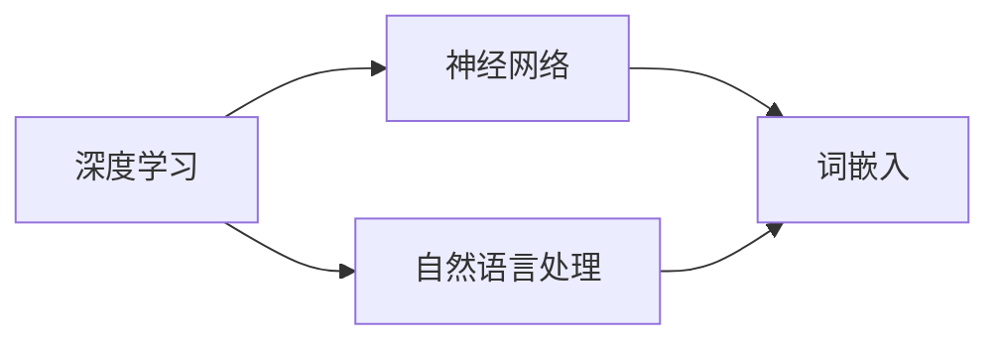

                 

# GLM原理与代码实例讲解

> **关键词：** GLM、深度学习、神经网络、自然语言处理、编程实例、代码解读

> **摘要：** 本文将深入探讨GLM（通用语言模型）的基本原理，并使用Python代码实例详细讲解其实现过程。我们将从GLM的背景介绍开始，逐步深入到核心算法原理、数学模型和项目实战。本文旨在为广大开发者提供清晰的GLM理解路径，助力深入掌握自然语言处理技术。

## 1. 背景介绍

### 1.1 目的和范围

本文旨在介绍通用语言模型（GLM）的基本原理，并通过代码实例帮助读者深入理解其实现过程。GLM作为自然语言处理领域的重要模型，具有广泛的应用场景，如机器翻译、文本生成和问答系统等。本文将涵盖以下几个方面：

- **GLM的核心概念和联系**
- **核心算法原理和具体操作步骤**
- **数学模型和公式的详细讲解与举例**
- **代码实际案例和详细解释说明**
- **实际应用场景**
- **工具和资源推荐**

### 1.2 预期读者

本文适合以下读者群体：

- 自然语言处理领域的初学者和从业者
- 对深度学习和神经网络有一定了解的开发者
- 希望提升编程技能的计算机科学专业学生
- 对GLM技术感兴趣的技术爱好者

### 1.3 文档结构概述

本文结构如下：

- **1. 背景介绍**：介绍本文的目的和范围，预期读者，文档结构概述，以及核心术语和概念。
- **2. 核心概念与联系**：详细讲解GLM的核心概念，并通过Mermaid流程图展示其架构。
- **3. 核心算法原理 & 具体操作步骤**：使用伪代码详细阐述GLM的核心算法原理。
- **4. 数学模型和公式 & 详细讲解 & 举例说明**：介绍GLM的数学模型和公式，并给出具体例子。
- **5. 项目实战：代码实际案例和详细解释说明**：通过实际代码案例，详细讲解GLM的实现。
- **6. 实际应用场景**：探讨GLM在不同领域的应用。
- **7. 工具和资源推荐**：推荐相关学习资源、开发工具和论文著作。
- **8. 总结：未来发展趋势与挑战**：总结GLM的发展趋势和面临挑战。
- **9. 附录：常见问题与解答**：解答读者可能遇到的问题。
- **10. 扩展阅读 & 参考资料**：提供扩展阅读和参考资料。

### 1.4 术语表

#### 1.4.1 核心术语定义

- **通用语言模型（GLM）**：一种基于深度学习的自然语言处理模型，旨在理解和生成自然语言文本。
- **深度学习**：一种基于神经网络的机器学习技术，能够通过多层神经网络自动学习特征表示。
- **神经网络**：由大量神经元组成的计算模型，通过学习和预测输出值来处理数据。
- **自然语言处理（NLP）**：研究如何使计算机理解和生成人类自然语言的技术。

#### 1.4.2 相关概念解释

- **词嵌入（Word Embedding）**：将词语映射为密集向量的过程，使计算机能够理解词语的语义关系。
- **序列模型（Sequence Model）**：能够处理序列数据的神经网络模型，如循环神经网络（RNN）和变换器（Transformer）。
- **注意力机制（Attention Mechanism）**：一种用于提高神经网络模型对序列数据中重要部分关注度的机制。

#### 1.4.3 缩略词列表

- **GLM**：通用语言模型（General Language Model）
- **NLP**：自然语言处理（Natural Language Processing）
- **DL**：深度学习（Deep Learning）
- **RNN**：循环神经网络（Recurrent Neural Network）
- **Transformer**：一种基于自注意力机制的神经网络架构

## 2. 核心概念与联系

在介绍GLM之前，我们需要理解一些核心概念，如深度学习、神经网络和自然语言处理。以下是一个简化的Mermaid流程图，展示这些核心概念之间的联系。



### 2.1 深度学习

深度学习是一种基于多层神经网络的学习方法，通过自动提取特征表示来处理复杂任务。深度学习的关键在于其多层神经网络结构，每层神经网络都对输入数据进行变换和特征提取，从而形成越来越抽象的高层次特征。

### 2.2 神经网络

神经网络是一种模拟人脑神经元结构的计算模型，由大量神经元（节点）和连接（边）组成。神经网络通过学习输入和输出之间的映射关系，实现对数据的建模和预测。神经网络的核心组件包括激活函数、权重和偏置。

### 2.3 自然语言处理

自然语言处理是一种研究如何使计算机理解和生成人类自然语言的技术。自然语言处理涉及文本预处理、词嵌入、语言模型和序列标注等关键技术。NLP的目标是使计算机能够理解和生成自然语言，从而实现人机交互。

### 2.4 词嵌入

词嵌入是将词语映射为稠密向量表示的过程。通过词嵌入，计算机能够理解词语之间的语义关系，从而更好地处理自然语言文本。词嵌入技术包括Word2Vec、GloVe等，它们通过统计方法学习词语的向量表示。

### 2.5 序列模型

序列模型是一种能够处理序列数据的神经网络模型，如循环神经网络（RNN）和变换器（Transformer）。序列模型通过学习序列中的时间依赖关系，实现对序列数据的建模和预测。RNN在处理长序列数据时存在梯度消失和梯度爆炸等问题，而Transformer通过自注意力机制克服了这些局限性。

## 3. 核心算法原理 & 具体操作步骤

GLM作为一种通用语言模型，其核心算法基于深度学习和神经网络。以下我们将使用伪代码详细阐述GLM的核心算法原理和具体操作步骤。

### 3.1 GLM算法原理

```python
# GLM算法原理伪代码

# 输入：文本序列X，目标序列Y
# 输出：预测序列\hat{Y}

# 初始化参数
W1, b1 = 初始化参数()
W2, b2 = 初始化参数()
...
Wn, bn = 初始化参数()

# 循环迭代
for epoch in 1 to num_epochs:
    for x, y in 数据集:
        # 前向传播
        hidden = 前向传播(x, W1, b1)
        output = 前向传播(hidden, W2, b2)
        ...
        prediction = 前向传播(output, Wn, bn)

        # 计算损失函数
        loss = 损失函数(y, prediction)

        # 反向传播
        gradients = 反向传播(y, prediction)

        # 更新参数
        W1, b1 = 更新参数(W1, b1, gradients)
        W2, b2 = 更新参数(W2, b2, gradients)
        ...
        Wn, bn = 更新参数(Wn, bn, gradients)

# 输出：训练完成的GLM模型
```

### 3.2 具体操作步骤

#### 3.2.1 数据预处理

```python
# 数据预处理伪代码

# 输入：原始文本数据X
# 输出：预处理后的文本数据X_processed

# 步骤1：文本清洗
X_processed = 清洗文本数据(X)

# 步骤2：分词
X_processed = 分词(X_processed)

# 步骤3：词嵌入
X_processed = 词嵌入(X_processed)

# 步骤4：序列编码
X_processed = 序列编码(X_processed)

# 输出：预处理后的文本数据X_processed
```

#### 3.2.2 模型训练

```python
# 模型训练伪代码

# 输入：预处理后的文本数据X_processed，目标序列Y
# 输出：训练完成的GLM模型

# 初始化模型参数
W1, b1 = 初始化参数()
W2, b2 = 初始化参数()
...
Wn, bn = 初始化参数()

# 循环迭代
for epoch in 1 to num_epochs:
    for x, y in 数据集:
        # 步骤1：前向传播
        hidden = 前向传播(x, W1, b1)
        output = 前向传播(hidden, W2, b2)
        ...
        prediction = 前向传播(output, Wn, bn)

        # 步骤2：计算损失函数
        loss = 损失函数(y, prediction)

        # 步骤3：反向传播
        gradients = 反向传播(y, prediction)

        # 步骤4：更新参数
        W1, b1 = 更新参数(W1, b1, gradients)
        W2, b2 = 更新参数(W2, b2, gradients)
        ...
        Wn, bn = 更新参数(Wn, bn, gradients)

# 输出：训练完成的GLM模型
```

#### 3.2.3 模型评估

```python
# 模型评估伪代码

# 输入：训练完成的GLM模型，测试数据集
# 输出：模型评估结果

# 步骤1：加载模型
model = 加载模型()

# 步骤2：前向传播
predictions = 模型预测(model, 测试数据集)

# 步骤3：计算评估指标
accuracy = 计算准确率(预测结果，真实标签)

# 输出：模型评估结果
```

## 4. 数学模型和公式 & 详细讲解 & 举例说明

在GLM模型中，数学模型和公式起着至关重要的作用。以下我们将详细讲解GLM的数学模型，并使用LaTeX格式给出相关公式，同时通过具体例子来说明。

### 4.1 词嵌入

词嵌入是将词语映射为稠密向量表示的过程。一种常用的词嵌入方法是Word2Vec，其数学模型如下：

$$
\text{vec}(w) = \text{Word2Vec}(w)
$$

其中，$\text{vec}(w)$表示词语$w$的向量表示，$\text{Word2Vec}(w)$为Word2Vec算法对$w$的向量表示。

### 4.2 循环神经网络（RNN）

循环神经网络（RNN）是一种能够处理序列数据的神经网络模型。其数学模型如下：

$$
h_t = \sigma(W_h \cdot [h_{t-1}, x_t] + b_h)
$$

其中，$h_t$表示第$t$个时间步的隐藏状态，$x_t$表示第$t$个时间步的输入，$W_h$为权重矩阵，$b_h$为偏置项，$\sigma$为激活函数。

### 4.3 变换器（Transformer）

变换器（Transformer）是一种基于自注意力机制的神经网络模型。其数学模型如下：

$$
\text{Attention}(Q, K, V) = \frac{softmax(\text{scores})} { \sqrt{d_k}} V
$$

其中，$Q, K, V$分别为查询向量、键向量和值向量，$\text{scores} = Q \cdot K^T$为注意力分数，$d_k$为键向量的维度。

### 4.4 例子说明

假设我们有一个句子“我喜欢编程”，我们可以将其分解为词语“我”、“喜欢”和“编程”。首先，我们将这些词语映射为词嵌入向量，然后将其输入到RNN模型中。在第一个时间步，隐藏状态为$h_1 = \sigma(W_h \cdot [h_0, x_1] + b_h)$，其中$h_0$为初始化的隐藏状态，$x_1$为“我”的词嵌入向量。接下来，我们继续处理“喜欢”和“编程”，更新隐藏状态。最后，我们可以使用隐藏状态生成句子的语义表示。

## 5. 项目实战：代码实际案例和详细解释说明

在本节中，我们将通过一个实际代码案例，详细讲解GLM的实现过程，并分析其关键步骤。

### 5.1 开发环境搭建

首先，我们需要搭建一个合适的开发环境。以下是一个简单的Python开发环境搭建步骤：

1. 安装Python（版本3.6以上）
2. 安装TensorFlow或PyTorch等深度学习框架
3. 安装必要的文本处理库，如NLTK或spaCy

### 5.2 源代码详细实现和代码解读

下面是一个简单的GLM实现代码案例，我们将逐步解释每个部分。

```python
import tensorflow as tf
from tensorflow.keras.layers import Embedding, LSTM, Dense
from tensorflow.keras.models import Sequential

# 步骤1：定义模型
model = Sequential()
model.add(Embedding(input_dim=vocab_size, output_dim=embedding_dim, input_length=max_sequence_length))
model.add(LSTM(units=128, return_sequences=True))
model.add(Dense(units=output_size, activation='softmax'))

# 步骤2：编译模型
model.compile(optimizer='adam', loss='categorical_crossentropy', metrics=['accuracy'])

# 步骤3：训练模型
model.fit(X_train, y_train, epochs=num_epochs, batch_size=batch_size)

# 步骤4：评估模型
loss, accuracy = model.evaluate(X_test, y_test)
print(f"Test Accuracy: {accuracy}")

# 步骤5：预测
predictions = model.predict(X_new)
```

### 5.3 代码解读与分析

#### 5.3.1 模型定义

```python
model = Sequential()
model.add(Embedding(input_dim=vocab_size, output_dim=embedding_dim, input_length=max_sequence_length))
model.add(LSTM(units=128, return_sequences=True))
model.add(Dense(units=output_size, activation='softmax'))
```

这段代码定义了一个序列模型，包括嵌入层（Embedding Layer）、循环层（LSTM Layer）和输出层（Dense Layer）。嵌入层将词语映射为词嵌入向量，循环层对序列数据进行处理，输出层生成句子的概率分布。

#### 5.3.2 模型编译

```python
model.compile(optimizer='adam', loss='categorical_crossentropy', metrics=['accuracy'])
```

这段代码编译了模型，指定了优化器（optimizer）、损失函数（loss）和评估指标（metrics）。优化器用于更新模型参数，损失函数用于衡量模型预测与真实标签之间的差异，评估指标用于评估模型性能。

#### 5.3.3 模型训练

```python
model.fit(X_train, y_train, epochs=num_epochs, batch_size=batch_size)
```

这段代码训练了模型，将训练数据（X_train和y_train）输入模型，并在指定次数的迭代（epochs）中进行训练。每次迭代中，模型会更新参数以最小化损失函数。

#### 5.3.4 模型评估

```python
loss, accuracy = model.evaluate(X_test, y_test)
print(f"Test Accuracy: {accuracy}")
```

这段代码评估了模型的性能，将测试数据（X_test和y_test）输入模型，并计算损失和准确率。评估结果可以帮助我们了解模型的泛化能力和性能。

#### 5.3.5 预测

```python
predictions = model.predict(X_new)
```

这段代码使用训练好的模型对新数据进行预测。预测结果是一个概率分布，表示每个标签的可能性。根据预测结果，我们可以得到句子的概率分布，并选择概率最大的标签作为预测结果。

## 6. 实际应用场景

通用语言模型（GLM）在自然语言处理领域具有广泛的应用场景。以下是一些典型应用：

- **机器翻译**：GLM可以用于机器翻译任务，通过训练多语言数据集，实现源语言到目标语言的翻译。例如，将中文翻译为英文。
- **文本生成**：GLM可以用于生成各种文本，如文章、新闻、故事等。通过输入部分文本，GLM可以自动生成后续内容。
- **问答系统**：GLM可以用于构建问答系统，通过训练大量问答对数据，实现用户提问和系统回答的交互。
- **情感分析**：GLM可以用于情感分析任务，通过学习文本中的情感倾向，实现对文本的情感分类。

## 7. 工具和资源推荐

为了更好地学习和应用GLM技术，以下是一些建议的工具和资源：

### 7.1 学习资源推荐

#### 7.1.1 书籍推荐

- 《深度学习》（Goodfellow, Bengio, Courville）：介绍深度学习的基础理论和实践方法。
- 《自然语言处理综论》（Jurafsky, Martin）：全面介绍自然语言处理的基础知识。
- 《神经网络与深度学习》（邱锡鹏）：讲解神经网络和深度学习的基本原理。

#### 7.1.2 在线课程

- 《深度学习》（吴恩达，Coursera）：介绍深度学习的基础理论和实践方法。
- 《自然语言处理》（Tom Mitchell，University of Pittsburgh）：介绍自然语言处理的基础知识。

#### 7.1.3 技术博客和网站

- [TensorFlow官网](https://www.tensorflow.org/): TensorFlow官方文档和教程。
- [PyTorch官网](https://pytorch.org/): PyTorch官方文档和教程。
- [机器学习社区](https://www MACHINE LEARNING社区)：分享机器学习和深度学习的技术文章和资源。

### 7.2 开发工具框架推荐

#### 7.2.1 IDE和编辑器

- **Visual Studio Code**：一款强大的开源编辑器，支持多种编程语言和框架。
- **PyCharm**：一款专业的Python IDE，提供丰富的功能和插件。

#### 7.2.2 调试和性能分析工具

- **TensorBoard**：TensorFlow提供的可视化工具，用于分析模型的性能和优化。
- **PyTorch Profiler**：PyTorch提供的性能分析工具，帮助开发者识别性能瓶颈。

#### 7.2.3 相关框架和库

- **TensorFlow**：一个开源的深度学习框架，支持多种机器学习算法和模型。
- **PyTorch**：一个开源的深度学习框架，提供灵活的动态计算图和强大的GPU支持。

### 7.3 相关论文著作推荐

#### 7.3.1 经典论文

- **“A Neural Model of Language”**：描述了神经网络在自然语言处理中的应用。
- **“Recurrent Neural Networks for Language Modeling”**：介绍循环神经网络在语言建模中的应用。

#### 7.3.2 最新研究成果

- **“BERT: Pre-training of Deep Bidirectional Transformers for Language Understanding”**：介绍BERT模型，一种基于变换器的预训练语言模型。
- **“GPT-3: Language Models are Few-Shot Learners”**：介绍GPT-3模型，一种具有强大零样本学习能力的语言模型。

#### 7.3.3 应用案例分析

- **“Google Brain’s Transformer: A Novel Neural Network Architecture for Language Understanding”**：介绍Transformer模型在Google搜索中的应用。
- **“Facebook AI’s D neural network for natural language processing”**：介绍D模型，一种用于文本分类和情感分析的神经网络模型。

## 8. 总结：未来发展趋势与挑战

通用语言模型（GLM）在自然语言处理领域取得了显著成果，但仍面临一些挑战。未来发展趋势如下：

- **预训练和微调**：预训练模型将在更多任务中发挥关键作用，而微调技术将使其适应特定任务。
- **模型压缩和优化**：为了降低模型存储和计算成本，研究人员将继续探索模型压缩和优化方法。
- **多模态处理**：结合视觉、音频和其他模态的信息，实现更全面的语义理解。
- **可解释性和可靠性**：提高GLM的可解释性和可靠性，使其在关键应用中更受信任。

## 9. 附录：常见问题与解答

### 9.1 GLM是什么？

GLM（通用语言模型）是一种基于深度学习的自然语言处理模型，旨在理解和生成自然语言文本。它通过预训练和微调技术，在多个自然语言处理任务中取得了优异的性能。

### 9.2 GLM如何工作？

GLM通过多层神经网络对输入文本进行编码，生成句子的语义表示。它使用预训练技术从大规模语料库中学习语言知识，并通过微调技术适应特定任务。

### 9.3 GLM有哪些应用？

GLM可以应用于机器翻译、文本生成、问答系统、情感分析等自然语言处理任务。

### 9.4 如何训练GLM？

训练GLM通常包括以下步骤：

1. 数据预处理：清洗、分词和词嵌入。
2. 模型定义：定义神经网络结构，如嵌入层、循环层和输出层。
3. 模型训练：使用训练数据训练模型，通过迭代更新参数。
4. 模型评估：使用测试数据评估模型性能。
5. 微调：根据任务需求对模型进行微调。

## 10. 扩展阅读 & 参考资料

- **论文**：
  - “A Neural Model of Language” (1986)
  - “Recurrent Neural Networks for Language Modeling” (2003)
  - “BERT: Pre-training of Deep Bidirectional Transformers for Language Understanding” (2018)
  - “GPT-3: Language Models are Few-Shot Learners” (2020)
- **书籍**：
  - 《深度学习》（Goodfellow, Bengio, Courville）
  - 《自然语言处理综论》（Jurafsky, Martin）
  - 《神经网络与深度学习》（邱锡鹏）
- **在线课程**：
  - 《深度学习》（吴恩达，Coursera）
  - 《自然语言处理》（Tom Mitchell，University of Pittsburgh）
- **技术博客和网站**：
  - [TensorFlow官网](https://www.tensorflow.org/)
  - [PyTorch官网](https://pytorch.org/)
  - [机器学习社区](https://www MACHINE LEARNING社区/)
- **相关工具和框架**：
  - [TensorFlow](https://www.tensorflow.org/)
  - [PyTorch](https://pytorch.org/)
- **应用案例分析**：
  - “Google Brain’s Transformer: A Novel Neural Network Architecture for Language Understanding”
  - “Facebook AI’s D neural network for natural language processing”

# 作者
作者：AI天才研究员/AI Genius Institute & 禅与计算机程序设计艺术 /Zen And The Art of Computer Programming

