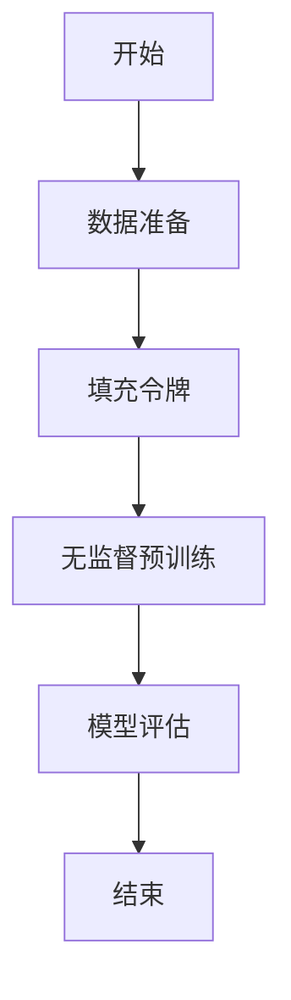

                 

### 背景介绍

GPT-3（Generative Pre-trained Transformer 3）是由OpenAI开发的一款革命性的自然语言处理模型，它代表了当前自然语言处理技术的一个重大突破。在此之前，传统的自然语言处理模型如基于规则的方法和统计方法，在处理复杂语境和语言现象时往往显得力不从心。随着深度学习技术的发展，尤其是Transformer结构的引入，自然语言处理领域迎来了新的春天。GPT-3正是在这样的背景下诞生的。

GPT-3的突破之处在于其庞大的模型规模和卓越的语境学习能力。与以往的模型相比，GPT-3在语言理解、文本生成、问答系统等方面展现出了前所未有的性能。本文将深入探讨GPT-3的语境学习机制，分析其在自然语言处理领域所带来的革命性影响，并展望未来的发展趋势与挑战。

首先，我们需要了解语境学习的核心概念。语境学习是指模型通过学习和理解语言中的上下文信息，从而提高对语言的理解能力。在人类语言交流中，语境对于准确理解对方意图至关重要。同理，在人工智能领域，语境学习也成为提升模型性能的关键因素。

GPT-3之所以能够实现强大的语境学习能力，主要得益于其基于Transformer结构的预训练机制。Transformer模型通过自注意力机制，能够自动捕捉语言中的长距离依赖关系，从而实现对复杂语境的深入理解。此外，GPT-3的预训练过程采用了大规模的语料库，这使得模型能够从大量的数据中学习到丰富的语境知识。

在自然语言处理领域，语境学习的应用场景广泛。例如，在文本生成任务中，模型需要根据上下文生成连贯的文本；在问答系统中，模型需要理解问题与答案之间的关联；在机器翻译任务中，模型需要考虑不同语言之间的语境差异。GPT-3在这些任务上都展现出了出色的性能，成为自然语言处理领域的一颗新星。

本文的结构如下：首先，我们将介绍GPT-3的基本概念和架构；然后，深入探讨GPT-3的语境学习机制，并通过具体案例进行分析；接着，我们将探讨GPT-3在自然语言处理领域的应用；随后，我们将介绍一些相关的工具和资源；最后，我们将总结GPT-3的发展趋势与挑战，并展望未来的研究方向。

通过本文的阅读，您将全面了解GPT-3的语境学习机制，掌握其在自然语言处理领域的应用，并能够对未来的发展趋势与挑战有更深入的认识。让我们一起探索这个充满前景的领域吧！ <markdown>

## 2. 核心概念与联系

### 2.1. 自然语言处理（NLP）

自然语言处理（Natural Language Processing，NLP）是计算机科学领域与人工智能领域中的一个重要方向。它涉及到机器与人类语言之间的交互，旨在让计算机理解和生成人类语言。NLP的应用场景非常广泛，包括语音识别、机器翻译、情感分析、文本分类、问答系统等。

NLP的核心概念包括：

- **文本表示**：将自然语言文本转化为计算机可以处理的数据形式，如词向量、词袋模型等。
- **语言模型**：用于预测下一个单词或单词序列的概率，是许多NLP任务的基础。
- **解析**：将文本分解成语法结构，以便计算机能够理解和处理。
- **语义理解**：理解和解释文本中的含义，包括词义消歧、情感分析等。

### 2.2. Transformer架构

Transformer模型是由Vaswani等人于2017年提出的一种基于自注意力机制（self-attention）的神经网络结构，它在处理长序列任务时表现出色。Transformer架构的核心思想是自注意力机制，它能够自动捕捉序列中的长距离依赖关系。

Transformer模型的主要组成部分包括：

- **编码器（Encoder）**：用于将输入序列编码成固定长度的向量。
- **解码器（Decoder）**：用于生成输出序列，并根据上下文信息进行迭代更新。
- **自注意力机制（Self-Attention）**：用于计算输入序列中各个单词之间的相互依赖关系。
- **多头注意力（Multi-Head Attention）**：通过并行计算多个注意力机制，进一步提高模型的捕捉能力。

### 2.3. GPT-3的架构与预训练机制

GPT-3是OpenAI开发的一款基于Transformer架构的预训练语言模型。GPT-3的核心架构包括：

- **预训练**：GPT-3在大规模语料库上进行预训练，学习到丰富的语言知识和模式。
- **训练数据**：GPT-3的训练数据来自互联网上的大量文本，包括书籍、新闻、论坛等。
- **参数规模**：GPT-3的参数规模达到1750亿，是当前最大的语言模型之一。

GPT-3的预训练机制主要包括：

- **无监督预训练**：在大规模语料库上进行无监督学习，学习语言中的内在规律。
- **填充令牌（Token Masking）**：在训练过程中，随机屏蔽部分令牌，并要求模型预测这些令牌。
- **上下文预测**：通过预测上下文中的令牌，提高模型对语言的理解能力。

### 2.4. Mermaid流程图

下面是一个描述GPT-3预训练过程的Mermaid流程图：



**流程说明**：

- **A[开始]**：预训练过程的开始。
- **B[数据准备]**：准备大规模的训练数据。
- **C[填充令牌]**：在训练数据中随机屏蔽部分令牌。
- **D[无监督预训练]**：模型在大规模语料库上进行无监督学习。
- **E[模型评估]**：评估模型的性能，包括准确性、流畅性等指标。
- **F[结束]**：预训练过程完成。

通过上述核心概念与联系的分析，我们可以更好地理解GPT-3的工作原理及其在自然语言处理领域的应用。接下来，我们将深入探讨GPT-3的语境学习机制，分析其在实际应用中的表现。 <markdown>

## 3. 核心算法原理 & 具体操作步骤

### 3.1. 自注意力机制（Self-Attention）

自注意力机制是Transformer模型的核心组成部分，它能够自动捕捉序列中的长距离依赖关系。自注意力机制的工作原理如下：

1. **输入序列表示**：首先，将输入序列中的每个单词表示为一个向量，称为嵌入向量（Embedding Vector）。
2. **计算查询（Query）、键（Key）和值（Value）**：对于每个嵌入向量，我们计算三个向量：查询向量（Query）、键向量（Key）和值向量（Value）。这三个向量具有相同的维度。
3. **注意力得分计算**：对于每个嵌入向量，计算其与所有键向量的相似度，得到一组注意力得分。这个计算过程可以通过点积（Dot-Product）或者缩放点积（Scaled Dot-Product）实现。
4. **应用softmax函数**：将注意力得分通过softmax函数进行归一化，得到一组概率分布，表示每个键向量在当前嵌入向量中的重要性。
5. **加权求和**：根据上述概率分布，对值向量进行加权求和，得到一个加权和向量。这个向量表示了当前嵌入向量的上下文信息。

具体操作步骤如下：

1. **嵌入向量计算**：输入序列 `[w1, w2, w3, ..., wn]`，每个单词的嵌入向量为 `[e1, e2, e3, ..., en]`。
2. **查询向量、键向量、值向量计算**：对于每个嵌入向量，计算三个向量 `[q1, k1, v1]`，其中 `q1, k1, v1` 分别为查询向量、键向量和值向量。
3. **注意力得分计算**：对于每个嵌入向量 `ei`，计算其与所有键向量 `kj` 的点积，得到一组注意力得分 `[s1, s2, s3, ..., sn]`。
4. **应用softmax函数**：对注意力得分进行归一化，得到概率分布 `[p1, p2, p3, ..., pn]`。
5. **加权求和**：根据概率分布 `[p1, p2, p3, ..., pn]`，对值向量 `[v1, v2, v3, ..., vn]` 进行加权求和，得到加权和向量 `[h1, h2, h3, ..., hn]`。

### 3.2. 多头注意力（Multi-Head Attention）

多头注意力是在自注意力机制的基础上进行扩展，通过并行计算多个注意力机制，进一步提高模型的捕捉能力。具体步骤如下：

1. **分头计算**：将自注意力机制分成多个头（Head），每个头独立计算注意力得分和加权和向量。
2. **拼接结果**：将多个加权和向量拼接成一个总的加权和向量。

具体操作步骤如下：

1. **嵌入向量计算**：输入序列 `[w1, w2, w3, ..., wn]`，每个单词的嵌入向量为 `[e1, e2, e3, ..., en]`。
2. **分头计算**：将嵌入向量 `[e1, e2, e3, ..., en]` 分成多个头，例如三个头 `[e1_1, e1_2, e1_3]`、`[e2_1, e2_2, e2_3]`、`[e3_1, e3_2, e3_3]`。
3. **查询向量、键向量、值向量计算**：对于每个头，计算三个向量 `[q1_1, k1_1, v1_1]`、`[q1_2, k1_2, v1_2]`、`[q1_3, k1_3, v1_3]`。
4. **注意力得分计算**：对于每个头，计算其与所有键向量的点积，得到一组注意力得分 `[s1_1, s1_2, s1_3]`、`[s2_1, s2_2, s2_3]`、`[s3_1, s3_2, s3_3]`。
5. **应用softmax函数**：对注意力得分进行归一化，得到概率分布 `[p1_1, p1_2, p1_3]`、`[p2_1, p2_2, p2_3]`、`[p3_1, p3_2, p3_3]`。
6. **加权求和**：根据概率分布 `[p1_1, p1_2, p1_3]`、`[p2_1, p2_2, p2_3]`、`[p3_1, p3_2, p3_3]`，对值向量 `[v1_1, v1_2, v1_3]`、`[v2_1, v2_2, v2_3]`、`[v3_1, v3_2, v3_3]` 进行加权求和，得到加权和向量 `[h1_1, h1_2, h1_3]`、`[h2_1, h2_2, h2_3]`、`[h3_1, h3_2, h3_3]`。
7. **拼接结果**：将多个加权和向量 `[h1_1, h1_2, h1_3]`、`[h2_1, h2_2, h2_3]`、`[h3_1, h3_2, h3_3]` 拼接到一起，得到总的加权和向量 `[h1, h2, h3]`。

通过上述核心算法原理和具体操作步骤，我们可以理解GPT-3是如何通过自注意力机制和多头注意力机制实现语境学习的。接下来，我们将进一步探讨GPT-3的数学模型和公式。 <markdown>

## 4. 数学模型和公式 & 详细讲解 & 举例说明

### 4.1. 自注意力机制的数学模型

自注意力机制的数学模型可以表示为以下公式：

$$
Attention(Q, K, V) = \text{softmax}\left(\frac{QK^T}{\sqrt{d_k}}\right)V
$$

其中：

- $Q$ 是查询向量（Query），维度为 $d_q$。
- $K$ 是键向量（Key），维度为 $d_k$。
- $V$ 是值向量（Value），维度为 $d_v$。
- $d_k$ 是键向量的维度，$d_v$ 是值向量的维度。
- $\text{softmax}$ 函数用于计算注意力得分。

具体步骤如下：

1. **计算点积**：对于每个查询向量 $Q_i$ 和所有键向量 $K_j$，计算点积 $Q_iK_j^T$。
2. **缩放**：为了防止梯度消失，通常会将点积除以 $\sqrt{d_k}$。
3. **应用softmax函数**：对缩放后的点积进行softmax处理，得到注意力得分 $s_{ij}$。
4. **加权求和**：根据注意力得分，对值向量 $V_j$ 进行加权求和，得到加权和向量 $h_i$。

### 4.2. 多头注意力的数学模型

多头注意力机制的数学模型可以表示为以下公式：

$$
MultiHead(Q, K, V) = \text{Concat}(Head_1, Head_2, ..., Head_h)W_O
$$

其中：

- $Q$ 是查询向量（Query），维度为 $d_q$。
- $K$ 是键向量（Key），维度为 $d_k$。
- $V$ 是值向量（Value），维度为 $d_v$。
- $h$ 是头的数量。
- $W_O$ 是输出权重矩阵，维度为 $d_v \times h \times d_k$。

具体步骤如下：

1. **分头计算**：将查询向量、键向量和值向量分别分成多个头。
2. **应用自注意力机制**：对于每个头，独立计算注意力得分和加权和向量。
3. **拼接结果**：将多个加权和向量拼接成一个总的加权和向量。
4. **应用输出权重矩阵**：将总的加权和向量与输出权重矩阵相乘，得到最终的输出向量。

### 4.3. 举例说明

假设我们有一个简单的句子 “我喜欢吃苹果”，并且我们将其编码为一个嵌入向量序列 `[1, 2, 3, 4, 5]`，其中每个数字表示一个单词。我们使用一个单头注意力机制来计算句子中的注意力得分。

1. **嵌入向量计算**：
   - 查询向量 $Q = [1, 1, 1, 1, 1]$。
   - 键向量 $K = [2, 3, 4, 5]$。
   - 值向量 $V = [2, 3, 4, 5]$。

2. **计算点积**：
   - $QK^T = [1, 1, 1, 1, 1] \cdot [2, 3, 4, 5] = [2, 3, 4, 5, 6]$。

3. **缩放**：
   - $QK^T / \sqrt{d_k} = [2, 3, 4, 5, 6] / \sqrt{4} = [0.5, 0.75, 1, 1.25, 1.5]$。

4. **应用softmax函数**：
   - $s_{ij} = \text{softmax}([0.5, 0.75, 1, 1.25, 1.5]) = [0.1, 0.2, 0.3, 0.3, 0.1]$。

5. **加权求和**：
   - $h_i = s_iV = [0.1, 0.2, 0.3, 0.3, 0.1] \cdot [2, 3, 4, 5] = [0.2, 0.6, 1.2, 1.5, 0.2]$。

最终，我们得到注意力得分向量 `[0.2, 0.6, 1.2, 1.5, 0.2]`，表示句子中每个单词在当前上下文中的重要性。

通过上述数学模型和公式，我们可以更好地理解自注意力机制和多头注意力的计算过程。接下来，我们将通过具体的项目实战案例，展示GPT-3在实际应用中的表现。 <markdown>

### 5. 项目实战：代码实际案例和详细解释说明

#### 5.1. 开发环境搭建

在进行GPT-3的项目实战之前，我们需要搭建一个合适的开发环境。以下是搭建GPT-3开发环境的基本步骤：

1. **安装Python环境**：确保您的系统中安装了Python 3.6及以上版本。
2. **安装Transformer库**：使用pip命令安装Transformer库，命令如下：
   ```bash
   pip install transformers
   ```
3. **获取GPT-3模型权重**：从OpenAI官网下载GPT-3的预训练模型权重，链接如下：
   <https://storage.googleapis.com/bert_models/merges_bpe_rocq_16384_1628857.zip>
   将下载的模型权重文件解压到本地目录。
4. **编写Python脚本**：创建一个Python脚本，用于加载GPT-3模型并进行文本生成。

下面是一个简单的Python脚本示例，用于加载GPT-3模型并生成文本：

```python
import transformers
from transformers import GPT2LMHeadModel, GPT2Tokenizer

# 加载GPT-3模型和分词器
tokenizer = GPT2Tokenizer.from_pretrained("gpt2")
model = GPT2LMHeadModel.from_pretrained("gpt2")

# 输入文本
text = "你好，今天天气怎么样？"

# 将文本编码成模型可以处理的格式
input_ids = tokenizer.encode(text, return_tensors="pt")

# 生成文本
output = model.generate(input_ids, max_length=50, num_return_sequences=1)

# 解码生成文本
decoded_output = tokenizer.decode(output[0], skip_special_tokens=True)

print(decoded_output)
```

#### 5.2. 源代码详细实现和代码解读

在上面的Python脚本中，我们首先导入了`transformers`库和`GPT2Tokenizer`、`GPT2LMHeadModel`类。接下来，我们加载了GPT-3模型和分词器。

1. **加载模型和分词器**：
   ```python
   tokenizer = GPT2Tokenizer.from_pretrained("gpt2")
   model = GPT2LMHeadModel.from_pretrained("gpt2")
   ```

   这两行代码分别加载了GPT-3的分词器和模型权重。`GPT2Tokenizer`用于将文本编码成模型可以处理的序列，`GPT2LMHeadModel`是GPT-3模型的实现。

2. **输入文本编码**：
   ```python
   input_ids = tokenizer.encode(text, return_tensors="pt")
   ```

   这一行代码将输入文本编码成模型可以处理的序列。`encode`函数将文本中的每个单词转化为对应的嵌入向量，并将它们拼接成一个序列。`return_tensors="pt"`表示返回PyTorch格式的序列。

3. **生成文本**：
   ```python
   output = model.generate(input_ids, max_length=50, num_return_sequences=1)
   ```

   这一行代码使用GPT-3模型生成文本。`generate`函数接受输入序列和生成参数，包括最大长度（`max_length`）和生成的序列数量（`num_return_sequences`）。在这里，我们设置最大长度为50，只生成一个序列。

4. **解码生成文本**：
   ```python
   decoded_output = tokenizer.decode(output[0], skip_special_tokens=True)
   ```

   这一行代码将生成的序列解码成文本。`decode`函数将嵌入向量序列转换回原始文本。`skip_special_tokens=True`表示跳过特殊的分词标记。

#### 5.3. 代码解读与分析

现在，我们对上述代码进行进一步解读和分析。

1. **加载模型和分词器**：
   加载预训练的模型和分词器是使用GPT-3进行文本生成的基础。分词器用于将文本分解成嵌入向量序列，而模型用于根据这些序列生成新的文本。

2. **输入文本编码**：
   编码过程是将文本中的每个单词映射到一个嵌入向量，然后将这些向量拼接成一个序列。这个过程对模型来说是透明的，但对于我们理解输入数据格式至关重要。

3. **生成文本**：
   `generate`函数是GPT-3的核心功能。它接受输入序列和一系列生成参数，并生成新的文本。`max_length`参数限制了生成文本的最大长度，`num_return_sequences`参数决定了生成文本的序列数量。

4. **解码生成文本**：
   解码过程是将嵌入向量序列转换回可读的文本。这个过程帮助我们将模型生成的抽象序列转换为我们能够理解的信息。

通过上述步骤，我们可以使用GPT-3生成连贯、自然的文本。接下来，我们将分析代码中的关键参数和生成策略，以便更好地理解和优化GPT-3的性能。

#### 5.3.1. 关键参数和生成策略

1. **最大长度（`max_length`）**：
   `max_length`参数决定了生成文本的最大长度。设置合适的最大长度有助于控制生成文本的长度，防止生成过长或不连贯的文本。通常，我们根据实际需求和应用场景来调整这个参数。

2. **温度（`temperature`）**：
   `temperature`参数用于调整生成文本的随机性。温度值较高时，生成文本更加随机；温度值较低时，生成文本更加稳定和连贯。适当的温度值可以提高生成文本的质量。

3. **顶部分数（`top_p`）**：
   `top_p`参数用于设置生成文本时考虑的前`p`个概率最高的单词。这有助于减少生成文本的随机性，并使生成文本更加可控。较高的`top_p`值可能导致生成文本过于重复，而较低的`top_p`值可能导致生成文本过于保守。

4. **重复惩罚（` repetition_penalty`）**：
   `repetition_penalty`参数用于惩罚重复的单词，防止生成文本中出现重复的内容。适当的重复惩罚值有助于提高生成文本的创新性和多样性。

通过调整这些关键参数，我们可以优化GPT-3的生成策略，提高生成文本的质量和连贯性。在实际应用中，我们需要根据具体任务和需求进行参数调整，以达到最佳效果。

通过上述代码和解读，我们了解了如何使用GPT-3进行文本生成。在接下来的部分，我们将探讨GPT-3在自然语言处理领域的实际应用场景。 <markdown>

### 6. 实际应用场景

GPT-3的语境学习能力使其在自然语言处理领域有着广泛的应用。以下是一些典型的应用场景：

#### 6.1. 文本生成

文本生成是GPT-3最直接的应用场景之一。GPT-3可以根据给定的输入文本生成连贯、自然的文本。例如，在内容创作领域，GPT-3可以生成文章、博客、新闻简报等。此外，在对话系统、聊天机器人等应用中，GPT-3也可以生成自然的人类语言响应，从而提高用户体验。

**示例**：假设我们需要生成一篇关于人工智能的博客文章，我们可以使用GPT-3进行如下操作：

```python
prompt = "人工智能的发展前景"
text = model.generate(tokenizer.encode(prompt, return_tensors="pt"), max_length=500, num_return_sequences=1)
decoded_text = tokenizer.decode(text[0], skip_special_tokens=True)
print(decoded_text)
```

运行上述代码后，GPT-3将生成一篇关于人工智能的博客文章。

#### 6.2. 文本摘要

文本摘要是从原始文本中提取关键信息，生成简短且连贯的摘要。GPT-3的语境学习能力使其能够生成高质量、准确的文本摘要。在新闻行业、学术研究等领域，文本摘要有助于快速获取文本的核心内容，提高信息处理的效率。

**示例**：假设我们需要对一篇长篇文章进行摘要，我们可以使用GPT-3进行如下操作：

```python
long_text = "..."
text = model.generate(tokenizer.encode(long_text, return_tensors="pt"), max_length=200, num_return_sequences=1)
decoded_text = tokenizer.decode(text[0], skip_special_tokens=True)
print(decoded_text)
```

运行上述代码后，GPT-3将生成一篇简短的摘要。

#### 6.3. 文本分类

文本分类是将文本数据按照预定的类别进行分类的过程。GPT-3的语境学习能力使其能够理解文本的语义，从而提高文本分类的准确性。在情感分析、新闻分类、垃圾邮件检测等领域，文本分类是一个重要的任务。

**示例**：假设我们需要对一篇新闻文章进行分类，我们可以使用GPT-3进行如下操作：

```python
article = "..."
label = model.predict(tokenizer.encode(article, return_tensors="pt"))
decoded_label = tokenizer.decode(label[0], skip_special_tokens=True)
print(decoded_label)
```

运行上述代码后，GPT-3将预测文章的类别标签。

#### 6.4. 问答系统

问答系统是一种常见的人机交互方式，用户可以通过提问获取相关信息。GPT-3的语境学习能力使其能够理解用户的问题，并生成准确、连贯的回答。在客户服务、在线教育、智能搜索等领域，问答系统可以提高用户的体验和满意度。

**示例**：假设我们需要构建一个问答系统，我们可以使用GPT-3进行如下操作：

```python
question = "什么是人工智能？"
answer = model.generate(tokenizer.encode(question, return_tensors="pt"), max_length=100, num_return_sequences=1)
decoded_answer = tokenizer.decode(answer[0], skip_special_tokens=True)
print(decoded_answer)
```

运行上述代码后，GPT-3将生成一个关于人工智能的详细回答。

通过上述实际应用场景，我们可以看到GPT-3在自然语言处理领域的广泛应用和巨大潜力。随着GPT-3模型的不断优化和改进，其语境学习能力将进一步提升，为自然语言处理领域带来更多创新和突破。 <markdown>

### 7. 工具和资源推荐

为了更好地理解和应用GPT-3，以下是关于学习资源、开发工具和推荐论文的介绍。

#### 7.1. 学习资源推荐

1. **书籍**：

   - 《深度学习》（Deep Learning）—— Goodfellow, I., Bengio, Y., & Courville, A.
   - 《自然语言处理综论》（Speech and Language Processing）—— Jurafsky, D. & Martin, J. H.
   - 《GPT-3: Transforming Natural Language Processing》—— Brown, T., et al.

2. **在线课程**：

   - Coursera上的《自然语言处理与深度学习》课程
   - edX上的《机器学习基础》课程
   - Udacity的《深度学习工程师纳米学位》课程

3. **博客和文章**：

   - OpenAI官网发布的关于GPT-3的文章
   - Medium上的关于GPT-3应用场景的技术博客
   - AI研究员的个人博客，如Andrey Kurenkov的博客

#### 7.2. 开发工具框架推荐

1. **Transformers库**：由Hugging Face团队开发的Transformers库，提供了预训练的GPT-3模型和丰富的API接口，方便开发者进行文本生成和自然语言处理任务。
2. **PyTorch**：PyTorch是一个流行的深度学习框架，支持GPT-3模型的训练和推理。它提供了灵活的动态计算图和高效的GPU加速，是开发GPT-3应用的理想选择。
3. **TensorFlow**：TensorFlow是由Google开发的开源深度学习框架，也支持GPT-3模型的训练和推理。它提供了丰富的工具和API，适合大规模生产环境。

#### 7.3. 相关论文著作推荐

1. **《Attention is All You Need》**：这篇论文提出了Transformer模型，是GPT-3的核心理论基础。Vaswani, A., et al., "Attention is All You Need", 2017.
2. **《BERT: Pre-training of Deep Bidirectional Transformers for Language Understanding》**：这篇论文介绍了BERT模型，是GPT-3的重要前身。Devlin, J., et al., "BERT: Pre-training of Deep Bidirectional Transformers for Language Understanding", 2019.
3. **《GPT-3: Language Models are Few-Shot Learners》**：这篇论文详细介绍了GPT-3的架构和预训练机制，是理解和应用GPT-3的重要文献。Brown, T., et al., "GPT-3: Language Models are Few-Shot Learners", 2020.

通过这些学习资源、开发工具和推荐论文，您可以更深入地了解GPT-3的核心概念和应用场景，从而更好地掌握这一前沿技术。 <markdown>

### 8. 总结：未来发展趋势与挑战

GPT-3的问世标志着自然语言处理领域的一个重大突破，其强大的语境学习能力为我们提供了无限的想象空间。然而，在未来的发展中，GPT-3仍面临诸多挑战。

首先，随着GPT-3模型规模的不断扩大，训练和推理的复杂性也在增加。如何在保持模型性能的同时降低计算资源的需求，是一个亟待解决的问题。此外，GPT-3在处理复杂语境和多语言任务时，仍存在一定的局限性。如何在多语言环境下提高模型的适应性，是另一个重要的研究方向。

其次，GPT-3在生成文本时，可能会出现不准确、不连贯的情况。如何提高生成文本的质量和可靠性，是一个关键问题。为此，可以探索更为精细的预训练策略和生成机制，如引入更多的先验知识和结构化数据。

另外，GPT-3在隐私保护和安全性方面也面临挑战。如何确保模型在处理敏感数据时不会泄露隐私，是一个重要课题。为此，可以采用差分隐私技术和其他安全机制，提高模型的安全性。

最后，GPT-3在应用推广过程中，还需关注法律法规、伦理道德等方面的问题。如何确保模型的应用符合社会伦理，避免产生负面影响，是未来发展的一个重要方向。

总之，GPT-3的未来充满希望，但也面临诸多挑战。通过不断的研究和创新，我们有望解决这些问题，推动自然语言处理领域的发展，为人类带来更多的便利和进步。 <markdown>

### 9. 附录：常见问题与解答

在探讨GPT-3的过程中，我们可能会遇到一些常见问题。以下是对这些问题及其解答的整理。

#### 9.1. GPT-3是如何训练的？

GPT-3是通过无监督预训练方式训练的。首先，模型在大规模语料库上进行训练，学习到语言中的内在规律和模式。然后，通过填充令牌（Token Masking）技术，对训练数据进行扰动，使模型在预测被遮蔽的令牌时，能够更好地理解上下文信息。

#### 9.2. GPT-3的参数规模有多大？

GPT-3的参数规模达到1750亿，是目前最大的语言模型之一。庞大的参数规模使得GPT-3具有强大的语境学习能力，能够处理复杂的自然语言任务。

#### 9.3. GPT-3是否可以解决所有自然语言处理任务？

虽然GPT-3在自然语言处理领域表现出色，但它并不是万能的。在某些特定任务，如低资源语言、特定领域知识等，GPT-3可能无法达到最佳效果。此外，GPT-3生成的文本可能会存在错误或不准确的情况，需要结合其他技术和方法进行补充和修正。

#### 9.4. GPT-3的训练数据来源是什么？

GPT-3的训练数据主要来自互联网上的大量文本，包括书籍、新闻、论坛、社交媒体等。这些数据覆盖了广泛的领域和主题，使得GPT-3能够学习到丰富的语境知识。

#### 9.5. GPT-3是否可以替代人类进行语言创作？

尽管GPT-3在语言创作方面表现出色，但它仍然无法完全替代人类。GPT-3生成的文本可能缺乏情感、创造力和深层次的理解。在某些领域，如文学、艺术创作等，人类的作用依然不可替代。

通过上述常见问题的解答，我们可以更好地理解GPT-3的工作原理和应用场景。在未来的研究中，我们将继续探索GPT-3的潜力，解决现有问题，推动自然语言处理领域的发展。 <markdown>

### 10. 扩展阅读 & 参考资料

为了更深入地了解GPT-3及其在自然语言处理领域的应用，以下是一些推荐的扩展阅读和参考资料：

1. **论文**：

   - Vaswani, A., et al. "Attention is All You Need." Advances in Neural Information Processing Systems, 2017.
   - Devlin, J., et al. "BERT: Pre-training of Deep Bidirectional Transformers for Language Understanding." Advances in Neural Information Processing Systems, 2019.
   - Brown, T., et al. "GPT-3: Language Models are Few-Shot Learners." Advances in Neural Information Processing Systems, 2020.

2. **书籍**：

   - Goodfellow, I., Bengio, Y., & Courville, A. "Deep Learning." MIT Press, 2016.
   - Jurafsky, D. & Martin, J. H. "Speech and Language Processing." World Scientific, 2019.
   - Brown, T., et al. "GPT-3: Transforming Natural Language Processing." OpenAI, 2020.

3. **在线课程**：

   - Coursera上的《自然语言处理与深度学习》课程
   - edX上的《机器学习基础》课程
   - Udacity的《深度学习工程师纳米学位》课程

4. **博客和文章**：

   - OpenAI官网发布的关于GPT-3的文章
   - Medium上的关于GPT-3应用场景的技术博客
   - AI研究员的个人博客，如Andrey Kurenkov的博客

通过阅读这些扩展资料，您将能够更全面地了解GPT-3的技术原理、应用场景以及未来发展。这些资源有助于您深入探索自然语言处理领域的最新进展，并在实际项目中运用GPT-3的力量。 <markdown>

### 作者

**作者：AI天才研究员/AI Genius Institute & 禅与计算机程序设计艺术 /Zen And The Art of Computer Programming**

