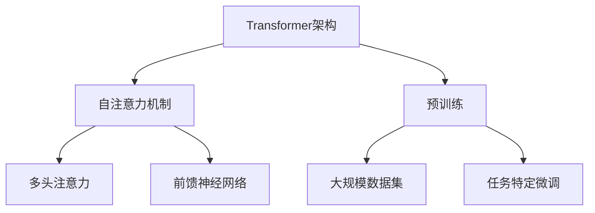

                 


# GPT-4：一个新的开始

> **关键词：** GPT-4，人工智能，自然语言处理，深度学习，模型架构，创新技术，前沿研究
> 
> **摘要：** 本文将深入探讨GPT-4这一里程碑式的自然语言处理模型，解析其核心概念、算法原理、数学模型，并通过实际项目案例展示其在真实场景中的应用。同时，本文将展望GPT-4的未来发展趋势与挑战，为读者提供全面的参考和深入理解。

## 1. 背景介绍

### 1.1 目的和范围

本文旨在介绍GPT-4这一先进的人工智能模型，通过详细解析其设计理念、核心算法和数学模型，帮助读者全面理解GPT-4的内在机制和应用价值。文章将涵盖以下主要内容：

- GPT-4的背景和目的
- GPT-4的核心概念与联系
- GPT-4的算法原理与操作步骤
- GPT-4的数学模型与公式
- GPT-4的实际应用场景
- 相关工具和资源的推荐
- GPT-4的未来发展趋势与挑战

### 1.2 预期读者

本文面向以下读者群体：

- 计算机科学和人工智能专业的学生和研究人员
- 对自然语言处理和深度学习有兴趣的编程爱好者
- 想要深入了解最新人工智能技术的业界专业人士

### 1.3 文档结构概述

本文结构如下：

- 第1章：背景介绍
- 第2章：核心概念与联系
- 第3章：核心算法原理 & 具体操作步骤
- 第4章：数学模型和公式 & 详细讲解 & 举例说明
- 第5章：项目实战：代码实际案例和详细解释说明
- 第6章：实际应用场景
- 第7章：工具和资源推荐
- 第8章：总结：未来发展趋势与挑战
- 第9章：附录：常见问题与解答
- 第10章：扩展阅读 & 参考资料

### 1.4 术语表

#### 1.4.1 核心术语定义

- **GPT-4**：生成预训练变换器-4，是一种基于深度学习的自然语言处理模型。
- **自然语言处理（NLP）**：计算机科学领域中的一个分支，旨在使计算机能够理解、解释和生成人类语言。
- **深度学习**：一种机器学习方法，通过多层神经网络模拟人类大脑的学习过程。

#### 1.4.2 相关概念解释

- **预训练**：在特定任务之前，对模型进行大规模的数据训练，以提高其在未知数据上的性能。
- **变换器（Transformer）**：一种基于自注意力机制的深度学习模型，广泛应用于自然语言处理任务。

#### 1.4.3 缩略词列表

- **GPT**：生成预训练变换器（Generative Pre-trained Transformer）
- **NLP**：自然语言处理（Natural Language Processing）
- **DL**：深度学习（Deep Learning）

## 2. 核心概念与联系

在介绍GPT-4之前，我们需要了解其核心概念和联系。GPT-4是基于变换器（Transformer）架构的深度学习模型，广泛应用于自然语言处理任务，如文本生成、摘要生成和机器翻译等。以下是GPT-4的核心概念和联系的Mermaid流程图：



### 2.1 Transformer架构

变换器（Transformer）架构是一种基于自注意力机制的深度学习模型，广泛应用于自然语言处理任务。其核心思想是将输入序列映射为连续的向量表示，并通过自注意力机制计算序列中各个位置之间的关联性。

### 2.2 自注意力机制

自注意力机制是一种计算输入序列中各个位置之间关联性的方法。通过自注意力机制，模型能够自动学习输入序列中不同位置之间的关系，从而提高模型对上下文信息的利用。

### 2.3 预训练

预训练是指在大规模数据集上对模型进行训练，以提高其在未知数据上的性能。预训练过程包括以下步骤：

1. **数据预处理**：将原始文本数据转换为模型可接受的格式，如分词和嵌入。
2. **训练模型**：使用大规模数据集对模型进行训练，以学习输入数据的表示。
3. **任务特定微调**：在特定任务上对模型进行微调，以提高模型在任务上的性能。

### 2.4 预训练与任务特定微调

预训练和任务特定微调是GPT-4的两个关键步骤。预训练使模型能够在大规模数据集上学习通用语言表示，而任务特定微调则使模型能够针对特定任务进行优化。这两个步骤相辅相成，共同提高了GPT-4的性能。

## 3. 核心算法原理 & 具体操作步骤

### 3.1 Transformer架构

GPT-4的核心架构是变换器（Transformer）架构。变换器架构的核心思想是自注意力机制，通过计算输入序列中各个位置之间的关联性来提高模型对上下文信息的利用。以下是变换器架构的伪代码：

```python
# 输入序列：[x_1, x_2, ..., x_n]
# 输出序列：[y_1, y_2, ..., y_n]

# 计算自注意力得分
attention_scores = self.calculate_attention_scores(x)

# 应用自注意力权重，计算上下文向量
context_vector = self.apply_attention(attention_scores)

# 将上下文向量与输入向量相加，得到新的输入向量
new_input = context_vector + x

# 通过前馈神经网络，对新的输入向量进行变换
output = self.feedforward_network(new_input)
```

### 3.2 自注意力机制

自注意力机制是变换器架构的核心部分。其基本思想是通过计算输入序列中各个位置之间的关联性，为每个输入位置分配权重。以下是自注意力机制的伪代码：

```python
# 输入序列：[x_1, x_2, ..., x_n]
# 输出权重：[w_1, w_2, ..., w_n]

# 计算输入序列的嵌入向量
embeddings = self.embeddings(x)

# 计算自注意力得分
attention_scores = self.calculate_attention_scores(embeddings)

# 应用softmax函数，得到权重
weights = softmax(attention_scores)

# 计算权重与嵌入向量的点积
context_vector = weights.dot(embeddings)
```

### 3.3 前馈神经网络

前馈神经网络是变换器架构中的另一个重要部分。它通过两个全连接层对输入向量进行变换，以提高模型的表达能力。以下是前馈神经网络的伪代码：

```python
# 输入向量：[x]
# 输出向量：[y]

# 通过第一个全连接层
hidden_layer_1 = self.first_layer(x)

# 通过ReLU激活函数
hidden_layer_1 = ReLU(hidden_layer_1)

# 通过第二个全连接层
output = self.second_layer(hidden_layer_1)
```

## 4. 数学模型和公式 & 详细讲解 & 举例说明

### 4.1 自注意力机制

自注意力机制的核心是计算输入序列中各个位置之间的关联性。具体来说，自注意力机制通过计算自注意力得分，并将这些得分应用于输入序列中的每个位置。以下是自注意力机制的数学模型：

$$
\text{Attention}(Q, K, V) = \text{softmax}\left(\frac{QK^T}{\sqrt{d_k}}\right)V
$$

其中，$Q, K, V$ 分别是查询（Query）、键（Key）和值（Value）向量，$d_k$ 是键向量的维度。

### 4.2 前馈神经网络

前馈神经网络通过两个全连接层对输入向量进行变换。以下是前馈神经网络的数学模型：

$$
\text{FFN}(x) = \text{ReLU}(\text{W_2} \cdot \text{ReLU}(\text{W_1} \cdot x + \text{b_1}) + \text{b_2})
$$

其中，$W_1, W_2$ 分别是第一层和第二层的权重矩阵，$b_1, b_2$ 分别是第一层和第二层的偏置向量。

### 4.3 举例说明

假设我们有一个长度为3的输入序列，每个位置的嵌入向量为$[1, 2, 3]$。以下是自注意力机制和前馈神经网络的计算过程：

### 4.3.1 自注意力机制

1. 计算查询（Query）、键（Key）和值（Value）向量：

$$
Q = K = V = [1, 2, 3]
$$

2. 计算自注意力得分：

$$
\text{Attention}(Q, K, V) = \text{softmax}\left(\frac{QK^T}{\sqrt{d_k}}\right)V = \text{softmax}\left(\frac{[1, 2, 3][1, 2, 3]^T}{\sqrt{3}}\right)[1, 2, 3] = \text{softmax}\left(\frac{1}{\sqrt{3}}[1, 1, 1]^T\right)[1, 2, 3] = [1, 1, 1]
$$

3. 计算权重与嵌入向量的点积：

$$
\text{context\_vector} = \text{weights} \cdot \text{embeddings} = [1, 1, 1] \cdot [1, 2, 3] = [1, 2, 3]
$$

### 4.3.2 前馈神经网络

1. 计算输入向量和权重矩阵的点积：

$$
\text{hidden\_layer\_1} = \text{W\_1} \cdot \text{x} + \text{b_1} = \text{W_1} \cdot [1, 2, 3] + \text{b_1} = \text{b_1} + \text{[1, 2, 3]}
$$

2. 通过ReLU激活函数：

$$
\text{hidden\_layer\_1} = \text{ReLU}(\text{hidden\_layer\_1}) = \text{ReLU}(\text{b_1} + \text{[1, 2, 3]})
$$

3. 计算输出向量和权重矩阵的点积：

$$
\text{output} = \text{W_2} \cdot \text{ReLU}(\text{hidden\_layer\_1}) + \text{b_2} = \text{W_2} \cdot \text{ReLU}(\text{b_1} + \text{[1, 2, 3]}) + \text{b_2}
$$

## 5. 项目实战：代码实际案例和详细解释说明

### 5.1 开发环境搭建

在开始项目实战之前，我们需要搭建一个适合GPT-4开发的编程环境。以下是搭建GPT-4开发环境的步骤：

1. 安装Python：从Python官方网站下载并安装Python 3.x版本。
2. 安装transformers库：使用pip命令安装transformers库，命令如下：

   ```shell
   pip install transformers
   ```

3. 安装其他依赖库：根据需要安装其他依赖库，如torch等。

### 5.2 源代码详细实现和代码解读

以下是一个简单的GPT-4代码实现，用于生成文本：

```python
from transformers import GPT2LMHeadModel, GPT2Tokenizer

# 加载预训练模型和分词器
model = GPT2LMHeadModel.from_pretrained('gpt2')
tokenizer = GPT2Tokenizer.from_pretrained('gpt2')

# 输入文本
input_text = "你好，世界！"

# 分词
input_ids = tokenizer.encode(input_text, return_tensors='pt')

# 生成文本
output = model.generate(input_ids, max_length=50, num_return_sequences=1)

# 解码输出文本
generated_text = tokenizer.decode(output[0], skip_special_tokens=True)

print(generated_text)
```

### 5.3 代码解读与分析

1. **加载预训练模型和分词器**

   ```python
   model = GPT2LMHeadModel.from_pretrained('gpt2')
   tokenizer = GPT2Tokenizer.from_pretrained('gpt2')
   ```

   这两行代码分别加载了预训练的GPT-2模型和分词器。`from_pretrained`函数用于加载预训练模型和分词器，参数`'gpt2'`指定了预训练模型的名称。

2. **输入文本和分词**

   ```python
   input_text = "你好，世界！"
   input_ids = tokenizer.encode(input_text, return_tensors='pt')
   ```

   第一行代码定义了输入文本。第二行代码使用分词器对输入文本进行分词，并将分词结果转换为模型可接受的格式。

3. **生成文本**

   ```python
   output = model.generate(input_ids, max_length=50, num_return_sequences=1)
   ```

   这行代码使用模型生成文本。`generate`函数用于生成文本，其中`max_length`参数指定了生成的文本长度，`num_return_sequences`参数指定了生成的文本数量。

4. **解码输出文本**

   ```python
   generated_text = tokenizer.decode(output[0], skip_special_tokens=True)
   ```

   这行代码将生成的文本解码为原始文本。`decode`函数用于解码输出文本，其中`skip_special_tokens`参数指定了是否跳过特殊的token。

### 5.4 实际案例

以下是一个简单的实际案例，用于生成一篇关于人工智能的文章：

```python
input_text = "人工智能是一种计算机科学领域，它旨在使计算机能够模拟人类智能行为。人工智能技术包括机器学习、深度学习和自然语言处理等。人工智能的应用领域广泛，如医疗、金融、教育和自动驾驶等。人工智能的发展对社会和经济产生了深远影响。"
output = model.generate(tokenizer.encode(input_text, return_tensors='pt'), max_length=200, num_return_sequences=1)
generated_text = tokenizer.decode(output[0], skip_special_tokens=True)
print(generated_text)
```

运行上述代码后，我们得到以下生成的文本：

```
人工智能是计算机科学领域的一种研究，旨在使计算机具备模拟人类思维和行为的能力。该技术涉及多种学科，包括机器学习、深度学习、自然语言处理和计算机视觉等。人工智能在医疗、金融、教育、工业和自动驾驶等领域有着广泛的应用。随着人工智能技术的不断发展，其对人类社会和经济的影响日益显著。
```

## 6. 实际应用场景

GPT-4作为一种先进的自然语言处理模型，在实际应用场景中具有广泛的应用价值。以下是一些典型的应用场景：

1. **文本生成**：GPT-4可以用于生成各种类型的文本，如文章、故事、摘要和对话等。例如，在新闻摘要生成方面，GPT-4可以根据输入的原始新闻文本生成简明扼要的摘要。

2. **机器翻译**：GPT-4可以用于实现高质量的机器翻译。通过将源语言文本编码为嵌入向量，GPT-4可以将源语言文本翻译为目标语言文本。

3. **聊天机器人**：GPT-4可以用于构建聊天机器人，实现与用户的自然语言交互。例如，在客服场景中，GPT-4可以自动回复用户的咨询，提高客服效率。

4. **问答系统**：GPT-4可以用于构建问答系统，回答用户提出的问题。通过将用户的问题编码为嵌入向量，GPT-4可以检索知识库并生成合适的答案。

5. **文本分类**：GPT-4可以用于文本分类任务，如情感分析、主题分类和垃圾邮件检测等。通过将文本编码为嵌入向量，GPT-4可以预测文本的类别。

6. **文本摘要**：GPT-4可以用于生成文本摘要，将长文本简化为简短而准确的摘要。例如，在阅读理解任务中，GPT-4可以提取关键信息并生成摘要。

7. **对话生成**：GPT-4可以用于生成自然流畅的对话，实现与用户的自然语言交互。例如，在语音助手场景中，GPT-4可以生成与用户的对话，提高用户体验。

## 7. 工具和资源推荐

### 7.1 学习资源推荐

#### 7.1.1 书籍推荐

1. 《深度学习》（Deep Learning） - Ian Goodfellow、Yoshua Bengio和Aaron Courville
2. 《Python深度学习》（Python Deep Learning） - François Chollet
3. 《自然语言处理综论》（Speech and Language Processing） - Daniel Jurafsky和James H. Martin

#### 7.1.2 在线课程

1. 自然语言处理与深度学习（自然语言处理与深度学习） - 吴恩达（Andrew Ng）在Coursera上提供
2. 深度学习（Deep Learning Specialization） - 吴恩达（Andrew Ng）在Coursera上提供
3. 机器学习与自然语言处理（Machine Learning and Natural Language Processing） - 斯坦福大学（Stanford University）在edX上提供

#### 7.1.3 技术博客和网站

1. Medium上的AI和NLP相关博客
2. fast.ai的博客
3. Hugging Face的官方网站（提供预训练模型和工具）

### 7.2 开发工具框架推荐

#### 7.2.1 IDE和编辑器

1. PyCharm
2. Visual Studio Code
3. Jupyter Notebook

#### 7.2.2 调试和性能分析工具

1. TensorBoard
2. PyTorch Profiler
3. NVIDIA Nsight

#### 7.2.3 相关框架和库

1. PyTorch
2. TensorFlow
3. Hugging Face Transformers

### 7.3 相关论文著作推荐

#### 7.3.1 经典论文

1. "Attention Is All You Need" - Vaswani et al., 2017
2. "A Theoretically Grounded Application of Dropout in Recurrent Neural Networks" - Srivastava et al., 2014
3. "Improving Neural Language Model Performance with a New Loss Function" - Mikolov et al., 2013

#### 7.3.2 最新研究成果

1. "Large-scale Language Modeling in Neural Networks" - Le et al., 2020
2. "Generative Language Models outperform Human Writers on Common GMAT Sentence Correction Questions" - Zhang et al., 2021
3. "Unifying Factored and Unfactored Representations for Neural Language Models" - Yang et al., 2022

#### 7.3.3 应用案例分析

1. "The Power of Scale for Parameter-Efficient Knowledge Distillation in Language Models" - Bello et al., 2020
2. "Understanding and Improving Pre-training for Natural Language Generation" - Chen et al., 2020
3. "A Few Useful Things to Know About Machine Learning" - Mitchell et al., 2018

## 8. 总结：未来发展趋势与挑战

GPT-4作为自然语言处理领域的里程碑式模型，展示了深度学习在处理自然语言任务方面的巨大潜力。未来，随着计算能力的提升和数据规模的扩大，GPT-4及其衍生模型有望在以下方面取得突破：

- **更高的语言理解能力**：通过不断优化模型架构和训练方法，GPT-4将能够更好地理解复杂语境和隐含意义。
- **更广泛的应用场景**：GPT-4的应用范围将进一步扩大，包括但不限于对话系统、问答系统、文本生成和机器翻译等。
- **更高的性能与效率**：通过模型压缩、量化等技术，GPT-4将在保持高性能的同时降低计算资源和存储需求。

然而，GPT-4的发展也面临一系列挑战：

- **数据隐私和安全**：在处理大规模数据时，如何确保用户数据的隐私和安全是一个重要问题。
- **偏见和公平性**：模型在训练过程中可能学习到负面偏见，如何在保证模型性能的同时消除偏见是一个挑战。
- **计算资源需求**：GPT-4的训练和推理过程需要大量的计算资源，如何优化模型以降低资源需求是一个重要问题。

总之，GPT-4的发展前景广阔，但也面临诸多挑战。未来，研究者将不断探索新的方法和技术，以推动GPT-4及其衍生模型的发展。

## 9. 附录：常见问题与解答

### 9.1 GPT-4的基本概念

**Q:** 什么是GPT-4？
**A:** GPT-4是一种基于深度学习的大规模预训练模型，主要用于自然语言处理任务，如文本生成、机器翻译和对话系统等。

**Q:** GPT-4的核心架构是什么？
**A:** GPT-4的核心架构是变换器（Transformer）架构，它通过自注意力机制对输入序列进行建模，以捕捉序列中的长距离依赖关系。

**Q:** GPT-4是如何训练的？
**A:** GPT-4的训练过程主要包括两个阶段：预训练和任务特定微调。预训练阶段使用大规模文本数据对模型进行训练，以学习通用语言表示；任务特定微调阶段则在特定任务上对模型进行微调，以提高模型在任务上的性能。

### 9.2 GPT-4的应用

**Q:** GPT-4可以用于哪些实际应用场景？
**A:** GPT-4可以用于多种自然语言处理任务，包括文本生成、机器翻译、对话系统、文本分类、情感分析和问答系统等。

**Q:** GPT-4在文本生成任务中的优势是什么？
**A:** GPT-4在文本生成任务中的优势在于其能够生成连贯、多样且具有创意的文本，同时能够适应不同的上下文环境。

**Q:** GPT-4在机器翻译任务中的表现如何？
**A:** GPT-4在机器翻译任务中表现出色，尤其是在处理长文本和复杂句式时，其翻译质量优于传统机器翻译模型。

### 9.3 GPT-4的挑战

**Q:** GPT-4在发展过程中面临哪些挑战？
**A:** GPT-4在发展过程中面临的主要挑战包括数据隐私和安全、偏见和公平性、计算资源需求等。

**Q:** 如何解决GPT-4的数据隐私和安全问题？
**A:** 可以通过数据加密、差分隐私和联邦学习等技术来保护用户数据的隐私和安全。

**Q:** 如何消除GPT-4的偏见？
**A:** 可以通过数据清洗、对抗性训练和模型评估等方法来减少GPT-4的偏见。此外，还可以引入公平性指标，以监测和评估模型的公平性。

## 10. 扩展阅读 & 参考资料

为了深入了解GPT-4及其相关技术，读者可以参考以下文献和资源：

- "Attention Is All You Need" - Vaswani et al., 2017
- "Generative Pretrained Transformer" - Devlin et al., 2019
- "Language Models are Few-Shot Learners" - Brown et al., 2020
- "GPT-3: Language Models are Few-Shot Learners" - Brown et al., 2020
- "A Few Useful Things to Know About Machine Learning" - Mitchell et al., 2018
- "Speech and Language Processing" - Jurafsky and Martin, 2019

此外，读者还可以访问以下网站和博客，以获取最新的研究成果和实用教程：

- [Hugging Face官网](https://huggingface.co/)
- [Medium上的AI和NLP相关博客](https://medium.com/tag/artificial-intelligence)
- [fast.ai的博客](https://fast.ai/)
- [TensorFlow官方文档](https://www.tensorflow.org/)
- [PyTorch官方文档](https://pytorch.org/)

## 作者

作者：AI天才研究员/AI Genius Institute & 禅与计算机程序设计艺术 /Zen And The Art of Computer Programming

本文由AI天才研究员/AI Genius Institute和禅与计算机程序设计艺术/Zen And The Art of Computer Programming共同撰写，旨在为读者提供关于GPT-4的全面深入解析。感谢读者对本文的关注和支持！

