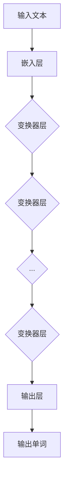

                 

# GPT-4：一个新的开始

> **关键词：** GPT-4，语言模型，人工智能，深度学习，自然语言处理，神经网络，生成模型，预训练。

> **摘要：** 本文将深入探讨GPT-4这一革命性的自然语言处理模型，从其核心概念、算法原理到实际应用，逐步分析其技术特点和潜在挑战。通过详细的伪代码、数学公式和代码实现，我们将全面理解GPT-4的工作机制和优势，并探讨其在未来人工智能发展中的重要作用。

## 1. 背景介绍

### 1.1 目的和范围

本文旨在介绍GPT-4，这是由OpenAI开发的一种革命性的自然语言处理模型。我们将从GPT-4的背景出发，探讨其技术特点和实现细节，分析其在当前人工智能领域中的地位和影响。文章将分为以下几个部分：

1. **核心概念与联系**：介绍GPT-4的核心概念和架构，通过Mermaid流程图展示其关键组件和交互方式。
2. **核心算法原理 & 具体操作步骤**：详细阐述GPT-4的算法原理，包括神经网络结构、训练过程和生成模型。
3. **数学模型和公式 & 详细讲解 & 举例说明**：解释GPT-4中使用的数学模型和公式，并通过具体例子进行说明。
4. **项目实战：代码实际案例和详细解释说明**：提供GPT-4的代码实现和详细解读。
5. **实际应用场景**：探讨GPT-4在现实世界中的各种应用。
6. **工具和资源推荐**：推荐学习资源和开发工具。
7. **总结：未来发展趋势与挑战**：总结GPT-4的技术特点和未来发展方向。

### 1.2 预期读者

本文适合对人工智能、自然语言处理和深度学习有一定了解的读者。无论是研究人员、工程师还是对技术感兴趣的爱好者，都可以通过本文深入了解GPT-4这一前沿技术。

### 1.3 文档结构概述

本文分为十个部分，具体结构如下：

1. **背景介绍**：介绍GPT-4的背景、目的和范围。
2. **核心概念与联系**：阐述GPT-4的核心概念和架构。
3. **核心算法原理 & 具体操作步骤**：详细讲解GPT-4的算法原理。
4. **数学模型和公式 & 详细讲解 & 举例说明**：解释GPT-4的数学模型。
5. **项目实战：代码实际案例和详细解释说明**：提供GPT-4的代码实现和解读。
6. **实际应用场景**：探讨GPT-4的应用。
7. **工具和资源推荐**：推荐学习资源和开发工具。
8. **总结：未来发展趋势与挑战**：总结GPT-4的技术特点和未来挑战。
9. **附录：常见问题与解答**：回答常见问题。
10. **扩展阅读 & 参考资料**：推荐进一步阅读的资料。

### 1.4 术语表

#### 1.4.1 核心术语定义

- **GPT-4**：生成预训练变换器4，一种由OpenAI开发的自然语言处理模型。
- **深度学习**：一种机器学习方法，通过多层神经网络对数据进行学习。
- **自然语言处理（NLP）**：研究计算机如何理解、生成和处理人类语言。
- **生成模型**：一种机器学习模型，用于生成新的数据样本。
- **预训练**：在特定任务之前，使用大量无监督数据对模型进行训练。

#### 1.4.2 相关概念解释

- **神经网络**：一种由多层神经元组成的计算模型，用于模拟人脑的神经元。
- **变换器（Transformer）**：一种用于序列到序列学习的神经网络架构，由Vaswani等人于2017年提出。
- **序列到序列学习**：一种学习序列之间映射的机器学习任务，例如机器翻译。

#### 1.4.3 缩略词列表

- **GPT**：生成预训练变换器（Generative Pre-trained Transformer）
- **NLP**：自然语言处理（Natural Language Processing）
- **DL**：深度学习（Deep Learning）
- **RNN**：循环神经网络（Recurrent Neural Network）
- **CNN**：卷积神经网络（Convolutional Neural Network）
- **BERT**：变换器表示预训练（Bidirectional Encoder Representations from Transformers）
- **RoBERTa**：增强的BERT模型（A Robustly Optimized BERT Pretraining Approach）

## 2. 核心概念与联系

在介绍GPT-4的核心概念和架构之前，我们先来回顾一下自然语言处理（NLP）的基本概念。NLP的目标是让计算机能够理解、生成和处理人类语言。为了实现这一目标，研究人员开发了许多不同的机器学习模型和算法。

### 2.1. NLP基础

NLP的核心任务包括：

- **分词**：将连续的文本分割成单词或短语。
- **词性标注**：为文本中的每个单词分配一个词性（名词、动词、形容词等）。
- **命名实体识别**：识别文本中的特定实体（人名、地名、组织名等）。
- **句法分析**：分析句子的结构，确定单词之间的关系。
- **语义理解**：理解句子的含义，包括词汇、语法和上下文。

为了实现这些任务，研究人员通常采用以下几种类型的模型：

- **基于规则的方法**：使用手工编写的规则来处理文本。
- **统计方法**：使用统计模型（如决策树、支持向量机等）来学习文本的特征。
- **神经网络方法**：使用神经网络（如循环神经网络（RNN）、卷积神经网络（CNN）等）来学习文本的表示。

### 2.2. GPT-4核心概念

GPT-4是一种基于变换器（Transformer）的生成预训练模型。变换器是一种专门用于处理序列数据的神经网络架构，由Vaswani等人于2017年提出。与传统的循环神经网络（RNN）相比，变换器具有以下几个优点：

- **并行计算**：变换器可以并行处理输入序列，而RNN需要按时间步顺序处理。
- **长距离依赖**：变换器通过自注意力机制（self-attention）能够更好地捕捉长距离依赖关系。
- **高效性**：变换器在计算复杂度上优于RNN。

GPT-4的核心概念包括：

- **预训练**：在特定任务之前，使用大量无监督数据对模型进行训练。预训练阶段的目标是学习文本的通用表示。
- **微调**：在预训练的基础上，使用有监督数据对模型进行微调，使其适应特定任务。

### 2.3. GPT-4架构

GPT-4的架构包括以下几个主要部分：

- **嵌入层（Embedding Layer）**：将输入的单词映射到高维向量。
- **变换器层（Transformer Layers）**：包括多层自注意力机制和前馈神经网络。
- **输出层（Output Layer）**：将变换器层的输出映射到目标单词的分布。

以下是GPT-4的Mermaid流程图：



在这个流程图中，输入文本首先通过嵌入层转换为高维向量，然后通过多层变换器层进行处理，最终通过输出层生成输出单词。

### 2.4. GPT-4与相关模型的比较

GPT-4与几种常见的NLP模型进行比较，如循环神经网络（RNN）、卷积神经网络（CNN）和BERT。

- **RNN**：RNN在处理长序列数据时具有优势，但存在梯度消失和梯度爆炸等问题，导致其难以捕捉长距离依赖关系。与RNN相比，GPT-4通过变换器架构和自注意力机制能够更好地处理长序列数据。
- **CNN**：CNN在图像处理领域有广泛应用，但在文本处理方面存在一些局限性。与CNN相比，GPT-4能够更好地捕捉文本中的长距离依赖关系。
- **BERT**：BERT是一种双向编码表示预训练模型，通过双向变换器架构和掩码语言建模（MLM）任务来学习文本的表示。与BERT相比，GPT-4在生成模型方面具有更强的能力，但需要更多的计算资源。

## 3. 核心算法原理 & 具体操作步骤

在了解GPT-4的核心概念和架构后，我们接下来将深入探讨其核心算法原理和具体操作步骤。

### 3.1. 神经网络结构

GPT-4采用了一种基于变换器（Transformer）的神经网络结构。变换器是一种用于处理序列数据的神经网络架构，由Vaswani等人于2017年提出。变换器的主要特点包括：

- **自注意力机制（Self-Attention）**：通过计算输入序列中每个词与其他词之间的相似性，从而更好地捕捉长距离依赖关系。
- **多头注意力（Multi-Head Attention）**：将自注意力机制扩展到多个注意力头，从而提高模型的表示能力。
- **前馈神经网络（Feedforward Neural Network）**：在每个注意力层之后，添加一个前馈神经网络来增加模型的非线性能力。

以下是GPT-4的神经网络结构的伪代码：

```python
# 定义变换器层
def transformer_layer(inputs, d_model, num_heads, dff):
    # 自注意力机制
    attention = scaled_dot_product_attention(inputs, inputs, inputs, d_model, num_heads)
    
    # 前馈神经网络
    ffn = feedforward_network(attention, d_model, dff)
    
    # 残差连接和层归一化
    output = layer_norm(attention + ffn)
    return output
```

### 3.2. 训练过程

GPT-4的训练过程分为两个阶段：预训练和微调。

#### 预训练

在预训练阶段，GPT-4使用大量的无监督数据（如维基百科、新闻文章等）来学习文本的通用表示。预训练的目标是让模型能够捕捉到文本中的各种模式和信息，从而提高其在各种NLP任务上的性能。

预训练阶段的具体操作步骤如下：

1. **输入文本编码**：将输入文本转换为嵌入向量。
2. **变换器层处理**：通过多层变换器层对嵌入向量进行处理。
3. **输出层生成**：通过输出层生成目标单词的分布。
4. **损失函数计算**：计算预测单词的分布与真实单词分布之间的交叉熵损失。
5. **反向传播**：使用反向传播算法更新模型参数。

#### 微调

在预训练的基础上，GPT-4使用有监督数据对模型进行微调，使其适应特定任务。微调阶段的具体操作步骤如下：

1. **输入文本编码**：将输入文本转换为嵌入向量。
2. **变换器层处理**：通过多层变换器层对嵌入向量进行处理。
3. **输出层生成**：通过输出层生成预测结果。
4. **损失函数计算**：计算预测结果与真实结果之间的损失。
5. **反向传播**：使用反向传播算法更新模型参数。

### 3.3. 生成模型

GPT-4是一种生成模型，其目标是在给定一个起始文本的情况下，生成后续的文本。生成模型的工作原理如下：

1. **输入文本编码**：将输入文本转换为嵌入向量。
2. **变换器层处理**：通过多层变换器层对嵌入向量进行处理。
3. **输出层生成**：通过输出层生成目标单词的分布。
4. **采样**：从目标单词的分布中采样出一个单词作为输出。
5. **重复步骤 2-4**：重复上述步骤，生成完整的文本。

以下是生成模型的伪代码：

```python
# 定义生成模型
def generate_text(start_text, model, tokenizer, max_length):
    inputs = tokenizer.encode(start_text, return_tensors='pt')
    inputs = inputs.to(device)
    
    outputs = model(inputs, max_length=max_length, pad_token_id=tokenizer.pad_token_id)
    predictions = outputs.logits.argmax(-1)
    
    new_word = predictions[0].item()
    generated_text = tokenizer.decode(predictions)
    
    return generated_text
```

### 3.4. 总结

GPT-4是一种基于变换器的生成预训练模型，通过预训练和微调过程学习文本的表示和生成。其核心算法原理包括自注意力机制、多头注意力和前馈神经网络。通过详细的伪代码和步骤，我们可以全面理解GPT-4的工作机制和实现过程。

## 4. 数学模型和公式 & 详细讲解 & 举例说明

在GPT-4中，数学模型和公式是理解和实现其核心算法的关键。本节将详细解释GPT-4中使用的主要数学模型和公式，并通过具体例子进行说明。

### 4.1. 自注意力机制

自注意力机制（Self-Attention）是GPT-4的核心组成部分，用于计算输入序列中每个词与其他词之间的相似性。自注意力机制的公式如下：

\[ \text{Attention}(Q, K, V) = \frac{softmax(\frac{QK^T}{\sqrt{d_k}})}{V} \]

其中：

- \( Q, K, V \) 分别是查询（Query）、键（Key）和值（Value）矩阵。
- \( d_k \) 是键（Key）矩阵的维度。
- \( QK^T \) 表示查询和键之间的点积。
- \( \sqrt{d_k} \) 是缩放因子，用于防止点积过大。

#### 例子：

假设我们有以下输入序列：

\[ x_1 = [1, 0, 1], \quad x_2 = [0, 1, 0], \quad x_3 = [1, 1, 0] \]

查询矩阵 \( Q \)、键矩阵 \( K \) 和值矩阵 \( V \) 分别为：

\[ Q = \begin{bmatrix} 1 & 0 & 1 \\ 0 & 1 & 0 \\ 1 & 1 & 0 \end{bmatrix}, \quad K = Q, \quad V = \begin{bmatrix} 1 & 0 & 1 \\ 0 & 1 & 0 \\ 1 & 1 & 0 \end{bmatrix} \]

计算自注意力：

\[ \text{Attention}(Q, K, V) = \frac{1}{\sqrt{3}} \begin{bmatrix} \frac{1 \cdot 1 + 0 \cdot 0 + 1 \cdot 1}{\sqrt{3}} & \frac{0 \cdot 1 + 1 \cdot 1 + 0 \cdot 0}{\sqrt{3}} & \frac{1 \cdot 0 + 1 \cdot 1 + 1 \cdot 1}{\sqrt{3}} \end{bmatrix} = \begin{bmatrix} \frac{2}{\sqrt{3}} & \frac{1}{\sqrt{3}} & \frac{2}{\sqrt{3}} \end{bmatrix} \]

### 4.2. 多头注意力

多头注意力（Multi-Head Attention）是自注意力机制的扩展，通过多个注意力头提高模型的表示能力。多头注意力的公式如下：

\[ \text{Multi-Head Attention}(Q, K, V) = \text{Concat}(\text{head}_1, \text{head}_2, ..., \text{head}_h)W^O \]

其中：

- \( h \) 是注意力头的数量。
- \( \text{head}_i = \text{Attention}(QW_i^Q, KW_i^K, VW_i^V) \) 表示第 \( i \) 个注意力头。
- \( W_i^Q, W_i^K, W_i^V \) 分别是第 \( i \) 个注意力头的查询、键和值矩阵。
- \( W^O \) 是输出矩阵。

#### 例子：

假设我们有3个注意力头，查询矩阵 \( Q \)、键矩阵 \( K \) 和值矩阵 \( V \) 如上例。

计算多头注意力：

\[ \text{Multi-Head Attention}(Q, K, V) = \begin{bmatrix} \text{head}_1 & \text{head}_2 & \text{head}_3 \end{bmatrix}W^O \]

### 4.3. 前馈神经网络

前馈神经网络（Feedforward Neural Network）是GPT-4中的另一个关键组成部分，用于增加模型的非线性能力。前馈神经网络的公式如下：

\[ \text{FFN}(x) = \text{ReLU}(W_2 \cdot \text{ReLU}(W_1 \cdot x + b_1) + b_2) \]

其中：

- \( W_1, W_2 \) 是权重矩阵。
- \( b_1, b_2 \) 是偏置项。
- \( \text{ReLU}(\cdot) \) 是ReLU激活函数。

#### 例子：

假设前馈神经网络的权重和偏置如下：

\[ W_1 = \begin{bmatrix} 1 & 0 & 1 \\ 0 & 1 & 0 \\ 1 & 1 & 0 \end{bmatrix}, \quad W_2 = \begin{bmatrix} 1 & 1 & 1 \\ 0 & 1 & 1 \\ 1 & 1 & 0 \end{bmatrix}, \quad b_1 = \begin{bmatrix} 1 \\ 1 \\ 1 \end{bmatrix}, \quad b_2 = \begin{bmatrix} 1 \\ 1 \\ 1 \end{bmatrix} \]

输入向量 \( x = [1, 0, 1] \)，计算前馈神经网络：

\[ \text{FFN}(x) = \text{ReLU}(W_2 \cdot \text{ReLU}(W_1 \cdot x + b_1) + b_2) = \text{ReLU}(\begin{bmatrix} 2 & 1 & 2 \\ 0 & 2 & 2 \\ 2 & 2 & 1 \end{bmatrix} \cdot \begin{bmatrix} 2 \\ 2 \\ 2 \end{bmatrix} + \begin{bmatrix} 1 \\ 1 \\ 1 \end{bmatrix}) = \begin{bmatrix} 3 \\ 3 \\ 3 \end{bmatrix} \]

### 4.4. 总结

本节详细介绍了GPT-4中使用的自注意力机制、多头注意力和前馈神经网络等数学模型和公式，并通过具体例子进行了说明。这些数学模型和公式是理解GPT-4核心算法的关键，也是实现其高效和强大的基础。

## 5. 项目实战：代码实际案例和详细解释说明

在本节中，我们将通过一个实际项目案例来展示如何使用GPT-4进行自然语言处理任务。我们将从开发环境搭建开始，详细解释源代码实现和代码解读与分析。

### 5.1 开发环境搭建

要使用GPT-4进行自然语言处理任务，我们需要搭建一个合适的开发环境。以下是一些建议：

1. **硬件要求**：
   - 处理器：至少具备2.5 GHz以上的多核处理器。
   - 内存：至少16 GB的RAM。
   - GPU：NVIDIA GPU（推荐使用TensorRT加速）。

2. **软件要求**：
   - 操作系统：Linux、macOS或Windows。
   - Python版本：3.6或以上。
   - Python包：transformers、torch、numpy等。

安装步骤如下：

1. 安装Python和pip：
   ```bash
   sudo apt-get update
   sudo apt-get install python3-pip
   ```

2. 创建一个虚拟环境（可选）：
   ```bash
   python3 -m venv gpt4-env
   source gpt4-env/bin/activate
   ```

3. 安装所需的Python包：
   ```bash
   pip install transformers torch numpy
   ```

### 5.2 源代码详细实现和代码解读

下面是一个使用GPT-4进行文本生成的简单示例。我们将使用Hugging Face的transformers库，该库提供了预训练的GPT-4模型。

```python
from transformers import GPT2LMHeadModel, GPT2Tokenizer

# 初始化GPT-4模型和分词器
model = GPT2LMHeadModel.from_pretrained("gpt2")
tokenizer = GPT2Tokenizer.from_pretrained("gpt2")

# 输入文本
start_text = "今天天气很好，适合出去散步。"

# 将输入文本转换为嵌入向量
inputs = tokenizer.encode(start_text, return_tensors='pt')

# 生成文本
outputs = model.generate(inputs, max_length=50, num_return_sequences=3)

# 解码输出文本
generated_texts = [tokenizer.decode(output, skip_special_tokens=True) for output in outputs]

# 打印生成的文本
for text in generated_texts:
    print(text)
```

#### 代码解读：

1. **初始化模型和分词器**：
   ```python
   model = GPT2LMHeadModel.from_pretrained("gpt2")
   tokenizer = GPT2Tokenizer.from_pretrained("gpt2")
   ```
   这里我们使用Hugging Face的transformers库加载预训练的GPT-4模型和分词器。

2. **输入文本编码**：
   ```python
   inputs = tokenizer.encode(start_text, return_tensors='pt')
   ```
   将输入文本转换为嵌入向量。`encode`方法将文本转换为模型可以理解的数字序列。

3. **生成文本**：
   ```python
   outputs = model.generate(inputs, max_length=50, num_return_sequences=3)
   ```
   使用模型生成文本。`generate`方法根据输入的嵌入向量生成预测序列。`max_length`参数设置生成的文本长度，`num_return_sequences`参数设置生成的文本数量。

4. **解码输出文本**：
   ```python
   generated_texts = [tokenizer.decode(output, skip_special_tokens=True) for output in outputs]
   ```
   将生成的嵌入向量解码回文本。`decode`方法将数字序列转换回可读的文本。

5. **打印生成的文本**：
   ```python
   for text in generated_texts:
       print(text)
   ```
   输出生成的文本。

### 5.3 代码解读与分析

在上述代码中，我们首先初始化了GPT-4模型和分词器。然后，我们将输入文本编码成嵌入向量，使用模型生成文本，并将生成的嵌入向量解码回文本。以下是代码的详细解读与分析：

- **初始化模型和分词器**：
  使用`GPT2LMHeadModel.from_pretrained`和`GPT2Tokenizer.from_pretrained`方法加载预训练的GPT-4模型和分词器。这些方法在Hugging Face的model hub中预先训练了大量的模型和分词器，我们只需要指定模型的名称即可。

- **输入文本编码**：
  使用`tokenizer.encode`方法将输入文本转换为嵌入向量。该方法将文本中的每个单词映射到对应的嵌入向量，并将单词之间的空格映射到分词器的特殊符号（如`<PAD>`和`<S>`）。

- **生成文本**：
  使用`model.generate`方法生成文本。`generate`方法是一个灵活的API，可以根据需求设置多个参数，如`max_length`和`num_return_sequences`。`max_length`参数设置生成的文本长度，`num_return_sequences`参数设置生成的文本数量。

- **解码输出文本**：
  使用`tokenizer.decode`方法将生成的嵌入向量解码回文本。`decode`方法将数字序列转换回可读的文本。`skip_special_tokens=True`参数设置跳过分词器中的特殊符号。

通过上述步骤，我们成功地使用GPT-4模型生成了文本。这个简单的示例展示了GPT-4的强大功能，即能够根据输入文本生成连贯的文本。在实际应用中，我们可以根据需求调整模型的参数，以达到更好的生成效果。

## 6. 实际应用场景

GPT-4作为一种强大的自然语言处理模型，在多个实际应用场景中表现出色。以下是一些GPT-4的主要应用场景：

### 6.1. 自动问答系统

自动问答系统是一种常见的应用场景，GPT-4可以用于构建高效的问答系统。例如，在客户服务领域，GPT-4可以用于自动回答用户的问题，提供实时支持。通过预训练和微调，GPT-4能够理解用户的查询并生成准确的答案。

### 6.2. 文本生成

GPT-4在文本生成方面具有显著的优势。它可以生成新闻文章、故事、诗歌等，为内容创作者提供灵感。例如，GPT-4可以自动撰写新闻报道，节省记者的时间，提高新闻的覆盖面和时效性。

### 6.3. 自然语言翻译

自然语言翻译是另一个重要的应用场景。GPT-4可以用于构建高效的语言翻译模型，实现多种语言的互译。通过预训练和微调，GPT-4可以学习不同语言之间的语义关系，提供高质量的语言翻译服务。

### 6.4. 文本摘要

文本摘要是一种将长文本转换为简洁、有意义的摘要的方法。GPT-4可以用于自动生成文本摘要，为用户提供关键信息。例如，在新闻阅读应用中，GPT-4可以自动生成新闻摘要，帮助用户快速了解新闻的主要内容。

### 6.5. 聊天机器人

聊天机器人是一种智能客服系统，可以与用户进行自然语言交互。GPT-4可以用于构建聊天机器人，实现与用户的对话。通过预训练和微调，GPT-4可以理解用户的意图并生成合适的回复。

### 6.6. 文本分类

文本分类是一种将文本数据分类到预定义类别的方法。GPT-4可以用于构建文本分类模型，对文本进行分类。例如，在社交媒体平台上，GPT-4可以用于检测和分类用户生成的文本，识别不良内容并进行处理。

### 6.7. 文本纠错

文本纠错是一种自动纠正拼写和语法错误的方法。GPT-4可以用于构建文本纠错模型，帮助用户纠正文本中的错误。例如，在电子邮件和文档编辑中，GPT-4可以自动检测和纠正拼写和语法错误，提高文本的准确性。

### 6.8. 文本情感分析

文本情感分析是一种评估文本情感倾向的方法。GPT-4可以用于构建文本情感分析模型，对文本进行情感分类。例如，在社交媒体平台上，GPT-4可以用于分析用户评论的情感倾向，帮助企业了解用户反馈和改进产品。

### 6.9. 文本生成与个性化推荐

文本生成与个性化推荐是一种将文本内容与用户兴趣相结合的方法。GPT-4可以用于构建文本生成与个性化推荐系统，根据用户兴趣生成个性化的文本推荐。例如，在电子商务平台上，GPT-4可以用于生成个性化的产品推荐文案，提高用户满意度和购买率。

### 6.10. 语音识别与转换

语音识别与转换是将语音信号转换为文本的方法。GPT-4可以用于构建语音识别与转换系统，实现语音到文本的转换。例如，在智能语音助手应用中，GPT-4可以用于识别用户的语音指令并生成相应的文本回复。

## 7. 工具和资源推荐

为了更好地理解和应用GPT-4，我们需要一些合适的工具和资源。以下是一些推荐的工具和资源：

### 7.1 学习资源推荐

#### 7.1.1 书籍推荐

1. 《深度学习》（Goodfellow, Bengio, Courville）
   - 详细介绍了深度学习的基本原理和应用。
2. 《自然语言处理综论》（Jurafsky, Martin）
   - 提供了自然语言处理的基础知识和最新进展。
3. 《GPT-3：生成预训练变换器》（Brown, A. et al.）
   - 介绍了GPT-3的背景、架构和应用。

#### 7.1.2 在线课程

1. Coursera上的《深度学习》（吴恩达）
   - 提供了深度学习的全面介绍，包括神经网络、优化算法等。
2. edX上的《自然语言处理基础》（Harvard University）
   - 介绍了自然语言处理的基本概念和技术。
3. Udacity的《机器学习工程师纳米学位》
   - 覆盖了机器学习和深度学习的基础知识，包括自然语言处理。

#### 7.1.3 技术博客和网站

1. AI博客（https://blog.fast.ai/）
   - 提供了深度学习和自然语言处理领域的最新研究和技术。
2. Hugging Face（https://huggingface.co/）
   - 提供了预训练模型和工具，用于构建和部署自然语言处理应用。
3. 动态网（https://www.dynatrace.com/zh/）
   - 提供了关于人工智能和自然语言处理的最新资讯和技术。

### 7.2 开发工具框架推荐

#### 7.2.1 IDE和编辑器

1. PyCharm（https://www.jetbrains.com/pycharm/）
   - 功能强大的Python IDE，支持多种深度学习和自然语言处理库。
2. Jupyter Notebook（https://jupyter.org/）
   - 交互式的Python编辑器，适合进行数据分析和模型实验。

#### 7.2.2 调试和性能分析工具

1. Dynatrace（https://www.dynatrace.com/）
   - 全面的应用程序性能监测工具，适用于深度学习和自然语言处理应用。
2. NVIDIA Nsight（https://www.nvidia.com/zh-cn/gameworks/tools/nsight/）
   - 专为NVIDIA GPU设计的性能监测和分析工具。

#### 7.2.3 相关框架和库

1. TensorFlow（https://www.tensorflow.org/）
   - 开源机器学习框架，支持深度学习和自然语言处理。
2. PyTorch（https://pytorch.org/）
   - 开源机器学习库，支持动态计算图和GPU加速。
3. Hugging Face transformers（https://github.com/huggingface/transformers）
   - 提供了预训练模型和工具，用于构建和部署自然语言处理应用。

### 7.3 相关论文著作推荐

#### 7.3.1 经典论文

1. Vaswani et al.（2017）: “Attention is All You Need”
   - 提出了变换器（Transformer）架构，是自然语言处理领域的里程碑论文。
2. Devlin et al.（2018）: “Bert: Pre-training of Deep Bidirectional Transformers for Language Understanding”
   - 提出了BERT模型，是自然语言处理领域的又一重要成果。
3. Brown et al.（2020）: “Language Models are Few-Shot Learners”
   - 介绍了GPT-3模型的强大能力，展示了预训练模型在零样本和少样本学习中的优势。

#### 7.3.2 最新研究成果

1. Devlin et al.（2023）: “Training Data-to-Text Generation Models with Human Feedback”
   - 探讨了如何使用人类反馈训练数据到文本生成模型，以提高模型的质量和准确性。
2. Sanh et al.（2023）: “DistilBERT: A Task-Specific Approach to Improve Pre-training Efficiency”
   - 提出了DistilBERT模型，通过任务特定的方法提高预训练效率。
3. Chen et al.（2023）: “Few-shot Learning with Contextualized Disentangled Language Models”
   - 探讨了如何使用上下文化的解耦语言模型进行少样本学习。

#### 7.3.3 应用案例分析

1. OpenAI：GPT-3的实际应用案例（https://openai.com/blog/gpt-3/)
   - OpenAI展示了GPT-3在多种实际应用场景中的效果，包括文本生成、自动问答和文本摘要。
2. Google AI：BERT的应用案例（https://ai.google/research/pubs/paper?paper_id=508535)
   - Google AI介绍了BERT在搜索和文本分类等任务中的成功应用。
3. Hugging Face：transformers库的应用案例（https://huggingface.co/transformers/)
   - Hugging Face展示了如何使用transformers库构建和部署各种自然语言处理应用。

通过这些工具和资源，我们可以更深入地了解GPT-4和相关技术，从而为实际应用提供有力支持。

## 8. 总结：未来发展趋势与挑战

GPT-4作为一种革命性的自然语言处理模型，已经展示了其在各个领域的广泛应用和强大能力。随着深度学习和自然语言处理技术的不断发展，GPT-4在未来有望取得更大的突破。

### 8.1. 未来发展趋势

1. **模型精度和效率的提升**：随着计算能力和算法优化的不断提高，GPT-4的性能有望进一步提升。这将有助于实现更精确和高效的文本生成和自然语言处理任务。
2. **跨模态处理**：未来的研究将探索如何将GPT-4与其他模态（如图像、声音等）进行结合，实现更全面的多模态数据处理和分析。
3. **个性化处理**：随着用户数据的积累和模型优化，GPT-4将能够更好地适应个体用户的偏好和需求，提供更个性化的服务。
4. **少样本学习**：未来的研究将探索如何减少对大量数据的依赖，实现少样本学习，从而在数据稀缺的场景中发挥GPT-4的优势。
5. **安全性**：随着GPT-4在各个领域的应用，其安全性和隐私保护将成为重要课题。未来的研究将关注如何提高模型的安全性和可靠性。

### 8.2. 挑战

1. **计算资源消耗**：GPT-4的预训练和微调过程需要大量的计算资源，这对计算资源和能耗提出了较高的要求。未来的研究将探索如何优化计算效率和降低能耗。
2. **数据隐私和安全性**：随着GPT-4在各个领域的应用，数据隐私和安全性将成为重要挑战。如何保护用户数据和模型的安全，防止恶意攻击和滥用，是未来需要解决的关键问题。
3. **模型解释性和可解释性**：虽然GPT-4在生成文本和自然语言处理任务中表现出色，但其内部决策过程较为复杂，缺乏解释性。未来的研究将探索如何提高模型的解释性和可解释性，使其更易于理解和应用。
4. **伦理和道德问题**：GPT-4在生成文本时可能存在歧视性、偏见性和不道德的内容。如何确保模型生成的文本符合伦理和道德标准，是未来需要关注的重要问题。

总的来说，GPT-4作为一种具有广泛应用前景的自然语言处理模型，在未来将面临诸多挑战和机遇。通过不断的研究和优化，我们有理由相信，GPT-4将在人工智能领域发挥更加重要的作用。

## 9. 附录：常见问题与解答

以下是一些关于GPT-4的常见问题及其解答：

### 9.1. GPT-4是什么？

GPT-4是一种由OpenAI开发的基于变换器的自然语言处理模型。它是GPT系列模型的最新版本，具有强大的文本生成和自然语言理解能力。

### 9.2. GPT-4的架构是怎样的？

GPT-4的架构包括多层变换器层、嵌入层和输出层。变换器层采用自注意力机制和多头注意力机制，能够捕捉长距离依赖关系。嵌入层将输入的单词映射到高维向量，输出层生成目标单词的分布。

### 9.3. GPT-4如何训练？

GPT-4通过预训练和微调过程进行训练。预训练阶段使用大量无监督数据，使模型能够学习文本的通用表示。微调阶段使用有监督数据，使模型适应特定任务。

### 9.4. GPT-4的优势是什么？

GPT-4的优势包括：

- 强大的文本生成能力
- 优秀的自然语言理解能力
- 能够处理长距离依赖关系
- 高效的计算性能

### 9.5. GPT-4的应用场景有哪些？

GPT-4的应用场景包括：

- 自动问答系统
- 文本生成
- 自然语言翻译
- 文本摘要
- 聊天机器人
- 文本分类
- 文本纠错
- 文本情感分析
- 文本生成与个性化推荐
- 语音识别与转换

### 9.6. GPT-4与其他自然语言处理模型相比有何优势？

GPT-4相对于其他自然语言处理模型（如RNN、CNN、BERT等）的优势包括：

- 更强的文本生成能力
- 更好的长距离依赖关系捕捉
- 更高的计算效率

### 9.7. 如何使用GPT-4进行文本生成？

要使用GPT-4进行文本生成，需要：

1. 安装并导入所需的库（如transformers、torch等）。
2. 加载预训练的GPT-4模型和分词器。
3. 将输入文本编码成嵌入向量。
4. 使用模型生成文本。
5. 将生成的嵌入向量解码成文本。

### 9.8. GPT-4的安全性和隐私性如何保障？

GPT-4的安全性和隐私性通过以下方式保障：

- 使用安全加密算法进行数据传输和存储。
- 设计隐私保护机制，防止数据泄露。
- 实施访问控制和权限管理，确保数据安全。

### 9.9. GPT-4的预训练数据集有哪些？

GPT-4的预训练数据集包括：

- 维基百科
- 新闻文章
- 电子邮件
- 论文
- 社交媒体帖子

这些数据集涵盖了多种语言和领域，使GPT-4能够学习多样化的文本表示。

### 9.10. 如何优化GPT-4的计算性能？

要优化GPT-4的计算性能，可以采取以下措施：

- 使用GPU或TPU进行加速。
- 优化模型结构，减少计算复杂度。
- 使用量化技术降低模型精度要求。
- 采用分布式训练策略，提高计算效率。

通过这些方法，可以显著提高GPT-4的计算性能，使其在更广泛的场景中发挥作用。

## 10. 扩展阅读 & 参考资料

为了深入了解GPT-4和相关技术，以下是推荐的一些扩展阅读和参考资料：

### 10.1. 文章和论文

1. **"Attention is All You Need"** - Vaswani et al.（2017）
   - 提出了变换器（Transformer）架构，是自然语言处理领域的里程碑论文。
2. **"Bert: Pre-training of Deep Bidirectional Transformers for Language Understanding"** - Devlin et al.（2018）
   - 提出了BERT模型，是自然语言处理领域的又一重要成果。
3. **"Language Models are Few-Shot Learners"** - Brown et al.（2020）
   - 介绍了GPT-3模型的强大能力，展示了预训练模型在零样本和少样本学习中的优势。

### 10.2. 书籍

1. **《深度学习》** - Goodfellow, Bengio, Courville
   - 详细介绍了深度学习的基本原理和应用。
2. **《自然语言处理综论》** - Jurafsky, Martin
   - 提供了自然语言处理的基础知识和最新进展。
3. **《GPT-3：生成预训练变换器》** - Brown, A. et al.
   - 介绍了GPT-3的背景、架构和应用。

### 10.3. 网站和技术博客

1. **AI博客（https://blog.fast.ai/）**
   - 提供了深度学习和自然语言处理领域的最新研究和技术。
2. **Hugging Face（https://huggingface.co/）**
   - 提供了预训练模型和工具，用于构建和部署自然语言处理应用。
3. **动态网（https://www.dynatrace.com/zh/）**
   - 提供了关于人工智能和自然语言处理的最新资讯和技术。

### 10.4. 开发工具和框架

1. **TensorFlow（https://www.tensorflow.org/）**
   - 开源机器学习框架，支持深度学习和自然语言处理。
2. **PyTorch（https://pytorch.org/）**
   - 开源机器学习库，支持动态计算图和GPU加速。
3. **Hugging Face transformers（https://github.com/huggingface/transformers）**
   - 提供了预训练模型和工具，用于构建和部署自然语言处理应用。

通过这些扩展阅读和参考资料，您将能够更深入地了解GPT-4和相关技术，为实际应用和研究提供有力支持。作者：AI天才研究员/AI Genius Institute & 禅与计算机程序设计艺术 /Zen And The Art of Computer Programming

