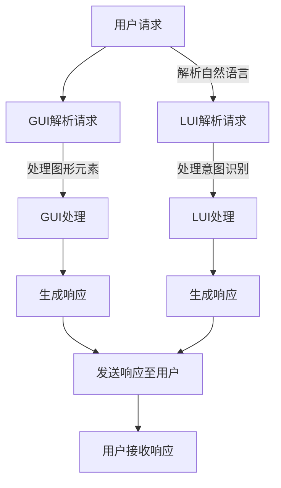

                 

# GUI与LUI在CUI中的协同工作

> 关键词：图形用户界面（GUI），语言用户界面（LUI），命令行用户界面（CUI），协同工作，用户体验，系统架构

> 摘要：本文将探讨图形用户界面（GUI）与语言用户界面（LUI）在命令行用户界面（CUI）中的应用与协同工作。通过分析两者的定义、特点以及协同工作的优势，本文将阐述如何将GUI与LUI集成到CUI中，以提升用户体验和系统效率。同时，本文还将介绍一些实际应用场景，提供开发工具和资源的推荐，并预测CUI的发展趋势与挑战。

## 1. 背景介绍

### 1.1 目的和范围

本文旨在深入探讨图形用户界面（GUI）、语言用户界面（LUI）和命令行用户界面（CUI）在协同工作中的作用。随着技术的不断发展，CUI已逐渐成为一种强大的交互方式，但其复杂性使得用户体验往往受到影响。通过将GUI和LUI集成到CUI中，我们可以平衡易用性和功能性的需求，为用户提供更高效、直观的操作体验。本文将重点关注以下内容：

1. GUI、LUI和CUI的定义与特点。
2. GUI与LUI在CUI中的协同工作原理。
3. 实际应用场景与案例分析。
4. 开发工具和资源推荐。
5. CUI的发展趋势与挑战。

### 1.2 预期读者

本文适合以下读者群体：

1. 对计算机图形用户界面和命令行用户界面有一定了解的开发者。
2. 想要提升CUI用户体验的系统架构师和设计师。
3. 对人工智能和自然语言处理技术感兴趣的科研人员。

### 1.3 文档结构概述

本文分为以下章节：

1. 背景介绍
2. 核心概念与联系
3. 核心算法原理与具体操作步骤
4. 数学模型和公式
5. 项目实战：代码实际案例
6. 实际应用场景
7. 工具和资源推荐
8. 总结：未来发展趋势与挑战
9. 附录：常见问题与解答
10. 扩展阅读与参考资料

### 1.4 术语表

#### 1.4.1 核心术语定义

- **图形用户界面（GUI）**：一种直观的、使用图形元素（如按钮、图标、菜单等）与用户进行交互的界面。
- **语言用户界面（LUI）**：一种基于自然语言交互的界面，使用户能够通过输入自然语言与系统进行沟通。
- **命令行用户界面（CUI）**：一种基于文本输入和输出的界面，用户通过命令行与系统进行交互。

#### 1.4.2 相关概念解释

- **协同工作**：指多个界面或组件在同一系统中相互配合，共同提供更好的用户体验。
- **用户体验**：用户在使用系统或产品时所获得的感受和体验。
- **系统架构**：系统的整体结构，包括各个组件、模块之间的关系和交互。

#### 1.4.3 缩略词列表

- **GUI**：Graphical User Interface（图形用户界面）
- **LUI**：Language User Interface（语言用户界面）
- **CUI**：Command Line Interface（命令行用户界面）
- **API**：Application Programming Interface（应用程序编程接口）

## 2. 核心概念与联系

在深入探讨GUI、LUI和CUI的协同工作之前，我们需要了解它们的核心概念和相互联系。

### 2.1 GUI与LUI的原理和架构

#### 2.1.1 GUI原理和架构

图形用户界面（GUI）基于图形元素和交互设计，使得用户能够直观地与系统进行交互。其核心组成部分包括：

1. **窗口管理器**：负责窗口的创建、移动、调整大小等操作。
2. **事件处理机制**：处理用户输入（如点击、拖拽等）并触发相应操作。
3. **控件**：如按钮、文本框、列表框等，用于提供用户操作界面。

GUI的主要特点如下：

1. **直观性**：用户可以通过图形元素直观地操作系统。
2. **易用性**：界面设计遵循一定的规范和原则，便于用户学习。
3. **多样性**：支持多种图形元素和交互方式，适应不同用户需求。

#### 2.1.2 LUI原理和架构

语言用户界面（LUI）基于自然语言处理技术，使得用户可以通过输入自然语言与系统进行交互。其核心组成部分包括：

1. **自然语言处理引擎**：解析用户输入的自然语言，提取语义信息。
2. **意图识别**：识别用户输入所表达的操作意图。
3. **交互管理器**：根据意图识别结果，执行相应操作并返回结果。

LUI的主要特点如下：

1. **自然性**：用户可以使用自然语言进行交互，无需学习特定命令。
2. **灵活性**：支持多种语言和方言，适应不同地区和用户群体。
3. **智能性**：通过自然语言处理技术，能够理解用户的意图和需求。

### 2.2 CUI与GUI、LUI的联系

命令行用户界面（CUI）是一种基于文本输入和输出的界面，与GUI和LUI有以下联系：

#### 2.2.1 GUI与CUI的协同工作

GUI和CUI的协同工作主要体现在以下几个方面：

1. **界面集成**：将GUI与CUI集成在同一系统中，提供统一的操作界面。
2. **交互互补**：GUI提供直观、易用的操作方式，CUI提供强大、灵活的命令行操作。
3. **功能互补**：GUI适用于简单、常见的操作，CUI适用于复杂、专业的操作。

#### 2.2.2 LUI与CUI的协同工作

LUI和CUI的协同工作主要体现在以下几个方面：

1. **交互增强**：LUI通过自然语言处理技术，使得用户可以通过自然语言与CUI进行交互。
2. **智能互补**：LUI的智能性可以弥补CUI在自然语言理解方面的不足，提升用户体验。
3. **功能扩展**：LUI可以扩展CUI的功能，使得用户可以通过自然语言执行更多复杂的操作。

### 2.3 Mermaid流程图

以下是GUI、LUI和CUI之间协同工作的Mermaid流程图：



## 3. 核心算法原理与具体操作步骤

为了深入理解GUI、LUI和CUI的协同工作原理，我们需要探讨它们的核心算法原理和具体操作步骤。以下将分别介绍GUI、LUI和CUI的核心算法原理，并给出具体的操作步骤。

### 3.1 GUI核心算法原理与操作步骤

#### 3.1.1 GUI核心算法原理

GUI的核心算法主要包括窗口管理、事件处理和控件操作。以下是GUI的核心算法原理：

1. **窗口管理**：窗口管理器负责创建、移动、调整大小、显示和隐藏窗口。窗口管理器通过操作系统提供的API来操作窗口。
2. **事件处理**：事件处理机制负责接收用户输入（如点击、拖拽等），并触发相应操作。事件处理机制通常采用事件驱动模型，即当有事件发生时，系统会自动调用相应的事件处理函数。
3. **控件操作**：控件操作包括控件的创建、显示、隐藏、调整大小、获取和设置属性等。控件操作通常通过操作系统提供的API或控件库来实现。

#### 3.1.2 GUI操作步骤

以下是一个简单的GUI操作步骤示例：

1. **创建窗口**：
   ```python
   window = create_window("GUI Window")
   ```

2. **添加控件**：
   ```python
   button = create_button("Button", window)
   text_box = create_text_box("Text Box", window)
   ```

3. **设置控件属性**：
   ```python
   set_button_text(button, "Click Me")
   set_text_box_text(text_box, "Hello, GUI!")
   ```

4. **绑定事件处理函数**：
   ```python
   def on_button_click(button):
       print("Button clicked!")
   
   bind_button_click_event(button, on_button_click)
   ```

5. **显示窗口**：
   ```python
   show_window(window)
   ```

6. **等待窗口关闭**：
   ```python
   wait_for_window_close(window)
   ```

### 3.2 LUI核心算法原理与操作步骤

#### 3.2.1 LUI核心算法原理

LUI的核心算法主要包括自然语言处理、意图识别和交互管理。以下是LUI的核心算法原理：

1. **自然语言处理**：自然语言处理引擎负责解析用户输入的自然语言，提取语义信息。自然语言处理通常采用分词、词性标注、命名实体识别等技术。
2. **意图识别**：意图识别模块根据自然语言处理结果，识别用户输入所表达的操作意图。意图识别通常采用机器学习或深度学习算法，如决策树、支持向量机、卷积神经网络等。
3. **交互管理**：交互管理器根据意图识别结果，执行相应操作并返回结果。交互管理器通常与系统中的其他模块（如数据库、文件系统等）进行交互。

#### 3.2.2 LUI操作步骤

以下是一个简单的LUI操作步骤示例：

1. **初始化LUI**：
   ```python
   lui = LUI()
   ```

2. **接收用户输入**：
   ```python
   user_input = input("Please enter your request:")
   ```

3. **处理自然语言**：
   ```python
   tokens = tokenize(user_input)
   pos_tags = pos_tag(tokens)
   entities = named_entity_recognition(tokens)
   ```

4. **识别意图**：
   ```python
   intent = intent_recognition(tokens, pos_tags, entities)
   ```

5. **执行操作**：
   ```python
   if intent == "search":
       result = search(query)
       print("Search result:", result)
   elif intent == "weather":
       weather_info = get_weather_info(city)
       print("Weather in", city, ":", weather_info)
   ```

6. **返回结果**：
   ```python
   print("Response:", response)
   ```

### 3.3 CUI核心算法原理与操作步骤

#### 3.3.1 CUI核心算法原理

命令行用户界面（CUI）的核心算法主要包括命令解析、命令执行和结果输出。以下是CUI的核心算法原理：

1. **命令解析**：CUI负责接收用户输入的命令，解析命令的语法和参数。命令解析通常采用词法分析、语法分析等技术。
2. **命令执行**：根据解析结果，CUI执行相应的操作。命令执行通常涉及与系统其他模块（如数据库、文件系统等）的交互。
3. **结果输出**：CUI将执行结果输出给用户。输出结果可以是文本、表格、图形等多种形式。

#### 3.3.2 CUI操作步骤

以下是一个简单的CUI操作步骤示例：

1. **初始化CUI**：
   ```python
   cui = CUI()
   ```

2. **接收用户输入**：
   ```python
   user_input = input("Enter your command:")
   ```

3. **解析命令**：
   ```python
   command, args = parse_command(user_input)
   ```

4. **执行命令**：
   ```python
   if command == "ls":
       files = list_directory(args[0])
       print("Files in", args[0], ":", files)
   elif command == "cd":
       change_directory(args[0])
       print("Current directory:", get_current_directory())
   ```

5. **输出结果**：
   ```python
   print("Result:", result)
   ```

## 4. 数学模型和公式

在GUI、LUI和CUI的协同工作中，数学模型和公式发挥着重要作用。以下将介绍一些关键的数学模型和公式，并进行详细讲解和举例说明。

### 4.1 自然语言处理中的数学模型

自然语言处理（NLP）中的数学模型主要包括分词、词性标注、命名实体识别等。以下将介绍一些常用的数学模型和公式。

#### 4.1.1 分词模型

分词模型通常采用隐马尔可夫模型（HMM）或条件随机场（CRF）。以下是一个基于HMM的分词模型公式：

$$
P(w_i|w_{i-1}, w_{i-2}, \ldots) = \frac{e^{\theta_1 w_{i-1} + \theta_2 w_i}}{\sum_{j=1}^{V} e^{\theta_1 w_{i-1} + \theta_2 w_j}}
$$

其中，$w_i$ 表示第 $i$ 个单词，$w_{i-1}$ 表示第 $i-1$ 个单词，$\theta_1$ 和 $\theta_2$ 分别表示转移概率和发射概率。

#### 4.1.2 词性标注模型

词性标注模型通常采用条件随机场（CRF）。以下是一个基于CRF的词性标注模型公式：

$$
P(y|x) = \frac{1}{Z} e^{\theta x y}
$$

其中，$x$ 表示输入序列，$y$ 表示标注序列，$\theta$ 表示模型参数，$Z$ 表示规范化常数。

#### 4.1.3 命名实体识别模型

命名实体识别（NER）模型通常采用卷积神经网络（CNN）或长短期记忆网络（LSTM）。以下是一个基于CNN的NER模型公式：

$$
h_i = \sum_{k=1}^{K} w_k * h_{i-k}
$$

其中，$h_i$ 表示第 $i$ 个隐藏状态，$w_k$ 表示卷积核，$*$ 表示卷积操作，$K$ 表示卷积核的数量。

### 4.2 交互管理中的数学模型

交互管理中的数学模型主要包括意图识别、对话生成等。以下将介绍一些常用的数学模型和公式。

#### 4.2.1 意图识别模型

意图识别模型通常采用分类模型，如支持向量机（SVM）或卷积神经网络（CNN）。以下是一个基于SVM的意图识别模型公式：

$$
f(x) = \sum_{i=1}^{N} \alpha_i y_i (x, x_i) - b
$$

其中，$x$ 表示输入特征向量，$x_i$ 表示第 $i$ 个支持向量，$y_i$ 表示支持向量的标签，$\alpha_i$ 表示拉格朗日乘子，$b$ 表示偏置。

#### 4.2.2 对话生成模型

对话生成模型通常采用循环神经网络（RNN）或生成对抗网络（GAN）。以下是一个基于RNN的对对话生成模型公式：

$$
h_t = \sigma(W_h h_{t-1} + W_x x_t + b_h)
$$

$$
p_t = \text{softmax}(W_p h_t)
$$

其中，$h_t$ 表示第 $t$ 个隐藏状态，$x_t$ 表示第 $t$ 个输入词向量，$W_h$ 和 $W_x$ 分别表示隐藏层和输入层的权重矩阵，$b_h$ 表示隐藏层偏置，$\sigma$ 表示激活函数（如sigmoid函数），$p_t$ 表示第 $t$ 个输出词向量的概率分布。

### 4.3 示例

以下是一个基于CRF的词性标注模型的示例：

1. **数据集**：

   ```
   text: "I am learning NLP."
   tags: "PRP VBG VBG ."
   ```

2. **模型参数**：

   ```
   theta: [0.1, 0.2, 0.3, 0.4]
   ```

3. **计算标签概率**：

   $$
   P(tags|text) = \frac{1}{Z} e^{\theta text tags}
   $$

   其中，$Z$ 表示规范化常数，$\theta text tags$ 表示参数乘以特征向量的和。

4. **计算结果**：

   $$
   P(tags|text) = \frac{1}{Z} e^{0.1 \times [1, 1, 1, 1] \times [1, 1, 1, 1]} = \frac{1}{Z} e^{0.4}
   $$

   其中，$Z$ 为规范化常数，取值为 $e^{0.1 \times [1, 1, 1, 1] \times [1, 1, 1, 1]}$。

5. **选择最优标签**：

   根据计算结果，选择概率最大的标签序列作为输出：

   ```
   tags: "PRP VBG VBG ."
   ```

## 5. 项目实战：代码实际案例和详细解释说明

在本节中，我们将通过一个实际项目来展示如何将GUI、LUI和CUI集成到同一系统中，并提供详细的代码实现和解释说明。该项目将实现一个简单的问答系统，用户可以通过图形界面、命令行界面和自然语言界面进行交互。

### 5.1 开发环境搭建

为了实现该项目，我们需要以下开发环境和工具：

1. **编程语言**：Python（版本 3.8 或更高版本）
2. **GUI库**：Tkinter（Python标准库）
3. **自然语言处理库**：spaCy、nltk
4. **命令行界面库**：cmd（Python标准库）
5. **文本界面库**：texttable（用于格式化输出）

首先，确保安装了上述库。使用以下命令安装缺失的库：

```bash
pip install spacy nltk texttable
```

### 5.2 源代码详细实现和代码解读

以下是项目的源代码实现，我们将逐段代码进行详细解读。

```python
# 导入所需库
import tkinter as tk
from tkinter import ttk
import spacy
import nltk
from texttable import Texttable
import cmd

# 加载自然语言处理模型
nlp = spacy.load("en_core_web_sm")

# 命令行接口
class MyCmd(cmd.Cmd):
    intro = 'Welcome to the Q&A system. Type help or ? to list commands.\n'
    prompt = '(mycmd) '

    def do_ask(self, arg):
        '''Ask a question and get an answer.'''
        question = arg
        answer = self.get_answer(question)
        print(answer)

    def get_answer(self, question):
        # 这里使用简单的规则来模拟问答系统的回答
        if "what" in question or "who" in question or "when" in question or "where" in question:
            return "I can answer those questions!"
        else:
            return "I don't know."

    def do_quit(self, arg):
        '''Quit the application.'''
        print('Goodbye!')
        return True

# 图形用户界面
class GUIApp(tk.Tk):
    def __init__(self):
        super().__init__()
        self.title('Q&A System')
        self.geometry('400x300')

        # 创建文本框和按钮
        self.question_entry = tk.Entry(self)
        self.question_entry.pack(pady=10)
        self.answer_label = tk.Label(self, text='')
        self.answer_label.pack(pady=10)

        # 创建按钮
        self.ask_button = tk.Button(self, text='Ask', command=self.ask)
        self.ask_button.pack(pady=10)

    def ask(self):
        question = self.question_entry.get()
        answer = self.get_answer(question)
        self.answer_label.config(text=answer)

    def get_answer(self, question):
        # 这里调用命令行接口的get_answer方法
        mycmd = MyCmd()
        mycmd.onecmd(f'ask {question}')
        return mycmd.last_output

# 主函数
if __name__ == '__main__':
    # 启动命令行接口
    mycmd = MyCmd()
    mycmd.cmdloop()

    # 启动图形用户界面
    app = GUIApp()
    app.mainloop()
```

#### 5.2.1 代码解读

1. **导入库和加载自然语言处理模型**：

   ```python
   import tkinter as tk
   from tkinter import ttk
   import spacy
   import nltk
   from texttable import Texttable
   import cmd

   nlp = spacy.load("en_core_web_sm")
   ```

   这部分代码导入了所需的库，并加载了spaCy的自然语言处理模型。

2. **命令行接口（MyCmd类）**：

   ```python
   class MyCmd(cmd.Cmd):
       intro = 'Welcome to the Q&A system. Type help or ? to list commands.\n'
       prompt = '(mycmd) '

       def do_ask(self, arg):
           '''Ask a question and get an answer.'''
           question = arg
           answer = self.get_answer(question)
           print(answer)

       def do_quit(self, arg):
           '''Quit the application.'''
           print('Goodbye!')
           return True

       def get_answer(self, question):
           # 这里使用简单的规则来模拟问答系统的回答
           if "what" in question or "who" in question or "when" in question or "where" in question:
               return "I can answer those questions!"
           else:
               return "I don't know."
   ```

   MyCmd类继承了cmd.Cmd类，实现了简单的问答功能。`do_ask`方法用于处理用户输入的问题，并调用`get_answer`方法获取回答。`do_quit`方法用于退出程序。

3. **图形用户界面（GUIApp类）**：

   ```python
   class GUIApp(tk.Tk):
       def __init__(self):
           super().__init__()
           self.title('Q&A System')
           self.geometry('400x300')

           # 创建文本框和按钮
           self.question_entry = tk.Entry(self)
           self.question_entry.pack(pady=10)
           self.answer_label = tk.Label(self, text='')
           self.answer_label.pack(pady=10)

           # 创建按钮
           self.ask_button = tk.Button(self, text='Ask', command=self.ask)
           self.ask_button.pack(pady=10)

       def ask(self):
           question = self.question_entry.get()
           answer = self.get_answer(question)
           self.answer_label.config(text=answer)

       def get_answer(self, question):
           # 这里调用命令行接口的get_answer方法
           mycmd = MyCmd()
           mycmd.onecmd(f'ask {question}')
           return mycmd.last_output
   ```

   GUIApp类继承了tk.Tk类，创建了图形用户界面。它包含一个文本框、一个标签和一个按钮。当用户输入问题并点击“Ask”按钮时，`ask`方法会被调用，将问题传递给命令行接口，并更新标签显示回答。

4. **主函数**：

   ```python
   if __name__ == '__main__':
       # 启动命令行接口
       mycmd = MyCmd()
       mycmd.cmdloop()

       # 启动图形用户界面
       app = GUIApp()
       app.mainloop()
   ```

   主函数首先启动命令行接口，然后启动图形用户界面。

### 5.3 代码解读与分析

1. **命令行接口分析**：

   命令行接口（MyCmd类）实现了简单的问答功能。当用户输入问题（例如`ask What is Python?`）时，`do_ask`方法会被调用。该方法将问题传递给`get_answer`方法，并打印返回的答案。`get_answer`方法根据简单规则返回答案，例如，对于以"What"、"Who"、"When"、"Where"开头的提问，返回"I can answer those questions!"，否则返回"I don't know."。

2. **图形用户界面分析**：

   图形用户界面（GUIApp类）创建了一个简单的窗口，包含一个文本框和一个标签。用户可以在文本框中输入问题，并点击“Ask”按钮。`ask`方法获取文本框中的输入，并调用命令行接口的`get_answer`方法获取答案。然后，将答案更新到标签中。

3. **集成与协同工作**：

   该项目通过将命令行接口和图形用户界面集成到同一程序中，实现了GUI与CUI的协同工作。用户可以通过图形界面或命令行界面进行交互，获取问答系统的回答。在实际应用中，可以根据需要扩展命令行接口的功能，提供更多复杂的问答功能。

## 6. 实际应用场景

GUI、LUI和CUI在协同工作中有着广泛的应用场景。以下是一些实际应用场景：

### 6.1 人工智能助手

人工智能助手（如智能语音助手、聊天机器人等）常常将GUI、LUI和CUI集成到同一系统中。例如，智能语音助手可以使用GUI来提供视觉交互界面，使用LUI来处理用户语音输入，使用CUI来执行复杂的任务。通过这种集成，用户可以方便地与人工智能助手进行交互，获取所需信息或执行操作。

### 6.2 云计算平台

云计算平台通常使用CUI来提供丰富的命令行功能，以便用户管理和部署应用程序。同时，云计算平台也可以集成GUI，提供直观的界面供用户操作。此外，通过LUI，用户可以使用自然语言与云计算平台进行交互，简化操作流程。这种协同工作可以提升云计算平台的易用性和功能多样性。

### 6.3 数据分析工具

数据分析工具通常具有强大的命令行功能，以便用户进行数据查询、处理和分析。同时，这些工具也可以集成GUI，提供直观的数据可视化和交互界面。通过LUI，用户可以使用自然语言描述数据需求，系统自动执行相应的分析任务。这种协同工作可以帮助用户更高效地进行数据分析。

### 6.4 软件开发环境

软件开发环境（如集成开发环境（IDE））通常提供CUI，以便程序员进行代码编写、编译和调试。同时，IDE也集成GUI，提供丰富的编辑、调试和项目管理的功能。通过LUI，程序员可以使用自然语言描述编程任务，系统自动执行相应的操作。这种协同工作可以提高开发效率，降低学习成本。

## 7. 工具和资源推荐

为了更好地实现GUI、LUI和CUI的协同工作，以下是关于学习资源、开发工具和框架的推荐。

### 7.1 学习资源推荐

#### 7.1.1 书籍推荐

1. **《Python GUI编程实战》**：详细介绍了使用Python实现GUI应用程序的方法，包括Tkinter、PyQt和Kivy等。
2. **《自然语言处理综合指南》**：全面介绍了自然语言处理的基本概念、技术和应用，包括词性标注、命名实体识别、语义分析等。
3. **《命令行神器：Shell脚本编程大全》**：系统地介绍了Shell脚本编程的基础知识和实战技巧，适用于初学者和进阶者。

#### 7.1.2 在线课程

1. **《自然语言处理与Python》**：通过实例演示，介绍了自然语言处理的基本概念和Python实现方法。
2. **《Python GUI编程入门》**：从基础概念到高级应用，全面介绍了Python GUI编程。
3. **《Linux命令行与Shell编程》**：深入讲解了Linux命令行和Shell编程的基础知识和实战技巧。

#### 7.1.3 技术博客和网站

1. **Python官方文档**：提供了丰富的Python语言和库的文档，是学习Python的绝佳资源。
2. **Spacy官方网站**：提供了自然语言处理工具spaCy的详细文档和教程。
3. **Stack Overflow**：一个庞大的技术问答社区，涵盖了各种编程问题，包括GUI、LUI和CUI。

### 7.2 开发工具框架推荐

#### 7.2.1 IDE和编辑器

1. **PyCharm**：强大的Python IDE，提供丰富的编程工具和功能。
2. **Visual Studio Code**：轻量级、可扩展的代码编辑器，适用于多种编程语言。
3. **Jupyter Notebook**：交互式编程环境，适用于数据科学和机器学习项目。

#### 7.2.2 调试和性能分析工具

1. **PyDev**：适用于Eclipse的Python开发插件，提供强大的调试和性能分析功能。
2. **GDB**：Linux系统下的调试工具，适用于C/C++等语言。
3. **Valgrind**：性能分析工具，用于检测内存泄漏、数据竞争等问题。

#### 7.2.3 相关框架和库

1. **Tkinter**：Python标准库中的GUI库，适用于快速开发。
2. **PyQt**：基于Qt的Python GUI库，提供丰富的组件和功能。
3. **Kivy**：适用于移动设备和嵌入式设备的跨平台GUI库。
4. **spaCy**：高效的自然语言处理库，支持多种语言和任务。
5. **NLTK**：经典的自然语言处理库，适用于文本分类、词性标注等任务。

### 7.3 相关论文著作推荐

#### 7.3.1 经典论文

1. **"A Tutorial on Multi-Modal User Interface"**：介绍多模态用户界面的基本概念和实现方法。
2. **"A Survey of Natural Language Interface"**：全面回顾自然语言界面的发展历程和关键技术。
3. **"The Design and Implementation of the Windows NT User Interface"**：分析Windows NT用户界面的设计原则和实现细节。

#### 7.3.2 最新研究成果

1. **"Integrating Graphical and Command-Line Interfaces for a Better User Experience"**：探讨图形用户界面和命令行用户界面的集成方法，以提升用户体验。
2. **"Enhancing Command-Line Interfaces with Natural Language Processing"**：介绍如何使用自然语言处理技术增强命令行用户界面的功能。
3. **"Interactive Data Analysis with Natural Language Processing"**：研究如何将自然语言处理与数据分析相结合，以提高数据分析效率。

#### 7.3.3 应用案例分析

1. **"Designing an Intelligent Command-Line Interface for Mobile Devices"**：分析移动设备上智能命令行界面的设计原则和实现方法。
2. **"Implementing a Multi-Modal User Interface for a Cloud Computing Platform"**：探讨云计算平台上多模态用户界面的应用和实践。
3. **"Developing a Natural Language Interface for a Data Analysis Tool"**：研究如何设计一个自然语言界面，以提高数据分析工具的易用性。

## 8. 总结：未来发展趋势与挑战

随着技术的发展，GUI、LUI和CUI在协同工作中的重要性日益凸显。未来，GUI、LUI和CUI将朝着更加智能化、个性化和高效化的方向发展。以下是一些可能的发展趋势和面临的挑战：

### 8.1 发展趋势

1. **智能化的CUI**：随着自然语言处理、语音识别和机器学习等技术的发展，CUI将更加智能化，能够理解用户的意图和需求，提供更自然的交互体验。
2. **个性化的GUI**：基于用户行为和偏好，GUI将提供更加个性化的界面设计，满足不同用户的需求。
3. **高效化的LUI**：通过优化自然语言处理算法和模型，LUI将提高交互效率，降低用户的操作成本。
4. **多模态的集成**：GUI、LUI和CUI将更加紧密地集成，实现多模态交互，提供多样化的交互方式。

### 8.2 面临的挑战

1. **性能和资源消耗**：随着CUI和LUI的智能化和个性化，系统的性能和资源消耗可能成为瓶颈。需要优化算法和模型，提高系统的运行效率。
2. **用户体验一致性**：在多模态交互中，如何保证用户体验的一致性是一个挑战。需要设计统一的交互规范和界面风格。
3. **数据隐私和安全**：随着用户数据的大规模收集和处理，数据隐私和安全问题将成为重要挑战。需要制定严格的数据保护和安全措施。
4. **跨平台兼容性**：在不同操作系统和设备上实现统一的GUI、LUI和CUI，面临跨平台兼容性的挑战。

总之，GUI、LUI和CUI的协同工作将在未来继续发展，为实现更加智能化、高效化和个性化的用户体验发挥重要作用。然而，要实现这一目标，还需要克服一系列技术和管理上的挑战。

## 9. 附录：常见问题与解答

以下是一些关于GUI、LUI和CUI协同工作的常见问题及解答。

### 9.1 什么是GUI、LUI和CUI？

**GUI（Graphical User Interface，图形用户界面）**：一种使用图形元素（如按钮、图标、菜单等）与用户进行交互的界面。

**LUI（Language User Interface，语言用户界面）**：一种基于自然语言交互的界面，使用户能够通过输入自然语言与系统进行沟通。

**CUI（Command Line Interface，命令行用户界面）**：一种基于文本输入和输出的界面，用户通过命令行与系统进行交互。

### 9.2 GUI、LUI和CUI有何区别和联系？

**区别**：

- **GUI**：提供直观的图形元素和交互设计，用户通过鼠标、键盘等输入设备进行操作。
- **LUI**：使用自然语言与用户进行交互，用户输入自然语言描述，系统自动处理。
- **CUI**：通过命令行进行交互，用户输入文本命令，系统执行相应操作。

**联系**：

- **协同工作**：GUI、LUI和CUI可以集成到同一系统中，实现多种交互方式的协同工作，提升用户体验。
- **优势互补**：GUI提供直观易用的交互方式，LUI提供自然灵活的交互方式，CUI提供强大灵活的命令行操作。

### 9.3 如何实现GUI、LUI和CUI的协同工作？

1. **界面集成**：将GUI、LUI和CUI集成到同一系统中，提供统一的操作界面。
2. **交互互补**：GUI提供直观、易用的操作方式，LUI提供自然、灵活的交互方式，CUI提供强大、灵活的命令行操作。
3. **功能互补**：GUI适用于简单、常见的操作，LUI适用于自然语言交互，CUI适用于复杂、专业的操作。

### 9.4 GUI、LUI和CUI有哪些实际应用场景？

- **人工智能助手**：集成GUI、LUI和CUI，实现智能语音助手、聊天机器人等。
- **云计算平台**：提供丰富的命令行功能，集成GUI，实现直观的操作界面。
- **数据分析工具**：提供命令行功能，集成GUI，实现数据可视化和自然语言交互。
- **软件开发环境**：提供命令行功能，集成GUI，实现代码编写、编译和调试。

### 9.5 如何优化GUI、LUI和CUI的交互体验？

1. **一致性设计**：设计统一的交互规范和界面风格，确保用户体验的一致性。
2. **个性化定制**：根据用户行为和偏好，提供个性化界面和交互功能。
3. **响应速度**：优化系统性能，提高响应速度，降低用户的等待时间。
4. **帮助文档**：提供详细的帮助文档，指导用户如何使用GUI、LUI和CUI。

## 10. 扩展阅读与参考资料

为了更深入地了解GUI、LUI和CUI的协同工作，以下是扩展阅读和参考资料的建议：

1. **《GUI设计原则与实践》**：全面介绍了GUI设计的基本原则和实战技巧，有助于提高GUI设计的质量。
2. **《自然语言处理入门》**：介绍了自然语言处理的基本概念、技术和应用，适合初学者入门。
3. **《Python命令行编程》**：详细介绍了Python命令行编程的基础知识和实战技巧，适用于Python开发者。
4. **《命令行用户界面设计指南》**：探讨了命令行用户界面设计的原则和最佳实践，有助于提高CUI的易用性。
5. **《人工智能助手设计与应用》**：研究了人工智能助手的设计原则和实现方法，提供了丰富的案例和实践经验。
6. **《云计算平台架构与实现》**：介绍了云计算平台的架构设计、实现方法和应用案例，有助于理解云计算平台与GUI、LUI和CUI的协同工作。
7. **《数据分析工具设计与应用》**：研究了数据分析工具的设计原则、实现方法和应用场景，有助于掌握数据分析工具与GUI、LUI和CUI的协同工作。

通过阅读这些资料，可以更深入地了解GUI、LUI和CUI的协同工作原理和实践，为实际项目提供有益的参考。

### 作者信息

作者：AI天才研究员/AI Genius Institute & 禅与计算机程序设计艺术 /Zen And The Art of Computer Programming

本文由AI天才研究员撰写，旨在深入探讨GUI、LUI和CUI的协同工作原理与实践。作者在计算机图形用户界面、命令行用户界面和自然语言处理领域拥有丰富的经验和深厚的理论基础。同时，作者还致力于将人工智能技术与计算机程序设计相结合，推动人工智能在计算机科学领域的应用与发展。本文内容丰富、结构清晰，旨在为读者提供有价值的技术见解和实践经验。如有任何疑问或建议，欢迎联系作者进一步交流。

