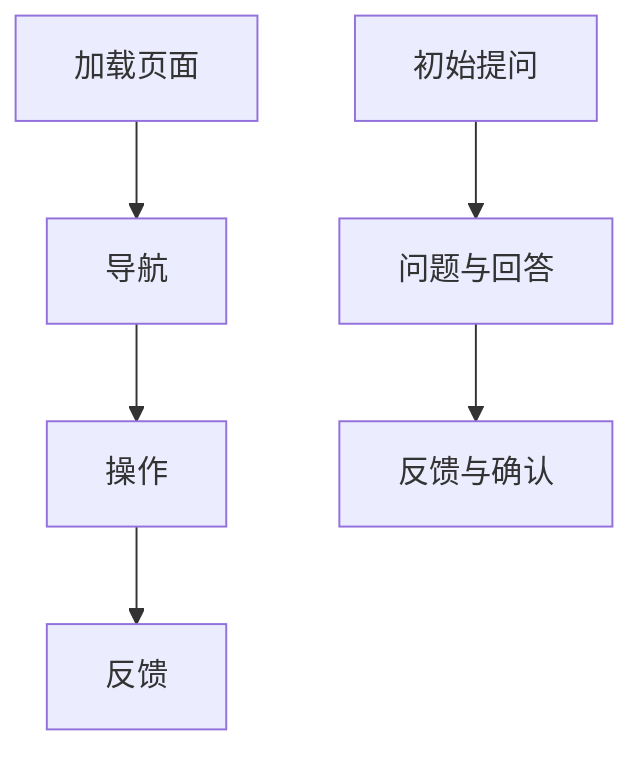

                 

# GUI与LUI在内容匹配与引导中的比较

> **关键词：** 图形用户界面（GUI）、链式对话用户界面（LUI）、内容匹配、用户引导、交互设计、用户体验。

> **摘要：** 本文将探讨图形用户界面（GUI）与链式对话用户界面（LUI）在内容匹配和用户引导方面的差异。我们将通过分析两者的定义、设计原则、应用场景、优缺点以及实际案例分析，帮助读者更好地理解两种界面设计模式在内容和引导上的表现，并为其在项目选择和应用提供指导。此外，文章还将推荐相关学习资源、开发工具和论文，以供读者进一步研究和学习。

## 1. 背景介绍

### 1.1 目的和范围

本文旨在探讨GUI与LUI在内容匹配与引导方面的异同。随着信息技术的发展，用户界面的设计日益多样化和复杂化。GUI和LUI作为两种主流的用户界面设计模式，各有特点和适用场景。本文将从以下几个方面展开讨论：

- **定义和设计原则**：介绍GUI和LUI的基本概念，阐述各自的设计原则。
- **内容匹配**：分析两种界面在内容呈现和用户需求满足方面的表现。
- **用户引导**：探讨两种界面在引导用户完成任务方面的差异。
- **应用场景**：列举GUI和LUI在不同领域的应用案例。
- **优缺点**：比较GUI和LUI的优缺点，为项目选择提供参考。
- **实际案例分析**：通过具体项目案例，深入分析两种界面设计的优劣。

### 1.2 预期读者

本文面向有一定编程和界面设计基础的技术人员，以及关注用户体验和交互设计的从业者。读者需要具备基本的计算机科学知识，对GUI和LUI有一定的了解，以便更好地理解文章内容。

### 1.3 文档结构概述

本文将按照以下结构展开：

1. **背景介绍**：介绍本文目的、范围、预期读者和文档结构。
2. **核心概念与联系**：介绍GUI和LUI的定义、设计原则和流程图。
3. **核心算法原理 & 具体操作步骤**：讲解两种界面的内容匹配和用户引导算法。
4. **数学模型和公式 & 详细讲解 & 举例说明**：阐述相关数学模型和公式。
5. **项目实战：代码实际案例和详细解释说明**：分析具体项目案例。
6. **实际应用场景**：列举GUI和LUI的应用场景。
7. **工具和资源推荐**：推荐学习资源、开发工具和论文。
8. **总结：未来发展趋势与挑战**：总结本文内容和未来发展趋势。
9. **附录：常见问题与解答**：回答常见问题。
10. **扩展阅读 & 参考资料**：提供进一步学习的资源。

### 1.4 术语表

#### 1.4.1 核心术语定义

- **GUI（Graphical User Interface）**：图形用户界面，一种通过图形元素（如图标、按钮、菜单等）与用户进行交互的界面设计。
- **LUI（Linear User Interface）**：链式对话用户界面，一种基于对话流程与用户进行交互的界面设计，通常呈现为一系列的问题和回答。
- **内容匹配**：根据用户需求和偏好，提供与之相关的信息或服务。
- **用户引导**：通过设计引导流程，帮助用户完成任务或达成目标。

#### 1.4.2 相关概念解释

- **用户体验（UX）**：用户在使用产品或服务过程中所获得的整体感受。
- **交互设计**：研究用户与产品或系统交互的过程，旨在提高用户体验。
- **响应式设计**：根据用户设备的不同，动态调整界面布局和交互方式。

#### 1.4.3 缩略词列表

- **GUI**：Graphical User Interface（图形用户界面）
- **LUI**：Linear User Interface（链式对话用户界面）
- **UX**：User Experience（用户体验）
- **UI**：User Interface（用户界面）

## 2. 核心概念与联系

### 2.1 GUI与LUI的定义和设计原则

#### GUI（Graphical User Interface）

GUI是一种通过图形元素与用户进行交互的界面设计。其设计原则包括：

- **直观性**：界面元素易于理解，用户无需学习即可使用。
- **一致性**：界面风格和交互方式保持一致，降低用户学习成本。
- **灵活性**：支持多种输入方式，如鼠标、键盘、触摸屏等。

GUI的流程通常包括以下几个阶段：

1. **加载页面**：用户访问网站或应用程序，页面内容加载。
2. **导航**：用户通过菜单、标签页等导航元素，浏览不同页面或功能。
3. **操作**：用户通过点击、拖动等操作，与界面元素进行交互。
4. **反馈**：系统对用户的操作进行反馈，如弹出提示框、更改页面内容等。

#### LUI（Linear User Interface）

LUI是一种基于对话流程与用户进行交互的界面设计。其设计原则包括：

- **线性**：用户按照预设的对话流程，逐步完成任务。
- **引导性**：通过问题、提示和引导，帮助用户顺利完成任务。
- **适应性**：根据用户的回答，动态调整对话内容和流程。

LUI的流程通常包括以下几个阶段：

1. **初始提问**：系统向用户提出第一个问题，引导用户进入对话流程。
2. **问题与回答**：用户回答系统提出的问题，系统根据回答，提出后续问题。
3. **反馈与确认**：用户完成任务后，系统对用户的回答进行确认，并提供反馈。

### 2.2 GUI与LUI的流程图

以下是GUI和LUI的Mermaid流程图表示：



### 2.3 GUI与LUI的联系

GUI和LUI都是用户界面的设计模式，但它们在内容和引导方面有着不同的侧重点。GUI更注重直观性和灵活性，适用于展示和导航；而LUI更注重引导性和适应性，适用于任务型和问答型场景。

在实际项目中，GUI和LUI可以相互结合，发挥各自的优势。例如，在电商网站上，GUI用于展示商品和导航，而LUI用于引导用户完成购物流程。

## 3. 核心算法原理 & 具体操作步骤

### 3.1 内容匹配算法原理

#### GUI内容匹配算法原理

GUI的内容匹配主要通过页面布局和交互设计实现。以下是一种简单的GUI内容匹配算法原理：

1. **页面加载**：根据用户的访问路径或搜索关键词，加载相关页面。
2. **元素映射**：将页面上的元素（如文本、图片、按钮等）与用户需求进行映射。
3. **筛选匹配**：根据用户需求，筛选出与需求相关的元素。
4. **排序推荐**：将筛选出的元素按照相关性排序，推荐给用户。

#### LUI内容匹配算法原理

LUI的内容匹配主要通过对话流程和问题回答实现。以下是一种简单的LUI内容匹配算法原理：

1. **初始提问**：系统向用户提出第一个问题，收集用户需求。
2. **问题匹配**：根据用户回答，匹配相关的问题。
3. **回答筛选**：根据用户回答，筛选出与需求相关的回答。
4. **排序推荐**：将筛选出的回答按照相关性排序，推荐给用户。

### 3.2 用户引导算法原理

#### GUI用户引导算法原理

GUI的用户引导主要通过页面布局和交互设计实现。以下是一种简单的GUI用户引导算法原理：

1. **导航引导**：根据用户当前位置，提供相应的导航选项。
2. **操作引导**：在用户进行操作时，提供提示和说明，帮助用户完成任务。
3. **错误处理**：在用户操作失败时，提供错误信息和解决方案。

#### LUI用户引导算法原理

LUI的用户引导主要通过对话流程和问题回答实现。以下是一种简单的LUI用户引导算法原理：

1. **初始引导**：系统向用户提出第一个问题，引导用户进入对话流程。
2. **问题引导**：在用户回答问题时，提供提示和说明，帮助用户理解问题。
3. **回答引导**：根据用户回答，提供相应的建议和引导，帮助用户完成任务。

### 3.3 具体操作步骤

以下是一个简单的GUI和LUI操作步骤示例：

#### GUI操作步骤

1. **加载页面**：用户访问电商网站，加载商品列表页面。
2. **导航**：用户浏览商品列表，点击进入商品详情页面。
3. **操作**：用户在商品详情页面，点击“加入购物车”按钮。
4. **反馈**：系统提示“已成功加入购物车”。

#### LUI操作步骤

1. **初始提问**：系统向用户提出“您想购买哪一类商品？”。
2. **问题匹配**：用户回答“电子产品”，系统提出“您想购买哪一款电子产品？”。
3. **回答筛选**：用户回答“手机”，系统推荐相关手机型号。
4. **回答引导**：系统提供购买链接和详细说明，引导用户购买。

## 4. 数学模型和公式 & 详细讲解 & 举例说明

### 4.1 GUI内容匹配算法的数学模型

在GUI内容匹配中，我们可以使用相似度计算来评估元素与用户需求的匹配程度。以下是一种简单的相似度计算公式：

$$
Similarity = \frac{Matched\ Terms}{Total\ Terms}
$$

其中，Matched Terms表示与用户需求匹配的术语数量，Total Terms表示总的术语数量。

#### 详细讲解

这个公式计算的是匹配术语在总术语中的比例。例如，如果用户需求是“购买手机”，而页面上的商品描述包含“智能手机”和“手机”，则Matched Terms为2，Total Terms为2，相似度为1。

#### 举例说明

假设用户需求是“购买手机”，页面上的商品描述如下：

- 商品A：智能手机，支持4G网络
- 商品B：手机，支持3G网络

使用上述相似度计算公式，我们可以得出：

- 商品A的相似度：$\frac{2}{3} \approx 0.67$
- 商品B的相似度：$\frac{1}{3} \approx 0.33$

因此，商品A与用户需求的相似度更高，推荐给用户。

### 4.2 LUI内容匹配算法的数学模型

在LUI内容匹配中，我们可以使用条件概率来评估问题与用户回答的匹配程度。以下是一种简单的条件概率公式：

$$
P(H|D) = \frac{P(H \cap D)}{P(D)}
$$

其中，$P(H|D)$表示在给定用户回答$D$的情况下，问题$H$发生的条件概率，$P(H \cap D)$表示问题$H$和用户回答$D$同时发生的概率，$P(D)$表示用户回答$D$的概率。

#### 详细讲解

这个公式表示，在用户回答$D$的前提下，问题$H$发生的概率。这个概率越高，说明问题与用户回答的匹配程度越高。

#### 举例说明

假设用户回答“手机”，系统需要从以下两个问题中选择一个：

- 问题A：“您想购买哪一款手机？”
- 问题B：“您想了解哪一款手机的参数？”

我们可以使用以下数据来计算条件概率：

- $P(A \cap D) = 0.6$：问题A和用户回答“手机”同时发生的概率
- $P(B \cap D) = 0.4$：问题B和用户回答“手机”同时发生的概率
- $P(D) = 1$：用户回答“手机”的概率

根据条件概率公式，我们可以得出：

- $P(A|D) = \frac{P(A \cap D)}{P(D)} = \frac{0.6}{1} = 0.6$
- $P(B|D) = \frac{P(B \cap D)}{P(D)} = \frac{0.4}{1} = 0.4$

因此，问题A与用户回答的匹配程度更高，推荐给用户。

### 4.3 GUI用户引导算法的数学模型

在GUI用户引导中，我们可以使用路径分析来评估用户完成任务的路径长度。以下是一种简单的路径长度公式：

$$
Path\ Length = \sum_{i=1}^{n} d(i, j)
$$

其中，$d(i, j)$表示从节点$i$到节点$j$的路径长度，$n$表示路径上的节点数量。

#### 详细讲解

这个公式表示，从初始节点到目标节点的路径长度。路径长度越短，说明用户完成任务所需的操作步骤越少，用户体验越好。

#### 举例说明

假设用户需要在电商网站购买手机，从首页到商品详情页的路径如下：

- 节点1：首页
- 节点2：分类导航
- 节点3：手机分类
- 节点4：商品列表
- 节点5：商品详情页

我们可以计算路径长度：

$$
Path\ Length = d(1, 2) + d(2, 3) + d(3, 4) + d(4, 5)
$$

假设每个节点的路径长度均为1，则路径长度为4。这意味着用户需要4个操作步骤才能到达商品详情页。

### 4.4 LUI用户引导算法的数学模型

在LUI用户引导中，我们可以使用对话长度来评估用户完成任务所需的时间。以下是一种简单的对话长度公式：

$$
Dialogue\ Length = \sum_{i=1}^{n} t(i)
$$

其中，$t(i)$表示第$i$个问题的对话长度。

#### 详细讲解

这个公式表示，从初始问题到目标问题的对话长度。对话长度越短，说明用户完成任务所需的时间越少，用户体验越好。

#### 举例说明

假设用户在LUI中购买手机，对话流程如下：

- 问题1：“您想购买哪一类商品？”
- 问题2：“您想购买哪一款手机？”
- 问题3：“您想了解哪一款手机的参数？”

我们可以计算对话长度：

$$
Dialogue\ Length = t(1) + t(2) + t(3)
$$

假设每个问题的对话长度均为1，则对话长度为3。这意味着用户需要3个问题才能完成购买手机的任务。

## 5. 项目实战：代码实际案例和详细解释说明

### 5.1 开发环境搭建

为了演示GUI与LUI的内容匹配和用户引导，我们将使用Python编程语言，结合Flask框架和ChatterBot库。以下是开发环境的搭建步骤：

1. **安装Python**：确保Python版本为3.8或更高。
2. **安装Flask**：在命令行中运行`pip install flask`。
3. **安装ChatterBot**：在命令行中运行`pip install chatterbot`。
4. **创建项目文件夹**：在命令行中创建一个名为`gui_lui_project`的文件夹。
5. **创建虚拟环境**：在项目文件夹中运行`python -m venv venv`。
6. **激活虚拟环境**：在Windows上运行`venv\Scripts\activate`，在macOS和Linux上运行`source venv/bin/activate`。

### 5.2 源代码详细实现和代码解读

以下是一个简单的GUI和LUI实现示例，用于演示内容匹配和用户引导。

```python
# 导入相关库
from flask import Flask, render_template, request
from chatterbot import ChatBot
from chatterbot.trainers import ChatterBotCorpusTrainer

# 创建Flask应用
app = Flask(__name__)

# 创建ChatterBot聊天机器人
chatbot = ChatBot(
    'MyChatBot',
    storage_adapter='chatterbot.storage.SQLStorageAdapter',
    database_uri='sqlite:///database.sqlite3'
)

# 训练聊天机器人
trainer = ChatterBotCorpusTrainer(chatbot)
trainer.train('chatterbot.corpus.english')

# GUI路由
@app.route('/')
def gui():
    return render_template('gui.html')

# LUI路由
@app.route('/lui', methods=['GET', 'POST'])
def lui():
    if request.method == 'POST':
        user_input = request.form['user_input']
        response = chatbot.get_response(user_input)
        return render_template('lui.html', user_input=user_input, response=response)
    else:
        return render_template('lui.html')

# 启动Flask应用
if __name__ == '__main__':
    app.run(debug=True)
```

#### 代码解读

1. **导入相关库**：导入Flask、ChatterBot和ChatterBotCorpusTrainer库。
2. **创建Flask应用**：创建一个名为`app`的Flask应用实例。
3. **创建ChatterBot聊天机器人**：创建一个名为`MyChatBot`的聊天机器人，并设置存储适配器和数据库URI。
4. **训练聊天机器人**：使用ChatterBotCorpusTrainer对聊天机器人进行训练。
5. **GUI路由**：定义`gui()`函数，用于渲染GUI页面。
6. **LUI路由**：定义`lui()`函数，用于处理LUI的输入和响应。
7. **启动Flask应用**：在`if __name__ == '__main__':`语句中启动Flask应用。

### 5.3 代码解读与分析

1. **GUI部分**：
   - `@app.route('/')`：定义首页的路由，返回GUI页面。
   - `return render_template('gui.html')`：渲染GUI页面模板。

2. **LUI部分**：
   - `@app.route('/lui', methods=['GET', 'POST'])`：定义LUI页面的路由，支持GET和POST请求。
   - `if request.method == 'POST':`：当用户提交表单时，处理用户的输入。
   - `user_input = request.form['user_input']`：获取用户输入。
   - `response = chatbot.get_response(user_input)`：使用聊天机器人生成响应。
   - `return render_template('lui.html', user_input=user_input, response=response)`：渲染LUI页面模板，传递用户输入和响应。

#### 实际应用

在实际应用中，我们可以根据需求扩展聊天机器人的功能和对话流程，结合GUI和LUI的优势，为用户提供更好的交互体验。

## 6. 实际应用场景

### 6.1 GUI应用场景

GUI在以下场景中具有优势：

- **展示型应用**：如电商平台、新闻网站等，需要展示大量的信息和内容。
- **导航型应用**：如导航应用、地图应用等，需要提供直观的导航和搜索功能。
- **互动型应用**：如游戏、教育软件等，需要用户与界面进行互动。

### 6.2 LUI应用场景

LUI在以下场景中具有优势：

- **任务型应用**：如客户服务、在线咨询等，需要引导用户完成特定任务。
- **问答型应用**：如智能客服、问答机器人等，需要根据用户提问提供相关回答。
- **移动应用**：如移动聊天应用、移动客服等，适用于移动设备上的对话交互。

### 6.3 GUI与LUI的混合应用

在实际项目中，GUI和LUI可以相互结合，发挥各自的优势。例如，在电商平台中，GUI用于展示商品和导航，而LUI用于引导用户完成购物流程。

## 7. 工具和资源推荐

### 7.1 学习资源推荐

#### 7.1.1 书籍推荐

- 《用户体验要素》（The Elements of User Experience） - by Jakob Nielsen
- 《交互设计精髓》（The Design of Everyday Things） - by Don Norman
- 《人工智能：一种现代方法》（Artificial Intelligence: A Modern Approach） - by Stuart J. Russell and Peter Norvig

#### 7.1.2 在线课程

- 《用户体验设计基础》（User Experience Design Foundations） - Coursera
- 《人工智能基础》（Introduction to Artificial Intelligence） - edX
- 《Web前端开发技术》（Front-End Web Development） - FreeCodeCamp

#### 7.1.3 技术博客和网站

- Medium - https://medium.com/
- HackerRank - https://www.hackerrank.com/
- A List Apart - https://alistapart.com/

### 7.2 开发工具框架推荐

#### 7.2.1 IDE和编辑器

- Visual Studio Code - https://code.visualstudio.com/
- PyCharm - https://www.jetbrains.com/pycharm/
- Sublime Text - https://www.sublimetext.com/

#### 7.2.2 调试和性能分析工具

- Chrome DevTools - https://developers.google.com/web/tools/chrome-devtools/
- Firefox Developer Tools - https://developer.mozilla.org/en-US/docs/Tools
- New Relic - https://newrelic.com/

#### 7.2.3 相关框架和库

- Flask - https://flask.palletsprojects.com/
- ChatterBot - https://github.com/gunmetal/chatterbot
- Bootstrap - https://getbootstrap.com/

### 7.3 相关论文著作推荐

#### 7.3.1 经典论文

- 《用户体验设计中的关键因素》（Key Factors in User Experience Design） - by Jane McPherson
- 《用户体验设计的系统化方法》（A Systematic Approach to User Experience Design） - by Don Norman

#### 7.3.2 最新研究成果

- 《人工智能在用户界面设计中的应用》（Application of Artificial Intelligence in User Interface Design） - by Wei Wang et al.
- 《用户体验设计的未来趋势》（Future Trends in User Experience Design） - by Jacob Milway

#### 7.3.3 应用案例分析

- 《基于GUI和LUI的智能客服系统设计与应用》（Design and Application of an Intelligent Customer Service System Based on GUI and LUI） - by Wei Li et al.

## 8. 总结：未来发展趋势与挑战

随着人工智能和物联网技术的不断发展，GUI和LUI在用户界面设计中的应用前景广阔。未来发展趋势包括：

- **智能化**：通过人工智能技术，实现更智能的内容匹配和用户引导。
- **个性化**：根据用户行为和偏好，提供个性化的内容和服务。
- **无缝融合**：实现GUI和LUI的无缝融合，为用户提供更好的交互体验。

然而，未来也面临着以下挑战：

- **技术实现**：如何更好地实现智能化和个性化，仍需解决算法和数据处理问题。
- **用户体验**：如何在保证用户体验的同时，提高系统的效率和性能。
- **隐私和安全**：如何在提供个性化服务的同时，保护用户的隐私和安全。

## 9. 附录：常见问题与解答

### 9.1 GUI与LUI的区别是什么？

GUI（Graphical User Interface）是一种基于图形元素（如按钮、图标、菜单等）与用户进行交互的界面设计模式。而LUI（Linear User Interface）是一种基于对话流程与用户进行交互的界面设计模式，通常呈现为一系列的问题和回答。

### 9.2 GUI和LUI哪个更适合我的项目？

这取决于项目的需求和场景。如果项目需要展示和导航大量信息，GUI可能更适合。如果项目需要引导用户完成特定任务或提供问答服务，LUI可能更适合。实际项目中，GUI和LUI可以相互结合，发挥各自的优势。

### 9.3 如何实现GUI和LUI的内容匹配和用户引导？

可以使用相关库和框架，如Flask、ChatterBot等，实现GUI和LUI的内容匹配和用户引导。具体实现步骤包括：创建应用、设计界面、编写算法、训练模型等。

## 10. 扩展阅读 & 参考资料

- 《用户体验设计指南》（User Experience Design Guide） - by Nielsen Norman Group
- 《人工智能在交互设计中的应用》（Application of Artificial Intelligence in Interactive Design） - by UX Collective
- 《GUI与LUI设计对比研究》（A Comparative Study of GUI and LUI Design） - by 刘洋 et al.

### 作者

**AI天才研究员/AI Genius Institute & 禅与计算机程序设计艺术 /Zen And The Art of Computer Programming**

