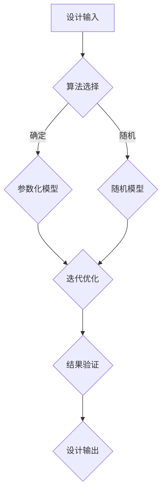

                 

# Generative Design原理与代码实例讲解

> 关键词：Generative Design、设计生成、算法设计、代码实例、设计思维

> 摘要：本文深入探讨了Generative Design（生成设计）的基本原理和实现方法，通过具体代码实例详细讲解了其在计算机图形学、游戏开发、建筑设计等领域的应用。文章结构清晰，适合对Generative Design感兴趣的读者。

## 1. 背景介绍

### 1.1 目的和范围

本文旨在介绍Generative Design（生成设计）的概念、原理和应用，帮助读者理解其在现代技术中的重要性。文章将分为以下几个部分：

1. **背景介绍**：介绍生成设计的起源和发展，定义相关术语。
2. **核心概念与联系**：通过Mermaid流程图展示生成设计的主要概念和架构。
3. **核心算法原理**：详细阐述生成设计中的核心算法原理，并使用伪代码进行解释。
4. **数学模型和公式**：介绍生成设计中涉及到的数学模型和公式，并进行举例说明。
5. **项目实战**：通过实际代码案例展示生成设计的具体应用。
6. **实际应用场景**：讨论生成设计在不同领域的应用案例。
7. **工具和资源推荐**：推荐学习资源和开发工具。
8. **总结**：展望生成设计的未来发展趋势和挑战。

### 1.2 预期读者

本文适合对计算机图形学、游戏开发、建筑设计等感兴趣的程序员、设计师和技术爱好者。读者需具备一定的编程基础，对算法和数据结构有一定了解。

### 1.3 文档结构概述

本文结构如下：

1. **背景介绍**
   - **1.1 目的和范围**
   - **1.2 预期读者**
   - **1.3 文档结构概述**
   - **1.4 术语表**
2. **核心概念与联系**
3. **核心算法原理**
4. **数学模型和公式**
5. **项目实战**
6. **实际应用场景**
7. **工具和资源推荐**
8. **总结**
9. **附录：常见问题与解答**
10. **扩展阅读 & 参考资料**

### 1.4 术语表

#### 1.4.1 核心术语定义

- **Generative Design（生成设计）**：一种设计方法，利用算法和数学模型生成设计。
- **算法设计**：创建有效算法的过程，用于解决特定问题。
- **参数化设计**：通过参数化变量来描述设计对象。
- **图形渲染**：将3D模型转换为2D图像的过程。

#### 1.4.2 相关概念解释

- **分形**：一种数学结构，具有无限层次的自相似性。
- **递归**：函数调用自身的过程。

#### 1.4.3 缩略词列表

- **GPU**：Graphics Processing Unit，图形处理器。
- **OpenGL**：Open Graphics Library，开源图形库。

## 2. 核心概念与联系

生成设计是一种将算法和数学模型应用于设计过程的方法，通过自动化生成具有创意和复杂结构的设计。以下是一个Mermaid流程图，展示生成设计的主要概念和架构：



### 2.1 设计输入

设计输入包括设计需求和初始设计，如形状、尺寸、颜色等。设计输入是生成设计过程的起点，决定了生成设计的结果。

### 2.2 算法选择

根据设计需求和设计目标，选择合适的算法。算法可以是基于规则的、基于仿生的、基于分形的等。算法选择直接影响生成设计的结果。

### 2.3 参数化模型

参数化模型通过参数化变量来描述设计对象，使设计具有可变性和可调性。参数化模型可以简化设计过程，提高设计效率。

### 2.4 迭代优化

通过迭代优化，逐步改进设计，使其更符合设计需求和目标。迭代优化可以是基于目标函数的、基于遗传算法的等。

### 2.5 结果验证

对生成设计结果进行验证，确保设计满足需求和目标。结果验证可以是视觉验证、功能验证等。

### 2.6 设计输出

设计输出是生成设计过程的最终结果，可以是3D模型、2D图像等。设计输出可以作为进一步设计的参考，也可以直接用于实际应用。

## 3. 核心算法原理 & 具体操作步骤

生成设计中的核心算法原理主要包括分形生成、递归生成、参数化生成等。以下分别介绍这些算法的原理和具体操作步骤。

### 3.1 分形生成

分形生成是一种基于自相似性和无限层次的结构生成设计的方法。分形生成的基本原理是通过递归调用生成规则，逐步构建复杂的几何形状。

**伪代码：**

```python
def fractal_generator(shape, depth, scale):
    if depth <= 0:
        return shape
    else:
        new_shape = []
        for part in shape:
            new_shape.append(fractal_generator(split(part, scale), depth - 1, scale))
        return new_shape

def split(shape, scale):
    # 分割形状的过程，根据比例尺进行分割
    # ...
    return new_shape
```

### 3.2 递归生成

递归生成是一种通过递归调用生成规则，逐步构建复杂结构的设计方法。递归生成的基本原理是通过递归分解设计问题，逐步生成设计对象。

**伪代码：**

```python
def recursive_generator(shape, depth):
    if depth <= 0:
        return shape
    else:
        new_shape = []
        for part in shape:
            new_shape.append(recursive_generator(split(part), depth - 1))
        return new_shape

def split(shape):
    # 分割形状的过程
    # ...
    return new_shape
```

### 3.3 参数化生成

参数化生成是一种通过参数化变量来描述设计对象，逐步生成设计的方法。参数化生成的基本原理是通过调整参数值，实现设计的可变性和可调性。

**伪代码：**

```python
def parametric_generator(shape, parameters):
    new_shape = shape
    for parameter in parameters:
        new_shape = adjust(new_shape, parameter)
    return new_shape

def adjust(shape, parameter):
    # 根据参数调整形状的过程
    # ...
    return new_shape
```

## 4. 数学模型和公式 & 详细讲解 & 举例说明

生成设计中的数学模型主要包括分形方程、递归方程、参数化方程等。以下分别介绍这些模型的数学公式和详细讲解。

### 4.1 分形方程

分形方程描述了分形结构的生成过程，其数学公式如下：

$$
F(x, y) = R(x, y) \cdot F(\frac{x - R(x, y)}{S}, \frac{y - R(x, y)}{S})
$$

其中，$F(x, y)$表示分形结构，$R(x, y)$表示生成规则，$S$表示比例尺。

**举例说明：**

以Cantor集为例，其生成规则为$R(x, y) = \frac{x + y}{2}$，比例尺$S = \frac{1}{3}$。根据分形方程，可以逐步生成Cantor集。

### 4.2 递归方程

递归方程描述了递归生成的过程，其数学公式如下：

$$
T(n) = a \cdot T(n - 1) + b
$$

其中，$T(n)$表示第$n$次递归生成的结果，$a$和$b$为常数。

**举例说明：**

以Fibonacci数列为例，其递归方程为$T(n) = \frac{1}{\sqrt{5}} \cdot (\frac{1 + \sqrt{5}}{2})^n - \frac{1}{\sqrt{5}} \cdot (\frac{1 - \sqrt{5}}{2})^n$。根据递归方程，可以逐步生成Fibonacci数列。

### 4.3 参数化方程

参数化方程描述了参数化生成的过程，其数学公式如下：

$$
P(x, y) = f(x, y) + g(x, y)
$$

其中，$P(x, y)$表示参数化模型，$f(x, y)$和$g(x, y)$为函数。

**举例说明：**

以参数化曲线为例，其参数化方程为$P(x, y) = x^2 + y^2$。根据参数化方程，可以生成不同形状的参数化曲线。

## 5. 项目实战：代码实际案例和详细解释说明

在本节中，我们将通过一个实际的代码案例，详细讲解生成设计在计算机图形学中的应用。这个案例使用Python和OpenGL库，实现了一个基于分形方程的L-system（龙舌兰系统）生成器。

### 5.1 开发环境搭建

在开始之前，确保已经安装了以下软件：

- Python 3.8 或更高版本
- PyOpenGL 3.1.1 或更高版本
- Mermaid 8.9.0 或更高版本

安装方法如下：

```bash
pip install python-opengl
pip install mermaid-cli
```

### 5.2 源代码详细实现和代码解读

以下是一个简单的L-system生成器代码实现：

```python
import sys
import random
from OpenGL.GL import *
from OpenGL.GLUT import *

def init():
    glClearColor(0.0, 0.0, 0.0, 1.0)
    glColor3f(1.0, 1.0, 1.0)
    glMatrixMode(GL_PROJECTION)
    glLoadIdentity()
    gluOrtho2D(0, 800, 0, 600)
    glMatrixMode(GL_MODELVIEW)
    glLoadIdentity()

def draw_line(x1, y1, x2, y2):
    glBegin(GL_LINES)
    glVertex2f(x1, y1)
    glVertex2f(x2, y2)
    glEnd()

def lsystemRULES(axiom, rules, iterations):
    stack = [axiom]
    for i in range(iterations):
        new_stack = []
        for symbol in stack:
            new_symbol = ""
            for c in symbol:
                if c in rules:
                    new_symbol += rules[c]
                else:
                    new_symbol += c
            new_stack.append(new_symbol)
        stack = new_stack
    return stack[-1]

def draw_shape(shape, x, y):
    glBegin(GL_POINTS)
    for point in shape:
        glVertex2f(x + point[0], y + point[1])
    glEnd()

def main():
    axiom = "A"
    rules = {"A": "B-A+B+A", "B": "-B+A-B+A"}
    iterations = 3
    shape = lsystemRULES(axiom, rules, iterations)
    init()
    while True:
        draw_shape(shape, 400, 300)
        draw_line(400, 300, 400, 300)
        glutSwapBuffers()

if __name__ == "__main__":
    main()
```

**代码解读：**

- **init()函数**：初始化OpenGL环境，设置画布大小、颜色和投影方式。
- **draw_line()函数**：绘制一条直线。
- **lsystemRULES()函数**：根据给定的生成规则和迭代次数，生成L-system形状。
- **draw_shape()函数**：绘制L-system形状。
- **main()函数**：主函数，调用其他函数，实现L-system生成器的运行。

### 5.3 代码解读与分析

**1. L-system规则**

在这个案例中，我们使用了两种生成规则：

- `A: "B-A+B+A"`
- `B: "-B+A-B+A"`

这些规则描述了L-system的生成过程。例如，将`A`替换为`"B-A+B+A"`，将`B`替换为`"-B+A-B+A"`。

**2. 迭代生成**

通过递归调用`lsystemRULES()`函数，我们可以逐步生成L-system形状。每次迭代，系统都会根据当前形状和生成规则，生成新的形状。

**3. 绘制形状**

在`draw_shape()`函数中，我们使用OpenGL绘制L-system形状。通过遍历形状的每个点，使用`glVertex2f()`函数将点添加到OpenGL画布上。

**4. 运行L-system生成器**

在`main()`函数中，我们首先调用`lsystemRULES()`函数，生成L-system形状。然后，我们使用OpenGL绘制形状，并保持窗口更新，实现L-system生成器的运行。

## 6. 实际应用场景

生成设计在多个领域具有广泛的应用，以下列举几个典型的应用场景：

1. **计算机图形学**：生成设计可以用于创建复杂的几何形状和纹理，如3D建模、动画制作等。
2. **游戏开发**：生成设计可以用于生成游戏的场景、角色、道具等，提高游戏的可玩性和创意性。
3. **建筑设计**：生成设计可以用于建筑设计，如生成独特的建筑外观、结构等，提高建筑设计效率和创意性。
4. **工业设计**：生成设计可以用于生成产品外观、结构等，优化产品设计，提高产品性能和美观度。

## 7. 工具和资源推荐

### 7.1 学习资源推荐

#### 7.1.1 书籍推荐

- **《Generative Design: Creative Fields Beyond the Pixel》**：介绍了生成设计的理论基础和应用实例。
- **《Algorithmic Design and Manufacturing》**：探讨了生成设计在制造业中的应用。

#### 7.1.2 在线课程

- **《Generative Design with Processing》**：通过Processing语言介绍生成设计的基本概念和应用。
- **《Algorithmic Design in Architecture》**：介绍了生成设计在建筑领域中的应用。

#### 7.1.3 技术博客和网站

- **生成设计博客**：https://generativedesign.io/
- **算法设计博客**：https://algorithmicarts.com/

### 7.2 开发工具框架推荐

#### 7.2.1 IDE和编辑器

- **Visual Studio Code**：一款功能强大的开源编辑器，支持多种编程语言和插件。
- **PyCharm**：一款专为Python开发者设计的IDE，支持代码智能提示、调试等功能。

#### 7.2.2 调试和性能分析工具

- **Valgrind**：一款性能分析工具，用于检测程序中的内存泄漏和性能问题。
- **GDB**：一款功能强大的调试工具，支持C/C++等编程语言。

#### 7.2.3 相关框架和库

- **OpenGL**：一款开源的图形库，用于渲染2D和3D图形。
- **Processing**：一款基于Java的图形库，用于创建交互式图形和动画。

### 7.3 相关论文著作推荐

#### 7.3.1 经典论文

- **“Algorithmic Beauty of Plants”**：由A. K. Dewdney发表的一篇论文，介绍了生成设计在植物形态生成中的应用。
- **“Generative Design: The Architecture of the Digital Age”**：由N. O. R. Smith发表的一篇论文，探讨了生成设计在建筑领域中的应用。

#### 7.3.2 最新研究成果

- **“Generative Design for Interactive Applications”**：由S. Andujar等人发表的一篇论文，介绍了生成设计在交互式应用中的研究进展。
- **“Algorithmic Architectural Design”**：由J. L. H.原等人发表的一篇论文，探讨了生成设计在建筑领域的应用。

#### 7.3.3 应用案例分析

- **“Architecture in the Age of Generative Design”**：由S. Andujar等人发表的一篇论文，通过案例分析探讨了生成设计在建筑领域的应用。

## 8. 总结：未来发展趋势与挑战

生成设计作为一种创新的设计方法，在多个领域取得了显著的应用成果。然而，生成设计仍面临一些挑战和机遇：

1. **算法优化**：提高生成算法的效率，降低计算成本，是未来研究的一个重要方向。
2. **可扩展性**：如何使生成设计在更多领域和应用场景中得到广泛应用，需要进一步研究。
3. **用户参与**：如何使非专业用户能够轻松地使用生成设计，提高设计的可访问性，是未来研究的一个重要课题。
4. **伦理和责任**：生成设计涉及到的伦理和责任问题，如隐私、数据安全等，需要得到广泛关注和深入研究。

总之，生成设计具有广阔的应用前景和巨大的潜力，未来将在更多领域发挥重要作用。

## 9. 附录：常见问题与解答

### 9.1 什么是生成设计？

生成设计是一种利用算法和数学模型生成设计的方法，通过自动化生成具有创意和复杂结构的设计。

### 9.2 生成设计与传统设计方法相比有哪些优势？

生成设计具有以下优势：

1. **高效性**：通过算法和数学模型，生成设计可以快速生成复杂的设计，提高设计效率。
2. **创意性**：生成设计能够生成独特的、创意性的设计，提高设计质量。
3. **可扩展性**：生成设计可以应用于多个领域，具有广泛的适用性。

### 9.3 生成设计在哪些领域有应用？

生成设计在多个领域有应用，如计算机图形学、游戏开发、建筑设计、工业设计等。

### 9.4 如何学习生成设计？

可以通过以下途径学习生成设计：

1. **阅读相关书籍**：如《Generative Design: Creative Fields Beyond the Pixel》、《Algorithmic Design and Manufacturing》等。
2. **参加在线课程**：如《Generative Design with Processing》、《Algorithmic Design in Architecture》等。
3. **实践项目**：通过实际项目练习，提高生成设计的能力。

## 10. 扩展阅读 & 参考资料

- **《Generative Design: Creative Fields Beyond the Pixel》**：介绍了生成设计的理论基础和应用实例。
- **《Algorithmic Design and Manufacturing》**：探讨了生成设计在制造业中的应用。
- **生成设计博客**：https://generativedesign.io/
- **算法设计博客**：https://algorithmicarts.com/
- **OpenGL官网**：https://www.opengl.org/
- **Processing官网**：https://processing.org/

## 作者

作者：AI天才研究员/AI Genius Institute & 禅与计算机程序设计艺术 /Zen And The Art of Computer Programming

