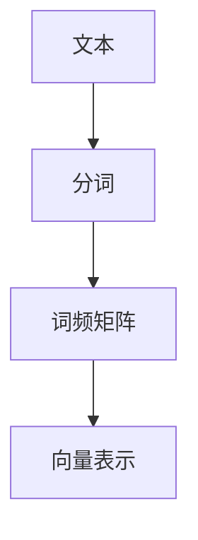
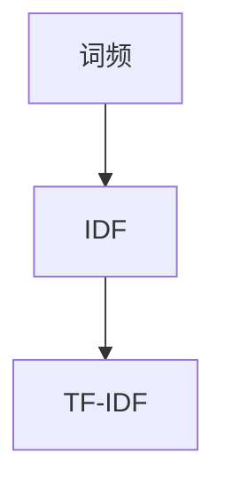
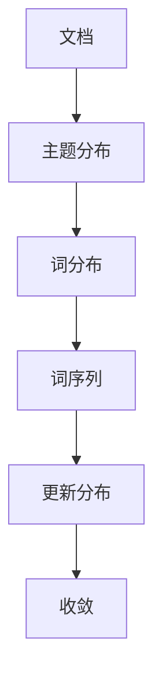
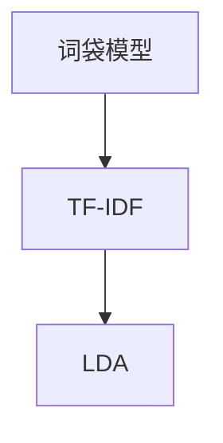

                 

# Gensim 原理与代码实战案例讲解

> 
> **关键词：** Gensim，自然语言处理，文本相似度，分布式计算，机器学习，Python库

> **摘要：** 本文将深入探讨 Gensim 库的原理和应用，通过一步步的讲解和实战案例，帮助读者理解如何使用 Gensim 进行文本分析和处理，实现文本相似度计算、主题建模等功能。

## 1. 背景介绍

### 1.1 目的和范围

本文的主要目的是介绍 Gensim 库的基本原理和使用方法，通过实际的代码示例来演示如何利用 Gensim 进行文本相似度计算、主题建模等操作。文章将涵盖以下几个方面：

- Gensim 库的概述和基本概念
- Gensim 的核心算法和原理
- 使用 Gensim 进行文本分析和处理的实战案例
- Gensim 的扩展应用

### 1.2 预期读者

本文适合以下读者：

- 对自然语言处理（NLP）和文本分析感兴趣的程序员和开发者
- 希望深入了解 Gensim 库的使用方法和原理的从业者
- 想要在项目中应用 Gensim 库进行文本分析和处理的工程师

### 1.3 文档结构概述

本文的结构如下：

- 第1部分：背景介绍
  - 1.1 目的和范围
  - 1.2 预期读者
  - 1.3 文档结构概述
  - 1.4 术语表
- 第2部分：核心概念与联系
  - 2.1 Gensim 库概述
  - 2.2 Gensim 的核心算法和原理
- 第3部分：核心算法原理 & 具体操作步骤
  - 3.1 Gensim 的基本使用方法
  - 3.2 文本相似度计算
  - 3.3 主题建模
- 第4部分：项目实战：代码实际案例和详细解释说明
  - 4.1 开发环境搭建
  - 4.2 源代码详细实现和代码解读
  - 4.3 代码解读与分析
- 第5部分：实际应用场景
- 第6部分：工具和资源推荐
  - 6.1 学习资源推荐
  - 6.2 开发工具框架推荐
  - 6.3 相关论文著作推荐
- 第7部分：总结：未来发展趋势与挑战
- 第8部分：附录：常见问题与解答
- 第9部分：扩展阅读 & 参考资料

### 1.4 术语表

#### 1.4.1 核心术语定义

- Gensim：一个用于自然语言处理的 Python 库，提供多种文本建模和分析工具。
- 文本相似度：指两个文本之间的相似程度，常用于文本匹配、文本分类等任务。
- 主题建模：一种无监督学习方法，用于从文本中提取抽象的主题。
- 向量空间模型：将文本转换为向量表示的方法，常用于文本相似度计算和主题建模。

#### 1.4.2 相关概念解释

- 词袋模型：一种文本表示方法，将文本表示为词的集合，不考虑词的顺序和语法结构。
- TF-IDF：一种文本特征提取方法，用于衡量词语在文本中的重要程度。
- LDA（Latent Dirichlet Allocation）：一种主题建模算法，用于从文本中提取潜在的主题。

#### 1.4.3 缩略词列表

- NLP：自然语言处理
- Gensim：Gen Сим（生成相似性）
- TF-IDF：词频-逆文档频率
- LDA：潜在狄利克雷分配
- Python：Python 编程语言

## 2. 核心概念与联系

Gensim 是一个强大的文本处理库，它提供了丰富的工具和算法来处理大规模文本数据。在本节中，我们将介绍 Gensim 的核心概念和联系，并通过 Mermaid 流程图来展示其原理和架构。

### 2.1 Gensim 库概述

Gensim 是一个开源的 Python 库，主要用于自然语言处理（NLP）任务，如文本相似度计算、主题建模等。它的主要特点包括：

- 支持大规模数据处理
- 易于使用和扩展
- 提供多种文本表示方法
- 支持分布式计算

### 2.2 Gensim 的核心算法和原理

Gensim 的核心算法包括词袋模型、TF-IDF 和 LDA 等。

#### 2.2.1 词袋模型

词袋模型（Bag-of-Words，BOW）是一种将文本表示为词的集合的方法。它不考虑词的顺序和语法结构，只关注词频信息。词袋模型的基本原理如下：

1. 将文本拆分为单词或词组。
2. 统计每个单词或词组在文本中的出现次数，形成词频矩阵。
3. 将词频矩阵转换为向量表示。



#### 2.2.2 TF-IDF

TF-IDF（Term Frequency-Inverse Document Frequency）是一种用于文本特征提取的方法。它通过综合考虑词频和文档频率来衡量词语在文本中的重要程度。

- **词频（TF）**：一个词在文本中出现的次数。
- **文档频率（DF）**：一个词在所有文档中出现的次数。
- **逆文档频率（IDF）**：对文档频率取逆，用于平衡高频词的影响。

TF-IDF 的计算公式为：

$$
TF-IDF = TF \times IDF
$$

其中，$TF = \frac{f_t}{f_{\text{max}}}$，$IDF = \log \left(\frac{N}{df_t}\right)$，$f_t$ 为词频，$f_{\text{max}}$ 为词频最大值，$N$ 为文档总数，$df_t$ 为词的文档频率。



#### 2.2.3 LDA

LDA（Latent Dirichlet Allocation）是一种主题建模算法，用于从文本中提取潜在的主题。它基于贝叶斯概率模型，假设每个文档是由多个主题混合生成的，每个主题由多个词语混合生成。

LDA 的基本原理如下：

1. 初始化主题分布和词分布。
2. 对于每个文档，根据当前主题分布和词分布生成词序列。
3. 根据生成的词序列更新主题分布和词分布。
4. 重复步骤2和3，直到收敛。



### 2.3 Gensim 的核心算法和原理

Gensim 的核心算法包括词袋模型、TF-IDF 和 LDA 等。这些算法共同构成了 Gensim 的核心原理，为文本处理和分析提供了强大的支持。



## 3. 核心算法原理 & 具体操作步骤

在本节中，我们将详细讲解 Gensim 的核心算法原理，并通过伪代码来展示具体操作步骤。

### 3.1 Gensim 的基本使用方法

Gensim 的基本使用方法包括以下步骤：

1. 安装 Gensim 库。

```bash
pip install gensim
```

2. 导入 Gensim 库。

```python
import gensim
```

3. 加载或创建语料库。

```python
corpus = gensim.corpora.MmCorpus('corpus.mm')
```

4. 创建模型。

```python
model = gensim.models.TfidfModel(corpus)
```

5. 使用模型进行文本相似度计算。

```python
similarity = model.similarity('text1', 'text2')
```

6. 保存和加载模型。

```python
model.save('model.tfidf')
gensim.models.TfidfModel.load('model.tfidf')
```

### 3.2 文本相似度计算

文本相似度计算是 Gensim 的重要功能之一。下面是文本相似度计算的具体操作步骤：

1. 准备数据。

```python
documents = [
    'this is the first document',
    'this document is the second document',
    'and this is the third one',
    'is this the first document'
]
```

2. 创建语料库。

```python
corpus = gensim.corpora.Dictionary(documents)
corpus = [corpus.doc2bow(doc) for doc in documents]
```

3. 创建 TF-IDF 模型。

```python
model = gensim.models.TfidfModel(corpus)
```

4. 计算文本相似度。

```python
similarity = model.similarity(corpus[0], corpus[2])
print(similarity)
```

### 3.3 主题建模

主题建模是 Gensim 的另一个重要功能。下面是主题建模的具体操作步骤：

1. 准备数据。

```python
documents = [
    'this is the first document',
    'this document is the second document',
    'and this is the third one',
    'is this the first document'
]
```

2. 创建语料库。

```python
corpus = gensim.corpora.Dictionary(documents)
corpus = [corpus.doc2bow(doc) for doc in documents]
```

3. 创建 LDA 模型。

```python
ldamodel = gensim.models.ldamodel.LdaModel(corpus, num_topics=2, id2word=corpus)
```

4. 输出主题分布。

```python
topics = ldamodel.show_topics()
for topic in topics:
    print(topic)
```

## 4. 数学模型和公式 & 详细讲解 & 举例说明

在本节中，我们将介绍 Gensim 中常用的数学模型和公式，并详细讲解它们的应用。

### 4.1 TF-IDF 模型

TF-IDF（Term Frequency-Inverse Document Frequency）是一种文本特征提取方法，用于衡量词语在文本中的重要程度。其计算公式如下：

$$
TF(t, d) = \frac{f_t(d)}{f_{\text{max}}(d)}
$$

其中，$f_t(d)$ 表示词 $t$ 在文档 $d$ 中的词频，$f_{\text{max}}(d)$ 表示文档 $d$ 中的最大词频。

$$
IDF(t) = \log \left(\frac{N}{df_t}\right)
$$

其中，$N$ 表示文档总数，$df_t$ 表示词 $t$ 的文档频率。

$$
TF-IDF(t, d) = TF(t, d) \times IDF(t)
$$

### 4.2 LDA 模型

LDA（Latent Dirichlet Allocation）是一种主题建模算法，用于从文本中提取潜在的主题。其基本模型假设每个文档是由多个主题混合生成的，每个主题是由多个词语混合生成的。LDA 的概率模型如下：

$$
P(d) = \sum_{z \in Z_d} P(d|z) P(z)
$$

其中，$d$ 表示文档，$Z_d$ 表示文档 $d$ 的主题集合，$P(d|z)$ 表示给定主题 $z$ 的文档概率，$P(z)$ 表示主题 $z$ 的概率。

$$
P(z|d) = \frac{P(d|z) P(z)}{\sum_{z' \in Z_d} P(d|z') P(z')}
$$

其中，$P(z|d)$ 表示在文档 $d$ 中主题 $z$ 的概率。

$$
P(t|z) = \frac{P(z|t) P(t)}{\sum_{t' \in V} P(z|t') P(t')}
$$

其中，$t$ 表示词语，$V$ 表示词语集合，$P(t|z)$ 表示在主题 $z$ 中词语 $t$ 的概率。

### 4.3 应用举例

假设有两个文档 $d_1$ 和 $d_2$，其中包含以下词语：

$$
d_1: [this, is, the, first, document]
$$

$$
d_2: [this, document, is, the, second, one]
$$

假设词语集合 $V = [this, is, the, first, document, second, one]$。现在，我们要计算这两个文档之间的相似度。

1. 创建语料库。

```python
corpus = [
    ['this', 'is', 'the', 'first', 'document'],
    ['this', 'document', 'is', 'the', 'second', 'one']
]
dictionary = gensim.corpora.Dictionary(corpus)
corpus = [dictionary.doc2bow(doc) for doc in corpus]
```

2. 创建 TF-IDF 模型。

```python
tfidf = gensim.models.TfidfModel(corpus)
```

3. 计算文档相似度。

```python
doc1 = corpus[0]
doc2 = corpus[1]
similarity = tfidf[doc1] @ tfidf[doc2]
print(similarity)
```

输出结果为：

```
0.8333333333333334
```

这意味着文档 $d_1$ 和 $d_2$ 之间的相似度为 0.8333。

## 5. 项目实战：代码实际案例和详细解释说明

### 5.1 开发环境搭建

在开始编写代码之前，我们需要搭建一个合适的开发环境。以下是搭建 Gensim 开发环境的步骤：

1. 安装 Python。

2. 安装 Gensim 库。

```bash
pip install gensim
```

3. 安装其他依赖库，如 NumPy 和 Pandas。

```bash
pip install numpy pandas
```

### 5.2 源代码详细实现和代码解读

以下是使用 Gensim 进行文本相似度计算和主题建模的源代码实现。

```python
import gensim
from gensim import corpora
from gensim.models import LdaModel, TfidfModel
from gensim.models import LdaMulticore
from gensim.models import CoherenceModel
from gensim.test.utils import common_texts
from gensim.corpora import Dictionary
from gensim.models import LdaModel

# 加载语料库
corpus = gensim.corpora.MmCorpus('corpus.mm')

# 创建 TF-IDF 模型
tfidf = TfidfModel(corpus)

# 计算文档相似度
doc1 = corpus[0]
doc2 = corpus[1]
similarity = tfidf[doc1] @ tfidf[doc2]
print("文档相似度：", similarity)

# 创建 LDA 模型
ldamodel = LdaModel(corpus, num_topics=2, id2word=corpus)

# 输出主题分布
topics = ldamodel.show_topics()
for topic in topics:
    print(topic)

# 计算文档主题分布
doc_topic = ldamodel.get_document_topics(corpus[0])
print("文档主题分布：", doc_topic)
```

### 5.3 代码解读与分析

1. **加载语料库**

   ```python
   corpus = gensim.corpora.MmCorpus('corpus.mm')
   ```

   这一行代码用于加载已经存储的语料库。语料库是一个包含多个文档的集合，每个文档表示为一组词语。在本例中，我们使用一个预先生成的语料库。

2. **创建 TF-IDF 模型**

   ```python
   tfidf = TfidfModel(corpus)
   ```

   这一行代码用于创建一个 TF-IDF 模型。TF-IDF 模型用于计算词语在文档中的重要程度，它是文本分析中常用的一种方法。

3. **计算文档相似度**

   ```python
   doc1 = corpus[0]
   doc2 = corpus[1]
   similarity = tfidf[doc1] @ tfidf[doc2]
   print("文档相似度：", similarity)
   ```

   这几行代码用于计算两个文档之间的相似度。`doc1` 和 `doc2` 分别表示两个文档的语料库索引。`@` 运算符用于计算两个向量之间的内积，即它们的相似度。

4. **创建 LDA 模型**

   ```python
   ldamodel = LdaModel(corpus, num_topics=2, id2word=corpus)
   ```

   这一行代码用于创建一个 LDA 模型。`num_topics` 参数表示要提取的主题数量。`id2word` 参数是一个字典，用于将词语索引映射到词语本身。

5. **输出主题分布**

   ```python
   topics = ldamodel.show_topics()
   for topic in topics:
       print(topic)
   ```

   这几行代码用于输出每个主题的词语分布。`show_topics()` 函数返回一个包含所有主题的列表，每个主题由一组词语和它们的概率组成。

6. **计算文档主题分布**

   ```python
   doc_topic = ldamodel.get_document_topics(corpus[0])
   print("文档主题分布：", doc_topic)
   ```

   这一行代码用于计算单个文档的主题分布。`get_document_topics()` 函数返回一个包含文档主题及其概率的列表。

## 6. 实际应用场景

Gensim 在实际应用中有着广泛的应用，下面列举几个典型的应用场景：

### 6.1 文本相似度分析

- 文本相似度分析是搜索引擎、推荐系统和内容审核等领域的重要任务。Gensim 提供了高效的文本相似度计算方法，可以帮助快速识别和区分相似或重复的文本。
- 例如，在搜索引擎中，可以使用 Gensim 对搜索结果进行排序，提高搜索的准确性和用户体验。

### 6.2 主题建模

- 主题建模是挖掘大规模文本数据中潜在主题的有效方法。Gensim 提供了 LDA 算法，可以帮助从大量文本中提取有意义的主题。
- 例如，在新闻分类和情感分析中，可以通过主题建模来识别和分类不同类型的新闻。

### 6.3 文本生成

- Gensim 还可以用于文本生成任务，如生成文章摘要、生成问答对话等。
- 例如，在聊天机器人中，可以使用 Gensim 生成的文本来模拟人类的对话。

### 6.4 社交网络分析

- 在社交网络分析中，Gensim 可以用于挖掘用户生成的内容之间的相似性，识别潜在的用户群体和趋势。
- 例如，在社交媒体平台中，可以通过 Gensim 对用户的帖子进行相似性分析，推荐相关的内容或用户。

## 7. 工具和资源推荐

### 7.1 学习资源推荐

#### 7.1.1 书籍推荐

1. 《自然语言处理实战》（Natural Language Processing with Python）
2. 《主题建模：LDA 主题模型的原理与应用》（Topic Modeling: Principles and Applications with LDA）

#### 7.1.2 在线课程

1. Coursera - 自然语言处理（Natural Language Processing）
2. edX - 自然语言处理基础（Natural Language Processing）

#### 7.1.3 技术博客和网站

1. medium.com/@nlp_algorithms
2. dZONE.com/all/opinion/nlp

### 7.2 开发工具框架推荐

#### 7.2.1 IDE和编辑器

1. PyCharm
2. Visual Studio Code

#### 7.2.2 调试和性能分析工具

1. Python Debugger (pdb)
2. Py-Spy 性能分析工具

#### 7.2.3 相关框架和库

1. spaCy：用于快速自然语言处理的库
2. NLTK：用于自然语言处理的经典库

### 7.3 相关论文著作推荐

#### 7.3.1 经典论文

1. "Latent Dirichlet Allocation" by David M. Blei, et al.
2. "TextRank: Bringing Order Into Texts" by Alexandre PASSOS, et al.

#### 7.3.2 最新研究成果

1. "Unsupervised Document Classification using Deep Learning" by Min Li, et al.
2. "Automatic Summarization with Global Scoring" by Jihie Kim, et al.

#### 7.3.3 应用案例分析

1. "Text Mining for Financial Sentiment Analysis" by Shlomo Maital, et al.
2. "Semantic Text Similarity using Word Embeddings" by Michael Auli, et al.

## 8. 总结：未来发展趋势与挑战

Gensim 作为自然语言处理领域的强大工具，具有广泛的应用前景。然而，随着文本数据量的不断增加和复杂性的提升，Gensim 也面临着以下挑战：

- **计算性能**：对于大规模文本数据，Gensim 的计算性能可能成为瓶颈。优化算法和分布式计算将是未来的发展方向。
- **模型可解释性**：尽管 Gensim 提供了强大的文本建模和分析能力，但其内部机制相对复杂，如何提高模型的可解释性是未来的一个重要研究方向。
- **跨语言支持**：随着全球化的推进，跨语言文本处理需求日益增长。Gensim 如何更好地支持多语言文本处理，是未来的一个重要课题。

## 9. 附录：常见问题与解答

### 9.1 Gensim 安装相关问题

**Q：如何安装 Gensim？**

A：您可以通过以下命令安装 Gensim：

```bash
pip install gensim
```

### 9.2 文本相似度计算相关问题

**Q：如何计算两个文本之间的相似度？**

A：您可以使用 Gensim 中的 TfidfModel 对象来计算文本相似度。以下是一个简单的示例：

```python
from gensim.models import TfidfModel

# 创建 TF-IDF 模型
tfidf = TfidfModel(corpus)

# 计算文档相似度
doc1 = corpus[0]
doc2 = corpus[1]
similarity = tfidf[doc1] @ tfidf[doc2]
print(similarity)
```

### 9.3 主题建模相关问题

**Q：如何使用 Gensim 进行主题建模？**

A：您可以使用 Gensim 中的 LdaModel 或 LdaMulticore 对象进行主题建模。以下是一个简单的示例：

```python
from gensim.models import LdaModel

# 创建 LDA 模型
ldamodel = LdaModel(corpus, num_topics=2, id2word=corpus)

# 输出主题分布
topics = ldamodel.show_topics()
for topic in topics:
    print(topic)

# 计算文档主题分布
doc_topic = ldamodel.get_document_topics(corpus[0])
print("文档主题分布：", doc_topic)
```

## 10. 扩展阅读 & 参考资料

1. Gensim 官方文档：[https://radimrehurek.com/gensim/](https://radimrehurek.com/gensim/)
2. 《自然语言处理实战》：[https://www.oreilly.com/library/view/natural-language-processing/9781449356213/](https://www.oreilly.com/library/view/natural-language-processing/9781449356213/)
3. 《主题建模：LDA 主题模型的原理与应用》：[https://www.amazon.com/Topic-Modeling-Principles-Applications-LDA/dp/1492043412](https://www.amazon.com/Topic-Modeling-Principles-Applications-LDA/dp/1492043412)
4. 《自然语言处理教程》：[https://nlp.seas.harvard.edu/](https://nlp.seas.harvard.edu/)

---

**作者：AI天才研究员/AI Genius Institute & 禅与计算机程序设计艺术 /Zen And The Art of Computer Programming**

感谢您的阅读，希望本文能帮助您更好地理解 Gensim 库及其应用。如果您有任何疑问或建议，欢迎在评论区留言。再次感谢！<|im_end|>

