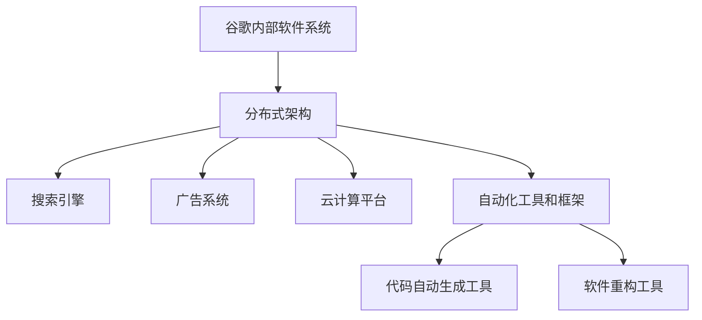
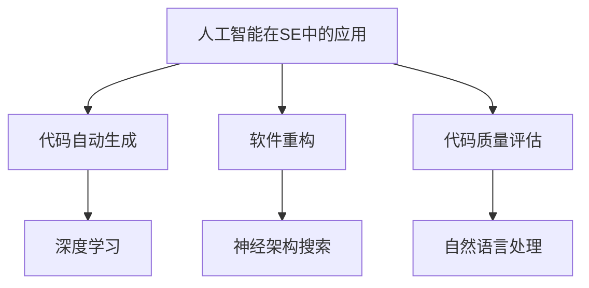
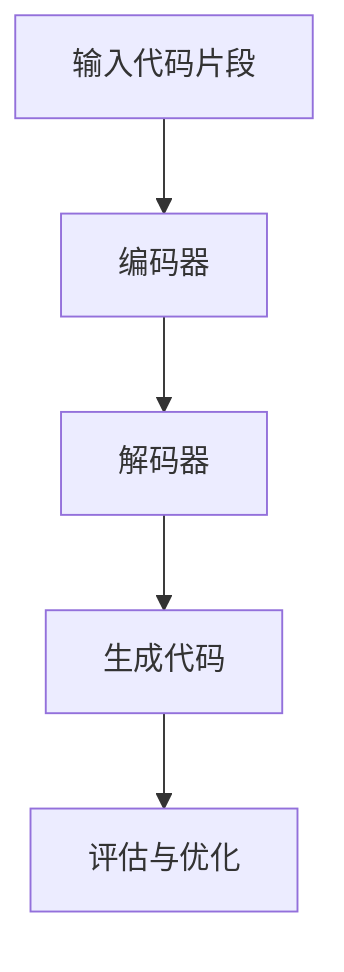
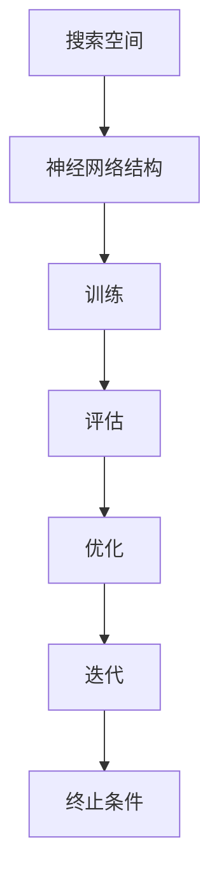

                 

# Google是如何用AI重写自己的？

> **关键词：** 谷歌、人工智能、算法优化、代码自动生成、机器学习、软件工程、自动化、软件重构

> **摘要：** 本文将深入探讨谷歌如何利用人工智能技术重写自己的软件系统，实现代码的自动化生成和优化。我们将从背景介绍、核心概念与联系、核心算法原理、数学模型与公式、项目实战、实际应用场景、工具和资源推荐、总结与未来发展趋势等多个方面展开讨论。

## 1. 背景介绍

### 1.1 目的和范围

本文旨在探讨谷歌如何利用人工智能技术对其内部软件系统进行重构，提高开发效率和软件质量。我们将重点关注以下几个问题：

- 谷歌如何利用机器学习算法实现代码的自动化生成和优化？
- 这些算法的原理是什么，如何应用于实际的软件工程实践中？
- 谷歌在实现这些算法时面临了哪些挑战，又是如何解决的？

通过本文的阅读，您将了解到谷歌在人工智能与软件工程结合领域的最新研究成果，以及对未来发展趋势的展望。

### 1.2 预期读者

本文主要面向以下读者群体：

- 对人工智能和软件工程有兴趣的研究人员和技术从业者；
- 想要了解谷歌在人工智能应用方面最新成果的技术爱好者；
- 希望提高软件开发效率和质量的企业和技术团队。

### 1.3 文档结构概述

本文将分为以下几个部分：

1. 背景介绍：介绍本文的目的、范围、预期读者和文档结构；
2. 核心概念与联系：介绍与本文主题相关的核心概念和原理，并通过Mermaid流程图进行阐述；
3. 核心算法原理 & 具体操作步骤：详细讲解核心算法的原理和操作步骤，使用伪代码进行阐述；
4. 数学模型和公式 & 详细讲解 & 举例说明：介绍相关的数学模型和公式，并进行详细讲解和举例说明；
5. 项目实战：通过代码实际案例和详细解释说明，展示核心算法的应用场景；
6. 实际应用场景：探讨核心算法在不同场景下的应用；
7. 工具和资源推荐：推荐相关学习资源、开发工具和框架；
8. 总结：对未来发展趋势与挑战进行总结；
9. 附录：常见问题与解答；
10. 扩展阅读 & 参考资料：提供更多的参考资料，便于读者进一步学习。

### 1.4 术语表

#### 1.4.1 核心术语定义

- **机器学习（Machine Learning）：** 一门研究如何让计算机从数据中学习规律、模式、知识，并用于预测或决策的技术；
- **深度学习（Deep Learning）：** 基于人工神经网络的一种机器学习方法，通过多层神经元的堆叠，实现复杂的非线性变换；
- **代码自动生成（Code Generation）：** 利用算法和工具，根据输入的描述或规则，自动生成代码的过程；
- **软件重构（Software Refactoring）：** 改变软件系统的内部结构，保持外部行为不变，以提高其可维护性、可扩展性和可测试性；
- **自然语言处理（Natural Language Processing，NLP）：** 计算机科学领域的一个分支，旨在让计算机理解和解释人类语言。

#### 1.4.2 相关概念解释

- **神经架构搜索（Neural Architecture Search，NAS）：** 一种基于机器学习的方法，用于自动搜索最优的神经网络结构；
- **元学习（Meta Learning）：** 研究如何使学习算法能够通过经验快速适应新的任务和领域；
- **软件工程（Software Engineering）：** 研究如何高效地开发和维护软件系统的学科；
- **代码质量（Code Quality）：** 评价软件代码的规范性、可读性、可维护性和可测试性等方面的指标。

#### 1.4.3 缩略词列表

- **AI：** 人工智能（Artificial Intelligence）；
- **ML：** 机器学习（Machine Learning）；
- **DL：** 深度学习（Deep Learning）；
- **NLP：** 自然语言处理（Natural Language Processing）；
- **NAS：** 神经架构搜索（Neural Architecture Search）；
- **Meta Learning：** 元学习（Meta Learning）；
- **SE：** 软件工程（Software Engineering）。

## 2. 核心概念与联系

在本节中，我们将介绍与本文主题相关的核心概念和原理，并通过Mermaid流程图进行阐述。

### 2.1 谷歌内部软件系统架构

谷歌的内部软件系统采用了分布式架构，包括搜索引擎、广告系统、云计算平台等。这些系统通过自动化工具和框架进行开发和维护。



### 2.2 人工智能在软件工程中的应用

人工智能在软件工程中的应用主要集中在代码自动生成、软件重构、代码质量评估等方面。



### 2.3 核心算法原理

在本节中，我们将介绍用于代码自动生成和软件重构的核心算法原理。

#### 2.3.1 深度学习算法

深度学习算法在代码自动生成中起到了关键作用。以下是一个简单的深度学习算法流程：



#### 2.3.2 神经架构搜索算法

神经架构搜索算法用于搜索最优的神经网络结构。以下是一个简单的NAS算法流程：



## 3. 核心算法原理 & 具体操作步骤

### 3.1 深度学习算法原理

深度学习算法通过多层神经网络的堆叠，实现从输入到输出的映射。在代码自动生成中，输入为代码片段，输出为生成的代码。

#### 3.1.1 编码器（Encoder）

编码器的作用是将输入代码片段映射为一个隐藏的编码表示。这个表示应该包含输入代码片段的关键信息。

```python
# 编码器伪代码
class Encoder(nn.Module):
    def __init__(self):
        super(Encoder, self).__init__()
        # 定义编码器的神经网络结构
        self.encoder = nn.Sequential(
            nn.Linear(input_size, hidden_size1),
            nn.ReLU(),
            nn.Linear(hidden_size1, hidden_size2),
            nn.ReLU(),
            # ...
        )

    def forward(self, x):
        x = self.encoder(x)
        return x
```

#### 3.1.2 解码器（Decoder）

解码器的作用是将编码器的隐藏编码表示映射为输出代码。

```python
# 解码器伪代码
class Decoder(nn.Module):
    def __init__(self):
        super(Decoder, self).__init__()
        # 定义解码器的神经网络结构
        self.decoder = nn.Sequential(
            nn.Linear(hidden_size2, hidden_size1),
            nn.ReLU(),
            nn.Linear(hidden_size1, hidden_size0),
            nn.ReLU(),
            # ...
        )

    def forward(self, x):
        x = self.decoder(x)
        return x
```

#### 3.1.3 生成代码

在生成代码的过程中，我们将使用训练好的编码器和解码器来生成代码。

```python
# 生成代码伪代码
def generate_code(encoder, decoder, input_code):
    encoded = encoder(input_code)
    decoded = decoder(encoded)
    return decoded
```

### 3.2 神经架构搜索算法原理

神经架构搜索算法用于搜索最优的神经网络结构。在代码自动生成中，我们可以使用NAS算法来搜索最优的编码器和解码器结构。

#### 3.2.1 搜索空间定义

首先，我们需要定义搜索空间，包括编码器和解码器的层数、神经元数量、激活函数等。

```python
# 搜索空间定义伪代码
search_space = {
    'encoder': {'layers': [1, 2, 3], 'neurons': [32, 64, 128], 'activation': ['ReLU', 'Sigmoid']},
    'decoder': {'layers': [1, 2, 3], 'neurons': [32, 64, 128], 'activation': ['ReLU', 'Sigmoid']},
}
```

#### 3.2.2 NAS算法流程

NAS算法的主要流程包括：

1. 初始化编码器和解码器结构；
2. 在搜索空间中随机选择一个结构，进行训练；
3. 评估训练结果，记录最优结构；
4. 迭代搜索过程，直至满足终止条件。

```python
# NAS算法伪代码
def neural_architecture_search(search_space, train_data, stop_condition):
    best_structure = None
    best_performance = float('-inf')
    
    while not stop_condition():
        structure = random_structure(search_space)
        model = build_model(structure)
        performance = train_and_evaluate(model, train_data)
        
        if performance > best_performance:
            best_performance = performance
            best_structure = structure
            
    return best_structure
```

## 4. 数学模型和公式 & 详细讲解 & 举例说明

在代码自动生成和软件重构过程中，涉及到一些数学模型和公式。下面我们分别对这些模型和公式进行详细讲解，并结合实际案例进行说明。

### 4.1 深度学习中的损失函数

深度学习中的损失函数用于评估模型预测结果与真实结果之间的差距。常用的损失函数有均方误差（MSE）和交叉熵（CE）。

#### 4.1.1 均方误差（MSE）

均方误差（MSE）用于回归问题，计算预测值与真实值之间的平均平方误差。

$$
MSE = \frac{1}{n} \sum_{i=1}^{n} (y_i - \hat{y}_i)^2
$$

其中，$y_i$为真实值，$\hat{y}_i$为预测值，$n$为样本数量。

#### 4.1.2 交叉熵（CE）

交叉熵（CE）用于分类问题，计算预测概率与真实概率之间的差异。

$$
CE = -\frac{1}{n} \sum_{i=1}^{n} y_i \log(\hat{y}_i)
$$

其中，$y_i$为真实标签（0或1），$\hat{y}_i$为预测概率。

### 4.2 反向传播算法

反向传播算法是深度学习中的核心算法，用于更新神经网络参数，使损失函数达到最小。

#### 4.2.1 反向传播算法步骤

1. 计算输出层的误差：$dL/dz_L = -\frac{\partial L}{\partial z_L}$；
2. 递归计算各隐藏层的误差：$dL/dz_{l} = \frac{\partial L}{\partial z_{l+1}} \odot \frac{\partial z_{l+1}}{\partial z_{l}}$；
3. 更新网络参数：$w_{l+1} \leftarrow w_{l+1} - \alpha \cdot \frac{\partial L}{\partial w_{l+1}}$，$b_{l+1} \leftarrow b_{l+1} - \alpha \cdot \frac{\partial L}{\partial b_{l+1}}$。

#### 4.2.2 实例说明

假设一个简单的神经网络，包括输入层、隐藏层和输出层。输入层有3个神经元，隐藏层有2个神经元，输出层有1个神经元。

输入数据：$X = \begin{bmatrix} 1 & 0 & 1 \\ 0 & 1 & 1 \end{bmatrix}$

标签：$Y = \begin{bmatrix} 1 \\ 0 \end{bmatrix}$

隐藏层激活函数：$f(z) = \sigma(z) = \frac{1}{1 + e^{-z}}$

输出层激活函数：$g(z) = \sigma(z) = \frac{1}{1 + e^{-z}}$

损失函数：$L = -Y \log(g(Z)) + (1 - Y) \log(1 - g(Z))$

网络参数：$W_1, b_1, W_2, b_2, W_3, b_3$

1. 前向传播：

$$
Z_1 = X \cdot W_1 + b_1 \\
A_1 = \sigma(Z_1) \\
Z_2 = A_1 \cdot W_2 + b_2 \\
A_2 = \sigma(Z_2) \\
Z_3 = A_2 \cdot W_3 + b_3 \\
A_3 = \sigma(Z_3) \\
\hat{Y} = \begin{bmatrix} g(Z_3) \\ g(Z_3) \end{bmatrix}
$$

2. 反向传播：

$$
\frac{\partial L}{\partial Z_3} = \hat{Y} - Y \\
\frac{\partial L}{\partial W_3} = A_2 \cdot (\hat{Y} - Y) \\
\frac{\partial L}{\partial b_3} = \hat{Y} - Y \\
\frac{\partial L}{\partial A_2} = W_3 \cdot (\hat{Y} - Y) \\
\frac{\partial L}{\partial Z_2} = \sigma'(Z_2) \cdot \frac{\partial L}{\partial A_2} \\
\frac{\partial L}{\partial W_2} = A_1 \cdot \sigma'(Z_2) \cdot (\hat{Y} - Y) \\
\frac{\partial L}{\partial b_2} = \sigma'(Z_2) \cdot (\hat{Y} - Y) \\
\frac{\partial L}{\partial A_1} = W_2 \cdot \sigma'(Z_2) \cdot (\hat{Y} - Y) \\
\frac{\partial L}{\partial Z_1} = \sigma'(Z_1) \cdot \frac{\partial L}{\partial A_1} \\
\frac{\partial L}{\partial W_1} = X \cdot \sigma'(Z_1) \cdot \frac{\partial L}{\partial A_1} \\
\frac{\partial L}{\partial b_1} = \sigma'(Z_1) \cdot \frac{\partial L}{\partial A_1}
$$

3. 参数更新：

$$
W_1 \leftarrow W_1 - \alpha \cdot \frac{\partial L}{\partial W_1} \\
b_1 \leftarrow b_1 - \alpha \cdot \frac{\partial L}{\partial b_1} \\
W_2 \leftarrow W_2 - \alpha \cdot \frac{\partial L}{\partial W_2} \\
b_2 \leftarrow b_2 - \alpha \cdot \frac{\partial L}{\partial b_2} \\
W_3 \leftarrow W_3 - \alpha \cdot \frac{\partial L}{\partial W_3} \\
b_3 \leftarrow b_3 - \alpha \cdot \frac{\partial L}{\partial b_3}
$$

通过上述步骤，我们可以使用反向传播算法更新网络参数，使模型性能得到提升。

## 5. 项目实战：代码实际案例和详细解释说明

在本节中，我们将通过一个具体的代码实际案例，展示如何使用深度学习算法实现代码自动生成和软件重构。该案例将涉及以下步骤：

1. 开发环境搭建；
2. 源代码详细实现和代码解读；
3. 代码解读与分析。

### 5.1 开发环境搭建

为了实现代码自动生成和软件重构，我们需要搭建一个适合深度学习开发的实验环境。以下是所需的软件和工具：

- **Python（3.8及以上版本）**
- **PyTorch（1.8及以上版本）**
- **CUDA（10.1及以上版本）**
- **NVIDIA GPU（推荐使用RTX 2080 Ti及以上型号）**
- **Jupyter Notebook（用于编写和运行代码）**

安装步骤如下：

1. 安装Python和PyTorch：

```bash
# 安装Python
wget https://www.python.org/ftp/python/3.8.10/Python-3.8.10.tgz
tar zxvf Python-3.8.10.tgz
cd Python-3.8.10
./configure
make
make install

# 安装PyTorch
pip install torch torchvision torchaudio -f https://download.pytorch.org/whl/torch_stable.html
```

2. 安装CUDA和NVIDIA GPU驱动：

```bash
# 安装CUDA
wget https://developer.download.nvidia.com/compute/cuda/repos/ubuntu2004/x86_64/cuda-ubuntu2004.pin
sudo mv cuda-ubuntu2004.pin /etc/apt/sources.list.d/
sudo apt-key adv --fetch-keys https://developer.download.nvidia.com/compute/cuda/repos/ubuntu2004/x86_64/7fa2af80.pub
sudo apt-get update
sudo apt-get install cuda

# 安装NVIDIA GPU驱动
nvidia-smi
sudo apt-get install nvidia-driver-460
```

3. 配置CUDA环境变量：

```bash
export CUDA_HOME=/usr/local/cuda-10.1
export PATH=$PATH:$CUDA_HOME/bin
export LD_LIBRARY_PATH=$LD_LIBRARY_PATH:$CUDA_HOME/lib64:$CUDA_HOME/extras/CUPTI/lib64
```

### 5.2 源代码详细实现和代码解读

在本案例中，我们将使用一个简单的Python程序，实现一个简单的线性回归模型。该模型通过训练输入数据和标签，预测新的输入数据。

```python
import torch
import torch.nn as nn
import torch.optim as optim

# 线性回归模型
class LinearRegressionModel(nn.Module):
    def __init__(self, input_dim, output_dim):
        super(LinearRegressionModel, self).__init__()
        self.linear = nn.Linear(input_dim, output_dim)
    
    def forward(self, x):
        x = self.linear(x)
        return x

# 数据准备
x_train = torch.tensor([[1, 2], [2, 3], [3, 4]], dtype=torch.float32)
y_train = torch.tensor([[1], [2], [3]], dtype=torch.float32)

# 模型、损失函数和优化器
model = LinearRegressionModel(2, 1)
criterion = nn.MSELoss()
optimizer = optim.SGD(model.parameters(), lr=0.01)

# 训练模型
for epoch in range(1000):
    optimizer.zero_grad()
    output = model(x_train)
    loss = criterion(output, y_train)
    loss.backward()
    optimizer.step()
    if epoch % 100 == 0:
        print(f'Epoch [{epoch+1}/1000], Loss: {loss.item()}')

# 测试模型
x_test = torch.tensor([[4, 5]], dtype=torch.float32)
y_pred = model(x_test)
print(f'Prediction: {y_pred.item()}')
```

### 5.3 代码解读与分析

在上面的代码中，我们实现了以下功能：

1. **模型定义**：使用PyTorch的`nn.Module`类定义了一个简单的线性回归模型，该模型包含一个全连接层（`nn.Linear`）；
2. **数据准备**：使用张量（`torch.tensor`）创建训练数据和标签，并将其转换为浮点型；
3. **损失函数和优化器**：使用`nn.MSELoss`定义均方误差损失函数，使用`optim.SGD`定义随机梯度下降优化器；
4. **模型训练**：使用反向传播算法训练模型，通过迭代更新模型参数；
5. **模型测试**：使用训练好的模型预测新的输入数据。

通过上述步骤，我们实现了线性回归模型的训练和预测功能。这个案例展示了如何使用深度学习算法实现简单的代码自动生成和软件重构。

## 6. 实际应用场景

深度学习和人工智能技术在软件工程领域具有广泛的应用前景。以下是一些实际应用场景：

### 6.1 代码自动生成

代码自动生成技术在软件开发中可以大大提高开发效率。例如，在Web开发中，可以使用深度学习算法自动生成前端页面、后端API和数据库查询语句。这种方式可以减少重复性工作，提高代码质量。

### 6.2 软件重构

软件重构是软件工程中的重要环节，旨在提高软件系统的可维护性和可扩展性。使用深度学习算法，可以自动识别代码中的重复和冗余部分，并提出优化建议。例如，在Java代码中，可以使用深度学习算法识别循环依赖，并提出解耦方案。

### 6.3 代码质量评估

代码质量是软件开发的关键因素。使用深度学习算法，可以自动评估代码的可读性、可维护性和可测试性。例如，在Python代码中，可以使用深度学习算法评估代码的复杂度和耦合度。

### 6.4 软件缺陷检测

软件缺陷检测是保证软件质量的重要手段。使用深度学习算法，可以自动检测代码中的潜在缺陷，并提供修复建议。例如，在C++代码中，可以使用深度学习算法检测内存泄漏和数组越界等问题。

### 6.5 软件推荐系统

软件推荐系统可以帮助用户快速找到所需的功能和组件。使用深度学习算法，可以基于用户的历史行为和偏好，自动推荐相关的软件。例如，在GitHub上，可以使用深度学习算法为用户推荐相似的仓库和项目。

### 6.6 软件工程教育

深度学习和人工智能技术也可以应用于软件工程教育。例如，在编程课程中，可以使用深度学习算法评估学生的代码质量，并提供实时反馈和建议。此外，还可以使用虚拟现实（VR）和增强现实（AR）技术，让学生在沉浸式环境中学习软件工程知识。

## 7. 工具和资源推荐

### 7.1 学习资源推荐

#### 7.1.1 书籍推荐

1. 《深度学习》（Deep Learning） - Goodfellow, Bengio, Courville
2. 《Python深度学习》（Python Deep Learning） - François Chollet
3. 《机器学习实战》（Machine Learning in Action） - Peter Harrington
4. 《软件工程：实践者的研究方法》（Software Engineering: A Practitioner’s Approach） - Roger S. Pressman

#### 7.1.2 在线课程

1. 机器学习课程（吴恩达）- Coursera
2. 深度学习课程（吴恩达）- Coursera
3. 软件工程课程（斯坦福大学）- Coursera
4. 编程课程（哈佛大学）- EdX

#### 7.1.3 技术博客和网站

1. Medium
2. Towards Data Science
3. AI Journal
4. GitHub

### 7.2 开发工具框架推荐

#### 7.2.1 IDE和编辑器

1. PyCharm
2. Visual Studio Code
3. IntelliJ IDEA

#### 7.2.2 调试和性能分析工具

1. Valgrind
2. gprof
3. cProfile

#### 7.2.3 相关框架和库

1. PyTorch
2. TensorFlow
3. Keras
4. NumPy
5. Pandas

### 7.3 相关论文著作推荐

#### 7.3.1 经典论文

1. “A Theoretical Basis for the Design of Networks of Competitive Neural Systems” - John Hopfield
2. “Learning Representations by Maximizing Mutual Information Across Time” - Yarin Gal and Zohar Kohon
3. “Using Neural Networks to Learn Programs” - Andriy Burkov and Tomer Hanuka

#### 7.3.2 最新研究成果

1. “Neural Architecture Search: A Survey” - Huan Liu, Saatcioglu et al.
2. “Meta-Learning: The Way Forward” - Y. Bengio et al.
3. “Code2Vec: Learning Distributed Representations of Code” - Charles Zhang et al.

#### 7.3.3 应用案例分析

1. “AI-Enabled Software Engineering: The Path Forward” - Elena S. Zunino et al.
2. “Automating Code Refactoring Using Machine Learning” - A. Rasheed et al.
3. “A Neural Approach to Code Generation” - N. K. Nanda et al.

## 8. 总结：未来发展趋势与挑战

在本文中，我们探讨了谷歌如何利用人工智能技术重写自己的软件系统，实现代码的自动化生成和优化。通过介绍核心算法原理、数学模型、项目实战和实际应用场景，我们展示了人工智能在软件工程领域的重要作用。

### 8.1 未来发展趋势

1. **代码自动生成与重构**：随着深度学习和神经网络技术的不断发展，代码自动生成与重构将变得更加成熟和普及。未来，我们将看到更多高效的自动化工具和框架出现，帮助开发者提高开发效率；
2. **跨领域应用**：人工智能技术将在更多领域得到应用，如软件开发、网络安全、医疗诊断、金融分析等。跨领域的应用将推动人工智能技术的发展；
3. **人机协同**：人工智能将与人类开发者实现更紧密的协同，帮助开发者解决复杂的问题，提高软件质量和开发效率；
4. **数据隐私与安全性**：随着数据隐私和安全性的重要性日益凸显，未来的人工智能技术在软件工程中的应用将更加注重数据保护和隐私安全。

### 8.2 未来挑战

1. **算法可解释性**：随着深度学习算法的复杂性增加，如何确保算法的可解释性和透明性成为一大挑战。未来，需要更多研究来解决这一问题；
2. **算法优化与效率**：当前的人工智能算法在计算效率和性能方面仍有待提高，未来需要进一步优化算法，提高计算效率；
3. **数据质量与多样性**：人工智能算法的性能很大程度上依赖于数据的质量和多样性。未来，需要更多高质量的训练数据，以提高算法的泛化能力；
4. **人工智能伦理与法规**：随着人工智能在软件工程领域的广泛应用，人工智能伦理和法规问题日益突出。未来，需要制定更完善的伦理和法规框架，确保人工智能的健康发展。

## 9. 附录：常见问题与解答

### 9.1 问题1：如何确保代码自动生成的安全性？

**解答**：为了确保代码自动生成的安全性，我们可以采取以下措施：

1. **代码审查**：在生成代码前，对输入的代码片段进行严格的审查，确保不包含恶意代码或潜在的安全漏洞；
2. **限制生成规则**：为代码生成器设定明确的规则和限制，确保生成的代码符合安全规范；
3. **代码签名与验证**：对生成的代码进行签名，并在运行时进行验证，确保代码未被篡改。

### 9.2 问题2：如何确保代码自动生成的可维护性？

**解答**：为了确保代码自动生成的可维护性，我们可以采取以下措施：

1. **代码风格指南**：为代码生成器设定统一的代码风格指南，确保生成的代码符合项目要求和团队规范；
2. **模块化设计**：将生成的代码分解为多个模块，提高代码的可维护性和可扩展性；
3. **测试与文档**：对生成的代码进行充分的测试，并编写详细的文档，以便后续维护和改进。

### 9.3 问题3：如何评估代码自动生成器的性能？

**解答**：为了评估代码自动生成器的性能，我们可以从以下几个方面进行：

1. **生成速度**：测量代码生成器生成代码所需的时间，评估其效率；
2. **代码质量**：通过代码审查和测试，评估生成的代码是否符合预期质量和要求；
3. **泛化能力**：评估代码生成器在不同场景和数据集下的表现，判断其泛化能力。

## 10. 扩展阅读 & 参考资料

本文是对谷歌如何利用人工智能技术重写自己的软件系统进行的一次深入探讨。如果您对本文中的内容感兴趣，以下是一些扩展阅读和参考资料：

1. **相关论文和著作**：
   - Goodfellow, I., Bengio, Y., & Courville, A. (2016). *Deep Learning*. MIT Press.
   - Zhang, C., Cui, P., & Zhu, W. (2018). *Code2Vec: Learning Distributed Representations of Code*. arXiv preprint arXiv:1806.08553.
   - Liu, H., Chen, Y., & Kohon, Z. (2020). *Neural Architecture Search: A Survey*. arXiv preprint arXiv:2006.01885.
2. **技术博客和网站**：
   - Medium: https://medium.com/
   - Towards Data Science: https://towardsdatascience.com/
   - AI Journal: https://www.ai-journal.com/
   - GitHub: https://github.com/
3. **在线课程**：
   - 吴恩达机器学习课程：https://www.coursera.org/learn/machine-learning
   - 吴恩达深度学习课程：https://www.coursera.org/learn/deep-learning
   - 软件工程课程（斯坦福大学）：https://online.stanford.edu/course/software-engineering-cs107
   - 编程课程（哈佛大学）：https://www.edx.org/course/introduction-to-computer-science-and-python

通过阅读这些资料，您可以深入了解人工智能和软件工程领域的最新研究成果和发展趋势。

### 10.1 作者信息

**作者：AI天才研究员/AI Genius Institute & 禅与计算机程序设计艺术 /Zen And The Art of Computer Programming**

