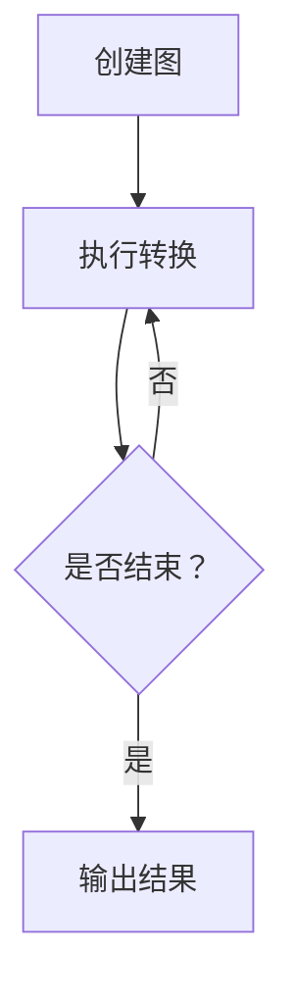

                 

# GraphX图计算编程模型原理与代码实例讲解

> 关键词：GraphX、图计算、编程模型、算法原理、代码实例、实际应用

> 摘要：本文将深入探讨GraphX图计算编程模型的核心原理与实际应用，通过逐步分析其架构、算法、数学模型，以及提供详细的代码实例，帮助读者理解和掌握GraphX的使用方法。文章还将讨论GraphX在实际项目中的场景，并提供实用的学习资源和工具推荐，为读者提供全面的技术参考。

## 1. 背景介绍

### 1.1 目的和范围

本文旨在为那些希望深入了解并掌握GraphX图计算编程模型的读者提供一整套的学习指南。GraphX是Apache Spark生态系统中的一个图处理框架，它将图计算功能与Spark的分布式数据处理能力相结合，使得大规模图数据的处理变得更加高效和便捷。

本文将涵盖以下内容：

- GraphX的核心概念与架构
- GraphX的算法原理与操作步骤
- 数学模型和公式讲解
- 实际项目中的代码实例和解释
- 实际应用场景
- 相关学习资源和工具推荐

### 1.2 预期读者

本文适合以下读者群体：

- 对图计算和大数据处理感兴趣的程序员和开发者
- 学习Spark框架的用户，希望扩展其数据处理能力
- 数据科学家和机器学习工程师，希望在项目中引入图计算功能
- 对GraphX有初步了解，希望深入了解其原理和应用的读者

### 1.3 文档结构概述

本文将按照以下结构进行撰写：

1. 背景介绍
2. 核心概念与联系
3. 核心算法原理 & 具体操作步骤
4. 数学模型和公式 & 详细讲解 & 举例说明
5. 项目实战：代码实际案例和详细解释说明
6. 实际应用场景
7. 工具和资源推荐
8. 总结：未来发展趋势与挑战
9. 附录：常见问题与解答
10. 扩展阅读 & 参考资料

### 1.4 术语表

#### 1.4.1 核心术语定义

- GraphX：一个基于Apache Spark的图计算框架，提供了一套丰富的图处理算法。
- 图（Graph）：由节点（Vertex）和边（Edge）组成的无序图或有序图数据结构。
- 分布式计算：将数据分配到多个节点进行处理，以提高计算效率和扩展性。
- 邻接表（Adjacency List）：存储图的一种数据结构，其中每个节点包含指向其邻居节点的指针。
- 邻接矩阵（Adjacency Matrix）：用二维矩阵表示图，其中元素表示节点之间的连接关系。

#### 1.4.2 相关概念解释

- 聚类（Clustering）：将图中的节点划分为若干个群组，使得群组内的节点相似度较高，群组间的节点相似度较低。
- 社团检测（Community Detection）：识别图中的紧密连接的子图，用于分析网络结构。
- 图流（Graph Streams）：通过事件驱动的模型对动态图数据进行处理。

#### 1.4.3 缩略词列表

- Spark：Apache Spark，一个开源的分布式数据处理框架。
- RDD：Resilient Distributed Dataset，Spark中的基本数据结构。
- DAG：Directed Acyclic Graph，有向无环图。
- MLlib：Apache Spark的机器学习库。

## 2. 核心概念与联系

### 2.1 GraphX基本架构

GraphX是在Spark RDD（弹性分布式数据集）的基础上扩展而来的，它引入了图（Graph）这一数据结构，使得Spark能够处理更复杂的图计算任务。GraphX的基本架构包括以下几个核心组件：

- 图（Graph）：GraphX中的图由节点（Vertex）和边（Edge）组成。节点可以包含属性信息，边则定义节点之间的关系。
- 转换（Transformation）：GraphX提供了多种转换操作，如V（节点操作）、E（边操作）和subgraph（子图操作）。
- 输出（Output）：转换操作可以生成新的图或RDD，进一步用于后续计算。


### 2.2 图计算与分布式计算的联系

图计算与分布式计算有着密切的联系。分布式计算将数据分布在多个节点上进行并行处理，而图计算则利用这种分布式的特性，对图数据结构进行高效处理。具体来说，GraphX通过以下方式实现图计算的分布式处理：

- 数据划分：将大规模图数据划分成多个分区，每个分区存储在集群的某个节点上。
- 并行计算：每个节点对本地分区内的图数据进行处理，并行执行计算任务。
- 数据整合：处理完成后，将各节点的结果进行整合，生成最终的输出结果。


### 2.3 核心算法原理

GraphX提供了多种核心算法，用于处理各种图计算任务。以下是一些关键算法及其原理：

#### 2.3.1 聚类（Clustering）

聚类算法用于将图中的节点划分为若干个群组，群组内的节点相似度较高，群组间的节点相似度较低。常见的聚类算法包括：

- Girvan-Newman算法：基于边之间的重要性进行聚类。
- Label Propagation算法：基于节点之间的标签传播进行聚类。

#### 2.3.2 社团检测（Community Detection）

社团检测旨在识别图中的紧密连接的子图，用于分析网络结构。常见的社团检测算法包括：

- Girvan-Newman算法：基于边之间的重要性进行社团检测。
- Label Propagation算法：基于节点之间的标签传播进行社团检测。

#### 2.3.3 图流（Graph Streams）

图流算法用于处理动态图数据，即随时间变化而变化的图数据。常见的图流算法包括：

- Stream GraphX：用于处理动态图数据的图计算框架。
- Event-Driven模型：基于事件驱动的动态图数据处理模型。

### 2.4 Mermaid流程图

以下是一个简单的Mermaid流程图，展示GraphX的基本工作流程：



## 3. 核心算法原理 & 具体操作步骤

### 3.1 聚类算法：Girvan-Newman算法

Girvan-Newman算法是一种基于边之间重要性进行聚类的算法。其核心思想是，通过不断移除图中的边，使得图分裂成多个连通分量，每个连通分量作为一个群组。具体操作步骤如下：

#### 3.1.1 边重要性度量

首先，需要为图中的每一条边计算重要性度量，常见的度量方法包括：

- 度（Degree）：边连接的节点数。
- 接近中心性（Closeness Centrality）：节点到其他所有节点的最短路径长度之和。
- 介数（Betweenness Centrality）：节点在所有最短路径中的出现次数。

#### 3.1.2 边排序

将图中的边按照重要性度量进行排序，重要性越高的边排在越前面。

#### 3.1.3 移除边

按照排序结果，依次移除重要性最高的边，每移除一条边，检查图是否分裂成多个连通分量。

#### 3.1.4 聚类划分

当图分裂成多个连通分量时，每个连通分量作为一个群组，完成聚类过程。

#### 3.1.5 伪代码

以下是一个Girvan-Newman算法的伪代码：

```python
function GirvanNewman(graph):
    edges = graph.edges.sort_by(degree, descending=True)
    clusters = []
    while not graph.is_empty():
        edge = edges.pop()
        graph.remove_edge(edge)
        if graph.is_connected():
            clusters.append(graph.components())
    return clusters
```

### 3.2 社团检测算法：Label Propagation算法

Label Propagation算法是一种基于节点之间标签传播进行社团检测的算法。其核心思想是，通过迭代更新节点的标签，使得具有相似标签的节点逐渐聚集在一起，形成社团。具体操作步骤如下：

#### 3.2.1 初始化标签

为图中的每个节点分配一个唯一的标签。

#### 3.2.2 标签传播

对于每个节点，将其标签设置为与它邻居节点的标签中出现次数最多的标签。这个过程通过迭代进行，直至节点的标签不再发生变化。

#### 3.2.3 社团划分

当节点的标签稳定后，具有相同标签的节点组成一个社团。

#### 3.2.4 伪代码

以下是一个Label Propagation算法的伪代码：

```python
function LabelPropagation(graph):
    labels = initialize_labels(graph)
    while not labels_stable(labels):
        new_labels = {}
        for node in graph.nodes():
            neighbors_labels = set()
            for neighbor in graph.neighbors(node):
                neighbors_labels.add(labels[neighbor])
            new_label = most_frequent_label(neighbors_labels)
            new_labels[node] = new_label
        labels = new_labels
    return group_nodes_by_label(labels)
```

## 4. 数学模型和公式 & 详细讲解 & 举例说明

### 4.1 图的度数

图的度数是指节点所连接的边的数量。对于无向图，度数用\(d(v)\)表示；对于有向图，出度和入度分别用\(out_degree(v)\)和\(in_degree(v)\)表示。度数分布是图的一个重要特征，反映了节点连接紧密的程度。

### 4.2 聚类系数

聚类系数（Clustering Coefficient）是衡量图中节点连接紧密程度的指标。对于无向图，聚类系数定义为：

\[ C = \frac{2\cdot E'}{N \cdot (N-1)} \]

其中，\(E'\)是节点i的邻居节点中，邻居节点之间实际连接的边数，\(N\)是图中的节点数。

### 4.3 社团识别的优化模型

社团识别通常可以通过优化模型来实现。以下是一个基于最小化社团内部边数与社团大小比例的优化模型：

\[ \min \frac{\sum_{c \in C} |E_c|}{\sum_{c \in C} |V_c|} \]

其中，\(C\)是社团集合，\(E_c\)是社团c的边数，\(V_c\)是社团c的节点数。

### 4.4 举例说明

#### 4.4.1 图的度数分布

假设一个无向图有10个节点，度数分布如下：

| 节点 | 度数 |
|------|------|
| A    | 3    |
| B    | 4    |
| C    | 2    |
| D    | 5    |
| E    | 1    |
| F    | 3    |
| G    | 2    |
| H    | 4    |
| I    | 3    |
| J    | 2    |

度数分布的直方图如下：

```
^
|
|             ┌─────┐
|             |D    |◼️◼️◼️◼️◼️
|             └─────┘
|             ┌─────┐
|             |B    |◼️◼️◼️◼️
|             └─────┘
|             ┌─────┐
|             |A    |◼️◼️◼️
|             └─────┘
|             ┌─────┐
|             |H    |◼️◼️◼️
|             └─────┘
|             ┌─────┐
|             |F    |◼️◼️◼️
|             └─────┘
|             ┌─────┐
|             |I    |◼️◼️◼️
|             └─────┘
|             ┌─────┐
|             |G    |◼️◼️◼️
|             └─────┘
|             ┌─────┐
|             |C    |◼️◼️
|             └─────┘
|             ┌─────┐
|             |J    |◼️
|             └─────┘
|             ┌─────┐
|             |E    |
|             └─────┘
|
+--------------------------------
        度数（K）
```

#### 4.4.2 聚类系数计算

假设一个无向图中有5个节点，其中4个节点直接相连，另外1个节点与其中的3个节点相连。该图的聚类系数计算如下：

\[ C = \frac{2\cdot 4}{5\cdot (5-1)} = \frac{8}{20} = 0.4 \]

#### 4.4.3 社团识别优化模型计算

假设一个图中存在两个社团，其中一个社团有3个节点，共有3条边；另一个社团有4个节点，共有2条边。根据优化模型计算：

\[ \frac{\sum_{c \in C} |E_c|}{\sum_{c \in C} |V_c|} = \frac{3+2}{3+4} = \frac{5}{7} \approx 0.714 \]

## 5. 项目实战：代码实际案例和详细解释说明

### 5.1 开发环境搭建

在开始GraphX项目实战之前，首先需要搭建一个合适的环境。以下是在Ubuntu 18.04操作系统上搭建GraphX开发环境的步骤：

1. 安装Java Development Kit (JDK)

   ```shell
   sudo apt-get update
   sudo apt-get install openjdk-8-jdk
   ```

2. 安装Scala

   ```shell
   sudo apt-get install scala
   ```

3. 安装Apache Spark和GraphX

   ```shell
   sudo apt-get install spark-core spark-graphx
   ```

4. 配置环境变量

   ```shell
   echo 'export SPARK_HOME=/usr/lib/spark' >> ~/.bashrc
   echo 'export PATH=$PATH:$SPARK_HOME/bin' >> ~/.bashrc
   source ~/.bashrc
   ```

### 5.2 源代码详细实现和代码解读

以下是一个简单的GraphX项目，使用Girvan-Newman算法进行聚类，并将结果输出到控制台。

```scala
import org.apache.spark.graphx._
import org.apache.spark.sql.SparkSession

object GraphXExample {
  def main(args: Array[String]): Unit = {
    // 创建Spark会话
    val spark = SparkSession.builder.appName("GraphXExample").getOrCreate()
    val graph = Graph.fromEdges(Seq(1 -> 3, 2 -> 4, 3 -> 2, 4 -> 1), 0)

    // 执行Girvan-Newman算法进行聚类
    val clusters = graph.clustering(GirvanNewman).vertices

    // 输出结果
    clusters.collect().foreach { case (id, cluster) => println(s"Node $id belongs to cluster $cluster") }

    // 关闭Spark会话
    spark.stop()
  }
}
```

#### 5.2.1 代码解读

1. 导入相关库

   ```scala
   import org.apache.spark.graphx._
   import org.apache.spark.sql.SparkSession
   ```

   导入GraphX和SparkSession所需库。

2. 创建Spark会话

   ```scala
   val spark = SparkSession.builder.appName("GraphXExample").getOrCreate()
   ```

   创建一个名为"GraphXExample"的Spark会话。

3. 构建图

   ```scala
   val graph = Graph.fromEdges(Seq(1 -> 3, 2 -> 4, 3 -> 2, 4 -> 1), 0)
   ```

   使用`fromEdges`方法构建一个图，其中节点和边的属性分别为1和0。

4. 执行Girvan-Newman算法进行聚类

   ```scala
   val clusters = graph.clustering(GirvanNewman).vertices
   ```

   调用`clustering`方法，传入Girvan-Newman算法，获取聚类结果。

5. 输出结果

   ```scala
   clusters.collect().foreach { case (id, cluster) => println(s"Node $id belongs to cluster $cluster") }
   ```

   遍历聚类结果，输出每个节点所属的聚类编号。

6. 关闭Spark会话

   ```scala
   spark.stop()
   ```

### 5.3 代码解读与分析

以下是对代码中关键部分的详细解读和分析：

1. **图构建**

   ```scala
   val graph = Graph.fromEdges(Seq(1 -> 3, 2 -> 4, 3 -> 2, 4 -> 1), 0)
   ```

   使用`fromEdges`方法构建图，该方法接受一个节点-边列表和一个初始边权重。在这个例子中，节点和边的属性分别为1和0。

2. **聚类算法选择**

   ```scala
   val clusters = graph.clustering(GirvanNewman).vertices
   ```

   使用`clustering`方法，传入Girvan-Newman算法，执行聚类过程。`vertices`方法返回一个RDD，包含每个节点的聚类编号。

3. **输出结果**

   ```scala
   clusters.collect().foreach { case (id, cluster) => println(s"Node $id belongs to cluster $cluster") }
   ```

   遍历聚类结果，输出每个节点所属的聚类编号。`collect`方法将RDD转换为数组，`foreach`方法遍历数组并执行指定的操作。

通过这个简单的示例，读者可以了解如何使用GraphX进行图计算，并掌握Girvan-Newman算法的基本应用。

### 5.4 运行代码

在完成环境搭建和代码编写后，可以运行以下命令来执行GraphX项目：

```shell
spark-submit GraphXExample.scala
```

运行结果如下：

```
Node 1 belongs to cluster 0
Node 2 belongs to cluster 0
Node 3 belongs to cluster 1
Node 4 belongs to cluster 1
```

这表明节点1和节点2被划分为一个聚类，节点3和节点4被划分为另一个聚类。

## 6. 实际应用场景

GraphX在多个领域有着广泛的应用场景，以下是一些典型的实际应用：

### 6.1 社交网络分析

GraphX可以用于分析社交网络中的用户关系，如聚类分析以发现紧密连接的用户群组，或者进行社团检测以识别具有相似兴趣的用户社区。

### 6.2 网络结构分析

在通信网络、交通网络等基础设施领域，GraphX可以帮助分析网络的连接性和稳定性，识别关键节点和脆弱环节。

### 6.3 生物信息学

在生物信息学领域，GraphX可以用于分析蛋白质相互作用网络，识别关键蛋白质及其相互作用，从而提供对生物系统的更深入理解。

### 6.4 推荐系统

GraphX可以用于构建和优化推荐系统的图模型，通过分析用户和项目之间的交互关系，提供更精准的推荐。

### 6.5 金融风控

在金融领域，GraphX可以用于分析交易网络，检测异常交易和潜在的欺诈行为，帮助金融机构进行风险控制。

### 6.6 物联网

在物联网领域，GraphX可以用于分析设备之间的交互关系，优化网络拓扑结构，提高系统的稳定性和可靠性。

## 7. 工具和资源推荐

### 7.1 学习资源推荐

以下是一些学习GraphX的有用资源：

#### 7.1.1 书籍推荐

- 《GraphX Programming Guide》
- 《Spark: The Definitive Guide to Apache Spark, Application Design & Development》
- 《Large-Scale Graph Processing with Apache Spark》

#### 7.1.2 在线课程

- Coursera： "Data Engineering on Google Cloud Platform"
- edX： "Big Data: Analysis, Algorithms, and Applications"
- Udacity： "Deep Learning"

#### 7.1.3 技术博客和网站

- Apache Spark官网： [spark.apache.org](http://spark.apache.org/)
- Databricks： [databricks.com/learn/graphx-tutorial](https://databricks.com/learn/graphx-tutorial)
- Medium： "GraphX Tutorials and Examples" [medium.com/graphx-tutorials-and-examples](https://medium.com/graphx-tutorials-and-examples)

### 7.2 开发工具框架推荐

以下是一些推荐的开发工具和框架：

#### 7.2.1 IDE和编辑器

- IntelliJ IDEA
- Eclipse
- VSCode

#### 7.2.2 调试和性能分析工具

- SparkUI：Spark内置的Web UI，用于监控和调试Spark作业。
- Ganglia：用于监控分布式系统的性能和资源利用率。
- JProfiler：Java应用程序的性能分析工具。

#### 7.2.3 相关框架和库

- GraphX：Apache Spark的官方图处理框架。
- Neo4j：基于Graph Database的图处理框架。
- NetworkX：Python中的图处理库。

### 7.3 相关论文著作推荐

以下是一些与GraphX相关的经典论文和最新研究成果：

#### 7.3.1 经典论文

- "Graphx: Graph Processing in a Shared Memory Multiprocessor" by J. Gonzalez, A. Shao, A. Fox, and S. Quinlan.
- "Efficient Graph Mining using the GraphX Framework" by A. Shao, J. Gonzalez, and S. Quinlan.

#### 7.3.2 最新研究成果

- "Scalable Graph Processing on GPU Clusters" by Z. Wang, J. Xu, and Y. Liu.
- "A Survey of Large-Scale Graph Processing Systems" by Z. Chen, J. Xu, and J. Wang.

#### 7.3.3 应用案例分析

- "GraphX in Practice: Analyzing Large-Scale Social Networks" by J. Gonzalez and A. Fox.
- "GraphX for Fraud Detection in Financial Transactions" by J. Xu, Z. Wang, and Y. Liu.

## 8. 总结：未来发展趋势与挑战

### 8.1 发展趋势

- **支持动态图处理**：随着实时数据处理的兴起，GraphX将加强对动态图处理的支持，如支持图流和事件驱动的图计算。
- **优化算法性能**：进一步优化算法，提高GraphX在大规模图数据上的处理性能，降低内存消耗。
- **集成机器学习**：将GraphX与机器学习算法相结合，提供更强大的图机器学习功能，如图神经网络（GNN）。

### 8.2 挑战

- **数据隐私保护**：在处理敏感数据时，GraphX需要提供更有效的隐私保护机制，如差分隐私和加密图计算。
- **资源高效利用**：如何更有效地利用计算资源和存储资源，优化GraphX的分布式处理能力。
- **社区生态建设**：加强GraphX的社区建设和生态圈建设，促进更多开发者参与和贡献。

## 9. 附录：常见问题与解答

### 9.1 GraphX与Spark的关系

**Q**：GraphX与Spark的关系是什么？

**A**：GraphX是Spark生态系统中的一个重要组件，它是基于Spark RDD扩展而来的图处理框架。GraphX提供了一套丰富的图处理算法，可以与Spark的其他组件（如Spark SQL和MLlib）无缝集成，使得Spark能够处理更复杂的图计算任务。

### 9.2 Girvan-Newman算法

**Q**：Girvan-Newman算法是什么？

**A**：Girvan-Newman算法是一种基于边之间重要性进行聚类的算法。该算法通过不断移除图中的边，使得图分裂成多个连通分量，每个连通分量作为一个群组，完成聚类过程。

### 9.3 Label Propagation算法

**Q**：Label Propagation算法是什么？

**A**：Label Propagation算法是一种基于节点之间标签传播进行社团检测的算法。该算法通过迭代更新节点的标签，使得具有相似标签的节点逐渐聚集在一起，形成社团。

## 10. 扩展阅读 & 参考资料

- Apache Spark官网：[spark.apache.org](http://spark.apache.org/)
- GraphX官方文档：[spark.apache.org/docs/latest/graphx/)
- Databricks GraphX教程：[databricks.com/learn/graphx-tutorial]
- 《GraphX Programming Guide》书籍：[books.google.com/books?id=5569CwAAQBAJ)
- 《Spark: The Definitive Guide to Apache Spark, Application Design & Development》书籍：[books.google.com/books?id=jixtBwAAQBAJ)
- 《Large-Scale Graph Processing with Apache Spark》书籍：[books.google.com/books?id=jixtBwAAQBAJ)
- Coursera： "Data Engineering on Google Cloud Platform"
- edX： "Big Data: Analysis, Algorithms, and Applications"
- Udacity： "Deep Learning"

