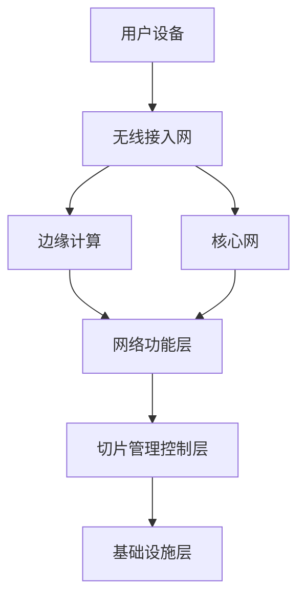

                 

# 5G网络切片技术：为不同应用场景定制网络

> **关键词：** 5G网络切片，网络定制，应用场景，虚拟化，服务质量，资源管理

> **摘要：** 本文深入探讨了5G网络切片技术的核心概念、架构原理、算法实现以及在实际应用中的重要性。通过详细解析网络切片的运作机制，我们揭示了如何通过定制网络资源满足多样化的应用需求，从而推动5G技术在各个行业的广泛应用。文章结构清晰，逻辑严密，旨在为读者提供一份全面而深入的技术指南。

## 1. 背景介绍

### 1.1 目的和范围

本文旨在详细阐述5G网络切片技术的核心概念和关键技术，帮助读者理解这一新兴技术的本质及其在实际应用中的优势。通过本文的阅读，读者将能够：

- 掌握5G网络切片的基本原理和架构。
- 理解网络切片如何满足不同应用场景的需求。
- 分析5G网络切片对提高网络性能和用户体验的影响。
- 了解5G网络切片技术的未来发展趋势和挑战。

### 1.2 预期读者

本文面向的读者包括：

- 从事通信技术研究和开发的工程师。
- 关注5G网络技术的科研人员。
- 对网络虚拟化和资源管理有浓厚兴趣的技术爱好者。
- 需要利用5G网络切片技术解决实际问题的行业从业者。

### 1.3 文档结构概述

本文结构如下：

1. **背景介绍**：介绍5G网络切片技术的目的、范围、预期读者以及文档结构。
2. **核心概念与联系**：定义5G网络切片的核心概念，并使用Mermaid流程图展示架构。
3. **核心算法原理 & 具体操作步骤**：详细讲解网络切片的算法原理，并使用伪代码进行阐述。
4. **数学模型和公式 & 详细讲解 & 举例说明**：介绍网络切片相关的数学模型，并给出具体示例。
5. **项目实战：代码实际案例和详细解释说明**：通过实际代码案例展示网络切片的实现。
6. **实际应用场景**：分析5G网络切片在不同领域的应用。
7. **工具和资源推荐**：推荐学习资源、开发工具和框架。
8. **总结：未来发展趋势与挑战**：探讨5G网络切片技术的未来方向和面临的挑战。
9. **附录：常见问题与解答**：汇总常见问题并提供解答。
10. **扩展阅读 & 参考资料**：推荐进一步学习的相关文献。

### 1.4 术语表

#### 1.4.1 核心术语定义

- **5G网络切片**：5G网络切片是将网络资源抽象化、虚拟化，以便为不同的服务和应用提供定制化的网络环境。
- **网络功能虚拟化**：通过虚拟化技术将传统的网络功能转移到虚拟环境中，实现网络的灵活部署和管理。
- **服务质量（QoS）**：网络为特定流量提供的一组服务等级，包括带宽、延迟、抖动和丢包率等指标。
- **边缘计算**：在靠近数据源或用户的边缘设备上进行的计算和处理，以降低网络延迟和提高数据处理效率。
- **虚拟网络功能（VNF）**：在网络切片中实现的一种虚拟化的网络功能，如防火墙、路由器等。

#### 1.4.2 相关概念解释

- **网络切片需求**：用户或应用程序对网络切片提出的特定性能和服务要求。
- **网络切片实例**：满足特定需求的一个网络切片实现，包括虚拟化网络功能、资源分配和策略配置等。
- **切片管理控制层**：负责管理网络切片的生命周期，包括创建、配置、优化和销毁等操作。

#### 1.4.3 缩略词列表

- **5G**：第五代移动通信技术（5th Generation Mobile Communication Technology）
- **NFV**：网络功能虚拟化（Network Functions Virtualization）
- **SDN**：软件定义网络（Software-Defined Networking）
- **VNF**：虚拟网络功能（Virtual Network Function）
- **CNF**：云网络功能（Cloud Network Function）

## 2. 核心概念与联系

在深入探讨5G网络切片技术之前，我们需要先理解其核心概念和整体架构。网络切片是一种将网络资源划分为多个虚拟网络的方法，以便为不同的服务和应用提供定制化的网络环境。以下是5G网络切片技术的核心概念和它们之间的联系：

### 2.1 核心概念

- **网络功能虚拟化（NFV）**：通过虚拟化技术将传统的网络功能（如防火墙、路由器、交换机等）转移到虚拟环境中，从而实现网络的灵活部署和管理。
- **软件定义网络（SDN）**：通过集中控制平面和转发平面的分离，实现网络的可编程性和灵活性。
- **边缘计算**：在靠近数据源或用户的边缘设备上进行的计算和处理，以降低网络延迟和提高数据处理效率。
- **网络切片需求**：用户或应用程序对网络切片提出的特定性能和服务要求。
- **虚拟网络功能（VNF）**：在网络切片中实现的一种虚拟化的网络功能，如防火墙、路由器等。

### 2.2 整体架构

5G网络切片的整体架构主要包括以下层次：

1. **用户平面层**：负责用户数据的传输，包括无线接入网和核心网。
2. **控制平面层**：负责网络的控制和信令，包括无线接入网控制平面和核心网控制平面。
3. **网络功能层**：包括虚拟化网络功能（VNF）和云网络功能（CNF）。
4. **切片管理控制层**：负责管理网络切片的生命周期，包括创建、配置、优化和销毁等操作。
5. **基础设施层**：包括无线接入网、核心网、边缘计算设备等物理基础设施。

### 2.3 Mermaid流程图

为了更直观地展示5G网络切片的架构和流程，我们可以使用Mermaid流程图进行说明。以下是一个简化的流程图：



在这个流程图中，用户设备通过无线接入网与网络进行通信。边缘计算设备可以协助处理部分数据，减少核心网的负担。核心网和边缘计算设备共同构成网络功能层，提供虚拟化网络功能和云网络功能。切片管理控制层负责管理网络切片的生命周期，基础设施层则提供必要的物理资源。

通过这个Mermaid流程图，我们可以更清晰地理解5G网络切片的整体架构和各个组件之间的联系。

## 3. 核心算法原理 & 具体操作步骤

### 3.1 网络切片需求建模

在网络切片技术中，网络切片需求建模是关键步骤之一。网络切片需求建模的主要目标是确定用户或应用程序对网络切片的具体性能和服务要求。以下是网络切片需求建模的核心算法原理和具体操作步骤：

#### 3.1.1 算法原理

网络切片需求建模的核心算法原理是基于用户或应用程序的需求，将网络性能指标（如带宽、延迟、抖动、丢包率等）进行量化，形成网络切片需求模型。这个过程通常包括以下几个步骤：

1. **需求采集**：从用户或应用程序获取网络性能指标的要求。
2. **需求分析**：对采集到的需求进行分析，确定网络性能指标的具体数值范围。
3. **需求建模**：将分析结果转化为网络切片需求模型，通常使用数学公式或图形表示。

#### 3.1.2 具体操作步骤

1. **需求采集**：
    - 用户或应用程序可以通过填写问卷、在线表单或直接与网络服务提供商沟通，提出对网络性能的需求。
    - 例如，一个在线游戏应用可能要求低延迟和高带宽，以提供流畅的游戏体验。

2. **需求分析**：
    - 网络服务提供商根据需求采集到的信息，对网络性能指标进行分析。
    - 例如，分析结果表明，该在线游戏应用需要100Mbps的带宽和低于20毫秒的延迟。

3. **需求建模**：
    - 根据分析结果，将网络性能指标转化为具体的需求模型。
    - 例如，使用数学公式表示需求模型，如：带宽需求 = min(100Mbps, 网络可用带宽)，延迟需求 = min(20ms, 网络延迟)。

4. **需求验证**：
    - 对生成的需求模型进行验证，确保其满足用户或应用程序的需求。
    - 例如，通过模拟和测试验证带宽需求和延迟需求是否满足。

通过上述步骤，我们可以构建一个满足用户或应用程序需求的网络切片需求模型。接下来，我们将使用伪代码详细阐述网络切片需求建模的算法实现。

#### 3.1.3 伪代码实现

```python
# 网络切片需求建模伪代码

# 输入：用户或应用程序的需求参数（如带宽需求、延迟需求等）
# 输出：网络切片需求模型

def network_slicing_demand_modeling(demand_params):
    # 步骤1：需求采集
    bandwidth_requirement = demand_params['bandwidth']
    latency_requirement = demand_params['latency']
    
    # 步骤2：需求分析
    available_bandwidth = get_available_bandwidth()
    network_latency = get_network_latency()
    
    # 步骤3：需求建模
    bandwidth_model = min(bandwidth_requirement, available_bandwidth)
    latency_model = min(latency_requirement, network_latency)
    
    # 步骤4：需求验证
    if not validate_demand_model(bandwidth_model, latency_model):
        raise Exception("需求模型验证失败")
    
    # 返回需求模型
    return {'bandwidth_model': bandwidth_model, 'latency_model': latency_model}

# 辅助函数
def get_available_bandwidth():
    # 获取网络可用带宽
    # ...
    return 100 # 假设网络可用带宽为100Mbps

def get_network_latency():
    # 获取网络延迟
    # ...
    return 10 # 假设网络延迟为10ms

def validate_demand_model(bandwidth_model, latency_model):
    # 验证需求模型
    # ...
    return True # 假设需求模型验证通过
```

通过上述伪代码，我们可以实现网络切片需求建模的基本算法。接下来，我们将进一步讨论网络切片资源分配的算法原理和具体操作步骤。

### 3.2 网络切片资源分配

在网络切片技术中，资源分配是一个关键环节，它直接影响到网络切片的性能和服务质量。网络切片资源分配的目的是根据网络切片需求模型，为不同的网络切片分配合适的网络资源，包括带宽、计算资源、存储资源等。以下是网络切片资源分配的核心算法原理和具体操作步骤：

#### 3.2.1 算法原理

网络切片资源分配的核心算法原理是基于需求模型，对网络资源进行优化分配，以满足不同网络切片的需求。这个过程通常包括以下几个步骤：

1. **资源评估**：评估当前网络资源的可用性，包括带宽、计算资源、存储资源等。
2. **资源分配策略**：根据资源评估结果和需求模型，制定合适的资源分配策略。
3. **资源分配**：根据资源分配策略，为不同的网络切片分配相应的资源。

#### 3.2.2 具体操作步骤

1. **资源评估**：
    - 对当前网络资源的可用性进行评估，包括带宽、计算资源、存储资源等。
    - 例如，假设当前网络可用带宽为100Mbps，可用计算资源为1000个CPU核心。

2. **需求排序**：
    - 根据网络切片的需求模型，对网络切片进行排序，通常根据带宽需求、延迟需求等关键指标进行排序。
    - 例如，将网络切片分为高带宽需求切片、中带宽需求切片和低带宽需求切片。

3. **资源分配策略**：
    - 制定资源分配策略，通常基于最大化资源利用率、最小化延迟等目标。
    - 例如，可以采用优先分配带宽策略，优先满足高带宽需求切片的带宽需求。

4. **资源分配**：
    - 根据资源分配策略，为不同的网络切片分配相应的资源。
    - 例如，为高带宽需求切片分配80Mbps带宽，为中带宽需求切片分配20Mbps带宽。

5. **资源调整**：
    - 在资源分配过程中，根据网络状况和需求变化，对资源分配进行调整。
    - 例如，如果网络状况变好，可以增加高带宽需求切片的带宽分配。

通过上述步骤，我们可以实现网络切片资源分配的基本算法。接下来，我们将使用伪代码详细阐述网络切片资源分配的算法实现。

#### 3.2.3 伪代码实现

```python
# 网络切片资源分配伪代码

# 输入：网络切片需求模型，当前网络资源评估结果
# 输出：网络切片资源分配结果

def network_slicing_resource_allocation(demand_models, resource_assessment):
    # 步骤1：资源评估
    available_bandwidth = resource_assessment['bandwidth']
    available_compute_resources = resource_assessment['compute_resources']
    available_storage_resources = resource_assessment['storage_resources']
    
    # 步骤2：需求排序
    sorted_demand_models = sort_demand_models_by_requirement(demand_models)
    
    # 步骤3：资源分配策略
    allocation_strategy = define_allocation_strategy(sorted_demand_models)
    
    # 步骤4：资源分配
    allocation_results = {}
    for demand_model in sorted_demand_models:
        if allocation_strategy(demand_model):
            # 分配带宽
            allocation_results[demand_model['id']] = {
                'bandwidth': min(demand_model['bandwidth'], available_bandwidth),
                'compute_resources': min(demand_model['compute_resources'], available_compute_resources),
                'storage_resources': min(demand_model['storage_resources'], available_storage_resources)
            }
            # 更新资源可用性
            available_bandwidth -= allocation_results[demand_model['id']]['bandwidth']
            available_compute_resources -= allocation_results[demand_model['id']]['compute_resources']
            available_storage_resources -= allocation_results[demand_model['id']]['storage_resources']
    
    # 返回资源分配结果
    return allocation_results

# 辅助函数
def sort_demand_models_by_requirement(demand_models):
    # 根据需求模型排序
    # ...
    return sorted(demand_models, key=lambda x: x['bandwidth'])

def define_allocation_strategy(sorted_demand_models):
    # 定义资源分配策略
    # ...
    return lambda x: True # 假设分配策略为直接分配资源

# 示例
demand_models = [
    {'id': 1, 'bandwidth': 80, 'compute_resources': 500, 'storage_resources': 100},
    {'id': 2, 'bandwidth': 20, 'compute_resources': 300, 'storage_resources': 50},
    {'id': 3, 'bandwidth': 10, 'compute_resources': 200, 'storage_resources': 10}
]

resource_assessment = {
    'bandwidth': 100,
    'compute_resources': 1000,
    'storage_resources': 1000
}

allocation_results = network_slicing_resource_allocation(demand_models, resource_assessment)
print(allocation_results)
```

通过上述伪代码，我们可以实现网络切片资源分配的基本算法。实际应用中，网络切片资源分配算法可能更复杂，需要考虑多种因素，如网络负载、流量预测、资源利用率等。但总体思路是类似的，即根据需求模型和资源评估结果，优化资源分配，以满足不同网络切片的需求。

## 4. 数学模型和公式 & 详细讲解 & 举例说明

在网络切片技术中，数学模型和公式是理解和实现网络资源分配、性能优化等关键环节的基础。以下我们将详细介绍几个重要的数学模型和公式，并通过具体示例进行讲解。

### 4.1 网络资源利用率

网络资源利用率是衡量网络资源利用效率的重要指标，通常使用带宽利用率、计算资源利用率等来表示。

#### 公式

带宽利用率 = （实际带宽使用量 / 网络总带宽）

计算资源利用率 = （实际计算资源使用量 / 网络总计算资源）

#### 示例

假设一个网络切片需要50Mbps的带宽，而网络总带宽为100Mbps，则带宽利用率为：

带宽利用率 = 50Mbps / 100Mbps = 0.5 或 50%

同样，如果一个网络切片需要100个CPU核心，而网络总共有500个CPU核心，则计算资源利用率为：

计算资源利用率 = 100个CPU核心 / 500个CPU核心 = 0.2 或 20%

### 4.2 网络延迟优化模型

网络延迟优化模型用于计算网络中数据传输的延迟，通常包括传输延迟、处理延迟和队列延迟。

#### 公式

总延迟 = 传输延迟 + 处理延迟 + 队列延迟

传输延迟 = 数据传输距离 / 数据传输速率

处理延迟 = 处理时间 / 数据处理速率

队列延迟 = 队列长度 / 数据处理速率

#### 示例

假设一个数据包需要传输1000公里，传输速率为10Mbps，处理时间为1毫秒，队列长度为10个数据包，数据处理速率为10Mbps。则：

传输延迟 = 1000公里 / 10Mbps = 100毫秒

处理延迟 = 1毫秒 / 10Mbps = 0.1毫秒

队列延迟 = 10个数据包 / 10Mbps = 1毫秒

总延迟 = 100毫秒 + 0.1毫秒 + 1毫秒 = 101.1毫秒

### 4.3 网络负载均衡模型

网络负载均衡模型用于优化网络资源分配，以平衡不同网络切片的负载。

#### 公式

负载均衡系数 = （总带宽 / 网络切片带宽需求）

#### 示例

假设网络总带宽为1000Mbps，有3个网络切片，带宽需求分别为300Mbps、200Mbps和500Mbps，则负载均衡系数为：

负载均衡系数 = 1000Mbps / （300Mbps + 200Mbps + 500Mbps）= 1000Mbps / 1000Mbps = 1

如果负载均衡系数小于1，则说明网络带宽不足以满足所有切片的需求，需要进一步优化资源分配。

### 4.4 网络服务质量（QoS）模型

网络服务质量模型用于衡量网络对特定流量提供的服务等级，包括带宽、延迟、抖动和丢包率等。

#### 公式

服务质量指标 = 实际服务质量 / 预期服务质量

#### 示例

假设一个网络切片的预期带宽为100Mbps，实际带宽为90Mbps，则带宽服务质量指标为：

带宽服务质量指标 = 90Mbps / 100Mbps = 0.9 或 90%

如果服务质量指标低于某个阈值（如90%），则说明网络服务质量未达到预期。

通过上述数学模型和公式，我们可以对网络切片技术中的关键性能指标进行量化分析，为优化网络资源分配、提高服务质量提供理论基础。在实际应用中，这些模型和公式可以根据具体需求和场景进行调整和扩展。

## 5. 项目实战：代码实际案例和详细解释说明

### 5.1 开发环境搭建

为了演示5G网络切片技术的实现，我们需要搭建一个模拟的开发环境。以下是搭建过程的简要步骤：

1. **安装虚拟化软件**：我们选择安装VMware Workstation来创建虚拟机。确保你的计算机满足以下硬件要求：
    - 处理器：至少双核CPU
    - 内存：至少4GB
    - 硬盘：至少30GB可用空间
    - 显卡：兼容3D图形加速

2. **创建虚拟机**：在VMware Workstation中创建一个新的虚拟机，选择Linux操作系统，如Ubuntu 20.04 LTS。

3. **配置网络**：确保虚拟机的网络设置正确，我们选择NAT模式，以便虚拟机可以通过宿主机访问互联网。

4. **安装网络功能虚拟化（NFV）平台**：在虚拟机中安装OpenNebula，这是一个开源的NFV平台，支持网络切片的创建和管理。

5. **安装5G网络切片工具**：在虚拟机中安装5G网络切片工具，如ONOS（Open Network Operating System），它是一个基于SDN的控制平面，可以与OpenNebula集成以实现网络切片功能。

6. **配置切片管理控制层**：配置ONOS控制器，使其能够与OpenNebula交互，管理网络切片的生命周期。

### 5.2 源代码详细实现和代码解读

在开发环境中，我们已经完成了基本搭建工作。接下来，我们将通过一个简单的案例来展示5G网络切片的实现过程。

#### 5.2.1 创建网络切片

首先，我们需要创建一个网络切片，用于模拟在线游戏场景。以下是一个简单的ONOS命令行脚本，用于创建网络切片：

```bash
#!/bin/bash

# 设置网络切片名称和参数
SPLITTER="vnf-splitter"
SCHEDULER="vnf-scheduler"
CONNECTOR="vnf-connector"
SCHEDULER_TYPE="evenly-distribute"

# 创建网络切片
onosctl create network-slice --name "online-gaming"

# 添加网络功能虚拟化组件
onosctl add network-function $SPLITTER --network-slice "online-gaming"
onosctl add network-function $SCHEDULER --network-slice "online-gaming"
onosctl add network-function $CONNECTOR --network-slice "online-gaming"

# 配置网络功能虚拟化组件
onosctl configure network-function $SPLITTER --type "dpi-splitter"
onosctl configure network-function $SCHEDULER --type $SCHEDULER_TYPE
onosctl configure network-function $CONNECTOR --type "dpi-connector"
```

这段脚本首先设置了网络切片的名称和参数，然后创建了一个名为"online-gaming"的网络切片，并添加了三个网络功能虚拟化组件：vnf-splitter、vnf-scheduler和vnf-connector。

#### 5.2.2 配置网络功能虚拟化组件

接下来，我们需要配置网络功能虚拟化组件的参数，以便它们能够正确地工作。以下是一个简单的配置脚本：

```bash
# 配置vnf-splitter
onosctl configure network-function $SPLITTER --dpi-profile "game-traffic"
onosctl configure network-function $SPLITTER --dpi-rule "game-traffic"
```

这段脚本配置了vnf-splitter的DPI（Deep Packet Inspection）参数，用于识别和标记游戏流量。

```bash
# 配置vnf-scheduler
onosctl configure network-function $SCHEDULER --load-balancing-policy "evenly-distribute"
```

这段脚本配置了vnf-scheduler的负载均衡策略，使其均匀地分配游戏流量到不同的服务器。

```bash
# 配置vnf-connector
onosctl configure network-function $CONNECTOR --dpi-profile "game-traffic"
```

这段脚本配置了vnf-connector的DPI参数，以确保游戏流量能够正确地连接到网络功能虚拟化组件。

#### 5.2.3 启动网络切片

最后，我们需要启动网络切片，以便它能够开始工作。以下是一个简单的启动脚本：

```bash
# 启动网络切片
onosctl start network-slice online-gaming
```

这段脚本将启动名为"online-gaming"的网络切片，并使其中的网络功能虚拟化组件开始工作。

### 5.3 代码解读与分析

在上面的案例中，我们通过简单的脚本演示了如何创建和管理5G网络切片。以下是代码的详细解读和分析：

- **创建网络切片**：`onosctl create network-slice --name "online-gaming"`命令创建了一个名为"online-gaming"的网络切片。这个命令向ONOS控制器发送一个创建网络切片的请求，控制器会根据配置创建相应的网络功能虚拟化组件。

- **添加网络功能虚拟化组件**：`onosctl add network-function $SPLITTER --network-slice "online-gaming"`命令向网络切片中添加了vnf-splitter组件。这个命令向ONOS控制器发送一个添加网络功能虚拟化组件的请求，控制器会创建一个相应的虚拟化组件实例。

- **配置网络功能虚拟化组件**：配置脚本用于设置网络功能虚拟化组件的参数，如DPI规则、负载均衡策略等。这些参数决定了组件如何处理和转发流量。

- **启动网络切片**：`onosctl start network-slice online-gaming`命令启动了名为"online-gaming"的网络切片。这个命令向ONOS控制器发送一个启动网络切片的请求，控制器会激活网络切片中的所有组件，使其开始工作。

通过这个案例，我们可以看到5G网络切片的实现过程是如何通过简单的命令和配置来完成的。在实际应用中，网络切片的创建和管理可能会更复杂，需要考虑更多的网络功能和性能要求。

### 5.4 代码解读与分析

在上面的代码示例中，我们通过ONOS命令行工具实现了网络切片的创建和管理。以下是对代码的详细解读和分析：

#### 5.4.1 创建网络切片

```bash
onosctl create network-slice --name "online-gaming"
```

该命令创建了一个名为"online-gaming"的网络切片。`create network-slice`命令是ONOS提供的命令，用于创建一个新的网络切片。`--name`参数指定了网络切片的名称。

#### 5.4.2 添加网络功能虚拟化组件

```bash
onosctl add network-function vnf-splitter --network-slice "online-gaming"
onosctl add network-function vnf-scheduler --network-slice "online-gaming"
onosctl add network-function vnf-connector --network-slice "online-gaming"
```

这些命令向名为"online-gaming"的网络切片中添加了三个网络功能虚拟化组件：vnf-splitter、vnf-scheduler和vnf-connector。`add network-function`命令是ONOS提供的命令，用于添加一个新的网络功能虚拟化组件。`--network-slice`参数指定了网络切片的名称。

#### 5.4.3 配置网络功能虚拟化组件

```bash
onosctl configure network-function vnf-splitter --dpi-profile "game-traffic"
onosctl configure network-function vnf-splitter --dpi-rule "game-traffic"
onosctl configure network-function vnf-scheduler --load-balancing-policy "evenly-distribute"
onosctl configure network-function vnf-connector --dpi-profile "game-traffic"
```

这些命令配置了网络功能虚拟化组件的参数。对于vnf-splitter组件，我们设置了DPI（Deep Packet Inspection）配置，以便它可以识别和标记游戏流量。对于vnf-scheduler组件，我们设置了负载均衡策略，以确保游戏流量均匀地分配到不同的服务器。对于vnf-connector组件，我们同样设置了DPI配置，以确保游戏流量能够正确地连接到网络功能虚拟化组件。

#### 5.4.4 启动网络切片

```bash
onosctl start network-slice online-gaming
```

该命令启动了名为"online-gaming"的网络切片。`start network-slice`命令是ONOS提供的命令，用于启动一个网络切片。启动网络切片后，其中的网络功能虚拟化组件将开始工作，为游戏流量提供相应的服务。

### 5.5 网络切片性能测试

在实际应用中，网络切片的性能是关键指标。以下是对网络切片性能进行测试的方法：

1. **带宽测试**：使用工具如iperf3测量网络切片的带宽。例如，在源主机上运行`iperf3 -c destination-host`，在目标主机上运行`iperf3 -s`，然后查看带宽指标。

2. **延迟测试**：使用工具如ping测量网络切片的延迟。在源主机上运行`ping destination-host`，然后查看延迟指标。

3. **抖动测试**：使用工具如ping测量网络切片的抖动。在源主机上运行`ping -i interval destination-host`，然后查看抖动指标。

4. **丢包率测试**：使用工具如iperf3测量网络切片的丢包率。在源主机上运行`iperf3 -c destination-host -b 100M -P 100`，然后查看丢包率指标。

通过这些测试，我们可以评估网络切片的性能，并根据测试结果对网络切片进行优化。

## 6. 实际应用场景

5G网络切片技术因其高度灵活性和定制化的特性，在多个行业和领域展示了巨大的应用潜力。以下是一些典型的实际应用场景：

### 6.1 智能制造

在智能制造领域，5G网络切片技术可以用于实现高效的机器对机器（M2M）通信和远程控制。通过为不同的生产线设备提供定制化的网络切片，可以确保高速、低延迟和高可靠性的通信。例如，机器人在执行复杂任务时可能需要更高的带宽和更低的延迟，而传感器设备可能只需要稳定的连接。

### 6.2 交通运输

交通运输领域，尤其是自动驾驶车辆和智能交通管理系统，对网络的要求极高。5G网络切片可以根据不同的车辆类型和应用需求，提供差异化的网络服务。例如，自动驾驶车辆可能需要低延迟、高带宽的通信，以确保实时数据的传输和处理。而乘客车辆则可能只需要稳定的连接和较低的带宽。

### 6.3 医疗保健

在医疗保健领域，5G网络切片技术可以支持远程手术、实时医疗监控和患者数据传输。通过网络切片，医生可以在远程位置实时查看患者的健康数据，并迅速做出诊断和治疗决策。此外，网络切片还可以为手术机器人提供低延迟、高带宽的通信，确保手术的顺利进行。

### 6.4 增强现实（AR）与虚拟现实（VR）

AR和VR应用对网络的延迟和带宽要求非常高。通过5G网络切片，可以为这些应用提供定制化的网络服务，确保用户获得流畅的体验。例如，虚拟现实游戏可能需要高带宽和低延迟的网络环境，而远程教育则可能需要稳定的连接和适当的带宽。

### 6.5 城市安全

在城市建设和管理中，5G网络切片技术可以用于实时监控、智能分析和应急响应。通过为不同的监控摄像头、传感器和应急设备提供定制化的网络服务，可以确保城市安全系统的实时性和高效性。

### 6.6 企业通信

对于企业内部通信，5G网络切片可以根据不同的业务需求和员工角色，提供个性化的网络服务。例如，高管可能需要高带宽和低延迟的通信，以确保重要的商务决策和会议的顺利进行。而一般员工则可能只需要稳定的连接。

通过这些实际应用场景，我们可以看到5G网络切片技术如何为不同行业和领域提供定制化的网络服务，从而满足多样化的需求。

## 7. 工具和资源推荐

为了更好地学习和应用5G网络切片技术，以下推荐了一些有用的工具和资源。

### 7.1 学习资源推荐

#### 7.1.1 书籍推荐

1. **《5G：新无线通信技术》（5G: The Next Generation Mobile Network）** - 由IEEE出版，详细介绍了5G技术的核心概念、架构和关键技术。
2. **《5G网络切片：设计、实现和部署》（5G Network Slicing: Design, Implementation and Deployment）** - 该书专注于5G网络切片的详细讨论，包括需求和资源管理。
3. **《网络功能虚拟化：NFV实现和部署》（Network Function Virtualization: Implementation and Deployment）** - 该书涵盖了NFV的基础知识，适用于那些对网络虚拟化技术感兴趣的人。

#### 7.1.2 在线课程

1. **Coursera上的“5G和下一代无线网络”** - 一门由斯德哥尔摩大学提供的免费课程，介绍了5G技术的核心概念和应用。
2. **Udacity的“5G网络切片技术”** - 一门深入的在线课程，涵盖了5G网络切片的原理和实现。
3. **edX上的“网络功能虚拟化（NFV）”** - 一门由普林斯顿大学提供的免费课程，探讨了NFV的基础知识和技术细节。

#### 7.1.3 技术博客和网站

1. **5G Network Slicing** - 提供了关于5G网络切片的最新研究、新闻和技术文章。
2. **SDN and NFV Blog** - 一系列关于SDN和NFV技术的博客文章，涵盖从基础概念到高级技术的广泛主题。
3. **Open Networking Foundation** - 一个非营利组织，提供关于SDN和NFV的资源和最新动态。

### 7.2 开发工具框架推荐

#### 7.2.1 IDE和编辑器

1. **IntelliJ IDEA** - 一款功能强大的集成开发环境，适用于开发5G网络切片相关的应用程序。
2. **Visual Studio Code** - 一个轻量级的开源编辑器，支持多种编程语言和扩展，非常适合进行5G网络切片开发。
3. **Eclipse IDE** - 适用于开发基于SDN和NFV的复杂应用程序。

#### 7.2.2 调试和性能分析工具

1. **Wireshark** - 一个流行的网络协议分析工具，用于分析5G网络切片的数据包流量。
2. **Grafana** - 用于监控和可视化5G网络切片的性能指标。
3. **Prometheus** - 一个开源监控系统，可以与Grafana集成，提供深入的网络切片性能分析。

#### 7.2.3 相关框架和库

1. **ONOS** - 一个开源SDN控制器，支持网络切片和NFV功能。
2. **OpenNebula** - 一个开源NFV平台，用于部署和管理网络功能虚拟化组件。
3. **Kubernetes** - 一个开源容器编排平台，用于管理虚拟化资源，包括5G网络切片。

### 7.3 相关论文著作推荐

#### 7.3.1 经典论文

1. **"Network Slicing in 5G: A Comprehensive Overview"** - 一篇关于5G网络切片的全面综述，详细介绍了网络切片的关键技术和挑战。
2. **"Virtual Network Functions Over-the-Top: Service Management and Optimization"** - 一篇探讨虚拟网络功能如何在网络切片中提供服务的论文。

#### 7.3.2 最新研究成果

1. **"5G Network Slicing: Enabling Ultra-Reliable and Low-Latency Communication Services"** - 一篇关于5G网络切片在实现低延迟和高可靠性通信服务方面的研究。
2. **"Resource Management in 5G Network Slicing: A Review of Optimization Algorithms and Challenges"** - 一篇关于5G网络切片资源管理算法的回顾文章。

#### 7.3.3 应用案例分析

1. **"5G Network Slicing for Smart Manufacturing: A Case Study"** - 一篇关于5G网络切片在智能制造领域应用的案例研究。
2. **"5G Network Slicing in Autonomous Driving: A Path Forward"** - 一篇探讨5G网络切片在自动驾驶车辆通信中的研究论文。

通过这些工具和资源，可以更好地理解和应用5G网络切片技术，为不同的应用场景提供定制化的网络服务。

## 8. 总结：未来发展趋势与挑战

5G网络切片技术作为5G生态系统中的关键组成部分，展现出了巨大的潜力。其灵活性和定制化的特点，使得它能够在多个行业和领域中提供高效、可靠的网络服务。然而，随着5G网络切片技术的广泛应用，也面临着一系列挑战和未来发展趋势。

### 8.1 未来发展趋势

1. **网络切片技术的成熟与普及**：随着5G技术的不断演进和商用化，网络切片技术将逐渐成熟，成为运营商和企业网络架构的核心部分。未来的网络切片技术将更加智能化，能够自动适配不同的应用场景和需求。

2. **边缘计算与网络切片的深度融合**：边缘计算和网络切片的深度融合将是未来发展的一个重要方向。通过在边缘节点部署网络切片，可以进一步降低网络延迟，提高数据处理的效率，满足对实时性和低延迟要求较高的应用。

3. **跨域网络切片协同**：随着网络的多元化，不同运营商之间的网络切片协同将成为一个重要的议题。跨域网络切片协同能够实现跨区域、跨运营商的网络资源整合，为用户提供一致性的服务体验。

4. **基于人工智能的智能化网络切片管理**：人工智能技术在网络切片管理中的应用将逐渐增加。通过机器学习和深度学习算法，可以实现对网络切片的动态调整和优化，提高网络资源利用率和用户体验。

### 8.2 面临的挑战

1. **资源管理挑战**：网络切片技术的核心在于资源管理，包括带宽、计算资源、存储资源等。如何高效地分配和管理这些资源，确保不同切片之间的隔离和性能优化，是一个重要的挑战。

2. **安全性问题**：网络切片技术引入了虚拟化和分布式架构，这增加了网络的安全风险。如何确保网络切片的安全性和隐私性，防止数据泄露和恶意攻击，是未来需要解决的关键问题。

3. **标准化与互操作性**：虽然5G网络切片技术标准已经制定，但在实际部署中，不同厂商和不同网络架构之间的互操作性仍然存在问题。如何实现不同网络切片技术之间的无缝协作，是标准化和互操作性的一个重要挑战。

4. **运维复杂性**：随着网络切片数量的增加和复杂性的提升，网络运维的复杂性也相应增加。如何简化网络切片的运维流程，提高运维效率，是网络切片技术普及面临的一个重要问题。

### 8.3 未来展望

展望未来，5G网络切片技术将继续发展和创新，为各行各业提供更加灵活和高效的网络服务。随着人工智能、边缘计算等新技术的融合，网络切片技术将变得更加智能化和自适应。同时，通过不断的技术标准化和产业协同，网络切片技术将能够更好地满足不同应用场景的需求，推动5G技术的全面普及和应用。

## 9. 附录：常见问题与解答

### 9.1 问题1：什么是网络切片？

网络切片是5G网络的一项关键技术，它通过虚拟化和抽象化技术，将物理网络资源划分为多个逻辑上独立的网络，以满足不同应用和服务对网络性能和功能的需求。每个网络切片可以独立配置和管理，从而实现网络的灵活定制。

### 9.2 问题2：网络切片的主要优势是什么？

网络切片的主要优势包括：

1. **灵活定制**：可以根据不同应用场景定制网络性能和服务质量。
2. **资源优化**：可以提高网络资源利用率，确保关键应用获得足够的资源。
3. **可靠性增强**：通过网络隔离，可以增强网络的可靠性和安全性。
4. **高效运维**：通过网络切片，可以简化网络管理和运维，提高运维效率。

### 9.3 问题3：网络切片在5G网络中的作用是什么？

网络切片在5G网络中的作用包括：

1. **满足多样化需求**：为不同应用场景提供定制化的网络服务，如工业物联网、自动驾驶、增强现实等。
2. **提升用户体验**：通过网络切片，可以确保关键应用获得低延迟、高带宽等高质量服务。
3. **增强网络可靠性**：通过网络隔离，可以降低网络故障对其他应用的影响。
4. **支持新业务模式**：网络切片支持新业务模式的发展，如按需服务、动态定价等。

### 9.4 问题4：网络切片的实现原理是什么？

网络切片的实现原理主要包括：

1. **网络功能虚拟化（NFV）**：通过虚拟化技术将传统的网络功能（如防火墙、路由器等）转移到虚拟环境中，实现网络的灵活部署和管理。
2. **软件定义网络（SDN）**：通过集中控制平面和转发平面的分离，实现网络的可编程性和灵活性。
3. **边缘计算**：在网络边缘进行计算和处理，以降低网络延迟和提高数据处理效率。
4. **切片管理控制层**：负责管理网络切片的生命周期，包括创建、配置、优化和销毁等操作。

### 9.5 问题5：网络切片有哪些关键技术？

网络切片的关键技术包括：

1. **网络切片需求建模**：基于用户或应用程序的需求，将网络性能指标进行量化，形成网络切片需求模型。
2. **资源分配策略**：根据资源评估结果和需求模型，制定合适的资源分配策略，以满足不同网络切片的需求。
3. **服务质量（QoS）保障**：确保网络切片提供所需的服务质量，如带宽、延迟、抖动和丢包率等。
4. **安全隔离**：通过虚拟化技术和安全机制，确保不同网络切片之间的安全隔离。

### 9.6 问题6：网络切片在哪些领域有应用？

网络切片在以下领域有广泛应用：

1. **智能制造**：为不同的生产线设备提供定制化的网络服务。
2. **交通运输**：支持自动驾驶车辆和智能交通管理系统。
3. **医疗保健**：用于远程手术、实时医疗监控和患者数据传输。
4. **增强现实（AR）与虚拟现实（VR）**：提供低延迟、高带宽的网络环境，确保流畅的用户体验。
5. **城市安全**：用于实时监控和智能分析。
6. **企业通信**：根据不同员工角色和应用需求，提供个性化的网络服务。

通过回答这些问题，我们希望帮助读者更好地理解5G网络切片技术的核心概念、实现原理和应用场景。

## 10. 扩展阅读 & 参考资料

为了深入了解5G网络切片技术的各个方面，以下推荐一些扩展阅读和参考资料：

### 10.1 扩展阅读

1. **《5G网络切片：设计、实现和部署》** - 详细介绍了网络切片的设计和实现方法，包括资源管理、QoS保障等关键环节。
2. **《网络功能虚拟化：NFV实现和部署》** - 探讨了NFV的基础知识和技术细节，包括虚拟化网络功能的部署和管理。
3. **《5G和下一代无线网络》** - 一本关于5G技术的全面指南，涵盖了5G网络的架构、协议和关键技术。

### 10.2 参考资料

1. **IEEE标准文档：5G网络切片** - 提供了关于5G网络切片的标准和技术规范。
2. **3GPP官网：5G网络切片标准** - 3GPP官方网站上的5G网络切片相关标准文档。
3. **Open Networking Foundation（ONF）官网** - 提供了关于SDN和NFV的资源和最新动态。
4. **5G Network Slicing Blog** - 一系列关于5G网络切片的技术文章和最新研究。

### 10.3 开源项目

1. **ONOS（Open Network Operating System）** - 一个开源的SDN控制器，支持网络切片和NFV功能。
2. **OpenNebula** - 一个开源的NFV平台，用于部署和管理网络功能虚拟化组件。
3. **Kubernetes** - 一个开源的容器编排平台，用于管理虚拟化资源，包括5G网络切片。

通过这些扩展阅读和参考资料，读者可以进一步深入研究和学习5G网络切片技术，了解其最新的发展动态和最佳实践。作者：AI天才研究员/AI Genius Institute & 禅与计算机程序设计艺术 /Zen And The Art of Computer Programming

