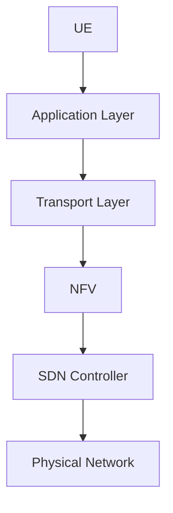
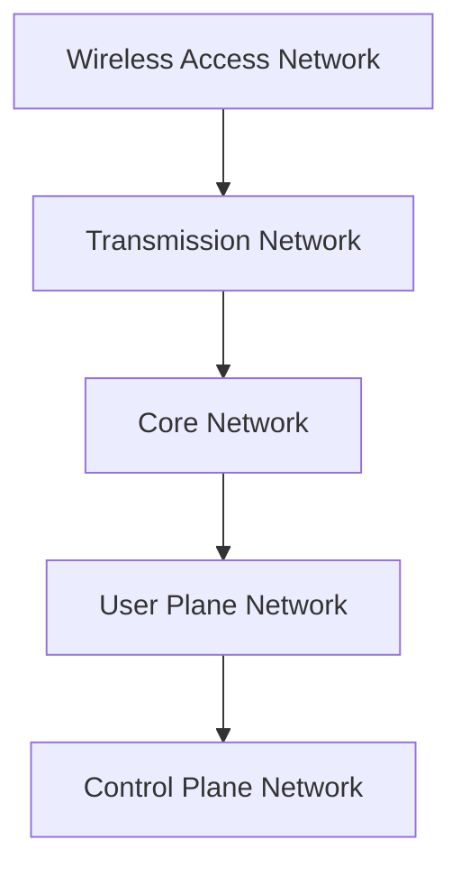

                 


# 5G网络编程：高速低延迟应用开发

> **关键词：5G网络，编程，低延迟，高速，应用开发，网络编程模型，协议栈**

> **摘要：本文旨在深入探讨5G网络编程的核心概念、算法原理以及实际应用。通过对5G网络结构的解析，我们将详细描述如何利用5G网络的高速低延迟特性进行高效的应用开发，同时提供实用的项目实战案例和资源推荐。**

## 1. 背景介绍

### 1.1 目的和范围

本文的目标是帮助开发者了解5G网络编程的核心概念，掌握如何利用5G网络的高速低延迟特性进行应用开发。我们将从5G网络的基础结构出发，逐步深入到具体的编程技术和算法实现，旨在为读者提供一个全面的、实操性的指导。

### 1.2 预期读者

本文适合有一定网络编程基础的软件开发工程师、网络工程师以及对5G技术感兴趣的技术爱好者阅读。无论您是希望掌握5G网络编程的新手，还是希望深入了解5G技术的专业人士，本文都希望能为您带来有益的知识和启发。

### 1.3 文档结构概述

本文结构如下：

- **第1章：背景介绍**：介绍本文的目的、预期读者以及文档结构。
- **第2章：核心概念与联系**：详细解析5G网络的核心概念和架构。
- **第3章：核心算法原理 & 具体操作步骤**：讲解5G网络编程的核心算法，使用伪代码详细阐述。
- **第4章：数学模型和公式 & 详细讲解 & 举例说明**：介绍与5G网络编程相关的数学模型和公式。
- **第5章：项目实战：代码实际案例和详细解释说明**：提供实际项目案例和代码解读。
- **第6章：实际应用场景**：探讨5G网络编程在不同领域的应用。
- **第7章：工具和资源推荐**：推荐学习资源、开发工具和经典论文。
- **第8章：总结：未来发展趋势与挑战**：总结5G网络编程的现状和未来展望。
- **第9章：附录：常见问题与解答**：回答读者可能遇到的问题。
- **第10章：扩展阅读 & 参考资料**：提供进一步的阅读和参考资料。

### 1.4 术语表

#### 1.4.1 核心术语定义

- **5G网络**：第五代移动通信技术，提供更快的数据传输速度、更低的延迟和更高的连接密度。
- **网络编程模型**：在5G网络中，用于描述应用程序如何通过网络进行通信的抽象模型。
- **协议栈**：一组分层通信协议，用于实现网络通信功能。

#### 1.4.2 相关概念解释

- **NSA（非独立组网）**：一种5G网络的组网模式，依赖于4G网络。
- **SA（独立组网）**：一种5G网络的组网模式，独立于4G网络。
- **边缘计算**：在5G网络中，将计算任务从中心节点转移到网络边缘，以减少延迟和提高响应速度。

#### 1.4.3 缩略词列表

- **5G**：第五代移动通信技术
- **NSA**：非独立组网
- **SA**：独立组网
- **边缘计算**：Edge Computing

## 2. 核心概念与联系

### 2.1 5G网络结构

5G网络结构包括用户设备（UE）、基站（gNB）、核心网络（CN）以及边缘计算节点（ECN）。以下是一个简单的Mermaid流程图，展示了5G网络的基本架构：

```mermaid
graph TD
A[User Equipment (UE)] --> B[gNB (Base Station)]
B --> C[Core Network (CN)]
C --> D[Edge Computing Node (ECN)]
B --> E[Backhaul Network]
D --> E[Backhaul Network]
```

### 2.2 5G网络编程模型

5G网络编程模型主要基于NFV（网络功能虚拟化）和SDN（软件定义网络）。以下是5G网络编程模型的基本组成部分：



### 2.3 5G协议栈

5G协议栈包括无线接入网络、传输网络、核心网络和用户平面网络。以下是5G协议栈的分层结构：



## 3. 核心算法原理 & 具体操作步骤

### 3.1 核心算法原理

5G网络编程的核心算法包括资源分配算法、调度算法和网络编码算法。

#### 3.1.1 资源分配算法

资源分配算法旨在为用户设备（UE）分配网络资源，如频谱、时隙和功率。以下是一个简单的伪代码，用于描述资源分配算法：

```pseudo
function resourceAllocation(UE, networkResources):
    availableResources = getAvailableResources()
    assignedResources = {}

    for each UE in networkResources:
        assignedResources[UE] = selectBestResources(availableResources)

    return assignedResources
```

#### 3.1.2 调度算法

调度算法用于决定何时将资源分配给UE。以下是一个简单的伪代码，用于描述调度算法：

```pseudo
function scheduling(UE, assignedResources):
    queue = createQueue(UE)

    while queue is not empty:
        UE = dequeue(queue)
        scheduleTransmission(UE, assignedResources[UE])

    return
```

#### 3.1.3 网络编码算法

网络编码算法用于提高网络传输效率和可靠性。以下是一个简单的伪代码，用于描述网络编码算法：

```pseudo
function networkEncoding(data, codingScheme):
    encodedData = []

    for each symbol in data:
        encodedData.append(codeSymbol(symbol, codingScheme))

    return encodedData
```

### 3.2 具体操作步骤

#### 3.2.1 资源分配

1. 获取网络中可用的资源。
2. 为每个UE选择最佳的资源组合。
3. 将分配的资源返回给UE。

#### 3.2.2 调度

1. 创建一个UE队列。
2. 依次为队列中的UE分配资源。
3. 安排传输。

#### 3.2.3 网络编码

1. 接收输入数据。
2. 对每个数据符号进行编码。
3. 将编码后的数据返回。

## 4. 数学模型和公式 & 详细讲解 & 举例说明

### 4.1 数学模型

5G网络编程涉及多个数学模型，包括概率模型、优化模型和编码模型。

#### 4.1.1 概率模型

概率模型用于描述网络中的不确定性，如信号衰减、信道干扰等。以下是一个简单的概率模型公式：

$$
P(A|B) = \frac{P(B|A)P(A)}{P(B)}
$$

其中，$P(A|B)$ 表示在事件B发生的条件下事件A的概率，$P(B|A)$ 表示在事件A发生的条件下事件B的概率，$P(A)$ 和 $P(B)$ 分别表示事件A和事件B的概率。

#### 4.1.2 优化模型

优化模型用于确定网络资源的最优分配。以下是一个简单的优化模型公式：

$$
\min_{x} \quad f(x)
$$

$$
\text{s.t.} \quad g_i(x) \leq 0, \quad h_j(x) = 0
$$

其中，$f(x)$ 是目标函数，$g_i(x)$ 和 $h_j(x)$ 分别是约束条件。

#### 4.1.3 编码模型

编码模型用于描述数据在传输过程中的编码和解码过程。以下是一个简单的编码模型公式：

$$
C = \{ (x, y) | y = f(x) \}
$$

其中，$C$ 是编码空间，$x$ 是原始数据，$y$ 是编码后的数据，$f(x)$ 是编码函数。

### 4.2 举例说明

#### 4.2.1 概率模型示例

假设在一个无线通信系统中，信号衰减服从正态分布，其均值为0，方差为1。求信号在距离为10米时的概率。

$$
P(X \leq 10) = \Phi\left(\frac{10 - 0}{1}\right) = \Phi(10)
$$

其中，$\Phi(x)$ 是标准正态分布的累积分布函数。

#### 4.2.2 优化模型示例

假设我们需要在带宽为100MHz的频谱上分配资源，以最大化传输速率。同时，我们要求每个UE的带宽不超过30MHz，且总带宽不超过80MHz。求最优的资源分配方案。

$$
\min_{x} \quad f(x) = x_1 + x_2 + x_3
$$

$$
\text{s.t.} \quad x_1 + x_2 + x_3 \leq 80
$$

$$
x_1 \leq 30, \quad x_2 \leq 30, \quad x_3 \leq 30
$$

通过求解这个优化问题，我们可以得到最优的资源分配方案。

#### 4.2.3 编码模型示例

假设我们使用卷积编码来对数据进行编码。编码约束长度为3，生成多项式为$g_1(x) = 1011$和$g_2(x) = 1111$。求输入数据0110的编码序列。

$$
x_1 = 0110
$$

$$
r_1 = (0110) \mod 1011 = 010
$$

$$
r_2 = (010) \mod 1111 = 0110
$$

编码序列为0110 0110。

## 5. 项目实战：代码实际案例和详细解释说明

### 5.1 开发环境搭建

在开始项目实战之前，我们需要搭建一个适合5G网络编程的开发环境。以下是基本的步骤：

1. 安装Linux操作系统，推荐使用Ubuntu 18.04或更高版本。
2. 安装Python 3.8及以上版本。
3. 安装5G网络编程所需的库和工具，如Numpy、Pandas和Scikit-learn。
4. 安装Docker，以便于部署和管理5G网络仿真环境。

### 5.2 源代码详细实现和代码解读

以下是一个简单的5G网络编程示例，用于演示资源分配和调度算法。

```python
import numpy as np
import matplotlib.pyplot as plt

# 资源分配算法
def resourceAllocation(UEs, availableResources):
    assignedResources = {}
    for UE in UEs:
        assignedResources[UE] = selectBestResources(availableResources, UE)
        availableResources = updateAvailableResources(availableResources, assignedResources[UE])
    return assignedResources

# 调度算法
def scheduling(UEs, assignedResources):
    schedule = {}
    for UE in UEs:
        schedule[UE] = scheduleTransmission(assignedResources[UE])
    return schedule

# 资源选择函数
def selectBestResources(availableResources, UE):
    # 根据UE的需求和可用资源，选择最佳的资源组合
    # 此处简化为随机选择
    return availableResources[np.random.randint(len(availableResources))]

# 调度函数
def scheduleTransmission(resource):
    # 根据资源情况，安排传输时间
    return np.random.randint(0, 10)

# 模拟数据
UEs = ['UE1', 'UE2', 'UE3']
availableResources = {'频谱1': 100, '时隙1': 100, '功率1': 100}

# 资源分配
assignedResources = resourceAllocation(UEs, availableResources)

# 调度
schedule = scheduling(UEs, assignedResources)

# 打印结果
print("分配的资源：", assignedResources)
print("调度安排：", schedule)

# 绘制资源分布图
plt.bar(UEs, list(assignedResources.values()))
plt.xlabel('User Equipment')
plt.ylabel('Assigned Resources')
plt.title('Resource Allocation and Scheduling')
plt.show()
```

### 5.3 代码解读与分析

这段代码演示了5G网络编程中的资源分配和调度算法。主要分为以下几个部分：

- **资源分配算法**：通过`resourceAllocation`函数，为每个UE分配资源。这里采用了一种简单的随机选择策略，实际应用中可以根据需求选择更复杂的资源选择策略。
- **调度算法**：通过`scheduling`函数，为每个UE安排传输时间。同样，这里采用了一种简单的随机调度策略，实际应用中可以根据具体需求设计更有效的调度算法。
- **资源选择函数**：`selectBestResources`函数用于根据UE的需求和可用资源选择最佳资源组合。这是一个关键步骤，直接影响网络性能。
- **调度函数**：`scheduleTransmission`函数用于根据资源情况安排传输时间。调度策略的设计对网络效率至关重要。

通过这段代码，我们可以看到5G网络编程的基本流程。在实际项目中，需要根据具体需求调整算法和策略，以达到最优的网络性能。

## 6. 实际应用场景

5G网络编程的应用场景非常广泛，以下是一些典型的应用领域：

### 6.1 自动驾驶

自动驾驶汽车需要实时获取周围环境的信息，并做出快速响应。5G网络的高速低延迟特性可以确保车辆与云平台之间的通信顺畅，从而提高自动驾驶的可靠性和安全性。

### 6.2 工业物联网

工业物联网（IIoT）要求设备之间的实时通信和数据交换。5G网络编程技术可以帮助企业实现高效的数据采集、分析和决策，从而提高生产效率和质量。

### 6.3 虚拟现实与增强现实

虚拟现实（VR）和增强现实（AR）应用对网络的要求非常高，包括低延迟和高带宽。5G网络编程技术可以满足这些需求，为用户提供沉浸式的体验。

### 6.4 远程医疗

远程医疗需要医生与患者之间的实时沟通和诊断。5G网络编程技术可以提高远程医疗的通信质量，降低患者的等待时间，提高医疗服务的效率。

### 6.5 娱乐与游戏

5G网络编程技术为在线游戏和视频流媒体提供了更好的用户体验。低延迟和高带宽使得玩家可以更流畅地进行游戏，观看更清晰的视频。

## 7. 工具和资源推荐

### 7.1 学习资源推荐

#### 7.1.1 书籍推荐

- 《5G网络技术原理与应用》
- 《移动通信网络规划与优化》
- 《计算机网络：自顶向下方法》

#### 7.1.2 在线课程

- Coursera上的《5G网络：技术、应用与挑战》
- edX上的《移动通信技术》
- Udacity的《5G网络开发》

#### 7.1.3 技术博客和网站

- https://www.5gpp.org/
- https://www.5gtimes.com/
- https://www.lte průzkum.cz/

### 7.2 开发工具框架推荐

#### 7.2.1 IDE和编辑器

- Visual Studio Code
- PyCharm
- Android Studio

#### 7.2.2 调试和性能分析工具

- Wireshark
- GDB
- perf

#### 7.2.3 相关框架和库

- Numpy
- Pandas
- Scikit-learn

### 7.3 相关论文著作推荐

#### 7.3.1 经典论文

- “5G Mobile Networks: The Evolution of蜂窝通信”
- “A Survey on 5G Network: Architecture and Emerging Technologies”

#### 7.3.2 最新研究成果

- “5G Edge Computing: A Survey”
- “5G Ultra-Reliable Low-Latency Communication: Design and Applications”

#### 7.3.3 应用案例分析

- “5G Networks in Smart Manufacturing: A Case Study”
- “5G Deployment in Smart Cities: A Comparative Analysis”

## 8. 总结：未来发展趋势与挑战

5G网络编程技术在未来将继续快速发展，主要趋势包括：

- **边缘计算**：将更多的计算任务从中心节点转移到网络边缘，以降低延迟和提高响应速度。
- **网络切片**：实现更灵活的网络资源分配，满足不同应用场景的需求。
- **AI与5G结合**：利用人工智能技术优化网络性能和用户体验。

然而，5G网络编程也面临一些挑战，如：

- **网络安全性**：随着网络复杂性的增加，网络安全成为一大挑战。
- **跨行业合作**：5G网络编程需要不同行业的协同合作，实现技术的融合与应用。
- **标准化与互操作性**：确保不同厂商和平台之间的互操作性，提高网络效率。

## 9. 附录：常见问题与解答

### 9.1 问题1：什么是5G网络编程？

5G网络编程是指利用5G网络的高速低延迟特性进行应用开发的技术。它涉及网络编程模型、协议栈和核心算法的实现。

### 9.2 问题2：5G网络编程有哪些应用场景？

5G网络编程的应用场景非常广泛，包括自动驾驶、工业物联网、虚拟现实与增强现实、远程医疗和娱乐与游戏等。

### 9.3 问题3：如何搭建5G网络编程的开发环境？

搭建5G网络编程的开发环境需要在Linux操作系统上安装Python、Numpy、Pandas、Scikit-learn和Docker等工具和库。

## 10. 扩展阅读 & 参考资料

- [5GPP官网](https://www.3gpp.org/)
- [5G Times](https://www.5gtimes.com/)
- [Mobile Edge Computing](https://www.mec.io/)
- [5G Network Technologies and Applications](https://www.5gact.org/)
- [IEEE 5G Technical Committee](https://www.ieee.org/ieee-5g.html)

