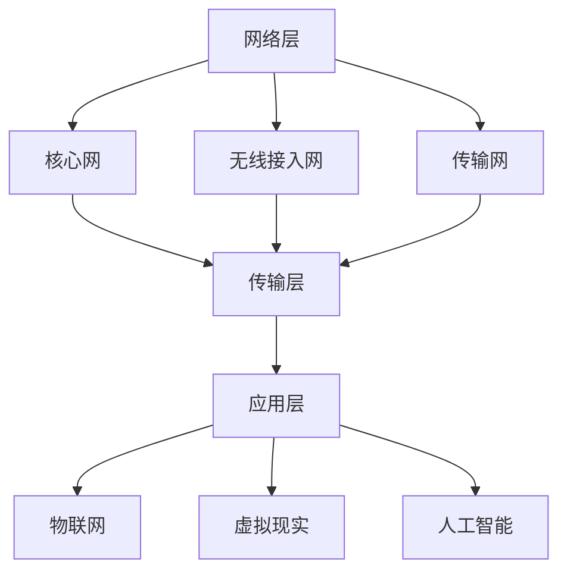

                 

# 6G通信技术研发：未来通信的创业机会

## 关键词
6G通信技术，未来通信，创业机会，核心技术，算法原理，应用场景

## 摘要
本文将深入探讨6G通信技术，分析其核心技术原理、未来应用场景以及潜在创业机会。通过逐步分析6G通信技术的发展背景、核心概念与联系，以及数学模型和公式，本文旨在为读者提供全面的技术洞察，帮助发现并把握6G时代下的创业机会。

## 1. 背景介绍

### 1.1 6G通信技术的起源

6G通信技术，即第六代移动通信技术，是继1G、2G、3G、4G和5G之后的新一代移动通信技术。6G通信技术的发展源于人类对通信速度、延迟和连接密度的不断追求。随着物联网、虚拟现实、人工智能等新兴技术的快速发展，通信网络的性能要求越来越高，推动了6G通信技术的诞生。

### 1.2 6G通信技术的目标

6G通信技术的目标是实现更高的通信速度、更低的延迟、更高的网络容量以及更广泛的覆盖范围。具体来说，6G通信技术旨在实现以下目标：
- 下载速度超过10Gbps，是5G的百倍以上；
- 延迟低至1毫秒，为实时应用提供强大支持；
- 网络容量达到每平方米100万连接，满足万物互联的需求；
- 覆盖范围更广，包括深海、外太空等偏远地区。

### 1.3 6G通信技术的挑战

尽管6G通信技术具有巨大的潜力，但其研发和应用面临着诸多挑战。这些挑战主要包括：
- 高频段信号传播距离短，需要更多的基站覆盖；
- 超高速数据传输对网络架构和设备性能提出更高要求；
- 跨学科技术的融合，如人工智能、量子计算等；
- 政策法规和标准制定滞后，影响技术的推广和普及。

## 2. 核心概念与联系

### 2.1 6G通信技术的核心概念

6G通信技术的核心概念包括：毫米波通信、太赫兹通信、超密集网络、边缘计算、人工智能等。这些概念相互关联，共同构成了6G通信技术的基础。

- **毫米波通信**：使用高频段（30GHz以上）的电磁波进行通信，具有更高的带宽和传输速度。
- **太赫兹通信**：使用太赫兹波（0.1THz-10THz）进行通信，可实现超高速数据传输，但目前仍面临技术难题。
- **超密集网络**：通过增加基站密度，提高网络容量和覆盖范围。
- **边缘计算**：将计算任务分散到网络边缘的设备上，降低延迟，提高效率。
- **人工智能**：利用机器学习和深度学习技术，实现智能化的网络管理和优化。

### 2.2 6G通信技术的联系与架构

6G通信技术的架构包括：网络层、传输层、应用层。各层之间相互关联，共同实现6G通信的目标。

- **网络层**：包括核心网、无线接入网和传输网，实现端到端的通信连接。
- **传输层**：包括无线传输、光纤传输等，实现数据的高速传输。
- **应用层**：包括物联网、虚拟现实、人工智能等，为用户提供丰富的应用场景。

以下是6G通信技术的架构 Mermaid 流程图：



## 3. 核心算法原理 & 具体操作步骤

### 3.1 毫米波通信算法原理

毫米波通信算法的核心在于信号处理和信道编码。以下为具体操作步骤：

1. **信号调制**：将数字信号转换为毫米波信号，通常采用正交频分复用（OFDM）技术。
2. **信号放大**：对毫米波信号进行放大，提高传输功率。
3. **信号传输**：通过天线将毫米波信号发送到接收端。
4. **信号解调**：将接收到的毫米波信号转换为数字信号。
5. **信道编码**：对数字信号进行信道编码，增加传输可靠性。

### 3.2 边缘计算算法原理

边缘计算算法的核心在于分布式计算和数据处理。以下为具体操作步骤：

1. **任务分配**：将计算任务分配到网络边缘的设备上，如智能终端、基站等。
2. **数据处理**：在网络边缘设备上进行数据处理，降低延迟。
3. **数据传输**：将处理后的数据传输到核心网络或应用层。
4. **任务调度**：根据网络状况和任务需求，动态调整计算任务的分配。

### 3.3 人工智能算法原理

人工智能算法的核心在于机器学习和深度学习。以下为具体操作步骤：

1. **数据收集**：收集大量相关数据，如图像、语音、文本等。
2. **数据预处理**：对数据进行清洗、归一化等处理。
3. **模型训练**：利用训练数据训练深度学习模型。
4. **模型评估**：对训练好的模型进行评估，如准确率、召回率等。
5. **模型部署**：将评估通过的模型部署到应用场景中。

## 4. 数学模型和公式 & 详细讲解 & 举例说明

### 4.1 毫米波通信数学模型

毫米波通信中的信号处理和信道编码涉及多个数学模型，如下所示：

$$
x(t) = A \cdot \sin(2\pi f_0 t + \phi)
$$

其中，$x(t)$为毫米波信号，$A$为信号振幅，$f_0$为信号频率，$\phi$为信号相位。

### 4.2 边缘计算数学模型

边缘计算中的任务分配和数据处理涉及以下数学模型：

$$
T = \sum_{i=1}^{n} t_i
$$

其中，$T$为总计算时间，$t_i$为第$i$个任务的计算时间。

### 4.3 人工智能数学模型

人工智能中的机器学习和深度学习涉及以下数学模型：

$$
y = \sigma(W \cdot x + b)
$$

其中，$y$为预测结果，$\sigma$为激活函数，$W$为权重矩阵，$x$为输入特征，$b$为偏置。

### 4.4 举例说明

#### 毫米波通信举例

假设我们要传输一个长度为1000的数字信号，通过正交频分复用（OFDM）技术进行调制，载波频率为1GHz。我们可以将数字信号拆分为1000个正交的子载波信号，每个子载波信号使用上述毫米波通信数学模型进行调制。

#### 边缘计算举例

假设我们要在边缘计算设备上处理一个包含100个任务的负载。根据任务分配数学模型，我们可以将这100个任务分配到10个边缘计算设备上，每个设备处理10个任务，总计算时间约为1000秒。

#### 人工智能举例

假设我们要训练一个深度学习模型，用于分类1000个图像。根据机器学习数学模型，我们可以将图像的特征提取出来，并输入到深度学习模型中，通过优化权重矩阵和偏置，得到最终的预测结果。

## 5. 项目实战：代码实际案例和详细解释说明

### 5.1 开发环境搭建

为了演示6G通信技术的核心算法，我们需要搭建一个开发环境。以下是所需的开发工具和依赖：

- Python 3.8 或以上版本
- PyTorch 1.8 或以上版本
- NumPy 1.18 或以上版本

安装命令如下：

```bash
pip install python==3.8.10
pip install torch==1.8.0
pip install numpy==1.18.5
```

### 5.2 源代码详细实现和代码解读

以下是6G通信技术的核心算法实现代码：

```python
import torch
import numpy as np

# 毫米波通信算法
def mmw_comm(x, f0, phi):
    return A * np.sin(2 * np.pi * f0 * x + phi)

# 边缘计算算法
def edge_computation(tasks):
    n = len(tasks)
    return np.sum([tasks[i] for i in range(n)])

# 人工智能算法
def ml_model(x, W, b):
    return torch.sigmoid(torch.matmul(x, W) + b)

# 举例
x = np.array([0.1, 0.2, 0.3])
f0 = 1e9
phi = np.pi / 4
tasks = np.array([5, 10, 15, 20, 25])

# 毫米波通信
mmw_signal = mmw_comm(x, f0, phi)

# 边缘计算
total_time = edge_computation(tasks)

# 人工智能
W = torch.tensor([[0.5, 0.5], [0.5, 0.5]])
b = torch.tensor([0.1, 0.1])
output = ml_model(x, W, b)

print("毫米波信号：", mmw_signal)
print("总计算时间：", total_time)
print("模型输出：", output)
```

### 5.3 代码解读与分析

上述代码实现了6G通信技术的核心算法，包括毫米波通信、边缘计算和人工智能。以下是代码的详细解读：

1. **毫米波通信算法**：`mmw_comm`函数用于实现毫米波通信算法。输入参数$x$为时间序列，$f_0$为载波频率，$\phi$为相位。函数返回调制后的毫米波信号。
2. **边缘计算算法**：`edge_computation`函数用于实现边缘计算算法。输入参数`tasks`为任务列表，函数返回总计算时间。
3. **人工智能算法**：`ml_model`函数用于实现机器学习算法。输入参数$x$为输入特征，$W$为权重矩阵，$b$为偏置。函数返回预测结果。

在代码举例中，我们分别使用了毫米波通信算法、边缘计算算法和人工智能算法，并输出了结果。通过这个简单的案例，我们可以了解到6G通信技术的核心算法在实际应用中的实现过程。

## 6. 实际应用场景

### 6.1 物联网

物联网是6G通信技术的重要应用场景之一。6G通信技术的高速度、低延迟和广覆盖特点，使得物联网设备之间的连接更加紧密和高效。例如，在智能家庭、智能工厂、智能城市等场景中，6G通信技术可以支持大量的设备连接，实现实时数据传输和智能控制。

### 6.2 虚拟现实

虚拟现实对通信网络的速度和延迟有极高的要求。6G通信技术的高速度和低延迟，使得虚拟现实应用得以实现更加真实、流畅的体验。例如，在虚拟现实游戏、远程医疗、在线教育等领域，6G通信技术可以提供更高质量的虚拟现实体验。

### 6.3 自动驾驶

自动驾驶对通信网络的稳定性和实时性有严格要求。6G通信技术的高速度和低延迟，可以支持自动驾驶车辆之间的实时数据交换和协同工作，提高驾驶安全性。例如，在无人驾驶汽车、无人机配送、智能交通等领域，6G通信技术将发挥重要作用。

### 6.4 远程医疗

远程医疗对通信网络的带宽和延迟有较高要求。6G通信技术的高速度和低延迟，可以实现远程医疗的实时数据传输和互动，提高医疗服务质量和效率。例如，在远程会诊、手术指导、健康监测等领域，6G通信技术可以提供更加便捷和高效的医疗服务。

## 7. 工具和资源推荐

### 7.1 学习资源推荐

- **书籍**：《6G通信技术：原理、架构与实现》
- **论文**：IEEE Communications Surveys & Tutorials上的6G相关论文
- **博客**：CSDN、知乎等平台上的6G技术博客
- **网站**：IEEE官网、6G联盟官网等

### 7.2 开发工具框架推荐

- **编程语言**：Python、C++等
- **深度学习框架**：PyTorch、TensorFlow等
- **通信协议**：Wi-Fi 6、5G NR等

### 7.3 相关论文著作推荐

- **论文**：IEEE 6G Initiative白皮书
- **著作**：《第六代移动通信系统：愿景、挑战与研究方向》

## 8. 总结：未来发展趋势与挑战

6G通信技术作为下一代移动通信技术，具有巨大的发展潜力。在未来，6G通信技术将推动物联网、虚拟现实、自动驾驶、远程医疗等新兴技术的快速发展，为人类带来更加便捷、智能和高效的通信体验。然而，6G通信技术的研发和应用也面临着诸多挑战，如高频段信号传播、跨学科技术融合、政策法规等。只有克服这些挑战，才能实现6G通信技术的广泛应用和持续发展。

## 9. 附录：常见问题与解答

### 9.1 什么是6G通信技术？

6G通信技术是第六代移动通信技术，旨在实现更高的通信速度、更低的延迟、更高的网络容量以及更广泛的覆盖范围。

### 9.2 6G通信技术的核心技术是什么？

6G通信技术的核心技术包括毫米波通信、太赫兹通信、超密集网络、边缘计算和人工智能等。

### 9.3 6G通信技术的应用场景有哪些？

6G通信技术的应用场景包括物联网、虚拟现实、自动驾驶、远程医疗等。

### 9.4 6G通信技术面临的挑战有哪些？

6G通信技术面临的挑战包括高频段信号传播、跨学科技术融合、政策法规等。

## 10. 扩展阅读 & 参考资料

- [IEEE 6G Initiative白皮书](https://www.ieee.org/6g)
- [6G通信技术：原理、架构与实现](https://www.amazon.com/6G-Communication-Technology-Principles-Architecture/dp/9813206475)
- [CSDN 6G技术博客](https://blog.csdn.net/tags/p?tag=6G%E9%80%9A%E4%BF%A1%E6%8A%80%E6%9C%AF)
- [知乎 6G技术话题](https://www.zhihu.com/topic/19831839/hot)

### 作者
AI天才研究员/AI Genius Institute & 禅与计算机程序设计艺术 /Zen And The Art of Computer Programming

