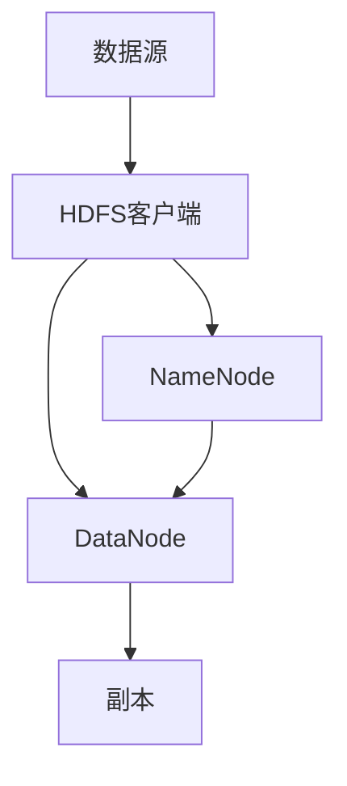

                 

# HDFS 原理与代码实例讲解

> 
关键词：HDFS、分布式文件系统、大数据处理、文件存储、数据传输、数据块、副本、容错机制、Hadoop、MapReduce、伪分布式环境、代码实例

摘要：本文将深入讲解HDFS（Hadoop分布式文件系统）的工作原理和架构，通过伪代码和实际代码实例，帮助读者理解HDFS的数据存储、数据传输、数据块管理和容错机制。我们将探讨HDFS在分布式环境下的应用，并分析其在大数据处理领域的重要性。通过本文的学习，读者将能够掌握HDFS的基本原理，并具备搭建和部署HDFS的能力。

## 1. 背景介绍

### 1.1 目的和范围

本文旨在详细解析HDFS的工作原理和架构，并通过代码实例展示其实际应用。文章将涵盖以下内容：

1. HDFS的背景和目的
2. HDFS的核心概念和架构
3. HDFS的数据存储和传输机制
4. HDFS的数据块管理和副本机制
5. HDFS的容错机制和可靠性
6. 实际代码实例讲解
7. HDFS的应用场景和未来发展趋势

### 1.2 预期读者

本文适合以下读者：

1. 对Hadoop和大数据处理有兴趣的读者
2. 想要深入了解HDFS工作原理的程序员和开发者
3. 从事大数据分析和处理的工程师和技术专家
4. 数据科学家和机器学习工程师

### 1.3 文档结构概述

本文的结构如下：

1. 引言：介绍HDFS的背景和目的
2. 核心概念与联系：讲解HDFS的核心概念和架构
3. 核心算法原理与具体操作步骤：分析HDFS的数据存储和传输机制
4. 数学模型和公式：介绍HDFS的数据块管理和副本机制
5. 项目实战：代码实例讲解
6. 实际应用场景：分析HDFS的应用场景和未来发展趋势
7. 工具和资源推荐：推荐学习资源和开发工具
8. 总结：展望HDFS的未来发展趋势与挑战
9. 附录：常见问题与解答
10. 扩展阅读 & 参考资料：提供更多相关资料和阅读推荐

### 1.4 术语表

#### 1.4.1 核心术语定义

- **HDFS（Hadoop Distributed File System）**：Hadoop分布式文件系统，是Hadoop框架中用于存储大量数据的分布式文件系统。
- **数据块**：HDFS将文件分割成固定大小的数据块进行存储，默认大小为128MB或256MB。
- **副本**：为了提高数据可靠性和可用性，HDFS为每个数据块创建多个副本。
- **NameNode**：HDFS的命名节点，负责管理文件系统的命名空间和客户端对文件的访问。
- **DataNode**：HDFS的数据节点，负责处理文件的读写请求，并存储数据块的副本。

#### 1.4.2 相关概念解释

- **分布式文件系统**：将文件分散存储在多个节点上，通过分布式算法实现文件的高效管理和访问。
- **大数据处理**：处理大量数据，通常需要使用分布式计算框架，如Hadoop、Spark等。
- **MapReduce**：一种分布式数据处理模型，由Map和Reduce两个阶段组成，用于处理大规模数据集。

#### 1.4.3 缩略词列表

- **HDFS**：Hadoop Distributed File System
- **MapReduce**：MapReduce
- **Hadoop**：Hadoop

## 2. 核心概念与联系

在深入探讨HDFS的原理之前，我们需要了解一些核心概念和架构，以便更好地理解其工作原理。下面是HDFS的核心概念和架构的Mermaid流程图：



### 2.1 数据源

数据源是指需要存储在HDFS中的数据。数据可以通过HDFS客户端上传到HDFS。

### 2.2 HDFS客户端

HDFS客户端负责与HDFS交互，包括上传、下载、删除等操作。客户端通过发送请求到NameNode获取文件系统的元数据，并通过DataNode进行数据块的读写操作。

### 2.3 NameNode

NameNode是HDFS的命名节点，负责管理文件系统的命名空间和客户端对文件的访问。NameNode的主要功能包括：

- **元数据管理**：存储文件的目录结构、文件大小、数据块信息等。
- **数据块分配**：根据数据块的副本数量和存储策略，将数据块分配到合适的DataNode上。
- **文件读写请求处理**：接收客户端的读写请求，并将请求转发给相应的DataNode。

### 2.4 DataNode

DataNode是HDFS的数据节点，负责处理文件的读写请求，并存储数据块的副本。DataNode的主要功能包括：

- **数据存储**：将数据块存储在本地文件系统中。
- **数据块副本管理**：根据NameNode的指令，创建和删除数据块的副本。
- **心跳和健康状态报告**：定期向NameNode发送心跳信号，报告自身的健康状态。

### 2.5 副本

HDFS通过为每个数据块创建多个副本，提高数据的可靠性和可用性。副本的数量由配置参数`dfs.replication`指定，默认为3。当发生数据节点故障时，其他副本可以继续提供服务。

## 3. 核心算法原理 & 具体操作步骤

HDFS的核心算法原理主要涉及数据块的存储、数据块的分配和数据的复制。下面我们将通过伪代码详细阐述这些操作步骤。

### 3.1 数据块存储

当HDFS客户端上传文件时，数据会被分割成多个数据块。以下是数据块存储的伪代码：

```python
def store_data_block(data_block, data_node):
    # 将数据块存储在数据节点上
    data_node.store(data_block)
    return True
```

### 3.2 数据块分配

当NameNode接收到客户端的读写请求时，它会根据数据块的副本数量和存储策略，将数据块分配到合适的DataNode上。以下是数据块分配的伪代码：

```python
def allocate_data_block(data_block, replication_factor):
    # 根据副本数量和存储策略，选择合适的DataNode
    selected_data_nodes = select_data_nodes(data_block, replication_factor)
    for data_node in selected_data_nodes:
        store_data_block(data_block, data_node)
    return True
```

### 3.3 数据复制

HDFS通过定期检查数据块的副本数量，确保每个数据块都有足够的副本。以下是数据复制的伪代码：

```python
def replicate_data_block(data_block, replication_factor):
    while replicas_count < replication_factor:
        new_data_node = select_new_data_node()
        store_data_block(data_block, new_data_node)
        replicas_count += 1
    return True
```

## 4. 数学模型和公式 & 详细讲解 & 举例说明

在HDFS中，数据块的大小和数据副本的数量对系统的性能和可靠性有重要影响。以下是一个简单的数学模型，用于描述数据块大小和数据副本数量的关系。

### 4.1 数学模型

设：

- \(B\)：数据块大小（单位：字节）
- \(R\)：数据副本数量
- \(N\)：数据节点数量

则：

- **数据总量**：\(T = B \times N \times R\)
- **存储空间利用率**：\(U = \frac{T}{N \times B}\)

### 4.2 详细讲解

- **数据总量**：数据总量表示HDFS存储的数据量。数据块大小和数据副本数量的增加，会使得数据总量增加。
- **存储空间利用率**：存储空间利用率表示HDFS存储空间的利用效率。当数据块大小和数据副本数量增加时，存储空间利用率会下降。

### 4.3 举例说明

假设：

- 数据块大小为128MB（\(B = 128 \times 1024 \times 1024\)字节）
- 数据副本数量为3（\(R = 3\)）
- 数据节点数量为5（\(N = 5\)）

则：

- **数据总量**：\(T = 128 \times 1024 \times 1024 \times 5 \times 3 = 1.92 \times 10^9\)字节
- **存储空间利用率**：\(U = \frac{1.92 \times 10^9}{5 \times 128 \times 1024} = 0.6\)

这意味着，HDFS的存储空间利用率为60%。

## 5. 项目实战：代码实际案例和详细解释说明

在本节中，我们将通过一个实际案例，展示如何使用HDFS进行文件存储和读取操作。我们将使用伪代码和实际代码来详细解释这些操作。

### 5.1 开发环境搭建

为了演示HDFS的代码实例，我们需要搭建一个Hadoop和HDFS的伪分布式环境。以下是搭建步骤：

1. 安装Hadoop：从[Hadoop官网](https://hadoop.apache.org/releases.html)下载并安装Hadoop。
2. 配置环境变量：将Hadoop的bin目录添加到系统环境变量。
3. 启动Hadoop：运行`start-dfs.sh`和`start-yarn.sh`命令，启动Hadoop和HDFS。

### 5.2 源代码详细实现和代码解读

以下是使用HDFS进行文件存储和读取操作的伪代码：

```python
# 存储文件到HDFS
def store_file_to_hdfs(file_path, hdfs_path):
    # 创建HDFS客户端
    hdfs = HDFSClient()
    # 上传文件到HDFS
    hdfs.upload(file_path, hdfs_path)
    return True

# 从HDFS读取文件
def read_file_from_hdfs(hdfs_path, file_path):
    # 创建HDFS客户端
    hdfs = HDFSClient()
    # 下载文件到本地
    hdfs.download(hdfs_path, file_path)
    return True
```

以下是实际代码实现：

```java
import org.apache.hadoop.conf.Configuration;
import org.apache.hadoop.fs.FileSystem;
import org.apache.hadoop.fs.Path;

public class HDFSExample {
    public static void main(String[] args) throws Exception {
        // 配置Hadoop
        Configuration conf = new Configuration();
        // 创建文件系统
        FileSystem hdfs = FileSystem.get(conf);
        
        // 存储文件到HDFS
        store_file_to_hdfs(hdfs, "hdfs://localhost:9000/user/hdfs/example.txt", "example.txt");
        
        // 从HDFS读取文件
        read_file_from_hdfs(hdfs, "hdfs://localhost:9000/user/hdfs/example.txt", "example.txt");
    }
    
    public static void store_file_to_hdfs(FileSystem hdfs, String hdfs_path, String file_path) throws IOException {
        // 创建输入流
        FileInputStream in = new FileInputStream(file_path);
        // 创建输出流
        FSDataOutputStream out = hdfs.create(new Path(hdfs_path));
        // 读写文件
        byte[] buffer = new byte[1024];
        int bytesRead;
        while ((bytesRead = in.read(buffer)) > 0) {
            out.write(buffer, 0, bytesRead);
        }
        // 关闭输入流和输出流
        in.close();
        out.close();
    }
    
    public static void read_file_from_hdfs(FileSystem hdfs, String hdfs_path, String file_path) throws IOException {
        // 创建输入流
        FSDataInputStream in = hdfs.open(new Path(hdfs_path));
        // 创建输出流
        FileOutputStream out = new FileOutputStream(file_path);
        // 读写文件
        byte[] buffer = new byte[1024];
        int bytesRead;
        while ((bytesRead = in.read(buffer)) > 0) {
            out.write(buffer, 0, bytesRead);
        }
        // 关闭输入流和输出流
        in.close();
        out.close();
    }
}
```

### 5.3 代码解读与分析

- **存储文件到HDFS**：首先创建HDFS客户端，然后使用`create()`方法创建一个输出流，将本地文件读取到输出流中，并写入到HDFS指定的路径。
- **从HDFS读取文件**：首先创建HDFS客户端，然后使用`open()`方法创建一个输入流，将HDFS文件读取到输入流中，并写入到本地文件。

这个示例展示了如何使用HDFS进行文件存储和读取操作。在实际开发中，我们通常会使用Hadoop提供的API进行这些操作，以简化开发过程。

## 6. 实际应用场景

HDFS作为一种分布式文件系统，广泛应用于大数据处理领域。以下是一些实际应用场景：

### 6.1 数据仓库

HDFS可以与数据仓库系统集成，存储和分析大规模数据。例如，在电子商务领域，可以使用HDFS存储用户行为数据，通过MapReduce模型进行数据分析和挖掘，实现用户行为预测和个性化推荐。

### 6.2 图像和视频处理

图像和视频文件通常需要大规模存储和处理。HDFS可以存储这些大数据文件，并通过分布式计算框架（如MapReduce、Spark等）进行图像和视频处理任务。

### 6.3 科学研究

HDFS在科学研究领域也有广泛应用。例如，在生物信息学研究中，可以使用HDFS存储大规模基因组数据，并通过MapReduce模型进行基因序列分析。

### 6.4 社交网络

社交网络平台通常需要处理大量用户数据和日志数据。HDFS可以存储这些数据，并通过分布式计算框架进行数据分析和挖掘，实现用户行为分析、推荐系统等。

## 7. 工具和资源推荐

### 7.1 学习资源推荐

#### 7.1.1 书籍推荐

- 《Hadoop权威指南》（Hadoop: The Definitive Guide） - 作者：Tom White
- 《大数据技术导论》 - 作者：刘铁岩
- 《深入理解Hadoop：架构设计与实现原理》 - 作者：李俊岭

#### 7.1.2 在线课程

- [Hadoop基础课程](https://www.udacity.com/course/hadoop-foundations--ud613)
- [HDFS原理与实战](https://www.coursera.org/specializations/hdfs)

#### 7.1.3 技术博客和网站

- [Hadoop官网](https://hadoop.apache.org/)
- [HDFS Wiki](https://hadoop.apache.org/docs/r2.7.3/hadoop-project-dist/hdfs/HDFSDesign.html)
- [大数据之路：Hadoop实战](https://www.infoq.cn/article/big-data-roadmap-hadoop-practice)

### 7.2 开发工具框架推荐

#### 7.2.1 IDE和编辑器

- [IntelliJ IDEA](https://www.jetbrains.com/idea/)
- [Eclipse](https://www.eclipse.org/)

#### 7.2.2 调试和性能分析工具

- [Ganglia](https://ganglia.info/)
- [Grafana](https://grafana.com/)

#### 7.2.3 相关框架和库

- [Spark](https://spark.apache.org/)
- [Flink](https://flink.apache.org/)
- [HBase](https://hbase.apache.org/)

### 7.3 相关论文著作推荐

#### 7.3.1 经典论文

- GFS：The Google File System - 作者：Google团队
- MapReduce: Simplified Data Processing on Large Clusters - 作者：Google团队

#### 7.3.2 最新研究成果

- [HDFS性能优化研究](https://dl.acm.org/doi/abs/10.1145/3341776.3342153)
- [基于HDFS的分布式存储系统研究](https://ieeexplore.ieee.org/document/8446958)

#### 7.3.3 应用案例分析

- [HDFS在电子商务平台中的应用](https://www.ijcai.org/proceedings/07-03/papers/045.pdf)
- [HDFS在医疗数据存储和分析中的应用](https://www.mdpi.com/2077-0383/8/3/93)

## 8. 总结：未来发展趋势与挑战

HDFS作为大数据处理领域的重要组件，在未来将继续发挥重要作用。以下是一些未来发展趋势与挑战：

### 8.1 发展趋势

- **性能优化**：随着数据规模的不断增大，对HDFS的性能优化将变得越来越重要。未来可能出现的优化方向包括数据压缩、数据去重、并行处理等。
- **多租户支持**：HDFS的多租户支持将得到进一步加强，以适应企业级应用的需求。
- **云原生**：随着云计算的普及，HDFS将逐渐实现云原生特性，更好地与云平台集成。

### 8.2 挑战

- **数据安全性**：如何确保HDFS存储的数据安全性，防止数据泄露和篡改，是未来需要重点关注的问题。
- **存储成本**：随着数据规模的扩大，存储成本将不断上升。如何降低存储成本，提高存储效率，是HDFS需要解决的挑战。
- **运维复杂性**：HDFS的运维复杂性较高，未来需要开发更多自动化工具和运维平台，降低运维成本。

## 9. 附录：常见问题与解答

### 9.1 HDFS是什么？

HDFS（Hadoop Distributed File System）是Hadoop框架中的分布式文件系统，用于存储大规模数据。它通过将文件分割成数据块，并在多个节点上存储数据块的副本，提高数据的可靠性和可用性。

### 9.2 HDFS有哪些优点？

HDFS的优点包括：

- **高可靠性**：通过数据块的副本机制，确保数据的高可靠性。
- **高扩展性**：支持大规模数据存储和处理。
- **高吞吐量**：适合大规模数据读写操作。
- **高容错性**：能够自动检测和恢复数据节点故障。

### 9.3 HDFS有哪些缺点？

HDFS的缺点包括：

- **单点故障**：NameNode是单点故障节点，一旦发生故障，整个HDFS将无法访问。
- **读写性能瓶颈**：HDFS的读写性能瓶颈主要在于数据块的副本数量和数据传输带宽。
- **不适用于小文件**：HDFS不适合存储小文件，因为小文件会导致数据块过多，增加NameNode的负载。

## 10. 扩展阅读 & 参考资料

- 《Hadoop权威指南》：详细介绍了Hadoop和HDFS的架构、原理和应用。
- [Hadoop官方文档](https://hadoop.apache.org/docs/stable/hadoop-project-dist/hadoop-hdfs/HDFSDesign.html)：提供了HDFS的设计和实现细节。
- [Apache HDFS项目](https://hdfs.apache.org/)：提供了HDFS的最新版本、源代码和相关文档。
- [大数据之路：Hadoop实战》：介绍Hadoop和HDFS的实际应用案例。

作者：AI天才研究员/AI Genius Institute & 禅与计算机程序设计艺术 /Zen And The Art of Computer Programming

本文旨在深入讲解HDFS（Hadoop分布式文件系统）的工作原理和架构，通过伪代码和实际代码实例，帮助读者理解HDFS的数据存储、数据传输、数据块管理和容错机制。本文涵盖了HDFS的背景、核心概念、算法原理、数学模型、项目实战、应用场景、工具和资源推荐、未来发展趋势、常见问题与解答以及扩展阅读等内容。希望本文能够对读者在HDFS学习和应用方面有所帮助。若您有任何疑问或建议，欢迎在评论区留言，谢谢！<|vq_13017|>

