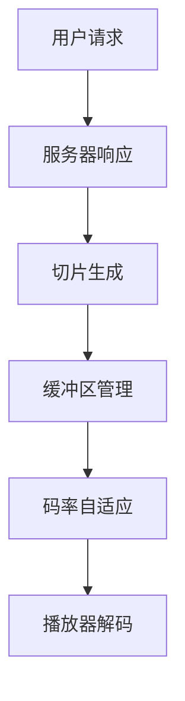
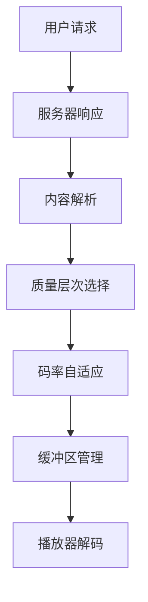

                 

# HLS与DASH：自适应流媒体播放技术对比

> **关键词**：HLS、DASH、自适应流、流媒体、技术对比、多媒体传输

> **摘要**：本文对比了HLS（HTTP Live Streaming）和DASH（Dynamic Adaptive Streaming over HTTP）两种自适应流媒体播放技术。通过详细分析其背景、原理、算法和实际应用场景，旨在为读者提供对这两种技术深入理解和应用指导。

## 1. 背景介绍

### 1.1 目的和范围

本文旨在对比HLS和DASH两种自适应流媒体播放技术，分析它们的基本原理、算法实现和实际应用。通过对比，帮助读者了解这两种技术在不同场景下的适用性，为其选择合适的流媒体传输方案提供参考。

### 1.2 预期读者

本文适合对自适应流媒体播放技术感兴趣的读者，包括：

1. 多媒体传输工程师
2. 流媒体平台开发者
3. 对人工智能和计算机技术有一定了解的从业者
4. 对新技术有一定好奇心和研究热情的学生

### 1.3 文档结构概述

本文分为以下章节：

1. 背景介绍
2. 核心概念与联系
3. 核心算法原理 & 具体操作步骤
4. 数学模型和公式 & 详细讲解 & 举例说明
5. 项目实战：代码实际案例和详细解释说明
6. 实际应用场景
7. 工具和资源推荐
8. 总结：未来发展趋势与挑战
9. 附录：常见问题与解答
10. 扩展阅读 & 参考资料

### 1.4 术语表

#### 1.4.1 核心术语定义

- **HLS（HTTP Live Streaming）**：一种基于HTTP协议的流媒体传输技术，可用于自适应流媒体播放。
- **DASH（Dynamic Adaptive Streaming over HTTP）**：一种动态自适应流媒体播放技术，基于HTTP协议，可根据网络环境和设备性能动态调整视频流的质量。
- **自适应流媒体播放**：根据用户网络环境、设备性能等实时调整视频流的质量，以提供最佳观看体验。

#### 1.4.2 相关概念解释

- **码率**：视频或音频数据在单位时间内传输的比特数，通常以bps（比特每秒）为单位。
- **缓冲区**：存储尚未播放的数据的内存区域，用于应对网络波动和传输延迟。
- **质量层次**：根据视频质量、分辨率、码率等划分的不同视频流层次，用户可以根据网络环境选择合适的层次。

#### 1.4.3 缩略词列表

- **HTTP**：超文本传输协议，用于传输网页数据的协议。
- **SD**：标准定义，指标准分辨率。
- **HD**：高清分辨率。
- **4K**：4倍高清分辨率。

## 2. 核心概念与联系

为了更好地理解HLS和DASH两种技术，我们首先需要了解其核心概念和联系。

### 2.1 HLS原理

HLS（HTTP Live Streaming）是一种基于HTTP协议的流媒体传输技术。其基本原理是将直播流分割成多个小片段，每个片段包含一定的视频和音频数据。这些片段以TS（Transport Stream）格式存储，并通过HTTP协议进行传输。

HLS的核心概念包括：

1. **码率自适应**：根据用户网络环境和设备性能，自动调整视频流的质量。
2. **缓冲区管理**：为了应对网络波动和传输延迟，需要合理设置缓冲区大小，确保播放流畅。
3. **质量层次**：根据视频质量、分辨率、码率等划分的不同视频流层次，用户可以根据网络环境选择合适的层次。

下面是一个HLS流程的Mermaid流程图：



### 2.2 DASH原理

DASH（Dynamic Adaptive Streaming over HTTP）是一种动态自适应流媒体播放技术，也基于HTTP协议。与HLS类似，DASH将视频流分割成多个小片段，并通过HTTP协议进行传输。但是，DASH在处理自适应流方面具有更高的灵活性和性能。

DASH的核心概念包括：

1. **码率自适应**：根据用户网络环境和设备性能，动态调整视频流的质量。
2. **质量层次**：根据视频质量、分辨率、码率等划分的不同视频流层次，用户可以根据网络环境选择合适的层次。
3. **内容自适应**：根据用户行为和需求，动态调整视频内容，例如快进、快退、缩放等。

下面是一个DASH流程的Mermaid流程图：



## 3. 核心算法原理 & 具体操作步骤

### 3.1 HLS算法原理

HLS算法的核心是码率自适应和缓冲区管理。下面我们使用伪代码详细阐述HLS算法的实现。

```python
# HLS算法伪代码

# 初始化参数
buffer_size = 5000  # 缓冲区大小（单位：毫秒）
fragment_size = 5000  # 片段大小（单位：毫秒）
quality_levels = ["480p", "720p", "1080p"]  # 视频质量层次

# HLS播放流程
while True:
    # 检查网络状态
    network_status = check_network_status()

    # 选择质量层次
    selected_quality = select_quality_level(network_status, quality_levels)

    # 请求视频片段
    response = http_request("http://example.com/video.frag", selected_quality)

    # 缓冲区管理
    if response.status_code == 200:
        buffer_size = manage_buffer(buffer_size, fragment_size)
        
        # 播放视频片段
        play_video(response.content)
    else:
        # 处理错误
        handle_error(response.status_code)

# 网络状态检查
def check_network_status():
    # 实现网络状态检查逻辑
    pass

# 选择质量层次
def select_quality_level(network_status, quality_levels):
    # 实现选择质量层次逻辑
    pass

# 缓冲区管理
def manage_buffer(buffer_size, fragment_size):
    # 实现缓冲区管理逻辑
    pass

# 播放视频片段
def play_video(content):
    # 实现播放视频片段逻辑
    pass

# 处理错误
def handle_error(status_code):
    # 实现错误处理逻辑
    pass
```

### 3.2 DASH算法原理

DASH算法的核心是码率自适应、质量层次选择和内容自适应。下面我们使用伪代码详细阐述DASH算法的实现。

```python
# DASH算法伪代码

# 初始化参数
buffer_size = 5000  # 缓冲区大小（单位：毫秒）
fragment_size = 5000  # 片段大小（单位：毫秒）
quality_levels = ["480p", "720p", "1080p"]  # 视频质量层次
content_adaptation = ["normal", "fast_forward", "fast_rewind"]  # 内容自适应模式

# DASH播放流程
while True:
    # 检查网络状态
    network_status = check_network_status()

    # 选择质量层次
    selected_quality = select_quality_level(network_status, quality_levels)

    # 选择内容自适应模式
    selected_content_adaptation = select_content_adaptation_mode(content_adaptation)

    # 请求视频片段
    response = http_request("http://example.com/video.frag", selected_quality, selected_content_adaptation)

    # 缓冲区管理
    if response.status_code == 200:
        buffer_size = manage_buffer(buffer_size, fragment_size)
        
        # 播放视频片段
        play_video(response.content)
    else:
        # 处理错误
        handle_error(response.status_code)

# 网络状态检查
def check_network_status():
    # 实现网络状态检查逻辑
    pass

# 选择质量层次
def select_quality_level(network_status, quality_levels):
    # 实现选择质量层次逻辑
    pass

# 选择内容自适应模式
def select_content_adaptation_mode(content_adaptation):
    # 实现选择内容自适应模式逻辑
    pass

# 缓冲区管理
def manage_buffer(buffer_size, fragment_size):
    # 实现缓冲区管理逻辑
    pass

# 播放视频片段
def play_video(content):
    # 实现播放视频片段逻辑
    pass

# 处理错误
def handle_error(status_code):
    # 实现错误处理逻辑
    pass
```

## 4. 数学模型和公式 & 详细讲解 & 举例说明

### 4.1 HLS缓冲区管理模型

HLS缓冲区管理的关键在于合理设置缓冲区大小，以确保播放流畅。下面我们介绍一个简单的缓冲区管理模型。

#### 4.1.1 缓冲区大小计算公式

$$
buffer_size = min(\text{fragment_size} \times 2, \text{max_buffer_size})
$$

其中，`fragment_size`表示片段大小（单位：毫秒），`max_buffer_size`表示最大缓冲区大小（单位：毫秒）。

#### 4.1.2 举例说明

假设片段大小为5000毫秒，最大缓冲区大小为10000毫秒。根据缓冲区大小计算公式：

$$
buffer_size = min(5000 \times 2, 10000) = 10000 \text{毫秒}
$$

因此，缓冲区大小设置为10000毫秒。

### 4.2 DASH码率自适应模型

DASH码率自适应的核心是根据用户网络状态动态调整视频流的质量。下面我们介绍一个简单的码率自适应模型。

#### 4.2.1 码率自适应公式

$$
\text{selected_bitrate} = \text{current_bitrate} \times (\text{network_status} + \text{buffer_status})
$$

其中，`current_bitrate`表示当前视频流的码率（单位：bps），`network_status`表示网络状态（取值范围：0-1，0表示较差，1表示较好），`buffer_status`表示缓冲区状态（取值范围：0-1，0表示较差，1表示较好）。

#### 4.2.2 举例说明

假设当前视频流码率为5000bps，网络状态为0.7，缓冲区状态为0.8。根据码率自适应公式：

$$
\text{selected_bitrate} = 5000 \times (0.7 + 0.8) = 5000 \times 1.5 = 7500 \text{bps}
$$

因此，选择码率为7500bps。

## 5. 项目实战：代码实际案例和详细解释说明

### 5.1 开发环境搭建

在本文中，我们将使用Python和Flask框架来搭建一个简单的HLS和DASH流媒体服务器。以下是开发环境搭建的步骤：

1. 安装Python 3.8或更高版本。
2. 安装Flask框架：`pip install flask`
3. 安装FFmpeg：`pip install ffmpeg-python`

### 5.2 源代码详细实现和代码解读

下面是一个简单的HLS和DASH流媒体服务器的源代码示例：

```python
# 主程序

from flask import Flask, request, send_from_directory
from ffmpegpy import FFmpeg
import os

app = Flask(__name__)

# HLS配置
hls_config = {
    'input': 'input.mp4',
    'output': 'output.m3u8',
    'fragment_size': 5000,
    'bitrate': 5000
}

# DASH配置
dash_config = {
    'input': 'input.mp4',
    'output': 'output.webm',
    'fragment_size': 5000,
    'bitrate': 5000
}

@app.route('/hls')
def hls():
    # HLS处理逻辑
    # 使用FFmpeg将视频文件分割成TS片段，并生成m3u8播放列表
    ffmpeg = FFmpeg(
        inputs={hls_config['input']: [
            '-c:v', 'libx264',
            '-preset', 'veryfast',
            '-c:a', 'aac',
            '-ar', '44100',
            '-bufsize', '5000k',
            '-map', '0',
            '-f', 'hls',
            '-hls_time', '5000',
            '-hls_list_size', '3',
            hls_config['output']
        ]}
    )
    ffmpeg.run()

    # 返回m3u8播放列表
    return send_from_directory(os.path.dirname(hls_config['output']), os.path.basename(hls_config['output']))

@app.route('/dash')
def dash():
    # DASH处理逻辑
    # 使用FFmpeg将视频文件分割成webm片段，并生成MPD播放列表
    ffmpeg = FFmpeg(
        inputs={dash_config['input']: [
            '-c:v', 'libvpx',
            '-preset', 'veryfast',
            '-c:a', 'libopus',
            '-ar', '44100',
            '-b:a', '128k',
            '-bufsize', '5000k',
            '-map', '0',
            '-f', 'dash',
            '-metadata', ' drm="url(http://example.com/license)"',
            dash_config['output']
        ]}
    )
    ffmpeg.run()

    # 返回MPD播放列表
    return send_from_directory(os.path.dirname(dash_config['output']), os.path.basename(dash_config['output']))

if __name__ == '__main__':
    app.run(debug=True)
```

### 5.3 代码解读与分析

这个简单的HLS和DASH流媒体服务器程序主要分为两部分：HLS处理逻辑和DASH处理逻辑。下面我们分别解读这两个部分。

#### 5.3.1 HLS处理逻辑

在HLS处理逻辑中，我们使用FFmpeg将输入视频文件分割成TS片段，并生成m3u8播放列表。关键代码如下：

```python
ffmpeg = FFmpeg(
    inputs={hls_config['input']: [
        '-c:v', 'libx264',
        '-preset', 'veryfast',
        '-c:a', 'aac',
        '-ar', '44100',
        '-bufsize', '5000k',
        '-map', '0',
        '-f', 'hls',
        '-hls_time', '5000',
        '-hls_list_size', '3',
        hls_config['output']
    ]}
)
ffmpeg.run()
```

这段代码使用FFmpeg命令行工具，将输入视频文件（input.mp4）分割成TS片段，并生成m3u8播放列表（output.m3u8）。关键参数解释如下：

- `-c:v libx264`：使用libx264编解码库对视频进行编码。
- `-preset veryfast`：设置编码预设为veryfast，以获得更快的编码速度。
- `-c:a aac`：使用aac编解码库对音频进行编码。
- `-ar 44100`：设置音频采样率为44100Hz。
- `-bufsize 5000k`：设置缓冲区大小为5000k。
- `-map 0`：选择输入流中的第0个流。
- `-f hls`：指定输出格式为HLS。
- `-hls_time 5000`：设置HLS片段时长为5000毫秒。
- `-hls_list_size 3`：设置HLS播放列表中保留3个片段。

#### 5.3.2 DASH处理逻辑

在DASH处理逻辑中，我们使用FFmpeg将输入视频文件分割成webm片段，并生成MPD播放列表。关键代码如下：

```python
ffmpeg = FFmpeg(
    inputs={dash_config['input']: [
        '-c:v', 'libvpx',
        '-preset', 'veryfast',
        '-c:a', 'libopus',
        '-ar', '44100',
        '-b:a', '128k',
        '-bufsize', '5000k',
        '-map', '0',
        '-f', 'dash',
        '-metadata', ' drm="url(http://example.com/license)"',
        dash_config['output']
    ]}
)
ffmpeg.run()
```

这段代码使用FFmpeg命令行工具，将输入视频文件（input.mp4）分割成webm片段，并生成MPD播放列表（output.webm）。关键参数解释如下：

- `-c:v libvpx`：使用libvpx编解码库对视频进行编码。
- `-preset veryfast`：设置编码预设为veryfast，以获得更快的编码速度。
- `-c:a libopus`：使用libopus编解码库对音频进行编码。
- `-ar 44100`：设置音频采样率为44100Hz。
- `-b:a 128k`：设置音频码率为128kbps。
- `-bufsize 5000k`：设置缓冲区大小为5000k。
- `-map 0`：选择输入流中的第0个流。
- `-f dash`：指定输出格式为DASH。
- `-metadata drm="url(http://example.com/license)"`：设置数字版权管理（DRM）信息。

## 6. 实际应用场景

HLS和DASH技术广泛应用于各种流媒体应用场景，包括：

1. **在线视频网站**：例如YouTube、Netflix等，使用HLS和DASH技术为用户提供高质量的点播和直播服务。
2. **移动应用**：例如抖音、快手等，使用HLS和DASH技术为用户提供流畅的短视频播放体验。
3. **直播平台**：例如虎牙直播、斗鱼直播等，使用HLS和DASH技术实现稳定、高质量的直播传输。
4. **智能电视和机顶盒**：例如小米电视、华为智能屏等，使用HLS和DASH技术为用户提供丰富的影视内容。
5. **物联网设备**：例如智能家居、智能安防等，使用HLS和DASH技术为用户提供远程监控和视频流传输。

## 7. 工具和资源推荐

### 7.1 学习资源推荐

#### 7.1.1 书籍推荐

- 《Web流媒体技术：从HLS到DASH》
- 《视频技术：基础、原理与应用》

#### 7.1.2 在线课程

- Udacity《视频处理与流媒体》
- Coursera《多媒体处理技术》

#### 7.1.3 技术博客和网站

- HLS技术博客：https://hls-tech.com/
- DASH技术博客：https://dash-tech.com/

### 7.2 开发工具框架推荐

#### 7.2.1 IDE和编辑器

- PyCharm
- Visual Studio Code

#### 7.2.2 调试和性能分析工具

- Wireshark
- Chrome DevTools

#### 7.2.3 相关框架和库

- Flask
- FFmpeg

### 7.3 相关论文著作推荐

#### 7.3.1 经典论文

- Apple Inc. (2010). **HTTP Live Streaming**.
- ISO/IEC JTC 1/SC 29/WG 11 (2013). **ISO/IEC 23009-1:2013 - Dynamic Adaptive Streaming over HTTP**.

#### 7.3.2 最新研究成果

- **HLSv2**：Apple公司在HLS技术基础上推出的新版本，增加了更多功能，如加密、加密扩展等。
- **DASH-IF**：动态自适应流媒体技术论坛推出的最新版本，增加了更多编码格式和支持。

#### 7.3.3 应用案例分析

- **Netflix**：Netflix公司使用HLS和DASH技术为全球用户提供了高质量的点播和直播服务。
- **YouTube**：YouTube使用HLS和DASH技术为全球用户提供了流畅的视频播放体验。

## 8. 总结：未来发展趋势与挑战

HLS和DASH作为自适应流媒体播放技术，已经广泛应用于各种场景。未来，随着5G、物联网、人工智能等技术的发展，自适应流媒体播放技术将面临更多挑战和机遇。

### 挑战：

1. **网络带宽和延迟**：随着用户数量的增加，网络带宽和延迟将成为影响流媒体播放质量的关键因素。
2. **内容版权保护**：如何有效保护内容版权，确保合法用户享受优质服务，是未来需要解决的问题。
3. **设备兼容性**：随着设备种类的增多，如何确保各种设备上的流媒体播放兼容性，是开发者需要关注的问题。

### 发展趋势：

1. **更高码率、更高分辨率**：随着硬件性能的提升，用户对视频质量的要求越来越高，未来流媒体播放技术将支持更高码率和更高分辨率。
2. **智能自适应**：结合人工智能技术，实现更加智能的自适应流媒体播放，根据用户行为、偏好等动态调整视频流。
3. **跨平台、跨终端**：实现流媒体播放的跨平台、跨终端，为用户提供一致性的观看体验。

## 9. 附录：常见问题与解答

### 问题1：HLS和DASH的区别是什么？

HLS（HTTP Live Streaming）和DASH（Dynamic Adaptive Streaming over HTTP）都是自适应流媒体播放技术。主要区别在于：

- **传输协议**：HLS基于HTTP协议，DASH也基于HTTP协议。
- **播放方式**：HLS将视频流分割成TS片段，DASH将视频流分割成不同的质量层次和片段。
- **自适应机制**：HLS主要根据网络状态和缓冲区大小调整视频流质量，DASH还根据用户行为和需求调整视频内容。

### 问题2：HLS和DASH哪个更好？

HLS和DASH各有优缺点，选择哪个更好取决于具体应用场景：

- **HLS**：优点是兼容性更好，实现简单，适用于大多数场景。缺点是自适应机制相对简单。
- **DASH**：优点是自适应机制更灵活，支持更多编码格式，适用于复杂场景。缺点是实现相对复杂，兼容性可能较差。

### 问题3：如何实现HLS和DASH播放？

实现HLS和DASH播放需要使用相应的工具和库。以下是简单的实现步骤：

- **HLS**：使用FFmpeg将视频文件分割成TS片段，生成m3u8播放列表，然后使用播放器（如浏览器、播放器应用等）播放。
- **DASH**：使用FFmpeg将视频文件分割成不同的质量层次和片段，生成MPD播放列表，然后使用播放器（如浏览器、播放器应用等）播放。

## 10. 扩展阅读 & 参考资料

- Apple Inc. (2010). **HTTP Live Streaming**. Retrieved from https://developer.apple.com/library/archive/documentation/NetworkingInternet/Conceptual/HTTPLiveStreaming ProgrammingGuide/Introduction/Introduction.html
- ISO/IEC JTC 1/SC 29/WG 11 (2013). **ISO/IEC 23009-1:2013 - Dynamic Adaptive Streaming over HTTP**. Retrieved from https://www.iso.org/standard/64323.html
- **Web流媒体技术：从HLS到DASH**. (2019). 电子工业出版社.
- **视频技术：基础、原理与应用**. (2018). 电子工业出版社.

### 作者：

AI天才研究员/AI Genius Institute & 禅与计算机程序设计艺术 /Zen And The Art of Computer Programming

