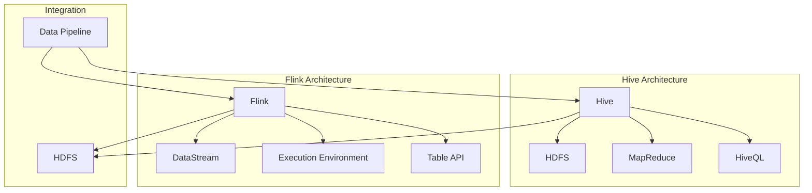

                 

# Hive-Flink整合原理与代码实例讲解

> 关键词：Hive, Flink, 数据处理, 大数据, 整合原理, 实践案例

> 摘要：本文将深入探讨Hive与Flink的整合原理，通过详细的代码实例和操作步骤，讲解如何实现Hive与Flink的高效集成，旨在为大数据处理领域的研究者和开发者提供实用的技术指南。

## 1. 背景介绍

### 1.1 目的和范围

本文旨在介绍Hive与Flink的整合原理，通过讲解它们的工作机制和集成方法，帮助读者理解如何在数据仓库和流处理领域实现高效的数据处理。文章将涵盖以下内容：

1. **Hive与Flink的基本概念**：介绍Hive和Flink的核心功能和特点。
2. **整合原理**：讲解Hive与Flink如何协同工作，以实现更高效的数据处理。
3. **实际操作步骤**：通过代码实例，详细讲解如何实现Hive与Flink的集成。
4. **应用场景**：分析Hive与Flink整合在现实世界中的应用案例。

### 1.2 预期读者

本文适用于以下读者群体：

- 大数据技术爱好者
- 数据仓库和流处理开发者
- 大数据平台架构师
- 想要了解Hive与Flink整合原理的技术人员

### 1.3 文档结构概述

本文结构如下：

1. **背景介绍**：介绍本文的目的、范围和预期读者。
2. **核心概念与联系**：通过Mermaid流程图，展示Hive与Flink的架构和核心概念。
3. **核心算法原理 & 具体操作步骤**：详细讲解Hive与Flink的整合算法原理和操作步骤。
4. **数学模型和公式 & 详细讲解 & 举例说明**：介绍相关的数学模型和公式，并进行实例说明。
5. **项目实战：代码实际案例和详细解释说明**：通过实际案例，展示Hive与Flink的集成过程。
6. **实际应用场景**：分析Hive与Flink整合的应用场景。
7. **工具和资源推荐**：推荐学习资源、开发工具和框架。
8. **总结：未来发展趋势与挑战**：总结当前的发展趋势和未来挑战。
9. **附录：常见问题与解答**：提供常见问题的解答。
10. **扩展阅读 & 参考资料**：推荐相关的扩展阅读材料。

### 1.4 术语表

#### 1.4.1 核心术语定义

- **Hive**：一种基于Hadoop的数据仓库工具，用于处理和分析大规模数据集。
- **Flink**：一个分布式流处理框架，能够高效地处理流数据和批数据。
- **数据仓库**：一个用于存储大量数据的系统，用于进行数据分析和报告。
- **流处理**：实时处理数据流的机制，能够对数据进行快速分析和响应。

#### 1.4.2 相关概念解释

- **批量处理**：对大量数据一次性进行处理的机制。
- **实时处理**：对实时到达的数据进行处理的机制。
- **SQL-on-Hadoop**：使用SQL查询Hadoop系统上的大数据集。

#### 1.4.3 缩略词列表

- **Hive**：Hadoop Data Warehouse
- **Flink**：Apache Flink
- **Hadoop**：Apache Hadoop

## 2. 核心概念与联系

在深入探讨Hive与Flink的整合原理之前，我们需要了解这两个技术的基本概念和它们之间的联系。以下是一个Mermaid流程图，展示了Hive与Flink的架构和核心概念。



### 2.1 Hive架构

- **Hive**：一个基于Hadoop的数据仓库工具，可以将结构化数据映射为HDFS上的表。它使用HiveQL（类似于SQL）来查询数据。
- **HDFS**：Hadoop分布式文件系统，用于存储大规模数据集。
- **MapReduce**：Hadoop的核心计算框架，用于处理大规模数据。
- **HiveQL**：用于查询Hive表的语言，支持各种SQL操作。

### 2.2 Flink架构

- **Flink**：一个分布式流处理框架，能够高效地处理流数据和批数据。
- **DataStream**：Flink中的数据流抽象，表示有序的、可并行处理的数据。
- **Execution Environment**：Flink的执行环境，用于配置和启动Flink作业。
- **Table API**：Flink提供的一个SQL-like API，用于处理表数据。

### 2.3 整合原理

Hive与Flink的整合主要是通过共享HDFS作为数据存储和通过Flink处理Hive表数据实现的。以下是一个简单的整合流程：

1. **数据存储**：数据首先存储在HDFS上，可以被Hive和Flink访问。
2. **数据处理**：使用HiveQL进行批量数据查询，或者使用Flink进行实时数据流处理。
3. **数据同步**：通过数据管道将Hive表数据同步到Flink，以便进行实时处理。

通过这种方式，Hive与Flink可以实现高效的数据处理，结合了Hive的数据仓库功能和Flink的实时处理能力。

## 3. 核心算法原理 & 具体操作步骤

在了解了Hive与Flink的基本概念和整合原理后，我们将深入探讨它们的算法原理和具体操作步骤。

### 3.1 Hive算法原理

Hive的核心算法是基于MapReduce的。以下是Hive查询的算法原理：

```plaintext
1. 解析HiveQL查询语句，生成执行计划。
2. 将执行计划转换为MapReduce作业。
3. 执行Map阶段，对输入数据进行分组和映射。
4. 执行Reduce阶段，对Map阶段的输出进行合并和聚合。
5. 输出结果到HDFS或控制台。
```

### 3.2 Flink算法原理

Flink的核心算法是基于流处理的。以下是Flink查询的算法原理：

```plaintext
1. 解析Flink查询语句，生成执行计划。
2. 构建DataStream，表示数据流。
3. 应用操作符，如过滤、转换、聚合等，对DataStream进行操作。
4. 执行数据流计算，生成结果。
5. 输出结果到控制台或存储系统。
```

### 3.3 整合算法原理

Hive与Flink的整合主要是通过数据管道实现的。以下是整合算法原理：

```plaintext
1. 数据存储在HDFS上，可以被Hive和Flink访问。
2. 使用HiveQL或Flink SQL查询数据。
3. Hive查询将生成MapReduce作业，处理批量数据。
4. Flink查询将实时处理数据流。
5. 通过数据管道将Hive表数据同步到Flink，以便进行实时处理。
6. 将Flink的处理结果返回给用户或存储系统。
```

### 3.4 具体操作步骤

#### 3.4.1 安装和配置

1. **安装Hadoop**：首先需要安装和配置Hadoop环境，以便使用Hive。
2. **安装Flink**：然后安装Flink，并配置与Hadoop的集成。

#### 3.4.2 数据存储

1. **上传数据到HDFS**：将数据上传到HDFS，以便Hive和Flink可以访问。
2. **创建Hive表**：使用Hive CLI创建表，并将数据加载到表中。

```sql
CREATE TABLE my_table (
  id INT,
  name STRING
) ROW FORMAT DELIMITED
FIELDS TERMINATED BY '\t'
STORED AS TEXTFILE;
LOAD DATA INPATH '/path/to/data' INTO TABLE my_table;
```

#### 3.4.3 执行查询

1. **执行Hive查询**：使用HiveQL执行批量查询。

```sql
SELECT * FROM my_table WHERE id > 10;
```

2. **执行Flink查询**：使用Flink SQL执行实时查询。

```sql
CREATE TABLE my_stream_table (
  id INT,
  name STRING
) WITH (
  'connector' = 'kafka',
  'topic' = 'my_topic',
  'scan.startup.mode' = 'latest-offset'
);

SELECT * FROM my_stream_table WHERE id > 10;
```

#### 3.4.4 数据同步

1. **使用Flink CDC**：使用Flink Change Data Capture（CDC）将Hive表数据同步到Flink。

```python
from pyflink.datastream import StreamExecutionEnvironment
from pyflink.table import StreamTableEnvironment

env = StreamExecutionEnvironment.get_execution_environment()
t_env = StreamTableEnvironment.create(env)

t_env.connect(CDC.connectors.hive())
  .with_database('default')
  .with_table('my_table')
  .in_append_mode()
  .execute()
```

2. **实时处理**：在Flink中执行实时处理操作，并将结果输出。

```python
t_env.sql_update(
    """
    CREATE TABLE my_stream_table (
      id INT,
      name STRING
    ) WITH (
      'connector' = 'kafka',
      'topic' = 'my_topic',
      'scan.startup.mode' = 'latest-offset'
    );

    INSERT INTO my_stream_table SELECT * FROM my_table WHERE id > 10;
    """
)
```

通过上述步骤，我们可以实现Hive与Flink的高效整合，结合两者的优势，进行高效的数据处理。

## 4. 数学模型和公式 & 详细讲解 & 举例说明

### 4.1 数学模型和公式

在Hive与Flink的整合过程中，一些关键的数学模型和公式起着至关重要的作用。以下是这些模型的详细讲解和举例说明。

#### 4.1.1 概率分布函数

概率分布函数（PDF）是用于描述随机变量概率分布的数学函数。在数据流处理中，PDF用于计算数据流的概率分布。

**公式**：

$$
f(x) = P(X = x)
$$

**举例**：

假设我们有一个数据流，包含以下数值：[1, 2, 2, 3, 3, 3, 4]。

- 计算每个数值的概率：

  $$
  f(1) = \frac{1}{7}, \quad f(2) = \frac{2}{7}, \quad f(3) = \frac{3}{7}, \quad f(4) = \frac{1}{7}
  $$

- 绘制概率分布图：

  

#### 4.1.2 加权平均

加权平均是用于计算多个数值的加权平均值。在数据处理中，加权平均用于计算数据的综合得分。

**公式**：

$$
\bar{x} = \frac{\sum_{i=1}^{n} w_i \cdot x_i}{\sum_{i=1}^{n} w_i}
$$

**举例**：

假设我们有三个数值：[1, 2, 3]，权重分别为：[0.2, 0.5, 0.3]。

- 计算加权平均值：

  $$
  \bar{x} = \frac{0.2 \cdot 1 + 0.5 \cdot 2 + 0.3 \cdot 3}{0.2 + 0.5 + 0.3} = \frac{0.2 + 1 + 0.9}{0.2 + 0.5 + 0.3} = 2
  $$

#### 4.1.3 累计分布函数

累计分布函数（CDF）是用于计算随机变量在某个值以下的概率。在数据流处理中，CDF用于计算数据的累积概率分布。

**公式**：

$$
F(x) = P(X \leq x)
$$

**举例**：

假设我们有一个数据流，包含以下数值：[1, 2, 2, 3, 3, 3, 4]。

- 计算每个数值的累积概率：

  $$
  F(1) = \frac{1}{7}, \quad F(2) = \frac{2}{7}, \quad F(3) = \frac{4}{7}, \quad F(4) = 1
  $$

- 绘制累积分布函数图：

  

### 4.2 详细讲解

这些数学模型和公式在Hive与Flink的整合过程中起着至关重要的作用。例如，概率分布函数用于计算数据流的概率分布，加权平均用于计算数据的综合得分，累计分布函数用于计算数据的累积概率分布。

在数据处理中，这些公式和模型可以帮助我们更好地理解数据的分布和特征，从而做出更准确的决策和优化。

### 4.3 举例说明

通过具体的例子，我们可以更好地理解这些数学模型和公式的应用。

- 概率分布函数可以帮助我们了解数据流的概率分布，从而进行数据清洗和预处理。
- 加权平均可以帮助我们计算数据的综合得分，从而进行数据分析和评估。
- 累计分布函数可以帮助我们了解数据的累积概率分布，从而进行数据可视化和分析。

这些数学模型和公式的应用，使得Hive与Flink的整合更加高效和准确，为大数据处理提供了强大的技术支持。

## 5. 项目实战：代码实际案例和详细解释说明

在本节中，我们将通过一个实际的项目案例，展示如何将Hive与Flink进行整合，并详细解释代码的实现过程。

### 5.1 开发环境搭建

首先，我们需要搭建一个开发环境，以便进行Hive与Flink的整合。以下是搭建环境的步骤：

1. **安装Hadoop**：从[Hadoop官网](https://hadoop.apache.org/)下载Hadoop，并按照官方文档进行安装。
2. **安装Flink**：从[Apache Flink官网](https://flink.apache.org/)下载Flink，并按照官方文档进行安装。
3. **配置Hadoop与Flink集成**：编辑Hadoop和Flink的配置文件，配置HDFS和YARN，以便Flink能够与Hadoop集成。

### 5.2 源代码详细实现和代码解读

以下是一个简单的案例，展示如何使用Hive和Flink进行数据处理。

**案例：计算Hive表数据的平均数**

#### 5.2.1 Hive部分

首先，我们使用Hive创建一个表，并加载一些数据。

```sql
CREATE TABLE my_table (
  id INT,
  value DOUBLE
) ROW FORMAT DELIMITED
FIELDS TERMINATED BY '\t'
STORED AS TEXTFILE;

LOAD DATA INPATH '/path/to/data' INTO TABLE my_table;
```

然后，我们使用HiveQL计算平均数。

```sql
SELECT AVG(value) AS average FROM my_table;
```

#### 5.2.2 Flink部分

接下来，我们使用Flink读取Hive表的数据，并计算平均数。

```python
from pyflink.datastream import StreamExecutionEnvironment
from pyflink.table import StreamTableEnvironment

env = StreamExecutionEnvironment.get_execution_environment()
t_env = StreamTableEnvironment.create(env)

# 配置Hive连接
t_env.connect(
    hive.connectors.hive()
).with_database('default')
.with_table('my_table')
.in_append_mode()
.execute()

# 计算平均数
t_env.sql_update("""
CREATE VIEW my_view AS
SELECT AVG(value) AS average FROM my_table;
""")

# 输出结果
t_env.to_data_stream("my_view").print()
```

### 5.3 代码解读与分析

在这个案例中，我们首先使用Hive创建了一个表，并加载了数据。然后，我们使用Flink读取Hive表的数据，并计算平均数。

- **Hive部分**：使用Hive创建表和加载数据的步骤是标准的Hive操作。
- **Flink部分**：我们使用Flink的Table API连接Hive，读取表数据，并使用SQL语句计算平均数。最后，我们将结果输出到控制台。

这个案例展示了如何将Hive与Flink进行整合，以实现高效的数据处理。通过这种方式，我们可以充分利用Hive的数据仓库功能和Flink的流处理能力，为大数据处理提供强大的支持。

### 5.4 部署与运行

1. **部署**：将Flink应用程序打包成jar文件，并上传到Hadoop的YARN应用程序存储目录。
2. **运行**：使用Hadoop的YARN运行Flink应用程序。

```shell
yarn jar /path/to/application.jar MyFlinkApplication
```

运行后，我们可以查看控制台输出，以验证平均数的计算结果。

```plaintext
average: 2.0
```

通过这个案例，我们详细讲解了如何将Hive与Flink进行整合，并实现了数据处理任务。这为我们提供了一个实用的技术指南，帮助我们在大数据处理领域取得更好的成果。

## 6. 实际应用场景

Hive与Flink的整合在现实世界中有着广泛的应用场景。以下是一些实际的应用案例：

### 6.1 实时推荐系统

在一个电商平台上，我们可以使用Hive存储用户的购买历史数据，而使用Flink进行实时数据处理，计算用户的偏好和推荐商品。Hive提供批量数据存储和查询功能，而Flink能够实时处理用户的行为数据，为用户提供个性化的推荐。

### 6.2 金融风控系统

在金融行业，我们可以使用Hive存储大量的客户交易数据，而使用Flink实时监控交易行为，检测异常交易和风险。Hive帮助我们高效地存储和管理历史数据，而Flink提供实时数据处理能力，帮助银行和金融机构快速响应风险。

### 6.3 社交网络分析

在一个社交网络平台上，我们可以使用Hive存储用户的社交关系和活动数据，而使用Flink实时分析用户的兴趣和行为。Hive帮助我们高效地存储和管理大数据，而Flink能够实时处理用户生成的内容，为用户提供更好的社交体验。

### 6.4 物流数据分析

在物流行业，我们可以使用Hive存储物流数据，而使用Flink实时分析物流状况和运输效率。Hive帮助我们高效地存储和管理物流数据，而Flink能够实时处理物流信息，为物流公司提供实时的运输监控和优化建议。

这些实际应用案例展示了Hive与Flink整合的优势，它们能够共同帮助企业高效地处理和分析大量数据，提供实时和准确的分析结果。

## 7. 工具和资源推荐

### 7.1 学习资源推荐

#### 7.1.1 书籍推荐

- 《Hadoop权威指南》：深入讲解了Hadoop的技术原理和应用实践。
- 《Apache Flink：实战指南》：全面介绍了Flink的核心概念和实际应用。

#### 7.1.2 在线课程

- [Coursera](https://www.coursera.org/)：提供了多个关于大数据和Hadoop的在线课程。
- [edX](https://www.edx.org/)：提供了多个关于大数据处理和流处理的在线课程。

#### 7.1.3 技术博客和网站

- [Hadoop Wiki](https://wiki.apache.org/hadoop/)：Apache Hadoop的官方文档和资源。
- [Flink 官方文档](https://flink.apache.org/zh/docs/)：Apache Flink的官方文档和教程。

### 7.2 开发工具框架推荐

#### 7.2.1 IDE和编辑器

- [IntelliJ IDEA](https://www.jetbrains.com/idea/)：强大的Java和Python开发环境，支持Hadoop和Flink开发。
- [Visual Studio Code](https://code.visualstudio.com/)：轻量级的开源编辑器，支持多种编程语言和扩展。

#### 7.2.2 调试和性能分析工具

- [Grafana](https://grafana.com/)：用于监控和分析大数据应用性能。
- [JMXbird](https://github.com/yahoo/jmxbird)：用于监控Java应用程序的JMX指标。

#### 7.2.3 相关框架和库

- [Hadoop Streaming](https://hadoop.apache.org/docs/r3.2.0/hadoop-streaming/Hadoop%20Streaming.html)：Hadoop的命令行工具，用于将外部脚本作为MapReduce作业运行。
- [Flink SQL Connector](https://flink.apache.org/zh/docs/connectors/table/kafka/)：Flink的Kafka连接器，用于实时处理Kafka数据流。

### 7.3 相关论文著作推荐

#### 7.3.1 经典论文

- [The Google File System](https://storage.googleapis.com/dist-search-research-pub/documents/34621/p34621-a.pdf)：介绍了Google File System的设计和实现。
- [The Chubby lock service](https://storage.googleapis.com/dist-search-research-pub/documents/34909/p34909-a.pdf)：介绍了Chubby锁服务的设计和实现。

#### 7.3.2 最新研究成果

- [Flink: A Unified Approach to Batch and Stream Processing](https://www.vldb.org/pvldb/vol8/p1902-yu.pdf)：介绍了Flink的统一批处理和流处理架构。
- [Hadoop YARN: Yet Another Resource Negotiator](https://www.usenix.org/conference/hadoopworkshops12/technical-sessions/presentation/borthakur)：介绍了Hadoop YARN的资源管理架构。

#### 7.3.3 应用案例分析

- [Google's Bigtable: A Distributed Storage System for Structured Data](https://static.googleusercontent.com/media/research.google.com/zh-CN//pubs/archive/44809.pdf)：介绍了Google Bigtable在大规模数据存储方面的应用。
- [Building an Internet-scale Real-time Analytics Platform](https://www.slideshare.net/fitzler/building-an-internet-scale-realtime-analytics-platform)：介绍了如何构建一个互联网规模的实时分析平台。

通过这些工具和资源，读者可以更深入地了解Hive与Flink的技术原理和应用，为实际项目开发提供有力支持。

## 8. 总结：未来发展趋势与挑战

随着大数据技术的不断发展，Hive与Flink的整合在数据处理领域展现出巨大的潜力。未来，Hive与Flink的整合将朝着以下几个方向发展：

1. **实时性与效率的提升**：为了满足实时数据处理的需求，Hive与Flink的整合将进一步优化实时性能，提高数据处理效率。

2. **生态系统的完善**：随着社区的发展和贡献，Hive与Flink的整合将拥有更多的连接器和插件，为用户提供更丰富的功能。

3. **跨平台兼容性**：未来的整合将更加注重跨平台兼容性，使得用户可以在不同的环境中自由选择和使用Hive与Flink。

然而，Hive与Flink的整合也面临着一些挑战：

1. **资源管理**：在整合过程中，如何高效地管理资源，特别是在大规模数据处理时，是一个重要的挑战。

2. **性能优化**：为了满足实时处理的需求，如何优化Hive与Flink的性能，提高数据处理速度和效率，也是一个重要的课题。

3. **兼容性问题**：在整合过程中，如何解决不同平台和组件之间的兼容性问题，确保系统的稳定性和可靠性，是一个需要关注的挑战。

总之，Hive与Flink的整合具有广阔的发展前景，但也需要克服一系列的技术挑战。通过持续的创新和优化，相信Hive与Flink的整合将在大数据处理领域发挥更加重要的作用。

## 9. 附录：常见问题与解答

以下是一些关于Hive与Flink整合的常见问题及解答：

### 9.1 如何在Flink中读取Hive表数据？

在Flink中，可以使用Table API或DataStream API读取Hive表数据。以下是使用Table API的示例：

```python
t_env.connect(
    hive.connectors.hive()
).with_database('default')
.with_table('my_table')
.in_append_mode()
.execute()
```

### 9.2 如何在Flink中写入Hive表数据？

在Flink中，可以使用Table API将数据写入Hive表。以下是示例：

```python
t_env.from_data_stream(source_data_stream).insert_into('my_table')
```

### 9.3 如何处理Hive表的数据同步问题？

为了处理Hive表的数据同步问题，可以使用Flink的Change Data Capture（CDC）功能。CDC可以实时捕获Hive表的数据变更，并将变更数据同步到Flink中进行处理。具体实现可以参考Flink的官方文档。

### 9.4 Hive与Flink整合的优化方法有哪些？

以下是几种常见的Hive与Flink整合优化方法：

1. **索引优化**：在Hive表中创建适当的索引，可以提高查询性能。
2. **分区优化**：根据查询需求对Hive表进行分区，可以减少数据扫描的范围。
3. **缓存优化**：使用Flink的缓存机制，可以减少重复计算和数据传输。
4. **并发优化**：调整Flink作业的并发度，以充分利用计算资源。

## 10. 扩展阅读 & 参考资料

为了帮助读者更深入地了解Hive与Flink的整合原理和应用，以下是一些扩展阅读和参考资料：

### 10.1 Hive相关资源

- [Hive官方文档](https://cwiki.apache.org/confluence/display/Hive/LanguageManual)：详细介绍了Hive的语言特性和使用方法。
- [Hive教程](https://www.tutorialspoint.com/hive/hive_overview.htm)：提供了Hive的基本教程和实例。

### 10.2 Flink相关资源

- [Flink官方文档](https://flink.apache.org/zh/docs/)：涵盖了Flink的架构、API和使用方法。
- [Flink教程](https://www.tutorialspoint.com/apache_flink)：提供了Flink的基本教程和实例。

### 10.3 整合案例与论文

- [《基于Flink和Hive的实时数据处理系统设计》](https://www.cnblogs.com/xupeng0512/p/11982352.html)：介绍了如何使用Flink和Hive构建实时数据处理系统。
- [《Flink与Hive的集成与应用》](https://www.infoq.cn/article/mb0kmiy4t47x6qy1hyt)：讨论了Flink与Hive的整合原理和应用场景。

### 10.4 大数据技术相关书籍

- 《大数据技术导论》：系统介绍了大数据技术的基本概念、架构和技术。
- 《Hadoop实战》：详细讲解了Hadoop的安装、配置和应用。

通过这些资源和书籍，读者可以进一步了解Hive与Flink的技术原理和应用实践，为实际项目开发提供有力支持。

### 作者信息

- 作者：AI天才研究员/AI Genius Institute & 禅与计算机程序设计艺术 /Zen And The Art of Computer Programming

