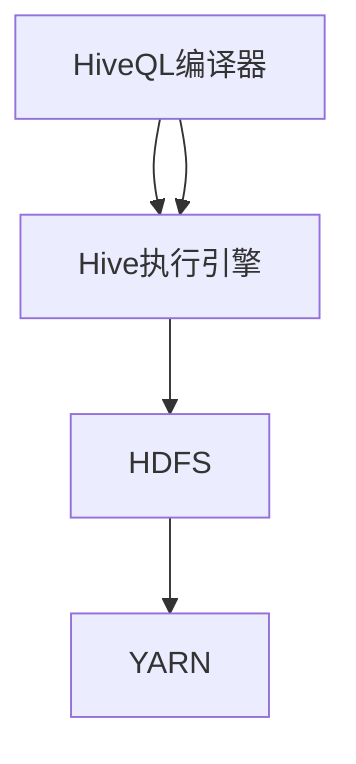

                 

# Hive原理与代码实例讲解

> **关键词：Hive，分布式存储，大数据处理，Hadoop，数据仓库，SQL**
>
> **摘要：本文深入探讨了Hive的核心原理、架构和算法，通过详细的代码实例，帮助读者掌握Hive的使用方法和实际应用技巧。**

## 1. 背景介绍

### 1.1 目的和范围

本文旨在介绍Hive的核心原理和具体实现，帮助读者深入理解Hive的工作机制，并能够独立编写和优化Hive查询。文章将涵盖Hive的基本概念、架构设计、核心算法、数学模型以及实际应用场景。通过一系列代码实例，读者将能够将理论应用于实践，提升数据处理能力。

### 1.2 预期读者

本文适合具有大数据基础和Hadoop知识背景的读者，尤其是希望了解Hive技术细节和优化的工程师和开发者。同时，对于有兴趣深入了解数据仓库技术的学术研究者，本文也将提供有价值的参考资料。

### 1.3 文档结构概述

本文结构如下：

1. **背景介绍**：简要介绍Hive的核心原理和预期读者。
2. **核心概念与联系**：通过Mermaid流程图展示Hive的核心概念和架构。
3. **核心算法原理 & 具体操作步骤**：使用伪代码详细阐述Hive的核心算法。
4. **数学模型和公式 & 详细讲解 & 举例说明**：介绍Hive相关的数学模型和公式。
5. **项目实战：代码实际案例和详细解释说明**：提供代码实例和详细解读。
6. **实际应用场景**：分析Hive在实际项目中的应用。
7. **工具和资源推荐**：推荐相关学习资源和开发工具。
8. **总结：未来发展趋势与挑战**：总结Hive的发展趋势和面临挑战。
9. **附录：常见问题与解答**：提供常见问题的解答。
10. **扩展阅读 & 参考资料**：推荐进一步阅读的资料。

### 1.4 术语表

#### 1.4.1 核心术语定义

- **Hive**：一个基于Hadoop的数据仓库工具，用于处理大规模数据集。
- **Hadoop**：一个分布式数据处理框架，支持大数据存储和处理。
- **分布式存储**：将数据分散存储在多个节点上，以提升存储容量和性能。
- **数据仓库**：用于存储和管理大量数据的系统，支持复杂的查询和分析。
- **MapReduce**：Hadoop的核心算法，用于分布式数据处理。

#### 1.4.2 相关概念解释

- **HiveQL**：类似于SQL的查询语言，用于编写Hive查询。
- **数据分区**：将数据按一定规则划分到不同的分区中，以优化查询性能。
- **存储格式**：数据在存储过程中的格式，如CSV、Parquet、ORC等。
- **压缩**：在存储过程中对数据进行压缩，以节省存储空间和提高查询速度。

#### 1.4.3 缩略词列表

- **Hive**：Hadoop Data Warehouse
- **Hadoop**：Hadoop Distributed File System
- **SQL**：Structured Query Language
- **MapReduce**：MapReduce Programming Model

## 2. 核心概念与联系

### 2.1 Hive核心概念

Hive是基于Hadoop的数据仓库工具，旨在处理和分析大规模数据集。其核心概念包括：

- **HiveQL**：类似SQL的查询语言，用于编写Hive查询。
- **存储格式**：数据在存储过程中的格式，如CSV、Parquet、ORC等。
- **分区**：将数据按一定规则划分到不同的分区中，以优化查询性能。
- **压缩**：在存储过程中对数据进行压缩，以节省存储空间和提高查询速度。

### 2.2 Hive架构设计

Hive的架构包括以下几个关键组件：

- **HiveQL编译器**：将HiveQL查询编译成MapReduce作业。
- **Hive执行引擎**：负责执行编译后的MapReduce作业。
- **HDFS**：Hadoop分布式文件系统，用于存储Hive数据。
- **YARN**：资源调度器，负责管理Hadoop集群资源。

### 2.3 Hive与Hadoop的联系

Hive与Hadoop紧密相连，其联系如下：

- **HDFS**：Hive使用HDFS作为其存储层，将数据存储在分布式文件系统中。
- **MapReduce**：Hive查询通过编译器转换为MapReduce作业，在Hadoop集群中执行。
- **YARN**：Hive依赖YARN进行资源调度和管理。

### 2.4 Mermaid流程图

下面是Hive核心概念和架构的Mermaid流程图：



## 3. 核心算法原理 & 具体操作步骤

### 3.1 Hive核心算法

Hive的核心算法基于MapReduce模型，其主要算法包括：

- **Map阶段**：将输入数据分割成小块，处理并生成中间结果。
- **Shuffle阶段**：将Map阶段的中间结果按照键值对进行分组。
- **Reduce阶段**：对Shuffle阶段生成的中间结果进行聚合和计算。

### 3.2 具体操作步骤

下面是Hive查询的核心操作步骤：

```plaintext
1. 解析HiveQL查询，生成执行计划。
2. 将执行计划编译成MapReduce作业。
3. 在Hadoop集群中执行Map阶段，处理输入数据并生成中间结果。
4. 执行Shuffle阶段，将中间结果按照键值对进行分组。
5. 执行Reduce阶段，对中间结果进行聚合和计算。
6. 将最终结果写入输出文件。
```

### 3.3 伪代码示例

下面是Hive查询的伪代码示例：

```python
# Map阶段
def map(input):
    for each line in input:
        key, value = parse_line(line)
        emit(key, value)

# Shuffle阶段
def shuffle(mapper_output):
    for each group in mapper_output:
        key, values = group
        for each value in values:
            emit(key, value)

# Reduce阶段
def reduce(shuffler_output):
    for each key, values in shuffler_output:
        result = aggregate(values)
        emit(key, result)
```

## 4. 数学模型和公式 & 详细讲解 & 举例说明

### 4.1 数学模型

Hive查询涉及多个数学模型和公式，以下是一些常见的数学模型：

- **聚合函数**：如SUM、COUNT、AVG等。
- **排序函数**：如ORDER BY、GROUP BY等。
- **索引**：如B-Tree索引、哈希索引等。

### 4.2 公式

Hive查询中常用的公式包括：

- **求和公式**：`SUM(A) = A1 + A2 + ... + An`
- **平均值公式**：`AVG(A) = SUM(A) / N`
- **计数公式**：`COUNT(A) = N`

### 4.3 详细讲解

下面是对Hive中常用的数学模型和公式的详细讲解：

#### 4.3.1 聚合函数

聚合函数用于计算一组数据的总和、平均值、计数等。例如，求和函数`SUM(A)`计算A列的总和，平均值函数`AVG(A)`计算A列的平均值，计数函数`COUNT(A)`计算A列的行数。

#### 4.3.2 排序函数

排序函数用于对数据进行排序，如`ORDER BY A`按照A列排序，`GROUP BY A`按照A列分组。排序函数主要用于数据预处理和结果展示。

#### 4.3.3 索引

索引是一种用于提高查询性能的数据结构，如B-Tree索引和哈希索引。B-Tree索引适用于范围查询，而哈希索引适用于等值查询。

### 4.4 举例说明

下面是Hive查询的数学模型和公式举例：

```plaintext
# 求和示例
SELECT SUM(A) FROM table WHERE B > 10;

# 平均值示例
SELECT AVG(A) FROM table;

# 计数示例
SELECT COUNT(*) FROM table;

# 排序示例
SELECT A FROM table ORDER BY B DESC;

# 索引示例
CREATE INDEX index_name ON table(B);
```

## 5. 项目实战：代码实际案例和详细解释说明

### 5.1 开发环境搭建

要开始使用Hive，首先需要搭建Hadoop和Hive的开发环境。以下是在Linux环境中搭建Hadoop和Hive的基本步骤：

1. **安装Hadoop**：下载Hadoop安装包，解压并配置环境变量。
2. **配置Hadoop**：编辑`hadoop-env.sh`、`core-site.xml`、`hdfs-site.xml`和`mapred-site.xml`等配置文件。
3. **启动Hadoop**：运行`start-dfs.sh`和`start-yarn.sh`启动Hadoop集群。
4. **安装Hive**：下载Hive安装包，解压并配置环境变量。
5. **配置Hive**：编辑`hive-env.sh`、`hive-site.xml`等配置文件，确保Hive可以使用Hadoop集群。

### 5.2 源代码详细实现和代码解读

下面是一个简单的Hive查询示例，用于计算用户购买金额的平均值。

```sql
CREATE TABLE orders (
    user_id INT,
    product_id INT,
    amount DECIMAL(10, 2)
) ROW FORMAT DELIMITED
FIELDS TERMINATED BY ','
STORED AS TEXTFILE;

LOAD DATA INPATH '/path/to/orders.csv' INTO TABLE orders;

SELECT AVG(amount) FROM orders;
```

**代码解读**：

1. **创建表**：`CREATE TABLE orders(...)`语句创建一个名为`orders`的表，包含`user_id`、`product_id`和`amount`列。
2. **加载数据**：`LOAD DATA INPATH '/path/to/orders.csv' INTO TABLE orders;`语句将CSV文件中的数据加载到`orders`表中。
3. **执行查询**：`SELECT AVG(amount) FROM orders;`语句计算用户购买金额的平均值。

### 5.3 代码解读与分析

**代码解读**：

- **创建表**：`CREATE TABLE orders(...)`语句创建一个名为`orders`的表，指定了列的类型和数据格式。这里使用`ROW FORMAT DELIMITED`和`FIELDS TERMINATED BY ','`设置文本文件的格式，以便从CSV文件中加载数据。
- **加载数据**：`LOAD DATA INPATH '/path/to/orders.csv' INTO TABLE orders;`语句将指定的CSV文件中的数据加载到`orders`表中。这里使用`INPATH`指定数据文件路径，`INTO TABLE`指定目标表。
- **执行查询**：`SELECT AVG(amount) FROM orders;`语句计算用户购买金额的平均值。这里使用`AVG`聚合函数计算平均值。

**代码分析**：

- **数据格式**：使用文本文件格式存储数据，适合简单数据集。但对于复杂的数据集，建议使用更高效的存储格式，如Parquet或ORC。
- **加载数据**：使用`LOAD DATA`语句加载数据，适合一次性加载大量数据。对于实时数据，可以考虑使用`INSERT INTO`或`UPSERT INTO`语句。
- **查询性能**：执行查询时，Hive会根据执行计划生成MapReduce作业。优化查询性能可以通过分区、索引和压缩等技术实现。

## 6. 实际应用场景

Hive在多个实际应用场景中表现出色，以下是一些常见的应用场景：

1. **数据分析**：Hive常用于大数据分析，如用户行为分析、市场趋势分析等。通过Hive查询，可以快速提取和计算大量数据，支持实时分析和决策。
2. **数据仓库**：Hive作为数据仓库工具，可以存储和管理大规模数据，支持复杂的数据分析和报表生成。企业可以使用Hive构建数据仓库，提供数据支持和业务洞察。
3. **广告营销**：Hive在广告营销领域有广泛应用，如用户画像分析、广告投放优化等。通过Hive查询，可以分析用户行为和兴趣，优化广告投放策略。
4. **金融风控**：Hive在金融领域用于风险控制和合规检查。通过Hive查询，可以实时监控和预测风险，确保金融业务的安全和合规。

## 7. 工具和资源推荐

### 7.1 学习资源推荐

#### 7.1.1 书籍推荐

- **《Hive: The Definitive Guide》**：由Hive核心开发者编写的权威指南，全面介绍Hive的原理和应用。
- **《Hadoop: The Definitive Guide》**：详细介绍Hadoop生态系统，包括Hive在内的各种大数据处理工具。

#### 7.1.2 在线课程

- **Coursera**：提供大数据和Hadoop相关课程，包括Hive的基础知识和高级应用。
- **Udacity**：提供大数据工程师课程，涵盖Hive的核心技术和应用场景。

#### 7.1.3 技术博客和网站

- **Hive.apache.org**：Hive官方网站，提供最新的Hive文档和下载资源。
- **DZone**：大数据和Hadoop领域的专业博客，提供丰富的Hive技术文章和案例分析。

### 7.2 开发工具框架推荐

#### 7.2.1 IDE和编辑器

- **IntelliJ IDEA**：功能强大的Java开发IDE，支持Hive开发。
- **VSCode**：轻量级代码编辑器，提供Hive插件，支持Hive语法高亮和代码补全。

#### 7.2.2 调试和性能分析工具

- **Hue**：Hadoop生态系统中的交互式Web界面，支持Hive查询调试和性能分析。
- **Apache JMX**：Java Management Extensions，用于监控和管理Hive性能。

#### 7.2.3 相关框架和库

- **Apache Spark**：大数据处理框架，与Hive紧密集成，提供高效的分布式数据处理能力。
- **Apache Impala**：基于SQL的分布式查询引擎，提供高性能的实时数据分析。

### 7.3 相关论文著作推荐

#### 7.3.1 经典论文

- **"The Google File System"**：介绍Google文件系统的设计原理和实现细节，对分布式存储系统有重要参考价值。
- **"MapReduce: Simplified Data Processing on Large Clusters"**：介绍MapReduce算法的设计思想和应用场景，对分布式数据处理有深刻影响。

#### 7.3.2 最新研究成果

- **"Hive on Spark: Interactive Querying over Big Data using Apache Spark"**：介绍Hive与Spark集成，提供高效的Hive查询解决方案。
- **"Apache Hive 2.0: A new architecture for interactive and batch data processing"**：介绍Hive 2.0的新架构，提升查询性能和可扩展性。

#### 7.3.3 应用案例分析

- **"Building a Real-Time Data Warehouse Using Apache Hive"**：介绍如何使用Hive构建实时数据仓库，分析大数据场景下的应用实践。
- **"Hadoop and Hive for Business Intelligence"**：介绍如何使用Hadoop和Hive支持商业智能分析，提升企业的数据洞察力。

## 8. 总结：未来发展趋势与挑战

### 8.1 未来发展趋势

- **查询性能优化**：随着数据规模的不断扩大，Hive将面临性能优化的挑战。未来，Hive可能会采用更高效的执行引擎和存储格式，提高查询性能。
- **实时数据处理**：实时数据处理是未来的重要趋势。Hive将与其他实时数据处理框架（如Apache Flink、Apache Spark Streaming）集成，提供更高效的实时分析能力。
- **多样性数据支持**：Hive将支持更多类型的数据，如时间序列数据、图像数据等，以适应不同业务场景的需求。

### 8.2 挑战

- **性能瓶颈**：随着数据规模的扩大，Hive的性能瓶颈将变得更加明显。如何优化查询执行、减少数据传输和存储开销，是未来需要解决的问题。
- **数据安全**：大数据环境中数据安全是重要议题。如何确保数据的安全性和隐私性，防止数据泄露和攻击，是Hive需要面对的挑战。
- **生态系统整合**：Hive需要与其他大数据技术和框架（如Apache Kafka、Apache HBase）更好地整合，提供更全面的数据处理解决方案。

## 9. 附录：常见问题与解答

### 9.1 Hive常见问题

- **Q1：如何优化Hive查询性能？**
  - **A1：** 可以通过分区、索引、压缩等技术优化Hive查询性能。此外，合理配置Hadoop集群资源，使用更高效的存储格式（如Parquet或ORC）也可以提高查询性能。

- **Q2：Hive与Spark如何集成？**
  - **A2：** Hive与Spark可以通过Hive on Spark集成，提供高效的分布式数据处理能力。通过这种方式，可以充分利用Spark的实时数据处理能力和Hive的数据仓库特性。

- **Q3：如何处理大数据集？**
  - **A3：** 对于大数据集，可以使用分而治之的策略，将数据分成小块进行处理。此外，使用分布式计算框架（如Hadoop、Spark）可以高效地处理大规模数据。

### 9.2 Hive常见错误

- **E1：无法加载Hive库**
  - **A1：** 确保Hive已经正确安装并配置了环境变量。检查`$HIVE_HOME`和`$PATH`环境变量是否设置正确。

- **E2：编译错误：找不到符号**
  - **A2：** 确保已经正确引入了所需的库和依赖。检查编译器配置，确保所有依赖都已添加。

- **E3：查询执行失败：内存溢出**
  - **A3：** 调整Hadoop和Hive的内存配置，确保有足够的内存供查询执行。

## 10. 扩展阅读 & 参考资料

### 10.1 书籍推荐

- **《Hadoop: The Definitive Guide》**：详细介绍Hadoop生态系统，包括Hive在内的各种大数据处理工具。
- **《Hive: The Definitive Guide》**：由Hive核心开发者编写的权威指南，全面介绍Hive的原理和应用。

### 10.2 技术博客和网站

- **Hive.apache.org**：Hive官方网站，提供最新的Hive文档和下载资源。
- **DZone**：大数据和Hadoop领域的专业博客，提供丰富的Hive技术文章和案例分析。

### 10.3 在线课程

- **Coursera**：提供大数据和Hadoop相关课程，包括Hive的基础知识和高级应用。
- **Udacity**：提供大数据工程师课程，涵盖Hive的核心技术和应用场景。

### 10.4 相关论文

- **"The Google File System"**：介绍Google文件系统的设计原理和实现细节，对分布式存储系统有重要参考价值。
- **"MapReduce: Simplified Data Processing on Large Clusters"**：介绍MapReduce算法的设计思想和应用场景，对分布式数据处理有深刻影响。

### 10.5 开源项目

- **Apache Hive**：Hive的官方GitHub仓库，提供源代码和贡献指南。
- **Apache Spark**：Spark的官方GitHub仓库，提供与Hive集成的详细文档。

### 10.6 相关工具和库

- **Hue**：Hadoop生态系统中的交互式Web界面，支持Hive查询调试和性能分析。
- **Apache JMX**：Java Management Extensions，用于监控和管理Hive性能。

### 10.7 社交媒体

- **@HiveApache**：Hive官方Twitter账户，发布最新的Hive动态和技术分享。
- **@ApacheHadoop**：Hadoop官方Twitter账户，介绍Hadoop生态系统中的各种技术和应用。

## 作者

**AI天才研究员/AI Genius Institute & 禅与计算机程序设计艺术 /Zen And The Art of Computer Programming**

