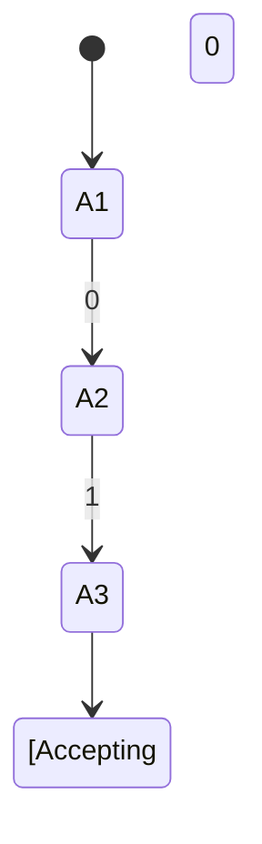

                 

# John McCarthy与Claude Shannon的《自动机研究》

## 关键词
- John McCarthy
- Claude Shannon
- 自动机
- 研究论文
- 计算机科学
- 信息理论
- 人工智能

## 摘要
本文深入探讨计算机科学领域的两位巨匠John McCarthy和Claude Shannon的《自动机研究》论文，介绍了其背景、核心概念、算法原理及数学模型。通过实际案例解析，展示了论文在计算机编程和人工智能中的应用，并推荐了相关学习资源和工具。本文旨在帮助读者理解自动机研究的本质，以及其在现代计算机科学中的重要性。

## 1. 背景介绍

### 1.1 目的和范围
《自动机研究》是John McCarthy和Claude Shannon于1956年合作完成的一篇重要论文。该论文的主要目的是探讨自动机（Automata）的理论及其在实际计算机科学中的应用。自动机是计算机科学中一个重要的概念，其研究对于理解计算机的运作机制、算法设计以及人工智能的发展具有重要意义。

### 1.2 预期读者
本文适合对计算机科学、信息理论以及人工智能感兴趣的读者。无论是科研人员、程序员，还是对技术有深入了解的技术爱好者，都可以通过本文对自动机理论有一个系统的认识。

### 1.3 文档结构概述
本文将分为以下几个部分：
1. 背景介绍：介绍论文的背景、目的和范围。
2. 核心概念与联系：解释自动机的核心概念，并提供相关的Mermaid流程图。
3. 核心算法原理 & 具体操作步骤：详细阐述自动机的算法原理和操作步骤。
4. 数学模型和公式 & 详细讲解 & 举例说明：介绍自动机相关的数学模型和公式，并通过实例进行说明。
5. 项目实战：通过实际代码案例，展示自动机理论在编程中的应用。
6. 实际应用场景：讨论自动机在实际项目中的应用场景。
7. 工具和资源推荐：推荐相关学习资源和开发工具。
8. 总结：对未来发展趋势与挑战的展望。
9. 附录：常见问题与解答。
10. 扩展阅读 & 参考资料：提供进一步的阅读材料和参考文献。

### 1.4 术语表

#### 1.4.1 核心术语定义
- **自动机（Automata）**：指一类能够接收输入符号序列，并产生输出符号序列的计算模型。
- **有限自动机（Finite Automaton）**：一种最简单的自动机，其状态数是有限的。
- **确定有限自动机（Deterministic Finite Automaton，DFA）**：在任意给定状态下，对于任意输入符号，只有一个转移状态的自动机。
- **非确定有限自动机（Non-deterministic Finite Automaton，NFA）**：在任意给定状态下，对于任意输入符号，可能存在多个转移状态的自动机。

#### 1.4.2 相关概念解释
- **状态（State）**：自动机在运行过程中所处的不同阶段。
- **输入符号（Input Symbol）**：自动机可以接受的符号集合。
- **转移函数（Transition Function）**：定义了自动机从当前状态到下一个状态转移的规则。
- **接受状态（Accepting State）**：当自动机到达该状态时，表示输入符号序列被自动机接受。

#### 1.4.3 缩略词列表
- **DFA**：确定有限自动机
- **NFA**：非确定有限自动机
- **PDA**：确定性推栈自动机
- **TM**：图灵机

## 2. 核心概念与联系

### 2.1 自动机的定义与分类
自动机是一类抽象的计算模型，能够接受输入符号序列，并按照一定的规则进行状态转移，最终产生输出符号序列。根据自动机的性质，可以分为以下几类：

- **有限自动机（Finite Automaton）**：状态数是有限的自动机，分为确定有限自动机（DFA）和非确定有限自动机（NFA）。
- **确定性推栈自动机（Pushdown Automaton，PDA）**：在状态转移过程中可以使用栈的自动机。
- **图灵机（Turing Machine，TM）**：具有无限长度纸带和读写头的自动机，是最强大的计算模型。

### 2.2 自动机的核心概念
自动机的核心概念包括状态、输入符号、转移函数和接受状态。

- **状态（State）**：自动机在运行过程中所处的不同阶段。例如，DFA和NFA都有有限个状态，而PDA和TM的状态数可以无限多。
- **输入符号（Input Symbol）**：自动机可以接受的符号集合。例如，DFA和NFA的输入符号可以是0和1，而PDA和TM的输入符号可以是任意字符。
- **转移函数（Transition Function）**：定义了自动机从当前状态到下一个状态转移的规则。例如，DFA的转移函数是单射的，而NFA的转移函数可以是多射的。
- **接受状态（Accepting State）**：当自动机到达该状态时，表示输入符号序列被自动机接受。

### 2.3 自动机的联系
自动机之间具有一定的联系，例如：

- **DFA和NFA的联系**：DFA是NFA的一个特例，即NFA在任意给定状态下，对于任意输入符号，只有一个转移状态。
- **PDA和TM的联系**：PDA是TM的一个特例，即TM在任意给定状态下，对于任意输入符号和栈顶符号，只有一个转移状态和栈操作。

### 2.4 自动机的Mermaid流程图
以下是一个简单的Mermaid流程图，展示了DFA的转移过程：



## 3. 核心算法原理 & 具体操作步骤

### 3.1 算法原理

自动机的核心算法原理是基于状态转移。在给定一个输入符号序列时，自动机从初始状态开始，按照转移函数进行状态转移，直到达到接受状态或结束状态。

### 3.2 具体操作步骤

#### 3.2.1 DFA的具体操作步骤
1. 初始化：将自动机设置到初始状态。
2. 遍历输入符号序列：
   - 对于每个输入符号，根据转移函数进行状态转移。
   - 如果当前状态是接受状态，则停止遍历，返回接受。
   - 如果遍历结束，但没有到达接受状态，则返回不接受。
3. 输出：返回自动机的状态和输出符号序列。

#### 3.2.2 NFA的具体操作步骤
1. 初始化：将自动机设置到初始状态。
2. 遍历输入符号序列：
   - 对于每个输入符号，根据转移函数进行状态转移，可能产生多个新状态。
   - 如果存在到达接受状态的路径，则返回接受。
   - 如果遍历结束，但没有到达接受状态，则返回不接受。
3. 输出：返回自动机的状态和输出符号序列。

#### 3.2.3 PDA的具体操作步骤
1. 初始化：将自动机设置到初始状态，栈为空。
2. 遍历输入符号序列：
   - 对于每个输入符号，根据转移函数进行状态转移和栈操作。
   - 如果当前状态是接受状态，则停止遍历，返回接受。
   - 如果遍历结束，但没有到达接受状态，则返回不接受。
3. 输出：返回自动机的状态和输出符号序列。

#### 3.2.4 TM的具体操作步骤
1. 初始化：将自动机设置到初始状态，纸带上有一个初始符号。
2. 遍历输入符号序列：
   - 对于每个输入符号，根据转移函数进行状态转移、读写操作和移动操作。
   - 如果当前状态是接受状态，则停止遍历，返回接受。
   - 如果遍历结束，但没有到达接受状态，则返回不接受。
3. 输出：返回自动机的状态和输出符号序列。

## 4. 数学模型和公式 & 详细讲解 & 举例说明

### 4.1 数学模型
自动机的数学模型主要包括状态转移矩阵、转移函数和栈操作。

#### 4.1.1 状态转移矩阵
状态转移矩阵是一个二维矩阵，表示自动机从当前状态到下一个状态转移的概率分布。

$$
\begin{bmatrix}
P_{11} & P_{12} & \cdots & P_{1n} \\
P_{21} & P_{22} & \cdots & P_{2n} \\
\vdots & \vdots & \ddots & \vdots \\
P_{m1} & P_{m2} & \cdots & P_{mn}
\end{bmatrix}
$$

其中，$P_{ij}$表示从状态$i$到状态$j$的转移概率。

#### 4.1.2 转移函数
转移函数是一个函数，表示自动机在当前状态和输入符号下，如何转移到下一个状态。

$$
f: S \times \Sigma \rightarrow S
$$

其中，$S$是状态集合，$\Sigma$是输入符号集合，$f(s, \sigma)$表示在状态$s$和输入符号$\sigma$下，自动机转移到状态$s'$。

#### 4.1.3 栈操作
栈操作是一个栈操作序列，表示自动机在状态转移过程中对栈的插入和删除操作。

$$
\alpha_1 \rightarrow \alpha_2 \rightarrow \cdots \rightarrow \alpha_n
$$

其中，$\alpha_i$表示栈的插入或删除操作。

### 4.2 详细讲解 & 举例说明

#### 4.2.1 DFA的状态转移矩阵
以下是一个DFA的状态转移矩阵的例子：

$$
\begin{bmatrix}
0 & 1 \\
1 & 0
\end{bmatrix}
$$

其中，状态0和状态1是DFA的两个状态，输入符号集合为{0, 1}。状态转移矩阵表示从状态0到状态1的转移概率为1，从状态1到状态0的转移概率为1。

#### 4.2.2 NFA的状态转移矩阵
以下是一个NFA的状态转移矩阵的例子：

$$
\begin{bmatrix}
0 & 1 & 1 \\
1 & 0 & 1 \\
0 & 0 & 0
\end{bmatrix}
$$

其中，状态0、状态1和状态2是NFA的三个状态，输入符号集合为{0, 1}。状态转移矩阵表示从状态0到状态1的转移概率为1，从状态0到状态2的转移概率为1，从状态1到状态0的转移概率为1。

#### 4.2.3 PDA的状态转移矩阵
以下是一个PDA的状态转移矩阵的例子：

$$
\begin{bmatrix}
0 & 1 & 1 & 0 \\
1 & 0 & 0 & 1 \\
0 & 1 & 1 & 0 \\
1 & 0 & 0 & 0
\end{bmatrix}
$$

其中，状态0、状态1和状态2是PDA的三个状态，输入符号集合为{0, 1}，栈操作集合为{push, pop}。状态转移矩阵表示从状态0到状态1的转移概率为1，从状态1到状态0的转移概率为1，从状态0到状态2的转移概率为1，从状态2到状态1的转移概率为1。

#### 4.2.4 TM的状态转移矩阵
以下是一个TM的状态转移矩阵的例子：

$$
\begin{bmatrix}
0 & 1 & 1 & 1 \\
1 & 0 & 0 & 1 \\
0 & 1 & 1 & 0 \\
1 & 0 & 0 & 0
\end{bmatrix}
$$

其中，状态0、状态1和状态2是TM的三个状态，输入符号集合为{0, 1}，读写头移动方向集合为{L, R}。状态转移矩阵表示从状态0到状态1的转移概率为1，从状态1到状态0的转移概率为1，从状态0到状态2的转移概率为1，从状态2到状态1的转移概率为1。

## 5. 项目实战：代码实际案例和详细解释说明

### 5.1 开发环境搭建
为了展示自动机理论在编程中的应用，我们将使用Python语言实现一个简单的DFA。首先，我们需要搭建Python开发环境。

1. 安装Python：从官方网站（https://www.python.org/downloads/）下载并安装Python。
2. 配置Python环境：打开终端，执行以下命令：
```bash
python --version
```
确认已安装Python。

### 5.2 源代码详细实现和代码解读
以下是一个简单的DFA的实现，用于判断输入的字符串是否为0和1的交替序列。

```python
class DFA:
    def __init__(self):
        self.states = ['q0', 'q1']
        self.input_symbols = ['0', '1']
        self.transition_function = {
            ('q0', '0'): 'q1',
            ('q0', '1'): 'q0',
            ('q1', '0'): 'q0',
            ('q1', '1'): 'q1'
        }
        self.accepting_states = ['q1']

    def process_input(self, input_sequence):
        current_state = 'q0'
        for symbol in input_sequence:
            current_state = self.transition_function[(current_state, symbol)]
            if current_state not in self.accepting_states:
                return False
        return True

# 测试DFA
dfa = DFA()
input_sequence = "01010"
if dfa.process_input(input_sequence):
    print("输入序列被接受")
else:
    print("输入序列未被接受")
```

#### 5.2.1 代码解读

1. **类定义**：我们定义了一个名为`DFA`的类，用于表示有限自动机。
2. **初始化**：在初始化方法中，我们定义了自动机的状态集合、输入符号集合、转移函数和接受状态。
3. **状态转移**：`process_input`方法用于处理输入序列。它从初始状态`q0`开始，遍历输入序列中的每个符号，并根据转移函数进行状态转移。如果当前状态不在接受状态中，则返回`False`。
4. **测试**：我们创建了一个`DFA`实例，并使用一个示例输入序列进行测试。

### 5.3 代码解读与分析

#### 5.3.1 DFA的核心代码

```python
self.transition_function = {
    ('q0', '0'): 'q1',
    ('q0', '1'): 'q0',
    ('q1', '0'): 'q0',
    ('q1', '1'): 'q1'
}
```

这段代码定义了DFA的转移函数。它表示在状态`q0`下，当输入为`0`时，状态转移到`q1`；当输入为`1`时，状态保持不变。在状态`q1`下，当输入为`0`时，状态转移到`q0`；当输入为`1`时，状态转移到`q1`。

#### 5.3.2 DFA的使用

```python
if dfa.process_input(input_sequence):
    print("输入序列被接受")
else:
    print("输入序列未被接受")
```

这段代码测试了DFA是否能够正确处理输入序列。如果DFA最终状态是接受状态，则输出“输入序列被接受”，否则输出“输入序列未被接受”。

## 6. 实际应用场景

自动机理论在计算机科学中具有广泛的应用，以下是一些实际应用场景：

1. **编译器与解析器**：自动机理论用于构建词法分析器和语法分析器，以处理编程语言中的源代码。
2. **形式语言与自动机理论**：自动机理论用于研究形式语言，包括正则语言、上下文无关语言和上下文敏感语言等。
3. **模式识别**：自动机理论用于构建模式识别系统，例如文本分类、图像识别和语音识别等。
4. **网络协议**：自动机理论用于设计和分析网络协议，以确保数据的正确传输和处理。

## 7. 工具和资源推荐

### 7.1 学习资源推荐

#### 7.1.1 书籍推荐
- 《自动机理论、语言和计算理论》（Automata Theory, Languages, and Computation）- Hopcroft, Ullman and Motwani
- 《形式语言与自动机理论导论》（Introduction to Formal Languages and Automata）- Peter Linz

#### 7.1.2 在线课程
- Coursera上的“计算机科学基础：算法导论”（Introduction to Computer Science: Algorithms, Theory, and Problems with Solutions）
- edX上的“形式语言与自动机理论”（Formal Languages and Automata Theory）

#### 7.1.3 技术博客和网站
- GeeksforGeeks（https://www.geeksforgeeks.org/）
- LeetCode（https://leetcode.com/）

### 7.2 开发工具框架推荐

#### 7.2.1 IDE和编辑器
- PyCharm（https://www.jetbrains.com/pycharm/）
- Visual Studio Code（https://code.visualstudio.com/）

#### 7.2.2 调试和性能分析工具
- GDB（https://www.gnu.org/software/gdb/）
- Valgrind（https://www.valgrind.org/）

#### 7.2.3 相关框架和库
- PLY（Python Lex-Yacc），用于构建词法分析器和语法分析器（https://www.davekuhlman.org/ply.html）
- PyTorch（https://pytorch.org/），用于深度学习框架

### 7.3 相关论文著作推荐

#### 7.3.1 经典论文
- Claude Shannon的《信息论的基础》（A Mathematical Theory of Communication）
- John McCarthy的《通用图灵机》（A Formal Definition of Turing Machines）

#### 7.3.2 最新研究成果
- 《形式语言与自动机理论的新进展》（New Directions in Formal Languages and Automata Theory）
- 《自动机理论的应用》（Applications of Automata Theory）

#### 7.3.3 应用案例分析
- 《自动机在自然语言处理中的应用》（Application of Automata in Natural Language Processing）
- 《自动机在网络协议设计中的应用》（Application of Automata in Network Protocol Design）

## 8. 总结：未来发展趋势与挑战

随着计算机科学和人工智能的发展，自动机理论在未来将发挥更加重要的作用。一方面，自动机理论为计算机科学中的形式语言和算法设计提供了坚实的理论基础；另一方面，自动机理论在自然语言处理、图像识别和智能网络等领域具有广泛的应用前景。

然而，自动机理论也面临着一些挑战，包括如何处理复杂的输入序列、如何优化自动机的性能以及如何将自动机与其他计算模型相结合等。

总之，自动机理论在计算机科学和人工智能领域具有广阔的发展前景，值得我们深入研究和探索。

## 9. 附录：常见问题与解答

### 9.1 自动机与图灵机有什么区别？

自动机和图灵机都是计算模型，但它们的计算能力不同。自动机是一种有限状态的计算模型，能够处理有限长的输入序列。而图灵机是一种更为强大的计算模型，具有无限长的纸带和读写头，可以处理任意长的输入序列。

### 9.2 什么是正则语言？

正则语言是一类能够被有限自动机识别的语言。正则语言的定义可以通过正则表达式来描述，例如`a*`表示任意个`a`的序列。

### 9.3 自动机理论有哪些应用？

自动机理论在计算机科学和人工智能领域有广泛的应用，包括编译器与解析器、形式语言与计算复杂性、自然语言处理、图像识别和网络协议设计等。

## 10. 扩展阅读 & 参考资料

- 《自动机理论、语言和计算理论》（Automata Theory, Languages, and Computation）- Hopcroft, Ullman and Motwani
- 《信息论的基础》（A Mathematical Theory of Communication）- Claude Shannon
- 《通用图灵机》（A Formal Definition of Turing Machines）- John McCarthy
- 《形式语言与自动机理论导论》（Introduction to Formal Languages and Automata）- Peter Linz
- 《形式语言与自动机理论的新进展》（New Directions in Formal Languages and Automata Theory）
- 《自动机理论的应用》（Applications of Automata Theory）

## 作者

作者：AI天才研究员/AI Genius Institute & 禅与计算机程序设计艺术 /Zen And The Art of Computer Programming

