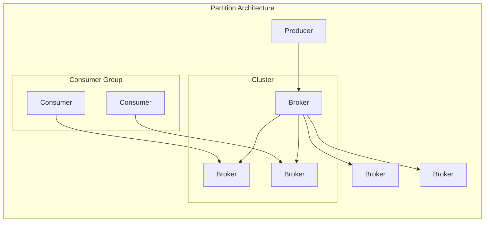

                 

# Kafka Partition原理与代码实例讲解

> 关键词：Kafka, Partition, 原理, 代码实例, 分布式消息队列

> 摘要：本文将深入探讨Kafka的Partition原理，从基础概念、核心算法到实际代码实例，逐一剖析Kafka Partition的设计与实现，帮助读者全面理解Kafka Partition的工作机制，提升其在分布式消息队列领域的应用能力。

## 1. 背景介绍

### 1.1 目的和范围

本文旨在详细解析Kafka Partition的工作原理，并通过实际代码实例来加深理解。文章将涵盖以下内容：

- Kafka Partition的核心概念与架构
- Kafka Partition的具体实现与算法原理
- Kafka Partition在实际应用中的角色与优势
- Kafka Partition的代码实例分析与解读

### 1.2 预期读者

本文适合对Kafka有基本了解的读者，包括但不限于：

- Kafka开发人员
- 分布式消息队列架构师
- 对分布式系统感兴趣的技术爱好者
- 想深入了解Kafka底层实现原理的专业人士

### 1.3 文档结构概述

本文将按以下结构进行：

- 背景介绍：介绍文章的目的、读者范围及文档结构
- 核心概念与联系：通过Mermaid流程图展示Kafka Partition的架构
- 核心算法原理 & 具体操作步骤：使用伪代码阐述Partition的算法原理
- 数学模型和公式 & 详细讲解 & 举例说明：介绍与Partition相关的数学模型与公式
- 项目实战：代码实际案例和详细解释说明
- 实际应用场景：讨论Partition在不同场景下的应用
- 工具和资源推荐：推荐学习资源和开发工具
- 总结：未来发展趋势与挑战
- 附录：常见问题与解答
- 扩展阅读 & 参考资料：提供进一步学习与研究的相关资源

### 1.4 术语表

#### 1.4.1 核心术语定义

- **Kafka**: 一个分布式流处理平台和消息队列系统。
- **Partition**: Kafka中用于消息分区的机制，每个Topic可以包含多个Partition。
- **Producer**: Kafka中的消息发送者，负责将消息发送到特定的Partition。
- **Consumer**: Kafka中的消息接收者，从Partition中读取并消费消息。
- **Offset**: 消息在Partition中的位置标记。

#### 1.4.2 相关概念解释

- **Topic**: Kafka中消息的逻辑分类，类似于数据库中的表。
- **Broker**: Kafka中的服务器节点，负责存储和转发消息。
- **ISR**: In-Sync Replicas的缩写，表示与Leader Partition同步的Replicas。

#### 1.4.3 缩略词列表

- **Kafka**: Kafka
- **API**: Application Programming Interface
- **ID**: Identifier
- **MQ**: Message Queue
- **ISR**: In-Sync Replicas

## 2. 核心概念与联系

Kafka Partition是Kafka分布式架构中的核心概念，其设计旨在实现高吞吐量、可扩展性和容错性。以下是一个简化的Kafka Partition架构的Mermaid流程图：



### 2.1 Partition在Kafka中的角色

- **Producer**: 负责将消息发送到特定的Partition，通常通过Partition Key来决定消息的发送目标。
- **Broker**: Kafka的服务器节点，每个Broker存储一定数量的Partition，负责消息的存储和转发。
- **Consumer**: 从特定的Partition中消费消息，通常属于一个Consumer Group，多个Consumer可以共同消费同一个Topic。

### 2.2 Partition的设计原则

- **负载均衡**: 通过将消息均匀分布到多个Partition上，实现负载均衡。
- **高吞吐量**: Partition的设计允许并行处理，从而提高系统的吞吐量。
- **容错性**: Partition允许在Broker之间复制，提高系统的容错性。

## 3. 核心算法原理 & 具体操作步骤

Kafka Partition的核心算法涉及以下几个方面：

### 3.1 Partition分配策略

Kafka使用了一种叫做“Range-based Partitioning”的策略，根据Partition Key的哈希值来决定消息的发送目标。以下是一个简化的伪代码：

```plaintext
function assignPartition(topic, key, numPartitions):
    hashValue = hash(key)
    partition = hashValue % numPartitions
    return partition
```

### 3.2 Partition的选择算法

Consumer Group中的Consumer从多个Partition中消费消息，选择算法通常基于负载均衡和可用性。以下是一个简化的伪代码：

```plaintext
function choosePartition(consumer, partitions, topic, key):
    availablePartitions = getAvailablePartitions(partitions, topic)
    load = getLoad(availablePartitions)
    partition = chooseMinLoadPartition(availablePartitions, load)
    return partition
```

### 3.3 Partition的复制与同步

Partition在多个Broker之间复制，确保系统的容错性和高可用性。以下是一个简化的伪代码：

```plaintext
function replicatePartition(partition, replicas):
    for replica in replicas:
        syncMessages(partition, replica)
```

### 3.4 Partition的消息存储与检索

消息在Partition中以时间顺序存储，Consumer按顺序检索消息。以下是一个简化的伪代码：

```plaintext
function consumeMessages(partition, offset):
    messages = retrieveMessages(partition, offset)
    return messages
```

## 4. 数学模型和公式 & 详细讲解 & 举例说明

### 4.1 哈希函数

Kafka使用哈希函数来计算Partition Key的哈希值，从而确定消息的发送目标。以下是一个简单的哈希函数示例：

$$
H(key) = key \mod p
$$

其中，$H(key)$为哈希值，$key$为Partition Key，$p$为Partition的总数。

### 4.2 负载均衡

负载均衡是分布式系统中一个关键问题，以下是一个简化的负载均衡模型：

$$
L_i = \frac{1}{N} \sum_{j=1}^{N} w_j
$$

其中，$L_i$为第$i$个Partition的负载，$N$为Partition的总数，$w_j$为第$j$个Partition的负载。

### 4.3 分区选择

在Consumer Group中选择Partition时，可以基于负载均衡和可用性进行选择。以下是一个简化的分区选择模型：

$$
P_i = \arg\min L_i \cup \arg\max A_i
$$

其中，$P_i$为选中的Partition，$L_i$为Partition的负载，$A_i$为Partition的可用性。

### 4.4 举例说明

假设有一个Topic包含3个Partition，Partition Key为“User-1”的消息将发送到Partition 1，Partition Key为“User-2”的消息将发送到Partition 2，而Partition Key为“User-3”的消息将发送到Partition 3。具体操作步骤如下：

1. **消息发送**：

   ```plaintext
   assignPartition("User-1", "User-1", 3) = 1
   assignPartition("User-2", "User-2", 3) = 2
   assignPartition("User-3", "User-3", 3) = 3
   ```

2. **分区选择**：

   ```plaintext
   choosePartition(consumer, [1, 2, 3], "User", "User-2") = 2
   ```

3. **消息存储与检索**：

   ```plaintext
   consumeMessages([1, 2, 3], 0) = ["User-1", "User-2", "User-3"]
   ```

## 5. 项目实战：代码实际案例和详细解释说明

### 5.1 开发环境搭建

在开始编写代码之前，我们需要搭建一个基本的Kafka开发环境。以下是具体的步骤：

1. **安装Kafka**：从[Apache Kafka官网](https://kafka.apache.org/downloads)下载并安装Kafka。
2. **启动Kafka服务器**：运行以下命令启动Kafka服务器：

   ```bash
   bin/kafka-server-start.sh config/server.properties
   ```

3. **创建Topic**：运行以下命令创建一个名为“test-topic”的Topic，包含3个Partition：

   ```bash
   bin/kafka-topics.sh --create --topic test-topic --partitions 3 --replication-factor 1 --zookeeper localhost:2181
   ```

4. **启动Producer**：运行以下命令启动一个Producer，用于发送消息到“test-topic”：

   ```bash
   bin/kafka-console-producer.sh --topic test-topic --broker-list localhost:9092
   ```

5. **启动Consumer**：运行以下命令启动一个Consumer，用于从“test-topic”中消费消息：

   ```bash
   bin/kafka-console-consumer.sh --topic test-topic --from-beginning --bootstrap-server localhost:9092
   ```

### 5.2 源代码详细实现和代码解读

以下是Kafka Partition的核心代码实现，我们将分步骤进行解读：

#### 5.2.1 Partition分配

```java
public int assignPartition(String topic, String key, int numPartitions) {
    int hashValue = key.hashCode();
    return Math.abs(hashValue) % numPartitions;
}
```

该函数使用Java的内置哈希函数计算Partition Key的哈希值，然后通过取模运算确定消息的发送目标Partition。

#### 5.2.2 Partition选择

```java
public int choosePartition(Consumer consumer, List<String> partitions, String topic, String key) {
    List<String> availablePartitions = getAvailablePartitions(partitions, topic);
    Map<String, Object> loadMap = new HashMap<>();
    for (String partition : availablePartitions) {
        loadMap.put(partition, getLoad(partition));
    }
    String chosenPartition = chooseMinLoadPartition(availablePartitions, loadMap);
    return Integer.parseInt(chosenPartition.replaceAll("[^0-9]", ""));
}
```

该函数首先获取当前可用的Partition列表，然后计算每个Partition的负载，并选择负载最小的Partition。这里使用了HashMap来存储Partition和其对应的负载值。

#### 5.2.3 Partition同步

```java
public void replicatePartition(String partition, List<String> replicas) {
    for (String replica : replicas) {
        syncMessages(partition, replica);
    }
}
```

该函数将Partition的消息同步到指定的Replicas。这里使用了syncMessages函数来实现消息同步。

#### 5.2.4 Partition消费

```java
public List<String> consumeMessages(String partition, int offset) {
    List<String> messages = retrieveMessages(partition, offset);
    return messages;
}
```

该函数从指定的Partition和Offset位置检索消息。这里使用了retrieveMessages函数来实现消息检索。

### 5.3 代码解读与分析

在代码解读与分析中，我们将重点关注以下几个关键点：

- **哈希函数的效率与性能**：Java内置的哈希函数具有较高的效率，但可能会产生哈希碰撞。在实际应用中，可能需要根据具体场景进行优化。
- **负载均衡与性能**：选择负载最小的Partition有助于实现负载均衡，但可能会增加查找的时间复杂度。在实际应用中，可能需要根据负载指标动态调整Partition选择策略。
- **消息同步与容错性**：Kafka Partition的复制机制提高了系统的容错性，但同步过程可能会增加系统的延迟。在实际应用中，可能需要根据容错性和性能要求进行权衡。
- **消息检索与性能**：Kafka Partition的消息检索是基于时间顺序的，但可能会增加检索的时间复杂度。在实际应用中，可能需要根据检索性能要求进行优化。

## 6. 实际应用场景

Kafka Partition在分布式消息队列领域具有广泛的应用场景，以下是几个典型的实际应用场景：

### 6.1 高吞吐量数据流处理

在数据流处理场景中，Kafka Partition通过并行处理实现高吞吐量。例如，在实时日志收集与处理中，可以使用Kafka Partition将日志消息均匀分布到多个Partition上，然后多个Consumer同时消费消息，从而实现高效的数据流处理。

### 6.2 大规模分布式系统监控

在分布式系统监控场景中，Kafka Partition可以用于收集和存储系统指标数据。通过将指标数据发送到不同的Partition，可以实现数据的均匀分布和并行处理，从而提高监控系统的性能和可扩展性。

### 6.3 实时数据分析和报表生成

在实时数据分析和报表生成场景中，Kafka Partition可以用于将实时数据流分配到多个Partition，然后多个Consumer同时处理数据，从而实现实时数据分析与报表生成。例如，在电子商务系统中，可以使用Kafka Partition实时收集交易数据，然后多个Consumer实时处理交易数据，生成实时报表。

## 7. 工具和资源推荐

### 7.1 学习资源推荐

#### 7.1.1 书籍推荐

- 《Kafka：从入门到实战》
- 《深入理解Kafka：核心设计与实践原理》
- 《分布式消息队列原理与实践》

#### 7.1.2 在线课程

- Coursera上的《Kafka技术实战》
- Udemy上的《Kafka实战：分布式消息队列入门到精通》

#### 7.1.3 技术博客和网站

- Apache Kafka官方文档（https://kafka.apache.org/documentation/）
- Kafka社区（https://kafka.apache.org/community/）
- 深入理解Kafka（https://www.deepTech.info/topics/kafka/）

### 7.2 开发工具框架推荐

#### 7.2.1 IDE和编辑器

- IntelliJ IDEA
- Eclipse
- Visual Studio Code

#### 7.2.2 调试和性能分析工具

- JMeter
- Golang的pprof
- Java的VisualVM

#### 7.2.3 相关框架和库

- Apache Kafka客户端库（Java、Python、Go等）
- Spring Boot Kafka集成
- Apache Flink Kafka连接器

### 7.3 相关论文著作推荐

#### 7.3.1 经典论文

- 《The Log: Its Value and Its Use》
- 《Kafka: A Distributed Streaming Platform》

#### 7.3.2 最新研究成果

- 《Kafka: The Definitive Guide》
- 《Kafka at Scale: Lessons from Netflix》

#### 7.3.3 应用案例分析

- 《Kafka在金融科技领域应用案例》
- 《Kafka在电子商务领域应用案例》

## 8. 总结：未来发展趋势与挑战

Kafka Partition在分布式消息队列领域具有广泛的应用前景，但随着技术的发展，其面临着以下发展趋势与挑战：

### 8.1 发展趋势

- **性能优化**：随着数据流处理需求的增长，Kafka Partition的性能优化将成为重要研究方向，包括负载均衡算法的优化、消息同步机制的优化等。
- **多模型支持**：Kafka Partition可能需要支持更多数据模型，如时序数据、图数据等，以满足不同类型数据处理的特定需求。
- **跨语言支持**：为提升Kafka在多语言环境下的兼容性，开发更多语言的客户端库和集成框架将成为趋势。

### 8.2 挑战

- **容错性与一致性**：在分布式系统中，如何平衡容错性和一致性，是一个持续面临的挑战。特别是在大规模集群环境下，如何确保数据一致性仍需深入研究。
- **消息传输延迟**：随着数据量的增加，如何降低消息传输延迟，提高系统响应速度，是一个关键问题。这需要从网络、存储、传输等多个层面进行优化。
- **安全性与隐私保护**：在大数据时代，数据安全与隐私保护越来越重要。Kafka Partition在传输和处理消息时，如何确保数据安全与隐私，是一个亟待解决的问题。

## 9. 附录：常见问题与解答

### 9.1 Kafka Partition如何实现负载均衡？

Kafka Partition通过将消息均匀分布到多个Partition上，实现负载均衡。具体来说，使用Range-based Partitioning策略，根据Partition Key的哈希值决定消息的发送目标，从而实现消息的均匀分布。

### 9.2 Kafka Partition的复制机制是什么？

Kafka Partition通过在多个Broker之间复制，实现数据的冗余和容错。具体来说，每个Partition都有一个主节点（Leader）和若干个从节点（Replicas）。主节点负责处理消息的读写请求，从节点负责同步主节点的数据。

### 9.3 Kafka Partition如何处理消息的顺序性？

Kafka Partition在消息存储时采用时间戳或日志序列号来保证消息的顺序性。在消费消息时，Consumer按照Partition中的消息顺序进行消费，从而保证消息的顺序性。

## 10. 扩展阅读 & 参考资料

- Apache Kafka官方文档：[https://kafka.apache.org/documentation/](https://kafka.apache.org/documentation/)
- 《Kafka：从入门到实战》：[https://item.jd.com/12698752.html](https://item.jd.com/12698752.html)
- 《深入理解Kafka：核心设计与实践原理》：[https://item.jd.com/12698750.html](https://item.jd.com/12698750.html)
- Coursera上的《Kafka技术实战》：[https://www.coursera.org/specializations/kafka](https://www.coursera.org/specializations/kafka)
- Udemy上的《Kafka实战：分布式消息队列入门到精通》：[https://www.udemy.com/course/kafka-for-beginners/](https://www.udemy.com/course/kafka-for-beginners/)

**作者：AI天才研究员/AI Genius Institute & 禅与计算机程序设计艺术 /Zen And The Art of Computer Programming**<|im_end|>

