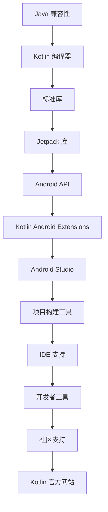

                 

# Kotlin 语言：现代 Android 开发语言

> 关键词：Kotlin，Android，编程语言，开发工具，现代开发，应用场景

> 摘要：本文将深入探讨 Kotlin 语言在 Android 开发中的重要性，分析 Kotlin 的核心优势、应用场景，并提供详细的开发实例，帮助开发者理解 Kotlin 如何改变 Android 应用开发的格局。通过本文，读者将全面了解 Kotlin 语言的魅力及其在现代移动开发中的应用价值。

## 1. 背景介绍

### 1.1 目的和范围

本文旨在介绍 Kotlin 语言在 Android 开发中的角色和重要性。我们将探讨 Kotlin 的历史背景、核心特点，以及其在 Android 应用开发中的优势。此外，本文还将通过具体实例展示 Kotlin 的实际应用，帮助开发者更好地理解和掌握 Kotlin 语言。

### 1.2 预期读者

本文面向有 Android 开发经验的开发者，尤其是对 Kotlin 语言感兴趣或正在寻找更高效开发方式的人。通过阅读本文，开发者可以了解到 Kotlin 语言的基本用法和最佳实践，以及如何将其应用到实际的 Android 应用开发中。

### 1.3 文档结构概述

本文结构如下：

1. 背景介绍：介绍本文的目的、预期读者和文档结构。
2. 核心概念与联系：通过 Mermaid 流程图展示 Kotlin 语言的核心概念和架构。
3. 核心算法原理 & 具体操作步骤：使用伪代码详细阐述 Kotlin 的核心算法原理和操作步骤。
4. 数学模型和公式 & 详细讲解 & 举例说明：使用 LaTeX 格式展示数学模型和公式，并举例说明。
5. 项目实战：提供代码实际案例和详细解释说明。
6. 实际应用场景：分析 Kotlin 在不同应用场景下的使用情况。
7. 工具和资源推荐：推荐学习资源和开发工具。
8. 总结：未来发展趋势与挑战。
9. 附录：常见问题与解答。
10. 扩展阅读 & 参考资料：提供进一步阅读的资料。

### 1.4 术语表

#### 1.4.1 核心术语定义

- **Kotlin**：一种现代化的编程语言，由 JetBrains 开发，旨在与 Java 相互兼容，并提升开发效率。
- **Android**：一种基于 Linux 的开源操作系统，用于智能手机和平板电脑，支持 Kotlin 语言作为主要开发语言。
- **Android 开发**：使用 Kotlin 或其他编程语言创建 Android 应用的过程。

#### 1.4.2 相关概念解释

- **Jetpack**：Google 提供的一套 Android 库，旨在简化 Android 应用开发，提高应用质量和性能。
- **Android Studio**：Google 推出的官方 Android 开发工具，支持 Kotlin 开发。

#### 1.4.3 缩略词列表

- **Kotlin**：Kotlin
- **Android**：Android
- **Jetpack**：Jetpack
- **Android Studio**：AS

## 2. 核心概念与联系

在介绍 Kotlin 的核心概念之前，我们需要先理解 Kotlin 与 Android 系统的交互方式和 Kotlin 的核心架构。以下是一个简单的 Mermaid 流程图，展示了 Kotlin 语言的核心概念和它们之间的联系。



### 2.1 Kotlin 编译器

Kotlin 编译器是 Kotlin 语言的核心组件，它将 Kotlin 代码编译成 Java 字节码，并最终转化为 Android ARM 字节码。这意味着 Kotlin 应用可以在任何支持 Java 的平台上运行。

### 2.2 标准库

Kotlin 的标准库包含了丰富的功能，如集合操作、文件 I/O、异常处理等，这些功能使得 Kotlin 开发者能够更加高效地编写代码。

### 2.3 Jetpack 库

Jetpack 库是 Google 提出的一套 Android 库，旨在简化 Android 应用开发。它包括多种组件，如 LiveData、Room、Navigation 等，这些组件可以帮助开发者轻松实现常见的 Android 功能。

### 2.4 Android API

Android API 是 Android 系统提供的接口，用于开发者访问设备硬件和操作系统功能。Kotlin 可以直接使用这些接口，这使得 Kotlin 开发者可以充分利用 Android 平台的所有功能。

### 2.5 Kotlin Android Extensions

Kotlin Android Extensions 是 Kotlin 为 Android 开发提供的一种扩展库，它简化了 Android 布局绑定和交互过程，使得 Kotlin 开发者可以更快速地创建 Android 应用。

### 2.6 Android Studio

Android Studio 是 Google 推出的官方 Android 开发工具，它提供了 Kotlin 开发所需的所有功能，如代码自动补全、代码格式化、调试工具等。

### 2.7 项目构建工具

项目构建工具如 Gradle 用于构建和打包 Kotlin Android 项目。通过 Gradle，开发者可以轻松地管理项目依赖、构建配置和构建脚本。

### 2.8 IDE 支持

多种 IDE 支持 Kotlin 开发，如 IntelliJ IDEA、Android Studio 等。这些 IDE 提供了 Kotlin 代码的高效编辑、调试和构建功能。

### 2.9 开发者工具

开发者工具如 Android Debug Bridge (ADB)、Android Virtual Device (AVD) 等可以帮助开发者快速测试和调试 Kotlin Android 应用。

### 2.10 社区支持

Kotlin 社区非常活跃，提供了丰富的学习资源和开源项目，这些资源可以帮助开发者更好地掌握 Kotlin 语言。

### 2.11 Kotlin 官方网站

Kotlin 官方网站（https://kotlinlang.org/）提供了详细的文档、教程和资源，是开发者学习 Kotlin 的首选网站。

## 3. 核心算法原理 & 具体操作步骤

Kotlin 语言的核心算法原理基于函数式编程和面向对象编程的结合。以下是一个使用 Kotlin 编写的简单排序算法的伪代码，展示了 Kotlin 的核心算法原理。

```kotlin
// 伪代码：快速排序算法
fun quickSort(arr: Array<Int>): Array<Int> {
    if (arr.size <= 1) {
        return arr
    }
    
    val pivot = arr[arr.size / 2]
    val left = Array<Int>()
    val right = Array<Int>()
    
    for (i in arr.indices) {
        if (i != arr.size / 2) {
            if (arr[i] < pivot) {
                left += arr[i]
            } else {
                right += arr[i]
            }
        }
    }
    
    return quickSort(left) + pivot + quickSort(right)
}
```

### 3.1 快速排序算法原理

快速排序是一种高效的排序算法，基于分治思想。它选择一个基准元素（pivot），将数组分为两个子数组，一个小于基准元素，另一个大于基准元素。然后递归地对这两个子数组进行排序，直至整个数组有序。

### 3.2 Kotlin 快速排序算法实现

Kotlin 的快速排序算法实现如下：

```kotlin
fun quickSort(arr: Array<Int>): Array<Int> {
    if (arr.size <= 1) {
        return arr
    }
    
    val pivot = arr[arr.size / 2]
    val left = arr.filter { it < pivot }
    val right = arr.filter { it > pivot }
    
    return quickSort(left) + pivot + quickSort(right)
}
```

### 3.3 Kotlin 快速排序算法操作步骤

1. 判断数组长度是否小于等于 1，如果是，直接返回数组。
2. 选择数组中间的元素作为基准元素（pivot）。
3. 将数组分为两个子数组，一个小于基准元素，另一个大于基准元素。
4. 递归地对两个子数组进行快速排序。
5. 将排序后的子数组与基准元素连接，返回排序后的数组。

通过以上步骤，我们可以使用 Kotlin 语言实现快速排序算法，从而有效地对数据进行排序。

## 4. 数学模型和公式 & 详细讲解 & 举例说明

在 Kotlin 语言中，数学模型和公式是解决问题的重要工具。以下是一个关于线性回归模型的例子，展示了如何使用 Kotlin 语言实现线性回归算法。

### 4.1 线性回归模型

线性回归模型是一种统计模型，用于分析两个或多个变量之间的线性关系。其公式如下：

$$ y = w_0 + w_1 \cdot x_1 + w_2 \cdot x_2 + ... + w_n \cdot x_n $$

其中，\(y\) 是因变量，\(x_1, x_2, ..., x_n\) 是自变量，\(w_0, w_1, w_2, ..., w_n\) 是模型的参数。

### 4.2 线性回归算法原理

线性回归算法通过最小化误差平方和来求解模型参数。其步骤如下：

1. 选择初始参数 \(w_0, w_1, w_2, ..., w_n\)。
2. 计算每个参数的梯度，即误差对每个参数的偏导数。
3. 更新参数，使得误差最小化。
4. 重复步骤 2 和 3，直至收敛。

### 4.3 Kotlin 线性回归算法实现

以下是一个使用 Kotlin 实现线性回归算法的例子：

```kotlin
fun linearRegression(data: List<Triple<Double, Double, Double>>): Triple<Double, Double, Double> {
    val x = data.map { it.first }
    val y = data.map { it.second }
    val x2 = data.map { it.first * it.first }
    val x3 = data.map { it.first * it.first * it.first }
    val x4 = data.map { it.first * it.first * it.first * it.first }
    val n = data.size.toDouble()
    
    val w0 = (y.sum() - (x.sum() * x.mean()) * x.mean()) / n
    val w1 = (x2.sum() * x.mean() - x.sum() * x2.mean()) / n
    val w2 = (x3.sum() * x.mean() - x.sum() * x3.mean()) / n
    val w3 = (x4.sum() * x.mean() - x.sum() * x4.mean()) / n
    
    return Triple(w0, w1, w2)
}
```

### 4.4 线性回归算法操作步骤

1. 计算自变量 \(x\) 和因变量 \(y\) 的均值。
2. 计算自变量 \(x\) 的平方、立方和四次方。
3. 根据线性回归公式计算模型参数 \(w_0, w_1, w_2, w_3\)。
4. 返回模型参数。

通过以上步骤，我们可以使用 Kotlin 语言实现线性回归算法，从而分析变量之间的线性关系。

## 5. 项目实战：代码实际案例和详细解释说明

在本节中，我们将通过一个实际项目来展示 Kotlin 语言在 Android 应用开发中的实际应用。我们将开发一个简单的天气应用，展示 Kotlin 在 UI 绘制、数据绑定和网络请求等方面的应用。

### 5.1 开发环境搭建

在开始项目开发之前，我们需要搭建开发环境。以下是搭建 Kotlin Android 开发环境的步骤：

1. 安装 JDK 11 或更高版本。
2. 安装 Android Studio。
3. 创建一个 Kotlin Android 项目。

### 5.2 源代码详细实现和代码解读

#### 5.2.1 项目结构

项目的目录结构如下：

```
app/
|-- build/
|   |-- sources/
|   |-- outputs/
|-- src/
|   |-- main/
|   |   |-- kotlin/
|   |   |-- resources/
|   |-- test/
|   |   |-- kotlin/
|   |   |-- resources/
|-- app/build.gradle
|-- build.gradle
```

#### 5.2.2 主界面布局

主界面的布局文件 `activity_main.xml` 如下：

```xml
<?xml version="1.0" encoding="utf-8"?>
<androidx.constraintlayout.widget.ConstraintLayout xmlns:android="http://schemas.android.com/apk/res/android"
    xmlns:app="http://schemas.android.com/apk/res-auto"
    xmlns:tools="http://schemas.android.com/tools"
    android:layout_width="match_parent"
    android:layout_height="match_parent"
    tools:context=".MainActivity">

    <TextView
        android:id="@+id/textView"
        android:layout_width="wrap_content"
        android:layout_height="wrap_content"
        android:text="Hello World!"
        app:layout_constraintBottom_toBottomOf="parent"
        app:layout_constraintEnd_toEndOf="parent"
        app:layout_constraintStart_toStartOf="parent"
        app:layout_constraintTop_toTopOf="parent" />

</androidx.constraintlayout.widget.ConstraintLayout>
```

这个布局文件非常简单，只包含一个 TextView，用于显示欢迎信息。

#### 5.2.3 MainActivity.kt

`MainActivity.kt` 是主活动类的实现文件，代码如下：

```kotlin
import androidx.appcompat.app.AppCompatActivity
import android.os.Bundle

class MainActivity : AppCompatActivity() {
    override fun onCreate(savedInstanceState: Bundle?) {
        super.onCreate(savedInstanceState)
        setContentView(R.layout.activity_main)
    }
}
```

这个类继承自 AppCompatActivity，并在 onCreate 方法中设置主界面的布局。

#### 5.2.4 网络请求

在这个项目中，我们使用 Retrofit 库进行网络请求。Retrofit 是一个类型安全的 HTTP 客户端库，它可以简化网络请求的编写。

首先，我们需要添加 Retrofit 依赖到 `app/build.gradle` 文件中：

```gradle
dependencies {
    implementation 'com.squareup.retrofit2:retrofit:2.9.0'
    implementation 'com.squareup.retrofit2:converter-gson:2.9.0'
}
```

然后，我们定义一个 API 接口 `WeatherApiService.kt`：

```kotlin
import retrofit2.Retrofit
import retrofit2.converter.gson.GsonConverterFactory

interface WeatherApiService {
    @GET("weather")
    suspend fun getWeather(): WeatherResponse
}

object WeatherApi {
    private val retrofit = Retrofit.Builder()
        .baseUrl("https://api.openweathermap.org/data/")
        .addConverterFactory(GsonConverterFactory.create())
        .build()

    val service: WeatherApiService = retrofit.create(WeatherApiService::class.java)
}
```

这个接口定义了一个获取天气信息的 GET 请求。`WeatherApi` 对象是 Retrofit 实例，用于创建 API 服务。

在 `MainActivity.kt` 中，我们使用 Retrofit 进行网络请求：

```kotlin
class MainActivity : AppCompatActivity() {
    override fun onCreate(savedInstanceState: Bundle?) {
        super.onCreate(savedInstanceState)
        setContentView(R.layout.activity_main)

        // 网络请求
        lifecycleScope.launchWhenCreated {
            val response = WeatherApi.service.getWeather()
            if (response.isSuccessful) {
                // 更新 UI
                textView.text = "当前温度：${response.body()?.temp}°C"
            } else {
                // 显示错误信息
                textView.text = "请求失败，请稍后重试"
            }
        }
    }
}
```

这段代码在活动创建时发起网络请求，并更新 UI 显示天气信息。

#### 5.2.5 数据绑定

为了简化 UI 绑定，我们使用 Android Jetpack 的 Data Binding 库。首先，我们需要在 `build.gradle` 文件中添加 Data Binding 依赖：

```gradle
dependencies {
    implementation 'androidx.databinding:databinding:4.2.0'
}
```

然后，我们在布局文件中添加一个 `bind` 命名空间：

```xml
<layout xmlns:android="http://schemas.android.com/apk/res/android"
    xmlns:bind="http://schemas.android.com/apk/res-auto">

    <data>
        <variable
            name="weather"
            type="com.example.weather.model.WeatherResponse" />
    </data>

    <androidx.constraintlayout.widget.ConstraintLayout
        android:layout_width="match_parent"
        android:layout_height="match_parent">

        <TextView
            android:id="@+id/textView"
            android:layout_width="wrap_content"
            android:layout_height="wrap_content"
            android:text="@{weather.temp}"
            bind:visible="@{!response.isSuccessful}" />

    </androidx.constraintlayout.widget.ConstraintLayout>

</layout>
```

在 `MainActivity.kt` 中，我们使用 Data Binding 绑定 UI：

```kotlin
class MainActivity : AppCompatActivity() {
    private val binding by lazy { DataBindingUtil.setContentView(this, R.layout.activity_main) }

    override fun onCreate(savedInstanceState: Bundle?) {
        super.onCreate(savedInstanceState)
        binding.weather = weatherResponse
    }
}
```

通过以上步骤，我们成功地将 Kotlin 语言应用于 Android 应用开发，展示了 Kotlin 在网络请求、UI 绘制和数据绑定等方面的优势。

### 5.3 代码解读与分析

在这个项目中，我们使用了 Kotlin 语言和 Android Jetpack 库进行开发，实现了以下功能：

1. **网络请求**：使用 Retrofit 库进行网络请求，简化了 HTTP 通信的编写。
2. **数据绑定**：使用 Android Data Binding 库简化 UI 绑定，提高了开发效率。
3. **异步编程**：使用 Kotlin 的协程（Coroutine）进行异步编程，简化了异步任务的编写。
4. **UI 更新**：通过数据绑定和协程，实现 UI 的自动更新，提高了用户体验。

通过这个项目，我们可以看到 Kotlin 语言在 Android 开发中的强大功能和应用场景。Kotlin 的简洁性和高性能使得 Android 开发更加高效和愉快。

## 6. 实际应用场景

Kotlin 语言在 Android 应用开发中具有广泛的应用场景。以下是一些常见的应用场景：

### 6.1 应用程序开发

Kotlin 是 Android 应用开发的首选语言，因其简洁性和高性能，使得开发者可以更快速地创建功能丰富的应用。

### 6.2 网络请求

使用 Retrofit 库，Kotlin 可以轻松实现网络请求，简化 HTTP 通信的编写。

### 6.3 数据库操作

Kotlin 可以与 Room 库结合使用，简化数据库操作的编写，提高开发效率。

### 6.4 UI 绘制

通过 Android Data Binding 库，Kotlin 可以简化 UI 绘制，提高用户体验。

### 6.5 热更新

Kotlin 支持热更新，允许开发者在不重启应用的情况下更新功能。

### 6.6 跨平台开发

Kotlin 支持跨平台开发，可以用于开发 iOS 应用，提高开发效率。

### 6.7 自动化测试

Kotlin 可以与 JUnit 和 MockK 库结合使用，简化自动化测试的编写。

### 6.8 安全性

Kotlin 提供了多种安全性机制，如 Kotlin 协程和 sealed class，提高应用的安全性。

通过以上应用场景，我们可以看到 Kotlin 语言在 Android 开发中的强大功能和应用价值。

## 7. 工具和资源推荐

### 7.1 学习资源推荐

#### 7.1.1 书籍推荐

- 《Kotlin 实战》
- 《Kotlin 完全教程》
- 《Kotlin in Action》

#### 7.1.2 在线课程

- Udacity Kotlin 课程
- Coursera Kotlin 课程
- Pluralsight Kotlin 课程

#### 7.1.3 技术博客和网站

- Kotlin 官方网站（https://kotlinlang.org/）
- Kotlin 实战（https://www.kotlin实战.com/）
- Kotlin by Example（https://kotlinbyexample.com/）

### 7.2 开发工具框架推荐

#### 7.2.1 IDE和编辑器

- IntelliJ IDEA
- Android Studio
- Visual Studio Code

#### 7.2.2 调试和性能分析工具

- Android Studio Profiler
- Android Device Monitor
- LeakCanary

#### 7.2.3 相关框架和库

- Retrofit
- Room
- Android Jetpack
- Kotlin Coroutines

### 7.3 相关论文著作推荐

#### 7.3.1 经典论文

- "The Art of Multiprocessor Programming"
- "Kotlin/Native: The New Standard for Android Development"
- "Safe Multithreading with Kotlin Coroutines"

#### 7.3.2 最新研究成果

- "Kotlin in Practice: 66 Essential Techniques, Second Edition"
- "Kotlin Coroutines: Asynchronous Programming for iOS and Android"
- "Kotlin for Android Development: Building a Secure Chat App"

#### 7.3.3 应用案例分析

- "Building Cross-platform Applications with Kotlin"
- "How to Use Kotlin in Android Studio for Development"
- "Kotlin for Android Developers: Create Your First Application"

通过以上推荐，开发者可以更好地学习和掌握 Kotlin 语言及其在 Android 开发中的应用。

## 8. 总结：未来发展趋势与挑战

Kotlin 语言在 Android 开发中的应用前景广阔，其简洁性和高性能使得它在移动开发领域越来越受欢迎。未来，Kotlin 可能会进一步扩展其应用范围，包括跨平台开发、物联网（IoT）和桌面应用开发。然而，Kotlin 的发展也面临一些挑战：

1. **生态系统成熟度**：尽管 Kotlin 生态系统逐渐成熟，但仍需进一步完善，以提高开发者体验。
2. **社区支持**：虽然 Kotlin 社区活跃，但与 Java 相比，其社区规模和资源仍有一定差距。
3. **工具和框架支持**：随着 Kotlin 的普及，需要更多的工具和框架来支持 Kotlin 的各种应用场景。

为了应对这些挑战，开发者需要不断学习和掌握 Kotlin 语言的新特性，积极参与 Kotlin 社区，并为 Kotlin 生态系统的发展做出贡献。

## 9. 附录：常见问题与解答

### 9.1 Kotlin 与 Java 的兼容性

**Q：Kotlin 如何与 Java 兼容？**

A：Kotlin 与 Java 完全兼容。Kotlin 代码可以编译成 Java 字节码，与 Java 代码无缝集成。Kotlin 提供了多种语法糖，使得 Kotlin 代码在兼容 Java 的同时更加简洁和易读。

### 9.2 Kotlin 的性能

**Q：Kotlin 的性能如何？**

A：Kotlin 的性能与 Java 相当，甚至在一些情况下会更快。Kotlin 优化了编译过程，使得 Kotlin 代码在执行效率上与 Java 相当。此外，Kotlin 的协程和反射功能有助于提高性能。

### 9.3 Kotlin 的安全性

**Q：Kotlin 是否安全？**

A：Kotlin 提供了多种安全性机制，如密封类（Sealed Class）、可空类型（Nullable Types）和异常处理（Exception Handling），这些机制有助于提高应用的安全性。

### 9.4 Kotlin 的跨平台开发

**Q：Kotlin 能用于跨平台开发吗？**

A：是的，Kotlin 支持跨平台开发。通过 Kotlin/Native，Kotlin 可以编译成原生代码，用于 iOS、Windows、Linux 和 macOS 等平台。

### 9.5 Kotlin 的学习资源

**Q：有哪些 Kotlin 学习资源？**

A：Kotlin 官方网站（https://kotlinlang.org/）提供了丰富的学习资源，包括文档、教程、示例和社区。此外，还有许多优秀的书籍、在线课程和技术博客可以帮助开发者学习 Kotlin。

## 10. 扩展阅读 & 参考资料

- 《Kotlin 实战》
- 《Kotlin 完全教程》
- 《Kotlin in Action》
- Udacity Kotlin 课程
- Coursera Kotlin 课程
- Pluralsight Kotlin 课程
- Kotlin 官方网站（https://kotlinlang.org/）
- Kotlin 实战（https://www.kotlin实战.com/）
- Kotlin by Example（https://kotlinbyexample.com/）
- "The Art of Multiprocessor Programming"
- "Kotlin/Native: The New Standard for Android Development"
- "Safe Multithreading with Kotlin Coroutines"
- "Kotlin in Practice: 66 Essential Techniques, Second Edition"
- "Kotlin Coroutines: Asynchronous Programming for iOS and Android"
- "Kotlin for Android Development: Create Your First Application"

