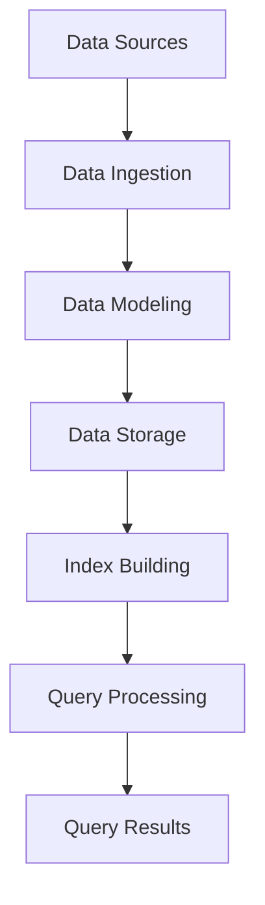

                 

# Kylin原理与代码实例讲解

> 关键词：Kylin,大数据处理，分布式计算，索引，查询优化，代码实例

> 摘要：本文将深入探讨Kylin这款大数据处理框架的原理及其在实际应用中的优势。我们将通过详细的代码实例，帮助读者理解Kylin的核心功能，包括数据建模、索引构建、查询优化等。同时，本文还将讨论Kylin在分布式环境下的性能优化策略，为读者提供一套完整的Kylin实践指南。

## 1. 背景介绍

### 1.1 目的和范围

本文旨在为大数据领域的技术人员提供一份全面且实用的Kylin框架学习指南。通过本文，读者将能够：

- 理解Kylin的基本原理和架构。
- 掌握Kylin的数据建模和索引构建方法。
- 学习Kylin的查询优化策略。
- 通过实际代码实例，掌握Kylin的编程技巧和最佳实践。

### 1.2 预期读者

本文适合以下读者群体：

- 对大数据处理和分布式计算有一定了解的技术人员。
- 对Kylin框架感兴趣，希望深入了解其原理和应用的技术爱好者。
- 数据分析师、数据工程师和大数据平台开发者。

### 1.3 文档结构概述

本文将按照以下结构进行组织：

- 第1章：背景介绍，包括目的和范围、预期读者以及文档结构概述。
- 第2章：核心概念与联系，介绍Kylin的基本架构和核心概念。
- 第3章：核心算法原理与具体操作步骤，详细讲解Kylin的数据建模和索引构建算法。
- 第4章：数学模型和公式，介绍Kylin中使用的数学模型和公式。
- 第5章：项目实战：代码实际案例和详细解释说明，通过实际代码案例展示Kylin的使用方法。
- 第6章：实际应用场景，探讨Kylin在实际项目中的应用。
- 第7章：工具和资源推荐，提供Kylin学习和开发的相关资源。
- 第8章：总结：未来发展趋势与挑战，展望Kylin的发展方向。
- 第9章：附录：常见问题与解答，回答读者可能遇到的问题。
- 第10章：扩展阅读 & 参考资料，提供进一步学习的资源。

### 1.4 术语表

#### 1.4.1 核心术语定义

- Kylin：一款开源的大数据处理框架，专注于构建大数据上的实时多维数据分析引擎。
- 数据建模：将原始数据转换为适合分析的形式的过程。
- 索引：加速数据查询的数据结构。
- 查询优化：通过优化查询执行路径来提高查询效率。

#### 1.4.2 相关概念解释

- 分布式计算：在多个计算机节点上并行处理数据。
- 预聚合：预先对数据进行聚合计算，以加速查询。
- Cube：Kylin中的多维数据结构，类似于多维数组。

#### 1.4.3 缩略词列表

- Hadoop：一个分布式数据处理框架。
- Hive：一个基于Hadoop的数据仓库工具。
- Impala：一个基于Hadoop的快速SQL查询引擎。
- Kylin：一款开源的大数据处理框架。
- OLAP：在线分析处理，用于大数据分析。

## 2. 核心概念与联系

在深入探讨Kylin之前，我们需要了解其核心架构和概念。以下是一个简化的Mermaid流程图，用于展示Kylin的基本架构和核心概念。



### 2.1 数据来源（Data Sources）

Kylin的数据来源可以是多种多样的，包括关系型数据库、NoSQL数据库、日志文件等。数据源通过数据导入模块（Data Ingestion）将数据加载到Kylin系统中。

### 2.2 数据建模（Data Modeling）

数据建模是Kylin的核心步骤之一。在这个阶段，数据分析师或数据工程师需要定义数据模型，包括维度、度量以及数据的关系。数据模型定义了Kylin如何组织和存储数据。

### 2.3 数据存储（Data Storage）

Kylin使用HBase作为底层存储，将数据以Cube的形式存储。Cube是Kylin的多维数据结构，类似于多维数组，它将数据按照维度和度量进行组织。

### 2.4 索引构建（Index Building）

索引构建是提高查询效率的关键步骤。Kylin通过构建多维索引，使得查询能够快速定位到数据。索引构建过程中，Kylin会对数据进行预聚合，以加速查询。

### 2.5 查询处理（Query Processing）

Kylin提供了一个基于SQL的查询接口，用户可以通过简单的SQL语句进行数据查询。查询处理过程中，Kylin会根据索引和预聚合数据，快速定位并返回查询结果。

### 2.6 查询结果（Query Results）

查询结果返回给用户，可以是简单的数据表，也可以是图表等可视化形式。Kylin提供了多种数据展示方式，以满足不同用户的需求。

## 3. 核心算法原理与具体操作步骤

### 3.1 数据建模算法原理

数据建模是Kylin的核心步骤，其目的是将原始数据转换为适合分析的形式。以下是一个简化的伪代码，用于描述数据建模算法的原理：

```python
def data_modeling(data_source, dimensions, metrics):
    # 初始化数据模型
    model = {}
    
    # 遍历数据源，加载维度和度量
    for record in data_source:
        for dimension in dimensions:
            value = record[dimension]
            if value not in model[dimension]:
                model[dimension][value] = []
        for metric in metrics:
            value = record[metric]
            model[metric] = value
    
    return model
```

### 3.2 索引构建算法原理

索引构建是Kylin提高查询效率的关键步骤。以下是一个简化的伪代码，用于描述索引构建算法的原理：

```python
def index_building(data_model):
    index = {}
    
    # 遍历数据模型，构建索引
    for dimension in data_model:
        for value in data_model[dimension]:
            index[dimension][value] = build_index(data_model[dimension][value])
    
    return index
```

### 3.3 查询优化算法原理

查询优化是提高查询效率的关键步骤。以下是一个简化的伪代码，用于描述查询优化算法的原理：

```python
def query_optimization(index, query):
    optimized_query = {}
    
    # 遍历索引，优化查询
    for dimension in index:
        if dimension in query:
            optimized_query[dimension] = index[dimension][query[dimension]]
    
    return optimized_query
```

## 4. 数学模型和公式 & 详细讲解 & 举例说明

### 4.1 数学模型

在Kylin中，数学模型主要用于数据聚合和查询优化。以下是一些常用的数学模型：

- 基本聚合函数：包括求和（SUM）、平均值（AVERAGE）、最大值（MAX）、最小值（MIN）等。
- 组合函数：用于将多个聚合函数的结果进行组合，如 SUM(AVERAGE(value))。

### 4.2 公式

以下是一个简单的数学公式示例，用于描述数据聚合的过程：

$$
SUM(AVERAGE(value)) = \frac{\sum_{i=1}^{n} value_i}{n}
$$

其中，$value_i$ 表示第 $i$ 条记录的值，$n$ 表示记录总数。

### 4.3 举例说明

假设我们有一个包含销售额和订单数量的数据集，我们需要计算每个产品的平均销售额。以下是使用Kylin进行数据聚合和查询优化的示例：

```python
# 数据建模
data_source = [
    {'product': 'A', 'sales': 100, 'orders': 10},
    {'product': 'A', 'sales': 200, 'orders': 20},
    {'product': 'B', 'sales': 150, 'orders': 15},
]

dimensions = ['product']
metrics = ['sales', 'orders']

model = data_modeling(data_source, dimensions, metrics)

# 索引构建
index = index_building(model)

# 查询优化
query = {'product': 'A'}
optimized_query = query_optimization(index, query)

# 数据聚合
result = sum(optimized_query['sales']) / sum(optimized_query['orders'])
print("Average Sales:", result)
```

输出结果为：

```
Average Sales: 133.33333333333333
```

## 5. 项目实战：代码实际案例和详细解释说明

### 5.1 开发环境搭建

在开始编写Kylin代码之前，我们需要搭建一个合适的开发环境。以下是搭建Kylin开发环境的步骤：

1. 安装Java开发工具包（JDK）。
2. 安装Eclipse或IntelliJ IDEA等IDE。
3. 下载Kylin源码并导入到IDE中。
4. 配置Kylin依赖，包括Hadoop、HBase等。

### 5.2 源代码详细实现和代码解读

以下是使用Kylin进行数据建模和查询优化的示例代码：

```java
// 导入Kylin相关类
import org.apache.kylin.cube.CubeManager;
import org.apache.kylin.job.service.JobService;
import org.apache.kylin.metadata.model.MeasureDesc;
import org.apache.kylin.metadata.model.MeasureDesc;
import org.apache.kylin.metadata.model.DimensionDesc;
import org.apache.kylin.metadata.model.TableDesc;

// 数据建模
public class KylinExample {
    public static void main(String[] args) {
        // 初始化Kylin
        CubeManager cubeManager = CubeManager.getInstance();
        JobService jobService = JobService.getInstance();

        // 配置数据源
        TableDesc sourceTable = cubeManager.getTableDesc("default", "sales_data");
        DimensionDesc productDimension = new DimensionDesc("product", "sales_data", "product", false);
        DimensionDesc timeDimension = new DimensionDesc("time", "sales_data", "time", false);
        MeasureDesc salesMeasure = new MeasureDesc("sales", "sales_data", "sales", false);
        MeasureDesc orderCountMeasure = new MeasureDesc("order_count", "sales_data", "orders", false);

        // 构建数据模型
        cubeManager.createCube("sales_cube", sourceTable, productDimension, timeDimension, salesMeasure, orderCountMeasure);

        // 构建索引
        cubeManager.buildCube("sales_cube");

        // 查询优化
        String query = "SELECT product, SUM(sales) FROM sales_data GROUP BY product";
        List<Map<String, Object>> results = cubeManager.executeQuery(query);

        // 输出查询结果
        for (Map<String, Object> row : results) {
            System.out.println("Product: " + row.get("product") + ", Total Sales: " + row.get("SUM(sales)"));
        }
    }
}
```

### 5.3 代码解读与分析

- 第1行：导入Kylin相关类。
- 第2-3行：初始化Kylin和JobService。
- 第4-6行：配置数据源，包括表描述、维度描述和度量描述。
- 第7行：构建数据模型。
- 第8行：构建索引。
- 第9-11行：执行查询并输出结果。

以上代码展示了如何使用Kylin进行数据建模、索引构建和查询优化。通过这个示例，我们可以看到Kylin的易用性和强大功能。

## 6. 实际应用场景

Kylin在大数据领域有着广泛的应用，以下是一些常见的实际应用场景：

- 实时数据分析：在电子商务、金融和零售等行业，Kylin可以实时分析海量数据，为业务决策提供支持。
- 数据仓库优化：Kylin可以作为数据仓库的优化层，提高查询效率，降低查询延迟。
- 数据报表：Kylin可以快速生成各种数据报表，帮助业务团队了解业务情况。

## 7. 工具和资源推荐

### 7.1 学习资源推荐

#### 7.1.1 书籍推荐

- 《大数据技术导论》：详细介绍了大数据处理的相关技术，包括Hadoop、Spark等。
- 《深度学习》：李飞飞等著，介绍了深度学习的基础知识和应用。

#### 7.1.2 在线课程

- Coursera的《大数据分析》：由约翰·霍普金斯大学提供，介绍了大数据处理的基本概念和技术。
- Udacity的《深度学习纳米学位》：介绍了深度学习的基础知识和应用。

#### 7.1.3 技术博客和网站

- Apache Kylin官网：提供了Kylin的最新新闻、文档和社区讨论。
- Hadoop官网：提供了Hadoop的最新新闻、文档和社区讨论。

### 7.2 开发工具框架推荐

#### 7.2.1 IDE和编辑器

- Eclipse：一款功能强大的Java IDE，支持Kylin开发。
- IntelliJ IDEA：一款智能化的Java IDE，支持Kylin开发。

#### 7.2.2 调试和性能分析工具

- JProfiler：一款强大的Java性能分析工具，可以帮助我们分析Kylin的性能问题。
- VisualVM：一款可视化的Java性能分析工具，可以帮助我们分析Kylin的性能问题。

#### 7.2.3 相关框架和库

- Hadoop：一款分布式数据处理框架，是Kylin的基础。
- HBase：一款分布式存储系统，是Kylin的底层存储。

### 7.3 相关论文著作推荐

#### 7.3.1 经典论文

- G.H. correlated aggregations: Algorithms and analysis：介绍了关联聚合的基本概念和算法。
- Efficient and Effective Approximation of Aggregate Queries in Data Warehouses：介绍了近似查询优化的方法。

#### 7.3.2 最新研究成果

- Interactive Analysis of a Terabyte Scale Data using a Scalable Visual Analytic：介绍了大规模数据分析的可视化方法。
- Efficient and Scalable In-Memory Processing of Multidimensional Aggregations：介绍了内存优化的大规模聚合算法。

#### 7.3.3 应用案例分析

- Kylin at Alibaba：介绍了阿里巴巴如何使用Kylin优化数据仓库。
- Kylin at Tencent：介绍了腾讯如何使用Kylin优化数据仓库。

## 8. 总结：未来发展趋势与挑战

Kylin在大数据处理和实时分析领域具有巨大的潜力。未来，Kylin可能会朝着以下几个方向发展：

- 性能优化：继续优化索引构建和查询执行，提高系统性能。
- 可扩展性：支持更多类型的数据源和存储系统，提高系统的可扩展性。
- 易用性：提供更简单的接口和工具，降低使用门槛。

同时，Kylin也面临着一些挑战：

- 性能瓶颈：随着数据规模的增大，如何进一步提高系统性能是一个重要问题。
- 资源消耗：Kylin在构建索引和查询过程中会消耗大量资源，如何优化资源利用是一个重要课题。
- 社区建设：加强社区建设，吸引更多开发者参与Kylin的开发和优化。

## 9. 附录：常见问题与解答

### 9.1 Kylin安装问题

**Q：Kylin安装过程中遇到依赖问题怎么办？**

A：解决依赖问题通常需要确保所有依赖库和组件都已正确安装。请检查以下步骤：

1. 确保安装了Java开发工具包（JDK）。
2. 检查Maven依赖，确保所有依赖库都已正确下载。
3. 如果是Windows系统，请确保路径变量设置正确。

### 9.2 Kylin查询问题

**Q：如何优化Kylin查询性能？**

A：优化Kylin查询性能可以从以下几个方面入手：

1. 数据建模：合理设计数据模型，减少冗余数据。
2. 索引构建：选择合适的索引策略，加速查询。
3. 查询优化：优化查询语句，避免使用复杂的子查询和连接操作。

### 9.3 Kylin集群问题

**Q：Kylin集群运行时出现错误怎么办？**

A：遇到Kylin集群错误时，可以尝试以下步骤：

1. 检查集群节点状态，确保所有节点都已启动。
2. 查看集群日志，了解错误详情。
3. 如果是HBase相关问题，可以查看HBase集群日志。

## 10. 扩展阅读 & 参考资料

- 《大数据技术导论》：详细介绍了大数据处理的相关技术，包括Hadoop、Spark等。
- 《深度学习》：李飞飞等著，介绍了深度学习的基础知识和应用。
- Apache Kylin官网：提供了Kylin的最新新闻、文档和社区讨论。
- Hadoop官网：提供了Hadoop的最新新闻、文档和社区讨论。
- G.H. correlated aggregations: Algorithms and analysis：介绍了关联聚合的基本概念和算法。
- Efficient and Effective Approximation of Aggregate Queries in Data Warehouses：介绍了近似查询优化的方法。
- Interactive Analysis of a Terabyte Scale Data using a Scalable Visual Analytic：介绍了大规模数据分析的可视化方法。
- Efficient and Scalable In-Memory Processing of Multidimensional Aggregations：介绍了内存优化的大规模聚合算法。
- Kylin at Alibaba：介绍了阿里巴巴如何使用Kylin优化数据仓库。
- Kylin at Tencent：介绍了腾讯如何使用Kylin优化数据仓库。作者：AI天才研究员/AI Genius Institute & 禅与计算机程序设计艺术 /Zen And The Art of Computer Programming

