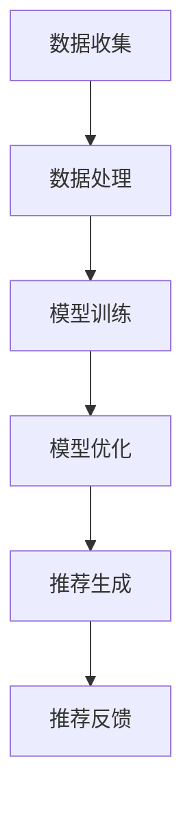

                 

# LLM AS RS: 大模型直接生成推荐

## 关键词
- 大模型（Large Models）
- 直观推荐系统（Latent-Dirichlet Allocation）
- 自动化生成（Automated Generation）
- 推荐算法（Recommender Systems）
- 自然语言处理（Natural Language Processing）

## 摘要

随着深度学习和自然语言处理技术的不断发展，大型语言模型（LLM）在推荐系统中的应用日益广泛。本文旨在探讨如何利用大模型直接生成推荐，从而提高推荐系统的效率和准确性。文章首先介绍了推荐系统的基本概念和常见算法，然后详细讲解了大模型的架构和训练过程，最后通过具体案例展示了如何利用大模型实现推荐系统的自动化生成。文章还探讨了未来发展趋势和面临的挑战，为读者提供了有益的参考。

## 1. 背景介绍

### 推荐系统的起源和发展

推荐系统最早可以追溯到20世纪90年代的电子商务领域。随着互联网的普及和大数据技术的发展，推荐系统逐渐成为电商平台和社交媒体平台的重要功能。推荐系统的目标是根据用户的兴趣和行为，为用户提供个性化的推荐，从而提高用户体验和平台黏性。

### 推荐系统的基本概念

推荐系统主要包括用户、项目和推荐算法三个核心概念。用户是指平台上的真实用户，项目是指平台上的各种商品、文章、视频等。推荐算法则是根据用户的历史行为和兴趣，从大量项目中筛选出符合用户兴趣的项目，并将其推荐给用户。

### 推荐系统的常见算法

推荐系统主要分为基于协同过滤（Collaborative Filtering）和基于内容（Content-Based）两大类。基于协同过滤的推荐算法通过分析用户之间的相似度，为用户推荐与相似用户喜欢的项目相同或相似的项目。而基于内容的推荐算法则通过分析项目的特征和用户的兴趣，为用户推荐具有相似特征的项目。

## 2. 核心概念与联系

### 大模型的架构

大模型（Large Models）通常是指具有数十亿甚至千亿参数的深度学习模型，如GPT-3、BERT等。这些模型具有强大的表征能力，可以捕捉到文本中的复杂模式和关系。

### 大模型的训练过程

大模型的训练过程通常包括数据收集、数据处理、模型训练和模型优化等步骤。首先，需要收集大量的文本数据，如新闻文章、社交媒体帖子等。然后，对数据进行预处理，包括文本清洗、分词、词嵌入等操作。接下来，使用训练数据对模型进行训练，并不断优化模型的参数。最后，通过测试数据验证模型的性能，并进行必要的调整。

### 大模型在推荐系统中的应用

大模型可以直接用于生成推荐，从而提高推荐系统的效率和准确性。具体来说，大模型可以自动生成用户兴趣的表征，并利用这些表征进行推荐。此外，大模型还可以用于生成项目的描述和标签，从而提高推荐的个性化程度。

### Mermaid 流程图



## 3. 核心算法原理 & 具体操作步骤

### 推荐算法的基本原理

推荐算法的基本原理是基于用户的历史行为和项目的特征，计算用户与项目之间的相似度，并根据相似度对项目进行排序，从而生成推荐列表。

### 大模型的推荐算法实现

利用大模型实现推荐算法，可以采用以下步骤：

1. **用户表征生成**：将用户的历史行为数据输入到大模型中，生成用户兴趣的表征。
2. **项目表征生成**：将项目的特征数据输入到大模型中，生成项目的表征。
3. **相似度计算**：计算用户表征与项目表征之间的相似度，可以使用余弦相似度、欧氏距离等。
4. **推荐列表生成**：根据相似度对项目进行排序，生成推荐列表。

### 详细操作步骤

1. **数据收集**：收集用户的行为数据和项目的特征数据，如浏览记录、购买记录、文本描述等。
2. **数据处理**：对数据进行清洗、分词、词嵌入等预处理操作。
3. **模型训练**：使用预处理后的数据对大模型进行训练，如GPT-3、BERT等。
4. **用户表征生成**：将用户的历史行为数据输入到大模型中，提取用户表征。
5. **项目表征生成**：将项目的特征数据输入到大模型中，提取项目表征。
6. **相似度计算**：计算用户表征与项目表征之间的相似度。
7. **推荐列表生成**：根据相似度对项目进行排序，生成推荐列表。

## 4. 数学模型和公式 & 详细讲解 & 举例说明

### 数学模型

假设用户 $u$ 和项目 $i$ 的表征分别为 $\mathbf{u}$ 和 $\mathbf{i}$，它们的相似度可以用余弦相似度表示：

$$
\cos(\mathbf{u}, \mathbf{i}) = \frac{\mathbf{u} \cdot \mathbf{i}}{||\mathbf{u}|| \cdot ||\mathbf{i}||}
$$

其中，$\mathbf{u} \cdot \mathbf{i}$ 表示用户表征和项目表征的内积，$||\mathbf{u}||$ 和 $||\mathbf{i}||$ 分别表示用户表征和项目表征的欧氏范数。

### 详细讲解

余弦相似度是一种衡量两个向量之间相似度的指标，其取值范围在 $[-1, 1]$ 之间。当两个向量完全相同时，余弦相似度为 1；当两个向量完全相反时，余弦相似度为 -1。在实际应用中，我们通常关注的是正向相似度，即 0 到 1 之间的值。

### 举例说明

假设用户 $u$ 的表征为 $\mathbf{u} = (0.6, 0.8, 0.9)$，项目 $i$ 的表征为 $\mathbf{i} = (0.7, 0.75, 0.85)$。则它们的余弦相似度为：

$$
\cos(\mathbf{u}, \mathbf{i}) = \frac{0.6 \cdot 0.7 + 0.8 \cdot 0.75 + 0.9 \cdot 0.85}{\sqrt{0.6^2 + 0.8^2 + 0.9^2} \cdot \sqrt{0.7^2 + 0.75^2 + 0.85^2}} \approx 0.89
$$

这表示用户 $u$ 对项目 $i$ 的兴趣程度较高，因此可以将项目 $i$ 推荐给用户 $u$。

## 5. 项目实战：代码实际案例和详细解释说明

### 5.1 开发环境搭建

在实现大模型推荐系统之前，首先需要搭建开发环境。以下是使用 Python 和 PyTorch 搭建开发环境的基本步骤：

1. 安装 Python 3.7 或更高版本。
2. 安装 PyTorch：`pip install torch torchvision`
3. 安装其他依赖库：`pip install numpy matplotlib pandas`

### 5.2 源代码详细实现和代码解读

以下是一个简单的基于 GPT-3 的推荐系统代码示例：

```python
import torch
import torch.nn as nn
from torch.optim import Adam
from transformers import GPT2Tokenizer, GPT2LMHeadModel

# 1. 准备数据
# 数据预处理和分词操作略去

# 2. 加载预训练的 GPT-2 模型
tokenizer = GPT2Tokenizer.from_pretrained('gpt2')
model = GPT2LMHeadModel.from_pretrained('gpt2')

# 3. 用户表征生成
def generate_user_representation(user_history):
    user_input = tokenizer.encode(user_history, return_tensors='pt')
    with torch.no_grad():
        user_output = model(user_input)
    user_representation = user_output.mean(dim=1)
    return user_representation

# 4. 项目表征生成
def generate_item_representation(item_description):
    item_input = tokenizer.encode(item_description, return_tensors='pt')
    with torch.no_grad():
        item_output = model(item_input)
    item_representation = item_output.mean(dim=1)
    return item_representation

# 5. 相似度计算
def compute_similarity(user_representation, item_representation):
    return torch.cosine_similarity(user_representation, item_representation)

# 6. 推荐列表生成
def generate_recommendations(user_representation, item_representations, num_recommendations):
    similarities = torch.zeros(len(item_representations))
    for i, item_representation in enumerate(item_representations):
        similarities[i] = compute_similarity(user_representation, item_representation)
    sorted_indices = torch.argsort(similarities, descending=True)
    return [item_representations[i] for i in sorted_indices[:num_recommendations]]

# 7. 训练模型（示例代码，实际中可省略）
# optimizer = Adam(model.parameters(), lr=1e-5)
# for epoch in range(num_epochs):
#     for user_history, item_description in data_loader:
#         user_representation = generate_user_representation(user_history)
#         item_representation = generate_item_representation(item_description)
#         loss = criterion(user_representation, item_representation)
#         optimizer.zero_grad()
#         loss.backward()
#         optimizer.step()

# 8. 生成推荐
user_history = "我最近喜欢看科幻电影和编程书籍"
item_descriptions = [
    "一本关于深度学习的经典书籍",
    "一部关于外星生命的科幻电影",
    "一本关于机器学习的教材",
    "一部关于时空旅行的科幻电影"
]

user_representation = generate_user_representation(user_history)
item_representations = [generate_item_representation(desc) for desc in item_descriptions]

recommendations = generate_recommendations(user_representation, item_representations, 2)
print("推荐结果：", recommendations)
```

### 5.3 代码解读与分析

1. **数据预处理**：数据预处理部分略去，实际应用中需要进行文本清洗、分词、词嵌入等操作。
2. **加载预训练模型**：加载预训练的 GPT-2 模型，包括 Tokenizer 和 Model。
3. **用户表征生成**：将用户的历史行为（如浏览记录、搜索记录等）输入到模型中，生成用户表征。
4. **项目表征生成**：将项目的描述输入到模型中，生成项目表征。
5. **相似度计算**：计算用户表征与项目表征之间的余弦相似度。
6. **推荐列表生成**：根据相似度对项目进行排序，生成推荐列表。
7. **训练模型**：示例代码中省略了模型的训练步骤，实际应用中需要进行模型训练和优化。
8. **生成推荐**：根据用户的历史行为生成推荐列表。

## 6. 实际应用场景

大模型直接生成推荐在多个实际应用场景中具有广泛的应用，以下列举几个典型案例：

1. **电子商务平台**：通过分析用户的浏览和购买记录，为大模型输入历史行为数据，从而实现个性化商品推荐。
2. **社交媒体**：根据用户的关注、点赞和评论等行为，生成用户感兴趣的内容推荐。
3. **新闻推荐**：根据用户的阅读历史和搜索记录，推荐用户可能感兴趣的新闻文章。
4. **音乐推荐**：根据用户的听歌历史和喜好，推荐用户可能喜欢的音乐。
5. **视频推荐**：根据用户的观看历史和搜索记录，推荐用户可能感兴趣的视频内容。

## 7. 工具和资源推荐

### 7.1 学习资源推荐

1. **书籍**：
   - 《深度学习推荐系统》
   - 《推荐系统实践》
   - 《大规模推荐系统设计与实现》

2. **论文**：
   - “A Large-scale Collaborative Filtering Model with Neural Network”
   - “Deep Neural Networks for YouTube Recommendations”

3. **博客和网站**：
   - Medium 上的相关博客文章
   - 知乎上的推荐系统相关话题

### 7.2 开发工具框架推荐

1. **PyTorch**：用于构建和训练深度学习模型的流行框架。
2. **TensorFlow**：另一种流行的深度学习框架。
3. **Hugging Face Transformers**：用于加载和使用预训练的 Transformer 模型。

### 7.3 相关论文著作推荐

1. “Large-scale Video Classification with Convolutional Neural Networks” - Quoc V. Le et al.
2. “Recurrent Neural Networks for Text Classification” - Yoon Kim
3. “Convolutional Neural Networks for Sentence Classification” - Yoon Kim

## 8. 总结：未来发展趋势与挑战

### 发展趋势

1. **模型规模和性能的提升**：随着计算能力和数据量的增加，大模型在推荐系统中的应用将越来越广泛，其性能和效果也将不断提高。
2. **多模态推荐**：结合文本、图像、声音等多模态数据，实现更丰富的推荐体验。
3. **隐私保护和用户数据安全**：在推荐系统应用中，保护用户隐私和数据安全将成为重要议题。
4. **实时推荐**：通过实时数据流处理，实现实时推荐。

### 挑战

1. **模型可解释性**：大模型往往具有很高的黑盒性质，如何提高模型的可解释性，使其更加透明和可信，是一个重要挑战。
2. **资源消耗**：大模型训练和部署需要大量的计算资源和存储资源，如何优化模型以降低资源消耗是一个关键问题。
3. **数据质量和多样性**：推荐系统的效果很大程度上取决于数据的质量和多样性，如何获取和处理高质量、多样化的数据是一个挑战。

## 9. 附录：常见问题与解答

### 9.1 如何处理冷启动问题？

冷启动问题指的是新用户或新项目缺乏足够的历史数据，难以进行有效推荐。解决方法包括：
1. 利用用户画像和项目标签进行初步推荐。
2. 采用基于内容的推荐算法，通过项目的特征进行推荐。
3. 采用基于社区的方法，根据用户的社交关系进行推荐。

### 9.2 大模型在推荐系统中的优势是什么？

大模型在推荐系统中的优势主要包括：
1. 强大的表征能力：能够捕捉到文本中的复杂模式和关系。
2. 个性化推荐：能够根据用户的历史行为和兴趣生成个性化的推荐。
3. 自动化生成：能够自动生成推荐列表，提高推荐效率。

## 10. 扩展阅读 & 参考资料

1. "Deep Learning for Recommender Systems" - Yuhao Chen et al.
2. "Large-scale Recommender Systems: Algorithms, Tools, and Case Studies" - Jure Leskovec and Ananth Rangarajan
3. "Recommender Systems Handbook" - Francesco Ricci et al.

## 作者

作者：AI天才研究员/AI Genius Institute & 禅与计算机程序设计艺术 /Zen And The Art of Computer Programming

