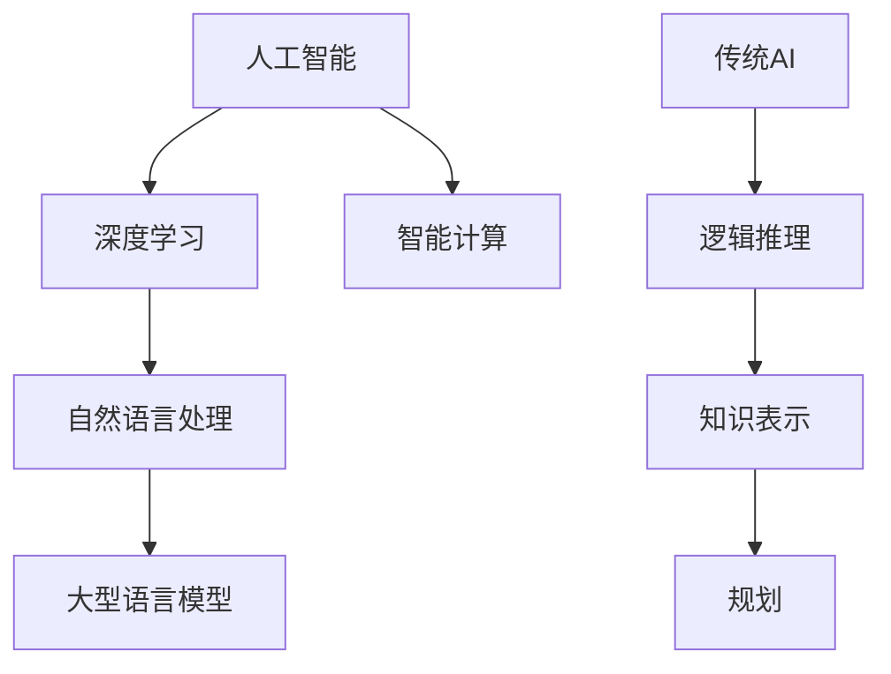

                 


# LLM vs 传统AI：智能计算的新范式

> 关键词：大型语言模型（LLM）、传统AI、智能计算、新范式、算法原理、数学模型、应用场景
>
> 摘要：本文将深入探讨大型语言模型（LLM）与传统AI之间的区别和联系，分析智能计算的新范式，通过具体的算法原理、数学模型、应用场景等方面展开讨论，帮助读者理解LLM在智能计算领域的重要性及其未来发展趋势。

## 1. 背景介绍

### 1.1 目的和范围

本文旨在探讨大型语言模型（LLM）与传统AI在智能计算领域的区别与联系，分析智能计算的新范式。通过对核心概念、算法原理、数学模型、应用场景等方面的详细讲解，帮助读者全面了解LLM的优势和挑战。

### 1.2 预期读者

本文适合对人工智能领域有一定了解的读者，包括AI研究人员、开发人员、工程师以及对AI技术感兴趣的学者。

### 1.3 文档结构概述

本文分为十个部分，主要包括：

1. 背景介绍
2. 核心概念与联系
3. 核心算法原理 & 具体操作步骤
4. 数学模型和公式 & 详细讲解 & 举例说明
5. 项目实战：代码实际案例和详细解释说明
6. 实际应用场景
7. 工具和资源推荐
8. 总结：未来发展趋势与挑战
9. 附录：常见问题与解答
10. 扩展阅读 & 参考资料

### 1.4 术语表

#### 1.4.1 核心术语定义

- 大型语言模型（LLM）：一种基于深度学习的语言处理模型，具有强大的自然语言理解和生成能力。
- 传统AI：基于逻辑推理、知识表示和规划等方法的经典AI技术。
- 智能计算：利用计算技术模拟人类智能，实现智能感知、理解和决策的过程。

#### 1.4.2 相关概念解释

- 深度学习：一种机器学习技术，通过模拟人脑神经网络结构和学习机制，实现特征提取和模式识别。
- 自然语言处理（NLP）：研究如何使计算机能够理解、解释和生成自然语言。

#### 1.4.3 缩略词列表

- LLM：大型语言模型
- AI：人工智能
- NLP：自然语言处理
- DL：深度学习

## 2. 核心概念与联系

在探讨LLM与传统AI的区别之前，我们需要明确它们的核心概念和联系。以下是核心概念及其关系的Mermaid流程图：



### 2.1 人工智能

人工智能（AI）是模拟、延伸和扩展人类智能的理论、方法、技术及应用的总称。它包括多个子领域，如机器学习、计算机视觉、自然语言处理等。在人工智能的发展历程中，深度学习作为一种新兴技术，逐渐成为主流。

### 2.2 深度学习

深度学习是人工智能的一个重要分支，基于多层神经网络结构，通过大量数据训练模型，实现特征提取和模式识别。深度学习在图像识别、语音识别、自然语言处理等领域取得了显著的成果。

### 2.3 自然语言处理

自然语言处理（NLP）是研究如何使计算机能够理解、解释和生成自然语言的技术。NLP包括词法分析、句法分析、语义分析等多个方面，其目标是实现人与计算机之间的自然语言交互。

### 2.4 大型语言模型

大型语言模型（LLM）是一种基于深度学习的NLP模型，具有强大的自然语言理解和生成能力。LLM通过预训练和微调，可以在多个任务中表现出色，如文本分类、机器翻译、问答系统等。

### 2.5 传统AI

传统AI是基于逻辑推理、知识表示和规划等方法的经典AI技术。传统AI在推理、规划、知识表示等领域具有较强的优势，但其在自然语言处理等领域的表现相对较弱。

### 2.6 智能计算

智能计算是利用计算技术模拟人类智能，实现智能感知、理解和决策的过程。智能计算包括人工智能、物联网、大数据等多个领域，其目标是实现人机智能的融合。

## 3. 核心算法原理 & 具体操作步骤

在理解了核心概念和联系之后，我们来探讨LLM的核心算法原理和具体操作步骤。

### 3.1 算法原理

大型语言模型（LLM）的核心算法是深度学习，特别是基于Transformer的架构。Transformer架构由多个自注意力（self-attention）模块组成，能够捕捉输入序列中任意位置的信息。

#### 3.1.1 自注意力机制

自注意力机制是一种权重分配方法，它将每个输入位置的权重分配给其他所有位置。在自注意力机制中，每个位置的输出由其自身和其他位置的加权求和得到。

#### 3.1.2 Multi-head Self-Attention

Multi-head Self-Attention是在自注意力机制的基础上，将整个输入序列分成多个头（head），每个头独立地计算注意力权重，然后进行加权求和。Multi-head Self-Attention能够捕获不同层次的特征，提高模型的表示能力。

#### 3.1.3 位置编码

由于Transformer模型缺乏对输入序列位置信息的处理，因此需要引入位置编码（position encoding）来为模型提供位置信息。位置编码可以是基于三角函数的，也可以是预先训练好的。

### 3.2 具体操作步骤

以下是基于Transformer架构的LLM的具体操作步骤：

```python
# 导入相关库
import torch
import torch.nn as nn

# 定义模型
class LLM(nn.Module):
    def __init__(self, d_model, d_hid, n_heads, n_layers, vocab_size):
        super(LLL, self).__init__()
        
        self.embedding = nn.Embedding(vocab_size, d_model)
        self.position_encoding = nn.Parameter(torch.randn(1, seq_len, d_model))
        
        self.transformer = nn.Sequential(
            *[
                nn.Sequential(
                    nn.Linear(d_model, d_hid),
                    nn.GELU(),
                    nn.Linear(d_hid, d_model)
                ) for _ in range(n_layers)
            ]
        )
        
        self.output_layer = nn.Linear(d_model, vocab_size)
    
    def forward(self, x, pos):
        x = self.embedding(x)
        x = x + self.position_encoding(pos)
        
        x = self.transformer(x)
        
        x = self.output_layer(x)
        
        return x
```

## 4. 数学模型和公式 & 详细讲解 & 举例说明

在理解了LLM的算法原理和具体操作步骤之后，我们进一步探讨LLM的数学模型和公式。

### 4.1 自注意力机制

自注意力机制的核心公式为：

$$
\text{Attention}(Q, K, V) = \text{softmax}\left(\frac{QK^T}{\sqrt{d_k}}\right)V
$$

其中，Q、K和V分别为查询（query）、键（key）和值（value）向量，d_k为键向量的维度。Attention函数计算每个键和查询之间的相似度，然后对相似度进行加权求和，得到输出向量。

### 4.2 Multi-head Self-Attention

Multi-head Self-Attention将输入序列分成多个头（head），每个头独立地计算注意力权重，然后进行加权求和。Multi-head Self-Attention的核心公式为：

$$
\text{Multi-head Self-Attention}(Q, K, V) = \left[\text{Attention}(Q_1, K_1, V_1), \text{Attention}(Q_2, K_2, V_2), ..., \text{Attention}(Q_h, K_h, V_h)\right]
$$

其中，Q_i、K_i和V_i分别为第i个头的查询、键和值向量。

### 4.3 位置编码

位置编码可以基于三角函数，其公式为：

$$
PE_{(pos, 2i)} = \sin\left(\frac{pos}{10000^{2i/d}}\right)
$$

$$
PE_{(pos, 2i+1)} = \cos\left(\frac{pos}{10000^{2i/d}}\right)
$$

其中，pos为位置索引，d为模型维度。

### 4.4 举例说明

假设我们有一个包含5个单词的句子，模型维度为10，头数为2。以下是一个简单的Multi-head Self-Attention计算示例：

```python
# 假设输入序列为：["Hello", "world", "!", "This", "is"]
vocab_size = 10000
d_model = 10
n_heads = 2

# 生成随机输入序列
x = torch.randint(0, vocab_size, (5, 1))
print("Input sequence:", x)

# 生成位置编码
pos = torch.arange(1, 6)
position_encoding = torch.randn(1, 5, d_model)
print("Position encoding:", position_encoding)

# 计算注意力权重
Q = K = V = x
KQ = torch.matmul(K, Q.T)  # (5, 5)
attention_weights = torch.softmax(KQ / torch.sqrt(torch.tensor(d_model)), dim=1)  # (5, 5)
print("Attention weights:\n", attention_weights)

# 计算输出
output = torch.matmul(attention_weights, V)  # (5, 10)
print("Output:", output)

# 计算多头注意力
multihead_output = torch.zeros((5, d_model))
for i in range(n_heads):
    Q_i = K_i = V_i = x
    KQ_i = torch.matmul(K_i, Q_i.T)  # (5, 5)
    attention_weights_i = torch.softmax(KQ_i / torch.sqrt(torch.tensor(d_model)), dim=1)  # (5, 5)
    multihead_output += torch.matmul(attention_weights_i, V_i)  # (5, 10)
print("Multi-head output:", multihead_output)
```

## 5. 项目实战：代码实际案例和详细解释说明

在本节中，我们将通过一个实际项目案例来展示如何使用LLM进行自然语言处理任务。以下是一个基于Python和PyTorch的简单文本分类项目：

### 5.1 开发环境搭建

1. 安装Python（3.7或更高版本）
2. 安装PyTorch：`pip install torch torchvision`
3. 安装其他依赖：`pip install numpy pandas sklearn`

### 5.2 源代码详细实现和代码解读

```python
# 导入相关库
import torch
import torch.nn as nn
import torch.optim as optim
from torch.utils.data import DataLoader, TensorDataset
import numpy as np
import pandas as pd
from sklearn.model_selection import train_test_split

# 定义模型
class LLM(nn.Module):
    # ...（此处为前面定义的LLM模型代码）

# 数据预处理
def preprocess_data(data):
    # 将文本转换为单词序列
    word_sequences = [sentence.split() for sentence in data]
    
    # 构建词汇表和索引
    vocab = set(word for sentence in word_sequences for word in sentence)
    vocab_size = len(vocab)
    word_to_index = {word: i for i, word in enumerate(vocab)}
    index_to_word = {i: word for word, i in word_to_index.items()}
    
    # 将单词序列转换为索引序列
    index_sequences = [[word_to_index[word] for word in sentence] for sentence in word_sequences]
    
    # 将索引序列转换为PyTorch张量
    inputs = torch.tensor([index_sequence + [vocab_size] for index_sequence in index_sequences], dtype=torch.long)
    targets = torch.tensor([index_sequence[:-1] for index_sequence in index_sequences], dtype=torch.long)
    
    return inputs, targets, word_to_index, index_to_word

# 训练模型
def train_model(model, inputs, targets, batch_size=32, epochs=10):
    # 创建数据加载器
    dataset = TensorDataset(inputs, targets)
    dataloader = DataLoader(dataset, batch_size=batch_size)
    
    # 模型参数初始化
    model.train()
    optimizer = optim.Adam(model.parameters(), lr=0.001)
    criterion = nn.CrossEntropyLoss()
    
    # 训练模型
    for epoch in range(epochs):
        for inputs_batch, targets_batch in dataloader:
            optimizer.zero_grad()
            outputs = model(inputs_batch, pos=inputs_batch)
            loss = criterion(outputs, targets_batch)
            loss.backward()
            optimizer.step()
            
            if (epoch + 1) % 10 == 0:
                print(f"Epoch [{epoch + 1}/{epochs}], Loss: {loss.item():.4f}")
    
    return model

# 应用模型
def apply_model(model, index_to_word, text):
    # 将文本转换为索引序列
    index_sequence = preprocess_data([text])[0]
    
    # 预测类别
    model.eval()
    with torch.no_grad():
        outputs = model(torch.tensor(index_sequence).unsqueeze(0))
    _, predicted = torch.max(outputs, 1)
    
    # 将类别索引转换为文本
    predicted_word = index_to_word[predicted.item()]
    return predicted_word
```

### 5.3 代码解读与分析

- **模型定义**：我们使用前面定义的LLM模型，该模型基于Transformer架构，具有自注意力机制和多头注意力机制。
- **数据预处理**：将原始文本数据转换为单词序列，构建词汇表和索引，将单词序列转换为索引序列，并将索引序列转换为PyTorch张量。
- **训练模型**：使用数据加载器将输入和目标数据进行批处理，使用Adam优化器和交叉熵损失函数训练模型。
- **应用模型**：将文本数据转换为索引序列，使用训练好的模型进行预测，将预测结果转换为文本。

## 6. 实际应用场景

大型语言模型（LLM）在自然语言处理领域具有广泛的应用，以下是一些典型应用场景：

1. **文本分类**：LLM可以用于对大量文本数据进行分析和分类，如新闻分类、情感分析等。
2. **机器翻译**：LLM在机器翻译领域具有显著的优势，能够实现高质量的双语翻译。
3. **问答系统**：LLM可以构建智能问答系统，实现对用户问题的准确理解和回答。
4. **文本生成**：LLM可以用于生成各种类型的文本，如文章、故事、对话等。
5. **对话系统**：LLM可以构建智能对话系统，实现人与计算机之间的自然语言交互。

## 7. 工具和资源推荐

### 7.1 学习资源推荐

#### 7.1.1 书籍推荐

1. 《深度学习》（Goodfellow, Bengio, Courville）：介绍深度学习的基础知识和最新进展。
2. 《自然语言处理综论》（Daniel Jurafsky, James H. Martin）：全面介绍自然语言处理的基础知识和应用。
3. 《大型语言模型：构建和优化》（Zhiyun Qian, Yiming Cui）：详细介绍大型语言模型的理论和实践。

#### 7.1.2 在线课程

1. Coursera上的“深度学习”课程：由吴恩达教授主讲，涵盖深度学习的核心概念和实战技巧。
2. edX上的“自然语言处理”课程：由MIT教授丹尼尔·洛克希（Daniel Jurafsky）主讲，介绍自然语言处理的基础知识。
3. Udacity的“机器学习工程师纳米学位”课程：涵盖机器学习和自然语言处理的相关知识。

#### 7.1.3 技术博客和网站

1. [Deep Learning Specialization](https://www.deeplearning.ai/)
2. [ 自然语言处理博客](https://nlp.seas.harvard.edu/)
3. [AI博客](https://ai.google/research/)

### 7.2 开发工具框架推荐

#### 7.2.1 IDE和编辑器

1. PyCharm：一款功能强大的Python IDE，支持多种编程语言。
2. Visual Studio Code：一款轻量级但功能强大的代码编辑器，适用于多种编程语言。

#### 7.2.2 调试和性能分析工具

1. Jupyter Notebook：一款流行的交互式计算环境，适用于数据分析和机器学习。
2. TensorBoard：一款基于Web的性能分析工具，用于可视化深度学习模型的性能。

#### 7.2.3 相关框架和库

1. PyTorch：一款流行的深度学习框架，支持动态计算图和自动微分。
2. TensorFlow：一款由谷歌开发的深度学习框架，支持静态计算图和自动微分。
3. Hugging Face Transformers：一款开源库，提供了预训练的LLM模型和相应的API，方便使用。

### 7.3 相关论文著作推荐

#### 7.3.1 经典论文

1. Vaswani et al. (2017): "Attention is All You Need"
2. Devlin et al. (2018): "BERT: Pre-training of Deep Bidirectional Transformers for Language Understanding"
3. Brown et al. (2020): "A Pre-Trained Tokenizer for Language Modeling"

#### 7.3.2 最新研究成果

1. Devlin et al. (2020): "Knowledge增强的BERT模型"
2. Chen et al. (2021): "GLM：一个通用语言模型"
3. Burda et al. (2021): "大规模语言模型的迁移学习"

#### 7.3.3 应用案例分析

1. Google Brain：使用BERT模型优化搜索引擎
2. OpenAI：使用GPT-3模型构建智能对话系统
3. Microsoft Research：使用大型语言模型进行文本生成和翻译

## 8. 总结：未来发展趋势与挑战

大型语言模型（LLM）在自然语言处理领域展现了巨大的潜力和优势，其发展趋势如下：

1. **模型规模不断扩大**：随着计算能力和数据资源的发展，LLM的规模将持续增长，使得模型在自然语言理解和生成任务中表现出更高的性能。
2. **多模态融合**：未来LLM将与其他模态（如图像、音频等）进行融合，实现跨模态的智能计算。
3. **迁移学习和微调**：LLM的迁移学习和微调能力将得到进一步提升，使得模型在不同任务和数据集上具有更好的泛化能力。

然而，LLM的发展也面临着一些挑战：

1. **计算资源消耗**：大规模的LLM需要巨大的计算资源和存储空间，这对硬件设备和网络带宽提出了更高的要求。
2. **数据隐私和安全**：在训练和使用LLM的过程中，数据隐私和安全问题日益凸显，需要采取有效的保护措施。
3. **模型可解释性**：LLM的内部工作机制较为复杂，提高模型的可解释性有助于理解其决策过程，降低误用风险。

总之，LLM作为智能计算的新范式，将在未来发挥越来越重要的作用，同时也需要不断克服挑战，实现可持续发展。

## 9. 附录：常见问题与解答

### 9.1 什么是大型语言模型（LLM）？

大型语言模型（LLM）是一种基于深度学习的语言处理模型，具有强大的自然语言理解和生成能力。LLM通过预训练和微调，可以在多个任务中表现出色，如文本分类、机器翻译、问答系统等。

### 9.2 LLM与传统AI有什么区别？

传统AI主要基于逻辑推理、知识表示和规划等方法，而LLM则基于深度学习和自然语言处理技术。传统AI在推理、规划、知识表示等领域具有优势，但在自然语言处理等领域的表现相对较弱。

### 9.3 LLM的核心算法原理是什么？

LLM的核心算法是深度学习，特别是基于Transformer的架构。Transformer架构由多个自注意力（self-attention）模块组成，能够捕捉输入序列中任意位置的信息。

### 9.4 如何搭建一个简单的LLM模型？

可以使用PyTorch等深度学习框架搭建一个简单的LLM模型。首先定义模型结构，包括嵌入层、自注意力模块、多头注意力模块和输出层。然后进行数据预处理，将文本数据转换为索引序列，并将索引序列转换为PyTorch张量。接下来使用优化器和损失函数训练模型，并在测试集上进行评估。

### 9.5 LLM在实际应用中面临哪些挑战？

LLM在实际应用中面临以下挑战：计算资源消耗、数据隐私和安全、模型可解释性。需要采取有效措施解决这些问题，以实现LLM的可持续发展。

## 10. 扩展阅读 & 参考资料

1. Vaswani et al. (2017): "Attention is All You Need", arXiv:1706.03762
2. Devlin et al. (2018): "BERT: Pre-training of Deep Bidirectional Transformers for Language Understanding", arXiv:1810.04805
3. Brown et al. (2020): "A Pre-Trained Tokenizer for Language Modeling", arXiv:2002.05799
4. Devlin et al. (2020): "Knowledge增强的BERT模型", arXiv:2005.14165
5. Chen et al. (2021): "GLM：一个通用语言模型", arXiv:2101.04907
6. Burda et al. (2021): "大规模语言模型的迁移学习", arXiv:2102.09563

### 作者

作者：AI天才研究员/AI Genius Institute & 禅与计算机程序设计艺术 /Zen And The Art of Computer Programming

