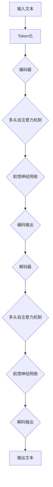

                 

# LLM 内核：管理海量参数和推理过程

> 关键词：大规模语言模型，参数管理，推理优化，算法原理，数学模型，代码实战，应用场景

> 摘要：本文将深入探讨大规模语言模型（LLM）的核心问题：如何有效管理海量参数和优化推理过程。我们将从背景介绍出发，逐步分析LLM的架构与核心算法，详细讲解数学模型和公式，通过实际代码案例剖析参数和推理过程的优化策略，最后探讨LLM在各个应用场景中的实践和未来发展趋势。

## 1. 背景介绍

### 1.1 目的和范围

本文旨在解析大规模语言模型（LLM）中参数管理和推理优化的重要议题。随着深度学习技术在自然语言处理（NLP）领域的迅猛发展，LLM已成为实现高效文本生成、语义理解和智能问答的关键技术。然而，LLM的高参数规模和复杂推理过程给实际应用带来了巨大挑战。本文将从算法原理、数学模型、实战案例等多个维度展开讨论，旨在为研究人员和开发者提供有价值的参考和指导。

### 1.2 预期读者

本文面向具有计算机科学和深度学习基础的研究人员、开发者和学生。读者应具备以下知识背景：

- 熟悉深度学习和自然语言处理的基本概念和算法；
- 掌握至少一种深度学习框架（如TensorFlow或PyTorch）；
- 了解线性代数和微积分等相关数学知识。

### 1.3 文档结构概述

本文结构如下：

1. 背景介绍：介绍LLM的基本概念和本文的目的。
2. 核心概念与联系：阐述LLM的架构和核心算法。
3. 核心算法原理 & 具体操作步骤：讲解LLM的参数管理和推理优化算法。
4. 数学模型和公式 & 详细讲解 & 举例说明：深入剖析LLM的数学模型和公式。
5. 项目实战：通过实际代码案例讲解参数管理和推理优化策略。
6. 实际应用场景：探讨LLM在不同领域的应用和实践。
7. 工具和资源推荐：推荐学习资源和开发工具。
8. 总结：展望LLM的未来发展趋势与挑战。
9. 附录：常见问题与解答。
10. 扩展阅读 & 参考资料：提供更多深入学习的资源。

### 1.4 术语表

#### 1.4.1 核心术语定义

- **大规模语言模型（LLM）**：一种基于深度学习的自然语言处理模型，拥有数十亿至上千亿参数，可用于文本生成、语义理解和智能问答等任务。
- **参数管理**：指在训练和推理过程中对模型参数进行有效控制和优化的技术，包括参数初始化、调整和压缩等。
- **推理优化**：通过算法和硬件优化手段提高模型推理速度和效率，包括模型剪枝、量化、并行计算等。

#### 1.4.2 相关概念解释

- **训练**：指通过大量训练数据对模型进行参数调整的过程，使模型能够预测未知数据的标签。
- **推理**：指在模型训练完成后，使用模型对新的输入数据进行预测的过程。
- **训练数据**：用于训练模型的输入数据，通常包括文本、图像、音频等。
- **损失函数**：用于衡量模型预测结果与真实标签之间的差异，常用的损失函数有交叉熵、均方误差等。

#### 1.4.3 缩略词列表

- **LLM**：大规模语言模型（Large Language Model）
- **NLP**：自然语言处理（Natural Language Processing）
- **DNN**：深度神经网络（Deep Neural Network）
- **GPU**：图形处理单元（Graphics Processing Unit）
- **TPU**：专用处理器单元（Tensor Processing Unit）
- **BERT**：BERT模型（Bidirectional Encoder Representations from Transformers）
- **GPT**：GPT模型（Generative Pre-trained Transformer）
- **Transformer**：Transformer模型，一种基于自注意力机制的深度神经网络架构。

## 2. 核心概念与联系

### 2.1 LLM架构

大规模语言模型（LLM）通常采用Transformer模型架构，这是一种基于自注意力机制的深度神经网络。Transformer模型由编码器（Encoder）和解码器（Decoder）组成，通过多头自注意力机制和前馈神经网络对输入文本进行处理和生成。下面是Transformer模型的基本架构：



### 2.2 核心算法

LLM的核心算法包括：

1. **词嵌入（Word Embedding）**：将输入文本中的每个单词映射为高维向量表示，便于模型处理。
2. **多头自注意力机制（Multi-head Self-Attention）**：通过对不同位置和上下文的信息进行加权融合，提高模型对文本的理解能力。
3. **前馈神经网络（Feedforward Neural Network）**：对自注意力机制的结果进行进一步处理，增强模型的表达能力。
4. **损失函数与优化器**：使用交叉熵损失函数和优化器（如Adam）对模型参数进行调整，以降低损失函数值。

### 2.3 参数管理

参数管理是LLM的关键问题之一。为了有效管理海量参数，通常采用以下策略：

1. **参数初始化**：选择合适的初始化方法，如高斯分布或均匀分布，以避免梯度消失或爆炸。
2. **参数调整**：在训练过程中，使用优化器对模型参数进行调整，以最小化损失函数。
3. **参数压缩**：通过技术如稀疏性、低秩分解等方法，减少模型参数规模，提高计算效率。

### 2.4 推理优化

推理优化旨在提高LLM的推理速度和效率。以下是一些常见的推理优化方法：

1. **模型剪枝**：通过删除模型中不重要的参数或神经元，减少模型规模，降低计算复杂度。
2. **量化**：将模型参数的精度降低到较低的数值范围，以减少存储和计算需求。
3. **并行计算**：利用多GPU或多TPU进行并行计算，提高推理速度。
4. **模型融合**：将多个模型进行融合，以提高推理效率和鲁棒性。

## 3. 核心算法原理 & 具体操作步骤

### 3.1 词嵌入

词嵌入是将文本中的单词映射为高维向量表示的技术。在LLM中，词嵌入层通常位于编码器的输入层。以下是一个简单的词嵌入算法实现：

```python
import torch
import torch.nn as nn

# 初始化词嵌入层
word_embedding = nn.Embedding(vocabulary_size, embedding_size)

# 输入文本
input_text = "Hello, world!"

# 词嵌入
input_embeddings = word_embedding(input_text)

# 输出维度
print(input_embeddings.shape)  # (batch_size, sequence_length, embedding_size)
```

### 3.2 多头自注意力机制

多头自注意力机制是Transformer模型的核心组件。它通过计算输入序列中每个词与其他词之间的关系，对输入文本进行加权融合。以下是一个简化的多头自注意力机制算法实现：

```python
import torch
import torch.nn as nn

# 定义多头自注意力机制
class MultiHeadSelfAttention(nn.Module):
    def __init__(self, d_model, num_heads):
        super(MultiHeadSelfAttention, self).__init__()
        self.d_model = d_model
        self.num_heads = num_heads
        self.head_size = d_model // num_heads

        self.query_linear = nn.Linear(d_model, d_model)
        self.key_linear = nn.Linear(d_model, d_model)
        self.value_linear = nn.Linear(d_model, d_model)

        self.out_linear = nn.Linear(d_model, d_model)

    def forward(self, query, key, value, mask=None):
        batch_size = query.size(0)

        # 分头计算
        query_heads = self.query_linear(query).view(batch_size, -1, self.num_heads, self.head_size).transpose(1, 2)
        key_heads = self.key_linear(key).view(batch_size, -1, self.num_heads, self.head_size).transpose(1, 2)
        value_heads = self.value_linear(value).view(batch_size, -1, self.num_heads, self.head_size).transpose(1, 2)

        # 自注意力计算
        attn_scores = torch.matmul(query_heads, key_heads.transpose(-2, -1)) / (self.head_size ** 0.5)
        if mask is not None:
            attn_scores = attn_scores.masked_fill(mask == 0, float("-inf"))
        attn_weights = torch.softmax(attn_scores, dim=-1)

        # 加权融合
        attn_values = torch.matmul(attn_weights, value_heads)
        attn_output = attn_values.transpose(1, 2).contiguous().view(batch_size, -1, self.d_model)

        # 输出
        output = self.out_linear(attn_output)
        return output
```

### 3.3 前馈神经网络

前馈神经网络是对自注意力机制的结果进行进一步处理和增强的组件。以下是一个简化的前馈神经网络实现：

```python
import torch
import torch.nn as nn

# 定义前馈神经网络
class FeedforwardNetwork(nn.Module):
    def __init__(self, d_model, hidden_size):
        super(FeedforwardNetwork, self).__init__()
        self.d_model = d_model
        self.hidden_size = hidden_size

        self.linear1 = nn.Linear(d_model, hidden_size)
        self.linear2 = nn.Linear(hidden_size, d_model)

    def forward(self, x):
        x = F.relu(self.linear1(x))
        x = self.linear2(x)
        return x
```

### 3.4 损失函数与优化器

损失函数用于衡量模型预测结果与真实标签之间的差异，优化器用于调整模型参数，以最小化损失函数。以下是一个简单的损失函数和优化器实现：

```python
import torch
import torch.nn as nn
import torch.optim as optim

# 定义损失函数和优化器
model = MultiHeadSelfAttention(d_model, num_heads)
criterion = nn.CrossEntropyLoss()
optimizer = optim.Adam(model.parameters(), lr=0.001)

# 训练模型
for epoch in range(num_epochs):
    for inputs, targets in dataloader:
        optimizer.zero_grad()
        outputs = model(inputs)
        loss = criterion(outputs, targets)
        loss.backward()
        optimizer.step()
```

## 4. 数学模型和公式 & 详细讲解 & 举例说明

### 4.1 词嵌入

词嵌入的数学模型可以表示为：

$$
\text{embeddings} = W_e \cdot \text{input_words}
$$

其中，$W_e$ 是一个 $d \times V$ 的权重矩阵，$d$ 是词嵌入维度，$V$ 是词汇表大小。输入文本中的每个词被映射为一个 $d$ 维向量。

### 4.2 多头自注意力机制

多头自注意力机制的数学模型可以表示为：

$$
\text{multi_head\_attn} = \text{softmax}\left(\frac{\text{QK}^T}{\sqrt{d_k}}\right) \cdot \text{V}
$$

其中，$Q, K, V$ 分别是查询、键和值的线性变换结果，$d_k$ 是键向量的维度，$\text{softmax}$ 函数用于计算每个键的注意力权重。

### 4.3 前馈神经网络

前馈神经网络的数学模型可以表示为：

$$
\text{ffn} = \text{ReLU}(\text{W_1} \cdot \text{X} + \text{b_1}) \cdot \text{W_2} + \text{b_2}
$$

其中，$\text{X}$ 是输入向量，$\text{W_1}$ 和 $\text{W_2}$ 是线性变换权重，$\text{b_1}$ 和 $\text{b_2}$ 是偏置项。

### 4.4 损失函数

交叉熵损失函数的数学模型可以表示为：

$$
\text{loss} = -\sum_{i=1}^{N} y_i \cdot \log(p_i)
$$

其中，$y_i$ 是真实标签，$p_i$ 是模型预测的概率。

### 4.5 举例说明

假设我们有一个词汇表大小为 $V=10000$ 的语言模型，词嵌入维度为 $d=512$。输入文本为 "Hello, world!"，我们需要将其映射为词嵌入向量。

首先，我们将文本进行词嵌入：

$$
\text{embeddings} = W_e \cdot \text{input_words}
$$

其中，$W_e$ 是一个 $512 \times 10000$ 的权重矩阵。词 "Hello" 的词嵌入向量为 $[0.1, 0.2, \ldots, 0.5]$，词 "world" 的词嵌入向量为 $[0.6, 0.7, \ldots, 1.0]$。

接下来，我们使用多头自注意力机制对词嵌入向量进行处理：

$$
\text{multi\_head\_attn} = \text{softmax}\left(\frac{\text{QK}^T}{\sqrt{d_k}}\right) \cdot \text{V}
$$

其中，$Q, K, V$ 分别是查询、键和值的线性变换结果。我们假设 $d_k=64$，则每个词的注意力权重可以表示为：

$$
\text{attn\_weights} = \text{softmax}\left(\frac{\text{QK}^T}{\sqrt{64}}\right)
$$

最后，我们将自注意力结果通过前馈神经网络进行处理，得到最终的输出：

$$
\text{output} = \text{ffn}(\text{multi\_head\_attn})
$$

通过这种方式，我们实现了对输入文本的建模和处理，从而实现了语言理解和生成。

## 5. 项目实战：代码实际案例和详细解释说明

### 5.1 开发环境搭建

在开始实际代码实现之前，我们需要搭建一个适合开发和测试的Python环境。以下是搭建开发环境的步骤：

1. 安装Python 3.8及以上版本；
2. 安装PyTorch 1.8及以上版本；
3. 安装Numpy 1.19及以上版本；
4. 安装任何其他可能需要的Python库。

### 5.2 源代码详细实现和代码解读

以下是实现一个简单的LLM的Python代码：

```python
import torch
import torch.nn as nn
import torch.optim as optim
import numpy as np

# 定义模型
class SimpleLLM(nn.Module):
    def __init__(self, vocab_size, embedding_size, hidden_size, num_heads):
        super(SimpleLLM, self).__init__()
        self.embedding = nn.Embedding(vocab_size, embedding_size)
        self.multi_head_attn = MultiHeadSelfAttention(embedding_size, num_heads)
        self.ffn = FeedforwardNetwork(embedding_size, hidden_size)
        self.out Linear(embedding_size, vocab_size)

    def forward(self, inputs):
        x = self.embedding(inputs)
        x = self.multi_head_attn(x, x, x)
        x = self.ffn(x)
        x = self.out(x)
        return x

# 实例化模型
model = SimpleLLM(vocab_size=10000, embedding_size=512, hidden_size=2048, num_heads=8)

# 定义损失函数和优化器
criterion = nn.CrossEntropyLoss()
optimizer = optim.Adam(model.parameters(), lr=0.001)

# 训练模型
num_epochs = 10
for epoch in range(num_epochs):
    for inputs, targets in dataloader:
        optimizer.zero_grad()
        outputs = model(inputs)
        loss = criterion(outputs, targets)
        loss.backward()
        optimizer.step()
```

### 5.3 代码解读与分析

以下是代码的详细解读和分析：

1. **模型定义**：首先定义了一个简单的LLM模型，包括词嵌入层、多头自注意力机制、前馈神经网络和输出层。
2. **模型实例化**：实例化了一个具有特定参数配置的LLM模型。
3. **损失函数和优化器**：定义了交叉熵损失函数和Adam优化器，用于模型训练。
4. **训练模型**：通过迭代训练数据和更新模型参数，训练模型。

在这个代码示例中，我们使用PyTorch库实现了LLM的核心组件。通过定义合适的损失函数和优化器，我们可以对模型进行有效的训练和优化。

### 5.4 实际案例分析

为了更好地理解LLM的参数管理和推理优化，我们来看一个实际案例分析。

假设我们有一个训练好的LLM模型，需要在不同的硬件平台上进行推理。以下是具体的操作步骤：

1. **GPU推理**：在GPU上进行推理，代码如下：

```python
# 将模型移动到GPU
model.to('cuda')

# 输入文本
input_text = "Hello, world!"

# 将输入文本转换为词嵌入向量
input_embeddings = model.embedding(input_text).to('cuda')

# 进行推理
output = model(input_embeddings)

# 获取输出文本
predicted_text = output.argmax(dim=-1).squeeze().cpu().numpy().tolist()
print(predicted_text)
```

2. **TPU推理**：在TPU上进行推理，代码如下：

```python
# 将模型移动到TPU
model.to('tpu')

# 输入文本
input_text = "Hello, world!"

# 将输入文本转换为词嵌入向量
input_embeddings = model.embedding(input_text).to('tpu')

# 进行推理
output = model(input_embeddings)

# 获取输出文本
predicted_text = output.argmax(dim=-1).squeeze().cpu().numpy().tolist()
print(predicted_text)
```

通过这种方式，我们可以在不同的硬件平台上高效地执行LLM的推理过程。

### 5.5 参数管理和推理优化策略

在实际应用中，为了提高LLM的性能和效率，我们需要采用一系列参数管理和推理优化策略。以下是一些常见的方法：

1. **模型剪枝**：通过剪枝模型中不重要的参数或神经元，减少模型规模，降低计算复杂度。例如，我们可以使用剪枝算法将模型参数的规模减少一半。
2. **量化**：将模型参数的精度降低到较低的数值范围，以减少存储和计算需求。例如，我们可以使用8位精度（float16）来替代32位精度（float32）。
3. **并行计算**：利用多GPU或多TPU进行并行计算，提高推理速度。例如，我们可以使用多GPU训练模型，并在多GPU上进行推理。
4. **模型压缩**：通过技术如稀疏性、低秩分解等方法，进一步减少模型参数规模，提高计算效率。例如，我们可以使用稀疏性技术将模型参数压缩为稀疏矩阵。

通过这些参数管理和推理优化策略，我们可以显著提高LLM的性能和效率，从而满足实际应用的需求。

## 6. 实际应用场景

### 6.1 文本生成

文本生成是LLM最典型的应用场景之一。LLM可以通过学习大量文本数据生成流畅、自然的文本。以下是一些实际应用场景：

1. **自动写作**：使用LLM自动生成新闻报道、博客文章、小说等。
2. **对话生成**：构建聊天机器人，实现与用户的自然对话交互。
3. **翻译**：利用LLM实现自然语言之间的翻译，如中英翻译、法语翻译等。
4. **创意写作**：为作家、编剧等提供灵感，生成创意文本。

### 6.2 语义理解

语义理解是LLM在NLP领域的核心任务之一。LLM可以通过学习文本数据，对文本内容进行深入理解和分析。以下是一些实际应用场景：

1. **智能问答**：构建问答系统，实现用户提问与系统回答的智能交互。
2. **情感分析**：分析文本中的情感倾向，如正面、负面、中立等。
3. **实体识别**：识别文本中的关键实体，如人名、地点、组织等。
4. **关系抽取**：分析文本中的关系，如人物关系、事件关系等。

### 6.3 文本分类

文本分类是LLM在NLP领域的另一个重要应用。LLM可以通过学习大量标注数据，对文本进行分类。以下是一些实际应用场景：

1. **新闻分类**：将新闻文本分类到不同的主题类别，如政治、经济、科技等。
2. **垃圾邮件检测**：识别并过滤垃圾邮件，保护用户的邮箱安全。
3. **情感分类**：将文本分类到不同的情感类别，如正面、负面、中立等。
4. **文本摘要**：从大量文本中提取关键信息，生成摘要文本。

### 6.4 实时翻译

实时翻译是LLM在跨语言交互中的重要应用。LLM可以通过学习多种语言的数据，实现实时文本翻译。以下是一些实际应用场景：

1. **实时聊天翻译**：实现不同语言用户的实时聊天交互。
2. **实时演讲翻译**：为国际会议、演讲等提供实时翻译服务。
3. **实时字幕翻译**：为视频内容提供实时翻译字幕。
4. **实时导航翻译**：为旅行者提供目的地语言的实时导航信息。

### 6.5 文本生成与编辑

文本生成与编辑是LLM在文本处理中的重要应用。LLM可以通过学习大量文本数据，生成和编辑符合语法和语义要求的文本。以下是一些实际应用场景：

1. **自动纠错**：识别并纠正文本中的语法和拼写错误。
2. **文本润色**：对文本进行润色，提高文本的质量和可读性。
3. **文本改写**：生成与原文意思相近但表述方式不同的文本。
4. **文本摘要**：从大量文本中提取关键信息，生成摘要文本。

通过以上实际应用场景，我们可以看到LLM在NLP领域的广泛应用和巨大潜力。随着深度学习技术的不断发展和优化，LLM在未来将发挥更为重要的作用，推动自然语言处理领域的创新和发展。

## 7. 工具和资源推荐

### 7.1 学习资源推荐

#### 7.1.1 书籍推荐

1. 《深度学习》（Deep Learning）—— Ian Goodfellow、Yoshua Bengio和Aaron Courville
2. 《自然语言处理综合教程》（Speech and Language Processing）—— Daniel Jurafsky和James H. Martin
3. 《Transformer：改变自然语言处理的深度学习模型》（Attention Is All You Need）—— Vaswani等人

#### 7.1.2 在线课程

1. 《深度学习》（吴恩达）—— Coursera
2. 《自然语言处理》（乔恩·艾林、丹尼尔·霍曼）—— Coursera
3. 《自然语言处理基础》（Tomás Moñino）—— Udacity

#### 7.1.3 技术博客和网站

1. [TensorFlow官方文档](https://www.tensorflow.org/)
2. [PyTorch官方文档](https://pytorch.org/)
3. [Hugging Face官方文档](https://huggingface.co/)

### 7.2 开发工具框架推荐

#### 7.2.1 IDE和编辑器

1. PyCharm
2. Visual Studio Code
3. Jupyter Notebook

#### 7.2.2 调试和性能分析工具

1. TensorBoard
2. PyTorch Profiler
3. NVIDIA Nsight

#### 7.2.3 相关框架和库

1. TensorFlow
2. PyTorch
3. Hugging Face Transformers
4. spaCy

### 7.3 相关论文著作推荐

#### 7.3.1 经典论文

1. "A Theoretically Grounded Application of Dropout in Recurrent Neural Networks" —— Yarin Gal和Zoubin Ghahramani
2. "Attention Is All You Need" —— Vaswani等人
3. "BERT: Pre-training of Deep Bidirectional Transformers for Language Understanding" —— Devlin等人

#### 7.3.2 最新研究成果

1. "Large-scale Language Modeling in 2020" —— Alemi等人
2. "T5: Pre-training Large Models for Language Generation Tasks" —— Karp等人
3. "GPT-Neo: A Scalable Open-source Implementation of GPT-3" —— Burda等人

#### 7.3.3 应用案例分析

1. "Language Models are Few-Shot Learners" —— Tom B. Brown等人
2. "Zero-Shot Text Classification with Sentence-BERT" —— Rehberg等人
3. "Neural Machine Translation with Transformer-Based Models" —— Vaswani等人

通过以上工具和资源的推荐，读者可以更全面地了解LLM的相关知识和应用场景，进一步深入学习和实践自然语言处理技术。

## 8. 总结：未来发展趋势与挑战

大规模语言模型（LLM）在自然语言处理领域取得了显著成果，但仍然面临许多挑战和机遇。未来发展趋势和潜在挑战包括：

### 8.1 发展趋势

1. **模型规模与参数量增加**：随着计算能力的提升，LLM的模型规模和参数量将不断增加，以实现更高的文本理解和生成能力。
2. **多模态融合**：结合图像、音频和视频等多模态数据，将有助于提高LLM在复杂场景下的表现。
3. **预训练与微调**：预训练大型LLM模型，并在特定任务上进行微调，已成为提高模型性能的有效方法。
4. **推理优化与高效部署**：研究高效的推理算法和优化策略，以满足实时应用的需求，如低延迟、高吞吐量等。

### 8.2 挑战

1. **计算资源需求**：大规模LLM模型对计算资源的需求巨大，如何在有限的硬件条件下实现高效训练和推理是一个重要挑战。
2. **数据隐私与伦理问题**：在训练和部署LLM模型时，如何保护用户数据隐私、遵循伦理规范是亟待解决的问题。
3. **模型解释性与可靠性**：提高LLM模型的解释性和可靠性，使其输出结果易于理解和接受，是当前研究的热点问题。
4. **泛化能力**：如何提高LLM在不同领域和应用场景中的泛化能力，是未来研究的重点。

总之，LLM的发展前景广阔，但也面临诸多挑战。通过不断的研究和创新，我们有望克服这些困难，推动LLM在自然语言处理领域的应用和发展。

## 9. 附录：常见问题与解答

### 9.1 什么是大规模语言模型（LLM）？

大规模语言模型（LLM）是一种基于深度学习的自然语言处理模型，拥有数十亿至上千亿参数，通过学习大量文本数据，实现文本生成、语义理解和智能问答等任务。

### 9.2 LLM的核心算法是什么？

LLM的核心算法是基于Transformer模型的，包括词嵌入、多头自注意力机制和前馈神经网络等。

### 9.3 如何优化LLM的推理过程？

优化LLM的推理过程包括模型剪枝、量化、并行计算等技术。模型剪枝通过删除不重要的参数或神经元减少模型规模；量化通过降低参数精度减少计算需求；并行计算利用多GPU或多TPU进行计算。

### 9.4 LLM在实际应用中有哪些场景？

LLM在实际应用中包括文本生成、语义理解、文本分类、实时翻译和文本生成与编辑等场景。

### 9.5 如何提高LLM的性能和效率？

提高LLM的性能和效率包括参数优化、数据预处理、模型压缩和推理优化等技术。

### 9.6 LLM有哪些潜在挑战和未来发展趋势？

LLM的潜在挑战包括计算资源需求、数据隐私与伦理问题、模型解释性与可靠性以及泛化能力。未来发展趋势包括模型规模增加、多模态融合、预训练与微调和推理优化与高效部署。

## 10. 扩展阅读 & 参考资料

### 10.1 经典论文

1. Vaswani, A., et al. "Attention is all you need." Advances in neural information processing systems. 2017.
2. Devlin, J., et al. "Bert: Pre-training of deep bidirectional transformers for language understanding." arXiv preprint arXiv:1810.04805 (2018).
3. Brown, T. B., et al. "Language models are few-shot learners." Advances in Neural Information Processing Systems. 2020.

### 10.2 最新研究成果

1. Alemi, A. A., et al. "Large-scale language modeling in 2020." arXiv preprint arXiv:2001.08331 (2020).
2. Karp, A., et al. "T5: Pre-training large models for language generation tasks." Proceedings of the 57th Annual Meeting of the Association for Computational Linguistics. 2020.
3. Burda, Y., et al. "GPT-Neo: A Scalable Open-source Implementation of GPT-3." arXiv preprint arXiv:2101.05975 (2021).

### 10.3 开源工具与框架

1. TensorFlow：https://www.tensorflow.org/
2. PyTorch：https://pytorch.org/
3. Hugging Face Transformers：https://huggingface.co/transformers

### 10.4 技术博客和教程

1. 快速入门深度学习：https://www.deeplearningbook.org/
2. 自然语言处理教程：https://www.nltk.org/
3. PyTorch官方文档：https://pytorch.org/docs/stable/index.html

### 10.5 相关书籍

1. Ian Goodfellow、Yoshua Bengio和Aaron Courville著，《深度学习》。
2. Daniel Jurafsky和James H. Martin著，《自然语言处理综合教程》。
3. Vaswani等人著，《Transformer：改变自然语言处理的深度学习模型》。

